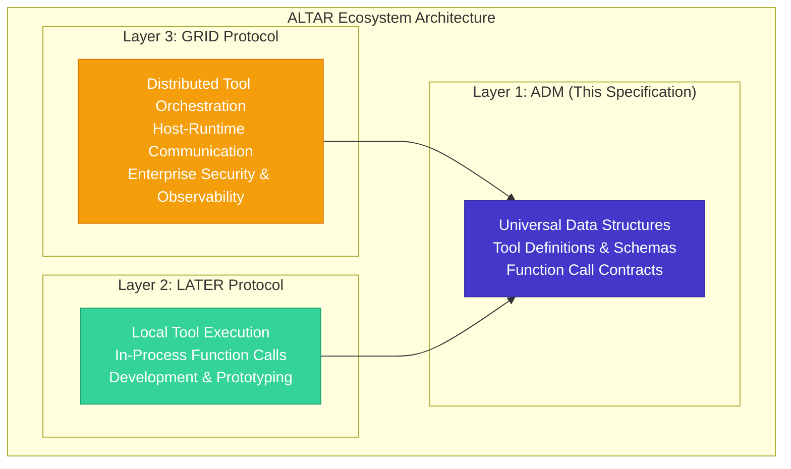
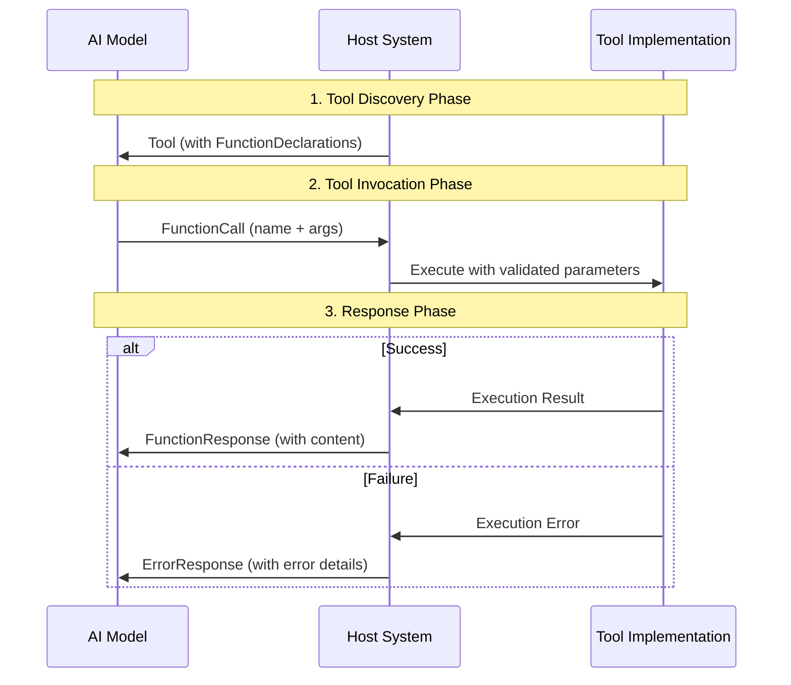
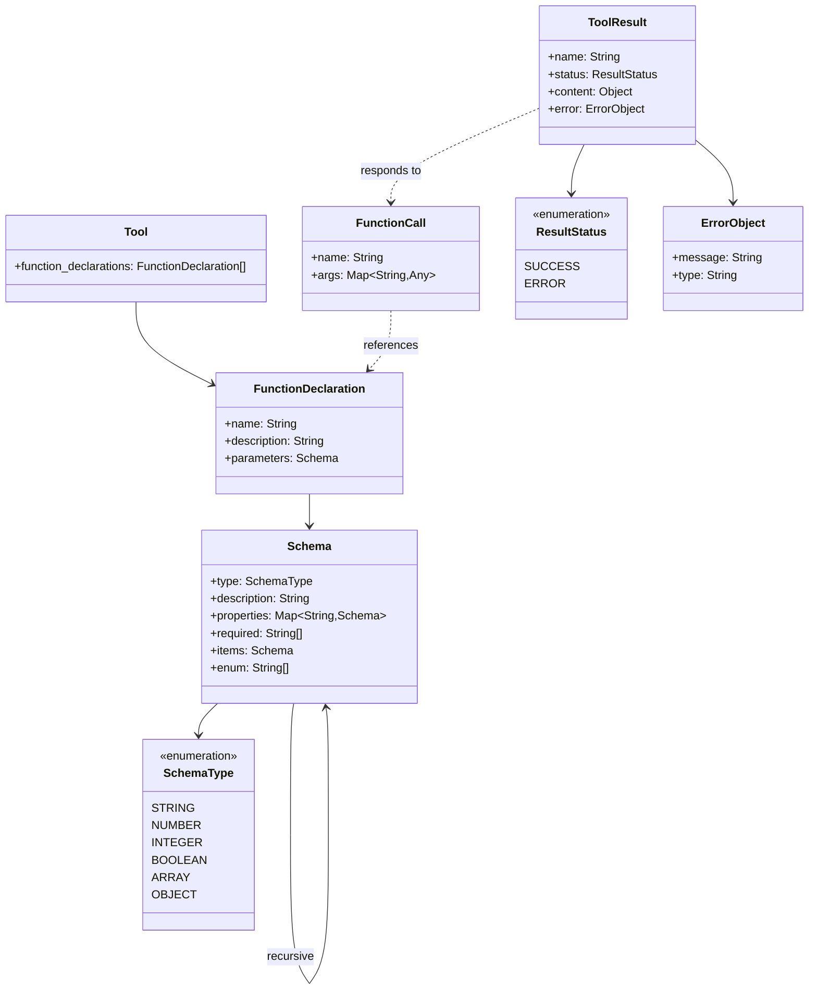

# ALTAR Data Model (ADM) v1.0 Design Document

**Version:** 1.0.0
**Status:** Final

## Overview

The ALTAR Data Model (ADM) v1.0 specification defines the foundational, language-agnostic data structures for AI tools and their interactions within the ALTAR ecosystem. This design synthesizes proven patterns from industry-leading LLM function calling APIs, particularly Google Gemini and OpenAI, while maintaining strict separation from execution and transport concerns.

The ADM serves as the universal contract that enables seamless interoperability between the LATER (Local Agent & Tool Execution Runtime) protocol for in-process tool execution and the GRID protocol for distributed tool orchestration. By establishing this common foundation, the ADM ensures that tools defined in one context can be seamlessly promoted or migrated to another without structural changes.

## Architecture

### Three-Layer Architecture Alignment

The ADM occupies the foundational layer of the ALTAR ecosystem's three-layer architecture:



### Design Principles

1. **Industry Compatibility**: Data structures directly align with Google Gemini's function calling API and OpenAPI 3.0 specifications
2. **Structural Purity**: No execution, transport, or session management concerns
3. **Language Neutrality**: Definitions use universal types that map to any programming language
4. **Extensibility**: Forward-compatible design allowing future enhancements
5. **Precision**: Unambiguous specifications preventing implementation inconsistencies

### Core Data Flow

The ADM defines the complete data flow for AI tool interactions:



## Components and Interfaces

### Data Structure Hierarchy

The ADM defines a hierarchical set of data structures, each serving a specific role in the tool interaction lifecycle:



### Type System Design

The ADM implements a robust type system based on OpenAPI 3.0 specifications:

#### Primitive Types
- **STRING**: UTF-8 encoded text with optional enumeration constraints
- **NUMBER**: IEEE 754 double-precision floating-point numbers
- **INTEGER**: 64-bit signed integers
- **BOOLEAN**: True/false values

#### Complex Types
- **ARRAY**: Ordered collections with homogeneous element types
- **OBJECT**: Key-value maps with structured property schemas

#### Type Validation Rules
1. All parameters must conform to their declared schema
2. Required properties must be present in OBJECT types
3. Array elements must match the declared items schema
4. Enum values must be from the specified list
5. Nested objects support unlimited depth

## Data Models

### Tool Structure

The `Tool` serves as the top-level container for AI capabilities:

```json
{
  "function_declarations": [
    {
      "name": "function_name",
      "description": "Function description",
      "parameters": { /* Schema object */ }
    }
  ]
}
```

**Design Rationale**: The Tool structure is designed for extensibility, allowing future versions to add other capability types (e.g., retrieval, search) while maintaining backward compatibility.

### FunctionDeclaration Structure

The `FunctionDeclaration` defines individual tool capabilities:

```json
{
  "name": "get_weather_forecast",
  "description": "Retrieves weather forecast for a specified location and time period",
  "parameters": {
    "type": "OBJECT",
    "properties": {
      "location": {
        "type": "STRING",
        "description": "City and state or country, e.g., 'San Francisco, CA'"
      },
      "days": {
        "type": "INTEGER",
        "description": "Number of days to forecast (1-7)"
      },
      "units": {
        "type": "STRING",
        "enum": ["celsius", "fahrenheit"],
        "description": "Temperature units"
      }
    },
    "required": ["location"]
  }
}
```

**Design Rationale**: The structure directly mirrors Google Gemini's function calling API, ensuring seamless integration with existing LLM clients while providing comprehensive parameter validation.

### Schema System Design

The `Schema` object provides recursive type definitions:

```json
{
  "type": "OBJECT",
  "description": "Flight booking request",
  "properties": {
    "passengers": {
      "type": "ARRAY",
      "description": "List of passengers",
      "items": {
        "type": "OBJECT",
        "properties": {
          "name": { "type": "STRING" },
          "age": { "type": "INTEGER" },
          "preferences": {
            "type": "OBJECT",
            "properties": {
              "meal": { "type": "STRING", "enum": ["vegetarian", "vegan", "regular"] },
              "seat": { "type": "STRING" }
            }
          }
        },
        "required": ["name", "age"]
      }
    }
  },
  "required": ["passengers"]
}
```

**Design Rationale**: The recursive schema design supports arbitrarily complex data structures while maintaining validation integrity at every level.

### Function Call and Response Design

The interaction model uses a discriminated union pattern for unambiguous result handling:

#### FunctionCall Structure
```json
{
  "name": "get_weather_forecast",
  "args": {
    "location": "Tokyo, Japan",
    "days": 3,
    "units": "celsius"
  }
}
```

#### ToolResult Structure (Success Case)
```json
{
  "name": "get_weather_forecast",
  "status": "SUCCESS",
  "content": {
    "location": "Tokyo, Japan",
    "forecast": [
      { "day": 1, "temperature": 22, "conditions": "sunny" },
      { "day": 2, "temperature": 19, "conditions": "cloudy" },
      { "day": 3, "temperature": 17, "conditions": "rainy" }
    ]
  }
}
```

#### ToolResult Structure (Error Case)
```json
{
  "name": "get_weather_forecast",
  "status": "ERROR",
  "error": {
    "message": "Invalid location: 'Nonexistent City' could not be found",
    "type": "PARAMETER_VALIDATION_FAILED"
  }
}
```

**Design Rationale**: The discriminated union pattern with explicit status fields eliminates parsing ambiguity and provides type-safe result handling in strongly-typed languages. This approach is more robust than inspecting nested object keys and aligns with modern protocol design patterns.

## Error Handling

### Error Classification

The ADM defines a structured approach to error handling:

1. **Validation Errors**: Parameter schema violations
2. **Execution Errors**: Tool implementation failures
3. **System Errors**: Infrastructure or resource issues

### Error Response Design

Error responses are embedded within the ToolResult structure and follow a consistent format:
- **message**: Human-readable error description
- **type**: Optional standardized error code for programmatic handling
- **context**: Additional error-specific information (future extension)

### Error Propagation Strategy

The ADM ensures that errors are:
1. Structured and machine-readable
2. Informative for debugging
3. Safe for AI model consumption
4. Consistent across all tool implementations

## Testing Strategy

### Schema Validation Testing

1. **Type Conformance**: Verify all primitive and complex types validate correctly
2. **Required Field Validation**: Ensure required properties are enforced
3. **Enum Constraint Testing**: Validate enumeration restrictions
4. **Recursive Schema Testing**: Test deeply nested object structures
5. **Array Validation**: Verify homogeneous array element type checking

### Compatibility Testing

1. **Gemini API Compatibility**: Verify structures work with Google Gemini function calling
2. **OpenAI Compatibility**: Test adaptation to OpenAI function calling format
3. **Cross-Language Serialization**: Ensure JSON serialization works across languages
4. **Version Compatibility**: Test forward and backward compatibility scenarios

### Integration Testing

1. **LATER Protocol Integration**: Verify ADM structures work with local execution
2. **GRID Protocol Integration**: Test compatibility with distributed execution
3. **Multi-Tool Scenarios**: Validate complex tool interaction patterns
4. **Error Handling Integration**: Test error propagation through protocol layers

### Performance Testing

1. **Schema Validation Performance**: Measure validation overhead for complex schemas
2. **Serialization Performance**: Test JSON encoding/decoding efficiency
3. **Memory Usage**: Verify efficient memory usage for large tool definitions
4. **Scalability**: Test behavior with hundreds of function declarations

## Serialization Format

**JSON is the canonical serialization format** for all ADM data structures when represented in textual form. This ensures cross-language compatibility and consistent interchange between different implementations. All ADM-compliant systems must support JSON serialization and deserialization of the defined data structures.

### Serialization Requirements

1. **Standard JSON**: All structures must serialize to valid JSON as defined by RFC 7159
2. **UTF-8 Encoding**: String values must use UTF-8 encoding
3. **Numeric Precision**: Numbers should preserve precision according to IEEE 754 standards
4. **Field Ordering**: Field order in JSON objects is not significant
5. **Null Handling**: Absent optional fields should be omitted rather than set to null

## Implementation Considerations

### Language-Neutral Design

The ADM specification is designed to be implementable in any programming language:

1. **Type Mapping**: Universal types map to language-specific equivalents
2. **JSON Serialization**: Standard JSON ensures cross-language compatibility
3. **Validation Logic**: Schema validation can be implemented using standard libraries
4. **Extension Points**: Future enhancements maintain backward compatibility

### Security Considerations

While the ADM focuses on data structures, it includes security-conscious design:

1. **Parameter Validation**: Strict schema validation prevents injection attacks
2. **Type Safety**: Strong typing prevents data corruption
3. **Error Information**: Error messages avoid exposing sensitive system details
4. **Extensibility**: Future security enhancements can be added without breaking changes

### Performance Optimization

The ADM design considers performance implications:

1. **Efficient Validation**: Schema validation can be optimized with caching
2. **Minimal Overhead**: Structures include only essential fields
3. **Streaming Support**: Design allows for future streaming enhancements
4. **Batch Operations**: Structure supports future batch operation extensions

## Protocol Extension Points

The ADM v1.0 specification is designed with forward compatibility in mind, providing clear extension mechanisms that allow the protocol to evolve while maintaining backward compatibility with existing implementations.

### Extension Philosophy

The ADM follows a conservative extension approach that prioritizes stability and compatibility:

1. **Additive Extensions**: New features are added through new optional fields rather than modifying existing structures
2. **Namespace Preservation**: Core field names are reserved to prevent conflicts with future extensions
3. **Version Tolerance**: Implementations must gracefully handle unknown fields from future versions
4. **Semantic Stability**: Existing field semantics remain unchanged across versions

### Reserved Field Namespaces

To ensure future extensibility without breaking existing implementations, the following field naming conventions are reserved:

#### Core Reserved Prefixes
- **`adm_`**: Reserved for core ADM protocol extensions
- **`later_`**: Reserved for LATER protocol-specific extensions
- **`grid_`**: Reserved for GRID protocol-specific extensions
- **`x-`**: Reserved for experimental or vendor-specific extensions

#### Structure-Specific Reserved Fields

**Tool Structure Reserved Fields:**
```json
{
  "function_declarations": [...],
  "adm_version": "1.0",           // Reserved: Protocol version identifier
  "adm_metadata": {...},          // Reserved: Tool-level metadata
  "adm_capabilities": [...],      // Reserved: Future capability types beyond functions
  "adm_extensions": {...}         // Reserved: Generic extension point
}
```

**FunctionDeclaration Structure Reserved Fields:**
```json
{
  "name": "function_name",
  "description": "Function description",
  "parameters": {...},
  "adm_deprecated": false,        // Reserved: Deprecation status
  "adm_version_added": "1.0",     // Reserved: Version tracking
  "adm_security": {...},          // Reserved: Security annotations
  "adm_performance": {...}        // Reserved: Performance hints
}
```

**Schema Structure Reserved Fields:**
```json
{
  "type": "OBJECT",
  "description": "Schema description",
  "properties": {...},
  "required": [...],
  "adm_constraints": {...},       // Reserved: Advanced validation rules
  "adm_format": "email",          // Reserved: Format specifications
  "adm_examples": [...],          // Reserved: Example values
  "adm_default": null             // Reserved: Default value specifications
}
```

**ToolResult Structure Reserved Fields:**
```json
{
  "name": "function_name",
  "status": "SUCCESS",
  "content": {...},
  "error": {...},
  "adm_execution_time": 150,      // Reserved: Performance metrics
  "adm_metadata": {...},          // Reserved: Result metadata
  "adm_warnings": [...],          // Reserved: Non-fatal warnings
  "adm_trace_id": "uuid"          // Reserved: Distributed tracing
}
```

### Extension Mechanisms

#### 1. Optional Field Extensions

New optional fields can be added to any structure without breaking compatibility:

```json
{
  "name": "enhanced_function",
  "description": "Function with future enhancements",
  "parameters": {...},
  "adm_rate_limit": {             // Future extension example
    "requests_per_minute": 60,
    "burst_limit": 10
  },
  "adm_caching": {                // Future extension example
    "ttl_seconds": 300,
    "cache_key_fields": ["location"]
  }
}
```

#### 2. Enumeration Extensions

Enumerations can be extended by adding new values while preserving existing ones:

```json
{
  "type": "ENHANCED_STRING",      // Future SchemaType extension
  "adm_string_format": "regex",   // Future format specification
  "adm_validation_pattern": "^[A-Z]{2,3}$"
}
```

#### 3. Capability Type Extensions

The Tool structure supports future capability types beyond function declarations:

```json
{
  "function_declarations": [...],
  "adm_retrieval_capabilities": [ // Future capability type
    {
      "name": "document_search",
      "description": "Search through document corpus",
      "index_type": "vector",
      "supported_formats": ["pdf", "txt", "md"]
    }
  ],
  "adm_streaming_capabilities": [ // Future capability type
    {
      "name": "real_time_data",
      "description": "Stream real-time data updates",
      "protocol": "websocket",
      "data_format": "json"
    }
  ]
}
```

### Compatibility Guidelines

#### Forward Compatibility Requirements

All ADM implementations MUST follow these forward compatibility rules:

1. **Unknown Field Tolerance**: Implementations MUST ignore unknown fields rather than failing
2. **Graceful Degradation**: When encountering unknown capability types, implementations SHOULD continue processing known types
3. **Version Negotiation**: Implementations SHOULD support version negotiation when available
4. **Extension Validation**: Implementations MAY validate known extensions but MUST NOT fail on unknown extensions

#### Backward Compatibility Guarantees

The ADM provides the following backward compatibility guarantees:

1. **Field Semantics**: Existing field meanings will never change
2. **Required Fields**: Fields marked as required will remain required
3. **Type Constraints**: Existing type definitions will not be narrowed
4. **Enumeration Values**: Existing enumeration values will not be removed

#### Implementation Guidelines for Extensions

**Parser Implementation:**
```pseudocode
function parseToolResult(json_data) {
    result = new ToolResult()
    
    // Parse required fields
    result.name = json_data.name
    result.status = json_data.status
    
    // Parse conditional fields based on status
    if (result.status == SUCCESS) {
        result.content = json_data.content
    } else if (result.status == ERROR) {
        result.error = json_data.error
    }
    
    // Parse known extensions
    if (json_data.adm_execution_time) {
        result.execution_time = json_data.adm_execution_time
    }
    
    // Store unknown fields for pass-through
    result.unknown_fields = {}
    for (field, value in json_data) {
        if (!is_known_field(field)) {
            result.unknown_fields[field] = value
        }
    }
    
    return result
}
```

**Serialization Implementation:**
```pseudocode
function serializeToolResult(result) {
    json_data = {}
    
    // Serialize core fields
    json_data.name = result.name
    json_data.status = result.status
    
    if (result.status == SUCCESS && result.content) {
        json_data.content = result.content
    }
    if (result.status == ERROR && result.error) {
        json_data.error = result.error
    }
    
    // Serialize known extensions
    if (result.execution_time) {
        json_data.adm_execution_time = result.execution_time
    }
    
    // Pass through unknown fields
    for (field, value in result.unknown_fields) {
        json_data[field] = value
    }
    
    return json_data
}
```

### Version Evolution Strategy

#### Semantic Versioning

The ADM follows semantic versioning (SemVer) principles:

- **Major Version (X.0.0)**: Breaking changes that require implementation updates
- **Minor Version (1.X.0)**: Backward-compatible feature additions
- **Patch Version (1.0.X)**: Backward-compatible bug fixes and clarifications

#### Version Negotiation

Future versions of the ADM may include version negotiation mechanisms:

```json
{
  "adm_version": "1.2",
  "adm_supported_versions": ["1.0", "1.1", "1.2"],
  "function_declarations": [...]
}
```

#### Migration Pathways

When breaking changes are necessary, the ADM will provide:

1. **Deprecation Notices**: Clear warnings about upcoming changes
2. **Migration Guides**: Step-by-step upgrade instructions
3. **Compatibility Layers**: Temporary support for legacy formats
4. **Validation Tools**: Automated migration and validation utilities

### Extension Best Practices

#### For Protocol Designers

1. **Minimize Breaking Changes**: Prefer additive changes over modifications
2. **Use Reserved Namespaces**: Follow established naming conventions
3. **Document Extensions**: Provide clear specifications for new features
4. **Test Compatibility**: Verify extensions work with existing implementations

#### For Implementation Authors

1. **Implement Unknown Field Handling**: Store and pass through unrecognized fields
2. **Validate Conservatively**: Accept unknown extensions gracefully
3. **Support Version Detection**: Implement version awareness where possible
4. **Plan for Evolution**: Design internal structures to accommodate future extensions

#### For Tool Developers

1. **Use Standard Fields**: Prefer core ADM fields over custom extensions
2. **Document Custom Extensions**: Clearly specify any vendor-specific fields
3. **Test Across Implementations**: Verify tools work with different ADM implementations
4. **Follow Naming Conventions**: Use appropriate prefixes for custom fields

This extension framework ensures that the ADM can evolve to meet future requirements while maintaining the stability and interoperability that make it valuable as a foundational protocol for the ALTAR ecosystem.