# ALTAR Enterprise Security Protocol (AESP) Design Document

## Overview

The ALTAR Enterprise Security Protocol (AESP) is a specialized, enterprise-grade orchestration protocol designed specifically for secure, auditable, and observable AI agent interactions within organizational boundaries. Building upon the foundational ALTAR protocol, AESP focuses on the unique security, compliance, and governance requirements of enterprise environments.

Unlike universal protocols designed for open internet collaboration, AESP is purpose-built for controlled enterprise environments where security, compliance, and governance are paramount. The protocol transforms ALTAR's centralized Host-centric architecture from a potential limitation into a strategic advantage for enterprise deployments.

## Relationship to the ALTAR Base Protocol

AESP is a specialized profile of ALTAR designed for Level 3 Enterprise Compliance. AESP-specific messages, such as `EnterpriseRuntimeAnnouncement` and `EnterpriseSecurityContext`, **replace** their base protocol counterparts during enterprise deployments. They are designed to be supersets, containing all necessary base fields plus enterprise-specific extensions.

Key relationships:
- **Message Extension**: Enterprise messages extend base ALTAR messages with additional security, compliance, and governance fields
- **Protocol Compatibility**: AESP maintains full compatibility with the core ALTAR Host-Runtime architecture and message flow patterns
- **Security Enhancement**: AESP enhances the base protocol's Host-managed contract security model with enterprise-grade authentication, authorization, and audit capabilities
- **Compliance Focus**: While base ALTAR provides foundational security, AESP adds comprehensive regulatory compliance and governance frameworks

### Message Replacement Strategy

AESP implements a clear message replacement strategy where enterprise messages completely replace their base counterparts:

- **EnterpriseRuntimeAnnouncement** replaces `AnnounceRuntime` with additional tenant isolation, security zone, and compliance metadata
- **EnterpriseSecurityContext** replaces base `SecurityContext` with organizational hierarchy, role-based permissions, and policy evaluation context
- **EnterpriseToolContract** replaces base `ToolContract` with approval workflows, compliance tags, and risk assessment metadata
- **Enterprise Session Messages** replace base session management with multi-tenant isolation and comprehensive audit trails

This replacement approach ensures that enterprise deployments have complete control over security, compliance, and governance while maintaining the core ALTAR orchestration patterns that make the protocol effective.

## Architecture

### High-Level Enterprise Security Architecture

```mermaid
%%{
  init: {
    'theme': 'base',
    'themeVariables': {
      'background': '#ffffff',
      'primaryColor': '#f8fafc',
      'primaryTextColor': '#1e293b',
      'lineColor': '#64748b',
      'secondaryColor': '#e2e8f0',
      'tertiaryColor': '#f1f5f9',
      'primaryBorderColor': '#e2e8f0',
      'secondaryBorderColor': '#cbd5e1',
      'tertiaryBorderColor': '#94a3b8'
    }
  }
}%%
graph TB
    subgraph "Enterprise Security Perimeter"
        subgraph "AESP Control Plane"
            direction TB
            HOST[AESP Host Cluster]
            SM[Session Manager]
            RBAC[RBAC Engine]
            PE[Policy Engine]
            AM[Audit Manager]
            TM[Tenant Manager]
            CM[Cost Manager]
            GM[Governance Manager]
            IM[Identity Manager]
            
            style HOST fill:#4338ca,stroke:#3730a3,color:#ffffff,fontWeight:bold
            style SM fill:#e2e8f0,stroke:#cbd5e1,color:#475569
            style RBAC fill:#dc2626,stroke:#b91c1c,color:#ffffff
            style PE fill:#dc2626,stroke:#b91c1c,color:#ffffff
            style AM fill:#059669,stroke:#047857,color:#ffffff
            style TM fill:#7c3aed,stroke:#6d28d9,color:#ffffff
            style CM fill:#f59e0b,stroke:#d97706,color:#ffffff
            style GM fill:#8b5cf6,stroke:#7c3aed,color:#ffffff
            style IM fill:#06b6d4,stroke:#0891b2,color:#ffffff
        end
        
        subgraph "Enterprise Identity Layer"
            direction LR
            LDAP[LDAP/AD]
            SAML[SAML IdP]
            OAUTH[OAuth 2.0]
            PKI[Enterprise PKI]
            
            style LDAP fill:#f59e0b,stroke:#d97706,color:#ffffff
            style SAML fill:#f59e0b,stroke:#d97706,color:#ffffff
            style OAUTH fill:#f59e0b,stroke:#d97706,color:#ffffff
            style PKI fill:#f59e0b,stroke:#d97706,color:#ffffff
        end
        
        subgraph "Secure Runtime Environment"
            direction TB
            RT1[Python Runtime<br/>Tenant A]
            RT2[Java Runtime<br/>Tenant B]
            RT3[.NET Runtime<br/>Tenant A]
            RT4[Go Runtime<br/>Tenant C]
            
            style RT1 fill:#34d399,stroke:#25a274,color:#ffffff
            style RT2 fill:#34d399,stroke:#25a274,color:#ffffff
            style RT3 fill:#34d399,stroke:#25a274,color:#ffffff
            style RT4 fill:#34d399,stroke:#25a274,color:#ffffff
        end
        
        subgraph "Enterprise Data Layer"
            direction LR
            VAULT[Secret Vault]
            AUDITDB[(Audit Database)]
            CONFIGDB[(Config Database)]
            METADB[(Metadata Store)]
            
            style VAULT fill:#7c2d12,stroke:#6b2c0e,color:#ffffff
            style AUDITDB fill:#1e40af,stroke:#1d4ed8,color:#ffffff
            style CONFIGDB fill:#1e40af,stroke:#1d4ed8,color:#ffffff
            style METADB fill:#1e40af,stroke:#1d4ed8,color:#ffffff
        end
    end
    
    subgraph "Enterprise Monitoring & Compliance"
        SIEM[Enterprise SIEM]
        MONITOR[Monitoring Platform]
        COMPLIANCE[Compliance Dashboard]
        
        style SIEM fill:#991b1b,stroke:#7f1d1d,color:#ffffff
        style MONITOR fill:#065f46,stroke:#064e3b,color:#ffffff
        style COMPLIANCE fill:#7c2d12,stroke:#6b2c0e,color:#ffffff
    end
    
    %% Connections
    HOST --> SM
    HOST --> RBAC
    HOST --> PE
    HOST --> AM
    HOST --> TM
    HOST --> CM
    HOST --> GM
    HOST --> IM
    
    RBAC --> LDAP
    RBAC --> SAML
    RBAC --> OAUTH
    HOST --> PKI
    
    HOST -.->|mTLS| RT1
    HOST -.->|mTLS| RT2
    HOST -.->|mTLS| RT3
    HOST -.->|mTLS| RT4
    
    AM --> AUDITDB
    TM --> CONFIGDB
    SM --> METADB
    HOST --> VAULT
    
    AM --> SIEM
    HOST --> MONITOR
    AM --> COMPLIANCE
```



### Core Enterprise Components

#### 1. AESP Host Cluster
The enterprise-grade central orchestration engine with high availability:
- **Multi-Master Architecture**: Active-active clustering for zero downtime
- **Enterprise Security**: Comprehensive security policy enforcement
- **Audit Integration**: Real-time audit event generation
- **Tenant Isolation**: Complete multi-tenant data and execution isolation
- **Policy Enforcement**: Real-time policy evaluation and enforcement

#### 2. Role-Based Access Control (RBAC) Engine
Enterprise-grade access control with fine-grained permissions:
- **Hierarchical Roles**: Support for complex organizational role structures
- **Dynamic Permissions**: Real-time permission evaluation and enforcement
- **Identity Integration**: Seamless integration with enterprise identity providers
- **Service Account Management**: Secure service-to-service authentication
- **Audit Trail**: Complete audit trail of all authorization decisions

#### 3. Policy Engine
Flexible, declarative policy management system using Common Expression Language (CEL):
- **Policy as Code**: Version-controlled, declarative policy definitions using CEL syntax for maximum expressiveness and industry compatibility
- **Real-time Evaluation**: Sub-millisecond policy evaluation for all requests using CEL's optimized evaluation engine
- **Complex Conditions**: Support for multi-dimensional policy conditions using CEL's rich expression capabilities including boolean logic, string operations, list comprehensions, and custom functions
- **Emergency Overrides**: Secure emergency access with enhanced logging and break-glass procedures
- **Policy Testing**: Comprehensive policy simulation and testing framework with CEL validation and dry-run capabilities
- **Policy Lifecycle**: Complete policy versioning, staging, testing, and rollout management with automated rollback

##### Common Expression Language (CEL) Integration

AESP leverages Google's Common Expression Language (CEL) for policy condition evaluation, providing:

**CEL Advantages for Enterprise Policy**:
- **Industry Standard**: CEL is used by Google Cloud IAM, Kubernetes, and other enterprise systems, ensuring familiarity for enterprise developers
- **Rich Expression Capabilities**: Support for complex boolean logic, string matching, list operations, and mathematical expressions
- **Type Safety**: Compile-time type checking prevents policy errors and ensures reliable evaluation
- **Performance**: Optimized evaluation engine with sub-millisecond response times for complex conditions
- **Security**: Sandboxed execution environment prevents policy injection attacks

**Example CEL Policy Conditions**:
```cel
// Time-based access control
request.time.getHours() >= 9 && request.time.getHours() <= 17

// Role and data classification based access
'data-scientist' in request.user.roles && request.resource.classification in ['public', 'internal']

// Complex multi-factor conditions
request.user.security_clearance >= 'confidential' && 
request.source_ip in ['10.0.0.0/8', '192.168.0.0/16'] &&
request.user.mfa_verified == true

// Business logic integration
request.tenant.cost_center in organization.approved_cost_centers &&
request.resource.estimated_cost <= request.user.spending_limit
```

##### Policy Lifecycle Management

AESP implements a comprehensive policy lifecycle management system to ensure safe, auditable policy updates:

**Staging and Testing**: All policy changes must go through a structured workflow:
1. **Development**: Policies are written using CEL syntax and validated for syntax correctness
2. **Testing**: The `TestPolicy` and `ValidatePolicy` RPCs are used to simulate policy effects against historical data
3. **Staging**: Policies are deployed to a staging environment for integration testing
4. **Approval**: Policy changes require approval from designated policy administrators

**Activation**: Policy activation follows a controlled rollout process:
1. **Canary Deployment**: New policies are initially applied to a small subset of requests
2. **Monitoring**: Policy effects are monitored for unexpected impacts or performance issues
3. **Gradual Rollout**: Successful policies are gradually applied to larger request volumes
4. **Full Activation**: Policies achieving validation criteria are fully activated

**Auditability**: All policy lifecycle events are captured by the AuditManager:
- Policy creation, modification, and deletion events
- Test results and validation outcomes
- Approval workflows and administrator decisions
- Activation timelines and rollback events
- Performance impact and effectiveness metrics

##### Contract and Policy Versioning Lifecycle

AESP implements comprehensive versioning for both policies and tool contracts to ensure safe, auditable updates:

**Policy Versioning**:
- **Semantic Versioning**: Policies use semantic versioning (major.minor.patch) to indicate the scope of changes
- **Version Compatibility**: Major version changes indicate breaking changes, minor versions add features, patch versions fix issues
- **Concurrent Versions**: Multiple policy versions can coexist during transition periods with gradual migration
- **Version Deprecation**: Older policy versions are deprecated with clear timelines and migration paths

**Tool Contract Versioning**:
- **Contract Evolution**: EnterpriseToolContract inherits the `contract_version` field from base ToolContract for semantic versioning
- **Backward Compatibility**: Contract updates maintain backward compatibility within major versions
- **Approval Workflows**: Contract version updates require approval through enterprise governance processes
- **Runtime Compatibility**: Runtimes declare supported contract version ranges for compatibility validation

**Version Conflict Resolution**:
- **Priority Rules**: Clear precedence rules for conflicting policy versions based on specificity and recency
- **Conflict Detection**: Automated detection of version conflicts during policy deployment
- **Resolution Strategies**: Configurable conflict resolution strategies (fail-fast, use-latest, manual-resolution)
- **Impact Analysis**: Comprehensive impact analysis before version updates with rollback planning

#### 4. Audit Manager
Enterprise-grade audit logging and compliance system:
- **Immutable Logs**: Cryptographically signed, tamper-proof audit logs
- **Real-time Streaming**: Real-time audit event streaming to SIEM systems
- **Compliance Reporting**: Automated compliance report generation
- **Forensic Analysis**: Advanced search and correlation capabilities
- **Data Retention**: Configurable retention policies with secure deletion

#### 5. Tenant Manager
Comprehensive multi-tenancy with complete isolation:
- **Resource Isolation**: CPU, memory, and storage isolation per tenant
- **Data Encryption**: Tenant-specific encryption keys and data isolation
- **Network Segmentation**: Virtual network isolation between tenants
- **Quota Management**: Configurable resource quotas and billing integration
- **Cross-Tenant Prevention**: Explicit prevention of cross-tenant data access

#### 6. Cost Manager
Enterprise-grade cost tracking and financial management system:
- **Resource Metering**: Detailed tracking of CPU, memory, storage, API usage, and tool invocation costs with granular attribution
- **Cost Attribution**: Multi-dimensional cost allocation supporting chargeback, showback, and cost center attribution
- **Budget Management**: Configurable budgets with real-time alerts, automated controls, and spending limits
- **Cost Optimization**: Intelligent recommendations for resource optimization based on usage patterns and cost analysis
- **Financial Integration**: Seamless integration with enterprise billing systems, ERP platforms, and financial reporting tools
- **Forecasting**: Predictive cost modeling based on historical usage trends and planned capacity changes
- **Rate Management**: Flexible rate card management supporting different pricing models and cost structures

The Cost Manager operates as a first-class component in the AESP Control Plane, providing comprehensive financial governance for AI agent operations. It captures detailed accounting events for every resource consumption activity, applies configurable rate cards, and generates detailed cost reports for enterprise financial management.

#### 7. Governance Manager
Enterprise-grade governance and approval workflow management:
- **Approval Workflows**: Programmatic approval workflows for policies, tool contracts, budgets, and other governance artifacts
- **Workflow Automation**: Automated approval routing based on artifact type, risk level, and organizational hierarchy
- **Audit Integration**: Complete audit trail of all approval requests, decisions, and workflow state changes
- **Multi-Stage Approval**: Support for complex, multi-stage approval processes with conditional routing
- **Emergency Procedures**: Break-glass approval procedures for emergency situations with enhanced logging
- **Compliance Integration**: Integration with compliance frameworks and regulatory approval requirements

The Governance Manager ensures that all critical system changes go through proper approval channels, creating a programmatic, auditable governance process that eliminates manual approval gaps and provides complete visibility into organizational decision-making.

#### 8. Identity Manager
Centralized identity and principal management for enterprise environments:
- **Service Account Management**: Complete lifecycle management for service accounts with automated provisioning and deprovisioning
- **Principal Administration**: Centralized view and management of all system principals (users, service accounts, system accounts)
- **Identity Synchronization**: Real-time synchronization with enterprise identity providers and directory services
- **Credential Management**: Secure generation, rotation, and revocation of API keys and service account credentials
- **Identity Audit**: Comprehensive audit trail of identity operations, role assignments, and credential usage
- **Access Analytics**: Advanced analytics on identity usage patterns, access trends, and security insights

The Identity Manager provides the administrative control plane for identity operations, ensuring that enterprise security teams have complete visibility and control over all system identities and their associated permissions.

## Components and Interfaces

### Enterprise Security Message Extensions

Building upon the base ALTAR protocol, AESP adds enterprise-specific security extensions:

```idl
// Enterprise Security Context (extends base SecurityContext)
message EnterpriseSecurityContext {
  // Base security context fields
  string principal_id = 1;
  string tenant_id = 2;
  map<string, string> claims = 3;
  
  // Enterprise-specific extensions
  string organization_id = 4;          // Enterprise organization identifier
  string business_unit = 5;            // Business unit or department
  repeated string roles = 6;           // User roles for RBAC
  repeated string permissions = 7;     // Explicit permissions
  string security_clearance = 8;       // Security clearance level
  string data_classification = 9;     // Required data classification level
  uint64 session_expires_at = 10;     // Session expiration timestamp
  map<string, string> policy_context = 11; // Additional context for policy evaluation
}

// Enterprise Audit Event
message AuditEvent {
  string event_id = 1;                 // Unique event identifier
  uint64 timestamp_ms = 2;             // Event timestamp in UTC milliseconds
  string event_type = 3;               // Type of event (AUTHENTICATION, AUTHORIZATION, TOOL_INVOCATION, etc.)
  string principal_id = 4;             // User or service account
  string tenant_id = 5;                // Tenant context (may be empty for system-level events)
  string session_id = 6;               // Session identifier (optional: may be empty for administrative events)
  string resource = 7;                 // Resource being accessed
  string action = 8;                   // Action being performed
  string outcome = 9;                  // SUCCESS, FAILURE, DENIED
  string source_ip = 10;               // Source IP address
  string user_agent = 11;              // User agent string
  map<string, string> metadata = 12;   // Additional event metadata
  string risk_score = 13;              // Calculated risk score
  repeated string policy_violations = 14; // Any policy violations detected
}

// Enterprise Policy Definition
message PolicyDefinition {
  string policy_id = 1;                // Unique policy identifier
  string name = 2;                     // Human-readable policy name
  string description = 3;              // Policy description
  string version = 4;                  // Policy version
  PolicyRule rule = 5;                 // Policy rule definition
  repeated string applies_to = 6;      // Resources this policy applies to
  bool enabled = 7;                    // Whether policy is active
  uint64 created_at = 8;               // Policy creation timestamp
  uint64 updated_at = 9;               // Last update timestamp
  string created_by = 10;              // Policy creator
}

message PolicyRule {
  string condition = 1;                // Policy condition expressed in Common Expression Language (CEL)
  string effect = 2;                   // ALLOW, DENY, AUDIT
  repeated string actions = 3;         // Actions this rule applies to
  map<string, string> parameters = 4;  // Rule parameters
}

// Enterprise Tool Contract (extends base ToolContract)
message EnterpriseToolContract {
  // Base contract fields (inherited from ToolContract)
  string name = 1;
  string contract_version = 2;         // Inherited from base ToolContract - semantic versioning
  string description = 3;
  repeated ParameterSchema parameters = 4;
  AltarType return_type = 5;
  bool supports_streaming = 6;
  
  // Enterprise-specific extensions
  string security_classification = 7;  // Data classification requirement
  repeated string required_roles = 8;  // Required roles to execute
  repeated string required_permissions = 9; // Required permissions
  string approval_status = 10;         // PENDING, APPROVED, REJECTED
  string approved_by = 11;             // Approver identity
  uint64 approved_at = 12;             // Approval timestamp
  repeated string compliance_tags = 13; // Compliance framework tags
  string risk_assessment = 14;         // Risk assessment level
  map<string, string> governance_metadata = 15; // Governance metadata
}

// Enterprise Runtime Registration (extends AnnounceRuntime)
message EnterpriseRuntimeAnnouncement {
  // Base announcement fields
  string runtime_id = 1;
  string language = 2;
  string version = 3;
  repeated string capabilities = 4;
  map<string, string> metadata = 5;
  
  // Enterprise-specific extensions
  string tenant_id = 6;                // Tenant this runtime serves
  string security_zone = 7;            // Security zone/environment
  repeated string certifications = 8;  // Security certifications
  string deployment_environment = 9;   // DEV, TEST, PROD
  map<string, string> compliance_metadata = 10; // Compliance information
  ResourceLimits resource_limits = 11; // Resource constraints
  SecurityRequirements security_requirements = 12; // Security requirements
}

message SecurityRequirements {
  bool requires_encryption = 1;        // Requires encrypted communication
  bool requires_mtls = 2;              // Requires mutual TLS
  string min_tls_version = 3;          // Minimum TLS version
  repeated string allowed_cipher_suites = 4; // Allowed cipher suites
  bool requires_certificate_pinning = 5; // Requires certificate pinning
}

// Cost Management and Accounting
message AccountingEvent {
  string event_id = 1;                 // Unique accounting event identifier
  uint64 timestamp_ms = 2;             // Event timestamp in UTC milliseconds
  string tenant_id = 3;                // Tenant being charged (may be empty for platform-level costs)
  string principal_id = 4;             // User or service account
  string session_id = 5;               // Session identifier (optional: may be empty for platform-level costs)
  string resource_type = 6;            // Type of resource consumed (CPU, MEMORY, STORAGE, API_CALL)
  double quantity = 7;                 // Amount of resource consumed
  string unit = 8;                     // Unit of measurement (seconds, bytes, calls)
  double unit_cost = 9;                // Cost per unit
  double total_cost = 10;              // Total cost for this event
  string cost_center = 11;             // Cost center or department
  string project_id = 12;              // Project or application identifier
  map<string, string> metadata = 13;   // Additional accounting metadata
}

message BudgetDefinition {
  string budget_id = 1;                // Unique budget identifier
  string name = 2;                     // Human-readable budget name
  string tenant_id = 3;                // Tenant this budget applies to
  string cost_center = 4;              // Cost center or department
  double amount = 5;                   // Budget amount
  string currency = 6;                 // Currency code (USD, EUR, etc.)
  string period = 7;                   // Budget period (MONTHLY, QUARTERLY, YEARLY)
  repeated string alert_thresholds = 8; // Alert thresholds (50%, 80%, 100%)
  bool auto_shutdown = 9;              // Automatically shutdown resources when exceeded
  uint64 start_date = 10;              // Budget period start date
  uint64 end_date = 11;                // Budget period end date
}

// Enterprise Error Handling
message EnterpriseError {
  string code = 1;                     // Error code (AUTHENTICATION_FAILED, AUTHORIZATION_DENIED, etc.)
  string message = 2;                  // Human-readable error message
  map<string, string> details = 3;     // Additional error details
  string tenant_id = 4;                // Tenant context
  string principal_id = 5;             // User or service account
  string correlation_id = 6;           // Request correlation ID
  uint64 retry_after_ms = 7;           // Retry delay in milliseconds (0 = no retry)
  repeated string security_implications = 8; // Security implications of the error
  repeated string compliance_impact = 9; // Compliance impact assessment
  repeated string remediation_steps = 10; // Steps to remediate the error
  bool escalation_required = 11;       // Whether this error requires escalation
}
```

### Enterprise Security Interfaces

#### Enterprise Authentication Service

```idl
service EnterpriseAuthenticationService {
  rpc AuthenticateUser(AuthenticateUserRequest) returns (AuthenticateUserResponse);
  rpc AuthenticateServiceAccount(AuthenticateServiceAccountRequest) returns (AuthenticateServiceAccountResponse);
  rpc ValidateToken(ValidateTokenRequest) returns (ValidateTokenResponse);
  rpc RefreshToken(RefreshTokenRequest) returns (RefreshTokenResponse);
  rpc RevokeToken(RevokeTokenRequest) returns (RevokeTokenResponse);
  rpc GetUserRoles(GetUserRolesRequest) returns (GetUserRolesResponse);
  rpc GetUserPermissions(GetUserPermissionsRequest) returns (GetUserPermissionsResponse);
}

message AuthenticateUserRequest {
  oneof credential {
    UsernamePasswordCredential username_password = 1;
    SAMLTokenCredential saml_token = 2;
    OAuthTokenCredential oauth_token = 3;
    CertificateCredential certificate = 4;
  }
  string tenant_id = 5;                // Target tenant
  map<string, string> context = 6;     // Authentication context
}

message AuthenticateUserResponse {
  oneof response_type {
    SuccessfulAuthDetails success_details = 1;
    EnterpriseError error = 2;
  }
}

message SuccessfulAuthDetails {
  string access_token = 1;             // JWT access token
  string refresh_token = 2;            // Refresh token
  uint64 expires_at = 3;               // Token expiration
  EnterpriseSecurityContext security_context = 4; // User security context
}
```

#### Enterprise Authorization Service

```idl
service EnterpriseAuthorizationService {
  rpc AuthorizeAction(AuthorizeActionRequest) returns (AuthorizeActionResponse);
  rpc CheckPermission(CheckPermissionRequest) returns (CheckPermissionResponse);
  rpc GetEffectivePermissions(GetEffectivePermissionsRequest) returns (GetEffectivePermissionsResponse);
  rpc EvaluatePolicy(EvaluatePolicyRequest) returns (EvaluatePolicyResponse);
  rpc CreateRole(CreateRoleRequest) returns (CreateRoleResponse);
  rpc AssignRole(AssignRoleRequest) returns (AssignRoleResponse);
  rpc RevokeRole(RevokeRoleRequest) returns (RevokeRoleResponse);
}

message AuthorizeActionRequest {
  string principal_id = 1;             // User or service account
  string tenant_id = 2;                // Tenant context
  string resource = 3;                 // Resource being accessed
  string action = 4;                   // Action being performed
  map<string, string> context = 5;     // Additional context
}

message AuthorizeActionResponse {
  bool authorized = 1;                 // Authorization result
  string decision_reason = 2;          // Reason for decision
  repeated string applied_policies = 3; // Policies that were evaluated
  string risk_score = 4;               // Calculated risk score
  repeated string conditions = 5;      // Any conditions that must be met
}
```

#### Enterprise Audit Service

```idl
service EnterpriseAuditService {
  rpc LogEvent(LogEventRequest) returns (LogEventResponse);
  rpc QueryEvents(QueryEventsRequest) returns (QueryEventsResponse);
  rpc GetComplianceReport(GetComplianceReportRequest) returns (GetComplianceReportResponse);
  rpc ExportAuditLogs(ExportAuditLogsRequest) returns (stream ExportAuditLogsResponse);
  rpc GetAuditStatistics(GetAuditStatisticsRequest) returns (GetAuditStatisticsResponse);
}

message LogEventRequest {
  AuditEvent event = 1;                // Audit event to log
  bool immediate_flush = 2;            // Force immediate write
}

message QueryEventsRequest {
  string tenant_id = 1;                // Tenant filter
  uint64 start_time = 2;               // Start time filter
  uint64 end_time = 3;                 // End time filter
  repeated string event_types = 4;     // Event type filter
  string principal_id = 5;             // Principal filter
  map<string, string> filters = 6;     // Additional filters
  uint32 limit = 7;                    // Result limit
  string cursor = 8;                   // Pagination cursor
}
```

#### Enterprise Policy Service

```idl
service EnterprisePolicyService {
  rpc CreatePolicy(CreatePolicyRequest) returns (CreatePolicyResponse);
  rpc UpdatePolicy(UpdatePolicyRequest) returns (UpdatePolicyResponse);
  rpc DeletePolicy(DeletePolicyRequest) returns (DeletePolicyResponse);
  rpc GetPolicy(GetPolicyRequest) returns (GetPolicyResponse);
  rpc ListPolicies(ListPoliciesRequest) returns (ListPoliciesResponse);
  rpc EvaluatePolicy(EvaluatePolicyRequest) returns (EvaluatePolicyResponse);
  rpc TestPolicy(TestPolicyRequest) returns (TestPolicyResponse);
  rpc ValidatePolicy(ValidatePolicyRequest) returns (ValidatePolicyResponse);
}

message CreatePolicyRequest {
  PolicyDefinition policy = 1;         // Policy to create
  string tenant_id = 2;                // Tenant context
  bool dry_run = 3;                    // Test mode
}

message EvaluatePolicyRequest {
  string policy_id = 1;                // Policy to evaluate
  map<string, string> context = 2;     // Evaluation context
  string principal_id = 3;             // Principal
  string resource = 4;                 // Resource
  string action = 5;                   // Action
}
```

#### Enterprise Cost Management Service

```idl
service EnterpriseCostManagementService {
  rpc RecordUsage(RecordUsageRequest) returns (RecordUsageResponse);
  rpc GetUsageReport(GetUsageReportRequest) returns (GetUsageReportResponse);
  rpc GetTenantCosts(GetTenantCostsRequest) returns (GetTenantCostsResponse);
  rpc CreateBudget(CreateBudgetRequest) returns (CreateBudgetResponse);
  rpc SetBudgetAlerts(SetBudgetAlertsRequest) returns (SetBudgetAlertsResponse);
  rpc GetCostForecast(GetCostForecastRequest) returns (GetCostForecastResponse);
  rpc GenerateInvoice(GenerateInvoiceRequest) returns (GenerateInvoiceResponse);
}

message RecordUsageRequest {
  AccountingEvent usage_event = 1;     // Usage event to record
  bool immediate_billing = 2;          // Process billing immediately
}

message GetUsageReportRequest {
  string tenant_id = 1;                // Tenant filter
  uint64 start_time = 2;               // Report start time
  uint64 end_time = 3;                 // Report end time
  repeated string resource_types = 4;  // Resource type filter
  string aggregation = 5;              // Aggregation level (DAILY, WEEKLY, MONTHLY)
}

message GetTenantCostsRequest {
  string tenant_id = 1;                // Target tenant
  uint64 start_time = 2;               // Cost period start
  uint64 end_time = 3;                 // Cost period end
  bool include_forecast = 4;           // Include cost forecast
}
```

#### Enterprise Governance Service

```idl
service EnterpriseGovernanceService {
  rpc RequestApproval(RequestApprovalRequest) returns (RequestApprovalResponse);
  rpc AdjudicateApproval(AdjudicateApprovalRequest) returns (AdjudicateApprovalResponse);
  rpc ListPendingApprovals(ListPendingApprovalsRequest) returns (ListPendingApprovalsResponse);
  rpc GetApprovalHistory(GetApprovalHistoryRequest) returns (GetApprovalHistoryResponse);
  rpc CreateApprovalWorkflow(CreateApprovalWorkflowRequest) returns (CreateApprovalWorkflowResponse);
  rpc UpdateApprovalWorkflow(UpdateApprovalWorkflowRequest) returns (UpdateApprovalWorkflowResponse);
}

message RequestApprovalRequest {
  string artifact_type = 1;            // Type of artifact (TOOL_CONTRACT, POLICY, BUDGET, etc.)
  string artifact_id = 2;              // Unique identifier for the artifact
  bytes artifact_data = 3;             // Serialized artifact data
  string requester_id = 4;             // Principal requesting approval
  string tenant_id = 5;                // Tenant context
  string justification = 6;            // Business justification for the request
  repeated string required_approvers = 7; // Required approver roles or principals
  uint64 expires_at = 8;               // Approval request expiration
  map<string, string> metadata = 9;    // Additional approval context
}

message RequestApprovalResponse {
  oneof response_type {
    ApprovalRequestDetails success_details = 1;
    EnterpriseError error = 2;
  }
}

message ApprovalRequestDetails {
  string approval_request_id = 1;      // Unique approval request identifier
  string status = 2;                   // PENDING, APPROVED, REJECTED, EXPIRED
  repeated string pending_approvers = 3; // Approvers who haven't responded
  uint64 created_at = 4;               // Request creation timestamp
}

message AdjudicateApprovalRequest {
  string approval_request_id = 1;      // Approval request to adjudicate
  string approver_id = 2;              // Principal making the decision
  string decision = 3;                 // APPROVE, REJECT
  string comments = 4;                 // Approver comments
  map<string, string> conditions = 5;  // Any conditions attached to approval
}

message AdjudicateApprovalResponse {
  oneof response_type {
    ApprovalDecisionDetails success_details = 1;
    EnterpriseError error = 2;
  }
}

message ApprovalDecisionDetails {
  string final_status = 1;             // Final status after this decision
  bool workflow_complete = 2;          // Whether all required approvals are complete
  repeated string remaining_approvers = 3; // Approvers still needed (if any)
}

message ListPendingApprovalsRequest {
  string approver_id = 1;              // Filter by approver (optional)
  string artifact_type = 2;           // Filter by artifact type (optional)
  string tenant_id = 3;                // Filter by tenant (optional)
  uint32 limit = 4;                    // Result limit
  string cursor = 5;                   // Pagination cursor
}
```

#### Enterprise Identity Service

```idl
service EnterpriseIdentityService {
  rpc CreateServiceAccount(CreateServiceAccountRequest) returns (CreateServiceAccountResponse);
  rpc ListServiceAccounts(ListServiceAccountsRequest) returns (ListServiceAccountsResponse);
  rpc RevokeServiceAccount(RevokeServiceAccountRequest) returns (RevokeServiceAccountResponse);
  rpc ListPrincipals(ListPrincipalsRequest) returns (ListPrincipalsResponse);
  rpc GetPrincipalDetails(GetPrincipalDetailsRequest) returns (GetPrincipalDetailsResponse);
  rpc UpdatePrincipalRoles(UpdatePrincipalRolesRequest) returns (UpdatePrincipalRolesResponse);
  rpc GetPrincipalAuditTrail(GetPrincipalAuditTrailRequest) returns (GetPrincipalAuditTrailResponse);
}

message CreateServiceAccountRequest {
  string name = 1;                     // Service account name
  string description = 2;              // Service account description
  string tenant_id = 3;                // Tenant context
  repeated string roles = 4;           // Initial roles
  repeated string permissions = 5;     // Explicit permissions
  uint64 expires_at = 6;               // Expiration timestamp (0 = no expiration)
  map<string, string> metadata = 7;    // Additional metadata
}

message CreateServiceAccountResponse {
  oneof response_type {
    ServiceAccountDetails success_details = 1;
    EnterpriseError error = 2;
  }
}

message ServiceAccountDetails {
  string service_account_id = 1;       // Unique service account identifier
  string api_key = 2;                  // API key for authentication
  string secret = 3;                   // Secret for API key validation
  uint64 created_at = 4;               // Creation timestamp
  uint64 expires_at = 5;               // Expiration timestamp
}

message ListPrincipalsRequest {
  string tenant_id = 1;                // Filter by tenant (optional)
  string principal_type = 2;           // Filter by type (USER, SERVICE_ACCOUNT, etc.)
  bool include_inactive = 3;           // Include inactive principals
  uint32 limit = 4;                    // Result limit
  string cursor = 5;                   // Pagination cursor
}

message GetPrincipalDetailsRequest {
  string principal_id = 1;             // Principal to get details for
  bool include_permissions = 2;        // Include effective permissions
  bool include_audit_summary = 3;      // Include recent audit activity summary
}

message RecordUsageRequest {
  AccountingEvent usage_event = 1;     // Usage event to record
  bool immediate_billing = 2;          // Process billing immediately
}

message GetUsageReportRequest {
  string tenant_id = 1;                // Tenant filter
  uint64 start_time = 2;               // Report start time
  uint64 end_time = 3;                 // Report end time
  repeated string resource_types = 4;  // Resource type filter
  string aggregation = 5;              // Aggregation level (DAILY, WEEKLY, MONTHLY)
}

message GetTenantCostsRequest {
  string tenant_id = 1;                // Target tenant
  uint64 start_time = 2;               // Cost period start
  uint64 end_time = 3;                 // Cost period end
  bool include_forecast = 4;           // Include cost forecast
}
```

## Data Models

### Enterprise Session Model

```elixir
defmodule AESP.Types.EnterpriseSession do
  @type t :: %__MODULE__{
    # Base session fields
    id: String.t(),
    created_at: DateTime.t(),
    last_accessed: DateTime.t(),
    ttl_seconds: non_neg_integer(),
    metadata: map(),
    
    # Enterprise-specific fields
    tenant_id: String.t(),
    organization_id: String.t(),
    business_unit: String.t(),
    security_context: AESP.Types.EnterpriseSecurityContext.t(),
    principal_id: String.t(),
    roles: [String.t()],
    permissions: [String.t()],
    security_clearance: String.t(),
    data_classification: String.t(),
    
    # Resource management
    resource_quota: AESP.Types.ResourceQuota.t(),
    resource_usage: AESP.Types.ResourceUsage.t(),
    
    # Audit and compliance
    audit_level: atom(), # :minimal | :standard | :comprehensive
    compliance_tags: [String.t()],
    
    # Tool and runtime management
    registered_tools: %{String.t() => AESP.Types.EnterpriseToolDefinition.t()},
    active_invocations: %{String.t() => AESP.Types.EnterpriseInvocation.t()},
    runtime_connections: %{String.t() => pid()},
    
    # Security monitoring
    risk_score: float(),
    anomaly_flags: [String.t()],
    last_security_check: DateTime.t()
  }
end
```

### Enterprise Runtime Model

```elixir
defmodule AESP.Types.EnterpriseRuntime do
  @type t :: %__MODULE__{
    # Base runtime fields
    id: String.t(),
    language: String.t(),
    version: String.t(),
    capabilities: [String.t()],
    connection_pid: pid(),
    transport_type: atom(),
    health_status: :healthy | :degraded | :unhealthy,
    last_heartbeat: DateTime.t(),
    metadata: map(),
    
    # Enterprise-specific fields
    tenant_id: String.t(),
    security_zone: String.t(),
    deployment_environment: String.t(),
    certifications: [String.t()],
    compliance_metadata: map(),
    
    # Security requirements
    security_requirements: AESP.Types.SecurityRequirements.t(),
    certificate_info: AESP.Types.CertificateInfo.t(),
    encryption_status: AESP.Types.EncryptionStatus.t(),
    
    # Resource management
    resource_limits: AESP.Types.ResourceLimits.t(),
    current_usage: AESP.Types.ResourceUsage.t(),
    
    # Audit and monitoring
    audit_level: atom(),
    security_events: [AESP.Types.SecurityEvent.t()],
    performance_metrics: AESP.Types.PerformanceMetrics.t()
  }
end
```

### Enterprise Audit Event Model

```elixir
defmodule AESP.Types.AuditEvent do
  @type event_type :: 
    :authentication | :authorization | :tool_invocation | :session_created |
    :session_destroyed | :policy_violation | :security_alert | :data_access |
    :configuration_change | :system_event
  
  @type outcome :: :success | :failure | :denied | :error
  
  @type t :: %__MODULE__{
    event_id: String.t(),
    timestamp: DateTime.t(),
    event_type: event_type(),
    principal_id: String.t(),
    tenant_id: String.t(),
    organization_id: String.t(),
    session_id: String.t() | nil,
    resource: String.t(),
    action: String.t(),
    outcome: outcome(),
    
    # Network and client information
    source_ip: String.t(),
    user_agent: String.t(),
    client_id: String.t() | nil,
    
    # Security context
    risk_score: float(),
    security_clearance: String.t(),
    data_classification: String.t(),
    
    # Policy and compliance
    applied_policies: [String.t()],
    policy_violations: [String.t()],
    compliance_tags: [String.t()],
    
    # Additional context
    metadata: map(),
    correlation_id: String.t(),
    trace_id: String.t(),
    
    # Integrity and tamper protection
    signature: String.t(),
    hash: String.t()
  }
end
```

## Error Handling

### Enterprise Error Classification

```elixir
defmodule AESP.Types.EnterpriseError do
  @type error_code :: 
    # Authentication errors
    :authentication_failed | :invalid_credentials | :account_locked |
    :password_expired | :mfa_required | :certificate_invalid |
    
    # Authorization errors
    :authorization_denied | :insufficient_permissions | :role_required |
    :security_clearance_insufficient | :tenant_access_denied |
    
    # Policy errors
    :policy_violation | :policy_not_found | :policy_evaluation_failed |
    :emergency_override_required |
    
    # Compliance errors
    :compliance_violation | :data_classification_mismatch |
    :retention_policy_violation | :audit_requirement_not_met |
    
    # Security errors
    :security_threat_detected | :anomalous_behavior | :rate_limit_exceeded |
    :suspicious_activity | :encryption_required |
    
    # Resource errors
    :quota_exceeded | :resource_unavailable | :tenant_suspended |
    
    # System errors
    :service_unavailable | :configuration_error | :internal_error
  
  @type t :: %__MODULE__{
    code: error_code(),
    message: String.t(),
    details: map(),
    tenant_id: String.t(),
    principal_id: String.t(),
    correlation_id: String.t(),
    retry_after_ms: non_neg_integer() | nil,
    security_implications: [String.t()],
    compliance_impact: [String.t()],
    remediation_steps: [String.t()],
    escalation_required: boolean()
  }
end
```

## Testing Strategy

### Enterprise Security Testing

#### Security Testing Framework
- **Penetration Testing**: Regular automated and manual penetration testing
- **Vulnerability Scanning**: Continuous vulnerability assessment
- **Security Code Review**: Automated and manual security code analysis
- **Threat Modeling**: Comprehensive threat modeling and risk assessment
- **Compliance Testing**: Automated compliance validation against standards

#### Multi-Tenant Testing
- **Tenant Isolation**: Verify complete data and execution isolation
- **Cross-Tenant Prevention**: Test prevention of cross-tenant access
- **Resource Isolation**: Validate resource quota enforcement
- **Performance Isolation**: Ensure tenant performance isolation
- **Security Isolation**: Verify security context isolation

#### Policy Engine Testing
- **Policy Evaluation**: Test complex policy evaluation scenarios
- **Performance Testing**: Validate sub-millisecond policy evaluation
- **Policy Conflict Resolution**: Test policy conflict handling
- **Emergency Override**: Test emergency access procedures
- **Policy Simulation**: Validate policy testing framework

#### Audit and Compliance Testing
- **Audit Completeness**: Verify all required events are audited
- **Audit Integrity**: Test tamper-proof audit log mechanisms
- **Compliance Reporting**: Validate automated compliance reports
- **Data Retention**: Test retention policy enforcement
- **Forensic Analysis**: Validate audit search and correlation

## Security Model and Trust Architecture

### Enterprise Security Principles

#### Zero Trust Architecture
AESP implements a comprehensive zero trust security model:

1. **Never Trust, Always Verify**: Every request is authenticated and authorized
2. **Least Privilege Access**: Minimal permissions granted by default
3. **Assume Breach**: Design assumes internal compromise
4. **Continuous Monitoring**: Real-time security monitoring and analysis
5. **Data-Centric Security**: Protection follows the data

#### Defense in Depth
Multiple layers of security controls:

1. **Network Security**: Network segmentation and encryption
2. **Identity Security**: Strong authentication and authorization
3. **Application Security**: Secure coding and runtime protection
4. **Data Security**: Encryption and access controls
5. **Monitoring Security**: Comprehensive logging and alerting

### Enterprise Trust Model

#### Certificate-Based Trust
- **Enterprise PKI Integration**: Leverage existing enterprise PKI
- **Mutual TLS**: All Runtime connections use mTLS
- **Certificate Validation**: Comprehensive certificate validation
- **Certificate Rotation**: Automated certificate lifecycle management
- **Certificate Pinning**: Optional certificate pinning for high security

#### Identity-Based Trust
- **Enterprise Identity Integration**: LDAP, AD, SAML, OAuth integration
- **Multi-Factor Authentication**: Support for enterprise MFA systems
- **Service Account Management**: Secure service-to-service authentication
- **Identity Lifecycle**: Automated identity provisioning and deprovisioning
- **Privileged Access Management**: Integration with PAM systems

## Performance and Scalability

### Enterprise Performance Requirements

#### Scalability Targets
- **Concurrent Sessions**: 100,000+ concurrent sessions
- **Tool Invocations**: 50,000+ invocations per second
- **Runtime Connections**: 10,000+ concurrent runtime connections
- **Audit Events**: 1,000,000+ audit events per second
- **Policy Evaluations**: Sub-millisecond policy evaluation

#### High Availability Design
- **Active-Active Clustering**: Multi-master architecture
- **Geographic Distribution**: Multi-region deployment support
- **Automatic Failover**: Sub-30-second failover times
- **Data Replication**: Synchronous and asynchronous replication
- **Disaster Recovery**: RTO < 1 hour, RPO < 15 minutes

### Performance Optimization Strategies

#### Caching Strategy
- **Distributed Caching**: Redis-based distributed caching
- **Policy Caching**: Aggressive policy result caching
- **Identity Caching**: Cached identity and role information
- **Tool Definition Caching**: Cached tool contracts and metadata
- **Session State Caching**: Optimized session state management

#### Database Optimization
- **Read Replicas**: Multiple read replicas for query distribution
- **Partitioning**: Time-based and tenant-based partitioning
- **Indexing**: Optimized indexing for audit and metadata queries
- **Connection Pooling**: Efficient database connection management
- **Query Optimization**: Continuous query performance monitoring

## Deployment and Operations

### Enterprise Deployment Architecture

#### Kubernetes-Native Deployment
```yaml
# Example Kubernetes deployment structure
apiVersion: v1
kind: Namespace
metadata:
  name: aesp-production
  labels:
    security-zone: "restricted"
    compliance: "soc2-iso27001"
---
apiVersion: apps/v1
kind: Deployment
metadata:
  name: aesp-host-cluster
  namespace: aesp-production
spec:
  replicas: 3
  selector:
    matchLabels:
      app: aesp-host
  template:
    metadata:
      labels:
        app: aesp-host
        security-zone: "restricted"
    spec:
      securityContext:
        runAsNonRoot: true
        runAsUser: 1000
        fsGroup: 2000
      containers:
      - name: aesp-host
        image: aesp/host:enterprise-v1.0.0
        ports:
        - containerPort: 8443
          name: https
        - containerPort: 9443
          name: grpc-tls
        env:
        - name: AESP_MODE
          value: "ENTERPRISE"
        - name: AESP_SECURITY_LEVEL
          value: "HIGH"
        volumeMounts:
        - name: tls-certs
          mountPath: /etc/tls
          readOnly: true
        - name: config
          mountPath: /etc/aesp
          readOnly: true
        resources:
          requests:
            memory: "2Gi"
            cpu: "1000m"
          limits:
            memory: "4Gi"
            cpu: "2000m"
        livenessProbe:
          httpGet:
            path: /health
            port: 8443
            scheme: HTTPS
          initialDelaySeconds: 30
          periodSeconds: 10
        readinessProbe:
          httpGet:
            path: /ready
            port: 8443
            scheme: HTTPS
          initialDelaySeconds: 5
          periodSeconds: 5
      volumes:
      - name: tls-certs
        secret:
          secretName: aesp-tls-certs
      - name: config
        configMap:
          name: aesp-config
```

#### Security Configuration
```yaml
# Security-focused configuration
apiVersion: v1
kind: ConfigMap
metadata:
  name: aesp-security-config
  namespace: aesp-production
data:
  security.yaml: |
    security:
      authentication:
        providers:
          - type: "ldap"
            config:
              url: "ldaps://ldap.enterprise.com:636"
              base_dn: "dc=enterprise,dc=com"
              bind_dn: "cn=aesp-service,ou=services,dc=enterprise,dc=com"
          - type: "saml"
            config:
              idp_url: "https://sso.enterprise.com/saml"
              entity_id: "aesp-production"
              certificate_path: "/etc/saml/idp-cert.pem"
      authorization:
        rbac:
          enabled: true
          default_deny: true
        policy_engine:
          enabled: true
          evaluation_timeout_ms: 100
      encryption:
        tls:
          min_version: "1.3"
          cipher_suites:
            - "TLS_AES_256_GCM_SHA384"
            - "TLS_CHACHA20_POLY1305_SHA256"
        mtls:
          required: true
          client_ca_path: "/etc/tls/client-ca.pem"
      audit:
        level: "comprehensive"
        retention_days: 2555  # 7 years
        encryption: true
        integrity_checking: true
        siem_integration:
          enabled: true
          endpoint: "https://siem.enterprise.com/api/events"
```

### Monitoring and Observability

#### Enterprise Monitoring Stack
```yaml
# Prometheus monitoring configuration
apiVersion: v1
kind: ConfigMap
metadata:
  name: aesp-monitoring-config
data:
  prometheus.yml: |
    global:
      scrape_interval: 15s
      evaluation_interval: 15s
    
    rule_files:
      - "aesp_alerts.yml"
    
    scrape_configs:
      - job_name: 'aesp-host'
        static_configs:
          - targets: ['aesp-host:8443']
        scheme: https
        tls_config:
          ca_file: /etc/prometheus/ca.pem
          cert_file: /etc/prometheus/client.pem
          key_file: /etc/prometheus/client-key.pem
        metrics_path: /metrics
        scrape_interval: 10s
        
      - job_name: 'aesp-runtimes'
        kubernetes_sd_configs:
          - role: pod
            namespaces:
              names:
                - aesp-production
        relabel_configs:
          - source_labels: [__meta_kubernetes_pod_label_app]
            action: keep
            regex: aesp-runtime
```

#### Security Monitoring Dashboards
```json
{
  "dashboard": {
    "title": "AESP Security Dashboard",
    "panels": [
      {
        "title": "Authentication Events",
        "type": "graph",
        "targets": [
          {
            "expr": "rate(aesp_authentication_attempts_total[5m])",
            "legendFormat": "{{status}}"
          }
        ]
      },
      {
        "title": "Authorization Denials",
        "type": "singlestat",
        "targets": [
          {
            "expr": "increase(aesp_authorization_denials_total[1h])"
          }
        ]
      },
      {
        "title": "Policy Violations",
        "type": "table",
        "targets": [
          {
            "expr": "topk(10, increase(aesp_policy_violations_total[1h]) by (policy_id, tenant_id))"
          }
        ]
      },
      {
        "title": "Risk Score Distribution",
        "type": "histogram",
        "targets": [
          {
            "expr": "histogram_quantile(0.95, aesp_risk_score_bucket)"
          }
        ]
      }
    ]
  }
}
```

## Compliance and Certification

### Regulatory Compliance Framework

#### SOC 2 Type II Compliance
- **Security**: Comprehensive access controls and monitoring
- **Availability**: High availability and disaster recovery
- **Processing Integrity**: Data validation and error handling
- **Confidentiality**: Encryption and access controls
- **Privacy**: Data protection and consent management

#### ISO 27001 Compliance
- **Information Security Management System (ISMS)**
- **Risk Assessment and Treatment**
- **Security Controls Implementation**
- **Continuous Monitoring and Improvement**
- **Incident Response and Management**

#### GDPR Compliance
- **Data Protection by Design and Default**
- **Lawful Basis for Processing**
- **Data Subject Rights Implementation**
- **Data Breach Notification**
- **Privacy Impact Assessments**

### Certification Support

#### Automated Compliance Reporting
```elixir
defmodule AESP.Compliance.Reporter do
  @doc """
  Generate SOC 2 compliance report
  """
  def generate_soc2_report(tenant_id, start_date, end_date) do
    %{
      security_controls: audit_security_controls(tenant_id, start_date, end_date),
      availability_metrics: calculate_availability_metrics(tenant_id, start_date, end_date),
      processing_integrity: validate_processing_integrity(tenant_id, start_date, end_date),
      confidentiality_controls: audit_confidentiality_controls(tenant_id, start_date, end_date),
      privacy_controls: audit_privacy_controls(tenant_id, start_date, end_date)
    }
  end
  
  @doc """
  Generate GDPR compliance report
  """
  def generate_gdpr_report(tenant_id, start_date, end_date) do
    %{
      data_processing_activities: audit_data_processing(tenant_id, start_date, end_date),
      consent_management: audit_consent_records(tenant_id, start_date, end_date),
      data_subject_requests: audit_data_subject_requests(tenant_id, start_date, end_date),
      breach_notifications: audit_breach_notifications(tenant_id, start_date, end_date),
      privacy_impact_assessments: get_privacy_assessments(tenant_id, start_date, end_date)
    }
  end
end
```

## Future Considerations

### Advanced Enterprise Features

#### AI-Powered Security Analytics
- **Behavioral Analysis**: ML-based anomaly detection
- **Threat Intelligence**: Integration with threat intelligence feeds
- **Predictive Security**: Proactive threat prediction and prevention
- **Automated Response**: Intelligent automated incident response

#### Advanced Compliance Automation
- **Regulatory Change Management**: Automated compliance updates
- **Continuous Compliance Monitoring**: Real-time compliance validation
- **Compliance Automation**: Automated compliance workflow execution
- **Regulatory Reporting**: Automated regulatory report generation

#### Enterprise Integration Enhancements
- **ServiceNow Integration**: IT service management integration
- **Splunk Integration**: Advanced SIEM integration
- **Microsoft Sentinel Integration**: Cloud-native SIEM integration
- **IBM QRadar Integration**: Enterprise SIEM integration

This design document provides a comprehensive foundation for implementing AESP as an enterprise-grade, security-focused orchestration protocol that addresses the unique requirements of large organizations while maintaining the core benefits of the ALTAR protocol architecture.