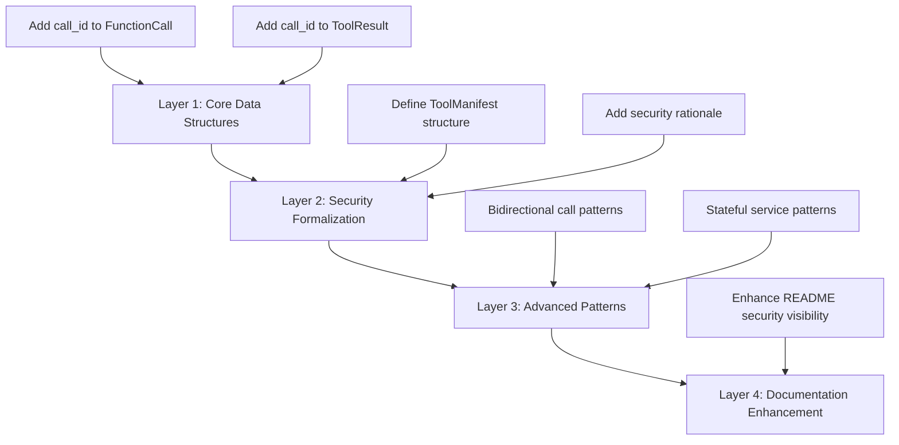

# Design Document

## Overview

The ALTAR v1.0 Finalization design implements a systematic approach to evolving the protocol specifications from theoretical completeness to production readiness. The design focuses on four core enhancement areas: unique invocation tracking, formalized security structures, advanced pattern documentation, and enhanced project visibility.

This design ensures that all modifications maintain backward compatibility where possible, follow established specification patterns, and provide implementers with concrete, actionable guidance for building production-grade ALTAR systems.

## Architecture

### Design Principles

1. **Specification Integrity First**: All changes must maintain the existing document structure, formatting conventions, and cross-reference integrity
2. **Implementer-Centric**: Every addition must provide clear, actionable guidance for developers building ALTAR-compliant systems
3. **Security by Design**: Formalize security structures to make the Host-centric model tangible and auditable
4. **Progressive Enhancement**: Changes should enhance existing capabilities without breaking current implementations

### Modification Strategy

The design follows a layered modification approach:



## Components and Interfaces

### Component 1: Unique Invocation ID System

**Purpose**: Provide end-to-end traceability and idempotency support for all tool invocations.

**Design Approach**:
- Add `call_id` as the first field in both `FunctionCall` and `ToolResult` structures
- Maintain consistency with existing field documentation patterns
- Update all related schemas, examples, and cross-references

**Interface Changes**:
```json
// FunctionCall enhancement
{
  "call_id": "unique-client-generated-id",
  "name": "existing_field",
  // ... existing fields
}

// ToolResult enhancement (SUCCESS case)
{
  "call_id": "matching-call-id-from-request",
  "status": "SUCCESS",
  "content": { /* result data */ }
}

// ToolResult enhancement (ERROR case)
{
  "call_id": "matching-call-id-from-request", 
  "status": "ERROR",
  "error": { /* error details */ }
}
```

**Implementation Considerations**:
- The `call_id` must be client-generated to support idempotency
- Documentation must emphasize correlation between request and response
- Documentation must emphasize that the `call_id` SHOULD be a UUID v4 or a similarly high-entropy, unique string to prevent collisions in a distributed environment
- Examples must demonstrate realistic UUID v4 identifier patterns

### Component 2: ToolManifest Formalization

**Purpose**: Provide a concrete, serializable format for the Host-centric security model.

**Design Approach**:
- Create new section 4.6 in the ADM specification
- Update the ADM introduction to include `ToolManifest` as a core data structure alongside existing structures
- Define a complete data structure with proper field specifications
- Include comprehensive design rationale linking to GRID security model
- Provide realistic examples showing enterprise-grade tool management

**Structure Design**:
```json
{
  "manifest_version": "1.0.0",
  "contracts": [
    {
      // ToolContract objects as defined elsewhere in ADM
    }
  ],
  "global_metadata": {
    "owner": "security-team",
    "environment": "production",
    "description": "Enterprise tool manifest"
  }
}
```

**Security Integration**:
- Explicitly connect to GRID Host-centric security model
- Emphasize role as "single source of truth" for trusted contracts
- Document auditability and governance benefits

### Component 3: Advanced Interaction Patterns (Cookbook)

**Purpose**: Provide concrete implementation guidance for complex real-world scenarios.

**Design Approach**:
- Create new major section 7 in GRID protocol specification
- Focus on patterns that leverage existing protocol primitives
- Emphasize security advantages of Host-mediated approaches
- Provide conceptual examples without implementation details

**Pattern 1: Bidirectional Tool Calls**
- Document Runtime-as-Client pattern
- Include detailed Mermaid sequence diagram showing Host mediation
- Explain security and observability advantages
- Demonstrate how Host maintains control over all interactions

**Pattern 2: Stateful Services as Tools**
- Show how to expose stateful logic through formal tool contracts
- Provide conceptual ADM examples for state management operations
- Demonstrate how stateful services become securable, auditable runtimes

**Documentation Structure**:
```markdown
## 7. Advanced Interaction Patterns (Cookbook)

### 7.1. Bidirectional Tool Calls (Runtime-as-Client)
[Explanation + Mermaid diagram + security rationale]

### 7.2. Implementing Stateful Services as Tools  
[Conceptual examples + ADM schemas + integration guidance]
```

### Component 4: Documentation Enhancement

**Purpose**: Elevate security model visibility in main project documentation.

**Design Approach**:
- Modify existing GRID Protocol description in README.md
- Maintain current structure while emphasizing security features
- Ensure security value proposition is immediately visible
- Preserve existing content while enhancing key messaging

**Enhancement Strategy**:
- Locate existing GRID description in Mermaid diagram
- Add explicit mention of "Host-Centric Security Model"
- Emphasize "enterprise-grade safety and governance"
- Maintain consistency with overall README tone and structure

## Data Models

### Enhanced FunctionCall Structure

```json
{
  "type": "object",
  "properties": {
    "call_id": {
      "type": "string",
      "description": "Unique, client-generated identifier for this specific function call"
    },
    "name": {
      "type": "string", 
      "description": "Existing field - function name to invoke"
    }
    // ... existing fields maintained
  },
  "required": ["call_id", "name"]
}
```

### Enhanced ToolResult Structure

```json
{
  "type": "object", 
  "properties": {
    "call_id": {
      "type": "string",
      "description": "The unique identifier from the FunctionCall that this result corresponds to"
    },
    "status": {
      "type": "string",
      "enum": ["SUCCESS", "ERROR"],
      "description": "Existing field - execution status"
    },
    "content": {
      "description": "Existing field - result content (present when status is SUCCESS)"
    },
    "error": {
      "description": "Existing field - error details (present when status is ERROR)"
    }
    // ... existing fields maintained
  },
  "required": ["call_id", "status"]
}
```

### New ToolManifest Structure

```json
{
  "type": "object",
  "properties": {
    "manifest_version": {
      "type": "string",
      "description": "Semantic version of the manifest schema itself"
    },
    "contracts": {
      "type": "array",
      "items": {
        "$ref": "#/definitions/ToolContract"
      },
      "description": "Array of ToolContract objects trusted by the Host"
    },
    "global_metadata": {
      "type": "object",
      "additionalProperties": {
        "type": "string"
      },
      "description": "Manifest-level metadata for governance and identification"
    }
  },
  "required": ["manifest_version", "contracts"]
}
```

## Error Handling

### Specification Consistency Validation

**Error Prevention Strategy**:
- Validate all JSON schemas before inclusion
- Ensure cross-reference accuracy across all modified files
- Maintain consistent terminology and formatting
- Verify example completeness and realism

**Quality Assurance Measures**:
- All examples must be syntactically valid JSON
- Cross-references must point to existing sections
- New sections must follow established numbering conventions
- Technical terminology must align with existing definitions

### Implementation Guidance Clarity

**Ambiguity Prevention**:
- Provide specific field ordering requirements (call_id first)
- Include complete JSON Schema representations
- Offer multiple realistic examples for complex structures
- Clarify conceptual vs. implementation boundaries

## Testing Strategy

### Specification Validation Testing

**Document Structure Testing**:
- Verify all new sections follow established formatting patterns
- Confirm cross-reference accuracy and completeness
- Validate JSON Schema syntax and completeness
- Test example JSON for validity and realism

**Content Quality Testing**:
- Ensure technical accuracy of all additions
- Verify consistency with existing specification terminology
- Confirm completeness of field documentation
- Validate design rationale clarity and accuracy

### Integration Testing

**Cross-Specification Consistency**:
- Verify ADM changes integrate properly with GRID references
- Ensure README changes align with specification content
- Confirm new patterns reference existing protocol primitives correctly
- Validate that security model enhancements are consistent across documents

**Implementer Perspective Testing**:
- Evaluate whether requirements provide sufficient implementation guidance
- Assess clarity of advanced pattern documentation
- Verify that security model formalization supports actual implementation
- Confirm that examples demonstrate realistic usage scenarios

### Acceptance Testing

**Requirements Traceability**:
- Verify each acceptance criterion is fully addressed
- Confirm all required sections and subsections are created
- Validate that all specified fields and structures are properly defined
- Ensure all documentation enhancements are implemented as specified

**Quality Standards Verification**:
- Assess professional presentation and consistency
- Verify technical accuracy and completeness
- Confirm that changes enhance rather than detract from existing content
- Validate that security model visibility is appropriately elevated