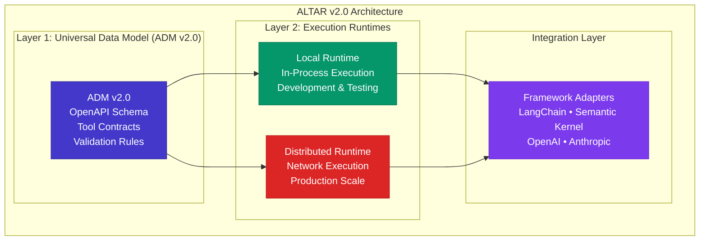

# ALTAR v2.0 Rebuild: Design Specification

## Overview

This design document outlines the technical architecture for ALTAR v2.0, a complete rebuild that addresses the fundamental flaws identified in v1.0 while maintaining the core value proposition of secure, scalable AI tool execution.

## Architecture Principles

### 1. Radical Simplification
- **Two-Layer Architecture**: Data Model + Execution Runtime (eliminate complex layering)
- **Two Compliance Levels**: Core (secure baseline) + Extended (advanced features)
- **Single Responsibility**: Each component has one clear purpose

### 2. Standards-First Design
- **OpenAPI 3.0 Schema**: Replace custom schema with industry standard
- **gRPC/Protocol Buffers**: Formal IDL for distributed communication
- **JSON Schema**: Universal compatibility with AI ecosystems

### 3. Security by Default
- **Mandatory Security**: Security context required in all distributed operations
- **Host-Centric Authority**: Centralized contract validation and enforcement
- **Complete Observability**: End-to-end tracing with correlation IDs

## System Architecture



## Component Design

### ADM v2.0: Universal Data Model

#### Core Data Structures

**FunctionDeclaration v2.0**
```typescript
interface FunctionDeclaration {
  // Core identification
  name: string;                    // ^[a-zA-Z_][a-zA-Z0-9_-]{0,63}$
  description: string;             // Human-readable description
  version?: string;                // Semantic version (e.g., "1.2.0")
  
  // OpenAPI 3.0 Schema (replaces custom schema)
  parameters: OpenAPISchema;       // Industry-standard validation
  
  // Operational semantics (NEW)
  is_read_only?: boolean;          // Safe to cache, no side effects
  is_idempotent?: boolean;         // Safe to retry automatically
  is_stateful?: boolean;           // Modifies persistent state
  is_deprecated?: boolean;         // Should not be used in new code
  
  // Metadata
  tags?: string[];                 // Categorization and discovery
  external_docs?: ExternalDocs;    // Links to documentation
}
```

**Enhanced Error Handling**
```typescript
interface ToolError {
  code: StandardErrorCode;         // Standardized error codes
  message: string;                 // Human-readable description
  details?: Record<string, any>;   // Machine-readable context
  field_path?: string;             // Path to invalid field (for validation errors)
  correlation_id?: string;         // End-to-end tracing
  retry_after?: number;            // Seconds to wait before retry
}

enum StandardErrorCode {
  INVALID_ARGUMENT = "INVALID_ARGUMENT",
  NOT_FOUND = "NOT_FOUND", 
  PERMISSION_DENIED = "PERMISSION_DENIED",
  RESOURCE_EXHAUSTED = "RESOURCE_EXHAUSTED",
  INTERNAL_ERROR = "INTERNAL_ERROR",
  UNAVAILABLE = "UNAVAILABLE",
  DEADLINE_EXCEEDED = "DEADLINE_EXCEEDED"
}
```

#### Schema Validation Engine

**OpenAPI Integration**
```typescript
class SchemaValidator {
  private schema: OpenAPISchema;
  
  constructor(functionDeclaration: FunctionDeclaration) {
    this.schema = functionDeclaration.parameters;
  }
  
  validate(args: Record<string, any>): ValidationResult {
    // Use industry-standard OpenAPI validation
    // Support rich constraints: patterns, ranges, formats
    // Provide detailed error paths and messages
  }
  
  generateJsonSchema(): JsonSchema {
    // Convert to JSON Schema for AI framework compatibility
    // Optimize for specific providers (OpenAI, Google, Anthropic)
  }
}
```

### Local Runtime: Simplified Execution

#### Core Components

**Tool Registry**
```typescript
interface ToolRegistry {
  register(declaration: FunctionDeclaration, implementation: Function): void;
  lookup(name: string): RegisteredTool | null;
  list(): FunctionDeclaration[];
  validate(call: FunctionCall): ValidationResult;
}

interface RegisteredTool {
  declaration: FunctionDeclaration;
  implementation: Function;
  metadata: ToolMetadata;
}
```

**Execution Engine**
```typescript
class LocalExecutor {
  constructor(private registry: ToolRegistry) {}
  
  async execute(call: FunctionCall): Promise<ToolResult> {
    // 1. Validate function exists
    const tool = this.registry.lookup(call.name);
    if (!tool) {
      return this.createError("NOT_FOUND", `Tool ${call.name} not found`);
    }
    
    // 2. Validate arguments with OpenAPI schema
    const validation = tool.declaration.parameters.validate(call.args);
    if (!validation.valid) {
      return this.createValidationError(validation.errors);
    }
    
    // 3. Execute with proper error handling
    try {
      const result = await tool.implementation(call.args);
      return this.createSuccess(call.call_id, result);
    } catch (error) {
      return this.createExecutionError(error);
    }
  }
}
```

### Distributed Runtime: Production Scale

#### Protocol Definition (gRPC/Protocol Buffers)

```protobuf
syntax = "proto3";

package altar.v2;

// Core message types
message ToolCall {
  string call_id = 1;              // Unique request identifier
  string correlation_id = 2;       // End-to-end tracing (MANDATORY)
  string name = 3;                 // Function name
  google.protobuf.Struct args = 4; // Function arguments
  
  // Security and control (MANDATORY in distributed mode)
  SecurityContext security_context = 5;
  optional uint64 deadline_unix_ms = 6;  // Deadline propagation
}

message SecurityContext {
  string principal_id = 1;         // User/service identity
  string tenant_id = 2;            // Multi-tenant isolation
  map<string, string> claims = 3;  // Authorization claims
  string session_id = 4;           // Session context
}

message ToolResult {
  string call_id = 1;
  string correlation_id = 2;
  
  oneof result {
    google.protobuf.Struct content = 3;  // Success result
    ToolError error = 4;                 // Error details
  }
  
  // Execution metadata
  optional ExecutionMetadata metadata = 5;
}

message ToolError {
  string code = 1;                 // StandardErrorCode
  string message = 2;              // Human-readable
  google.protobuf.Struct details = 3;  // Machine-readable context
  optional string field_path = 4;      // Validation error path
  optional uint32 retry_after_seconds = 5;
}

// Service definition
service ToolExecutionService {
  // Synchronous execution
  rpc ExecuteTool(ToolCall) returns (ToolResult);
  
  // Streaming execution (Extended level)
  rpc ExecuteToolStream(ToolCall) returns (stream ToolResult);
  
  // Tool discovery
  rpc ListTools(ListToolsRequest) returns (ListToolsResponse);
  
  // Health and status
  rpc HealthCheck(HealthCheckRequest) returns (HealthCheckResponse);
}
```

#### Host-Centric Security Model

```typescript
class DistributedHost {
  private contractRegistry: ContractRegistry;
  private securityEngine: SecurityEngine;
  private auditLogger: AuditLogger;
  
  async executeToolCall(request: ToolCallRequest): Promise<ToolResult> {
    const startTime = Date.now();
    const correlationId = request.correlation_id;
    
    try {
      // 1. Security validation (MANDATORY)
      const authResult = await this.securityEngine.authorize(
        request.security_context,
        request.name,
        request.args
      );
      
      if (!authResult.authorized) {
        return this.createSecurityError(authResult.reason, correlationId);
      }
      
      // 2. Contract validation
      const contract = this.contractRegistry.getContract(request.name);
      if (!contract) {
        return this.createError("NOT_FOUND", `Contract ${request.name} not found`, correlationId);
      }
      
      // 3. Schema validation
      const validation = contract.validateArgs(request.args);
      if (!validation.valid) {
        return this.createValidationError(validation.errors, correlationId);
      }
      
      // 4. Route to appropriate runtime
      const runtime = await this.findRuntime(request.name, contract);
      
      // 5. Execute with deadline propagation
      const result = await this.executeWithDeadline(runtime, request);
      
      // 6. Audit logging
      await this.auditLogger.logExecution({
        correlation_id: correlationId,
        principal_id: request.security_context.principal_id,
        tool_name: request.name,
        success: !result.error,
        duration_ms: Date.now() - startTime
      });
      
      return result;
      
    } catch (error) {
      await this.auditLogger.logError({
        correlation_id: correlationId,
        error: error.message,
        duration_ms: Date.now() - startTime
      });
      
      return this.createInternalError(error, correlationId);
    }
  }
}
```

## Framework Integration Design

### Adapter Architecture

```typescript
// Universal adapter interface
interface FrameworkAdapter<T> {
  importTool(frameworkTool: T): FunctionDeclaration;
  exportTool(declaration: FunctionDeclaration): T;
  validateCompatibility(tool: T): CompatibilityResult;
}

// LangChain adapter
class LangChainAdapter implements FrameworkAdapter<BaseTool> {
  importTool(langchainTool: BaseTool): FunctionDeclaration {
    return {
      name: langchainTool.name,
      description: langchainTool.description,
      parameters: this.convertPydanticToOpenAPI(langchainTool.args_schema),
      // Infer operational semantics from tool properties
      is_read_only: this.inferReadOnly(langchainTool),
      is_idempotent: this.inferIdempotent(langchainTool)
    };
  }
  
  private convertPydanticToOpenAPI(pydanticSchema: any): OpenAPISchema {
    // Convert Pydantic model to OpenAPI 3.0 schema
    // Preserve all validation constraints
    // Map Python types to OpenAPI types
  }
}

// Semantic Kernel adapter  
class SemanticKernelAdapter implements FrameworkAdapter<KernelFunction> {
  importTool(skFunction: KernelFunction): FunctionDeclaration {
    return {
      name: `${skFunction.pluginName}_${skFunction.name}`,
      description: skFunction.description,
      parameters: this.convertSKParametersToOpenAPI(skFunction.metadata.parameters),
      version: skFunction.metadata.version
    };
  }
}
```

## Performance and Reliability Design

### Caching Strategy

```typescript
class IntelligentCache {
  private cache: Map<string, CacheEntry>;
  
  async get(call: FunctionCall, declaration: FunctionDeclaration): Promise<ToolResult | null> {
    // Only cache read-only, idempotent functions
    if (!declaration.is_read_only || !declaration.is_idempotent) {
      return null;
    }
    
    const cacheKey = this.generateCacheKey(call);
    const entry = this.cache.get(cacheKey);
    
    if (entry && !entry.isExpired()) {
      return entry.result;
    }
    
    return null;
  }
  
  async set(call: FunctionCall, result: ToolResult, declaration: FunctionDeclaration): Promise<void> {
    if (declaration.is_read_only && !result.error) {
      const ttl = this.calculateTTL(declaration);
      this.cache.set(this.generateCacheKey(call), {
        result,
        expires_at: Date.now() + ttl,
        created_at: Date.now()
      });
    }
  }
}
```

### Circuit Breaker Pattern

```typescript
class CircuitBreaker {
  private state: CircuitState = CircuitState.CLOSED;
  private failureCount = 0;
  private lastFailureTime = 0;
  
  async execute<T>(operation: () => Promise<T>): Promise<T> {
    if (this.state === CircuitState.OPEN) {
      if (this.shouldAttemptReset()) {
        this.state = CircuitState.HALF_OPEN;
      } else {
        throw new Error("Circuit breaker is OPEN");
      }
    }
    
    try {
      const result = await operation();
      this.onSuccess();
      return result;
    } catch (error) {
      this.onFailure();
      throw error;
    }
  }
  
  private onSuccess(): void {
    this.failureCount = 0;
    this.state = CircuitState.CLOSED;
  }
  
  private onFailure(): void {
    this.failureCount++;
    this.lastFailureTime = Date.now();
    
    if (this.failureCount >= this.failureThreshold) {
      this.state = CircuitState.OPEN;
    }
  }
}
```

## Migration Strategy Design

### Compatibility Layer

```typescript
class V1CompatibilityLayer {
  private v2Runtime: LocalRuntime;
  
  // Convert v1.0 FunctionDeclaration to v2.0
  convertV1Declaration(v1Decl: V1FunctionDeclaration): FunctionDeclaration {
    return {
      name: v1Decl.name,
      description: v1Decl.description,
      parameters: this.convertV1SchemaToOpenAPI(v1Decl.parameters),
      // Set conservative defaults for new fields
      is_read_only: false,
      is_idempotent: false,
      is_stateful: true,  // Conservative default
      version: "1.0.0"
    };
  }
  
  private convertV1SchemaToOpenAPI(v1Schema: V1Schema): OpenAPISchema {
    // Convert custom v1.0 schema to OpenAPI 3.0
    // Map v1 types to OpenAPI types
    // Preserve existing validation where possible
    // Add warnings for unsupported features
  }
}
```

### Migration Tools

```typescript
class MigrationTool {
  async migrateProject(projectPath: string): Promise<MigrationResult> {
    const result: MigrationResult = {
      converted_files: [],
      warnings: [],
      errors: [],
      manual_actions_required: []
    };
    
    // 1. Scan for v1.0 tool definitions
    const v1Tools = await this.scanForV1Tools(projectPath);
    
    // 2. Convert each tool to v2.0 format
    for (const tool of v1Tools) {
      try {
        const v2Tool = this.convertTool(tool);
        await this.writeV2Tool(v2Tool, projectPath);
        result.converted_files.push(tool.path);
      } catch (error) {
        result.errors.push({
          file: tool.path,
          error: error.message,
          suggestion: this.getSuggestion(error)
        });
      }
    }
    
    // 3. Generate migration report
    await this.generateMigrationReport(result, projectPath);
    
    return result;
  }
}
```

## Testing Strategy

### Validation Testing

```typescript
describe('Schema Validation', () => {
  test('OpenAPI schema validation with rich constraints', () => {
    const declaration: FunctionDeclaration = {
      name: 'validate_email',
      description: 'Validates email addresses',
      parameters: {
        type: 'object',
        properties: {
          email: {
            type: 'string',
            format: 'email',
            pattern: '^[a-zA-Z0-9._%+-]+@[a-zA-Z0-9.-]+\\.[a-zA-Z]{2,}$'
          },
          domain_whitelist: {
            type: 'array',
            items: { type: 'string' },
            minItems: 1,
            maxItems: 10
          }
        },
        required: ['email']
      }
    };
    
    const validator = new SchemaValidator(declaration);
    
    // Valid input
    expect(validator.validate({
      email: 'test@example.com',
      domain_whitelist: ['example.com']
    })).toEqual({ valid: true });
    
    // Invalid email format
    expect(validator.validate({
      email: 'invalid-email'
    })).toEqual({
      valid: false,
      errors: [{
        field_path: 'email',
        code: 'INVALID_FORMAT',
        message: 'Must be a valid email address'
      }]
    });
  });
});
```

### Integration Testing

```typescript
describe('Framework Integration', () => {
  test('LangChain tool import preserves validation', async () => {
    const langchainTool = new LangChainTool({
      name: 'get_weather',
      description: 'Get weather information',
      schema: WeatherSchema  // Pydantic model
    });
    
    const adapter = new LangChainAdapter();
    const altarDeclaration = adapter.importTool(langchainTool);
    
    // Verify conversion preserves constraints
    expect(altarDeclaration.parameters.properties.location).toEqual({
      type: 'string',
      minLength: 1,
      description: 'City name'
    });
    
    // Test round-trip conversion
    const backToLangChain = adapter.exportTool(altarDeclaration);
    expect(backToLangChain.name).toBe(langchainTool.name);
  });
});
```

## Deployment Architecture

### Cloud-Native Deployment

```yaml
# Kubernetes deployment example
apiVersion: apps/v1
kind: Deployment
metadata:
  name: altar-distributed-host
spec:
  replicas: 3
  selector:
    matchLabels:
      app: altar-host
  template:
    metadata:
      labels:
        app: altar-host
    spec:
      containers:
      - name: altar-host
        image: altar/host:v2.0
        ports:
        - containerPort: 9090  # gRPC
        - containerPort: 8080  # HTTP/JSON compatibility
        env:
        - name: SECURITY_REQUIRED
          value: "true"
        - name: CORRELATION_REQUIRED  
          value: "true"
        - name: CONTRACT_REGISTRY_URL
          value: "https://contracts.altar.internal"
        resources:
          requests:
            memory: "256Mi"
            cpu: "250m"
          limits:
            memory: "512Mi"
            cpu: "500m"
        livenessProbe:
          grpc:
            port: 9090
            service: altar.v2.ToolExecutionService
        readinessProbe:
          grpc:
            port: 9090
            service: altar.v2.ToolExecutionService
```

## Monitoring and Observability

### Metrics Collection

```typescript
interface AltarMetrics {
  // Performance metrics
  tool_execution_duration_seconds: Histogram;
  tool_execution_total: Counter;
  tool_execution_errors_total: Counter;
  
  // Security metrics
  authorization_checks_total: Counter;
  authorization_failures_total: Counter;
  
  // System metrics
  active_connections: Gauge;
  circuit_breaker_state: Gauge;
  cache_hit_rate: Gauge;
}

class MetricsCollector {
  recordToolExecution(
    toolName: string,
    duration: number,
    success: boolean,
    correlationId: string
  ): void {
    this.metrics.tool_execution_duration_seconds
      .labels({ tool_name: toolName, success: success.toString() })
      .observe(duration);
      
    this.metrics.tool_execution_total
      .labels({ tool_name: toolName })
      .inc();
      
    if (!success) {
      this.metrics.tool_execution_errors_total
        .labels({ tool_name: toolName })
        .inc();
    }
  }
}
```

## Conclusion

This design addresses the fundamental architectural flaws identified in ALTAR v1.0 while maintaining the core value proposition. Key improvements include:

1. **Radical Simplification**: Two-layer architecture with clear responsibilities
2. **Standards Adoption**: OpenAPI Schema and gRPC for industry compatibility  
3. **Security by Default**: Mandatory security context and correlation IDs
4. **Production Readiness**: Circuit breakers, caching, and comprehensive monitoring
5. **Migration Support**: Tools and compatibility layers for smooth transition

The design prioritizes simplicity, security, and standards compliance while providing a clear path for future evolution and enterprise adoption.