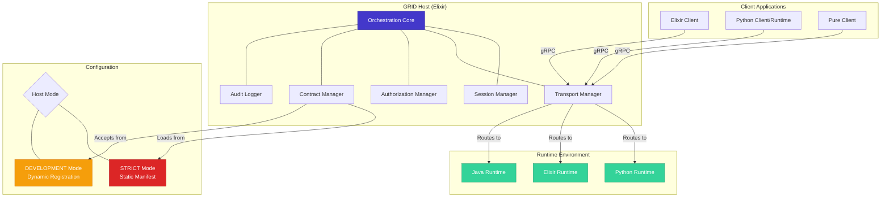
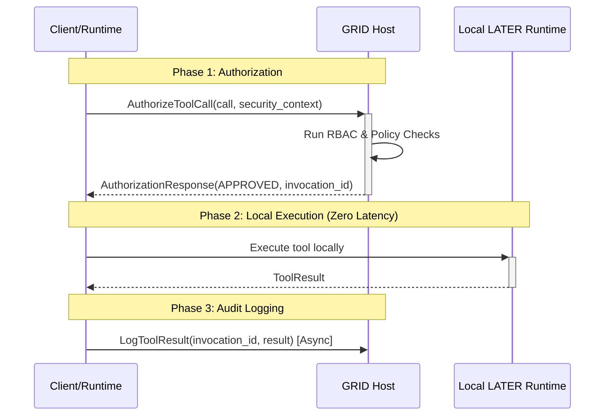

# GRID Protocol Revision Design

## Overview

This design document outlines the comprehensive revision of the GRID Protocol to address multi-language development workflows, performance optimization, and enterprise security requirements. The revision maintains the core Host-Runtime architecture while introducing flexible operational modes and advanced execution patterns that preserve security guarantees.

The design is built around three key innovations:
1. **Dual-Mode Operation**: STRICT mode for production security and DEVELOPMENT mode for rapid iteration
2. **Governed Local Dispatch**: High-performance local execution with full Host governance
3. **Phased Implementation**: Incremental delivery that builds advanced capabilities on a solid foundation

## Architecture

### Core Components

The revised GRID architecture maintains the fundamental Host-Runtime model while enhancing it with new capabilities:



### Dual-Mode Operation Design

The Host operates in one of two mutually exclusive modes, determined by configuration:

#### STRICT Mode (Production)
- **Contract Authority**: Host loads static `ToolManifest.json` at startup
- **Runtime Role**: Runtimes can only fulfill existing contracts
- **Security**: Maximum security posture with centralized contract control
- **Workflow**: Contract changes require manifest updates and Host redeployment

#### DEVELOPMENT Mode
- **Contract Authority**: Host accepts dynamic tool registrations from Runtimes
- **Runtime Role**: Runtimes can register new contracts via `RegisterTools` messages
- **Security**: Reduced security for development agility
- **Workflow**: Immediate tool registration and testing without deployment cycles

### Governed Local Dispatch Pattern

For high-performance scenarios where clients also act as tool providers, the system supports a three-phase execution pattern:



This pattern provides:
- **Zero-latency execution** for the actual tool logic
- **Full governance** through Host authorization
- **Complete audit trail** via result logging
- **No security bypass** as all executions are pre-authorized

## Components and Interfaces

### Enhanced Protocol Messages

The protocol is extended with new message types while maintaining backward compatibility:

#### Authorization Messages
```protobuf
message AuthorizeToolCallRequest {
  string session_id = 1;
  EnterpriseSecurityContext security_context = 2;
  ADM.FunctionCall call = 3;
}

message AuthorizationResponse {
  string invocation_id = 1;
  enum Status {
    APPROVED = 0;
    DENIED = 1;
  }
  Status status = 2;
  Error error = 3;
}
```

#### Development Mode Messages
```protobuf
message RegisterToolsRequest {
  string runtime_id = 1;
  repeated ADM.Tool tools = 2;
  string session_id = 3;
}

message RegisterToolsResponse {
  enum Status {
    SUCCESS = 0;
    PARTIAL_SUCCESS = 1;
    FAILURE = 2;
  }
  Status status = 1;
  repeated string accepted_tools = 2;
  repeated string rejected_tools = 3;
  repeated Error errors = 4;
}
```

**Runtime Behavior on PARTIAL_SUCCESS**: Upon receiving a `PARTIAL_SUCCESS` response, the Runtime MUST:
1. Consider only the `accepted_tools` as active for the session
2. Log the errors for `rejected_tools` for debugging purposes
3. Continue normal operation with the accepted tools
4. NOT attempt automatic retry of rejected tools (retry logic is implementation-specific)

#### Audit Logging Messages
```protobuf
message LogToolResultRequest {
  string session_id = 1;
  string invocation_id = 2;
  ADM.ToolResult result = 3;
  uint64 execution_time_ms = 4;
}
```

### Transport Layer Abstraction

The Host implements a pluggable transport architecture:

```elixir
defmodule Altar.GRID.Transport do
  @callback start_link(config :: map()) :: GenServer.on_start()
  @callback handle_request(request :: term(), context :: map()) :: term()
  @callback send_response(response :: term(), context :: map()) :: :ok | {:error, term()}
end

defmodule Altar.GRID.Transport.GRPC do
  @behaviour Altar.GRID.Transport
  
  # Implementation handles gRPC-specific concerns
  # while core logic remains transport-agnostic
end
```

### Client Library Architecture

#### Python Client Library
```python
class AltarClient:
    def __init__(self, host_url: str, execution_mode: ExecutionMode = ExecutionMode.REMOTE):
        self.execution_mode = execution_mode
        self.local_runtime = AltarRuntime() if execution_mode == ExecutionMode.LOCAL_FIRST else None
    
    # Async API for modern applications
    async def execute_tool_async(self, call: FunctionCall) -> ToolResult:
        if self.execution_mode == ExecutionMode.LOCAL_FIRST and self.has_local_tool(call.name):
            return await self._execute_with_governed_dispatch(call)
        else:
            return await self._execute_remote(call)
    
    # Synchronous API for traditional scripts and data science workflows
    def execute_tool(self, call: FunctionCall) -> ToolResult:
        import asyncio
        return asyncio.run(self.execute_tool_async(call))

class AltarRuntime:
    def __init__(self):
        self.tools = {}
    
    def tool(self, func):
        # Decorator that registers tools and generates ADM schemas
        schema = self._generate_adm_schema(func)
        self.tools[func.__name__] = (func, schema)
        return func
```

**API Design Rationale**: The client library provides both synchronous and asynchronous APIs to accommodate different Python development patterns. The sync API internally uses `asyncio.run()` for simplicity, while the async API provides full control for event-loop-aware applications.

#### Elixir Client Library
```elixir
defmodule Altar.Client do
  def execute_tool(client, call, opts \\ []) do
    execution_mode = Keyword.get(opts, :execution_mode, :remote)
    
    case execution_mode do
      :local_first when has_local_tool?(client, call.name) ->
        execute_with_governed_dispatch(client, call)
      _ ->
        execute_remote(client, call)
    end
  end
end

defmodule Altar.Runtime do
  defmacro deftool(name, args, do: body) do
    # Macro that generates ADM schemas and registers tools
  end
end
```

## Data Models

### Configuration Schema
```elixir
defmodule Altar.GRID.Config do
  @type mode :: :strict | :development
  @type transport :: :grpc | :websocket
  
  defstruct [
    mode: :strict,
    transport: :grpc,
    manifest_path: "priv/tool_manifest.json",
    security_context: %{},
    audit_config: %{}
  ]
end
```

### Tool Manifest Schema
```json
{
  "version": "1.0",
  "tools": [
    {
      "name": "calculate_sum",
      "description": "Adds two numbers together",
      "parameters": {
        "type": "OBJECT",
        "properties": {
          "a": {"type": "NUMBER", "description": "First number"},
          "b": {"type": "NUMBER", "description": "Second number"}
        },
        "required": ["a", "b"]
      },
      "security_classification": "PUBLIC",
      "required_roles": ["calculator_user"],
      "compliance_tags": ["SAFE_MATH"]
    }
  ]
}
```

**AESP Metadata Handling**: The core GRID Host validates ADM structure compliance but treats AESP-level fields (`security_classification`, `required_roles`, `compliance_tags`) as metadata. Enforcement of these fields is the responsibility of AESP-compliant Authorization Managers, keeping the core GRID implementation focused and preventing scope creep.

### Session State Management
```elixir
defmodule Altar.GRID.Session do
  defstruct [
    id: nil,
    security_context: nil,
    active_tools: MapSet.new(),
    runtime_registrations: %{},
    created_at: nil,
    expires_at: nil
  ]
end
```

## Error Handling

### Error Classification
The system defines comprehensive error categories:

1. **Authorization Errors**: Permission denied, invalid credentials
2. **Validation Errors**: Invalid tool arguments, schema violations
3. **Runtime Errors**: Tool execution failures, timeout errors
4. **Transport Errors**: Network failures, protocol violations
5. **Configuration Errors**: Invalid Host mode, missing manifests

### Error Response Structure
```protobuf
message EnterpriseError {
  string code = 1;
  string message = 2;
  map<string, string> details = 3;
  string correlation_id = 4;
  repeated string remediation_steps = 5;
  bool retry_allowed = 6;
  uint64 retry_after_ms = 7;
}
```

### Error Handling Patterns
- **Circuit Breaker**: Implemented in both locations:
  - **Client Library**: Protects clients from failing Host by stopping requests after threshold failures
  - **Host Transport Manager**: Protects system from failing Runtimes by routing around unhealthy instances
- **Retry Logic**: Exponential backoff for transient failures with configurable max attempts
- **Graceful Degradation**: Fallback to remote execution if local dispatch fails
- **Error Aggregation**: Collect and correlate errors across distributed components with correlation IDs

## Testing Strategy

### Three-Tier Testing Approach

#### Tier 1: Unit Tests
- **ADM Structure Validation**: Test data model serialization/deserialization
- **Host Orchestration Logic**: Test session management, authorization, routing
- **Runtime Dispatching**: Test tool execution and result handling
- **Transport Abstraction**: Test pluggable transport behaviors

#### Tier 2: Integration Tests
- **Mock Transport Layer**: Test Host logic without network overhead
- **Simulated Runtimes**: Test protocol flows with controlled Runtime behavior
- **Authorization Flows**: Test RBAC and policy engine integration
- **Error Scenarios**: Test failure modes and recovery mechanisms

#### Tier 3: End-to-End Tests
- **Multi-Process Testing**: Real Host and Runtime processes
- **Cross-Language Communication**: Elixir Host with Python/Java Runtimes
- **Network Protocol Testing**: Real gRPC communication over network
- **Performance Benchmarking**: Latency and throughput measurements

### Example Test Structure
```elixir
defmodule Altar.GRID.E2ETest do
  use ExUnit.Case
  
  setup do
    # Start real Host process
    {:ok, host_pid} = Altar.GRID.Host.start_link(mode: :development)
    
    # Start Python Runtime process
    python_runtime = start_python_runtime()
    
    %{host: host_pid, runtime: python_runtime}
  end
  
  test "governed local dispatch flow", %{host: host, runtime: runtime} do
    # Test the complete authorize -> execute -> log flow
  end
end
```

## Implementation Phases

### Phase 1: Foundation (Strategy A)
**Deliverables:**
- Core Host-Runtime architecture with gRPC transport
- Unified Endpoint model (all calls go through Host)
- Basic client libraries for Python and Elixir
- STRICT mode with static manifest loading
- Level 1 GRID compliance

**Success Criteria:**
- End-to-end tool execution across language boundaries
- Complete audit trail for all tool invocations
- Production-ready security posture

### Phase 2: Development Agility
**Deliverables:**
- DEVELOPMENT mode with dynamic tool registration
- Enhanced client libraries with decorator support
- Comprehensive testing framework
- Examples and documentation

**Success Criteria:**
- Rapid development workflow without deployment cycles
- Clear security warnings for development mode
- Comprehensive test coverage across all tiers

### Phase 3: Performance Optimization (Strategy C)
**Deliverables:**
- Governed Local Dispatch pattern implementation
- Enhanced protocol with authorization messages
- Configurable execution modes in client libraries
- Performance benchmarking and optimization

**Success Criteria:**
- Zero-latency local execution with full governance
- No security compromise in high-performance patterns
- Measurable performance improvements for local tools

### Phase 4: Advanced Features
**Deliverables:**
- Alternative transport implementations (WebSocket)
- Advanced error handling and circuit breakers
- Monitoring and observability enhancements
- AESP Level 3 compliance features

**Success Criteria:**
- Production-scale reliability and observability
- Enterprise-grade security and compliance
- Extensible architecture for future enhancements

## Security Considerations

### Host-Centric Security Model Preservation
- **Single Source of Truth**: Host maintains authoritative tool contracts
- **Pre-Authorization Required**: All executions require Host approval
- **Immutable Audit Trail**: Complete logging of all tool interactions
- **RBAC Integration**: Role-based access control for all operations

### Development Mode Security
- **Clear Warnings**: Explicit indication of reduced security posture
- **Environment Restrictions**: Never enabled in production environments
- **Audit Logging**: All dynamic registrations logged for review
- **Isolation**: Development sessions isolated from production data

### Transport Security
- **mTLS Required**: Mutual TLS for all Host-Runtime communication
- **Certificate Validation**: Runtime identity verification
- **Encrypted Payloads**: All tool arguments and results encrypted in transit
- **Network Isolation**: Secure network boundaries between components

## Performance Optimization

### Latency Reduction Strategies
- **Co-location**: Deploy clients and Host in same network zone
- **Connection Pooling**: Reuse gRPC connections for multiple calls
- **Async Logging**: Non-blocking audit trail recording
- **Lightweight Authorization**: Minimal payload for authorization requests

### Scalability Considerations
- **Horizontal Host Scaling**: Multiple Host instances with load balancing
- **Runtime Pool Management**: Dynamic Runtime scaling based on demand
- **Session Affinity**: Optimize routing for session-based workloads
- **Resource Monitoring**: Track and optimize resource utilization

### Caching Strategies
- **Authorization Caching**: Cache authorization decisions with mandatory invalidation strategy:
  - **TTL-based**: Cached authorizations expire after maximum 60 seconds
  - **Event-based**: Identity Manager publishes cache invalidation events on role/permission changes
  - **Security Requirement**: Cache invalidation MUST be implemented to prevent stale permission enforcement
- **Schema Caching**: Cache ADM schemas to reduce validation overhead
- **Connection Caching**: Maintain persistent connections to Runtimes
- **Result Caching**: Optional caching for idempotent tool results with explicit cache keys