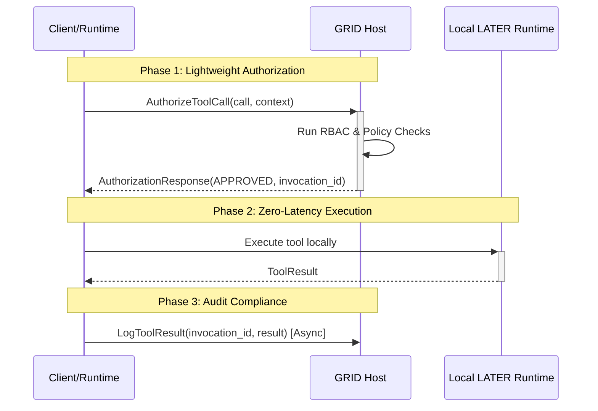

# GRID Specification Documentation Update Design

## Overview

This design outlines the comprehensive update of GRID Protocol specification documents in `priv/docs/specs/03-grid-protocol/` to incorporate the latest architectural insights from the GRID Protocol Revision analysis. The updates will enhance the existing specifications while maintaining their authoritative structure and ensuring backward compatibility.

The design focuses on augmenting rather than replacing the existing documentation, ensuring that current implementations remain valid while providing clear paths for adopting new capabilities.

## Architecture

### Documentation Structure Enhancement

The existing GRID specification structure will be enhanced with new sections and expanded content:

```
priv/docs/specs/03-grid-protocol/
├── grid-protocol.md (ENHANCED)
│   ├── Existing sections (preserved)
│   ├── NEW: Section 2.3 - Dual-Mode Operation
│   ├── NEW: Section 4.5 - Enhanced Protocol Messages
│   ├── NEW: Section 7.3 - Governed Local Dispatch Pattern
│   ├── NEW: Section 7.4 - Development Workflow Patterns
│   ├── ENHANCED: Section 4 - Protocol Message Schemas
│   ├── ENHANCED: Section 5 - Interaction Flows
│   └── ENHANCED: Section 8 - Compliance Levels
└── aesp.md (ENHANCED)
    ├── Existing sections (preserved)
    ├── NEW: Section 3.5 - Governed Local Dispatch Integration
    ├── ENHANCED: Section 3 - Message Extensions
    └── ENHANCED: Section 5 - Security Requirements
```

### Content Integration Strategy

The design follows a layered enhancement approach:

1. **Preserve Core Architecture**: Maintain existing Host-Runtime model documentation
2. **Add Operational Modes**: Introduce STRICT/DEVELOPMENT mode concepts
3. **Enhance Protocol Messages**: Add new message schemas with clear compliance levels
4. **Document Advanced Patterns**: Add governed local dispatch and performance optimization patterns
5. **Maintain Compatibility**: Ensure all additions are clearly marked as optional/additive

### Single Source of Truth Principle for Documentation

To prevent content duplication and ensure consistency across specification documents, the following ownership model is established:

**grid-protocol.md Ownership:**
- Core protocol mechanics and message structures
- Compliance level definitions and requirements
- Base message schemas (including EnhancedError structure)
- Fundamental interaction patterns and flows

**aesp.md Ownership:**
- Enterprise interpretation and enforcement of core protocol
- AESP-specific message extensions and enrichments
- Enterprise security controls and governance requirements
- References to core protocol elements with enterprise-specific usage guidance

**Cross-Reference Requirements:**
- AESP document MUST reference core protocol definitions rather than redefining them
- Core protocol document MUST provide extension points for enterprise features
- Any structural changes MUST be made in the owning document with references updated accordingly

## Components and Interfaces

### Enhanced Protocol Message Documentation

#### New Message Schema Sections

**Development Mode Messages**
```protobuf
// Added to Section 4.5 - Enhanced Protocol Messages

// Used in DEVELOPMENT mode for dynamic tool registration
message RegisterToolsRequest {
  string runtime_id = 1;
  repeated ADM.Tool tools = 2;
  string session_id = 3;
  map<string, string> metadata = 4;
}

message RegisterToolsResponse {
  enum Status {
    SUCCESS = 0;
    PARTIAL_SUCCESS = 1;
    FAILURE = 2;
  }
  Status status = 1;
  repeated string accepted_tools = 2;
  repeated string rejected_tools = 3;
  repeated Error errors = 4;
}
```

**Governed Local Dispatch Messages**
```protobuf
// Added to Section 4.5 - Enhanced Protocol Messages

// (Level 2+) Pre-authorization for local execution
message AuthorizeToolCallRequest {
  string session_id = 1;
  SecurityContext security_context = 2;
  ADM.FunctionCall call = 3;
}

message AuthorizationResponse {
  string invocation_id = 1;
  enum Status {
    APPROVED = 0;
    DENIED = 1;
  }
  Status status = 2;
  Error error = 3;
}

// (Level 2+) Asynchronous audit logging
message LogToolResultRequest {
  string session_id = 1;
  string invocation_id = 2;
  ADM.ToolResult result = 3;
  uint64 execution_time_ms = 4;
  map<string, string> execution_metadata = 5;
}
```

### Dual-Mode Operation Documentation

#### STRICT Mode Specification
```yaml
# Added to Section 2.3 - Dual-Mode Operation

STRICT Mode:
  Purpose: Production-grade security and governance
  Contract Authority: Host maintains static ToolManifest.json
  Runtime Capabilities: Can only fulfill existing contracts
  Security Level: Maximum
  Use Cases:
    - Production deployments
    - Regulated environments
    - Enterprise compliance scenarios
  
  Workflow:
    1. Host loads static manifest at startup
    2. Runtimes announce capabilities via FulfillContracts
    3. Host validates Runtime claims against manifest
    4. Only pre-approved tools can be executed
```

#### DEVELOPMENT Mode Specification
```yaml
# Added to Section 2.3 - Dual-Mode Operation

DEVELOPMENT Mode:
  Purpose: Rapid iteration and testing
  Contract Authority: Host accepts dynamic registrations
  Runtime Capabilities: Can register new tools via RegisterTools
  Security Level: Reduced (development only)
  Use Cases:
    - Local development
    - Testing and prototyping
    - Multi-language development workflows
  
  Workflow:
    1. Host loads base manifest (optional)
    2. Runtimes connect and send RegisterTools messages
    3. Host temporarily registers new tools for session
    4. Dynamic tools available for immediate testing
  
  Security Warnings:
    - MUST NOT be used in production
    - Provides reduced security guarantees
    - All registrations logged for audit
```

### Governed Local Dispatch Pattern Documentation

#### Pattern Overview


#### Performance and Security Analysis
```yaml
# Added to Section 7.3 - Governed Local Dispatch Pattern

Performance Benefits:
  - Zero network latency for tool execution
  - Reduced payload transfer (authorization is metadata-only)
  - Asynchronous audit logging doesn't block execution
  - Optimal for large argument/result payloads

Security Guarantees:
  - Full Host authorization before any execution
  - Complete audit trail via result logging
  - No bypass of RBAC or policy engines
  - Maintains Host-centric security model

Implementation Requirements:
  - Client must have local LATER runtime
  - Host must support AuthorizeToolCall/LogToolResult RPCs
  - Correlation between authorization and execution via invocation_id
  - Fallback to remote execution for non-local tools
```

## Data Models

### Enhanced Configuration Schema

```elixir
# Added to grid-protocol.md configuration section

defmodule Altar.GRID.Config do
  @type mode :: :strict | :development
  @type execution_mode :: :remote | :local_first
  
  defstruct [
    # Core configuration
    mode: :strict,
    transport: :grpc,
    
    # STRICT mode configuration
    manifest_path: "priv/tool_manifest.json",
    
    # DEVELOPMENT mode configuration
    allow_dynamic_registration: false,
    registration_audit_level: :full,
    
    # Performance optimization
    authorization_cache_ttl: 60_000,
    connection_pool_size: 10,
    
    # Security configuration
    security_context: %{},
    audit_config: %{},
    
    # Client library configuration
    default_execution_mode: :remote,
    local_dispatch_enabled: false
  ]
end
```

### Enhanced Tool Manifest Schema

```json
// Added to grid-protocol.md data models section

{
  "version": "2.0",
  "metadata": {
    "created_at": "2025-08-09T00:00:00Z",
    "mode_compatibility": ["strict", "development"],
    "compliance_level": "Level 2"
  },
  "tools": [
    {
      // Core ADM fields (unchanged)
      "name": "calculate_sum",
      "description": "Adds two numbers together",
      "parameters": {
        "type": "OBJECT",
        "properties": {
          "a": {"type": "NUMBER", "description": "First number"},
          "b": {"type": "NUMBER", "description": "Second number"}
        },
        "required": ["a", "b"]
      },
      
      // Enhanced metadata (AESP-level, treated as metadata by core GRID)
      "security_classification": "PUBLIC",
      "required_roles": ["calculator_user"],
      "compliance_tags": ["SAFE_MATH"],
      "performance_profile": {
        "expected_latency_ms": 10,
        "cpu_intensive": false,
        "memory_usage": "low"
      },
      
      // Governance metadata
      "approval_status": "ACTIVE",
      "approved_by": "security-team",
      "approved_at": "2025-08-09T00:00:00Z",
      "risk_assessment": "LOW"
    }
  ]
}
```

## Error Handling

### Enhanced Error Documentation

#### Error Categories and Handling Patterns

```yaml
# Added to Section 6 - Error Handling

Error Categories:
  Authorization Errors:
    - PERMISSION_DENIED: User lacks required roles/permissions
    - INVALID_CREDENTIALS: Authentication failure
    - SESSION_EXPIRED: Security context no longer valid
    
  Validation Errors:
    - INVALID_TOOL_ARGS: Arguments don't match schema
    - SCHEMA_VIOLATION: ADM structure validation failure
    - UNSUPPORTED_TOOL: Tool not in manifest or not fulfilled
    
  Runtime Errors:
    - TOOL_EXECUTION_FAILED: Business logic threw exception
    - TIMEOUT: Tool execution exceeded time limit
    - RESOURCE_EXHAUSTED: Runtime out of memory/CPU
    
  Transport Errors:
    - CONNECTION_FAILED: Network connectivity issues
    - PROTOCOL_VIOLATION: Invalid message format
    - VERSION_MISMATCH: Incompatible protocol versions
    
  Configuration Errors:
    - INVALID_MODE: Unsupported operational mode
    - MISSING_MANIFEST: Required manifest file not found
    - MALFORMED_CONFIG: Configuration validation failure

Circuit Breaker Implementation:
  Client-Side:
    - Protects clients from failing Host
    - Configurable failure threshold (default: 5 failures in 60 seconds)
    - Exponential backoff with jitter
    
  Host-Side:
    - Protects system from failing Runtimes
    - Per-Runtime failure tracking
    - Automatic Runtime removal after threshold breaches
```

### Enhanced Error Response Structure

```protobuf
// Enhanced version of existing Error message

message EnhancedError {
  // Core fields (backward compatible)
  string code = 1;
  string message = 2;
  
  // Enhanced fields for better debugging
  map<string, string> details = 3;
  string correlation_id = 4;
  uint64 timestamp = 5;
  
  // Retry guidance
  bool retry_allowed = 6;
  uint64 retry_after_ms = 7;
  
  // Remediation guidance
  repeated string remediation_steps = 8;
  string documentation_url = 9;
  
  // Context information
  string component = 10;  // "host", "runtime", "client"
  string session_id = 11;
  string runtime_id = 12;
}
```

## Testing Strategy

### Documentation Testing Approach

#### Multi-Tier Documentation Validation

```yaml
# Added to Section 8 - Testing and Validation

Documentation Testing Levels:

  Tier 1 - Syntax and Structure:
    - Markdown syntax validation
    - Protocol buffer schema compilation
    - JSON schema validation
    - Cross-reference link checking
    
  Tier 2 - Example Validation:
    - All code examples must compile
    - Protocol message examples must validate
    - Configuration examples must parse correctly
    - Sequence diagrams must be syntactically correct
    
  Tier 3 - Implementation Compliance:
    - Reference implementations must match documentation
    - Client library examples must execute successfully
    - End-to-end flows must work as documented
    - Performance claims must be measurable

Documentation Maintenance:
  - Automated testing of all code examples
  - Version synchronization between spec and implementation
  - Regular review cycles for accuracy and completeness
  - Community feedback integration process
  - Living Document Process: All future code changes that affect protocol behavior MUST be accompanied by corresponding specification document updates as a required step for code merge approval
```

## Implementation Phases

### Phase 1: Core Documentation Updates

**Deliverables:**
- Enhanced grid-protocol.md with dual-mode operation
- New protocol message schemas with compliance levels
- Updated interaction flows and sequence diagrams
- Enhanced error handling documentation

**Success Criteria:**
- All existing content preserved and enhanced
- New sections integrate seamlessly with existing structure
- All protocol messages validate against IDL schemas
- Documentation maintains backward compatibility

### Phase 2: Advanced Pattern Documentation

**Deliverables:**
- Governed local dispatch pattern documentation
- Performance optimization guidance
- Client library implementation patterns
- Development workflow documentation

**Success Criteria:**
- Complete sequence diagrams for all new patterns
- Concrete implementation examples for Python and Elixir
- Clear performance benchmarks and optimization guidance
- Comprehensive security analysis for new patterns

### Phase 3: AESP Integration Updates

**Deliverables:**
- Enhanced aesp.md with new pattern integration, including:
  - New subsection in Section 5 (Security Requirements) referencing Governed Local Dispatch pattern from grid-protocol.md
  - AESP-specific enforcement requirements for new patterns (e.g., enterprise audit log formats)
  - Cross-references to core protocol definitions rather than redefinitions
- Updated enterprise security requirements with explicit references to core protocol elements
- Enhanced message schemas for enterprise features that extend (not replace) core protocol messages
- Compliance mapping documentation linking AESP tiers to new protocol features

**Success Criteria:**
- AESP integration points clearly documented with explicit cross-references to core protocol
- Enterprise security requirements updated without duplicating core protocol content
- Compliance level mappings complete with clear tier-to-feature relationships
- Migration guidance for enterprise deployments that references both core and enterprise documentation

### Phase 4: Examples and Validation

**Deliverables:**
- Comprehensive code examples for all patterns
- Implementation cookbook with best practices
- Migration guides and compatibility documentation
- Automated documentation testing framework

**Success Criteria:**
- All code examples compile and execute
- Complete implementation guidance available
- Migration paths clearly documented
- Documentation testing integrated into CI/CD

## Security Considerations

### Documentation Security Requirements

#### Sensitive Information Handling
- No actual credentials or secrets in examples
- Generic placeholder values for all security contexts
- Clear warnings about production vs development usage
- Explicit security model explanations for all patterns

#### Compliance Documentation
- Clear mapping of features to compliance levels
- Explicit security guarantees for each pattern
- Risk assessment documentation for new features
- Integration guidance for enterprise security controls

## Performance Optimization

### Documentation Performance Guidelines

#### Content Organization
- Logical flow from basic to advanced concepts
- Clear section navigation and cross-references
- Appropriate use of diagrams and visual aids
- Concise examples that illustrate key concepts

#### Maintenance Efficiency
- Automated validation of all examples
- Version-controlled documentation with change tracking
- Clear contribution guidelines for community updates
- Regular review cycles for accuracy and completeness