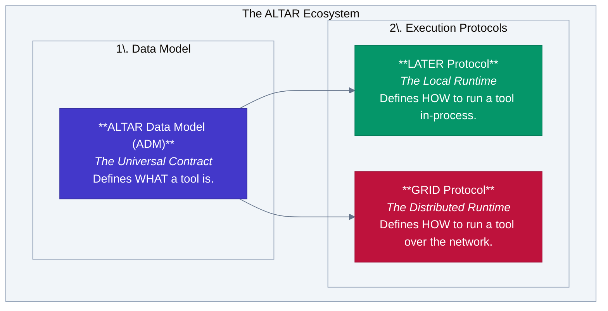

  

<h1 align="center">The ALTAR Protocol Ecosystem</h1>

  <strong>The Open Standard for AI Tool Interoperability</strong>
   
  <em>A family of specifications for defining, executing, and communicating with AI tools, from simple local functions to secure, distributed enterprise services.</em>

    
    
    
    

---

## What is ALTAR?

ALTAR is an open ecosystem designed to solve a critical problem: **how AI agents and applications reliably and securely use tools.** It provides a unified, language-agnostic framework that scales from a developer's local machine to a complex, multi-cloud enterprise environment.

The ecosystem is built on a modular, three-layer architecture:

1.  **[ALTAR Data Model (ADM)](specs/01-data-model/README.md)**: The foundation. A simple, powerful specification for defining a tool's capabilities (`FunctionDeclaration`, `Schema`). This is the universal language that ensures a tool defined once can be understood everywhere.

2.  **[LATER Protocol](specs/02-later-protocol/README.md)**: For local development. A protocol for exposing functions as tools **within the same application process**. It's designed for simplicity and a "just works" developer experience, perfect for getting started with `gemini_ex` or any LLM client.

3.  **[GRID Protocol](specs/03-grid-protocol/README.md)**: For production and scale. A secure, stateful protocol for executing tools on **remote, distributed runtimes**. It features a Host-centric security model, session management, and an enterprise-grade profile (AESP) for high-compliance environments.

This architecture provides a seamless **promotion path**: a tool you build locally with LATER can be deployed to a distributed GRID runtime without changing its core contract.

## Key Features

*   🚀 **Seamless Promotion Path**: Develop tools locally with LATER and deploy them to a distributed GRID runtime with zero changes to the tool's contract.
*   🛡️ **Secure by Design**: The GRID protocol's Host-managed contract model prevents "Trojan Horse" vulnerabilities by ensuring the central orchestrator is the single source of truth for tool schemas.
*   🌐 **Language Agnostic**: Define a tool in Python, execute it from Elixir. The protocols are designed for true cross-language interoperability.
*   🔍 **Built-in Observability**: First-class support for correlation IDs and metadata enables easy end-to-end tracing across local and distributed calls.
*   📦 **Stateful Sessions**: Isolate context, state, and toolsets for different users or workflows, a critical feature for building robust, multi-turn AI applications.

## Project Status & Implementations

**The v1.0 specifications for all three layers are complete and ready for implementation.**

This repository serves as the home for the protocol specifications and the **canonical Elixir implementation** of the ecosystem.

#### 1. Canonical Elixir Host & LATER Implementation (This Repository)

The `lib/` directory contains the Elixir implementation of:
*   The **ALTAR Data Model** (`lib/altar/data_model/`)
*   The **LATER Protocol** (`lib/altar/later/`), providing a simple `use LATER.Tools` interface for Elixir developers.
*   The **GRID Protocol Host** (`lib/altar/grid/`), an OTP-based orchestration engine for managing distributed runtimes.

This allows an Elixir application (like one using `gemini_ex`) to both define its own local tools and orchestrate a fleet of remote, polyglot tool runtimes.

#### 2. Reference Runtimes

The `runtimes/` directory will contain reference implementations of lightweight GRID runtime SDKs for other languages (Python, TypeScript, Go). A developer wanting to expose their tools will only need to `pip install altar-grid-runtime`, add a decorator to their functions, and point it at the central Elixir Host.

## Documentation

The complete protocol specifications can be found in the `specs/` directory.

*   **[01-data-model/README.md](specs/01-data-model/README.md)**: The core ALTAR Data Model (ADM).
*   **[02-later-protocol/README.md](specs/02-later-protocol/README.md)**: The LATER protocol for local execution.
*   **[03-grid-protocol/README.md](specs/03-grid-protocol/README.md)**: The GRID protocol for distributed execution.
    *   **[aesp.md](specs/03-grid-protocol/aesp.md)**: The Enterprise Security Profile for GRID.

## License

This project is licensed under the MIT License - see the [LICENSE](LICENSE) file for details.

---
