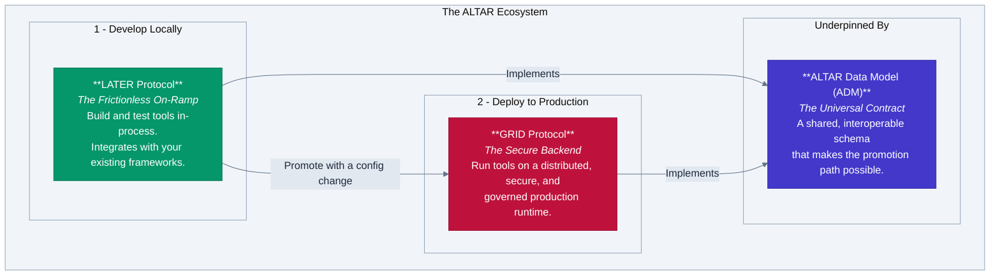

<p align="center">
  
</p>

<h1 align="center">The ALTAR Productivity Platform for AI Agents</h1>

<p align="center">
  <strong>From Local Development to Enterprise-Grade Production, Seamlessly.</strong>
  <br />
  <em>ALTAR bridges the gap between the rapid prototyping of open-source AI frameworks and the security, governance, and scale required for enterprise deployment.</em>
</p>

<p align="center">
    <a href="https://hex.pm/packages/altar"></a>
    <a href="specs/01-data-model/README.md"></a>
    <a href="https://github.com/nshkrdotcom/ALTAR/actions"></a>
    <a href="LICENSE"></a>
</p>

---

## The Challenge: The Gap Between AI Development and Production

The AI agent ecosystem is exploding. Developers love the flexibility and rapid iteration of open-source frameworks like **LangChain**, **Semantic Kernel**, and **CrewAI**. They make it easy to build powerful tools on a local machine.

But moving from a local prototype to a secure, scalable, and compliant enterprise application is a massive leap. This creates a costly integration gap where engineering teams spend months building custom infrastructure for:

*   **Security:** How do you prevent a compromised agent from accessing unauthorized tools or data?
*   **Governance:** How do you enforce access control, audit tool usage, and manage the lifecycle of tool contracts?
*   **Scalability:** How do you run polyglot tools written in Python, Go, and TypeScript and scale them independently?
*   **Operations:** How do you manage deployment, observability, and state for distributed AI systems?

This is where ALTAR comes in.

## The Solution: A Seamless Promotion Path

ALTAR is a productivity platform designed to bridge this gap. It provides a seamless **promotion path** for your AI tools, allowing you to move from local development to a distributed, enterprise-grade production environment with a simple configuration change.

Our architecture is designed to facilitate this journey:



1.  **[LATER Protocol](priv/docs/specs/02-later-protocol/later-protocol.md)**: **The Frictionless On-Ramp.** LATER provides a best-in-class developer experience for building and testing tools locally. With built-in adapters for popular frameworks, you can use your existing tools without a rewrite.

2.  **[GRID Protocol](priv/docs/specs/03-grid-protocol/grid-protocol.md)**: **The Secure Production Backend.** GRID provides the managed, secure fulfillment layer for your tools. It solves the hard problems of distributed systems—security, governance, and scalability—out of the box.

3.  **[ALTAR Data Model (ADM)](priv/docs/specs/01-data-model/data-model.md)**: **The Universal Contract.** By adopting and standardizing industry patterns, the ADM ensures a tool defined once can be understood and executed by both the LATER and GRID protocols, making the promotion path seamless.

## Getting Started with the Elixir Implementation

This repository contains the canonical Elixir implementation of the ALTAR protocol. You can use it today to build robust, locally-executed tools in your Elixir applications.

### 1. Installation

Add `altar` to your list of dependencies in `mix.exs`:

```elixir
def deps do
  [
    {:altar, "~> 0.1.1"}
  ]
end
```

### 2. Add the Supervisor

To use the local runtime, add the `Altar.Supervisor` to your application's supervision tree. This starts the named Registry process.

```elixir
# in your application.ex
children = [
  {Altar.Supervisor, name: MyApp.AltarSupervisor}
]
```

### 3. Define and Register a Tool

Create a module for your tools. Then, in your application's startup logic, create a validated `FunctionDeclaration` and register your tool's implementation with the Registry.

```elixir
defmodule MyApp.Tools do
  # A simple tool function that accepts a map of arguments.
  def get_weather(%{"location" => location, "unit" => unit}) do
    # ... logic to fetch weather ...
    %{temperature: 72, unit: unit, forecast: "Sunny"}
  end
end

# In your application startup or an initializer
{:ok, decl} = Altar.ADM.new_function_declaration(%{
  name: "get_weather",
  description: "Gets the current weather for a specified location.",
  parameters: %{}
})

:ok = Altar.LATER.Registry.register_tool(
  Altar.LATER.Registry, # The globally registered name
  decl,
  &MyApp.Tools.get_weather/1
)
```

### 4. Execute a Tool

Simulate an LLM's request by creating a `FunctionCall` and passing it to the Executor.

```elixir
{:ok, call} = Altar.ADM.new_function_call(%{
  call_id: "call_123",
  name: "get_weather",
  args: %{"location" => "Honolulu, HI", "unit" => "fahrenheit"}
})

# The executor is stateless and pure
{:ok, result} = Altar.LATER.Executor.execute_tool(Altar.LATER.Registry, call)

# result is now a validated %Altar.ADM.ToolResult{}
# %Altar.ADM.ToolResult{
#   call_id: "call_123",
#   content: %{temperature: 72, unit: "fahrenheit", forecast: "Sunny"},
#   is_error: false
# }
```

## Project Status & Roadmap

This monorepo contains both the protocol specifications and the canonical Elixir implementation.

*   ✅ **Protocol Specifications (v1.0):** The specs for `ADM`, `LATER`, and `GRID` are complete and can be found in the `/specs` directory. They represent a stable vision.

*   ✅ **Elixir Implementation (`/lib`):**
    *   `Altar.ADM`: Complete and fully tested.
    *   `Altar.LATER`: Core `Registry` and `Executor` are complete and fully tested.
    *   `Altar.GRID Host`: Under active development.

*   ⏳ **Reference Runtimes (`/runtimes`):** Reference implementations for other languages (Python, TypeScript) are planned and will reside in this repository.

## Protocol Specifications

The complete protocol specifications can be found in the `specs/` directory. They have been updated to reflect the platform's focus on productivity and interoperability.

*   **[01-data-model/data-model.md](priv/docs/specs/01-data-model/data-model.md)**: The core ALTAR Data Model (ADM).
*   **[02-later-protocol/later-protocol.md](priv/docs/specs/02-later-protocol/later-protocol.md)**: The LATER protocol for local execution.
*   **[03-grid-protocol/grid-protocol.md](priv/docs/specs/03-grid-protocol/grid-protocol.md)**: The GRID protocol for distributed execution.
    *   **[aesp.md](priv/docs/specs/03-grid-protocol/aesp.md)**: The Enterprise Security Profile for GRID.

## License

This project is licensed under the MIT License - see the [LICENSE](LICENSE) file for details.
