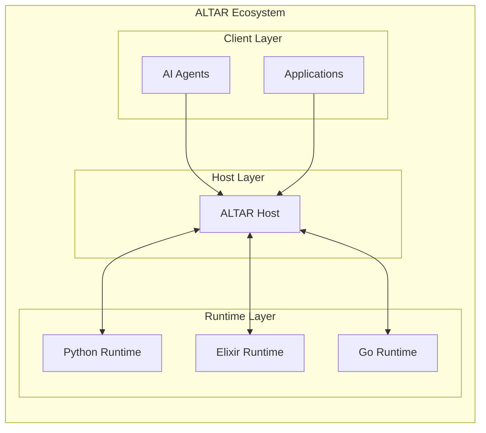

  

<h1 align="center">ALTAR Protocol</h1>

  <strong>The Agent & Tool Arbitration Protocol</strong>
   
  <em>A comprehensive, language-agnostic, and transport-agnostic protocol designed to enable secure, observable, and stateful interoperability between autonomous agents, AI models, and traditional software systems.</em>

    
    
    

---

## Overview

ALTAR (The Agent & Tool Arbitration Protocol) establishes a new standard for how AI agents and software systems interact with tools. It follows a **Host-Runtime** architecture where a central **Host** process orchestrates communication between multiple **Runtime** processes, each offering specialized tools and capabilities.

This design ensures security, scalability, and observability are built-in, not bolted on.

## Key Features

*   🛡️ **Secure by Default**: The Host manages all tool contracts. Runtimes *fulfill* contracts, they don't define them, preventing "Trojan Horse" vulnerabilities.
*   🌐 **Language & Transport Agnostic**: Implement Runtimes in any language (Python, Go, Node.js, Elixir, etc.) and communicate over any transport (gRPC, WebSockets, TCP, etc.).
*   ⚡ **Developer-Friendly Workflow**: A dual-mode system (`STRICT` vs. `DEVELOPMENT`) provides a secure-by-default path for production while enabling rapid developer iteration.
*   🔍 **Built-in Observability**: End-to-end tracing is a first-class feature, with `correlation_id`s propagated through the entire call chain.
*   📦 **Stateful Sessions**: Isolate context, state, and toolsets for different applications or users with first-class session management.
*   📈 **Clear Compliance Levels**: Adopt the protocol incrementally, from a minimal core implementation (Level 1) to a full enterprise-grade deployment (Level 3).

## Project Status

**The Altar Protocol specification is v1.0 complete and ready for implementation.**

The design has been finalized, incorporating extensive feedback on security, developer experience, and enterprise requirements. The next phase is to build the reference implementations of the Host and Runtimes.

For full details on the final review, see [docs/20250803_kiroSpecFinished_NextSteps.md](docs/20250803_kiroSpecFinished_NextSteps.md).

## Documentation

The complete protocol specification can be found in the `.kiro/specs/altar-protocol` directory.

*   **[Design Document](.kiro/specs/altar-protocol/design.md)**: The core architecture, message schemas (IDL), and security model.
*   **[Requirements Document](.kiro/specs/altar-protocol/requirements.md)**: The detailed requirements and acceptance criteria.
*   **[Implementation Plan](.kiro/specs/altar-protocol/tasks.md)**: The task-by-task plan for building the reference implementation.

---
