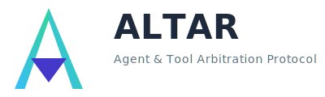

  

<h1 align="center">The ALTAR Productivity Platform for AI Agents</h1>

  <strong>From Local Development to Enterprise-Grade Production, Seamlessly.</strong>
   
  <em>ALTAR bridges the gap between the rapid prototyping of open-source AI frameworks and the security, governance, and scale required for enterprise deployment.</em>

    
    
    
    

---

## The Challenge: The Gap Between AI Development and Production

The AI agent ecosystem is exploding. Developers love the flexibility and rapid iteration of open-source frameworks like **LangChain**, **Semantic Kernel**, and **CrewAI**. They make it easy to build powerful tools on a local machine.

But moving from a local prototype to a secure, scalable, and compliant enterprise application is a massive leap. This creates a costly integration gap where engineering teams spend months building custom infrastructure for:

*   **Security:** How do you prevent a compromised agent from accessing unauthorized tools or data?
*   **Governance:** How do you enforce access control, audit tool usage, and manage the lifecycle of tool contracts?
*   **Scalability:** How do you run polyglot tools written in Python, Go, and TypeScript and scale them independently?
*   **Operations:** How do you manage deployment, observability, and state for distributed AI systems?

This is where ALTAR comes in.

## The Solution: A Seamless Promotion Path

ALTAR is a productivity platform designed to bridge this gap. It provides a seamless **promotion path** for your AI tools, allowing you to move from local development to a distributed, enterprise-grade production environment with a simple configuration change.

Our architecture is designed to facilitate this journey:

1.  **[LATER Protocol](specs/02-later-protocol/README.md)**: **The Frictionless On-Ramp.** LATER provides a best-in-class developer experience for building and testing tools locally. With built-in adapters for popular frameworks, you can use your existing tools without a rewrite.

2.  **[GRID Protocol](specs/03-grid-protocol/README.md)**: **The Secure Production Backend.** GRID provides the managed, secure fulfillment layer for your tools. It solves the hard problems of distributed systems—security, governance, and scalability—out of the box.

3.  **[ALTAR Data Model (ADM)](specs/01-data-model/README.md)**: **The Universal Contract.** By adopting and standardizing industry patterns, the ADM ensures a tool defined once can be understood and executed by both the LATER and GRID protocols, making the promotion path seamless.

## Key Features

*   🚀 **Seamless Promotion Path**: The core value proposition. Move from a local LATER runtime to a distributed GRID backend by changing a single line of configuration. No code changes required.

*   🤝 **Unmatched Interoperability**: Don't rewrite your existing tools. ALTAR provides bi-directional adapters for popular frameworks like **LangChain** and **Semantic Kernel**, meeting you where you are.

*   🛡️ **Enterprise Security Out-of-the-Box**: GRID's Host-centric security model shifts security from a developer's responsibility to a platform guarantee. With the **Altar Enterprise Security Profile (AESP)**, you get a pre-built control plane for RBAC, audit logging, and policy enforcement.

*   🌐 **Language-Agnostic Scalability**: The GRID protocol allows you to run and scale tool runtimes written in any language (Python, Go, TypeScript, etc.) independently from the host application, optimizing performance and cost.

*   🔍 **Built-in Observability**: First-class support for correlation IDs and metadata enables easy end-to-end tracing across local and distributed calls.

*   📦 **Stateful Sessions**: Isolate context, state, and toolsets for different users or workflows, a critical feature for building robust, multi-turn AI applications.

## Project Status & Implementations

**The v1.0 specifications for all three layers are complete and represent a unified, strategic vision for bridging the development-to-production gap.**

This repository serves as the home for the protocol specifications and the **canonical Elixir implementation** of the ecosystem.

#### 1. Canonical Elixir Host & LATER Implementation (This Repository)

The `lib/` directory contains the Elixir implementation of:
*   The **ALTAR Data Model** (`lib/altar/data_model/`)
*   The **LATER Protocol** (`lib/altar/later/`), providing a simple `use LATER.Tools` interface for Elixir developers.
*   The **GRID Protocol Host** (`lib/altar/grid/`), an OTP-based orchestration engine for managing distributed runtimes.

This allows an Elixir application (like one using `gemini_ex`) to both define its own local tools and orchestrate a fleet of remote, polyglot tool runtimes.

#### 2. Reference Runtimes

The `runtimes/` directory will contain reference implementations of lightweight GRID runtime SDKs for other languages (Python, TypeScript, Go). A developer wanting to expose their tools will only need to `pip install altar-grid-runtime`, add a decorator to their functions, and point it at the central Elixir Host.

## Documentation

The complete protocol specifications can be found in the `specs/` directory. They have been updated to reflect the platform's focus on productivity and interoperability.

*   **[01-data-model/README.md](specs/01-data-model/README.md)**: The core ALTAR Data Model (ADM).
*   **[02-later-protocol/README.md](specs/02-later-protocol/README.md)**: The LATER protocol for local execution.
*   **[03-grid-protocol/README.md](specs/03-grid-protocol/README.md)**: The GRID protocol for distributed execution.
    *   **[aesp.md](specs/03-grid-protocol/aesp.md)**: The Enterprise Security Profile for GRID.

## License

This project is licensed under the MIT License - see the [LICENSE](LICENSE) file for details.
