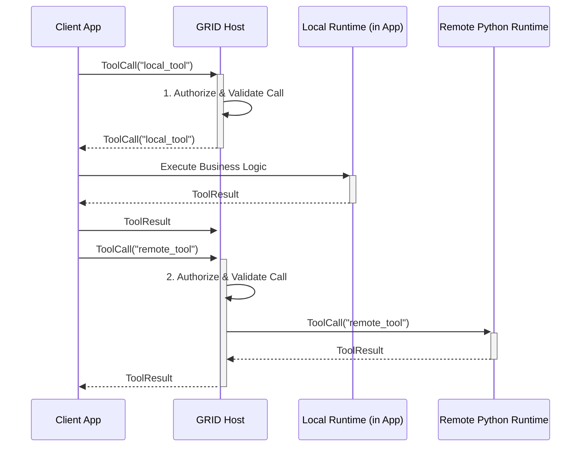

This is an excellent and crucial question. You have correctly identified a potential architectural dilemma that sits at the intersection of the `LATER` and `GRID` protocols. This isn't a hole in the design so much as a fundamental trade-off that every distributed system must confront: **the cost of consistency versus the performance of local execution.**

Let's break down the scenario and the competing strategies.

### The Scenario: The "Trusted Monolith" with Distributed Needs

You have a primary Elixir application (let's call it the "Client App") running in production.

1.  **Trusted Local Tools:** This app has its own set of core, trusted tools defined directly in its codebase. For these, it wants the zero-latency performance of an in-process `LATER` call.
2.  **Distributed Remote Tools:** This app also needs to call tools that are managed by the central GRID Host—tools that might be written in Python and run on a separate server.

The core dilemma is: **When the Client App wants to call one of its *own* local tools, must it incur a network round-trip to the GRID Host?**

There are two primary architectural strategies to handle this.

---

### Strategy A: The Unified Endpoint (Always Go Through GRID)

This is the approach you suggested: all tool calls, whether the implementation is local or remote, are sent to the central GRID Host.

#### How it Works



#### Pros:

*   **Architectural Simplicity & Consistency:** There is **one and only one way** to execute a tool in production: call the GRID Host. This makes the system easier to understand, maintain, and reason about.
*   **Full Governance & Auditability:** Every single tool call, regardless of where it is executed, passes through the central Host. This means **100% of tool executions are subject to the AESP control plane**. Every call is authenticated, authorized by the RBAC/Policy engines, and recorded in the immutable audit log. This is a massive win for security and compliance.
*   **Centralized Contract Management:** The Client App doesn't need to know or care where a tool is implemented. It simply asks the Host to run a tool by name. The Host is responsible for all routing and fulfillment logic, which can be changed at any time without redeploying the Client App.

#### Cons:

*   **Latency for Local Calls:** As you correctly identified, this introduces a network hop for what could be a direct function call. The latency might be small (e.g., <5ms on a local network), but it is non-zero.
*   **Single Point of Failure:** If the connection to the GRID Host is down, the Client App cannot execute *any* tools, even its own local ones.
*   **Increased Host Load:** Every call, local or remote, consumes resources on the GRID Host.

---

### Strategy B: The Hybrid Executor (Local First, GRID Fallback)

In this model, the Client App is "smarter." It contains both a LATER executor and a GRID client, and it makes a local decision about where to route a tool call.

#### How it Works

```mermaid
graph TD
    subgraph Client App
        A[Tool Call Request] --> B{is local_tool?};
        B -- Yes --> C[Execute via LATER (in-process)];
        B -- No --> D[Execute via GRID Client (network call)];
        C --> E[Result];
        D --> F((GRID Host));
        F --> D;
        D --> E;
    end
```

#### Pros:

*   **Maximum Performance:** Local tool calls have virtually zero latency, as they are simple in-process function calls.
*   **Reduced Host Dependency:** The Client App can continue to use its own local tools even if the GRID Host is temporarily unavailable.

#### Cons:

*   **Increased Complexity:** The Client App now needs to manage two execution runtimes and contain routing logic. This is a significant increase in complexity.
*   **Configuration Drift:** The Client App must maintain its own local "manifest" or routing table to know which tools are local. This list can easily become out of sync with the central GRID Host's manifest, leading to deployment and routing errors.
*   **Bypassed Governance (Critical Flaw):** This is the most significant drawback. **Any tool call handled locally by the LATER executor completely bypasses the GRID Host's security, policy, and audit mechanisms.** This creates a "shadow" execution path that is not governed by the AESP control plane, undermining the entire security model.
*   **Inconsistent Observability:** You now have two different streams of telemetry for tool calls—one from the local LATER runtime and one from the GRID Host—which can be difficult to correlate and analyze.

---

### **Recommendation and Final Design Decision**

For the ALTAR platform, **Strategy A (The Unified Endpoint) is the unequivocally recommended design.**

**Rationale:** The core value proposition of GRID is **Managed, Secure Fulfillment**. The marginal performance gain from the Hybrid Executor (Strategy B) is not worth the immense cost in complexity, configuration drift, and—most importantly—the complete loss of centralized governance for local calls.

Dealing with the "small latency" is the correct architectural trade-off. In modern cloud environments, this latency is often negligible for most applications. The benefits of having a single, consistent, and fully auditable execution path are paramount for any system that aims to be enterprise-ready.

#### How We Address the Latency Concern

While we accept the small latency, we can still optimize for it:

1.  **Co-location:** In a Kubernetes or cloud environment, the Client App and the GRID Host can be deployed in the same VPC, availability zone, or even the same cluster, making the network latency extremely low.
2.  **Optimized Transport:** Using gRPC over a persistent HTTP/2 connection minimizes the overhead of establishing new connections for each call.
3.  **Future: Federated Hosts:** For hyper-performance-sensitive use cases, a future version of the spec could introduce a "Federated Host" or "Sidecar Host" pattern. This would be a lightweight, trusted version of the GRID Host that runs alongside the Client App, handling local routing while still reporting audit logs to the central AESP control plane. This is an advanced pattern that should only be considered after the core unified model is implemented and proven.

**Conclusion:** We will proceed with the design that **all production tool calls must go through the centralized GRID Host**. The `LATER` protocol's role in production is not to be a parallel execution path, but to serve as the embedded runtime that fulfills calls *routed back to it* by the Host. This maintains architectural purity and guarantees that 100% of tool executions are secure and governed.
