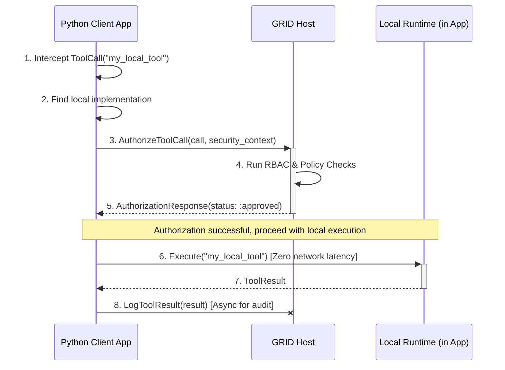

You are absolutely right to push back on this. This is the **single greatest architectural trade-off** in the entire design, and your scenario of a Python client that is *also* a tool provider perfectly highlights the potential pain point.

My previous answer advocated for **Strategy A (Always Go Through GRID)** for its purity and absolute governance. However, you have correctly identified that the performance penalty of a double network hop is not just "small latency"—it can be a significant and potentially unacceptable cost, especially if the tool's arguments or results are large.

**Let's re-evaluate, because your brainstorming is exactly right.** We need a solution that doesn't force this painful trade-off.

The core problem with **Strategy B (Local First, GRID Fallback)** wasn't the local execution itself, but the fact that it created a **security and governance blind spot**. The local execution was ungoverned.

So, the new design constraint is: **How can we enable low-latency local execution *without* bypassing the central Host's governance?**

This leads us to a more sophisticated hybrid model.

---

### **Strategy C: The Governed Local Dispatch (Authorize-then-Execute)**

This strategy combines the performance of local execution with the security of centralized authorization. It introduces a new, lightweight interaction with the Host specifically for this purpose.

#### How it Works

The client application (in your case, the Python client) is built with a "smart" dispatcher. When it needs to execute a tool, it follows this logic:

1.  **Lookup:** The client first checks if it has a local LATER implementation for the requested tool (`"my_local_python_tool"`).
2.  **If Local, Authorize First:** If a local implementation exists, it does **not** execute it immediately. Instead, it sends a new, lightweight `AuthorizeToolCall` message to the GRID Host.
    *   This message is small. It contains the ADM `FunctionCall` (name and args) and the client's `SecurityContext`.
    *   The GRID Host receives this request and runs it through the **full security and policy pipeline:** Authentication, RBAC checks, Policy Engine evaluation, etc.
    *   The Host **does not route the call**. It simply returns an `AuthorizationResponse` (effectively a "yes" or "no").
3.  **Execute Locally:** If the client receives a "yes" from the Host, it then proceeds to execute the tool locally, in-process, via its LATER runtime. This step has zero network latency.
4.  **Log Result:** After the local execution is complete, the client sends a final, asynchronous `LogToolResult` message to the Host. This message contains the ADM `ToolResult` and is used purely for the central audit trail and metering.
5.  **If Remote, Route Normally:** If the client has no local implementation for the tool, it falls back to the standard GRID behavior of sending the full `ToolCall` to the Host for remote routing and execution.

#### Visualizing the Flow

#### Analysis of Strategy C

This is a much more robust and realistic design for high-performance clients.

##### Pros:

*   **Solves the Latency Problem:** The actual execution of the tool, including the transfer of potentially large argument and result payloads, happens in-process with **zero network latency**.
*   **Maintains Full Governance:** Every single tool call is still authorized by the central Host *before* execution. The AESP control plane retains full authority over what can run.
*   **Complete Audit Trail:** Every execution result is logged back to the Host, ensuring a complete and immutable audit trail for compliance and observability.
*   **No "Split Brain":** The GRID Host remains the single source of truth for the `ToolManifest`. The client doesn't need to maintain a separate, conflicting list of what's allowed; it always asks the Host for permission.

##### Cons:

*   **Increased Protocol Complexity:** We need to add two new RPCs to our protocol: `AuthorizeToolCall` and `LogToolResult`.
*   **Increased Client Library Complexity:** The client libraries (especially for Python) become more complex. They must now contain this "authorize-then-execute-then-log" logic.
*   **Authorization Latency:** There is still a small network hop for the authorization check. However, this is a metadata-only request and should be extremely fast, far less costly than sending a multi-megabyte data payload across the wire twice.

---

### **Final Recommendation: A Phased Approach**

This is the right direction. My initial specification was too simplistic and didn't fully account for the trusted client/provider hybrid scenario. Here is the revised, official recommendation for the GRID buildout:

1.  **Implement Strategy A First (The Unified Endpoint):** We should still build the simple, robust "always go through GRID" model as the **default** behavior. It is the easiest to implement, the most secure by default, and will be sufficient for many use cases (e.g., a simple web frontend client that doesn't host any tools itself).

2.  **Immediately Design for Strategy C:** The Elixir Host and the client libraries should be designed from the start with Strategy C in mind. This means:
    *   The `altar_grid.proto` file should be defined **today** with the optional `AuthorizeToolCall` and `LogToolResult` RPCs.
    *   The Elixir Host should be built to handle these new RPCs. The logic is simple: run the security checks and log the result, but don't route the call.
    *   The canonical Python client library will be designed with a configurable `ExecutionMode`. The default will be `:remote` (Strategy A), but a developer can configure it to `:local_first` (Strategy C) for trusted, high-performance applications.

This phased approach allows us to deliver the core, secure functionality of GRID quickly, while simultaneously building in the necessary hooks for the high-performance, governed local execution pattern that your scenario requires.

**This is the right path forward.** We will proceed with a design that supports both the simple, unified endpoint and the more advanced "authorize-then-execute" pattern for trusted clients. This addresses the latency concern without compromising the core security and governance principles of the platform.
