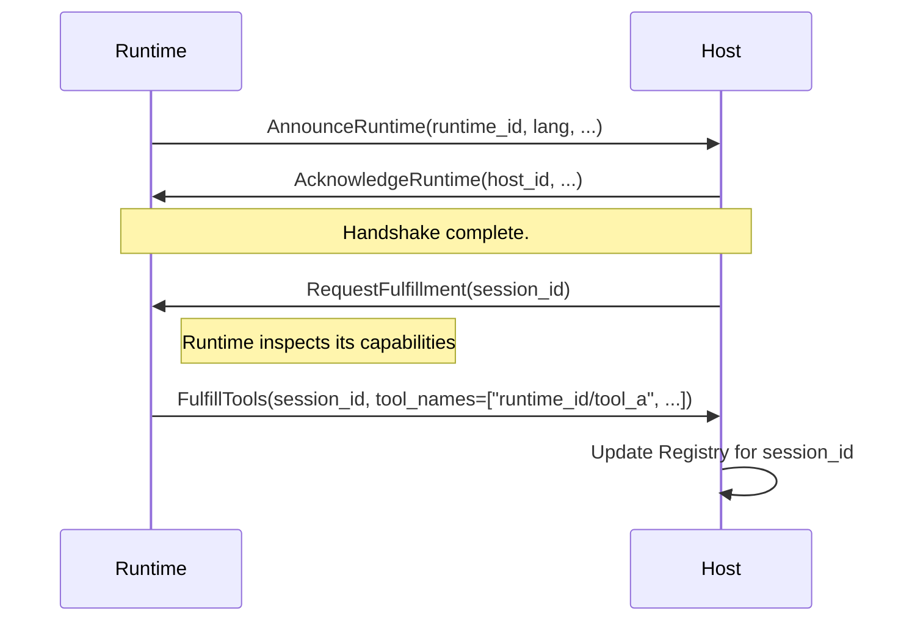
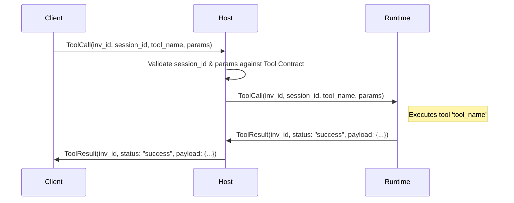
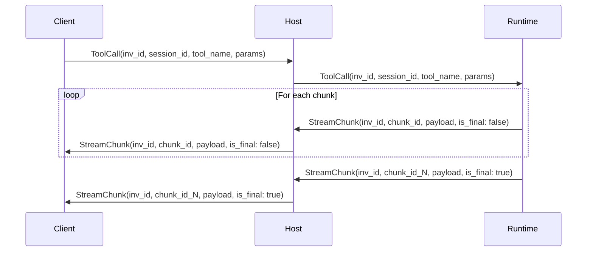

### **Altar Protocol Specification**
**Version:** 1.0.0 (DRAFT)
**Status:** DRAFT
**Acronym:** ATAP (Agent & Tool Arbitration Protocol)

#### **Table of Contents**
1.  [Introduction](#1-introduction)
2.  [Core Concepts](#2-core-concepts)
3.  [Compliance Levels](#3-compliance-levels)
4.  [Altar Type System](#4-altar-type-system)
5.  [Message Schemas](#5-message-schemas)
    - 5.1 Handshake & Registration
    - 5.2 Invocation & Results
    - 5.3 Session Management
    - 5.4 Common Schemas
6.  [Interaction Flows](#6-interaction-flows)
    - 6.1 Runtime Connection & Tool Registration
    - 6.2 Synchronous Tool Invocation
    - 6.3 Streaming Tool Invocation
7.  [Security Model](#7-security-model)
8.  [Appendix A: Standard Error Codes](#8-appendix-a-standard-error-codes)

---

### **1. Introduction**

#### 1.1. Vision
Altar is a comprehensive, language-agnostic, and transport-agnostic protocol designed to enable secure, observable, and stateful interoperability between autonomous agents, AI models, and traditional software systems. It serves as a foundational "Master Control Program" for enterprise tool integration and agent orchestration.

#### 1.2. Guiding Principles
*   **Transport-Agnostic**: The specification defines message schemas and interaction patterns, not the underlying transport.
*   **Language-Agnostic**: The protocol is implementable in any modern programming language, using a minimal set of primitive types.
*   **Stateful by Design**: Sessions are a first-class citizen, providing a robust mechanism for isolating state and context.
*   **Discoverability is Key**: Runtimes and their offered tools are dynamically discoverable.
*   **Observability is Built-in**: All key interactions are designed to carry correlation IDs and metadata for seamless tracing.
*   **Secure by Default**: The protocol is designed around a Host-centric security model where contracts are defined and enforced by the orchestrator, not the tool provider.

### **2. Core Concepts**

*   **Host**: The central process that implements the Altar protocol and orchestrates communication.
*   **Runtime**: An external process that connects to the Host to offer tools (e.g., a Python microservice).
*   **Session**: A stateful, isolated context for a series of interactions with a unique ID.
*   **Tool Contract**: A declarative schema, **managed by the Host**, defining a capability's name, description, and parameter schema. This is the source of truth.
*   **Tool Fulfillment**: A message from a Runtime indicating it can implement one or more of the Host's `Tool Contracts`.
*   **Invocation**: A request to execute a specific tool within a session, identified by a unique `invocation_id`.
*   **Result**: The outcome of a Tool Invocation, which can be a success with a payload or a structured error.
*   **Stream**: A sequence of `Chunks` associated with a single Invocation.
*   **Chunk**: A single message in a `Stream`.

### **3. Compliance Levels**

To facilitate adoption, Altar defines compliance levels. A system must fully implement a level to be considered compliant at that level.

*   **Level 1 (Core Compliance)**: The minimum required for a functional Altar system.
    *   Handshake & Registration (`AnnounceRuntime`, `FulfillTools`)
    *   Session Management (`CreateSession`, `DestroySession`)
    *   Synchronous Invocation (`ToolCall` -> `ToolResult`)
    *   Full Altar Type System
*   **Level 2 (Streaming Compliance)**: Includes all Level 1 features plus:
    *   Streaming Invocations (`StreamChunk` message)
    *   In-band stream error handling
*   **Future Levels**: May include specifications for state management (variables), advanced security contexts, and peer-to-peer orchestration.

### **4. Altar Type System**

#### 4.1. Primitive Types
| Type | Description |
|---|---|
| `string` | UTF-8 encoded text. |
| `integer` | 64-bit signed integer. |
| `float` | 64-bit IEEE 754 floating-point number. |
| `boolean` | True or false value. |
| `binary` | An array of bytes for arbitrary binary data. |

#### 4.2. Complex Types
| Type | Description |
|---|---|
| `array[T]` | An ordered list where `T` is any valid Altar type (including `object`). |
| `object` | A map of string keys to values, whose structure is defined by a `ParameterSchema`. |

#### 4.3. Parameter Schema
The structure used to define a single parameter within a tool's contract.

| Field Name | Type | Description |
|---|---|---|
| `name` | `string` | The parameter's name. |
| `type` | `string` | The Altar type (e.g., `"string"`, `"array[integer]"`). |
| `description` | `string` | A human-readable description of the parameter. |
| `required` | `boolean` | Whether this parameter is mandatory for invocation. |
| `properties` | `array[ParameterSchema]` | If `type` is `object`, this defines the nested fields. |

### **5. Message Schemas**

#### 5.1. Handshake & Registration

**`AnnounceRuntime`** (Runtime -> Host)
| Field Name | Type | Description |
|---|---|---|
| `runtime_id` | `string` | A unique identifier for this Runtime instance (e.g., "python-billing-svc-pod-xyz"). |
| `language` | `string` | The implementation language (e.g., "python", "elixir"). |
| `protocol_version` | `string` | The version of the Altar protocol this Runtime supports (e.g., "1.0.0"). |
| `capabilities` | `array[string]` | List of supported features (e.g., `["streaming"]`). |

**`AcknowledgeRuntime`** (Host -> Runtime)
| Field Name | Type | Description |
|---|---|---|
| `host_id` | `string` | A unique identifier for the Host instance. |
| `protocol_version` | `string` | The protocol version the Host is running. |

**`FulfillTools`** (Runtime -> Host)
| Field Name | Type | Description |
|---|---|---|
| `session_id` | `string` | The session to which these fulfillments apply. |
| `tool_names` | `array[string]` | A list of namespaced `Tool Contract` names this Runtime can execute. |

#### 5.2. Invocation & Results

**`ToolCall`** (Client -> Host -> Runtime)
| Field Name | Type | Description |
|---|---|---|
| `invocation_id` | `string` | UUID for this specific call, generated by the client and used for correlation and idempotency. |
| `session_id` | `string` | The session context for the call. |
| `tool_name` | `string` | The fully namespaced tool name (e.g., `python-billing-svc-pod-xyz/create_invoice`). |
| `parameters` | `object` | A map of parameter names to their values. |

**`ToolResult`** (Runtime -> Host -> Client)
| Field Name | Type | Description |
|---|---|---|
| `invocation_id` | `string` | Correlates with the `ToolCall`. |
| `status` | `string` | Either `"success"` or `"error"`. |
| `payload` | `any` | The return value of the tool (if successful). |
| `error` | `Error` | A structured error object (if `status` is `"error"`). |
| `runtime_metadata`| `object` | Execution time, resource usage, etc. |

**`StreamChunk`** (Runtime -> Host -> Client)
| Field Name | Type | Description |
|---|---|---|
| `invocation_id` | `string` | Correlates with the `ToolCall`. |
| `chunk_id` | `integer` | A sequential, 0-indexed identifier for ordering chunks. |
| `payload` | `any` | The partial data for this chunk. Omitted if `error` is present. |
| `error` | `Error` | A structured error object. If present, this chunk is the final one. |
| `is_final` | `boolean`| `true` if this is the last chunk in the stream. |

#### 5.3. Session Management

**`CreateSession`** (Client -> Host)
| Field Name | Type | Description |
|---|---|---|
| `session_id` | `string` (optional) | A client-suggested ID. The Host may override to ensure uniqueness. |
| `ttl_seconds` | `integer` (optional)| Requested time-to-live in seconds. Host policy may override this. |
| `security_context` | `SecurityContext` (optional) | Defines the security context for the session. |

**`DestroySession`** (Client -> Host)
| Field Name | Type | Description |
|---|---|---|
| `session_id` | `string` | The ID of the session to terminate. |

#### 5.4. Common Schemas

**`Error`**
| Field Name | Type | Description |
|---|---|---|
| `code` | `string` | A standard error code from the appendix (e.g., `TOOL_NOT_FOUND`). |
| `message` | `string`| A human-readable error description. |
| `details` | `object`| Additional structured context about the error. |

### **6. Interaction Flows**

#### 6.1. Runtime Connection & Tool Registration

#### 6.2. Synchronous Tool Invocation

#### 6.3. Streaming Tool Invocation

### **7. Security Model**

The Altar protocol delegates security to the Host, which acts as the central authority and policy enforcement point.

*   **Host-Defined Contracts**: The Host maintains a manifest of trusted **Tool Contracts**. A Runtime does not *register* a new, arbitrary tool; it announces that it can *fulfill* a contract already defined by the Host. This prevents Runtimes from defining malicious or misleading parameter schemas.
*   **Authentication**: Runtimes must authenticate with the Host upon connection. The specific mechanism (e.g., mTLS, API keys, JWT) is a transport-level concern, but the protocol requires the Host to associate every connected Runtime with a verified identity.
*   **Authorization**: Every `ToolCall` is authorized by the Host before being dispatched. The Host must check if the client/agent originating the call has the permission to execute the requested tool within the specified session.

### **8. Appendix A: Standard Error Codes**

| Code | Description |
|---|---|
| `TOOL_NOT_FOUND` | The requested tool is not registered for the session. |
| `INVALID_PARAMETERS`| The parameters provided in the `ToolCall` do not match the `Tool Contract` schema. |
| `RUNTIME_UNAVAILABLE`| The Runtime responsible for the tool is disconnected or unhealthy. |
| `SESSION_INVALID` | The provided `session_id` does not exist or has expired. |
| `AUTHORIZATION_FAILED`| The caller is not permitted to execute this tool in this session. |
| `EXECUTION_TIMEOUT` | The tool did not complete execution within its allotted time. |
| `EXECUTION_FAILED` | The tool's code threw an unhandled exception during execution. |
| `INTERNAL_ERROR` | An unspecified error occurred within the Host or Runtime. |
