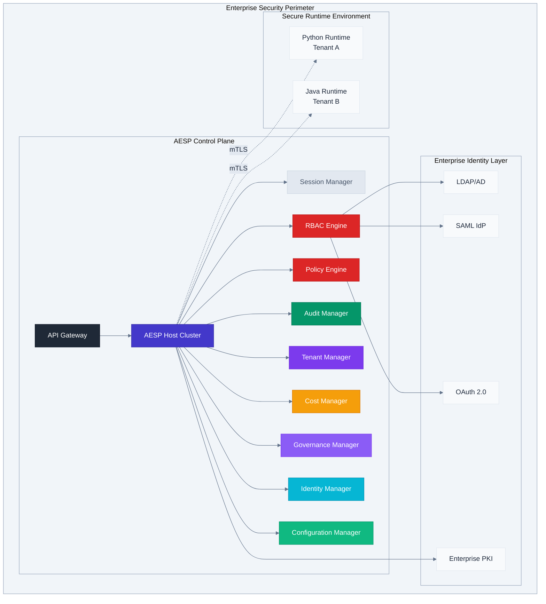

# **ALTAR Enterprise Security Protocol (AESP)**
## **Specification v3.0.0**

**Version**: 3.0.0
**Status**: FINAL
**Date**: October 26, 2023

### **Table of Contents**
1.  [**Introduction**](#1-introduction)
    - 1.1. Vision
    - 1.2. Guiding Principles
    - 1.3. Relationship to ALTAR Base Protocol
    - 1.4. Version 3.0.0 Changelog
2.  [**Architecture**](#2-architecture)
    - 2.1. System Architecture Diagram
    - 2.2. Core Components
    - 2.3. Inter-Service Orchestration
3.  [**Security Model**](#3-security-model)
    - 3.1. Zero Trust Principles
    - 3.2. Host-Managed Contracts
    - 3.3. Trust Architecture
4.  [**Protocol Definitions (IDL)**](#4-protocol-definitions-idl)
    - 4.1. Core Types and Enumerations
    - 4.2. Enterprise Message Extensions
    - 4.3. Enterprise Service Interfaces
5.  [**Enterprise Governance and Lifecycle**](#5-enterprise-governance-and-lifecycle)
    - 5.1. Policy Lifecycle Management
    - 5.2. Governance Approval Workflows
6.  [**Deployment & Operations**](#6-deployment--operations)
    - 6.1. Deployment Architecture
    - 6.2. Dynamic Configuration Management
7.  [**Client Integration & Developer Experience**](#7-client-integration--developer-experience)
    - 7.1. AESP Client SDK Vision
8.  [**Compliance & Certification**](#8-compliance--certification)
    - 8.1. Target Frameworks
9.  [**Appendix A: Well-Known Enumerations**](#9-appendix-a-well-known-enumerations)

---

## **1. Introduction**

### **1.1. Vision**
The ALTAR Enterprise Security Protocol (AESP) is a comprehensive, enterprise-grade orchestration protocol designed to enable secure, auditable, and observable interoperability between AI agents, autonomous systems, and enterprise tools within strict organizational boundaries. It serves as a foundational "master control program" for enterprise-grade AI, where security, governance, and compliance are paramount.

### **1.2. Guiding Principles**
*   **Security First**: The architecture is built on a Zero Trust model, with security controls integrated at every layer, not added as an afterthought.
*   **Centralized Governance, Distributed Execution**: The AESP Control Plane provides a single point of control for policy, audit, and governance, while tool execution is distributed across scalable, language-agnostic Runtimes.
*   **Complete Auditability**: Every significant action, from administrative changes to tool invocations, is captured in an immutable, cryptographically-signed audit log.
*   **Programmatic Administration**: All aspects of the platform—including policy, identity, cost, and configuration—are managed via secure, auditable APIs.
*   **Enterprise Integration**: The protocol is designed for seamless integration with existing enterprise infrastructure, including identity providers, secret managers, and SIEM systems.

### **1.3. Relationship to ALTAR Base Protocol**
AESP is a specialized profile of ALTAR designed for Level 3 Enterprise Compliance. AESP-specific messages, such as `EnterpriseRuntimeAnnouncement` and `EnterpriseSecurityContext`, **replace** their base protocol counterparts during enterprise deployments. They are designed to be supersets, containing all necessary base fields plus enterprise-specific extensions. This replacement approach ensures that enterprise deployments have complete control over security, compliance, and governance while maintaining the core ALTAR orchestration patterns.

### **1.4. Version 3.0.0 Changelog**
Version 3.0.0 represents the formalization of the enterprise-focused pivot, evolving AESP from a protocol into a complete system architecture. Key enhancements include:
*   **Full Control Plane Definition**: Introduction of first-class managers for **Identity, Governance, Cost, and Configuration**, transforming AESP into a fully governable platform.
*   **API Gateway Architecture**: Formalization of a unified API Gateway as the secure entry point for all client interactions, enhancing security and scalability.
*   **Advanced Policy Engine**: Adoption of **Common Expression Language (CEL)** as the standard for policy definition, providing a powerful, industry-standard mechanism for writing complex rules.
*   **Programmatic Governance**: Definition of the `EnterpriseGovernanceService`, which makes approval workflows for critical artifacts (policies, contracts) a programmatic and auditable process.
*   **Comprehensive Identity Management**: Definition of the `EnterpriseIdentityService` to provide a full administrative control plane for principals, especially service accounts.
*   **Dynamic Operational Control**: Introduction of the `ConfigurationManager` to allow for zero-downtime updates to system parameters.
*   **Developer Experience Focus**: Articulation of the vision for an **Enterprise Client SDK** to abstract complexity and provide a seamless development experience.

## **2. Architecture**

### **2.1. System Architecture Diagram**


### **2.2. Core Components**

*   **0. API Gateway**: The unified, secure entry point for all external client interactions, responsible for TLS termination, authentication, rate limiting, and routing to the appropriate internal services.
*   **1. AESP Host Cluster**: The central orchestration engine that manages sessions, routes tool invocations, and coordinates the activities of all other control plane components.
*   **2. RBAC Engine**: Manages hierarchical roles and permissions, integrating with enterprise identity providers to make fine-grained authorization decisions.
*   **3. Policy Engine**: Evaluates declarative policies written in Common Expression Language (CEL) to enforce complex, real-time security and business rules.
*   **4. Audit Manager**: Creates a cryptographically-signed, immutable audit trail of every significant system event, from administrative actions to tool invocations.
*   **5. Tenant Manager**: Enforces strict multi-tenant isolation for data, resources, and configuration, ensuring that different business units or customers can operate securely on shared infrastructure.
*   **6. Cost Manager**: Provides comprehensive financial governance by metering resource consumption, attributing costs, managing budgets, and integrating with enterprise billing systems.
*   **7. Governance Manager**: Orchestrates programmatic approval workflows for critical system artifacts like policies, tool contracts, and budgets, ensuring changes are auditable and controlled.
*   **8. Identity Manager**: Provides the administrative control plane for managing all system principals, including the lifecycle of service accounts and synchronization with external identity providers.
*   **9. Configuration Manager**: Enables dynamic, zero-downtime updates to the control plane's operational configuration, with changes managed through versioning and governance workflows.

### **2.3. Inter-Service Orchestration**
The components of the AESP Control Plane are designed to collaborate to enforce complex business logic. For instance, an `EnterpriseGovernanceService` workflow could query the `CostManager` to check budget compliance and the `PolicyEngine` to evaluate risk before routing a high-cost tool approval request to the appropriate approver. This inter-service orchestration is managed internally via secure gRPC, ensuring a cohesive and powerful governance framework.

## **3. Security Model**

### **3.1. Zero Trust Principles**
AESP implements a comprehensive zero trust security model based on five core principles:
1.  **Never Trust, Always Verify**: Every request is authenticated and authorized, regardless of its origin.
2.  **Least Privilege Access**: Principals are granted the minimum permissions required to perform their functions.
3.  **Assume Breach**: The system is designed to limit the blast radius of a potential internal compromise.
4.  **Continuous Monitoring**: Security posture and system activity are monitored in real-time.
5.  **Data-Centric Security**: Protection policies are attached to and travel with the data itself.

### **3.2. Host-Managed Contracts**
AESP's cornerstone security feature is its Host-managed contract system. The Host maintains the single source of truth for all `EnterpriseToolContract` definitions. Runtimes do not register tools; they announce their capability to *fulfill* a contract the Host already trusts. All parameter validation for tool calls occurs against the Host's trusted schema, mitigating the risk of "Trojan Horse" tools with malicious or misleading definitions.

### **3.3. Trust Architecture**
Trust is established through two primary mechanisms:
*   **Certificate-Based Trust**: All communication between the Host and Runtimes is secured with mutual TLS (mTLS), leveraging integration with an enterprise Public Key Infrastructure (PKI).
*   **Identity-Based Trust**: All principals are verified against enterprise identity providers (LDAP, SAML, OAuth 2.0). Access is governed by RBAC and fine-grained policies.

## **4. Protocol Definitions (IDL)**

The following Interface Definition Language (IDL) specifies the messages and services for AESP.

```idl
// 4.1. Core Types and Enumerations

enum PrincipalType {
  PRINCIPAL_TYPE_UNSPECIFIED = 0;
  USER = 1;
  SERVICE_ACCOUNT = 2;
  SYSTEM_ACCOUNT = 3; // For internal AESP processes
}

// 4.2. Enterprise Message Extensions

message EnterpriseSecurityContext {
  string principal_id = 1;
  string tenant_id = 2;
  map<string, string> claims = 3;
  string organization_id = 4;
  string business_unit = 5;
  repeated string roles = 6;
  repeated string permissions = 7;
  string security_clearance = 8;
  string data_classification = 9;
  uint64 session_expires_at = 10;
  map<string, string> policy_context = 11;
}

message AuditEvent {
  string event_id = 1;
  uint64 timestamp_ms = 2;
  string event_type = 3;
  string principal_id = 4;
  string tenant_id = 5;
  string session_id = 6; // Optional
  string resource = 7;
  string action = 8;
  string outcome = 9;
  string source_ip = 10;
  string user_agent = 11;
  map<string, string> metadata = 12;
  string risk_score = 13;
  repeated string policy_violations = 14;
}

message PolicyDefinition {
  string policy_id = 1;
  string name = 2;
  string description = 3;
  string version = 4;
  PolicyRule rule = 5;
  repeated string applies_to = 6;
  bool enabled = 7;
  uint64 created_at = 8;
  uint64 updated_at = 9;
  string created_by = 10;
}

message PolicyRule {
  string condition = 1; // Expressed in Common Expression Language (CEL)
  string effect = 2;    // ALLOW, DENY, AUDIT
  repeated string actions = 3;
  map<string, string> parameters = 4;
}

message EnterpriseToolContract {
  string name = 1;
  string contract_version = 2;
  string description = 3;
  repeated ParameterSchema parameters = 4;
  AltarType return_type = 5;
  bool supports_streaming = 6;
  string security_classification = 7;
  repeated string required_roles = 8;
  repeated string required_permissions = 9;
  string approval_status = 10;
  string approved_by = 11;
  uint64 approved_at = 12;
  repeated string compliance_tags = 13;
  string risk_assessment = 14;
  map<string, string> governance_metadata = 15;
}

message AccountingEvent {
  string event_id = 1;
  uint64 timestamp_ms = 2;
  string tenant_id = 3;    // Optional
  string principal_id = 4;
  string session_id = 5;   // Optional
  string resource_type = 6;
  double quantity = 7;
  string unit = 8;
  double unit_cost = 9;
  double total_cost = 10;
  string cost_center = 11;
  string project_id = 12;
  map<string, string> metadata = 13;
}

message EnterpriseError {
  string code = 1;
  string message = 2;
  map<string, string> details = 3;
  string tenant_id = 4;
  string principal_id = 5;
  string correlation_id = 6;
  uint64 retry_after_ms = 7;
  repeated string security_implications = 8;
  repeated string compliance_impact = 9;
  repeated string remediation_steps = 10;
  bool escalation_required = 11;
}

// 4.3. Enterprise Service Interfaces

service EnterpriseAuthenticationService {
  // ... (Full service definition from design doc)
}
message AuthenticateUserResponse {
  oneof response_type {
    SuccessfulAuthDetails success_details = 1;
    EnterpriseError error = 2;
  }
}
// ... (Other auth messages)

service EnterpriseAuthorizationService {
  // ... (Full service definition from design doc)
}
// ... (Other authz messages)

service EnterpriseAuditService {
  // ... (Full service definition from design doc)
}
// ... (Other audit messages)

service EnterprisePolicyService {
  // ... (Full service definition from design doc)
}
// ... (Other policy messages)

service EnterpriseCostManagementService {
  // ... (Full service definition from design doc)
}
// ... (Other cost messages)

service EnterpriseGovernanceService {
  rpc RequestApproval(RequestApprovalRequest) returns (RequestApprovalResponse);
  rpc AdjudicateApproval(AdjudicateApprovalRequest) returns (AdjudicateApprovalResponse);
  rpc ListPendingApprovals(ListPendingApprovalsRequest) returns (ListPendingApprovalsResponse);
  // ... (Other governance RPCs)
}
// ... (Other governance messages)

service EnterpriseIdentityService {
  rpc CreateServiceAccount(CreateServiceAccountRequest) returns (CreateServiceAccountResponse);
  rpc ListServiceAccounts(ListServiceAccountsRequest) returns (ListServiceAccountsResponse);
  rpc RevokeServiceAccount(RevokeServiceAccountRequest) returns (RevokeServiceAccountResponse);
  rpc ListPrincipals(ListPrincipalsRequest) returns (ListPrincipalsResponse);
  // ... (Other identity RPCs)
}
message ListPrincipalsRequest {
  string tenant_id = 1;
  PrincipalType principal_type = 2;
  bool include_inactive = 3;
  uint32 limit = 4;
  string cursor = 5;
}
// ... (Other identity messages)

service EnterpriseConfigurationService {
  rpc GetConfigValue(GetConfigValueRequest) returns (GetConfigValueResponse);
  rpc SetConfigValue(SetConfigValueRequest) returns (SetConfigValueResponse);
  rpc SubscribeToChanges(SubscribeToChangesRequest) returns (stream ConfigChangeEvent);
  // ... (Other config RPCs)
}
// ... (Other config messages)

```

## **5. Enterprise Governance and Lifecycle**

### **5.1. Policy Lifecycle Management**
AESP implements a comprehensive policy lifecycle to ensure safe, auditable policy updates. The process follows a structured workflow:
1.  **Development & Validation**: Policies are authored in CEL and validated for syntactic and semantic correctness.
2.  **Testing & Simulation**: The `TestPolicy` RPC is used to simulate policy effects against historical or synthetic data.
3.  **Governance Approval**: The policy definition is submitted to the `EnterpriseGovernanceService` for formal approval.
4.  **Staged Rollout**: Approved policies are activated via a controlled process, such as a canary deployment, and monitored for impact before full activation.

### **5.2. Governance Approval Workflows**
The `EnterpriseGovernanceService` provides a programmatic and auditable mechanism for managing changes to critical system artifacts (e.g., policies, tool contracts, budgets). All requests for approval create an auditable record, are routed to the appropriate principals based on configurable workflows, and require explicit adjudication before the change can be enacted.

## **6. Deployment & Operations**

### **6.1. Deployment Architecture**
AESP is designed for cloud-native deployment, primarily targeting Kubernetes. The AESP Host Cluster and its control plane components are deployed as scalable, highly available microservices. The API Gateway serves as the ingress point, routing traffic to the appropriate internal services.

### **6.2. Dynamic Configuration Management**
The `ConfigurationManager` provides a centralized service for managing the operational parameters of the AESP control plane. This allows administrators to update configuration settings, toggle feature flags, and tune performance parameters in real-time without requiring a system restart, thereby enabling zero-downtime operations. Sensitive configuration changes are subject to approval via the `GovernanceService`.

## **7. Client Integration & Developer Experience**

### **7.1. AESP Client SDK Vision**
To provide an optimal developer experience, a comprehensive Enterprise Client SDK will be provided. This SDK will abstract the complexity of the enterprise security infrastructure, handling tasks such as automatic token management, simplified interaction with the API Gateway, and intelligent processing of structured `EnterpriseError` responses. The SDK will be available in languages common to AI development, including Python, TypeScript, Java, and Go.

## **8. Compliance & Certification**

### **8.1. Target Frameworks**
AESP is designed with controls and features necessary to help organizations achieve compliance with major regulatory and security frameworks, including:
*   SOC 2 Type II
*   ISO 27001
*   GDPR
*   HIPAA
*   PCI DSS
*   FedRAMP

## **9. Appendix A: Well-Known Enumerations**

This section defines standardized enumerations used throughout the protocol.

**`PrincipalType`**
| Value | Name | Description |
| :--- | :--- | :--- |
| `0` | `PRINCIPAL_TYPE_UNSPECIFIED` | The type is not specified. |
| `1` | `USER` | A human user, typically synchronized from an external IdP. |
| `2` | `SERVICE_ACCOUNT` | A non-human principal native to AESP for automation. |
| `3` | `SYSTEM_ACCOUNT` | An internal AESP process or component. |

**Suggested `artifact_type` strings for Governance Service**
*   `POLICY_V1`
*   `TOOL_CONTRACT_V1`
*   `BUDGET_V1`
*   `ROLE_DEFINITION_V1`
*   `CONFIGURATION_KEY_V1`
*   `AUTHENTICATION_SUCCESS`
*   `AUTHENTICATION_FAILURE`
*   `AUTHORIZATION_SUCCESS`
*   `AUTHORIZATION_DENIED`
*   `TOOL_INVOCATION_START`
*   `TOOL_INVOCATION_COMPLETE`
*   `SESSION_CREATE`
*   `SESSION_DESTROY`
*   `POLICY_CREATE`
*   `POLICY_UPDATE`
*   `POLICY_VIOLATION`
*   `GOVERNANCE_APPROVAL_REQUEST`
*   `GOVERNANCE_APPROVAL_DECISION`
*   `IDENTITY_CREATE_SERVICE_ACCOUNT`
*   `IDENTITY_ASSIGN_ROLE`
*   `CONFIGURATION_UPDATE`

---

## **10. Future Considerations**

While AESP v3.0.0 provides a comprehensive and production-ready foundation, the following areas are identified for potential future enhancements in subsequent versions of the protocol.

### **10.1. AI-Powered Security Analytics**
Leverage the rich audit data collected by the `AuditManager` to build intelligent security features:
*   **Behavioral Analysis**: Implement ML-based anomaly detection to identify unusual agent behavior or access patterns that may indicate a compromise.
*   **Threat Intelligence**: Integrate with enterprise threat intelligence feeds to proactively block requests from known malicious IPs or actors.
*   **Predictive Security**: Develop predictive models to assess the risk of a given tool invocation or session before it occurs.
*   **Automated Response**: Create workflows for intelligent, automated incident response to critical security threats.

### **10.2. Advanced Compliance Automation**
Enhance the compliance framework with deeper automation and real-time monitoring:
*   **Regulatory Change Management**: Build systems to automatically ingest regulatory updates and suggest corresponding policy changes.
*   **Continuous Compliance Monitoring**: Implement real-time validation of the AESP deployment against specific compliance control families (e.g., SOC 2, ISO 27001).
*   **Automated Reporting**: Generate audit-ready compliance reports and evidence packages automatically for regulators and auditors.

### **10.3. Deeper Enterprise Integration**
Expand the ecosystem of integrations with other enterprise platforms:
*   **ITSM Integration**: Integrate with platforms like ServiceNow to automate ticket creation for security incidents or governance approvals.
*   **Advanced SIEM Integration**: Develop certified integrations with Splunk, Microsoft Sentinel, and IBM QRadar for seamless log ingestion and correlation.
*   **Data Governance Platforms**: Integrate with tools like Collibra to synchronize data classification labels and enforce enterprise-wide data governance policies.

## **11. Glossary of Terms**

*   **AESP (ALTAR Enterprise Security Protocol)**: The subject of this specification; an enterprise-grade protocol for secure AI agent orchestration.
*   **AESP Control Plane**: The collection of centralized microservices that manage all aspects of the protocol, including security, governance, and audit.
*   **API Gateway**: The single, unified entry point for all client traffic into the AESP Control Plane.
*   **CEL (Common Expression Language)**: The industry-standard language used by the Policy Engine to define complex, declarative rules.
*   **Host**: The central orchestration engine within the AESP Control Plane that manages Runtimes and routes tool invocations.
*   **Principal**: Any entity that can be authenticated and authorized, including human users and automated service accounts.
*   **Runtime**: An external, language-agnostic process that connects to the Host to fulfill one or more Tool Contracts.
*   **Session**: An isolated, stateful context for a series of interactions, associated with a specific principal and tenant.
*   **Tenant**: A top-level isolation boundary for users, data, resources, and policies, typically representing a business unit or customer.
*   **Tool Contract**: A declarative, Host-managed schema defining a capability's name, description, parameters, and security requirements.

## **12. Conclusion**

The ALTAR Enterprise Security Protocol Specification v3.0.0 defines a comprehensive, secure, and governable architecture for orchestrating AI agents in the modern enterprise. By building upon the core principles of the ALTAR protocol and layering on a robust suite of enterprise-grade services, AESP directly addresses the critical requirements of security, compliance, auditability, and financial control.

The architecture, centered on a Zero Trust model and a fully programmatic control plane, provides organizations with the necessary tools to confidently deploy and manage sophisticated AI systems. The adoption of industry standards like Common Expression Language (CEL) and its design for cloud-native deployment ensures that AESP is both powerful and operationally mature.

This document represents the final specification for version 3.0.0. It is considered complete, stable, and provides a sufficient blueprint for implementation. AESP is positioned not merely as a protocol, but as a complete platform for building the next generation of secure and responsible enterprise AI.
