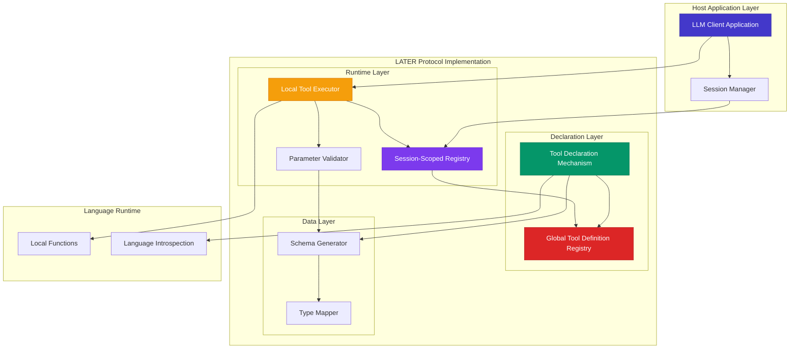
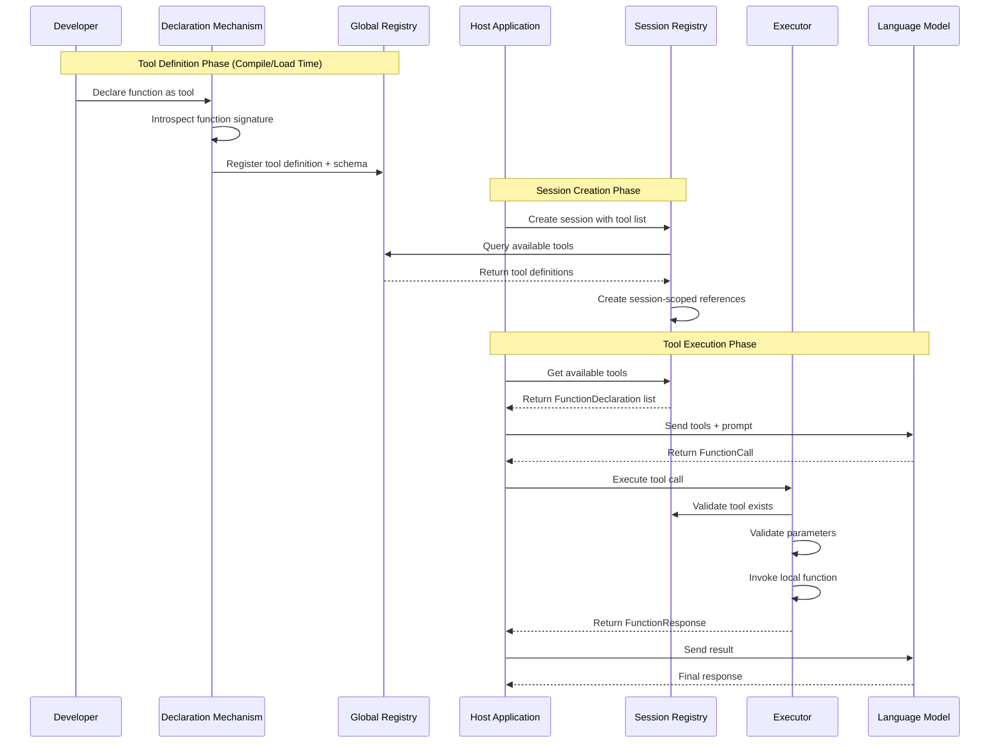
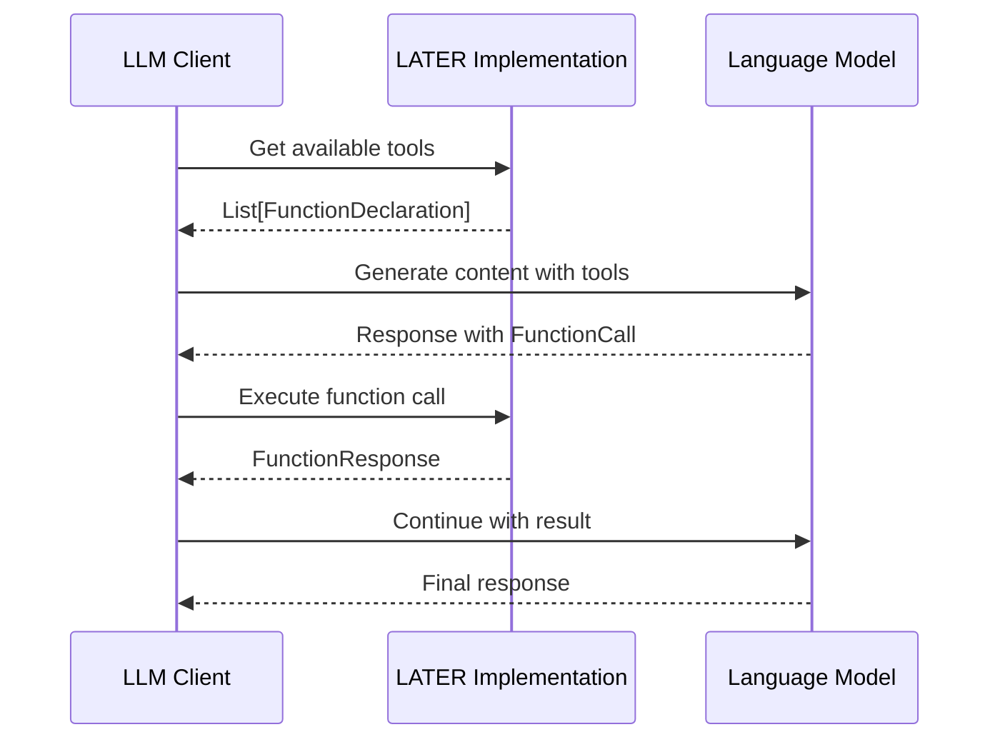

# LATER v1.0 Protocol Design Document

## Overview

The LATER (Local Agent & Tool Execution Runtime) v1.0 protocol provides a language-agnostic specification for enabling in-process tool execution by AI agents. This design document establishes the foundational architecture that separates the abstract protocol requirements from specific implementation patterns, ensuring broad language compatibility while maintaining seamless integration with the ALTAR protocol ecosystem.

The protocol is structured around four core abstract components: a Tool Declaration Mechanism, a Two-Tier Registry Architecture, a Local Tool Executor, and standardized Data Models that ensure compatibility with existing LLM client libraries and the broader ALTAR protocol family.

## Architecture

### High-Level System Architecture



### Protocol Flow Sequence



## Components and Interfaces

### Tool Declaration Mechanism

The Tool Declaration Mechanism is the entry point for developers to expose local functions as tools. Each language implementation must provide an idiomatic way to declare tools that automatically generates schemas through introspection.

**Abstract Interface Requirements:**
- Must provide a language-appropriate declaration syntax (macro, decorator, annotation)
- Must automatically introspect function signatures to extract parameter information
- Must generate ALTAR-compatible schemas from language-native type information
- Must register tool definitions in the Global Tool Definition Registry

**Canonical Implementation Pattern (Elixir):**
```elixir
defmodule MyTools do
  use LATER.Tools
  
  @doc "Calculates the sum of two numbers"
  deftool add(a :: integer(), b :: integer()) do
    a + b
  end
  
  @doc "Formats a greeting message"
  deftool greet(name :: String.t(), title :: String.t() \\ "Friend") do
    "Hello, #{title} #{name}!"
  end
end
```

**Implementation Pattern (Python):**
```python
from later import tool

@tool
def add(a: int, b: int) -> int:
    """Calculates the sum of two numbers"""
    return a + b

@tool  
def greet(name: str, title: str = "Friend") -> str:
    """Formats a greeting message"""
    return f"Hello, {title} {name}!"
```

### Two-Tier Registry Architecture

The registry system separates global tool definitions from session-scoped availability, enabling proper isolation while maintaining efficiency.

#### Global Tool Definition Registry

**Purpose:** Maintains the canonical registry of all declared tools and their schemas at the application level.

**Abstract Interface:**
```
register_tool(tool_name, function_reference, schema) -> Result
get_tool_definition(tool_name) -> ToolDefinition | NotFound
list_available_tools() -> List[ToolDefinition]
```

**Data Structure:**
```
ToolDefinition {
  name: String
  function_reference: LanguageSpecificReference
  schema: FunctionDeclaration
  metadata: Map[String, Any]
}
```

#### Session-Scoped Registry

**Purpose:** Manages tool availability within specific session contexts, referencing global definitions.

**Abstract Interface:**
```
create_session(session_id, available_tools) -> Result
get_session_tools(session_id) -> List[FunctionDeclaration]
cleanup_session(session_id) -> Result
```

**Data Structure:**
```
SessionRegistry {
  session_id: String
  available_tools: Map[String, ToolReference]
  created_at: Timestamp
}

ToolReference {
  tool_name: String
  global_definition: Reference[ToolDefinition]
  session_metadata: Map[String, Any]
}
```

### Local Tool Executor

The executor handles the runtime invocation of tools, including parameter validation and result formatting.

**Abstract Interface:**
```
execute_tool(session_id, function_call) -> FunctionResponse
validate_parameters(tool_schema, parameters) -> ValidationResult
```

**Execution Flow:**
1. Receive FunctionCall with session context
2. Lookup tool in session registry
3. Validate parameters against tool schema
4. Invoke the actual function with converted parameters
5. Format result as FunctionResponse
6. Handle errors and return structured error responses

### Parameter Validation and Type Conversion

**Type Mapping Requirements:**
- Each implementation must define mappings from language-native types to ALTAR schema types
- Must support primitive types: string, integer, float, boolean
- Must support complex types: arrays, objects/structs
- Must handle optional parameters and default values

**Validation Process:**
1. Check required parameters are present
2. Validate parameter types match schema expectations
3. Convert parameters to appropriate language-native formats
4. Apply any additional constraints defined in the schema

## Data Models

### Core Data Structures

The protocol uses ALTAR-compatible data structures to ensure seamless integration and promotion paths.

#### FunctionDeclaration
```
FunctionDeclaration {
  name: String
  description: String
  parameters: Schema
}
```

#### Schema
```
Schema {
  type: SchemaType
  description: String
  properties: Map[String, Schema]  // For OBJECT types
  items: Schema                    // For ARRAY types
  required: List[String]           // Required property names
  default: Any                     // Default value if optional
}

SchemaType = STRING | INTEGER | NUMBER | BOOLEAN | ARRAY | OBJECT
```

#### FunctionCall
```
FunctionCall {
  name: String
  args: Map[String, Any]
}
```

#### FunctionResponse
```
FunctionResponse {
  name: String
  content: Any
}
```

### Type System Mapping

Each language implementation must define explicit mappings between native types and schema types:

**Primitive Type Mappings:**
- String types → `:STRING`
- Integer types → `:INTEGER` 
- Float/Double types → `:NUMBER`
- Boolean types → `:BOOLEAN`

**Complex Type Mappings:**
- List/Array types → `:ARRAY` with `items` schema
- Map/Object/Struct types → `:OBJECT` with `properties` schema
- Optional/Nullable types → Schema with `required: false`

**Example Type Introspection (Elixir):**
```elixir
# Function signature: calculate_stats(numbers :: [integer()], options :: %{precision: integer()})
# Generated schema:
%Schema{
  type: :OBJECT,
  properties: %{
    "numbers" => %Schema{
      type: :ARRAY,
      items: %Schema{type: :INTEGER}
    },
    "options" => %Schema{
      type: :OBJECT,
      properties: %{
        "precision" => %Schema{type: :INTEGER}
      }
    }
  },
  required: ["numbers", "options"]
}
```

## Error Handling

### Error Classification

The protocol defines standardized error types that implementations must support:

```
ErrorType = 
  | TOOL_NOT_FOUND
  | PARAMETER_VALIDATION_FAILED  
  | EXECUTION_ERROR
  | SESSION_NOT_FOUND
  | TYPE_CONVERSION_ERROR
  | SCHEMA_GENERATION_ERROR
```

### Error Response Format

All errors must be returned in a structured format compatible with FunctionResponse:

```
ErrorResponse {
  name: String              // Tool name that failed
  error: {
    type: ErrorType
    message: String
    details: Map[String, Any]
    retry_possible: Boolean
  }
}
```

### Error Handling Strategies

1. **Parameter Validation Errors:** Return detailed information about which parameters failed validation and why
2. **Execution Errors:** Capture and format runtime exceptions from the underlying function
3. **Type Conversion Errors:** Provide clear guidance on expected vs. actual parameter types
4. **Schema Generation Errors:** Give actionable feedback for resolving type ambiguities

## Testing Strategy

### Unit Testing Requirements

**Schema Generation Testing:**
- Verify correct mapping of primitive types to schema types
- Test complex type introspection (arrays, objects, nested structures)
- Validate handling of optional parameters and default values
- Test error cases for ambiguous or unsupported types

**Registry Testing:**
- Test global tool registration and retrieval
- Verify session-scoped tool availability and isolation
- Test conflict resolution for duplicate tool names
- Validate proper cleanup of session resources

**Executor Testing:**
- Test parameter validation against various schema types
- Verify correct function invocation with converted parameters
- Test error handling and structured error responses
- Validate concurrent execution safety

**Integration Testing:**
- Test end-to-end tool declaration, registration, and execution flow
- Verify compatibility with actual LLM client libraries
- Test session lifecycle management
- Validate ALTAR compatibility with real FunctionCall/FunctionResponse data

### Compatibility Testing

**ALTAR Integration:**
- Verify FunctionDeclaration structures are compatible with ALTAR hosts
- Test tool promotion from LATER to ALTAR environments
- Validate schema compatibility across protocol boundaries

**Language Interoperability:**
- Test that schemas generated by different language implementations are equivalent
- Verify consistent behavior across different language runtimes
- Test integration with various LLM client libraries

## Integration with Host Applications

### LLM Client Integration Pattern

The protocol is designed to integrate seamlessly with existing LLM client libraries:



### Session Management Integration

Host applications manage sessions through a simple interface:

```
// Create session with specific tools
session = LATER.create_session(session_id, ["add", "greet", "calculate_stats"])

// Get tools for LLM
tools = LATER.get_session_tools(session_id)

// Execute tool calls
result = LATER.execute_tool(session_id, function_call)

// Cleanup
LATER.cleanup_session(session_id)
```

### Configuration and Initialization

Each implementation should provide configuration options for:
- Tool discovery paths or modules
- Session timeout and cleanup policies
- Error handling and logging preferences
- Type introspection behavior and fallbacks

## Promotion Path to ALTAR

### Schema Compatibility

Tools defined with LATER use identical schema structures to ALTAR, ensuring zero-friction promotion:

**LATER Tool Definition:**
```elixir
deftool calculate_metrics(data :: [map()], options :: map()) do
  # Local implementation
end
```

**ALTAR Tool Contract (after promotion):**
```elixir
# Same schema, different execution mechanism
%ToolContract{
  name: "calculate_metrics",
  parameters: %Schema{...},  # Identical schema
  # Now fulfilled by remote runtime instead of local function
}
```

### Migration Process

1. **Schema Extraction:** Export tool schemas from LATER global registry
2. **Contract Creation:** Create ALTAR ToolContract definitions using extracted schemas
3. **Runtime Implementation:** Implement tool logic in ALTAR-compatible runtime
4. **Host Configuration:** Update host to use ALTAR runtime instead of LATER
5. **Validation:** Verify identical behavior between local and distributed versions

The key insight is that the contract (schema) remains unchanged - only the execution mechanism changes from local function calls to distributed RPC calls.

## Implementation Guidelines

### Language-Specific Considerations

**Elixir Implementation:**
- Use macros for `deftool` declaration mechanism
- Leverage typespecs for automatic type introspection
- Use GenServer for registry implementations
- Integrate with OTP supervision trees

**Python Implementation:**
- Use decorators for `@tool` declaration mechanism
- Leverage type hints for automatic type introspection
- Use threading.Lock for concurrent access safety
- Integrate with standard logging and error handling

**TypeScript Implementation:**
- Use decorators for `@tool` declaration mechanism
- Leverage TypeScript type system for introspection
- Use Map/WeakMap for registry storage
- Provide async/await compatible interfaces

### Performance Considerations

- **Registry Lookups:** Use efficient data structures (hash maps) for O(1) tool lookups
- **Schema Caching:** Cache generated schemas to avoid repeated introspection
- **Parameter Validation:** Optimize validation for common parameter patterns
- **Memory Management:** Implement proper cleanup for session-scoped resources

### Security Considerations

- **Input Validation:** Always validate parameters against schemas before execution
- **Function Isolation:** Ensure tools cannot access unauthorized system resources
- **Error Information:** Avoid leaking sensitive information in error messages
- **Session Isolation:** Prevent cross-session data access or interference