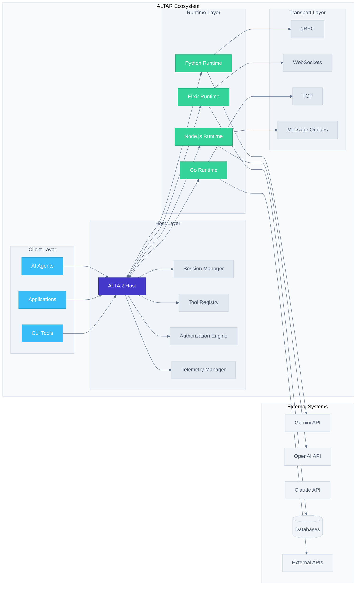

# ALTAR Protocol v2.0 Design Document

**Version**: 2.0.0
**Status**: Final

## V2.0 Changelog

This document specifies version 2.0 of the ALTAR protocol. It builds upon the v1.0 specification by introducing features that enhance robustness, lifecycle management, and enterprise-readiness.

Key changes from v1.0:
- **Runtime Lifecycle Notifications**: Introduced the `RuntimeStatusNotification` message (Host-to-Client) to allow clients to react gracefully when a Runtime becomes unavailable or reconnects.
- **Tool Contract Versioning**: Implemented a formal versioning system for individual tool contracts.
  - `ToolContract` now includes a `contract_version` field.
  - `ToolCall` can now specify a `contract_version_constraint` for precise tool selection.
- **Resource Management & Sandboxing**: Added a `resource_limits` field to the `AnnounceRuntime` message, allowing a Host to better manage resources and sandbox Runtimes for stability and security.

---

## Overview

ALTAR (The Agent & Tool Arbitration Protocol) is designed as a comprehensive, enterprise-grade protocol for enabling secure, observable, and stateful interoperability between autonomous agents, AI models, and traditional software systems. This design builds upon the proven architecture of `gemini_ex` and `snakepit` while establishing a new industry standard for tool arbitration.

The protocol follows a Host-Runtime architecture where a central Host process orchestrates communication between multiple Runtime processes, each offering specialized tools and capabilities. This design ensures scalability, security, and observability while maintaining language and transport agnosticism.

## Architecture

### High-Level System Architecture



### Core Components

#### 1. ALTAR Host
The central orchestration engine that manages all protocol interactions:
- **Session Management**: Creates, maintains, and destroys isolated execution contexts
- **Tool Registry**: Maintains a dynamic registry of available tools across all Runtimes
- **Message Routing**: Routes tool invocations to appropriate Runtimes
- **Authorization**: Enforces security policies and access controls
- **Health Monitoring & Notifications**: Monitors Runtime health and notifies clients of status changes.
- **Telemetry**: Collects and aggregates observability data

#### 2. Runtime Processes
External processes that connect to the Host to offer tools:
- **Tool Discovery**: Automatically discovers and registers available tools
- **Execution Engine**: Executes tool invocations within isolated contexts
- **State Management**: Maintains Runtime-specific state and resources
- **Health Monitoring**: Reports health status and performance metrics

#### 3. Transport Abstraction
Protocol-agnostic message transport supporting multiple backends:
- **gRPC**: High-performance, strongly-typed communication
- **WebSockets**: Real-time, bidirectional communication
- **TCP**: Low-level, custom protocol implementations
- **Message Queues**: Asynchronous, distributed communication

## Components and Interfaces

### Message Schema Definitions

#### ALTAR Compliance Levels

**Level 1 (Core Compliance)**: Minimum viable ALTAR implementation
- Runtime Announce & Handshake
- Session Creation/Destruction
- Session-scoped Tool Contract Fulfillment
- Synchronous ToolCall -> ToolResult flow
- Basic error handling

**Level 2 (Enhanced Compliance)**: Production-ready features
- Streaming support with StreamChunk messages
- Basic security contexts and authentication
- Observability hooks and telemetry events
- Advanced error handling and recovery

**Level 3 (Enterprise Compliance)**: Full-featured deployment
- Advanced security with authorization policies
- Distributed tracing and correlation
- Multi-host clustering and load balancing
- Performance optimizations and caching

#### Core Message Types (Language-Neutral IDL)

```idl
// Runtime Registration
message AnnounceRuntime {
  string runtime_id = 1;           // Unique identifier for this runtime instance
  string language = 2;             // Runtime language (e.g., "python", "elixir", "go")
  string version = 3;              // Runtime bridge implementation version
  repeated string capabilities = 4; // Supported ALTAR features (e.g., "streaming", "level_2")
  map<string, string> metadata = 5; // Additional runtime information
  // (Level 3+) Optional declaration of resource limits this runtime suggests.
  // A Host may use this information for scheduling and sandboxing.
  ResourceLimits resource_limits = 6;
}

// Tool Contract Fulfillment (replaces RegisterTools for security)
message FulfillTools {
  string session_id = 1;           // Target session for tool fulfillment
  repeated string tool_contracts = 2; // Host-defined contract names this runtime can fulfill
  string runtime_id = 3;           // Runtime providing the fulfillment
  map<string, string> capabilities = 4; // Runtime-specific capabilities per tool
}

// Tool Invocation
message ToolCall {
  // Client-generated UUID for this specific call. The Host SHOULD treat this
  // as an idempotency key for a short window (e.g., 5 minutes) to make the
  // system resilient to network retries.
  string invocation_id = 1;
  string correlation_id = 2;       // Top-level correlation ID for end-to-end tracing
  string session_id = 3;           // Session context for the call
  string tool_name = 4;            // Namespaced tool name (runtime_id/tool_name)
  map<string, Value> parameters = 5; // Tool parameters validated against Host contract
  map<string, string> metadata = 6;  // Caller-provided tracing/context metadata
  uint64 timeout_ms = 7;           // Maximum execution time in milliseconds
  // Optional version constraint for the tool contract, following SemVer syntax
  // (e.g., "1.2.3", ">=1.2.0, <2.0.0"). If omitted, Host uses the latest available version.
  string contract_version_constraint = 8;
}

// Tool Result
message ToolResult {
  string invocation_id = 1;        // Correlates with ToolCall
  string correlation_id = 2;       // Propagated correlation ID for end-to-end tracing
  ResultStatus status = 3;         // SUCCESS or ERROR
  Value payload = 4;               // Return value (if successful)
  Error error_details = 5;         // Structured error (if status is ERROR)
  map<string, string> runtime_metadata = 6; // Execution metrics from runtime
  uint64 execution_time_ms = 7;    // Actual execution time
}

// Streaming Chunk (Level 2+ feature)
message StreamChunk {
  string invocation_id = 1;        // Correlates with ToolCall
  uint64 chunk_id = 2;             // Sequential identifier for ordering
  Value payload = 3;               // Partial data for this chunk
  bool is_final = 4;               // Indicates end of stream
  Error error_details = 5;         // Optional in-band error reporting
  map<string, string> metadata = 6; // Chunk-specific metadata
}

// (Level 2+) Host-to-Client notification for runtime status changes.
// This allows clients to react to runtimes becoming unavailable or
// reconnecting, preventing calls to tools that are temporarily offline.
message RuntimeStatusNotification {
  string runtime_id = 1;         // The ID of the affected runtime.
  RuntimeStatus status = 2;      // The new status of the runtime.
  string message = 3;            // A human-readable message about the event.
  uint64 timestamp_ms = 4;       // UTC milliseconds timestamp of the event.
  map<string, string> metadata = 5; // Additional context.
}

// Session Management
message CreateSession {
  string session_id = 1;           // Client-suggested ID (Host may override)
  map<string, string> metadata = 2; // Initial session metadata
  uint64 ttl_seconds = 3;          // Requested time-to-live
  SecurityContext security_context = 4; // Security requirements (Level 2+)
}

// (Level 2+) Defines the security context for a session, making multi-tenancy
// a first-class citizen of the protocol.
message SecurityContext {
  // Identity of the end-user or principal on whose behalf the session is acting.
  // This is the CRITICAL piece for tenancy and data access control.
  string principal_id = 1;

  // The tenant or organization this session belongs to.
  string tenant_id = 2;

  // Opaque tokens or claims passed from an external auth system.
  map<string, string> claims = 3;
}

message DestroySession {
  string session_id = 1;           // Session to terminate
  bool force = 2;                  // Force cleanup even with active invocations
}

// Supporting Types
enum ResultStatus {
  SUCCESS = 0;
  ERROR = 1;
}

enum RuntimeStatus {
  RUNTIME_STATUS_UNSPECIFIED = 0;
  // The runtime has become unavailable (e.g., disconnected, crashed).
  // The Host will reject new calls to this runtime's tools.
  UNAVAILABLE = 1;
  // The runtime has reconnected and is ready to accept invocations.
  RECONNECTED = 2;
  // The runtime is connected but has reported it is in a degraded state.
  // It may still accept calls, but performance may be impacted.
  DEGRADED = 3;
}

// (Level 3+) Defines suggested resource limits for a runtime. A Host may use this
// to enforce sandboxing or schedule workloads. Fields are optional; a value of 0
// indicates no specific limit is requested.
message ResourceLimits {
  // Suggested maximum memory in megabytes.
  uint64 max_memory_mb = 1;
  // Suggested maximum number of CPU cores as a percentage (e.g., 100 for 1 core, 50 for 0.5 core).
  uint32 max_cpu_pct = 2;
  // Suggested maximum number of parallel tool calls the runtime is designed to handle.
  uint32 max_concurrent_invocations = 3;
}

message Value {
  oneof kind {
    NullValue null_value = 1;       // Explicit null value to avoid ambiguity
    string string_value = 2;
    int64 integer_value = 3;
    double float_value = 4;
    bool boolean_value = 5;
    bytes binary_value = 6;
    ValueArray array_value = 7;
    ValueObject object_value = 8;
  }
}

enum NullValue {
  NULL_VALUE = 0;  // Explicit null representation
}

message ValueArray {
  repeated Value items = 1;
}

message ValueObject {
  map<string, Value> properties = 1;
}
```

#### Enhanced Type System Definitions

```idl
// ALTAR Type System (Language-Neutral)
message ParameterSchema {
  string name = 1;                 // Parameter name
  AltarType type = 2;              // Parameter type definition
  string description = 3;          // Human-readable description
  bool required = 4;               // Whether parameter is required
  Value default_value = 5;         // Default value if not required
  map<string, string> constraints = 6; // Type-specific constraints (min, max, pattern, etc.)
}

message AltarType {
  oneof type_definition {
    PrimitiveType primitive = 1;
    ArrayType array = 2;
    ObjectType object = 3;
  }
}

enum PrimitiveType {
  STRING = 0;    // UTF-8 string
  INTEGER = 1;   // 64-bit signed integer
  FLOAT = 2;     // 64-bit IEEE 754 floating-point
  BOOLEAN = 3;   // True or false
  BINARY = 4;    // Raw byte array
}

message ArrayType {
  AltarType element_type = 1;      // Type of array elements (recursive)
}

message ObjectType {
  map<string, ParameterSchema> properties = 1; // Object property schemas (recursive)
  repeated string required_properties = 2;      // Required property names
}

// Tool Contract (Host-managed, security-focused)
message ToolContract {
  string name = 1;                 // Canonical tool name (without runtime prefix)
  // Semantic version of the contract (e.g., "1.0.0"). The combination of
  // name and version MUST be unique within a manifest.
  string contract_version = 2;
  string description = 3;          // Tool purpose and behavior
  repeated ParameterSchema parameters = 4; // Input parameter schemas
  AltarType return_type = 5;       // Expected return type
  bool supports_streaming = 6;     // Whether tool supports streaming results
  repeated string security_requirements = 7; // Required security contexts
  map<string, string> metadata = 8; // Additional contract metadata
  uint32 compliance_level = 9;     // Minimum ALTAR compliance level required
}

// Tool Manifest (Host-managed registry)
message ToolManifest {
  string manifest_version = 1;     // Manifest schema version
  repeated ToolContract contracts = 2; // Available tool contracts
  map<string, string> global_metadata = 3; // Manifest-level metadata
}
```

### Core Interface Definitions (Language-Neutral)

#### Session Management Interface

```idl
// Session Management Service
service SessionManager {
  rpc CreateSession(CreateSessionRequest) returns (CreateSessionResponse);
  rpc GetSession(GetSessionRequest) returns (GetSessionResponse);
  rpc DestroySession(DestroySessionRequest) returns (DestroySessionResponse);
  rpc ListSessions(ListSessionsRequest) returns (ListSessionsResponse);
}

message CreateSessionRequest {
  string suggested_session_id = 1;  // Client-suggested ID (optional)
  map<string, string> metadata = 2; // Initial session metadata
  uint64 ttl_seconds = 3;           // Requested time-to-live
  SecurityContext security_context = 4; // Security requirements
}

message CreateSessionResponse {
  string session_id = 1;            // Actual session ID (may differ from suggested)
  bool success = 2;                 // Creation success status
  string error_message = 3;         // Error details if success is false
}
```

#### Enhanced Tool Contract Management Interface

```idl
// Tool Contract Management Service (Host-managed for security)
service ToolContractManager {
  rpc LoadManifest(LoadManifestRequest) returns (LoadManifestResponse);
  rpc GetAvailableContracts(GetAvailableContractsRequest) returns (GetAvailableContractsResponse);
  rpc FulfillTools(FulfillToolsRequest) returns (FulfillToolsResponse);
  rpc RegisterTools(RegisterToolsRequest) returns (RegisterToolsResponse); // Development Mode only
  rpc GetToolContract(GetToolContractRequest) returns (GetToolContractResponse);
  rpc ListAvailableTools(ListAvailableToolsRequest) returns (ListAvailableToolsResponse);
  rpc UnregisterRuntime(UnregisterRuntimeRequest) returns (UnregisterRuntimeResponse);
  rpc SetHostMode(SetHostModeRequest) returns (SetHostModeResponse);
}

message LoadManifestRequest {
  ToolManifest manifest = 1;        // Tool contracts to load
  bool replace_existing = 2;        // Whether to replace existing contracts
}

// Bootstrap Discovery - allows Runtimes to discover available contracts
message GetAvailableContractsRequest {
  string runtime_id = 1;            // Runtime requesting contracts (optional for filtering)
  repeated string capability_filter = 2; // Filter by required capabilities
}

message GetAvailableContractsResponse {
  repeated ToolContract contracts = 1; // Available contracts this runtime could fulfill
  string host_mode = 2;             // Current host mode (STRICT or DEVELOPMENT)
}

message FulfillToolsRequest {
  string session_id = 1;            // Target session
  repeated string contract_names = 2; // Host-defined contracts this runtime can fulfill
  string runtime_id = 3;            // Runtime providing fulfillment
  map<string, string> capabilities = 4; // Runtime-specific capabilities
}

// Development Mode Dynamic Registration (insecure, development only)
message RegisterToolsRequest {
  string session_id = 1;            // Target session
  repeated ToolContract tool_contracts = 2; // Full contract definitions (development mode)
  string runtime_id = 3;            // Runtime providing the tools
  bool acknowledge_insecure = 4;    // Must be true to acknowledge security implications
}

message RegisterToolsResponse {
  bool success = 1;                 // Registration success status
  repeated string registered_tools = 2; // Successfully registered tool names (namespaced)
  map<string, string> errors = 3;   // Per-tool error messages
  string warning_message = 4;       // Security warning about development mode
}

message FulfillToolsResponse {
  bool success = 1;                 // Fulfillment success status
  repeated string fulfilled_tools = 2; // Successfully fulfilled tool names (namespaced)
  map<string, string> errors = 3;   // Per-tool error messages
}

message GetToolContractRequest {
  string session_id = 1;            // Session context
  string tool_name = 2;             // Namespaced tool name (runtime_id/tool_name)
}

message GetToolContractResponse {
  ToolContract contract = 1;        // Tool contract definition
  string fulfilling_runtime = 2;   // Runtime ID providing this tool
  bool available = 3;               // Whether tool is currently available
}

// Host Mode Management
message SetHostModeRequest {
  HostMode mode = 1;                // Desired host mode
  string admin_token = 2;           // Admin authentication token
}

message SetHostModeResponse {
  bool success = 1;                 // Mode change success
  HostMode current_mode = 2;        // Current active mode
  string warning_message = 3;       // Security warnings if applicable
}

enum HostMode {
  STRICT = 0;      // Production mode - only FulfillTools allowed
  DEVELOPMENT = 1; // Development mode - RegisterTools allowed (insecure)
}
```

### Transport Abstraction Interface

```elixir
defmodule ALTAR.Transport.Behaviour do
  @callback start_link(keyword()) :: GenServer.on_start()
  @callback send_message(pid(), ALTAR.Messages.message()) :: :ok | {:error, term()}
  @callback subscribe_events(pid(), pid()) :: :ok
  @callback get_connection_info(pid()) :: map()
end

defmodule ALTAR.Transport.GRPC do
  @behaviour ALTAR.Transport.Behaviour
  # Implementation for gRPC transport
end

defmodule ALTAR.Transport.WebSocket do
  @behaviour ALTAR.Transport.Behaviour
  # Implementation for WebSocket transport
end
```

## Data Models

### Session Data Model

```elixir
defmodule ALTAR.Types.Session do
  @type t :: %__MODULE__{
    id: String.t(),
    created_at: DateTime.t(),
    last_accessed: DateTime.t(),
    ttl_seconds: non_neg_integer(),
    metadata: map(),
    security_context: ALTAR.Types.SecurityContext.t(),
    registered_tools: %{String.t() => ALTAR.Types.ToolDefinition.t()},
    active_invocations: %{String.t() => ALTAR.Types.Invocation.t()},
    runtime_connections: %{String.t() => pid()}
  }
end
```

### Runtime Data Model

```elixir
defmodule ALTAR.Types.Runtime do
  @type t :: %__MODULE__{
    id: String.t(),
    language: String.t(),
    version: String.t(),
    capabilities: [String.t()],
    connection_pid: pid(),
    transport_type: atom(),
    health_status: :healthy | :degraded | :unhealthy,
    last_heartbeat: DateTime.t(),
    metadata: map()
  }
end
```

### Invocation Data Model

```elixir
defmodule ALTAR.Types.Invocation do
  @type status :: :pending | :executing | :completed | :failed | :streaming

  @type t :: %__MODULE__{
    id: String.t(),
    session_id: String.t(),
    tool_name: String.t(),
    runtime_id: String.t(),
    parameters: map(),
    status: status(),
    started_at: DateTime.t(),
    completed_at: DateTime.t() | nil,
    result: any(),
    error: ALTAR.Types.Error.t() | nil,
    metadata: map(),
    stream_chunks: [ALTAR.Messages.StreamChunk.t()]
  }
end
```

## Error Handling

### Error Classification System

```elixir
defmodule ALTAR.Types.Error do
  @type error_code ::
    :invalid_session |
    :tool_not_found |
    :parameter_validation_failed |
    :runtime_unavailable |
    :execution_timeout |
    :authorization_failed |
    :internal_error

  @type t :: %__MODULE__{
    code: error_code(),
    message: String.t(),
    details: map(),
    retry_after_ms: non_neg_integer() | nil,
    correlation_id: String.t()
  }
end
```

### Error Handling Strategies

1. **Graceful Degradation**: When a Runtime becomes unavailable, the Host continues operating with remaining Runtimes
2. **Retry Logic**: Configurable retry policies for transient failures
3. **Circuit Breaker**: Automatic failure detection and recovery for unhealthy Runtimes
4. **Error Propagation**: Structured error information propagated to clients with actionable details

## Testing Strategy

### Unit Testing
- **Message Serialization/Deserialization**: Verify correct encoding/decoding across all supported formats
- **Type Validation**: Ensure parameter validation works correctly for all ALTAR types
- **Session Management**: Test session lifecycle, TTL handling, and cleanup
- **Tool Registry**: Verify tool registration, discovery, and conflict resolution

### Integration Testing
- **Multi-Runtime Communication**: Test Host coordination with multiple connected Runtimes
- **Transport Layer**: Verify protocol works correctly across different transport mechanisms
- **Error Scenarios**: Test error handling, timeout behavior, and recovery mechanisms
- **Security**: Validate authentication, authorization, and secure communication

### Performance Testing
- **Concurrent Invocations**: Test system behavior under high concurrent load
- **Memory Usage**: Verify efficient memory management for long-running sessions
- **Latency**: Measure end-to-end latency for tool invocations
- **Throughput**: Test maximum sustainable message throughput

### Compatibility Testing
- **Language Interoperability**: Test Runtimes implemented in different languages
- **Version Compatibility**: Verify backward/forward compatibility across protocol versions
- **Transport Compatibility**: Ensure consistent behavior across different transport layers

## Developer Experience and Workflow Management

### Development vs Production Modes

ALTAR addresses the "agility vs rigidity" dilemma through dual operational modes:

#### Development Mode (Insecure, Development Only)
- **Dynamic Registration**: Hosts accept `RegisterTools` messages with full `ToolContract` definitions
- **Rapid Iteration**: Developers can add/modify tools without updating central manifests
- **Security Warnings**: All operations logged with explicit security warnings
- **Session Scoped**: Dynamic tools only available within the registering session
- **Admin Control**: Mode changes require admin authentication tokens

#### Production Mode (Secure, Default)
- **Manifest-Only**: Hosts only accept `FulfillTools` messages against pre-defined contracts
- **Security First**: All parameter validation uses Host-trusted schemas
- **Audit Trail**: Complete audit logging of all contract fulfillments
- **Enterprise Ready**: Suitable for production deployments with security requirements

### Runtime Bootstrap Discovery Flow

1. **Runtime Connection**: Runtime sends `AnnounceRuntime` with capabilities
2. **Contract Discovery**: Runtime calls `GetAvailableContracts` to discover fulfillable contracts
3. **Capability Matching**: Runtime compares available contracts against its own capabilities
4. **Contract Fulfillment**: Runtime sends `FulfillTools` with contracts it can implement
5. **Tool Availability**: Host makes tools available with proper namespacing

### Well-Known Capability Strings

The protocol defines standardized capability strings to ensure interoperability:

#### Core Capabilities
- `altar_level_1`: Supports Level 1 (Core) compliance features
- `altar_level_2`: Supports Level 2 (Enhanced) compliance features
- `altar_level_3`: Supports Level 3 (Enterprise) compliance features

#### Feature Capabilities
- `streaming`: Supports streaming tool invocations with `StreamChunk` messages
- `binary_payloads`: Supports efficient binary data transmission
- `async_execution`: Supports asynchronous tool execution patterns
- `batch_operations`: Supports batched tool invocations for performance

#### Transport Capabilities
- `grpc_transport`: Supports gRPC transport protocol
- `websocket_transport`: Supports WebSocket transport protocol
- `tcp_transport`: Supports raw TCP transport protocol
- `message_queue_transport`: Supports message queue transport

#### Security Capabilities
- `tls_encryption`: Supports TLS/SSL encrypted communication
- `certificate_auth`: Supports certificate-based authentication
- `oauth_integration`: Supports OAuth 2.0 authentication flows
- `parameter_encryption`: Supports message-level parameter encryption

## Future Considerations

### Batch Operations (Level 3+ Feature)

While the current specification focuses on single tool calls, a common and important optimization is batching. A formal batching mechanism is a Level 3+ feature, but is outlined here to ensure the architecture supports it.

```idl
// Level 3+ Feature
message BatchToolCall {
  string batch_correlation_id = 1; // ID for the entire batch
  string session_id = 2;
  repeated ToolCall calls = 3; // A list of individual tool calls
}

message BatchToolResult {
  string batch_correlation_id = 1;
  repeated ToolResult results = 2; // Results in the same order as the request
}
```

## Security Model and Trust Architecture

### Host-Managed Tool Contracts (Security-First Design)

ALTAR addresses the critical "Trojan Horse" tool definition vulnerability through a Host-managed contract system:

#### Traditional Vulnerability
In naive tool systems, Runtimes define their own tool schemas, creating security risks:
- A malicious Runtime could register `get_user_data(user_id: string)` but actually accept full user objects
- Parameter validation occurs against Runtime-provided schemas, not trusted definitions
- No central authority validates tool contracts or prevents malicious redefinition

#### ALTAR Solution: Host-Managed Contracts
1. **Tool Manifests**: The Host maintains trusted `ToolManifest` files defining expected tool contracts
2. **Contract Fulfillment**: Runtimes send `FulfillTools` messages indicating which contracts they can implement
3. **Host Validation**: The Host validates parameters using its own trusted schemas, never Runtime-provided ones
4. **Namespaced Tools**: All tools are prefixed with `runtime_id` to prevent collisions (e.g., `python-worker-1/calculate_metrics`)

##### Contract Versioning
The protocol supports the evolution of tool contracts through a formal versioning system.

- **Versioning**: Each `ToolContract` has a `contract_version` field, which should use semantic versioning (e.g., "1.0.0", "1.2.3"). The combination of a tool's `name` and `contract_version` must be unique.
- **Invocation**: A `ToolCall` can specify a `contract_version_constraint` using standard semantic version range specifiers (e.g., `"=1.2.3"`, `">=1.2.0, <2.0.0"`).
- **Resolution**: When the Host receives a `ToolCall`:
  - If a `contract_version_constraint` is provided, the Host MUST select the highest-numbered contract version that satisfies the constraint and is fulfilled by an available Runtime. If no such version exists, the Host MUST return a `TOOL_NOT_FOUND` error.
  - If the constraint is omitted, the Host MUST select the highest available version of the tool.
- **Fulfillment**: A Runtime fulfills a specific version of a contract by including the contract name and version in its `FulfillTools` message (e.g., `my_tool_v1.2.3`).

#### Security Benefits
- **Trust Inversion**: Host is the source of truth for tool contracts, not Runtimes
- **Parameter Safety**: All parameter validation uses Host-trusted schemas
- **Audit Trail**: Complete audit trail of which Runtime fulfills which contract
- **Collision Prevention**: Automatic namespacing prevents tool name conflicts

### Resource Management and Sandboxing (Level 3+ Feature)
To protect the ecosystem from "noisy neighbor" problems where a single runtime consumes disproportionate resources, the protocol defines a mechanism for declaring resource limits.

- **Declaration**: A Runtime can declare its suggested resource limits via the `resource_limits` field in the `AnnounceRuntime` message. This is a suggestion, not a demand.
- **Enforcement**: A Level 3+ Host MAY use this information to enforce resource isolation. This is an implementation detail of the Host, but could involve:
  - Running the Runtime in a container (e.g., Docker, Kubernetes) with cgroup limits matching the declaration.
  - Monitoring the Runtime's resource consumption and terminating it if it exceeds the declared limits.
  - Using the limits as hints for a scheduler to place runtimes on appropriate nodes in a cluster.
- **Compliance**: A Host is not required to enforce these limits to be compliant, but the ability to do so is a hallmark of an enterprise-grade, Level 3+ system.

### Compliance Level Security Requirements

#### Level 1 (Core): Basic Security
- Host-managed tool contracts with trusted schema validation
- Runtime authentication during connection
- Basic audit logging of tool invocations
- Session isolation and cleanup

#### Level 2 (Enhanced): Production Security
- Advanced authentication (certificates, OAuth)
- Authorization policies for tool access
- Encrypted parameter transmission
- Security context propagation

#### Level 3 (Enterprise): Advanced Security
- Multi-tenant security isolation
- Advanced audit logging with tamper-proof storage
- Security policy engines with rule-based access control
- Integration with enterprise identity providers

## Security Considerations

### Authentication Framework
```elixir
defmodule ALTAR.Auth.Behaviour do
  @callback authenticate_runtime(map()) :: {:ok, String.t()} | {:error, term()}
  @callback validate_session_access(String.t(), String.t()) :: :ok | {:error, term()}
end

defmodule ALTAR.Auth.APIKey do
  @behaviour ALTAR.Auth.Behaviour
  # API key-based authentication
end

defmodule ALTAR.Auth.Certificate do
  @behaviour ALTAR.Auth.Behaviour
  # Certificate-based authentication
end
```

### Authorization Model
- **Session-based Authorization**: Control access to sessions based on Runtime identity
- **Tool-level Authorization**: Fine-grained permissions for specific tool invocations
- **Parameter Filtering**: Ability to filter or redact sensitive parameters
- **Audit Logging**: Comprehensive logging of all authorization decisions

### Data Protection
- **Encryption in Transit**: All communication encrypted using TLS/SSL
- **Parameter Encryption**: Sensitive parameters encrypted at the message level
- **Secure Storage**: Session data and credentials stored using encryption at rest
- **Data Retention**: Configurable data retention policies with automatic cleanup

## Performance Optimizations

### Connection Management
- **Connection Pooling**: Efficient reuse of transport connections
- **Keep-alive Mechanisms**: Maintain persistent connections with health checks
- **Load Balancing**: Distribute tool invocations across multiple Runtime instances

### Message Optimization
- **Binary Serialization**: Use efficient binary formats for high-throughput scenarios
- **Message Batching**: Batch multiple small messages for improved throughput
- **Compression**: Optional message compression for bandwidth-constrained environments

### Caching Strategy
- **Tool Definition Caching**: Cache tool definitions to reduce registration overhead
- **Session State Caching**: Intelligent caching of session state for faster access
- **Result Caching**: Optional caching of tool results for idempotent operations

## Observability and Monitoring

### Telemetry Events
```elixir
defmodule ALTAR.Telemetry do
  @events [
    [:altar, :runtime, :connected],
    [:altar, :runtime, :disconnected],
    [:altar, :session, :created],
    [:altar, :session, :destroyed],
    [:altar, :tool, :registered],
    [:altar, :tool, :invoked],
    [:altar, :tool, :completed],
    [:altar, :tool, :failed],
    [:altar, :stream, :started],
    [:altar, :stream, :chunk],
    [:altar, :stream, :completed]
  ]
end
```

### Metrics Collection
- **Invocation Metrics**: Count, duration, success rate, error rate
- **Session Metrics**: Active sessions, session duration, resource usage
- **Runtime Metrics**: Connection count, health status, response times
- **System Metrics**: Memory usage, CPU utilization, network throughput

### Distributed Tracing
- **Span Propagation**: Trace requests across Runtime boundaries
- **Correlation IDs**: Unique identifiers for end-to-end request tracking
- **Context Propagation**: Maintain trace context through async operations
- **Integration**: Support for OpenTelemetry and other tracing systems

## Integration Patterns

### Gemini Integration
```elixir
defmodule ALTAR.Integrations.Gemini do
  @spec convert_to_gemini_tools([ALTAR.Types.ToolDefinition.t()]) :: [map()]
  def convert_to_gemini_tools(altar_tools)

  @spec handle_gemini_function_call(map(), String.t()) ::
    {:ok, ALTAR.Messages.ToolResult.t()} | {:error, term()}
  def handle_gemini_function_call(function_call, session_id)
end
```

### MCP Compatibility
```elixir
defmodule ALTAR.Integrations.MCP do
  @spec convert_from_mcp_tool(map()) :: ALTAR.Types.ToolDefinition.t()
  def convert_from_mcp_tool(mcp_tool)

  @spec convert_to_mcp_result(ALTAR.Messages.ToolResult.t()) :: map()
  def convert_to_mcp_result(altar_result)
end
```

### Legacy System Bridges
- **REST API Bridge**: Convert REST endpoints to ALTAR tools
- **Database Bridge**: Expose database operations as ALTAR tools
- **File System Bridge**: Provide file operations through ALTAR protocol
- **External API Bridge**: Wrap third-party APIs as ALTAR tools