# GRID (Global Runtime & Interop Director) v1.0: A Reference Architecture for Distributed Tool Execution

**Version:** 1.0.0
**Status:** Final
**Date:** August 5, 2025

## 1. Introduction

### 1.1. Vision & Guiding Principles

The **GRID (Global Runtime & Interop Director) Architecture** is a blueprint for a secure, scalable, and distributed backend for the ALTAR ecosystem. It describes the necessary components (Host, Runtime), their interactions, and the security model required for production-grade tool fulfillment.

GRID is built on two core principles:

1.  **Managed, Secure Fulfillment:** GRID's primary value is providing a secure, managed environment for tool execution. Its Host-centric security model (see Section 3) is not just a feature but the foundation of its enterprise-readiness.
2.  **Language-Agnostic Scalability:** GRID is designed from the ground up to orchestrate tool execution across a fleet of polyglot Runtimes. This allows specialized tools written in Python, Go, Node.js, etc., to be scaled independently of the host application, optimizing performance and resource allocation.

### 1.2. Relationship to ADM & LATER

GRID is the third layer of the three-layer ALTAR architecture, building upon the foundational contracts established by the ALTAR Data Model (ADM) and complementing the local execution model of the LATER implementation pattern.

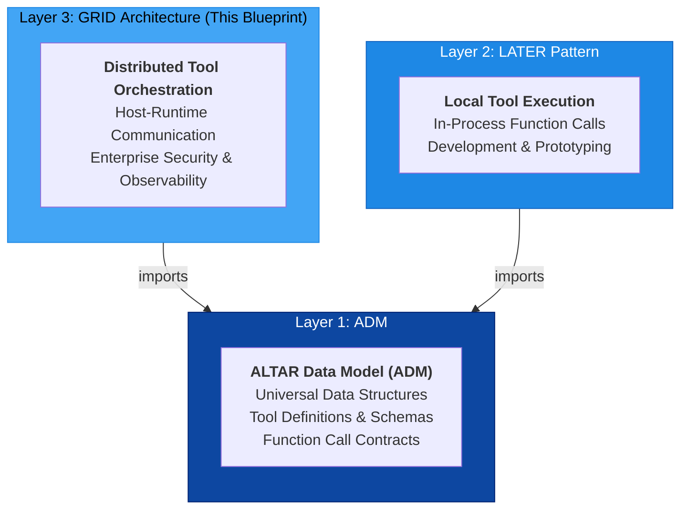
```mermaid
graph TB
    subgraph L3["Layer&nbsp;3:&nbsp;GRID&nbsp;Architecture&nbsp;(This&nbsp;Blueprint)"]
        direction TB
        A["<strong>Distributed Tool Orchestration</strong><br/>Host-Runtime Communication<br/>Enterprise Security & Observability"]
    end

    subgraph L2["Layer&nbsp;2:&nbsp;LATER&nbsp;Pattern"]
        direction TB
        B["<strong>Local Tool Execution</strong><br/>In-Process Function Calls<br/>Development & Prototyping"]
    end

    subgraph L1["Layer&nbsp;1:&nbsp;ADM"]
        direction TB
        C["<strong>ALTAR Data Model (ADM)</strong><br/>Universal Data Structures<br/>Tool Definitions & Schemas<br/>Function Call Contracts"]
    end

    L3 -- imports --> L1
    L2 -- imports --> L1

    style L3 fill:#42a5f5,stroke:#1e88e5,color:#000000
    style L2 fill:#1e88e5,stroke:#1565c0,color:#ffffff
    style L1 fill:#0d47a1,stroke:#002171,color:#ffffff
```

-   **Imports the ADM:** GRID is a consumer of the **ALTAR Data Model (ADM)**. All data payloads within GRID messages, such as function calls and results, **must** conform to the structures defined in the ADM specification (`FunctionCall`, `ToolResult`, etc.). This architecture defines the messages that *transport* these ADM structures between processes.
-   **Distributed Counterpart to LATER:** Where the LATER pattern specifies in-process tool execution for development, this blueprint specifies out-of-process, distributed tool execution for scalable, production-ready systems.

## 2. Architecture: The Host-Runtime Model

The GRID architecture is based on a Host-Runtime model, where a central Host orchestrates communication between clients and one or more Runtimes.

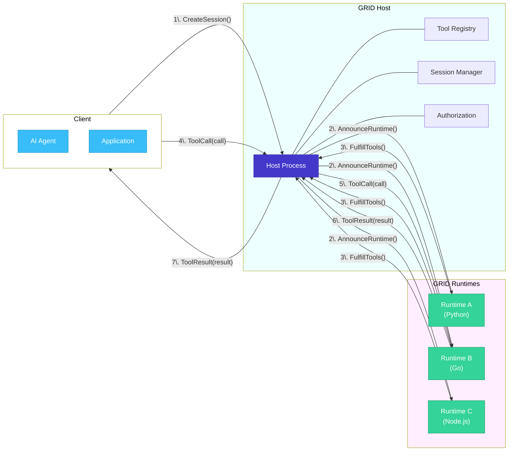
```mermaid
graph LR
    subgraph Client["Client"]
        direction TB
        C1[AI Agent]
        C2[Application]
    end

    subgraph GH["GRID&nbsp;Host"]
        direction TB
        H[Host Process]
        R[Tool Registry]
        S[Session Manager]
        A[Authorization]
        H --- R & S & A
    end

    subgraph GR["GRID&nbsp;Runtimes"]
        direction TB
        RT1["Runtime A<br/>(Python)"]
        RT2["Runtime B<br/>(Go)"]
        RT3["Runtime C<br/>(Node.js)"]
    end

    Client -- "1\. CreateSession()" --> H
    Client -- "4\. ToolCall(call)" --> H

    H -- "2\. AnnounceRuntime()" --> RT1
    H -- "2\. AnnounceRuntime()" --> RT2
    H -- "2\. AnnounceRuntime()" --> RT3

    RT1 -- "3\. FulfillTools()" --> H
    RT2 -- "3\. FulfillTools()" --> H
    RT3 -- "3\. FulfillTools()" --> H

    H -- "5\. ToolCall(call)" --> RT2

    RT2 -- "6\. ToolResult(result)" --> H

    H -- "7\. ToolResult(result)" --> Client

    style H fill:#4338ca,stroke:#3730a3,color:#ffffff,fontWeight:bold
    style RT1 fill:#34d399,stroke:#25a274,color:#ffffff
    style RT2 fill:#34d399,stroke:#25a274,color:#ffffff
    style RT3 fill:#34d399,stroke:#25a274,color:#ffffff
    style C1 fill:#38bdf8,stroke:#2899c8,color:#ffffff
    style C2 fill:#38bdf8,stroke:#2899c8,color:#ffffff

    style Client fill: #fff, color: #000
    style GH fill: #eff, color: #000
    style GR fill: #fef, color: #000
```

-   **Client:** Any application or agent that needs to invoke tools. The Client communicates only with the Host.
-   **Host:** The central orchestration engine. It manages sessions, maintains a registry of trusted tool contracts, enforces security, and routes invocations to the appropriate Runtime.
-   **Runtime:** An external process that connects to the Host to provide tool execution capabilities. A Runtime does not define tools; it *fulfills* tool contracts that the Host makes available.

## 3. Security Model: Host-Managed Contracts

GRID's most important feature is its **Host-centric security model**, which is designed to prevent "Trojan Horse" vulnerabilities common in other tool-use systems. In many systems, a tool provider (a Runtime) declares its own capabilities. A malicious or compromised Runtime could misrepresent its schema, tricking a client into sending sensitive data.

GRID solves this by inverting the trust model:

1.  **The Host is the Source of Truth:** The Host maintains a manifest of trusted **Tool Contracts**. These contracts are the *only* tool definitions the system recognizes.
2.  **Runtimes Fulfill, They Don't Define:** A Runtime cannot register a new tool. Instead, it can only announce that it is capable of *fulfilling* one or more of the contracts already defined by the Host.
3.  **Host-Side Validation:** When a Client sends a `ToolCall`, the Host validates the arguments against its own trusted contract *before* forwarding the call to the Runtime. The Runtime is never the authority on the contract schema.

> **GRID Security: From Developer Responsibility to Platform Guarantee**
>
> **Typical Open-Source Model:** Security is the developer's responsibility. The framework provides the primitives, but the developer must correctly implement input validation, access control, and secure deployment practices. A mistake can easily lead to a vulnerability.
>
> **The GRID Model:** Security is a platform guarantee. By centralizing contract authority and validation in the Host, GRID provides built-in protection against a class of vulnerabilities. The platform, not the developer, is responsible for ensuring that only trusted, validated calls are dispatched for execution. This significantly reduces the security burden on the application developer and provides a more robust, auditable system by design.

This model ensures that all tool interactions are governed by centrally-vetted, secure contracts, providing a high degree of security, auditability, and control, which is essential for enterprise environments.

### 2.3. Dual-Mode Operation

GRID supports two distinct operational modes that balance security requirements with development agility. These modes determine how tool contracts are managed and how Runtimes can register their capabilities with the Host.

#### 2.3.1. STRICT Mode (Production)

**STRICT mode** is designed for production environments where security, governance, and compliance are paramount. In this mode, the Host maintains complete control over tool contracts through a static manifest.

**Key Characteristics:**
- **Static Contract Authority:** The Host loads a predefined `ToolManifest.json` file at startup containing all approved tool contracts
- **No Dynamic Registration:** Runtimes cannot register new tools; they can only fulfill existing contracts from the manifest
- **Maximum Security:** All tool contracts are pre-vetted and approved through organizational governance processes
- **Immutable Runtime:** Once deployed, the available tool set cannot be modified without Host restart and manifest update

**Workflow:**
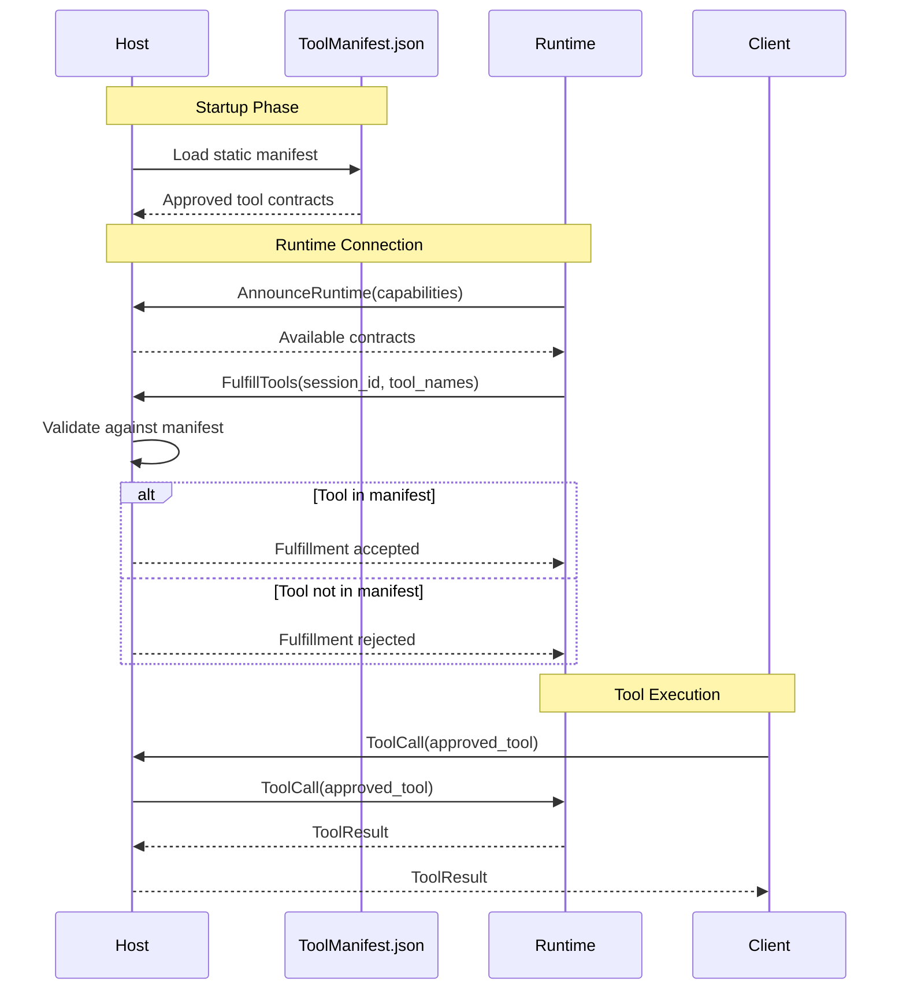
```mermaid
sequenceDiagram
    participant H as Host
    participant M as ToolManifest.json
    participant RT as Runtime
    participant C as Client

    Note over H,M: Startup Phase
    H->>M: Load static manifest
    M-->>H: Approved tool contracts

    Note over RT,H: Runtime Connection
    RT->>H: AnnounceRuntime(capabilities)
    H-->>RT: Available contracts

    RT->>H: FulfillTools(session_id, tool_names)
    H->>H: Validate against manifest
    alt Tool in manifest
        H-->>RT: Fulfillment accepted
    else Tool not in manifest
        H-->>RT: Fulfillment rejected
    end

    Note over C,RT: Tool Execution
    C->>H: ToolCall(approved_tool)
    H->>RT: ToolCall(approved_tool)
    RT-->>H: ToolResult
    H-->>C: ToolResult
```

**Use Cases:**
- Production deployments
- Regulated environments (healthcare, finance, government)
- Enterprise compliance scenarios
- High-security applications

**Configuration Example:**
```json
{
  "grid_mode": "STRICT",
  "manifest_path": "/etc/grid/tool_manifest.json",
  "allow_dynamic_registration": false,
  "security_level": "maximum",
  "audit_level": "full"
}
```

#### 2.3.2. DEVELOPMENT Mode (Development & Testing)

**DEVELOPMENT mode** is designed for development environments where rapid iteration and testing of new tools is essential. In this mode, Runtimes can dynamically register new tools with the Host during runtime.

**Key Characteristics:**
- **Dynamic Contract Registration:** Runtimes can register new tool contracts via `RegisterTools` messages
- **Rapid Iteration:** New tools can be tested immediately without manifest updates or Host restarts
- **Reduced Security:** Security guarantees are relaxed to enable development workflows
- **Session-Scoped:** Dynamic registrations are typically scoped to individual sessions

**Workflow:**
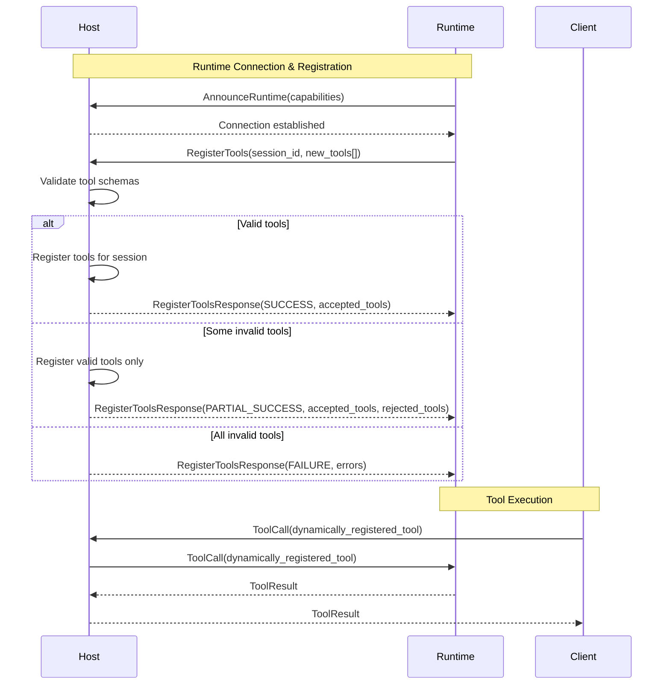
```mermaid
sequenceDiagram
    participant H as Host
    participant RT as Runtime
    participant C as Client

    Note over RT,H: Runtime Connection & Registration
    RT->>H: AnnounceRuntime(capabilities)
    H-->>RT: Connection established

    RT->>H: RegisterTools(session_id, new_tools[])
    H->>H: Validate tool schemas
    alt Valid tools
        H->>H: Register tools for session
        H-->>RT: RegisterToolsResponse(SUCCESS, accepted_tools)
    else Some invalid tools
        H->>H: Register valid tools only
        H-->>RT: RegisterToolsResponse(PARTIAL_SUCCESS, accepted_tools, rejected_tools)
    else All invalid tools
        H-->>RT: RegisterToolsResponse(FAILURE, errors)
    end

    Note over C,RT: Tool Execution
    C->>H: ToolCall(dynamically_registered_tool)
    H->>RT: ToolCall(dynamically_registered_tool)
    RT-->>H: ToolResult
    H-->>C: ToolResult
```

**Use Cases:**
- Local development environments
- Tool prototyping and testing
- Multi-language development workflows
- Continuous integration testing

**Security Warnings:**
> ⚠️ **DEVELOPMENT Mode Security Notice**
> 
> DEVELOPMENT mode provides reduced security guarantees and **MUST NOT** be used in production environments. Key security implications:
> 
> - Dynamic tool registration bypasses pre-approval governance processes
> - Malicious or buggy tools can be registered and executed
> - Reduced validation and authorization controls
> - All dynamic registrations are logged for audit purposes
> - Intended for trusted development environments only

**Configuration Example:**
```json
{
  "grid_mode": "DEVELOPMENT",
  "allow_dynamic_registration": true,
  "registration_audit_level": "full",
  "security_level": "development",
  "session_isolation": true,
  "max_dynamic_tools_per_session": 50
}
```

#### 2.3.3. Mode Selection Guidelines

**Choose STRICT Mode When:**
- Deploying to production environments
- Operating in regulated industries
- Compliance requirements mandate pre-approved tool sets
- Security is the primary concern
- Tool set is stable and well-defined

**Choose DEVELOPMENT Mode When:**
- Working in local development environments
- Prototyping new tools and workflows
- Testing multi-language tool integration
- Rapid iteration is required
- Operating in trusted, isolated environments

**Migration Path:**
Tools developed and tested in DEVELOPMENT mode can be promoted to STRICT mode by:
1. Adding the tested tool contracts to the static manifest
2. Switching the Host configuration to STRICT mode
3. Restarting the Host with the updated manifest
4. Verifying that Runtimes can fulfill the promoted contracts

This dual-mode approach enables organizations to maintain strict security controls in production while providing the flexibility needed for efficient development workflows.

> **Note on the `ToolContract` Definition**
>
> To maintain a clean separation of concerns, the definition of a `ToolContract` is layered across the ALTAR specification suite:
>
> 1.  **Structural Core (ADM):** The foundational **ALTAR Data Model (ADM)** defines the `FunctionDeclaration`, which is the universal, language-agnostic structural core of any tool's contract.
> 2.  **Conceptual Formalization (GRID):** The **GRID Architecture** (this document) formalizes the *concept* of a `ToolContract` as the trusted, Host-managed agreement that contains one or more `FunctionDeclaration`s. This is the level at which security and fulfillment policies are applied.
> 3.  **Enterprise Enrichment (AESP):** The **AESP (ALTAR Enterprise Security Profile)** further enriches this concept into a specific `EnterpriseToolContract` message, adding detailed fields for governance, compliance, and risk management.
>
> This layered approach allows the core tool definition to remain simple and universal while being progressively enhanced with the security and governance features required for more advanced, production-grade deployments.

## 4. Conceptual API Contracts and Message Schemas

> **Disclaimer:** The schemas defined below represent the **conceptual contracts** between the components in the GRID architecture. They are presented in a language-neutral IDL format. A concrete implementation of this architecture would realize these contracts using a specific wire protocol like gRPC (defining services in a `.proto` file) or a REST/HTTP API. The choice of wire protocol is an implementation detail of the GRID architecture.

These schemas define the messages exchanged between the Host and Runtimes. All payloads referencing tool structures (e.g., `FunctionCall`, `ToolResult`) are defined by the **ALTAR Data Model (ADM) Specification**.

### 4.1. Handshake & Fulfillment

Messages used for establishing a connection and declaring capabilities.

```idl
// Sent by a Runtime to the Host to announce its presence.
message AnnounceRuntime {
  string runtime_id = 1;           // Unique identifier for this runtime instance.
  string language = 2;             // Runtime language (e.g., "python", "elixir").
  string version = 3;              // Version of the GRID bridge implementation.
  repeated string capabilities = 4; // Supported GRID features (e.g., "streaming").
  map<string, string> metadata = 5; // Additional runtime-specific information.
}

// Sent by a Runtime to the Host to declare which trusted tool
// contracts it can execute for a given session.
message FulfillTools {
  string session_id = 1;           // The session for which tools are being fulfilled.
  repeated string tool_names = 2;  // Names of the Host-defined tool contracts to fulfill.
  string runtime_id = 3;           // The ID of the runtime providing the fulfillment.
}
```

### 4.2. Invocation & Results

Messages for executing a tool function and returning its result.

```idl
// Sent by the Host to a Runtime to request execution of a function.
// This message wraps a data structure from the ADM specification.
message ToolCall {
  string invocation_id = 1;        // Unique ID for this specific invocation.
  string correlation_id = 2;       // ID for tracing the entire workflow.
  ADM.FunctionCall call = 3;       // The function call payload, conforming to the ADM.
}

// Sent by a Runtime to the Host with the result of a function execution.
// This message wraps a data structure from the ADM specification.
message ToolResult {
  string invocation_id = 1;        // Correlates with the originating ToolCall.
  string correlation_id = 2;       // Propagated for end-to-end tracing.
  ADM.ToolResult result = 3;       // The function result payload, conforming to the ADM.
}

// (Level 2+) Sent by a Runtime to the Host for streaming results.
message StreamChunk {
  string invocation_id = 1;        // Correlates with the originating ToolCall.
  uint64 chunk_id = 2;             // Sequential identifier for ordering chunks.
  bytes payload = 3;               // Partial data for this chunk.
  bool is_final = 4;               // Flag indicating the end of the stream.
  Error error = 5;                 // Optional field for reporting in-band errors.
}
```

### 4.3. Session Management

Messages for managing the lifecycle of an interaction context.

```idl
// Sent by a Client to the Host to initialize a new interaction context.
message CreateSession {
  string suggested_session_id = 1;   // A client-suggested ID (Host may override).
  map<string, string> metadata = 2;   // Initial metadata for the session.
  uint64 ttl_seconds = 3;            // Requested time-to-live for the session.
  SecurityContext security_context = 4; // (Level 2+) Security context for the session.
}

// Sent by a Client to the Host to terminate an existing session.
message DestroySession {
  string session_id = 1;             // The ID of the session to terminate.
  bool force = 2;                    // If true, terminate even if invocations are active.
}
```

### 4.4. Supporting Types

Common data structures used across multiple messages.

```idl
// A structured error object.
message Error {
  string message = 1;              // A human-readable error message.
  string type = 2;                 // A standardized error code (e.g., "TOOL_NOT_FOUND").
}

// (Level 2+) Defines the security identity for a session.
message SecurityContext {
  string principal_id = 1;         // The end-user or service on whose behalf the session is acting.
  string tenant_id = 2;            // The organization or tenant this session belongs to.
  map<string, string> claims = 3;  // Opaque security claims from an auth system.
}

// Enhanced error structure with additional debugging and remediation context.
message EnhancedError {
  // Core fields (backward compatible with Error message)
  string message = 1;              // A human-readable error message.
  string type = 2;                 // A standardized error code (e.g., "TOOL_NOT_FOUND").
  
  // Enhanced fields for better debugging and remediation
  map<string, string> details = 3; // Additional error context and metadata.
  string correlation_id = 4;       // ID for tracing the entire workflow.
  uint64 timestamp = 5;            // Unix timestamp when the error occurred.
  
  // Retry guidance
  bool retry_allowed = 6;          // Whether the operation can be safely retried.
  uint64 retry_after_ms = 7;       // Suggested delay before retry attempt.
  
  // Remediation guidance
  repeated string remediation_steps = 8; // Suggested steps to resolve the error.
  string documentation_url = 9;    // Link to relevant documentation.
  
  // Context information
  string component = 10;           // Component that generated the error ("host", "runtime", "client").
  string session_id = 11;          // Session context where the error occurred.
  string runtime_id = 12;          // Runtime context where the error occurred.
}
```

### 4.5. Enhanced Protocol Messages

This section defines additional message types that support advanced GRID features including dynamic tool registration (DEVELOPMENT mode) and governed local dispatch patterns (Level 2+). These messages extend the core protocol while maintaining backward compatibility with Level 1 implementations.

#### 4.5.1. Dynamic Tool Registration Messages

These messages enable DEVELOPMENT mode functionality, allowing Runtimes to dynamically register new tool contracts with the Host during runtime.

```idl
// Sent by a Runtime to the Host to register new tool contracts dynamically.
// This message is only supported in DEVELOPMENT mode.
message RegisterToolsRequest {
  string runtime_id = 1;           // The ID of the runtime requesting registration.
  repeated ADM.Tool tools = 2;     // Tool contracts to register (ADM format).
  string session_id = 3;           // Session for which tools should be registered.
  map<string, string> metadata = 4; // Additional registration metadata.
}

// Sent by the Host to a Runtime in response to RegisterToolsRequest.
message RegisterToolsResponse {
  enum Status {
    SUCCESS = 0;                   // All tools were successfully registered.
    PARTIAL_SUCCESS = 1;           // Some tools were registered, others rejected.
    FAILURE = 2;                   // No tools were registered due to errors.
  }
  Status status = 1;               // Overall registration status.
  repeated string accepted_tools = 2; // Names of successfully registered tools.
  repeated string rejected_tools = 3; // Names of tools that were rejected.
  repeated EnhancedError errors = 4;  // Detailed error information for rejected tools.
  string session_id = 5;           // Session context for the registration.
}
```

**PARTIAL_SUCCESS Behavior Specification:**

When a `RegisterToolsRequest` contains multiple tools and some pass validation while others fail, the Host MUST:

1. **Register Valid Tools:** Successfully validated tools MUST be registered and made available for the session
2. **Reject Invalid Tools:** Failed tools MUST NOT be registered and MUST be listed in `rejected_tools`
3. **Return PARTIAL_SUCCESS:** The response status MUST be set to `PARTIAL_SUCCESS`
4. **Provide Detailed Errors:** Each rejected tool MUST have a corresponding `EnhancedError` in the `errors` array
5. **Log All Attempts:** Both successful and failed registration attempts MUST be logged for audit purposes

**Runtime Behavior on PARTIAL_SUCCESS:**

Runtimes receiving a `PARTIAL_SUCCESS` response SHOULD:
- Acknowledge that only `accepted_tools` are available for fulfillment
- Log or report the `rejected_tools` and associated errors for debugging
- Continue normal operation with the successfully registered tools
- Optionally retry registration of rejected tools after addressing the reported errors

#### 4.5.2. Governed Local Dispatch Messages (Level 2+)

These messages enable the governed local dispatch pattern, allowing lightweight authorization followed by local execution with asynchronous audit logging.

```idl
// (Level 2+) Sent by a Client or Runtime to request pre-authorization for local tool execution.
message AuthorizeToolCallRequest {
  string session_id = 1;           // Session context for the authorization request.
  SecurityContext security_context = 2; // Security context for authorization.
  ADM.FunctionCall call = 3;       // The function call to authorize (without execution).
  string correlation_id = 4;       // ID for tracing the entire workflow.
  map<string, string> metadata = 5; // Additional authorization context.
}

// (Level 2+) Sent by the Host in response to AuthorizeToolCallRequest.
message AuthorizeToolCallResponse {
  enum Status {
    APPROVED = 0;                  // Authorization granted, execution may proceed.
    DENIED = 1;                    // Authorization denied, execution must not proceed.
    PENDING = 2;                   // Authorization requires additional approval (future use).
  }
  Status status = 1;               // Authorization decision.
  string invocation_id = 2;        // Unique ID for correlating execution with authorization.
  string correlation_id = 3;       // Propagated for end-to-end tracing.
  EnhancedError error = 4;         // Error details if authorization was denied.
  uint64 authorization_ttl_ms = 5; // Time limit for using this authorization.
  map<string, string> execution_context = 6; // Additional context for execution.
}

// (Level 2+) Sent by a Client or Runtime to log the result of a locally executed tool.
message LogToolResultRequest {
  string session_id = 1;           // Session context for the execution.
  string invocation_id = 2;        // ID from the corresponding AuthorizeToolCallResponse.
  string correlation_id = 3;       // Propagated for end-to-end tracing.
  ADM.ToolResult result = 4;       // The execution result (ADM format).
  uint64 execution_time_ms = 5;    // Time taken to execute the tool locally.
  map<string, string> execution_metadata = 6; // Additional execution context.
  uint64 timestamp = 7;            // Unix timestamp when execution completed.
}

// (Level 2+) Sent by the Host in response to LogToolResultRequest.
message LogToolResultResponse {
  enum Status {
    LOGGED = 0;                    // Result successfully logged.
    REJECTED = 1;                  // Result rejected (invalid invocation_id, etc.).
  }
  Status status = 1;               // Logging status.
  string correlation_id = 2;       // Propagated for end-to-end tracing.
  EnhancedError error = 3;         // Error details if logging was rejected.
}
```

**Governed Local Dispatch Flow:**

The governed local dispatch pattern follows a three-phase approach:

1. **Authorization Phase:** Client requests authorization via `AuthorizeToolCallRequest`
2. **Execution Phase:** Client executes the tool locally using the provided `invocation_id`
3. **Audit Phase:** Client logs the execution result via `LogToolResultRequest`

This pattern provides zero-latency execution while maintaining complete Host authority over security and audit requirements.

**Security Guarantees:**

- **Full Host Authorization:** Every execution requires explicit Host approval before proceeding
- **Complete Audit Trail:** All executions are logged with correlation to their authorization
- **No Security Bypass:** Local execution cannot proceed without valid authorization
- **Tamper Detection:** Mismatched `invocation_id` values indicate potential security violations

**Performance Benefits:**

- **Zero Network Latency:** Tool execution happens locally without network round-trips
- **Reduced Payload Transfer:** Only lightweight authorization metadata crosses the network
- **Asynchronous Logging:** Audit logging doesn't block execution completion
- **Optimal for Large Payloads:** Particularly beneficial when tool arguments or results are large

## 5. Interaction Flows

### 5.1. Runtime Connection and Fulfillment

This flow describes how a new Runtime connects to the Host and makes its tools available for a session. The flow includes correlation ID tracking for end-to-end traceability.

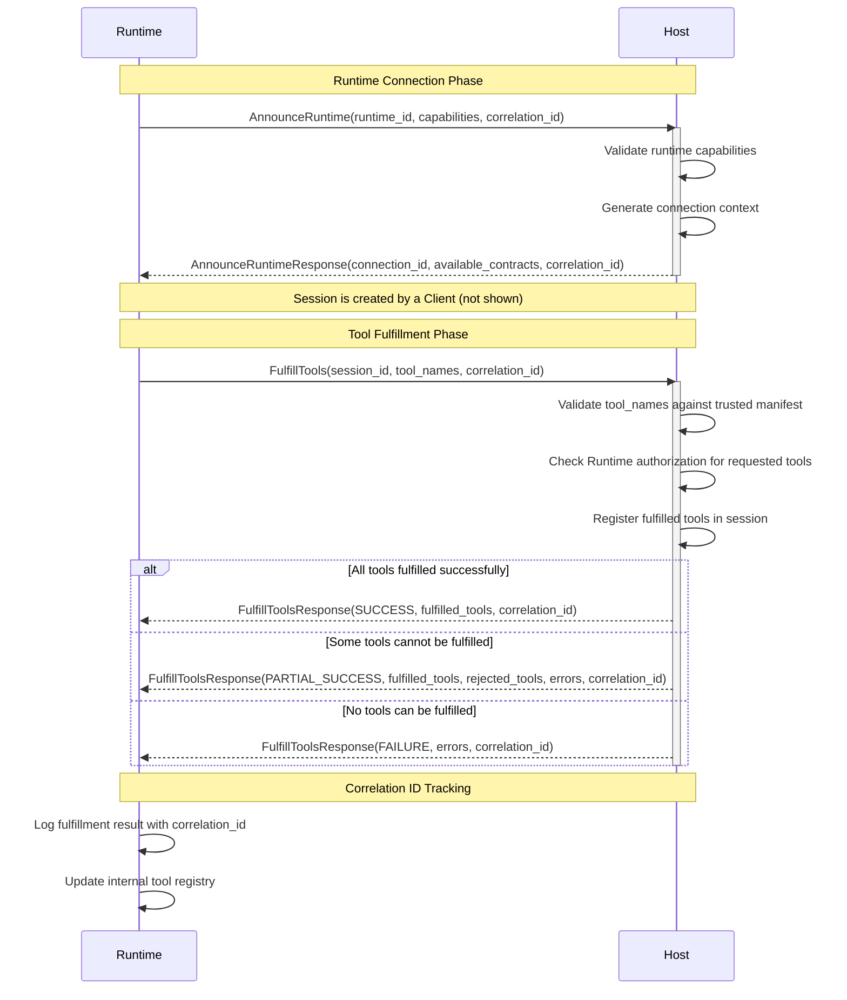
```mermaid
sequenceDiagram
    participant RT as Runtime
    participant H as Host

    Note over RT,H: Runtime Connection Phase
    RT->>H: AnnounceRuntime(runtime_id, capabilities, correlation_id)
    activate H
    H->>H: Validate runtime capabilities
    H->>H: Generate connection context
    H-->>RT: AnnounceRuntimeResponse(connection_id, available_contracts, correlation_id)
    deactivate H

    Note over RT, H: Session is created by a Client (not shown)

    Note over RT,H: Tool Fulfillment Phase
    RT->>H: FulfillTools(session_id, tool_names, correlation_id)
    activate H
    H->>H: Validate tool_names against trusted manifest
    H->>H: Check Runtime authorization for requested tools
    H->>H: Register fulfilled tools in session
    alt All tools fulfilled successfully
        H-->>RT: FulfillToolsResponse(SUCCESS, fulfilled_tools, correlation_id)
    else Some tools cannot be fulfilled
        H-->>RT: FulfillToolsResponse(PARTIAL_SUCCESS, fulfilled_tools, rejected_tools, errors, correlation_id)
    else No tools can be fulfilled
        H-->>RT: FulfillToolsResponse(FAILURE, errors, correlation_id)
    end
    deactivate H

    Note over RT,H: Correlation ID Tracking
    RT->>RT: Log fulfillment result with correlation_id
    RT->>RT: Update internal tool registry
```

**Enhanced Fulfillment Response Handling:**

When a Runtime receives a fulfillment response, it SHOULD:

1. **Process Successful Fulfillments:** Mark `fulfilled_tools` as available for execution
2. **Handle Rejections:** Log `rejected_tools` and associated errors for debugging
3. **Update Tool Registry:** Maintain accurate state of which tools are available
4. **Correlation Tracking:** Preserve `correlation_id` for tracing fulfillment through execution

**Correlation ID End-to-End Tracing:**

The runtime connection and fulfillment flow maintains complete traceability:
- Connection requests generate correlation IDs that flow through the entire handshake
- Fulfillment operations maintain correlation with their originating connection
- Subsequent tool executions can reference the fulfillment correlation for debugging

### 5.2. Synchronous Tool Invocation

This flow shows a standard, non-streaming tool call initiated by a Client, with enhanced error handling and correlation ID tracking for end-to-end traceability.

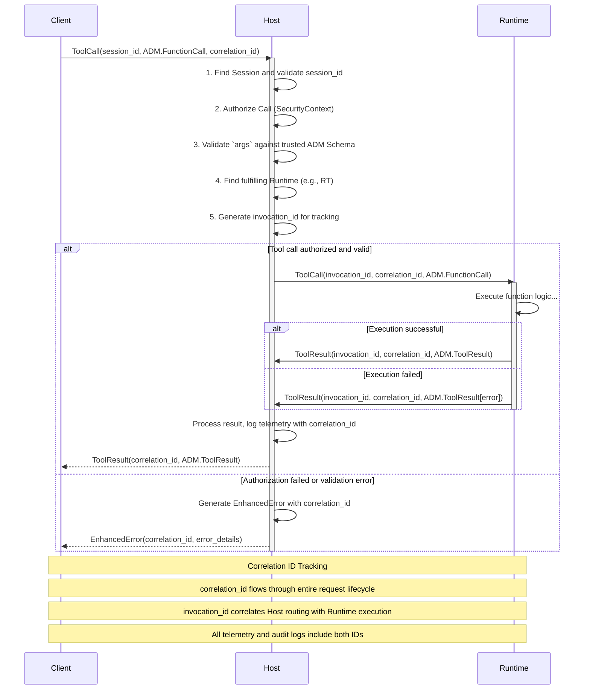
```mermaid
sequenceDiagram
    participant C as Client
    participant H as Host
    participant RT as Runtime

    C->>H: ToolCall(session_id, ADM.FunctionCall, correlation_id)
    activate H
    H->>H: 1. Find Session and validate session_id
    H->>H: 2. Authorize Call (SecurityContext)
    H->>H: 3. Validate `args` against trusted ADM Schema
    H->>H: 4. Find fulfilling Runtime (e.g., RT)
    H->>H: 5. Generate invocation_id for tracking

    alt Tool call authorized and valid
        H->>RT: ToolCall(invocation_id, correlation_id, ADM.FunctionCall)
        activate RT
        RT->>RT: Execute function logic...
        
        alt Execution successful
            RT->>H: ToolResult(invocation_id, correlation_id, ADM.ToolResult)
        else Execution failed
            RT->>H: ToolResult(invocation_id, correlation_id, ADM.ToolResult[error])
        end
        deactivate RT
        
        H->>H: Process result, log telemetry with correlation_id
        H-->>C: ToolResult(correlation_id, ADM.ToolResult)
    else Authorization failed or validation error
        H->>H: Generate EnhancedError with correlation_id
        H-->>C: EnhancedError(correlation_id, error_details)
    end
    deactivate H

    Note over C,RT: Correlation ID Tracking
    Note over C,RT: correlation_id flows through entire request lifecycle
    Note over C,RT: invocation_id correlates Host routing with Runtime execution
    Note over C,RT: All telemetry and audit logs include both IDs
```

**Enhanced Error Handling:**

The synchronous tool invocation flow includes comprehensive error handling:

1. **Session Validation Errors:** Invalid or expired session IDs result in `SESSION_INVALID` errors
2. **Authorization Errors:** Security context validation failures return `PERMISSION_DENIED` errors  
3. **Schema Validation Errors:** Malformed function calls return `SCHEMA_VIOLATION` errors
4. **Runtime Errors:** Tool execution failures are wrapped in `ToolResult` with error details
5. **Transport Errors:** Network or protocol issues generate `TRANSPORT_ERROR` responses

**Correlation ID End-to-End Tracing:**

The synchronous invocation flow maintains complete traceability through correlation IDs:

1. **Client Request:** Client generates or receives `correlation_id` for the operation
2. **Host Processing:** Host propagates `correlation_id` through all internal operations
3. **Runtime Execution:** Runtime receives and returns `correlation_id` with results
4. **Response Delivery:** Client receives `correlation_id` to correlate request with response
5. **Audit Logging:** All log entries include `correlation_id` for distributed tracing

**Performance Monitoring Integration:**

The enhanced flow supports performance monitoring through:
- **Invocation Timing:** Host tracks time from request to response
- **Runtime Performance:** Runtime execution time is captured and logged
- **Error Rate Tracking:** Failed invocations are categorized and monitored
- **Correlation Analysis:** Performance metrics can be correlated across the entire flow

### 5.3. DEVELOPMENT Mode Dynamic Tool Registration

This flow demonstrates how Runtimes can dynamically register new tools with the Host in DEVELOPMENT mode, including the handling of PARTIAL_SUCCESS responses.

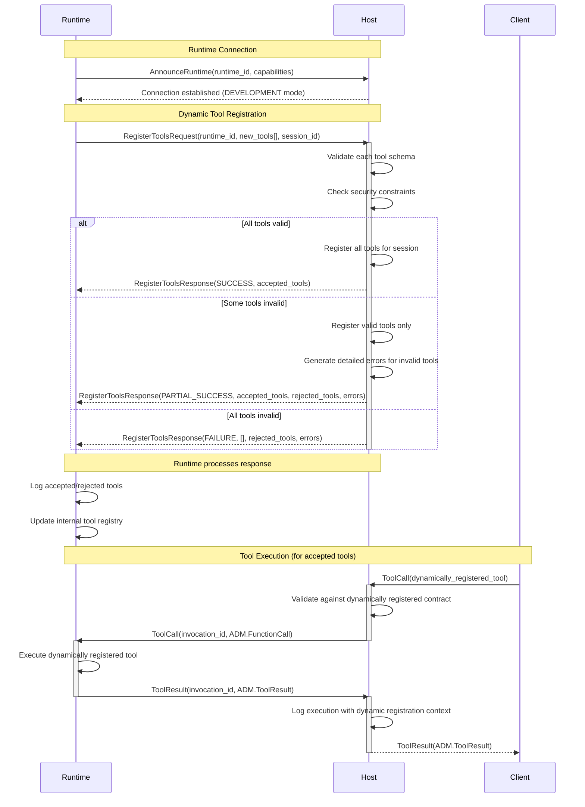
```mermaid
sequenceDiagram
    participant RT as Runtime
    participant H as Host
    participant C as Client

    Note over RT,H: Runtime Connection
    RT->>H: AnnounceRuntime(runtime_id, capabilities)
    H-->>RT: Connection established (DEVELOPMENT mode)

    Note over RT,H: Dynamic Tool Registration
    RT->>H: RegisterToolsRequest(runtime_id, new_tools[], session_id)
    activate H
    H->>H: Validate each tool schema
    H->>H: Check security constraints
    
    alt All tools valid
        H->>H: Register all tools for session
        H-->>RT: RegisterToolsResponse(SUCCESS, accepted_tools)
    else Some tools invalid
        H->>H: Register valid tools only
        H->>H: Generate detailed errors for invalid tools
        H-->>RT: RegisterToolsResponse(PARTIAL_SUCCESS, accepted_tools, rejected_tools, errors)
    else All tools invalid
        H-->>RT: RegisterToolsResponse(FAILURE, [], rejected_tools, errors)
    end
    deactivate H

    Note over RT,H: Runtime processes response
    RT->>RT: Log accepted/rejected tools
    RT->>RT: Update internal tool registry

    Note over C,RT: Tool Execution (for accepted tools)
    C->>H: ToolCall(dynamically_registered_tool)
    activate H
    H->>H: Validate against dynamically registered contract
    H->>RT: ToolCall(invocation_id, ADM.FunctionCall)
    deactivate H
    activate RT
    RT->>RT: Execute dynamically registered tool
    RT->>H: ToolResult(invocation_id, ADM.ToolResult)
    deactivate RT
    activate H
    H->>H: Log execution with dynamic registration context
    H-->>C: ToolResult(ADM.ToolResult)
    deactivate H
```

**Runtime Behavior on PARTIAL_SUCCESS:**

When a Runtime receives a `PARTIAL_SUCCESS` response, it SHOULD:

1. **Update Tool Registry:** Mark only `accepted_tools` as available for fulfillment
2. **Log Rejections:** Record `rejected_tools` and associated errors for debugging
3. **Continue Operation:** Proceed with normal operation using successfully registered tools
4. **Optional Retry:** Attempt to re-register rejected tools after addressing reported errors

**Correlation ID Tracking:**

All messages in dynamic registration flows include correlation IDs for end-to-end tracing:
- Registration requests generate a correlation ID that flows through the entire registration process
- Tool executions using dynamically registered tools maintain correlation with their registration
- Audit logs capture the relationship between registration and subsequent executions

### 5.4. Governed Local Dispatch Pattern

This flow demonstrates the three-phase governed local dispatch pattern: lightweight authorization, zero-latency local execution, and asynchronous audit logging.

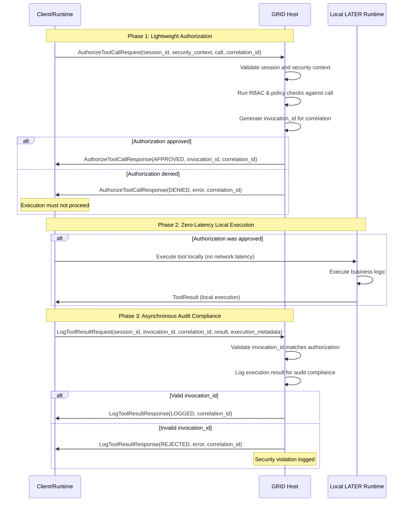
```mermaid
sequenceDiagram
    participant C as Client/Runtime
    participant H as GRID Host
    participant L as Local LATER Runtime

    Note over C,H: Phase 1: Lightweight Authorization
    C->>H: AuthorizeToolCallRequest(session_id, security_context, call, correlation_id)
    H->>H: Validate session and security context
    H->>H: Run RBAC & policy checks against call
    H->>H: Generate invocation_id for correlation
    
    alt Authorization approved
        H->>C: AuthorizeToolCallResponse(APPROVED, invocation_id, correlation_id)
    else Authorization denied
        H->>C: AuthorizeToolCallResponse(DENIED, error, correlation_id)
        Note over C: Execution must not proceed
    end

    Note over C,L: Phase 2: Zero-Latency Local Execution
    alt Authorization was approved
        C->>L: Execute tool locally (no network latency)
        L->>L: Execute business logic
        L->>C: ToolResult (local execution)
    end

    Note over C,H: Phase 3: Asynchronous Audit Compliance
    C->>H: LogToolResultRequest(session_id, invocation_id, correlation_id, result, execution_metadata)
    H->>H: Validate invocation_id matches authorization
    H->>H: Log execution result for audit compliance
    
    alt Valid invocation_id
        H->>C: LogToolResultResponse(LOGGED, correlation_id)
    else Invalid invocation_id
        H->>C: LogToolResultResponse(REJECTED, error, correlation_id)
        Note over H: Security violation logged
    end
```

**Performance Benefits:**

- **Zero Network Latency:** Tool execution happens locally without network round-trips to the Host
- **Reduced Payload Transfer:** Only lightweight authorization metadata crosses the network during authorization
- **Asynchronous Logging:** Audit logging doesn't block execution completion or client response
- **Optimal for Large Payloads:** Particularly beneficial when tool arguments or results are large

**Security Guarantees:**

- **Full Host Authorization:** Every execution requires explicit Host approval before proceeding
- **Complete Audit Trail:** All executions are logged with correlation to their authorization
- **No Security Bypass:** Local execution cannot proceed without valid `invocation_id`
- **Tamper Detection:** Mismatched or invalid `invocation_id` values indicate potential security violations

**Correlation ID End-to-End Tracing:**

The governed local dispatch pattern maintains complete traceability through correlation IDs:

1. **Authorization Phase:** `correlation_id` flows from request to response
2. **Execution Phase:** Local execution maintains the same `correlation_id` context
3. **Audit Phase:** `LogToolResultRequest` includes both `correlation_id` and `invocation_id`
4. **Tracing Systems:** External tracing systems can correlate authorization, execution, and audit events

**Fallback to Remote Execution:**

If local execution is not available or fails, clients SHOULD fall back to standard remote execution:

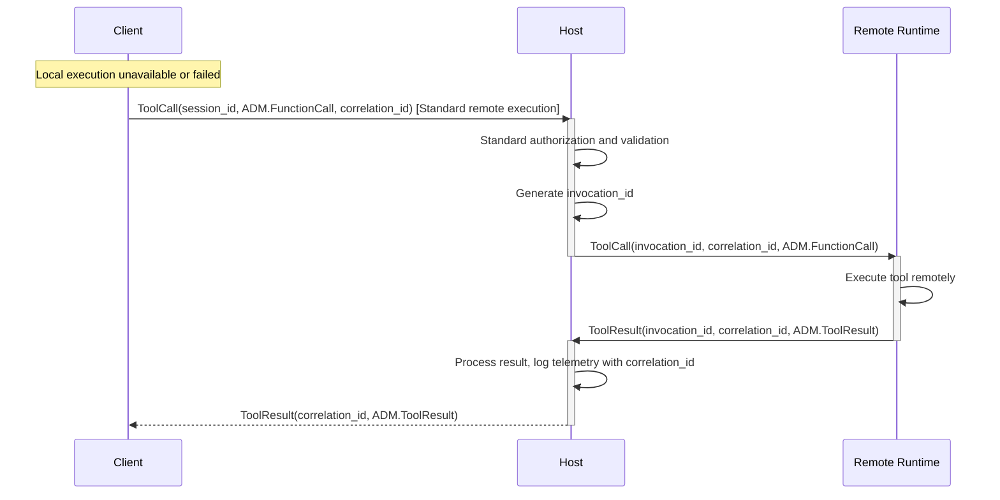
```mermaid
sequenceDiagram
    participant C as Client
    participant H as Host
    participant RT as Remote Runtime

    Note over C: Local execution unavailable or failed
    
    C->>H: ToolCall(session_id, ADM.FunctionCall, correlation_id) [Standard remote execution]
    activate H
    H->>H: Standard authorization and validation
    H->>H: Generate invocation_id
    H->>RT: ToolCall(invocation_id, correlation_id, ADM.FunctionCall)
    deactivate H
    activate RT
    RT->>RT: Execute tool remotely
    RT->>H: ToolResult(invocation_id, correlation_id, ADM.ToolResult)
    deactivate RT
    activate H
    H->>H: Process result, log telemetry with correlation_id
    H-->>C: ToolResult(correlation_id, ADM.ToolResult)
    deactivate H
```

### 5.5. Streaming Tool Execution with Correlation Tracking

This flow demonstrates streaming tool execution (Level 2+ feature) with comprehensive correlation ID tracking for real-time monitoring and debugging of long-running operations.

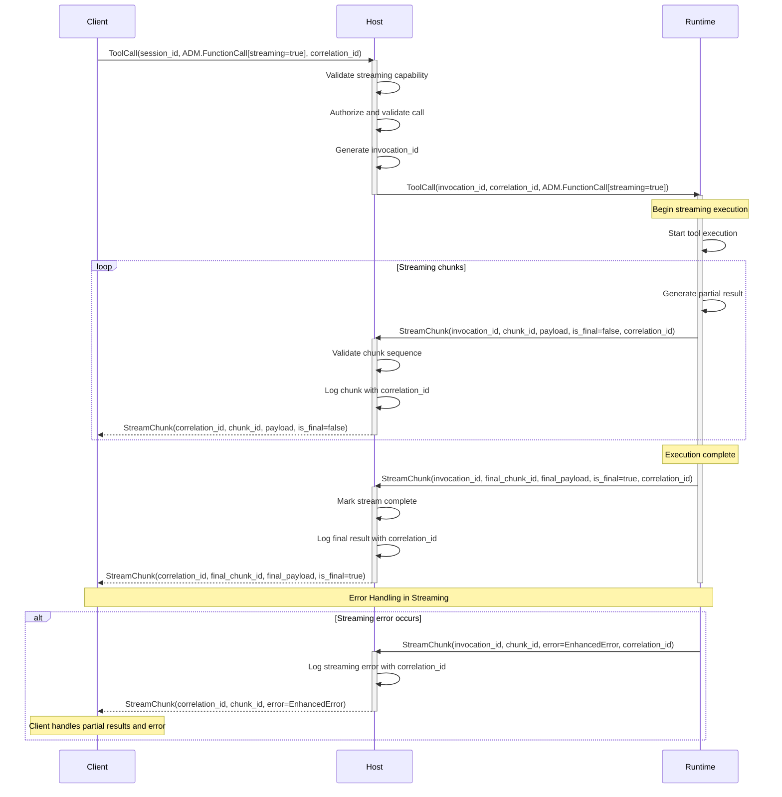
```mermaid
sequenceDiagram
    participant C as Client
    participant H as Host
    participant RT as Runtime

    C->>H: ToolCall(session_id, ADM.FunctionCall[streaming=true], correlation_id)
    activate H
    H->>H: Validate streaming capability
    H->>H: Authorize and validate call
    H->>H: Generate invocation_id
    H->>RT: ToolCall(invocation_id, correlation_id, ADM.FunctionCall[streaming=true])
    deactivate H
    activate RT
    
    Note over RT: Begin streaming execution
    RT->>RT: Start tool execution
    
    loop Streaming chunks
        RT->>RT: Generate partial result
        RT->>H: StreamChunk(invocation_id, chunk_id, payload, is_final=false, correlation_id)
        activate H
        H->>H: Validate chunk sequence
        H->>H: Log chunk with correlation_id
        H-->>C: StreamChunk(correlation_id, chunk_id, payload, is_final=false)
        deactivate H
    end
    
    Note over RT: Execution complete
    RT->>H: StreamChunk(invocation_id, final_chunk_id, final_payload, is_final=true, correlation_id)
    activate H
    H->>H: Mark stream complete
    H->>H: Log final result with correlation_id
    H-->>C: StreamChunk(correlation_id, final_chunk_id, final_payload, is_final=true)
    deactivate H
    deactivate RT

    Note over C,RT: Error Handling in Streaming
    alt Streaming error occurs
        RT->>H: StreamChunk(invocation_id, chunk_id, error=EnhancedError, correlation_id)
        activate H
        H->>H: Log streaming error with correlation_id
        H-->>C: StreamChunk(correlation_id, chunk_id, error=EnhancedError)
        deactivate H
        Note over C: Client handles partial results and error
    end
```

**Streaming Correlation Benefits:**

- **Real-time Monitoring:** Each chunk includes correlation ID for live progress tracking
- **Error Isolation:** Failed chunks can be correlated to specific execution phases
- **Performance Analysis:** Chunk timing analysis enables streaming optimization
- **Partial Recovery:** Clients can correlate successful chunks with failed operations

### 5.6. Error Correlation and Circuit Breaker Patterns

This flow demonstrates how correlation IDs enable sophisticated error handling and circuit breaker patterns across the distributed GRID system.

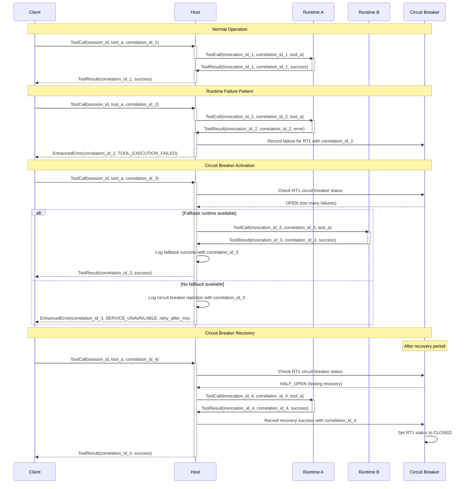
```mermaid
sequenceDiagram
    participant C as Client
    participant H as Host
    participant RT1 as Runtime A
    participant RT2 as Runtime B
    participant CB as Circuit Breaker

    Note over C,CB: Normal Operation
    C->>H: ToolCall(session_id, tool_a, correlation_id_1)
    activate H
    H->>RT1: ToolCall(invocation_id_1, correlation_id_1, tool_a)
    deactivate H
    activate RT1
    RT1->>H: ToolResult(invocation_id_1, correlation_id_1, success)
    deactivate RT1
    activate H
    H-->>C: ToolResult(correlation_id_1, success)
    deactivate H

    Note over C,CB: Runtime Failure Pattern
    C->>H: ToolCall(session_id, tool_a, correlation_id_2)
    activate H
    H->>RT1: ToolCall(invocation_id_2, correlation_id_2, tool_a)
    deactivate H
    activate RT1
    RT1->>H: ToolResult(invocation_id_2, correlation_id_2, error)
    deactivate RT1
    activate H
    H->>CB: Record failure for RT1 with correlation_id_2
    H-->>C: EnhancedError(correlation_id_2, TOOL_EXECUTION_FAILED)
    deactivate H

    Note over C,CB: Circuit Breaker Activation
    C->>H: ToolCall(session_id, tool_a, correlation_id_3)
    activate H
    H->>CB: Check RT1 circuit breaker status
    CB-->>H: OPEN (too many failures)
    
    alt Fallback runtime available
        H->>RT2: ToolCall(invocation_id_3, correlation_id_3, tool_a)
        activate RT2
        RT2->>H: ToolResult(invocation_id_3, correlation_id_3, success)
        deactivate RT2
        H->>H: Log fallback success with correlation_id_3
        H-->>C: ToolResult(correlation_id_3, success)
    else No fallback available
        H->>H: Log circuit breaker rejection with correlation_id_3
        H-->>C: EnhancedError(correlation_id_3, SERVICE_UNAVAILABLE, retry_after_ms)
    end
    deactivate H

    Note over C,CB: Circuit Breaker Recovery
    Note over CB: After recovery period
    C->>H: ToolCall(session_id, tool_a, correlation_id_4)
    activate H
    H->>CB: Check RT1 circuit breaker status
    CB-->>H: HALF_OPEN (testing recovery)
    H->>RT1: ToolCall(invocation_id_4, correlation_id_4, tool_a)
    activate RT1
    RT1->>H: ToolResult(invocation_id_4, correlation_id_4, success)
    deactivate RT1
    H->>CB: Record recovery success with correlation_id_4
    CB->>CB: Set RT1 status to CLOSED
    H-->>C: ToolResult(correlation_id_4, success)
    deactivate H
```

**Circuit Breaker Correlation Benefits:**

- **Failure Pattern Analysis:** Correlation IDs enable analysis of failure sequences
- **Recovery Tracking:** Successful recovery operations are correlated with previous failures
- **Fallback Monitoring:** Fallback executions maintain correlation with original requests
- **Performance Impact:** Circuit breaker decisions are logged with correlation context

**Error Correlation Strategies:**

1. **Temporal Correlation:** Group errors by time windows using correlation timestamps
2. **Causal Correlation:** Link related errors across multiple tool calls in a workflow
3. **Component Correlation:** Identify error patterns specific to Runtimes or tool types
4. **Session Correlation:** Track error patterns within specific user sessions
5. **Cross-Service Correlation:** Correlate GRID errors with external system failures

## 6. Error Handling and Resilience Patterns

GRID implements comprehensive error handling and resilience patterns to ensure robust operation in distributed environments. This section defines the error classification system, enhanced error structures, correlation tracking mechanisms, and circuit breaker patterns that enable reliable tool execution across the GRID ecosystem.

### 6.1. Error Classification System

GRID categorizes errors into five primary categories, each with specific handling patterns and remediation strategies. This classification enables systematic error handling, automated recovery procedures, and comprehensive monitoring across the distributed system.

#### 6.1.1. Authorization Errors

Authorization errors occur when security policies prevent tool execution or access to resources. These errors are generated by the Host's security layer and indicate policy violations or authentication failures.

**Error Types:**
- `PERMISSION_DENIED`: User lacks required roles or permissions for the requested tool
- `INVALID_CREDENTIALS`: Authentication credentials are invalid, expired, or malformed
- `SESSION_EXPIRED`: Security context or session has expired and requires renewal
- `INSUFFICIENT_SCOPE`: Security context lacks required scope for the requested operation
- `POLICY_VIOLATION`: Request violates organizational security policies
- `RATE_LIMIT_EXCEEDED`: User or session has exceeded allowed request rate limits

**Handling Patterns:**
```yaml
Authorization Error Handling:
  Immediate Actions:
    - Log security event with full context
    - Return detailed error with remediation guidance
    - Increment security metrics for monitoring
    
  Client Guidance:
    - Provide specific permission requirements
    - Include links to access request procedures
    - Suggest alternative tools with lower privilege requirements
    
  Retry Behavior:
    - PERMISSION_DENIED: No automatic retry (requires policy change)
    - INVALID_CREDENTIALS: Retry after credential refresh
    - SESSION_EXPIRED: Retry after session renewal
    - RATE_LIMIT_EXCEEDED: Retry after specified delay
```

**Example Enhanced Error Response:**
```json
{
  "type": "PERMISSION_DENIED",
  "message": "User lacks required role 'data_analyst' for tool 'advanced_analytics'",
  "details": {
    "required_roles": ["data_analyst", "power_user"],
    "user_roles": ["basic_user"],
    "tool_name": "advanced_analytics",
    "security_policy": "enterprise_rbac_v2"
  },
  "correlation_id": "auth-error-7f3a9b2c",
  "remediation_steps": [
    "Request 'data_analyst' role from your administrator",
    "Use alternative tool 'basic_analytics' which requires only 'basic_user' role",
    "Contact security team for policy exception if business critical"
  ],
  "documentation_url": "https://docs.grid.example.com/security/rbac-roles",
  "retry_allowed": false,
  "component": "host"
}
```

#### 6.1.2. Validation Errors

Validation errors occur when requests fail schema validation, contain malformed data, or reference non-existent resources. These errors are detected during the Host's validation phase before tool execution.

**Error Types:**
- `SCHEMA_VIOLATION`: Request payload doesn't conform to expected ADM schema
- `INVALID_TOOL_ARGS`: Tool arguments are malformed or missing required fields
- `UNSUPPORTED_TOOL`: Requested tool is not in the manifest or not fulfilled by any Runtime
- `INVALID_SESSION`: Session ID is malformed, expired, or doesn't exist
- `MALFORMED_REQUEST`: Request structure is invalid or corrupted
- `VERSION_MISMATCH`: Protocol version incompatibility between client and Host

**Handling Patterns:**
```yaml
Validation Error Handling:
  Immediate Actions:
    - Validate request against ADM schemas
    - Generate detailed validation error report
    - Log validation failure with request context
    
  Client Guidance:
    - Provide specific schema validation errors
    - Include corrected example requests
    - Reference ADM documentation for proper formats
    
  Retry Behavior:
    - SCHEMA_VIOLATION: No retry (requires client fix)
    - INVALID_TOOL_ARGS: No retry (requires argument correction)
    - UNSUPPORTED_TOOL: No retry (requires tool registration)
    - VERSION_MISMATCH: Retry with version negotiation
```

**Example Enhanced Error Response:**
```json
{
  "type": "SCHEMA_VIOLATION",
  "message": "Tool arguments failed ADM schema validation",
  "details": {
    "tool_name": "calculate_statistics",
    "validation_errors": [
      {
        "field": "dataset.columns",
        "error": "Required field missing",
        "expected_type": "array<string>"
      },
      {
        "field": "options.method",
        "error": "Invalid enum value 'invalid_method'",
        "allowed_values": ["mean", "median", "mode", "std_dev"]
      }
    ],
    "schema_version": "ADM-1.0.0"
  },
  "correlation_id": "validation-error-9c4d8e1f",
  "remediation_steps": [
    "Add required 'columns' array to dataset object",
    "Change 'options.method' to one of: mean, median, mode, std_dev",
    "Validate request against ADM schema before sending"
  ],
  "documentation_url": "https://docs.grid.example.com/adm/schemas/calculate-statistics",
  "retry_allowed": false,
  "component": "host"
}
```

#### 6.1.3. Runtime Errors

Runtime errors occur during tool execution within Runtimes. These errors represent business logic failures, resource constraints, or execution environment issues.

**Error Types:**
- `TOOL_EXECUTION_FAILED`: Business logic threw an exception during execution
- `TIMEOUT`: Tool execution exceeded configured time limits
- `RESOURCE_EXHAUSTED`: Runtime ran out of memory, CPU, or other resources
- `DEPENDENCY_UNAVAILABLE`: External dependency (database, API) is unavailable
- `DATA_PROCESSING_ERROR`: Error processing input data or generating output
- `RUNTIME_CRASH`: Runtime process crashed during tool execution

**Handling Patterns:**
```yaml
Runtime Error Handling:
  Immediate Actions:
    - Capture full execution context and stack traces
    - Log error with runtime performance metrics
    - Update Runtime health status
    
  Recovery Strategies:
    - Automatic retry for transient failures
    - Circuit breaker activation for repeated failures
    - Fallback to alternative Runtime if available
    
  Client Guidance:
    - Provide execution context and error details
    - Suggest input data modifications if applicable
    - Include performance optimization recommendations
```

**Example Enhanced Error Response:**
```json
{
  "type": "TOOL_EXECUTION_FAILED",
  "message": "Data processing failed due to invalid input format",
  "details": {
    "tool_name": "process_csv_data",
    "runtime_id": "python-runtime-003",
    "execution_time_ms": 1250,
    "error_category": "data_format",
    "stack_trace": "pandas.errors.ParserError: Error tokenizing data...",
    "input_validation": {
      "expected_format": "CSV with headers",
      "detected_format": "JSON",
      "file_size_bytes": 1048576
    }
  },
  "correlation_id": "runtime-error-a5b7c9d2",
  "remediation_steps": [
    "Convert input data to CSV format with proper headers",
    "Use 'process_json_data' tool for JSON input instead",
    "Validate data format before processing",
    "Consider splitting large files into smaller chunks"
  ],
  "documentation_url": "https://docs.grid.example.com/tools/data-processing",
  "retry_allowed": true,
  "retry_after_ms": 5000,
  "component": "runtime"
}
```

#### 6.1.4. Transport Errors

Transport errors occur at the network and protocol level, affecting communication between GRID components. These errors indicate infrastructure issues or network connectivity problems.

**Error Types:**
- `CONNECTION_FAILED`: Network connection to Host or Runtime failed
- `PROTOCOL_VIOLATION`: Invalid message format or protocol sequence
- `MESSAGE_TOO_LARGE`: Request or response exceeds size limits
- `NETWORK_TIMEOUT`: Network operation timed out
- `TLS_HANDSHAKE_FAILED`: Secure connection establishment failed
- `SERIALIZATION_ERROR`: Message serialization/deserialization failed

**Handling Patterns:**
```yaml
Transport Error Handling:
  Immediate Actions:
    - Log network error with connection context
    - Update connection health metrics
    - Trigger connection recovery procedures
    
  Recovery Strategies:
    - Automatic connection retry with exponential backoff
    - Connection pool refresh and health checks
    - Fallback to alternative Host endpoints if available
    
  Client Guidance:
    - Provide network diagnostic information
    - Include connection troubleshooting steps
    - Reference network configuration documentation
```

#### 6.1.5. Configuration Errors

Configuration errors occur when system configuration is invalid, missing, or incompatible. These errors prevent proper system initialization or operation.

**Error Types:**
- `INVALID_CONFIG`: Configuration file is malformed or contains invalid values
- `MISSING_MANIFEST`: Required tool manifest file is not found or inaccessible
- `INCOMPATIBLE_MODE`: Operational mode is not supported or misconfigured
- `CERTIFICATE_ERROR`: TLS certificates are invalid, expired, or misconfigured
- `ENVIRONMENT_ERROR`: Required environment variables or resources are missing
- `FEATURE_UNAVAILABLE`: Requested feature is not available in current configuration

**Handling Patterns:**
```yaml
Configuration Error Handling:
  Immediate Actions:
    - Validate configuration against schema
    - Log configuration error with diagnostic context
    - Prevent system startup if critical configuration is invalid
    
  Recovery Strategies:
    - Load default configuration for non-critical settings
    - Graceful degradation by disabling optional features
    - Configuration hot-reload for non-critical updates
    
  Administrative Guidance:
    - Provide specific configuration validation errors
    - Include corrected configuration examples
    - Reference configuration documentation and best practices
```

### 6.2. Enhanced Error Message Structure

The `EnhancedError` message structure provides comprehensive error information that enables effective debugging, monitoring, and automated recovery. This structure extends the basic `Error` message with additional context, remediation guidance, and correlation tracking.

#### 6.2.1. Core Error Structure

```protobuf
// Enhanced error structure with comprehensive debugging and remediation context
message EnhancedError {
  // Core fields (backward compatible with basic Error message)
  string message = 1;              // Human-readable error description
  string type = 2;                 // Standardized error code (e.g., "PERMISSION_DENIED")
  
  // Enhanced debugging context
  map<string, string> details = 3; // Structured error details and metadata
  string correlation_id = 4;       // ID for tracing the entire workflow
  uint64 timestamp = 5;            // Unix timestamp when error occurred
  
  // Retry and recovery guidance
  bool retry_allowed = 6;          // Whether operation can be safely retried
  uint64 retry_after_ms = 7;       // Suggested delay before retry attempt
  uint32 max_retries = 8;          // Maximum recommended retry attempts
  
  // Remediation and support information
  repeated string remediation_steps = 9; // Ordered steps to resolve the error
  string documentation_url = 10;   // Link to relevant documentation
  string support_reference = 11;   // Reference ID for support ticket creation
  
  // System context information
  string component = 12;           // Component that generated error ("host", "runtime", "client")
  string session_id = 13;          // Session context where error occurred
  string runtime_id = 14;          // Runtime context where error occurred
  string tool_name = 15;           // Tool being executed when error occurred
  
  // Error classification and severity
  ErrorSeverity severity = 16;     // Error severity level
  ErrorCategory category = 17;     // Primary error category
  repeated string tags = 18;       // Additional classification tags
  
  // Performance and diagnostic context
  uint64 execution_time_ms = 19;   // Time spent before error occurred
  map<string, string> performance_metrics = 20; // Relevant performance data
  string trace_id = 21;            // Distributed tracing identifier
  
  // Nested error information
  repeated EnhancedError caused_by = 22; // Chain of underlying errors
}

// Error severity levels for prioritization and alerting
enum ErrorSeverity {
  INFO = 0;        // Informational, no action required
  WARNING = 1;     // Warning condition, monitoring recommended
  ERROR = 2;       // Error condition, user action may be required
  CRITICAL = 3;    // Critical error, immediate attention required
  FATAL = 4;       // Fatal error, system or component failure
}

// Primary error categories for systematic handling
enum ErrorCategory {
  AUTHORIZATION = 0;    // Security and permission errors
  VALIDATION = 1;       // Schema and input validation errors
  RUNTIME = 2;          // Tool execution and business logic errors
  TRANSPORT = 3;        // Network and communication errors
  CONFIGURATION = 4;    // System configuration and setup errors
}
```

#### 6.2.2. Error Context Enrichment

The enhanced error structure supports rich context information that enables effective debugging and automated recovery:

**Structured Details:**
```json
{
  "details": {
    "error_code": "GRID_TOOL_TIMEOUT_001",
    "tool_version": "1.2.3",
    "runtime_version": "1.1.0",
    "host_version": "1.1.0",
    "execution_environment": "production",
    "resource_usage": {
      "cpu_percent": 95.2,
      "memory_mb": 2048,
      "execution_time_ms": 30000
    },
    "input_characteristics": {
      "payload_size_bytes": 1048576,
      "complexity_score": 8.5,
      "estimated_processing_time_ms": 15000
    }
  }
}
```

**Performance Metrics Integration:**
```json
{
  "performance_metrics": {
    "queue_wait_time_ms": "150",
    "network_latency_ms": "25",
    "serialization_time_ms": "45",
    "validation_time_ms": "12",
    "execution_start_timestamp": "1691568000000",
    "last_heartbeat_timestamp": "1691568025000"
  }
}
```

**Remediation Guidance:**
```json
{
  "remediation_steps": [
    "Reduce input data size to under 500KB for optimal performance",
    "Consider using streaming mode for large dataset processing",
    "Split complex operations into smaller, parallelizable tasks",
    "Contact support if issue persists with reference ID: GRID-2025-08-09-001"
  ],
  "documentation_url": "https://docs.grid.example.com/troubleshooting/timeout-errors",
  "support_reference": "GRID-2025-08-09-001"
}
```

#### 6.2.3. Advanced Remediation Guidance Patterns

GRID provides sophisticated remediation guidance that adapts to error context, user expertise level, and system state. This guidance system enables both automated recovery and human-assisted troubleshooting with comprehensive correlation ID tracking for end-to-end traceability.

**Context-Aware Remediation with Correlation Tracking:**
```yaml
Remediation Strategy Selection:
  Error Context Analysis:
    - Error frequency and patterns tracked by correlation ID
    - User role and expertise level from security context
    - System resource availability and performance metrics
    - Historical success rates of remediation steps by error type
    - Correlation with authorization and audit logging events
    
  Adaptive Guidance:
    - Beginner: Step-by-step instructions with explanations and correlation references
    - Intermediate: Concise steps with relevant context and trace links
    - Expert: Root cause analysis with system internals and correlation chains
    - Automated: Machine-readable remediation scripts with correlation tracking
    
  Success Tracking with Correlation:
    - Track remediation step effectiveness by correlation ID
    - Learn from successful resolution patterns across correlated events
    - Adapt guidance based on success rates and correlation analysis
    - Provide feedback loops for continuous improvement with trace context
    - Correlate remediation outcomes with authorization events for audit compliance
```

**Structured Remediation Framework:**
```protobuf
// Enhanced remediation guidance structure
message RemediationGuidance {
  // Immediate actions (can be automated)
  repeated RemediationStep immediate_actions = 1;
  
  // User actions (require human intervention)
  repeated RemediationStep user_actions = 2;
  
  // System actions (require administrative access)
  repeated RemediationStep system_actions = 3;
  
  // Escalation path if remediation fails
  EscalationPath escalation = 4;
  
  // Success criteria for validating remediation
  repeated SuccessCriterion success_criteria = 5;
}

message RemediationStep {
  string step_id = 1;              // Unique identifier for tracking
  string description = 2;          // Human-readable description
  StepType type = 3;               // Type of remediation step
  uint32 estimated_time_minutes = 4; // Estimated completion time
  repeated string prerequisites = 5; // Required conditions or permissions
  string automation_script = 6;    // Optional automation script
  repeated string validation_commands = 7; // Commands to verify step completion
  
  enum StepType {
    IMMEDIATE = 0;    // Can be executed immediately
    USER_ACTION = 1;  // Requires user intervention
    ADMIN_ACTION = 2; // Requires administrative privileges
    ESCALATION = 3;   // Requires escalation to support
  }
}

message EscalationPath {
  repeated EscalationLevel levels = 1;
  
  message EscalationLevel {
    string level_name = 1;         // e.g., "L1 Support", "Engineering Team"
    string contact_method = 2;     // e.g., "support_ticket", "pager_duty"
    uint32 response_time_minutes = 3; // Expected response time
    repeated string required_information = 4; // Information to include
  }
}
```

**Remediation Pattern Examples:**

*Authorization Error Remediation with Audit Correlation:*
```json
{
  "immediate_actions": [
    {
      "step_id": "auth_001",
      "description": "Verify current user permissions and audit trail",
      "type": "IMMEDIATE",
      "automation_script": "grid-cli auth check-permissions --user=${user_id} --tool=${tool_name} --correlation-id=${correlation_id}",
      "estimated_time_minutes": 1,
      "audit_correlation": {
        "correlate_with": ["authorization_requests", "permission_grants", "policy_evaluations"],
        "audit_trail_query": "correlation_id:${correlation_id} AND event_type:authorization"
      }
    }
  ],
  "user_actions": [
    {
      "step_id": "auth_002", 
      "description": "Request additional permissions from administrator with audit context",
      "type": "USER_ACTION",
      "prerequisites": ["manager_approval"],
      "estimated_time_minutes": 30,
      "audit_correlation": {
        "log_request": true,
        "include_correlation_chain": true,
        "audit_fields": ["requested_permissions", "business_justification", "correlation_id"]
      }
    }
  ],
  "system_actions": [
    {
      "step_id": "auth_003",
      "description": "Grant temporary elevated permissions with full audit logging",
      "type": "ADMIN_ACTION",
      "prerequisites": ["admin_access", "business_justification"],
      "estimated_time_minutes": 5,
      "audit_correlation": {
        "mandatory_audit_log": true,
        "correlation_with_authorization": true,
        "audit_retention_extended": true,
        "compliance_tags": ["temporary_elevation", "emergency_access"]
      }
    }
  ],
  "escalation": {
    "levels": [
      {
        "level_name": "Security Team",
        "contact_method": "security_ticket",
        "response_time_minutes": 240,
        "required_information": [
          "user_id", 
          "tool_name", 
          "business_justification", 
          "correlation_id",
          "authorization_audit_trail",
          "related_correlation_ids"
        ],
        "audit_correlation": {
          "escalation_logged": true,
          "correlation_preserved": true,
          "audit_chain_included": true
        }
      }
    ]
  },
  "correlation_tracking": {
    "authorization_correlation": {
      "correlate_with_auth_events": true,
      "track_permission_changes": true,
      "audit_trail_integration": "mandatory"
    },
    "end_to_end_tracing": {
      "trace_authorization_flow": true,
      "correlate_with_tool_execution": true,
      "audit_log_correlation": "full_chain"
    }
  }
}
```

*Performance Error Remediation:*
```json
{
  "immediate_actions": [
    {
      "step_id": "perf_001",
      "description": "Check system resource utilization",
      "type": "IMMEDIATE",
      "automation_script": "grid-cli system metrics --component=runtime --runtime-id=${runtime_id}",
      "validation_commands": ["grid-cli system health-check"]
    },
    {
      "step_id": "perf_002", 
      "description": "Reduce input payload size",
      "type": "IMMEDIATE",
      "automation_script": "grid-cli tools optimize-payload --tool=${tool_name} --max-size=500KB"
    }
  ],
  "user_actions": [
    {
      "step_id": "perf_003",
      "description": "Split large operation into smaller chunks",
      "type": "USER_ACTION",
      "estimated_time_minutes": 15
    }
  ],
  "success_criteria": [
    {
      "criterion": "execution_time_under_threshold",
      "threshold_ms": 30000,
      "validation_command": "grid-cli tools test-performance --tool=${tool_name}"
    }
  ]
}
```

**Remediation Success Tracking:**
```python
class RemediationTracker:
    def track_remediation_attempt(self, 
                                 correlation_id: str,
                                 error_type: str, 
                                 remediation_steps: List[RemediationStep],
                                 outcome: RemediationOutcome):
        """Track remediation attempt for learning and optimization"""
        
        remediation_record = RemediationRecord(
            correlation_id=correlation_id,
            error_type=error_type,
            steps_attempted=remediation_steps,
            outcome=outcome,
            timestamp=datetime.utcnow(),
            execution_time_minutes=outcome.total_time_minutes
        )
        
        # Store for analysis
        self.remediation_store.save(remediation_record)
        
        # Update success rates
        self.update_step_success_rates(remediation_steps, outcome.success)
        
        # Generate insights for future remediation
        if outcome.success:
            self.learn_successful_pattern(error_type, remediation_steps)
        else:
            self.analyze_failure_pattern(error_type, remediation_steps, outcome.failure_reason)
    
    def generate_adaptive_remediation(self, 
                                    error: EnhancedError,
                                    user_context: UserContext) -> RemediationGuidance:
        """Generate context-aware remediation guidance"""
        
        # Analyze historical success patterns
        successful_patterns = self.get_successful_patterns(error.type, error.category)
        
        # Adapt to user expertise level
        guidance = self.adapt_to_user_level(successful_patterns, user_context.expertise_level)
        
        # Consider system state
        guidance = self.adapt_to_system_state(guidance, self.get_current_system_state())
        
        return guidance
```

### 6.3. Correlation ID Tracking and End-to-End Tracing

GRID implements comprehensive correlation ID tracking to enable end-to-end tracing of requests across the distributed system. This capability is essential for debugging complex workflows, performance analysis, and audit compliance.

#### 6.3.1. Correlation ID Generation and Propagation

**ID Generation Strategy:**
```yaml
Correlation ID Format:
  Structure: "{component}-{timestamp}-{random}"
  Example: "client-1691568000-a7b9c3d2"
  
  Components:
    - component: Origin component (client, host, runtime)
    - timestamp: Unix timestamp in seconds
    - random: 8-character hexadecimal random suffix
    
  Properties:
    - Globally unique across all GRID deployments
    - Sortable by creation time
    - Traceable to originating component
    - URL-safe and log-friendly format

Enhanced Correlation Patterns:
  Hierarchical Correlation:
    - Parent-child relationships for nested tool calls
    - Workflow correlation for multi-step processes
    - Session correlation for user interaction tracking
    
  Cross-Component Correlation:
    - Request-response correlation across network boundaries
    - Error correlation across component failures
    - Performance correlation for end-to-end latency analysis
    
  Temporal Correlation:
    - Time-based correlation for failure pattern analysis
    - Batch correlation for bulk operations
    - Periodic correlation for scheduled tasks
```

**Propagation Flow:**
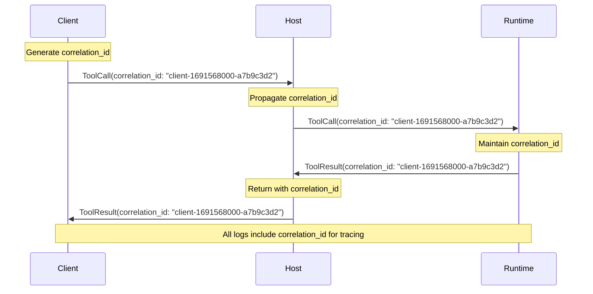
```mermaid
sequenceDiagram
    participant C as Client
    participant H as Host
    participant RT as Runtime

    Note over C: Generate correlation_id
    C->>H: ToolCall(correlation_id: "client-1691568000-a7b9c3d2")
    
    Note over H: Propagate correlation_id
    H->>RT: ToolCall(correlation_id: "client-1691568000-a7b9c3d2")
    
    Note over RT: Maintain correlation_id
    RT->>H: ToolResult(correlation_id: "client-1691568000-a7b9c3d2")
    
    Note over H: Return with correlation_id
    H->>C: ToolResult(correlation_id: "client-1691568000-a7b9c3d2")
    
    Note over C,RT: All logs include correlation_id for tracing
```

#### 6.3.2. Distributed Tracing Integration

GRID supports integration with distributed tracing systems like Jaeger, Zipkin, and OpenTelemetry:

**Trace Context Propagation:**
```protobuf
// Extended message headers for distributed tracing
message TraceContext {
  string trace_id = 1;             // Distributed trace identifier
  string span_id = 2;              // Current span identifier
  string parent_span_id = 3;       // Parent span identifier
  map<string, string> baggage = 4; // Trace baggage for context propagation
  uint32 trace_flags = 5;          // Trace sampling and debug flags
}

// Enhanced message with trace context
message TracedToolCall {
  // Standard ToolCall fields
  string invocation_id = 1;
  string correlation_id = 2;
  ADM.FunctionCall call = 3;
  
  // Distributed tracing context
  TraceContext trace_context = 4;
}
```

**Tracing Integration Example:**
```python
# Python client with distributed tracing
from altar.grid.client import GridClient
from opentelemetry import trace

tracer = trace.get_tracer(__name__)

with tracer.start_as_current_span("tool_execution") as span:
    # Correlation ID automatically includes trace context
    result = client.call_tool(
        "analyze_data", 
        {"dataset": large_dataset},
        correlation_id=f"client-{int(time.time())}-{uuid.uuid4().hex[:8]}"
    )
    
    # Span automatically tagged with GRID context
    span.set_attribute("grid.tool_name", "analyze_data")
    span.set_attribute("grid.session_id", client.session_id)
    span.set_attribute("grid.correlation_id", result.correlation_id)
```

#### 6.3.3. Error Correlation and Analysis

**Error Correlation Patterns:**
```yaml
Correlation Strategies:
  Temporal Correlation:
    - Group errors occurring within time windows
    - Identify error cascades and failure patterns
    - Correlate with system events and deployments
    
  Causal Correlation:
    - Link related errors across tool call chains
    - Trace error propagation through workflows
    - Identify root cause vs. symptom errors
    
  Component Correlation:
    - Identify error patterns specific to Runtimes
    - Correlate errors with resource utilization
    - Track error rates across different tool types
    
  Session Correlation:
    - Track error patterns within user sessions
    - Identify problematic user behaviors or data
    - Correlate errors with session characteristics

Advanced Correlation Techniques:
  Multi-Dimensional Correlation:
    - Cross-reference errors by user, tool, runtime, and time
    - Identify complex interaction patterns
    - Detect systemic issues across multiple dimensions
    
  Predictive Correlation:
    - Use historical patterns to predict likely failures
    - Proactive remediation based on correlation analysis
    - Early warning systems for cascading failures
    
  Semantic Correlation:
    - Group errors by semantic similarity in error messages
    - Identify related issues across different error types
    - Enable knowledge transfer between similar problems
```

**Enhanced Correlation ID Lifecycle Management:**
```python
class CorrelationManager:
    def __init__(self):
        self.correlation_store = CorrelationStore()
        self.pattern_analyzer = PatternAnalyzer()
        
    def create_correlation_context(self, 
                                 parent_correlation_id: Optional[str] = None,
                                 workflow_id: Optional[str] = None,
                                 session_id: Optional[str] = None) -> CorrelationContext:
        """Create comprehensive correlation context for request tracking"""
        
        correlation_id = self.generate_correlation_id()
        
        context = CorrelationContext(
            correlation_id=correlation_id,
            parent_correlation_id=parent_correlation_id,
            workflow_id=workflow_id,
            session_id=session_id,
            created_at=datetime.utcnow(),
            component_path=[],
            metadata={}
        )
        
        # Establish parent-child relationship
        if parent_correlation_id:
            self.link_correlation_hierarchy(parent_correlation_id, correlation_id)
        
        return context
    
    def track_component_transition(self, 
                                 correlation_id: str,
                                 from_component: str,
                                 to_component: str,
                                 transition_metadata: Dict[str, Any]):
        """Track request flow between components"""
        
        transition = ComponentTransition(
            correlation_id=correlation_id,
            from_component=from_component,
            to_component=to_component,
            timestamp=datetime.utcnow(),
            metadata=transition_metadata
        )
        
        self.correlation_store.record_transition(transition)
        
        # Update component path
        context = self.get_correlation_context(correlation_id)
        context.component_path.append(to_component)
        self.correlation_store.update_context(context)
    
    def correlate_error_with_context(self, 
                                   error: EnhancedError,
                                   correlation_id: str) -> CorrelatedError:
        """Enrich error with full correlation context"""
        
        context = self.get_correlation_context(correlation_id)
        related_events = self.get_related_events(correlation_id)
        
        correlated_error = CorrelatedError(
            base_error=error,
            correlation_context=context,
            related_events=related_events,
            error_chain=self.build_error_chain(correlation_id),
            impact_analysis=self.analyze_error_impact(correlation_id, error)
        )
        
        return correlated_error
    
    def analyze_correlation_patterns(self, 
                                   time_window: timedelta,
                                   error_types: List[str] = None) -> CorrelationAnalysis:
        """Analyze error correlation patterns for insights"""
        
        events = self.correlation_store.get_events_in_window(
            datetime.utcnow() - time_window,
            datetime.utcnow(),
            error_types=error_types
        )
        
        analysis = CorrelationAnalysis(
            temporal_patterns=self.pattern_analyzer.analyze_temporal_patterns(events),
            causal_chains=self.pattern_analyzer.identify_causal_chains(events),
            component_patterns=self.pattern_analyzer.analyze_component_patterns(events),
            user_patterns=self.pattern_analyzer.analyze_user_patterns(events),
            recommendations=self.generate_pattern_recommendations(events)
        )
        
        return analysis
```

**Correlation-Based Automated Recovery:**
```yaml
Automated Recovery Patterns:
  Pattern Recognition:
    - Identify recurring error patterns by correlation analysis
    - Match current errors to known resolution patterns
    - Trigger automated remediation for recognized patterns
    
  Cascade Prevention:
    - Detect error cascade patterns in real-time
    - Implement circuit breakers based on correlation analysis
    - Isolate failing components before cascade propagation
    
  Proactive Remediation:
    - Use correlation patterns to predict likely failures
    - Pre-emptively scale resources or adjust configurations
    - Notify operators of potential issues before they occur
    
  Learning and Adaptation:
    - Learn from successful manual remediations
    - Adapt automated responses based on correlation outcomes
    - Continuously improve pattern recognition accuracy
```

**Automated Error Analysis:**
```python
# Error correlation analysis example
class ErrorCorrelationAnalyzer:
    def analyze_error_patterns(self, correlation_id: str) -> ErrorAnalysis:
        """Analyze error patterns for a given correlation ID"""
        
        # Gather all events for correlation ID
        events = self.trace_store.get_events(correlation_id)
        
        # Identify error cascade patterns
        error_chain = self.build_error_chain(events)
        
        # Analyze temporal patterns
        temporal_analysis = self.analyze_temporal_patterns(events)
        
        # Identify root cause
        root_cause = self.identify_root_cause(error_chain)
        
        return ErrorAnalysis(
            correlation_id=correlation_id,
            error_chain=error_chain,
            root_cause=root_cause,
            temporal_patterns=temporal_analysis,
            remediation_suggestions=self.generate_remediation(root_cause)
        )
```

### 6.4. Circuit Breaker Patterns and Implementation

GRID implements sophisticated circuit breaker patterns to protect system components from cascading failures and enable graceful degradation under adverse conditions. The circuit breaker implementation provides two primary protection mechanisms: client-side circuit breakers that protect clients from failing Hosts, and Host-side circuit breakers that protect the system from failing Runtimes.

**Circuit Breaker Design Principles:**

- **Fail-Fast Protection:** Prevent cascading failures by quickly detecting and isolating failing components
- **Graceful Degradation:** Maintain partial system functionality when components fail
- **Automatic Recovery:** Test component health and restore service automatically when possible
- **Configurable Thresholds:** Adapt failure detection to different operational requirements and system characteristics
- **Multi-Level Protection:** Implement circuit breakers at multiple system levels for comprehensive protection

#### 6.4.1. Client-Side Circuit Breaker for Host Protection

The client-side circuit breaker protects clients from failing Hosts by monitoring Host health and automatically failing fast when the Host becomes unavailable or unresponsive. This prevents clients from wasting resources on requests that are likely to fail and enables automatic failover to alternative Hosts when available.

**Protection Mechanisms:**

- **Host Availability Monitoring:** Continuously monitor Host responsiveness and connection health
- **Request Failure Tracking:** Track failures across different error categories to detect Host degradation
- **Automatic Failover:** Redirect requests to healthy alternative Hosts when primary Host fails
- **Load Balancing Integration:** Coordinate with load balancers to remove unhealthy Hosts from rotation
- **Graceful Degradation:** Provide cached responses or reduced functionality when all Hosts are unavailable

**Circuit Breaker States:**
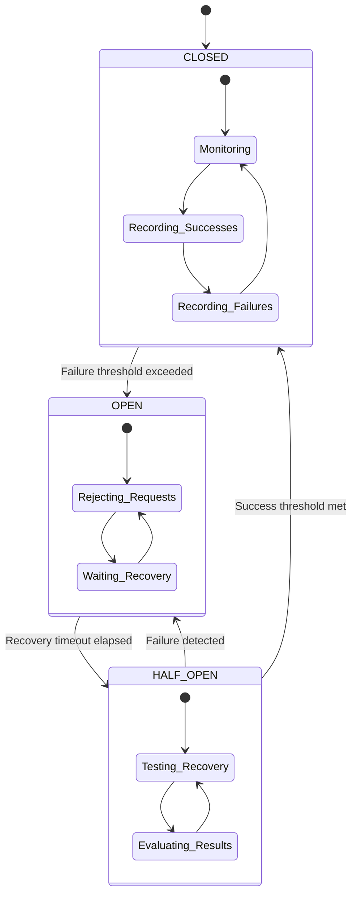
```mermaid
stateDiagram-v2
    [*] --> CLOSED
    CLOSED --> OPEN : Failure threshold exceeded
    OPEN --> HALF_OPEN : Recovery timeout elapsed
    HALF_OPEN --> CLOSED : Success threshold met
    HALF_OPEN --> OPEN : Failure detected
    
    state CLOSED {
        [*] --> Monitoring
        Monitoring --> Recording_Successes
        Recording_Successes --> Recording_Failures
        Recording_Failures --> Monitoring
    }
    
    state OPEN {
        [*] --> Rejecting_Requests
        Rejecting_Requests --> Waiting_Recovery
        Waiting_Recovery --> Rejecting_Requests
    }
    
    state HALF_OPEN {
        [*] --> Testing_Recovery
        Testing_Recovery --> Evaluating_Results
        Evaluating_Results --> Testing_Recovery
    }
```

**Client Circuit Breaker Configuration:**
```yaml
client_circuit_breaker:
  failure_threshold: 5              # Failures before opening circuit
  failure_window_ms: 60000          # Time window for failure counting
  recovery_timeout_ms: 30000        # Time to wait before testing recovery
  success_threshold: 3              # Successes needed to close circuit
  
  failure_types:                    # Which errors trigger circuit breaker
    - CONNECTION_FAILED
    - NETWORK_TIMEOUT
    - TLS_HANDSHAKE_FAILED
    - HOST_UNAVAILABLE
  
  excluded_errors:                  # Errors that don't trigger circuit breaker
    - PERMISSION_DENIED
    - SCHEMA_VIOLATION
    - INVALID_TOOL_ARGS
  
  fallback_strategy:
    - retry_alternative_host
    - degrade_to_cached_results
    - return_error_with_guidance
```

**Client Circuit Breaker Implementation:**
```python
class GridClientCircuitBreaker:
    def __init__(self, config: CircuitBreakerConfig):
        self.config = config
        self.state = CircuitBreakerState.CLOSED
        self.failure_count = 0
        self.last_failure_time = None
        self.success_count = 0
        
    def call_with_circuit_breaker(self, operation: Callable) -> Any:
        """Execute operation with circuit breaker protection"""
        
        if self.state == CircuitBreakerState.OPEN:
            if self._should_attempt_recovery():
                self.state = CircuitBreakerState.HALF_OPEN
                self.success_count = 0
            else:
                raise CircuitBreakerOpenError(
                    "Circuit breaker is OPEN, operation rejected",
                    retry_after_ms=self._time_until_recovery()
                )
        
        try:
            result = operation()
            self._record_success()
            return result
            
        except Exception as e:
            if self._is_circuit_breaker_error(e):
                self._record_failure()
            raise
    
    def _record_failure(self):
        """Record failure and update circuit breaker state"""
        self.failure_count += 1
        self.last_failure_time = time.time()
        
        if self.state == CircuitBreakerState.HALF_OPEN:
            # Failure during recovery test - reopen circuit
            self.state = CircuitBreakerState.OPEN
            self.failure_count = 0
            
        elif (self.state == CircuitBreakerState.CLOSED and 
              self.failure_count >= self.config.failure_threshold):
            # Threshold exceeded - open circuit
            self.state = CircuitBreakerState.OPEN
            logger.warning(f"Circuit breaker opened after {self.failure_count} failures")
    
    def _record_success(self):
        """Record success and update circuit breaker state"""
        if self.state == CircuitBreakerState.HALF_OPEN:
            self.success_count += 1
            if self.success_count >= self.config.success_threshold:
                # Recovery successful - close circuit
                self.state = CircuitBreakerState.CLOSED
                self.failure_count = 0
                logger.info("Circuit breaker closed after successful recovery")
        
        elif self.state == CircuitBreakerState.CLOSED:
            # Reset failure count on success
            self.failure_count = max(0, self.failure_count - 1)
```

#### 6.4.2. Host-Side Circuit Breaker for Runtime Protection

The Host-side circuit breaker protects the GRID system from failing Runtimes by monitoring Runtime health, isolating problematic Runtimes, and preventing cascading failures that could impact the entire system. This protection mechanism ensures system stability even when individual Runtimes experience failures or performance degradation.

**Protection Mechanisms:**

- **Runtime Health Monitoring:** Continuously monitor Runtime performance, error rates, and response times
- **Automatic Runtime Isolation:** Remove failing Runtimes from the active pool to prevent further failures
- **Load Redistribution:** Automatically redistribute workload to healthy Runtimes when failures occur
- **Cascading Failure Prevention:** Prevent Runtime failures from propagating to other system components
- **System-Level Protection:** Implement emergency mode when too many Runtimes fail simultaneously

**Runtime Health Monitoring:**
```yaml
host_circuit_breaker:
  per_runtime_monitoring:
    failure_threshold: 10           # Failures before isolating Runtime
    failure_window_ms: 300000       # 5-minute failure counting window
    recovery_timeout_ms: 600000     # 10-minute isolation period
    health_check_interval_ms: 30000 # Health check frequency
    
  system_protection:
    max_concurrent_failures: 3      # Max Runtimes that can fail simultaneously
    emergency_mode_threshold: 0.5   # Activate emergency mode if >50% Runtimes fail
    load_shedding_threshold: 0.8    # Start load shedding at 80% capacity
    
  failure_detection:
    consecutive_timeouts: 3         # Timeouts before marking Runtime unhealthy
    error_rate_threshold: 0.1       # 10% error rate triggers circuit breaker
    response_time_threshold_ms: 30000 # Response time threshold for health
```

**Host Circuit Breaker Flow:**
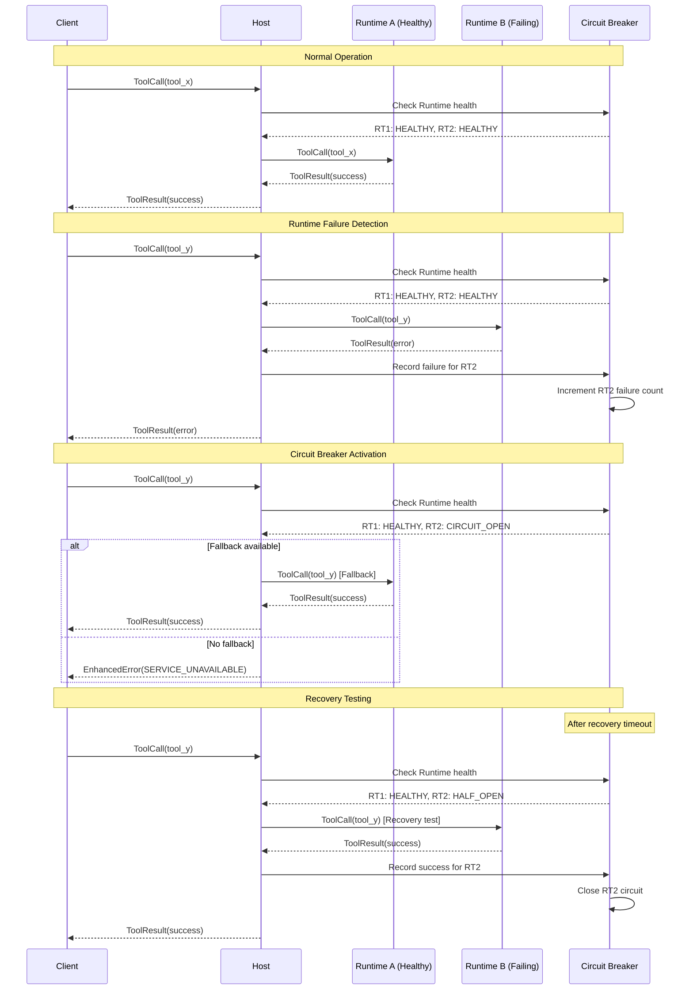
```mermaid
sequenceDiagram
    participant C as Client
    participant H as Host
    participant RT1 as Runtime A (Healthy)
    participant RT2 as Runtime B (Failing)
    participant CB as Circuit Breaker

    Note over C,CB: Normal Operation
    C->>H: ToolCall(tool_x)
    H->>CB: Check Runtime health
    CB-->>H: RT1: HEALTHY, RT2: HEALTHY
    H->>RT1: ToolCall(tool_x)
    RT1-->>H: ToolResult(success)
    H-->>C: ToolResult(success)

    Note over C,CB: Runtime Failure Detection
    C->>H: ToolCall(tool_y)
    H->>CB: Check Runtime health
    CB-->>H: RT1: HEALTHY, RT2: HEALTHY
    H->>RT2: ToolCall(tool_y)
    RT2-->>H: ToolResult(error)
    H->>CB: Record failure for RT2
    CB->>CB: Increment RT2 failure count
    H-->>C: ToolResult(error)

    Note over C,CB: Circuit Breaker Activation
    C->>H: ToolCall(tool_y)
    H->>CB: Check Runtime health
    CB-->>H: RT1: HEALTHY, RT2: CIRCUIT_OPEN
    
    alt Fallback available
        H->>RT1: ToolCall(tool_y) [Fallback]
        RT1-->>H: ToolResult(success)
        H-->>C: ToolResult(success)
    else No fallback
        H-->>C: EnhancedError(SERVICE_UNAVAILABLE)
    end

    Note over C,CB: Recovery Testing
    Note over CB: After recovery timeout
    C->>H: ToolCall(tool_y)
    H->>CB: Check Runtime health
    CB-->>H: RT1: HEALTHY, RT2: HALF_OPEN
    H->>RT2: ToolCall(tool_y) [Recovery test]
    RT2-->>H: ToolResult(success)
    H->>CB: Record success for RT2
    CB->>CB: Close RT2 circuit
    H-->>C: ToolResult(success)
```

#### 6.4.3. Advanced Circuit Breaker Features

**Configurable Failure Thresholds and Recovery Mechanisms:**

GRID circuit breakers support sophisticated configuration options that adapt to different operational requirements and system characteristics.

```yaml
# Comprehensive circuit breaker configuration schema
circuit_breaker_configuration:
  # Basic threshold configuration
  failure_thresholds:
    consecutive_failures: 5         # Consecutive failures before opening
    failure_rate_threshold: 0.5     # Failure rate (0.0-1.0) over time window
    failure_rate_window_ms: 60000   # Time window for failure rate calculation
    slow_call_threshold_ms: 10000   # Calls slower than this are considered failures
    slow_call_rate_threshold: 0.8   # Rate of slow calls before opening
    
  # Time-based configuration
  timing:
    recovery_timeout_ms: 30000      # Time to wait before testing recovery
    max_recovery_timeout_ms: 300000 # Maximum recovery timeout (with backoff)
    recovery_backoff_multiplier: 2.0 # Exponential backoff multiplier
    success_threshold: 3            # Successes needed to close circuit
    half_open_max_calls: 10         # Max calls allowed in HALF_OPEN state
    
  # Adaptive behavior
  adaptive_thresholds:
    enabled: true
    baseline_error_rate: 0.01       # Normal system error rate
    load_factor_adjustment: true    # Adjust thresholds based on system load
    network_condition_adjustment: true # Adjust based on network latency
    time_of_day_adjustment: true    # Different thresholds for peak/off-peak
    
  # Recovery strategies
  recovery_strategies:
    exponential_backoff:
      enabled: true
      initial_delay_ms: 1000
      max_delay_ms: 60000
      multiplier: 2.0
      jitter_factor: 0.1            # Add randomness to prevent thundering herd
      
    health_check_recovery:
      enabled: true
      health_check_interval_ms: 5000
      health_check_timeout_ms: 2000
      consecutive_health_checks: 3   # Required for recovery
      
    gradual_recovery:
      enabled: true
      initial_traffic_percentage: 10 # Start with 10% traffic
      increment_percentage: 20       # Increase by 20% each step
      increment_interval_ms: 30000   # Time between increments
      
  # Failure classification
  failure_classification:
    # Errors that trigger circuit breaker
    triggering_errors:
      - CONNECTION_FAILED
      - NETWORK_TIMEOUT
      - TOOL_EXECUTION_FAILED
      - RESOURCE_EXHAUSTED
      - RUNTIME_CRASH
      
    # Errors that don't trigger circuit breaker
    excluded_errors:
      - PERMISSION_DENIED
      - SCHEMA_VIOLATION
      - INVALID_TOOL_ARGS
      - AUTHORIZATION_FAILED
      
    # Errors that trigger immediate circuit opening
    critical_errors:
      - SECURITY_VIOLATION
      - DATA_CORRUPTION
      - SYSTEM_COMPROMISE
```

**Adaptive Thresholds Implementation:**
```python
class AdaptiveCircuitBreaker:
    def __init__(self, config: CircuitBreakerConfig):
        self.config = config
        self.baseline_error_rate = config.adaptive_thresholds.baseline_error_rate
        self.current_threshold = config.failure_thresholds.failure_rate_threshold
        self.metrics_collector = MetricsCollector()
        self.threshold_adjuster = ThresholdAdjuster(config)
        
    def update_adaptive_threshold(self, recent_metrics: RuntimeMetrics):
        """Dynamically adjust circuit breaker threshold based on system conditions"""
        
        adjustments = []
        
        # Load-based adjustment
        if self.config.adaptive_thresholds.load_factor_adjustment:
            load_adjustment = self._calculate_load_adjustment(recent_metrics)
            adjustments.append(load_adjustment)
            
        # Network condition adjustment
        if self.config.adaptive_thresholds.network_condition_adjustment:
            network_adjustment = self._calculate_network_adjustment(recent_metrics)
            adjustments.append(network_adjustment)
            
        # Time-of-day adjustment
        if self.config.adaptive_thresholds.time_of_day_adjustment:
            time_adjustment = self._calculate_time_adjustment()
            adjustments.append(time_adjustment)
            
        # Apply combined adjustments
        combined_adjustment = self._combine_adjustments(adjustments)
        self.current_threshold = self._apply_adjustment(
            self.config.failure_thresholds.failure_rate_threshold,
            combined_adjustment
        )
        
        logger.info(f"Adaptive threshold updated to {self.current_threshold:.3f} "
                   f"(base: {self.config.failure_thresholds.failure_rate_threshold:.3f}, "
                   f"adjustment: {combined_adjustment:.3f})")
    
    def _calculate_load_adjustment(self, metrics: RuntimeMetrics) -> float:
        """Calculate threshold adjustment based on system load"""
        
        cpu_factor = min(2.0, metrics.cpu_utilization / 0.8)  # Scale up to 2x at 80% CPU
        memory_factor = min(1.5, metrics.memory_utilization / 0.9)  # Scale up to 1.5x at 90% memory
        
        # Higher load = higher threshold (more tolerant of failures)
        load_factor = max(cpu_factor, memory_factor)
        return (load_factor - 1.0) * 0.5  # Convert to adjustment factor
    
    def _calculate_network_adjustment(self, metrics: RuntimeMetrics) -> float:
        """Calculate threshold adjustment based on network conditions"""
        
        # Increase threshold tolerance during high latency periods
        if metrics.network_latency_p95 > 1000:  # >1s latency
            return 0.3  # Increase threshold by 30%
        elif metrics.network_latency_p95 > 500:  # >500ms latency
            return 0.15  # Increase threshold by 15%
        else:
            return 0.0  # No adjustment
    
    def _calculate_time_adjustment(self) -> float:
        """Calculate threshold adjustment based on time of day"""
        
        current_hour = datetime.now().hour
        
        # Peak hours (9 AM - 5 PM): more tolerant
        if 9 <= current_hour <= 17:
            return 0.2  # Increase threshold by 20%
        # Off-peak hours: less tolerant
        else:
            return -0.1  # Decrease threshold by 10%
```

**Enhanced Recovery Mechanisms:**
```python
class EnhancedRecoveryManager:
    def __init__(self, config: CircuitBreakerConfig):
        self.config = config
        self.recovery_state = RecoveryState.WAITING
        self.recovery_attempt_count = 0
        self.last_recovery_attempt = None
        self.health_checker = HealthChecker(config)
        
    def initiate_recovery(self) -> RecoveryPlan:
        """Create comprehensive recovery plan based on configuration"""
        
        recovery_plan = RecoveryPlan()
        
        # Exponential backoff strategy
        if self.config.recovery_strategies.exponential_backoff.enabled:
            backoff_delay = self._calculate_backoff_delay()
            recovery_plan.add_strategy(ExponentialBackoffStrategy(backoff_delay))
            
        # Health check strategy
        if self.config.recovery_strategies.health_check_recovery.enabled:
            recovery_plan.add_strategy(HealthCheckRecoveryStrategy(self.health_checker))
            
        # Gradual recovery strategy
        if self.config.recovery_strategies.gradual_recovery.enabled:
            recovery_plan.add_strategy(GradualRecoveryStrategy(self.config))
            
        return recovery_plan
    
    def _calculate_backoff_delay(self) -> int:
        """Calculate exponential backoff delay with jitter"""
        
        backoff_config = self.config.recovery_strategies.exponential_backoff
        
        # Calculate base delay
        base_delay = min(
            backoff_config.initial_delay_ms * (backoff_config.multiplier ** self.recovery_attempt_count),
            backoff_config.max_delay_ms
        )
        
        # Add jitter to prevent thundering herd
        jitter_range = base_delay * backoff_config.jitter_factor
        jitter = random.uniform(-jitter_range, jitter_range)
        
        return int(base_delay + jitter)
    
    def execute_gradual_recovery(self, circuit_breaker: CircuitBreaker) -> GradualRecoveryResult:
        """Execute gradual traffic recovery with monitoring"""
        
        gradual_config = self.config.recovery_strategies.gradual_recovery
        current_percentage = gradual_config.initial_traffic_percentage
        
        recovery_steps = []
        
        while current_percentage <= 100:
            step_result = self._execute_recovery_step(
                circuit_breaker, 
                current_percentage
            )
            
            recovery_steps.append(step_result)
            
            if not step_result.success:
                # Recovery failed, abort gradual recovery
                return GradualRecoveryResult(
                    success=False,
                    failed_at_percentage=current_percentage,
                    steps=recovery_steps
                )
            
            # Wait before next increment
            time.sleep(gradual_config.increment_interval_ms / 1000)
            current_percentage += gradual_config.increment_percentage
        
        return GradualRecoveryResult(
            success=True,
            steps=recovery_steps
        )
    
    def _execute_recovery_step(self, 
                              circuit_breaker: CircuitBreaker, 
                              traffic_percentage: int) -> RecoveryStepResult:
        """Execute single step of gradual recovery"""
        
        # Configure circuit breaker for partial traffic
        circuit_breaker.set_traffic_percentage(traffic_percentage)
        
        # Monitor for configured interval
        start_time = time.time()
        success_count = 0
        failure_count = 0
        
        while (time.time() - start_time) < (self.config.recovery_strategies.gradual_recovery.increment_interval_ms / 1000):
            # Collect metrics during this step
            metrics = circuit_breaker.get_current_metrics()
            success_count += metrics.success_count
            failure_count += metrics.failure_count
            
            time.sleep(1)  # Sample every second
        
        # Evaluate step success
        total_calls = success_count + failure_count
        if total_calls > 0:
            failure_rate = failure_count / total_calls
            success = failure_rate <= self.config.failure_thresholds.failure_rate_threshold
        else:
            success = True  # No calls = no failures
        
        return RecoveryStepResult(
            traffic_percentage=traffic_percentage,
            success=success,
            success_count=success_count,
            failure_count=failure_count,
            failure_rate=failure_rate if total_calls > 0 else 0.0
        )
```

**Multi-Level Circuit Breaker Hierarchy:**
```yaml
# Hierarchical circuit breaker configuration
hierarchical_circuit_breakers:
  # System-level circuit breaker (protects entire system)
  system_level:
    failure_threshold: 50           # High threshold for system protection
    recovery_timeout_ms: 300000     # 5-minute recovery timeout
    emergency_mode_threshold: 0.8   # Activate emergency mode at 80% failure rate
    
  # Service-level circuit breakers (per Runtime type)
  service_level:
    python_runtimes:
      failure_threshold: 10
      recovery_timeout_ms: 60000
      health_check_enabled: true
      
    elixir_runtimes:
      failure_threshold: 8
      recovery_timeout_ms: 45000
      gradual_recovery_enabled: true
      
  # Instance-level circuit breakers (per Runtime instance)
  instance_level:
    failure_threshold: 5
    recovery_timeout_ms: 30000
    adaptive_thresholds_enabled: true
    
  # Tool-level circuit breakers (per tool type)
  tool_level:
    data_processing_tools:
      failure_threshold: 3
      recovery_timeout_ms: 120000    # Longer timeout for data tools
      slow_call_threshold_ms: 30000  # 30s timeout for data processing
      
    api_integration_tools:
      failure_threshold: 5
      recovery_timeout_ms: 15000     # Shorter timeout for API tools
      slow_call_threshold_ms: 5000   # 5s timeout for API calls
```

**Bulkhead Pattern Integration:**
```yaml
bulkhead_configuration:
  resource_pools:
    critical_tools:
      max_concurrent_executions: 10
      queue_size: 50
      timeout_ms: 30000
      circuit_breaker:
        failure_threshold: 3
        recovery_timeout_ms: 60000
    
    batch_processing:
      max_concurrent_executions: 5
      queue_size: 100
      timeout_ms: 300000
      circuit_breaker:
        failure_threshold: 2
        recovery_timeout_ms: 300000
    
    experimental_tools:
      max_concurrent_executions: 2
      queue_size: 10
      timeout_ms: 10000
      circuit_breaker:
        failure_threshold: 1
        recovery_timeout_ms: 30000
```

#### 6.4.4. Configurable Failure Thresholds and Recovery Mechanisms

GRID circuit breakers provide extensive configuration options for failure detection thresholds and recovery mechanisms, allowing operators to tune circuit breaker behavior for different operational environments and requirements.

**Failure Threshold Configuration:**

Circuit breakers support multiple threshold types that can be combined to provide comprehensive failure detection:

```yaml
failure_threshold_configuration:
  # Count-based thresholds
  count_based:
    consecutive_failures: 5         # Consecutive failures before opening circuit
    failures_in_window: 10          # Total failures in time window before opening
    failure_window_ms: 60000        # Time window for failure counting
    
  # Rate-based thresholds  
  rate_based:
    failure_rate_threshold: 0.5     # Failure rate (0.0-1.0) over time window
    failure_rate_window_ms: 60000   # Time window for failure rate calculation
    minimum_requests: 10            # Minimum requests before rate calculation
    
  # Performance-based thresholds
  performance_based:
    slow_call_threshold_ms: 10000   # Calls slower than this are considered failures
    slow_call_rate_threshold: 0.8   # Rate of slow calls before opening circuit
    timeout_threshold_ms: 30000     # Request timeout threshold
    
  # Resource-based thresholds
  resource_based:
    memory_threshold: 0.9           # Memory utilization threshold
    cpu_threshold: 0.95             # CPU utilization threshold
    connection_pool_threshold: 0.8  # Connection pool utilization threshold
    
  # Composite thresholds (multiple conditions must be met)
  composite_thresholds:
    - name: "high_load_with_errors"
      conditions:
        - failure_rate > 0.2
        - cpu_utilization > 0.8
        - response_time_p95 > 5000
      action: "open_circuit"
      
    - name: "resource_exhaustion"
      conditions:
        - memory_utilization > 0.95
        - connection_pool_utilization > 0.9
      action: "emergency_mode"
```

**Recovery Mechanism Configuration:**

Recovery mechanisms determine how circuit breakers test component health and restore service after failures:

```yaml
recovery_mechanism_configuration:
  # Basic recovery settings
  basic_recovery:
    recovery_timeout_ms: 30000      # Time to wait before testing recovery
    max_recovery_timeout_ms: 300000 # Maximum recovery timeout with backoff
    success_threshold: 3            # Consecutive successes needed to close circuit
    half_open_max_calls: 10         # Maximum calls allowed in HALF_OPEN state
    
  # Exponential backoff recovery
  exponential_backoff:
    enabled: true
    initial_delay_ms: 1000          # Initial recovery delay
    max_delay_ms: 60000             # Maximum recovery delay
    multiplier: 2.0                 # Backoff multiplier
    jitter_factor: 0.1              # Randomization factor (0.0-1.0)
    max_attempts: 10                # Maximum recovery attempts before giving up
    
  # Health check-based recovery
  health_check_recovery:
    enabled: true
    health_check_interval_ms: 5000  # Frequency of health checks
    health_check_timeout_ms: 2000   # Timeout for individual health checks
    consecutive_health_checks: 3    # Required consecutive successful health checks
    health_check_endpoint: "/health" # Health check endpoint path
    expected_status_codes: [200, 204] # Expected HTTP status codes
    
  # Gradual traffic recovery
  gradual_recovery:
    enabled: true
    initial_traffic_percentage: 10  # Start with 10% of traffic
    increment_percentage: 20        # Increase by 20% each step
    increment_interval_ms: 30000    # Time between traffic increments
    success_rate_threshold: 0.95    # Required success rate to continue
    rollback_on_failure: true       # Rollback to previous level on failure
    
  # Canary-based recovery
  canary_recovery:
    enabled: false
    canary_percentage: 5            # Percentage of traffic for canary testing
    canary_duration_ms: 60000       # Duration of canary testing
    success_criteria:
      min_success_rate: 0.98        # Minimum success rate for canary
      max_error_rate: 0.02          # Maximum error rate for canary
      max_latency_p95: 1000         # Maximum 95th percentile latency
    
  # Adaptive recovery
  adaptive_recovery:
    enabled: true
    base_recovery_timeout: 30000    # Base recovery timeout
    load_factor_adjustment: true    # Adjust timeout based on system load
    error_history_adjustment: true  # Adjust based on historical error patterns
    time_of_day_adjustment: true    # Different recovery times for peak/off-peak
    network_condition_adjustment: true # Adjust based on network conditions
```

**Advanced Threshold Adaptation:**

Circuit breakers can automatically adapt their thresholds based on system conditions and historical patterns:

```python
class AdaptiveThresholdManager:
    def __init__(self, config: CircuitBreakerConfig):
        self.config = config
        self.baseline_thresholds = config.failure_thresholds
        self.current_thresholds = config.failure_thresholds.copy()
        self.adaptation_history = []
        self.metrics_analyzer = MetricsAnalyzer()
        
    def adapt_thresholds(self, system_metrics: SystemMetrics, 
                        historical_data: HistoricalData) -> ThresholdAdjustment:
        """Adapt circuit breaker thresholds based on current conditions"""
        
        adjustments = {}
        
        # Load-based adaptation
        if system_metrics.cpu_utilization > 0.8:
            # Higher CPU load = more tolerant thresholds
            adjustments['failure_rate_threshold'] = min(
                self.baseline_thresholds.failure_rate_threshold * 1.5,
                0.8  # Never exceed 80% failure rate
            )
            
        # Network condition adaptation
        if system_metrics.network_latency_p95 > 1000:  # >1s latency
            # High latency = more tolerant of slow calls
            adjustments['slow_call_threshold_ms'] = min(
                self.baseline_thresholds.slow_call_threshold_ms * 2,
                30000  # Never exceed 30s timeout
            )
            
        # Historical pattern adaptation
        error_pattern = self.metrics_analyzer.analyze_error_patterns(historical_data)
        if error_pattern.is_cyclical:
            # Cyclical errors = adjust thresholds based on cycle phase
            cycle_adjustment = self._calculate_cycle_adjustment(error_pattern)
            adjustments['consecutive_failures'] = max(
                int(self.baseline_thresholds.consecutive_failures * cycle_adjustment),
                2  # Never go below 2 failures
            )
            
        # Time-based adaptation
        current_hour = datetime.now().hour
        if 9 <= current_hour <= 17:  # Business hours
            # Peak hours = more tolerant thresholds
            adjustments['recovery_timeout_ms'] = min(
                self.baseline_thresholds.recovery_timeout_ms * 1.2,
                300000  # Never exceed 5 minutes
            )
            
        # Apply adjustments
        self.current_thresholds.update(adjustments)
        
        # Record adaptation for analysis
        adaptation_record = ThresholdAdaptationRecord(
            timestamp=datetime.now(),
            system_metrics=system_metrics,
            adjustments=adjustments,
            reason=self._determine_adaptation_reason(adjustments)
        )
        self.adaptation_history.append(adaptation_record)
        
        return ThresholdAdjustment(
            previous_thresholds=self.baseline_thresholds,
            new_thresholds=self.current_thresholds,
            adjustments=adjustments,
            adaptation_record=adaptation_record
        )
    
    def _calculate_cycle_adjustment(self, error_pattern: ErrorPattern) -> float:
        """Calculate threshold adjustment based on cyclical error patterns"""
        
        cycle_phase = error_pattern.get_current_cycle_phase()
        
        if cycle_phase == CyclePhase.HIGH_ERROR:
            return 1.5  # 50% more tolerant during high error periods
        elif cycle_phase == CyclePhase.LOW_ERROR:
            return 0.8  # 20% less tolerant during low error periods
        else:
            return 1.0  # No adjustment during normal periods
    
    def _determine_adaptation_reason(self, adjustments: Dict[str, Any]) -> str:
        """Determine the primary reason for threshold adaptation"""
        
        if 'failure_rate_threshold' in adjustments:
            return "high_system_load"
        elif 'slow_call_threshold_ms' in adjustments:
            return "network_latency"
        elif 'consecutive_failures' in adjustments:
            return "historical_pattern"
        elif 'recovery_timeout_ms' in adjustments:
            return "time_of_day"
        else:
            return "unknown"
```

**Recovery Strategy Implementation:**

```python
class ComprehensiveRecoveryManager:
    def __init__(self, config: RecoveryConfig):
        self.config = config
        self.active_strategies = []
        self.recovery_history = []
        self.health_checker = ComponentHealthChecker()
        
    def execute_recovery(self, component: Component, 
                        failure_context: FailureContext) -> RecoveryResult:
        """Execute comprehensive recovery strategy"""
        
        recovery_plan = self._create_recovery_plan(component, failure_context)
        
        for strategy in recovery_plan.strategies:
            try:
                strategy_result = self._execute_recovery_strategy(
                    strategy, component, failure_context
                )
                
                if strategy_result.success:
                    # Recovery successful
                    self._record_successful_recovery(strategy, strategy_result)
                    return RecoveryResult(
                        success=True,
                        strategy_used=strategy,
                        recovery_time=strategy_result.recovery_time,
                        details=strategy_result.details
                    )
                else:
                    # Strategy failed, try next one
                    self._record_failed_recovery(strategy, strategy_result)
                    continue
                    
            except Exception as e:
                logger.error(f"Recovery strategy {strategy.name} failed with exception: {e}")
                continue
        
        # All strategies failed
        return RecoveryResult(
            success=False,
            attempted_strategies=[s.name for s in recovery_plan.strategies],
            failure_reason="all_strategies_failed"
        )
    
    def _create_recovery_plan(self, component: Component, 
                             failure_context: FailureContext) -> RecoveryPlan:
        """Create recovery plan based on failure type and component characteristics"""
        
        strategies = []
        
        # Determine appropriate strategies based on failure type
        if failure_context.failure_type == FailureType.NETWORK_TIMEOUT:
            strategies.extend([
                ExponentialBackoffStrategy(self.config.exponential_backoff),
                HealthCheckRecoveryStrategy(self.config.health_check_recovery)
            ])
            
        elif failure_context.failure_type == FailureType.RESOURCE_EXHAUSTION:
            strategies.extend([
                GradualRecoveryStrategy(self.config.gradual_recovery),
                CanaryRecoveryStrategy(self.config.canary_recovery)
            ])
            
        elif failure_context.failure_type == FailureType.HIGH_ERROR_RATE:
            strategies.extend([
                HealthCheckRecoveryStrategy(self.config.health_check_recovery),
                GradualRecoveryStrategy(self.config.gradual_recovery)
            ])
            
        else:
            # Default strategy for unknown failure types
            strategies.append(
                ExponentialBackoffStrategy(self.config.exponential_backoff)
            )
        
        # Add adaptive recovery if enabled
        if self.config.adaptive_recovery.enabled:
            strategies.append(
                AdaptiveRecoveryStrategy(self.config.adaptive_recovery)
            )
        
        return RecoveryPlan(
            component=component,
            failure_context=failure_context,
            strategies=strategies,
            created_at=datetime.now()
        )
    
    def _execute_recovery_strategy(self, strategy: RecoveryStrategy, 
                                  component: Component,
                                  failure_context: FailureContext) -> StrategyResult:
        """Execute individual recovery strategy with monitoring"""
        
        start_time = time.time()
        
        try:
            # Execute strategy
            result = strategy.execute(component, failure_context)
            
            # Verify recovery success
            if result.success:
                verification_result = self._verify_recovery(component, strategy)
                if not verification_result.verified:
                    result.success = False
                    result.failure_reason = verification_result.failure_reason
            
            result.execution_time = time.time() - start_time
            return result
            
        except Exception as e:
            return StrategyResult(
                success=False,
                failure_reason=f"Strategy execution failed: {str(e)}",
                execution_time=time.time() - start_time,
                exception=e
            )
    
    def _verify_recovery(self, component: Component, 
                        strategy: RecoveryStrategy) -> VerificationResult:
        """Verify that recovery was actually successful"""
        
        # Perform health check
        health_result = self.health_checker.check_health(component)
        
        if not health_result.healthy:
            return VerificationResult(
                verified=False,
                failure_reason=f"Health check failed: {health_result.error}"
            )
        
        # Perform functional test if configured
        if strategy.requires_functional_test:
            functional_result = self._perform_functional_test(component)
            if not functional_result.success:
                return VerificationResult(
                    verified=False,
                    failure_reason=f"Functional test failed: {functional_result.error}"
                )
        
        return VerificationResult(verified=True)
    
    def _perform_functional_test(self, component: Component) -> FunctionalTestResult:
        """Perform functional test to verify component is working correctly"""
        
        try:
            # Execute a simple test operation
            test_result = component.execute_test_operation()
            
            return FunctionalTestResult(
                success=test_result.success,
                response_time=test_result.response_time,
                error=test_result.error if not test_result.success else None
            )
            
        except Exception as e:
            return FunctionalTestResult(
                success=False,
                error=str(e)
            )
```

**Enhanced Circuit Breaker Metrics and Monitoring:**
```yaml
circuit_breaker_metrics:
  # State and transition tracking
  state_transitions:
    - circuit_breaker_state_changes_total{component, level, reason}
    - circuit_breaker_open_duration_seconds{component, level}
    - circuit_breaker_recovery_attempts_total{component, level, strategy}
    - circuit_breaker_recovery_success_total{component, level, strategy}
    - circuit_breaker_recovery_failure_total{component, level, strategy}
    
  # Failure pattern tracking
  failure_tracking:
    - circuit_breaker_failures_total{component, level, error_type}
    - circuit_breaker_failure_rate{component, level}
    - circuit_breaker_consecutive_failures{component, level}
    - circuit_breaker_slow_calls_total{component, level}
    - circuit_breaker_slow_call_rate{component, level}
    
  # Performance and impact metrics
  performance_impact:
    - circuit_breaker_rejected_requests_total{component, level, reason}
    - circuit_breaker_fallback_executions_total{component, level, fallback_type}
    - circuit_breaker_recovery_success_rate{component, level}
    - circuit_breaker_threshold_adjustments_total{component, level, adjustment_type}
    - circuit_breaker_gradual_recovery_steps_total{component, level, step_result}
    
  # Adaptive behavior metrics
  adaptive_metrics:
    - circuit_breaker_current_threshold{component, level}
    - circuit_breaker_baseline_threshold{component, level}
    - circuit_breaker_threshold_adjustment_factor{component, level}
    - circuit_breaker_load_factor{component, level}
    - circuit_breaker_network_factor{component, level}
    
  # Health check metrics
  health_check_metrics:
    - circuit_breaker_health_checks_total{component, level, result}
    - circuit_breaker_health_check_duration_seconds{component, level}
    - circuit_breaker_consecutive_health_check_failures{component, level}
    
  # Comprehensive alerting rules
  alerting_rules:
    # Critical alerts
    - alert: CircuitBreakerSystemLevelOpen
      expr: circuit_breaker_state{level="system"} == 1
      for: 30s
      labels:
        severity: critical
        team: platform
      annotations:
        summary: "System-level circuit breaker opened for {{ $labels.component }}"
        description: "The system-level circuit breaker has opened, indicating widespread failures"
        runbook_url: "https://runbooks.grid.example.com/circuit-breaker-system-open"
        
    - alert: CircuitBreakerHighFailureRate
      expr: rate(circuit_breaker_failures_total[5m]) > 0.1
      for: 2m
      labels:
        severity: critical
        team: sre
      annotations:
        summary: "High failure rate detected: {{ $value | humanize }} failures/sec"
        description: "Circuit breaker failure rate exceeds threshold for {{ $labels.component }}"
        
    - alert: CircuitBreakerRecoveryFailing
      expr: rate(circuit_breaker_recovery_failure_total[10m]) > rate(circuit_breaker_recovery_success_total[10m])
      for: 5m
      labels:
        severity: critical
        team: sre
      annotations:
        summary: "Circuit breaker recovery consistently failing for {{ $labels.component }}"
        description: "Recovery attempts are failing more often than succeeding"
        
    # Warning alerts
    - alert: CircuitBreakerServiceLevelOpen
      expr: circuit_breaker_state{level="service"} == 1
      for: 1m
      labels:
        severity: warning
        team: development
      annotations:
        summary: "Service-level circuit breaker opened for {{ $labels.component }}"
        description: "A service-level circuit breaker has opened, check service health"
        
    - alert: CircuitBreakerFrequentStateChanges
      expr: rate(circuit_breaker_state_changes_total[15m]) > 0.1
      for: 5m
      labels:
        severity: warning
        team: sre
      annotations:
        summary: "Circuit breaker state changing frequently for {{ $labels.component }}"
        description: "Circuit breaker is oscillating between states, indicating instability"
        
    - alert: CircuitBreakerSlowCallsHigh
      expr: circuit_breaker_slow_call_rate > 0.5
      for: 3m
      labels:
        severity: warning
        team: performance
      annotations:
        summary: "High slow call rate for {{ $labels.component }}: {{ $value | humanizePercentage }}"
        description: "More than 50% of calls are exceeding the slow call threshold"
        
    # Informational alerts
    - alert: CircuitBreakerThresholdAdjusted
      expr: increase(circuit_breaker_threshold_adjustments_total[1h]) > 10
      for: 0s
      labels:
        severity: info
        team: sre
      annotations:
        summary: "Circuit breaker threshold frequently adjusted for {{ $labels.component }}"
        description: "Adaptive thresholds are being adjusted frequently, monitor system conditions"
        
    - alert: CircuitBreakerGradualRecoveryInProgress
      expr: circuit_breaker_state{level="service"} == 0.5  # HALF_OPEN with gradual recovery
      for: 0s
      labels:
        severity: info
        team: development
      annotations:
        summary: "Gradual recovery in progress for {{ $labels.component }}"
        description: "Circuit breaker is performing gradual traffic recovery"

# Dashboard configuration for circuit breaker monitoring
circuit_breaker_dashboards:
  overview_dashboard:
    panels:
      - title: "Circuit Breaker States"
        type: "stat"
        targets:
          - expr: "sum by (component, level) (circuit_breaker_state)"
        
      - title: "Failure Rates"
        type: "graph"
        targets:
          - expr: "rate(circuit_breaker_failures_total[5m])"
        
      - title: "Recovery Success Rate"
        type: "stat"
        targets:
          - expr: "rate(circuit_breaker_recovery_success_total[1h]) / rate(circuit_breaker_recovery_attempts_total[1h])"
        
      - title: "Threshold Adjustments"
        type: "graph"
        targets:
          - expr: "circuit_breaker_current_threshold"
          - expr: "circuit_breaker_baseline_threshold"
          
  detailed_dashboard:
    panels:
      - title: "State Transition Timeline"
        type: "graph"
        targets:
          - expr: "circuit_breaker_state"
        
      - title: "Failure Classification"
        type: "pie"
        targets:
          - expr: "sum by (error_type) (rate(circuit_breaker_failures_total[1h]))"
        
      - title: "Recovery Strategy Effectiveness"
        type: "table"
        targets:
          - expr: "sum by (strategy) (rate(circuit_breaker_recovery_success_total[24h]))"
          - expr: "sum by (strategy) (rate(circuit_breaker_recovery_failure_total[24h]))"
        
      - title: "Gradual Recovery Progress"
        type: "graph"
        targets:
          - expr: "circuit_breaker_gradual_recovery_steps_total"
```

**Circuit Breaker Integration with Correlation Tracking:**
```python
class CorrelatedCircuitBreaker:
    def __init__(self, config: CircuitBreakerConfig, correlation_manager: CorrelationManager):
        self.config = config
        self.correlation_manager = correlation_manager
        self.circuit_breaker = EnhancedCircuitBreaker(config)
        
    def execute_with_correlation(self, 
                               operation: Callable,
                               correlation_id: str,
                               operation_metadata: Dict[str, Any]) -> Any:
        """Execute operation with circuit breaker protection and correlation tracking"""
        
        # Track circuit breaker decision
        cb_state = self.circuit_breaker.get_state()
        self.correlation_manager.track_circuit_breaker_decision(
            correlation_id=correlation_id,
            component=operation_metadata.get('component'),
            circuit_breaker_state=cb_state,
            threshold_info=self.circuit_breaker.get_threshold_info()
        )
        
        try:
            if cb_state == CircuitBreakerState.OPEN:
                # Circuit breaker is open, track rejection
                self.correlation_manager.track_circuit_breaker_rejection(
                    correlation_id=correlation_id,
                    rejection_reason="CIRCUIT_OPEN",
                    retry_after_ms=self.circuit_breaker.get_retry_after_ms()
                )
                
                raise CircuitBreakerOpenError(
                    f"Circuit breaker is OPEN for {operation_metadata.get('component')}",
                    correlation_id=correlation_id,
                    retry_after_ms=self.circuit_breaker.get_retry_after_ms()
                )
            
            # Execute operation with circuit breaker protection
            result = self.circuit_breaker.call_with_protection(operation)
            
            # Track successful execution
            self.correlation_manager.track_circuit_breaker_success(
                correlation_id=correlation_id,
                execution_time_ms=operation_metadata.get('execution_time_ms'),
                circuit_breaker_state=cb_state
            )
            
            return result
            
        except Exception as e:
            # Track failure with correlation context
            self.correlation_manager.track_circuit_breaker_failure(
                correlation_id=correlation_id,
                error=e,
                circuit_breaker_state=cb_state,
                failure_impact=self._assess_failure_impact(e)
            )
            
            raise
    
    def _assess_failure_impact(self, error: Exception) -> FailureImpact:
        """Assess the impact of a failure for correlation analysis"""
        
        if isinstance(error, SecurityError):
            return FailureImpact.SECURITY_CRITICAL
        elif isinstance(error, DataCorruptionError):
            return FailureImpact.DATA_CRITICAL
        elif isinstance(error, NetworkTimeoutError):
            return FailureImpact.TRANSIENT
        else:
            return FailureImpact.OPERATIONAL
```

This comprehensive error handling and resilience framework ensures that GRID can operate reliably in distributed environments while providing detailed diagnostic information and automated recovery capabilities. The combination of systematic error classification, enhanced error structures, correlation tracking, and circuit breaker patterns creates a robust foundation for enterprise-grade tool execution systems.

### 6.5. Concrete Error Scenarios and Recovery Patterns

This section provides concrete, runnable examples of error scenarios and their corresponding recovery patterns, demonstrating how the GRID error handling framework operates in practice. These examples include complete request/response payloads, correlation ID tracking, and step-by-step recovery procedures.

#### 6.5.1. Authorization Error Scenario with Correlation Tracking

**Scenario:** A user attempts to execute a tool requiring elevated permissions, triggering an authorization error with full correlation tracking and audit integration.

**Initial Request:**
```json
{
  "session_id": "session-1691568000-abc123",
  "correlation_id": "client-1691568000-a7b9c3d2",
  "tool_call": {
    "tool_name": "sensitive_data_processor",
    "arguments": {
      "dataset_id": "customer_pii_2025",
      "operation": "anonymize"
    }
  },
  "security_context": {
    "principal_id": "user-jane-doe",
    "tenant_id": "enterprise-corp",
    "claims": {
      "roles": ["basic_user"],
      "clearance_level": "standard"
    }
  }
}
```

**Error Response with Enhanced Context:**
```json
{
  "type": "PERMISSION_DENIED",
  "message": "User lacks required role 'data_privacy_officer' for tool 'sensitive_data_processor'",
  "details": {
    "required_roles": ["data_privacy_officer", "admin"],
    "user_roles": ["basic_user"],
    "tool_name": "sensitive_data_processor",
    "security_policy": "enterprise_rbac_v2.1",
    "policy_evaluation_id": "policy-eval-1691568001-def456"
  },
  "correlation_id": "client-1691568000-a7b9c3d2",
  "timestamp": 1691568001000,
  "remediation_steps": [
    "Request 'data_privacy_officer' role from your administrator",
    "Use alternative tool 'basic_data_processor' which requires only 'basic_user' role",
    "Contact security team for policy exception if business critical"
  ],
  "documentation_url": "https://docs.grid.example.com/security/rbac-roles",
  "retry_allowed": false,
  "component": "host",
  "session_id": "session-1691568000-abc123",
  "audit_correlation": {
    "authorization_event_id": "auth-event-1691568001-ghi789",
    "policy_evaluation_trace": "policy-eval-1691568001-def456",
    "audit_log_reference": "audit-log-1691568001-jkl012"
  }
}
```

**Recovery Pattern Implementation:**
```python
# Python client recovery pattern with correlation tracking
class AuthorizationErrorRecovery:
    def __init__(self, grid_client, correlation_manager):
        self.client = grid_client
        self.correlation_manager = correlation_manager
        
    def handle_permission_denied(self, error: EnhancedError) -> RecoveryResult:
        """Handle PERMISSION_DENIED error with correlation tracking"""
        
        # Extract correlation context
        correlation_context = self.correlation_manager.get_context(error.correlation_id)
        
        # Step 1: Verify current permissions with audit correlation
        permission_check = self.client.check_permissions(
            user_id=correlation_context.security_context.principal_id,
            tool_name=error.details["tool_name"],
            correlation_id=error.correlation_id
        )
        
        # Log permission check with correlation
        self.correlation_manager.log_event(
            correlation_id=error.correlation_id,
            event_type="permission_verification",
            event_data={
                "user_permissions": permission_check.current_roles,
                "required_permissions": error.details["required_roles"],
                "audit_reference": error.audit_correlation["authorization_event_id"]
            }
        )
        
        # Step 2: Check for alternative tools
        alternative_tools = self.client.find_alternative_tools(
            original_tool=error.details["tool_name"],
            user_roles=permission_check.current_roles,
            correlation_id=error.correlation_id
        )
        
        if alternative_tools:
            # Attempt fallback with correlation tracking
            fallback_result = self._attempt_fallback(
                alternative_tools[0], 
                correlation_context,
                error.correlation_id
            )
            
            if fallback_result.success:
                return RecoveryResult(
                    success=True,
                    strategy="alternative_tool_fallback",
                    correlation_id=error.correlation_id,
                    audit_trail=self._build_audit_trail(error.correlation_id)
                )
        
        # Step 3: Initiate permission request with correlation
        permission_request = self._request_elevated_permissions(
            required_roles=error.details["required_roles"],
            business_justification="Critical data processing operation",
            correlation_id=error.correlation_id,
            original_error=error
        )
        
        return RecoveryResult(
            success=False,
            strategy="permission_request_initiated",
            correlation_id=error.correlation_id,
            pending_request_id=permission_request.request_id,
            estimated_resolution_time_minutes=30,
            audit_trail=self._build_audit_trail(error.correlation_id)
        )
    
    def _attempt_fallback(self, alternative_tool: str, context: CorrelationContext, correlation_id: str):
        """Attempt fallback tool execution with correlation tracking"""
        
        # Create child correlation for fallback attempt
        fallback_correlation_id = self.correlation_manager.create_child_correlation(
            parent_correlation_id=correlation_id,
            operation="fallback_tool_execution"
        )
        
        try:
            result = self.client.call_tool(
                tool_name=alternative_tool,
                arguments=context.original_request.arguments,
                correlation_id=fallback_correlation_id
            )
            
            # Log successful fallback
            self.correlation_manager.log_event(
                correlation_id=fallback_correlation_id,
                event_type="fallback_success",
                event_data={
                    "original_tool": context.original_request.tool_name,
                    "fallback_tool": alternative_tool,
                    "execution_result": "success"
                }
            )
            
            return FallbackResult(success=True, result=result)
            
        except Exception as e:
            # Log fallback failure
            self.correlation_manager.log_event(
                correlation_id=fallback_correlation_id,
                event_type="fallback_failure",
                event_data={
                    "original_tool": context.original_request.tool_name,
                    "fallback_tool": alternative_tool,
                    "error": str(e)
                }
            )
            
            return FallbackResult(success=False, error=e)
```

#### 6.5.2. Runtime Error Scenario with Circuit Breaker Recovery

**Scenario:** A tool execution fails due to resource exhaustion, triggering circuit breaker activation and automated recovery procedures.

**Tool Execution Request:**
```json
{
  "invocation_id": "invoke-1691568002-mno345",
  "correlation_id": "client-1691568000-a7b9c3d2",
  "call": {
    "tool_name": "large_dataset_analyzer",
    "arguments": {
      "dataset_url": "s3://data-lake/large-dataset-500gb.parquet",
      "analysis_type": "comprehensive",
      "memory_limit_gb": 32
    }
  }
}
```

**Runtime Error Response:**
```json
{
  "invocation_id": "invoke-1691568002-mno345",
  "correlation_id": "client-1691568000-a7b9c3d2",
  "result": {
    "error": {
      "type": "RESOURCE_EXHAUSTED",
      "message": "Runtime exceeded memory limit during dataset processing",
      "details": {
        "tool_name": "large_dataset_analyzer",
        "runtime_id": "python-runtime-007",
        "memory_used_gb": 31.8,
        "memory_limit_gb": 32.0,
        "dataset_size_gb": 500,
        "processing_stage": "data_loading",
        "execution_time_ms": 45000
      },
      "correlation_id": "client-1691568000-a7b9c3d2",
      "timestamp": 1691568047000,
      "remediation_steps": [
        "Reduce dataset size or use streaming processing mode",
        "Increase memory allocation for the Runtime",
        "Split dataset into smaller chunks for parallel processing",
        "Use 'large_dataset_analyzer_streaming' tool variant"
      ],
      "retry_allowed": true,
      "retry_after_ms": 30000,
      "component": "runtime",
      "runtime_id": "python-runtime-007",
      "circuit_breaker_status": {
        "state": "HALF_OPEN",
        "failure_count": 3,
        "last_failure_time": 1691568047000,
        "recovery_attempt": 1
      }
    }
  }
}
```

**Circuit Breaker Recovery Implementation:**
```python
# Circuit breaker recovery with correlation tracking
class RuntimeErrorRecovery:
    def __init__(self, grid_client, circuit_breaker_manager, correlation_manager):
        self.client = grid_client
        self.circuit_breaker = circuit_breaker_manager
        self.correlation_manager = correlation_manager
        
    def handle_resource_exhausted(self, error: EnhancedError) -> RecoveryResult:
        """Handle RESOURCE_EXHAUSTED error with circuit breaker recovery"""
        
        # Check circuit breaker status
        cb_status = self.circuit_breaker.get_status(error.runtime_id)
        
        # Log circuit breaker state transition
        self.correlation_manager.log_event(
            correlation_id=error.correlation_id,
            event_type="circuit_breaker_evaluation",
            event_data={
                "runtime_id": error.runtime_id,
                "circuit_state": cb_status.state,
                "failure_count": cb_status.failure_count,
                "error_type": error.type
            }
        )
        
        if cb_status.state == "OPEN":
            # Circuit is open, attempt alternative runtime
            return self._attempt_runtime_fallback(error)
        elif cb_status.state == "HALF_OPEN":
            # Circuit is testing recovery, implement gradual recovery
            return self._attempt_gradual_recovery(error)
        else:
            # Circuit is closed, attempt immediate remediation
            return self._attempt_immediate_remediation(error)
    
    def _attempt_runtime_fallback(self, error: EnhancedError) -> RecoveryResult:
        """Attempt execution on alternative runtime"""
        
        # Find healthy alternative runtime
        alternative_runtimes = self.client.find_healthy_runtimes(
            tool_name=error.details["tool_name"],
            exclude_runtime_ids=[error.runtime_id],
            correlation_id=error.correlation_id
        )
        
        if not alternative_runtimes:
            return RecoveryResult(
                success=False,
                strategy="no_healthy_runtimes",
                correlation_id=error.correlation_id,
                recommended_action="wait_for_runtime_recovery"
            )
        
        # Create child correlation for fallback attempt
        fallback_correlation_id = self.correlation_manager.create_child_correlation(
            parent_correlation_id=error.correlation_id,
            operation="runtime_fallback"
        )
        
        try:
            # Attempt execution on alternative runtime
            result = self.client.call_tool(
                tool_name=error.details["tool_name"],
                arguments=self._optimize_arguments_for_fallback(error),
                preferred_runtime_id=alternative_runtimes[0].runtime_id,
                correlation_id=fallback_correlation_id
            )
            
            # Log successful fallback
            self.correlation_manager.log_event(
                correlation_id=fallback_correlation_id,
                event_type="runtime_fallback_success",
                event_data={
                    "failed_runtime_id": error.runtime_id,
                    "fallback_runtime_id": alternative_runtimes[0].runtime_id,
                    "optimization_applied": True
                }
            )
            
            return RecoveryResult(
                success=True,
                strategy="runtime_fallback",
                correlation_id=error.correlation_id,
                result=result,
                fallback_runtime_id=alternative_runtimes[0].runtime_id
            )
            
        except Exception as fallback_error:
            # Log fallback failure
            self.correlation_manager.log_event(
                correlation_id=fallback_correlation_id,
                event_type="runtime_fallback_failure",
                event_data={
                    "failed_runtime_id": error.runtime_id,
                    "fallback_runtime_id": alternative_runtimes[0].runtime_id,
                    "fallback_error": str(fallback_error)
                }
            )
            
            return RecoveryResult(
                success=False,
                strategy="runtime_fallback_failed",
                correlation_id=error.correlation_id,
                error=fallback_error
            )
    
    def _optimize_arguments_for_fallback(self, error: EnhancedError) -> dict:
        """Optimize tool arguments based on error context"""
        
        original_args = error.details.get("original_arguments", {})
        optimized_args = original_args.copy()
        
        # Apply optimizations based on error type
        if error.type == "RESOURCE_EXHAUSTED":
            # Reduce memory requirements
            if "memory_limit_gb" in optimized_args:
                optimized_args["memory_limit_gb"] = min(
                    optimized_args["memory_limit_gb"] * 0.8,
                    16  # Conservative fallback limit
                )
            
            # Enable streaming mode if available
            if "processing_mode" in optimized_args:
                optimized_args["processing_mode"] = "streaming"
            
            # Reduce batch size
            if "batch_size" in optimized_args:
                optimized_args["batch_size"] = max(
                    optimized_args["batch_size"] // 2,
                    100  # Minimum batch size
                )
        
        return optimized_args
```

#### 6.5.3. End-to-End Error Correlation Example

**Scenario:** A complex workflow with multiple tool calls experiences cascading failures, demonstrating comprehensive correlation tracking and recovery coordination.

**Workflow Correlation Chain:**
```yaml
Correlation Chain Example:
  Root Correlation: "workflow-1691568000-root123"
  
  Step 1 - Data Ingestion:
    correlation_id: "workflow-1691568000-root123-step1"
    tool: "data_ingester"
    status: "SUCCESS"
    
  Step 2 - Data Validation:
    correlation_id: "workflow-1691568000-root123-step2"
    tool: "data_validator"
    status: "FAILED"
    error_type: "SCHEMA_VIOLATION"
    
  Step 3 - Data Processing (Blocked):
    correlation_id: "workflow-1691568000-root123-step3"
    tool: "data_processor"
    status: "BLOCKED"
    reason: "Dependency failure in step 2"
    
  Recovery Workflow:
    correlation_id: "workflow-1691568000-root123-recovery"
    strategy: "schema_correction_and_retry"
    
  Retry Step 2:
    correlation_id: "workflow-1691568000-root123-step2-retry1"
    tool: "data_validator"
    status: "SUCCESS"
    
  Resume Step 3:
    correlation_id: "workflow-1691568000-root123-step3-resume"
    tool: "data_processor"
    status: "SUCCESS"
```

**Comprehensive Recovery Orchestration:**
```python
# Workflow-level error recovery with full correlation tracking
class WorkflowErrorRecovery:
    def __init__(self, grid_client, correlation_manager, workflow_engine):
        self.client = grid_client
        self.correlation_manager = correlation_manager
        self.workflow_engine = workflow_engine
        
    def handle_workflow_failure(self, workflow_id: str, failed_step: str) -> WorkflowRecoveryResult:
        """Handle workflow failure with comprehensive correlation tracking"""
        
        # Get complete correlation chain for workflow
        correlation_chain = self.correlation_manager.get_correlation_chain(workflow_id)
        
        # Analyze failure impact across the workflow
        impact_analysis = self._analyze_failure_impact(correlation_chain, failed_step)
        
        # Create recovery correlation context
        recovery_correlation_id = self.correlation_manager.create_child_correlation(
            parent_correlation_id=workflow_id,
            operation="workflow_recovery"
        )
        
        # Log comprehensive failure analysis
        self.correlation_manager.log_event(
            correlation_id=recovery_correlation_id,
            event_type="workflow_failure_analysis",
            event_data={
                "workflow_id": workflow_id,
                "failed_step": failed_step,
                "impact_analysis": impact_analysis,
                "correlation_chain_length": len(correlation_chain),
                "affected_steps": impact_analysis.affected_steps
            }
        )
        
        # Execute recovery strategy based on failure analysis
        recovery_strategy = self._select_recovery_strategy(impact_analysis)
        
        return self._execute_recovery_strategy(
            recovery_strategy,
            recovery_correlation_id,
            impact_analysis
        )
    
    def _analyze_failure_impact(self, correlation_chain: List[CorrelationEvent], failed_step: str) -> FailureImpactAnalysis:
        """Analyze the impact of failure across the correlation chain"""
        
        impact_analysis = FailureImpactAnalysis(
            failed_step=failed_step,
            affected_steps=[],
            recoverable_steps=[],
            blocked_steps=[],
            recovery_complexity="medium"
        )
        
        # Analyze dependencies and impacts
        for event in correlation_chain:
            if event.step_id == failed_step:
                impact_analysis.failure_details = event
            elif self._is_dependent_on(event.step_id, failed_step):
                impact_analysis.affected_steps.append(event.step_id)
                if event.status == "BLOCKED":
                    impact_analysis.blocked_steps.append(event.step_id)
                elif self._is_recoverable(event):
                    impact_analysis.recoverable_steps.append(event.step_id)
        
        # Determine recovery complexity
        if len(impact_analysis.affected_steps) > 5:
            impact_analysis.recovery_complexity = "high"
        elif len(impact_analysis.affected_steps) == 0:
            impact_analysis.recovery_complexity = "low"
        
        return impact_analysis
    
    def _execute_recovery_strategy(self, 
                                 strategy: RecoveryStrategy, 
                                 recovery_correlation_id: str,
                                 impact_analysis: FailureImpactAnalysis) -> WorkflowRecoveryResult:
        """Execute the selected recovery strategy with full correlation tracking"""
        
        recovery_steps = []
        
        for step in strategy.steps:
            step_correlation_id = self.correlation_manager.create_child_correlation(
                parent_correlation_id=recovery_correlation_id,
                operation=f"recovery_step_{step.step_id}"
            )
            
            try:
                step_result = self._execute_recovery_step(step, step_correlation_id)
                recovery_steps.append(step_result)
                
                # Log successful recovery step
                self.correlation_manager.log_event(
                    correlation_id=step_correlation_id,
                    event_type="recovery_step_success",
                    event_data={
                        "step_id": step.step_id,
                        "step_type": step.step_type,
                        "execution_time_ms": step_result.execution_time_ms
                    }
                )
                
            except Exception as e:
                # Log recovery step failure
                self.correlation_manager.log_event(
                    correlation_id=step_correlation_id,
                    event_type="recovery_step_failure",
                    event_data={
                        "step_id": step.step_id,
                        "step_type": step.step_type,
                        "error": str(e)
                    }
                )
                
                # Determine if recovery can continue
                if step.critical:
                    return WorkflowRecoveryResult(
                        success=False,
                        strategy=strategy.name,
                        failed_at_step=step.step_id,
                        correlation_id=recovery_correlation_id,
                        recovery_steps=recovery_steps
                    )
        
        return WorkflowRecoveryResult(
            success=True,
            strategy=strategy.name,
            correlation_id=recovery_correlation_id,
            recovery_steps=recovery_steps,
            total_recovery_time_ms=sum(step.execution_time_ms for step in recovery_steps)
        )
```

This comprehensive error handling framework with concrete examples demonstrates how GRID's error classification, correlation tracking, and remediation guidance patterns work together to provide robust, traceable error recovery in distributed tool execution environments.

## 7. The Business Case for GRID

The GRID protocol and its corresponding managed Host implementations are designed to answer a critical question for engineering leaders: *"Why not just use an open-source framework like LangChain and deploy it on cloud services ourselves?"*

While a DIY approach offers maximum flexibility, it also carries significant hidden costs and risks. GRID provides compelling business value by addressing these challenges directly.

-   **Reduced DevOps Overhead:** Building a secure, scalable, polyglot, and observable distributed system for AI tools is a complex engineering task that can take a dedicated team months. A managed GRID Host provides this infrastructure out-of-the-box, allowing teams to focus on building business logic, not on managing queues, load balancers, and container orchestration.

-   **Built-in Security & Compliance (AESP):** The Host-centric security model is a core feature, not an add-on. By adopting GRID, organizations get a pre-built control plane for Role-Based Access Control (RBAC), immutable audit logging, and centralized policy enforcement, as defined by the **Altar Enterprise Security Profile (AESP)**. This dramatically accelerates the path to deploying compliant, secure AI agents in regulated environments.

-   **Language-Agnostic Scalability:** A key architectural advantage of GRID is the decoupling of the Host from the Runtimes. This allows an organization to scale its Python-based data science tools independently from its Go-based backend integration tools. This granular control over scaling optimizes resource utilization and reduces operational costs compared to monolithic deployment strategies.

-   **Faster Time-to-Market:** By leveraging the seamless "promotion path" from LATER, developers can move from a local prototype to a production-scale deployment with a simple configuration change. This agility allows businesses to iterate faster and deliver value from their AI investments sooner.

## 7.4. Development Workflow Patterns

This section documents client library implementation patterns that enable efficient development workflows while maintaining GRID's security and governance principles. These patterns provide developers with powerful abstractions for building GRID-compliant applications across different programming languages and execution modes.

### 7.4.1. Client Library API Approaches

GRID client libraries should provide both synchronous and asynchronous API patterns to accommodate different application architectures and performance requirements.

#### Synchronous API Pattern

The synchronous API provides a simple, blocking interface suitable for request-response workflows and applications where latency is not critical.

**Python Example:**
```python
from altar.grid import GridClient, ExecutionMode

# Initialize client with configuration
client = GridClient(
    host_url="grpc://grid-host:9090",
    execution_mode=ExecutionMode.REMOTE,
    security_context={
        "principal_id": "user123",
        "tenant_id": "org456"
    }
)

# Synchronous tool execution
result = client.call_tool(
    session_id="session_abc",
    tool_name="calculate_sum",
    arguments={"a": 10, "b": 20}
)

print(f"Result: {result.value}")  # Result: 30
```

**Elixir Example:**
```elixir
# Initialize client with configuration
{:ok, client} = Altar.GRID.Client.start_link([
  host_url: "grpc://grid-host:9090",
  execution_mode: :remote,
  security_context: %{
    principal_id: "user123",
    tenant_id: "org456"
  }
])

# Synchronous tool execution
{:ok, result} = Altar.GRID.Client.call_tool(client, %{
  session_id: "session_abc",
  tool_name: "calculate_sum",
  arguments: %{a: 10, b: 20}
})

IO.puts("Result: #{result.value}")  # Result: 30
```

#### Asynchronous API Pattern

The asynchronous API enables non-blocking operations, concurrent tool execution, and better resource utilization in high-throughput applications.

**Python Example:**
```python
import asyncio
from altar.grid import AsyncGridClient, ExecutionMode

async def main():
    # Initialize async client
    client = AsyncGridClient(
        host_url="grpc://grid-host:9090",
        execution_mode=ExecutionMode.LOCAL_FIRST
    )
    
    # Asynchronous tool execution
    result = await client.call_tool_async(
        session_id="session_abc",
        tool_name="process_data",
        arguments={"dataset": "large_file.csv"}
    )
    
    print(f"Processing complete: {result.status}")

# Run async workflow
asyncio.run(main())
```

**Elixir Example:**
```elixir
# Asynchronous tool execution using GenServer
defmodule MyApp.GridWorker do
  use GenServer
  
  def start_link(opts) do
    GenServer.start_link(__MODULE__, opts, name: __MODULE__)
  end
  
  def call_tool_async(tool_name, arguments) do
    GenServer.cast(__MODULE__, {:call_tool, tool_name, arguments})
  end
  
  def handle_cast({:call_tool, tool_name, arguments}, state) do
    # Non-blocking tool execution
    Task.start(fn ->
      {:ok, result} = Altar.GRID.Client.call_tool(state.client, %{
        session_id: state.session_id,
        tool_name: tool_name,
        arguments: arguments
      })
      
      # Handle result asynchronously
      handle_tool_result(result)
    end)
    
    {:noreply, state}
  end
  
  defp handle_tool_result(result) do
    IO.puts("Tool execution complete: #{result.status}")
  end
end
```

### 7.4.2. Decorator and Macro Patterns

Client libraries should provide decorator patterns (Python) and macro patterns (Elixir) that simplify tool definition and automatically generate ADM schemas from type annotations and function signatures.

#### Python @tool Decorator Pattern

The `@tool` decorator automatically registers functions as GRID tools, generates ADM schemas from type hints, and handles execution mode configuration.

```python
from altar.grid import tool, ExecutionMode
from typing import Dict, List
import json

@tool(
    name="analyze_sentiment",
    description="Analyzes sentiment of text using ML model",
    execution_mode=ExecutionMode.LOCAL_FIRST,
    timeout_ms=5000
)
def analyze_sentiment(
    text: str,
    model: str = "default",
    confidence_threshold: float = 0.8
) -> Dict[str, any]:
    """
    Analyzes the sentiment of the provided text.
    
    Args:
        text: The text to analyze for sentiment
        model: ML model to use for analysis
        confidence_threshold: Minimum confidence for classification
        
    Returns:
        Dictionary containing sentiment analysis results
    """
    # Tool implementation
    result = {
        "sentiment": "positive",
        "confidence": 0.95,
        "model_used": model
    }
    return result

@tool(
    name="process_batch",
    description="Processes a batch of items with configurable parallelism",
    execution_mode=ExecutionMode.REMOTE
)
def process_batch(
    items: List[Dict[str, any]],
    batch_size: int = 10,
    parallel: bool = True
) -> List[Dict[str, any]]:
    """
    Processes a batch of items with optional parallelization.
    
    Args:
        items: List of items to process
        batch_size: Number of items to process in each batch
        parallel: Whether to process batches in parallel
        
    Returns:
        List of processed items with results
    """
    # Batch processing implementation
    processed_items = []
    for item in items:
        processed_items.append({
            "id": item.get("id"),
            "status": "processed",
            "result": f"Processed {item.get('name', 'unknown')}"
        })
    return processed_items
```

**Generated ADM Schema Example:**

The `@tool` decorator automatically generates ADM-compliant schemas:

```json
{
  "name": "analyze_sentiment",
  "description": "Analyzes sentiment of text using ML model",
  "parameters": {
    "type": "OBJECT",
    "properties": {
      "text": {
        "type": "STRING",
        "description": "The text to analyze for sentiment"
      },
      "model": {
        "type": "STRING",
        "description": "ML model to use for analysis",
        "default": "default"
      },
      "confidence_threshold": {
        "type": "NUMBER",
        "description": "Minimum confidence for classification",
        "default": 0.8
      }
    },
    "required": ["text"]
  },
  "returns": {
    "type": "OBJECT",
    "description": "Dictionary containing sentiment analysis results"
  }
}
```

#### Elixir deftool Macro Pattern

The `deftool` macro provides similar functionality for Elixir, leveraging Elixir's powerful macro system and TypedStruct for schema generation.

```elixir
defmodule MyApp.Tools do
  use Altar.GRID.Runtime
  
  # Define tool with automatic ADM schema generation
  deftool analyze_sentiment(
    text: String.t(),
    model: String.t() \\ "default",
    confidence_threshold: float() \\ 0.8
  ) :: %{sentiment: String.t(), confidence: float(), model_used: String.t()} do
    @doc """
    Analyzes the sentiment of the provided text using ML models.
    """
    @execution_mode :local_first
    @timeout_ms 5000
    
    # Tool implementation
    %{
      sentiment: "positive",
      confidence: 0.95,
      model_used: model
    }
  end
  
  deftool process_batch(
    items: [map()],
    batch_size: integer() \\ 10,
    parallel: boolean() \\ true
  ) :: [map()] do
    @doc """
    Processes a batch of items with configurable parallelism.
    """
    @execution_mode :remote
    
    # Batch processing implementation
    Enum.map(items, fn item ->
      %{
        id: Map.get(item, "id"),
        status: "processed",
        result: "Processed #{Map.get(item, "name", "unknown")}"
      }
    end)
  end
end
```

**Macro-Generated Registration:**

The `deftool` macro automatically handles tool registration:

```elixir
# Generated registration code (internal)
def __grid_tools__ do
  [
    %Altar.ADM.Tool{
      name: "analyze_sentiment",
      description: "Analyzes the sentiment of the provided text using ML models.",
      parameters: %Altar.ADM.Schema{
        type: :object,
        properties: %{
          "text" => %{type: :string, description: "The text to analyze"},
          "model" => %{type: :string, description: "ML model to use", default: "default"},
          "confidence_threshold" => %{type: :number, description: "Minimum confidence", default: 0.8}
        },
        required: ["text"]
      },
      execution_mode: :local_first,
      timeout_ms: 5000
    },
    # ... other tools
  ]
end
```

### 7.4.3. ExecutionMode Configuration Patterns

Client libraries should support flexible execution mode configuration that allows developers to optimize for different scenarios while maintaining security and governance requirements.

#### ExecutionMode Enumeration

```python
# Python ExecutionMode enumeration
from enum import Enum

class ExecutionMode(Enum):
    REMOTE = "remote"                    # Always execute on remote Runtime
    LOCAL_FIRST = "local_first"          # Try local execution, fallback to remote
    LOCAL_ONLY = "local_only"            # Only execute locally, fail if not available
    GOVERNED_LOCAL = "governed_local"    # Use governed local dispatch pattern
```

```elixir
# Elixir ExecutionMode atom values
@type execution_mode :: 
  :remote |              # Always execute on remote Runtime
  :local_first |         # Try local execution, fallback to remote
  :local_only |          # Only execute locally, fail if not available
  :governed_local        # Use governed local dispatch pattern
```

#### Configuration Hierarchy

Execution modes can be configured at multiple levels with a clear precedence hierarchy:

1. **Tool-level configuration** (highest precedence)
2. **Session-level configuration**
3. **Client-level configuration**
4. **Global configuration** (lowest precedence)

**Python Configuration Example:**
```python
from altar.grid import GridClient, ExecutionMode

# Global configuration
client = GridClient(
    host_url="grpc://grid-host:9090",
    default_execution_mode=ExecutionMode.REMOTE,
    local_dispatch_enabled=True,
    fallback_timeout_ms=10000
)

# Session-level configuration
session = client.create_session(
    session_id="dev_session",
    execution_mode=ExecutionMode.LOCAL_FIRST,  # Overrides client default
    security_context={"principal_id": "dev_user"}
)

# Tool-level configuration (highest precedence)
result = session.call_tool(
    tool_name="critical_operation",
    arguments={"data": "sensitive"},
    execution_mode=ExecutionMode.REMOTE  # Overrides session default
)
```

**Elixir Configuration Example:**
```elixir
# Global configuration
config = %Altar.GRID.Config{
  host_url: "grpc://grid-host:9090",
  default_execution_mode: :remote,
  local_dispatch_enabled: true,
  fallback_timeout_ms: 10_000
}

{:ok, client} = Altar.GRID.Client.start_link(config)

# Session-level configuration
{:ok, session} = Altar.GRID.Client.create_session(client, %{
  session_id: "dev_session",
  execution_mode: :local_first,  # Overrides client default
  security_context: %{principal_id: "dev_user"}
})

# Tool-level configuration (highest precedence)
{:ok, result} = Altar.GRID.Client.call_tool(session, %{
  tool_name: "critical_operation",
  arguments: %{data: "sensitive"},
  execution_mode: :remote  # Overrides session default
})
```

#### ExecutionMode Behavior Specifications

**REMOTE Mode:**
- All tool executions are sent to remote Runtimes via the Host
- Provides maximum security and governance oversight
- Suitable for production environments and sensitive operations
- Higher latency due to network communication

**LOCAL_FIRST Mode:**
- Attempts local execution first, falls back to remote if unavailable
- Optimizes for performance while maintaining compatibility
- Requires local LATER runtime with compatible tools
- Ideal for development and hybrid deployment scenarios

**LOCAL_ONLY Mode:**
- Only executes tools locally, fails if local execution is unavailable
- Provides lowest latency and highest performance
- Requires comprehensive local tool availability
- Suitable for offline scenarios and performance-critical applications

**GOVERNED_LOCAL Mode:**
- Uses the governed local dispatch pattern (Level 2+ feature)
- Combines local execution performance with remote authorization
- Maintains complete audit trail and security oversight
- Optimal for high-performance enterprise scenarios

#### Fallback and Error Handling

Client libraries should implement robust fallback mechanisms and clear error handling for execution mode failures:

**Python Fallback Example:**
```python
from altar.grid import GridClient, ExecutionMode, ExecutionError

client = GridClient(
    host_url="grpc://grid-host:9090",
    execution_mode=ExecutionMode.LOCAL_FIRST,
    fallback_enabled=True,
    fallback_timeout_ms=5000
)

try:
    result = client.call_tool(
        session_id="session_123",
        tool_name="data_processor",
        arguments={"file": "large_dataset.csv"}
    )
except ExecutionError as e:
    if e.error_type == "LOCAL_EXECUTION_FAILED":
        print(f"Local execution failed: {e.message}")
        print(f"Fallback attempted: {e.fallback_attempted}")
        print(f"Final execution mode: {e.final_execution_mode}")
    raise
```

**Elixir Fallback Example:**
```elixir
case Altar.GRID.Client.call_tool(client, %{
  session_id: "session_123",
  tool_name: "data_processor",
  arguments: %{file: "large_dataset.csv"},
  execution_mode: :local_first
}) do
  {:ok, result} ->
    IO.puts("Tool execution successful")
    {:ok, result}
    
  {:error, %{type: :local_execution_failed} = error} ->
    Logger.warn("Local execution failed: #{error.message}")
    Logger.info("Fallback attempted: #{error.fallback_attempted}")
    Logger.info("Final execution mode: #{error.final_execution_mode}")
    {:error, error}
    
  {:error, error} ->
    Logger.error("Tool execution failed: #{inspect(error)}")
    {:error, error}
end
```

### 7.4.4. Multi-Language Development Workflows

GRID's language-agnostic design enables sophisticated multi-language development workflows where tools written in different languages can be seamlessly integrated and tested together.

#### Cross-Language Tool Development

**Scenario:** A data processing pipeline where Python handles ML operations and Elixir manages high-concurrency data streaming.

**Python ML Tools:**
```python
# ml_tools.py
from altar.grid import tool, ExecutionMode
import numpy as np

@tool(
    name="train_model",
    description="Trains ML model on provided dataset",
    execution_mode=ExecutionMode.LOCAL_FIRST
)
def train_model(
    dataset_path: str,
    model_type: str = "linear_regression",
    hyperparameters: dict = None
) -> dict:
    """Train ML model and return model metadata."""
    # ML training implementation
    return {
        "model_id": "model_123",
        "accuracy": 0.95,
        "training_time_ms": 45000
    }

@tool(
    name="predict_batch",
    description="Runs batch predictions using trained model",
    execution_mode=ExecutionMode.GOVERNED_LOCAL
)
def predict_batch(
    model_id: str,
    input_data: list,
    confidence_threshold: float = 0.8
) -> list:
    """Run batch predictions and return results."""
    # Batch prediction implementation
    return [
        {"input": item, "prediction": "positive", "confidence": 0.92}
        for item in input_data
    ]
```

**Elixir Streaming Tools:**
```elixir
# lib/streaming_tools.ex
defmodule StreamingTools do
  use Altar.GRID.Runtime
  
  deftool stream_processor(
    source_url: String.t(),
    batch_size: integer() \\ 100,
    processing_mode: String.t() \\ "realtime"
  ) :: %{stream_id: String.t(), status: String.t()} do
    @doc """
    Processes high-volume data streams with configurable batching.
    """
    @execution_mode :local_first
    
    # High-concurrency stream processing
    stream_id = UUID.uuid4()
    
    Task.start(fn ->
      process_stream(source_url, batch_size, stream_id)
    end)
    
    %{
      stream_id: stream_id,
      status: "processing_started"
    }
  end
  
  deftool aggregate_results(
    stream_id: String.t(),
    aggregation_window_ms: integer() \\ 5000
  ) :: %{total_processed: integer(), average_latency_ms: float()} do
    @doc """
    Aggregates processing results from active streams.
    """
    @execution_mode :remote
    
    # Stream aggregation logic
    %{
      total_processed: 15_420,
      average_latency_ms: 23.5
    }
  end
  
  defp process_stream(source_url, batch_size, stream_id) do
    # Stream processing implementation
    :ok
  end
end
```

#### Integrated Development Workflow

**Development Environment Setup:**
```yaml
# docker-compose.dev.yml
version: '3.8'
services:
  grid-host:
    image: altar/grid-host:dev
    environment:
      - GRID_MODE=DEVELOPMENT
      - ALLOW_DYNAMIC_REGISTRATION=true
    ports:
      - "9090:9090"
  
  python-runtime:
    build: ./python-tools
    environment:
      - GRID_HOST_URL=grpc://grid-host:9090
      - RUNTIME_ID=python-ml-runtime
    volumes:
      - ./python-tools:/app
    depends_on:
      - grid-host
  
  elixir-runtime:
    build: ./elixir-tools
    environment:
      - GRID_HOST_URL=grpc://grid-host:9090
      - RUNTIME_ID=elixir-streaming-runtime
    volumes:
      - ./elixir-tools:/app
    depends_on:
      - grid-host
```

**Integrated Testing Script:**
```python
# test_integration.py
import asyncio
from altar.grid import AsyncGridClient, ExecutionMode

async def test_ml_streaming_pipeline():
    """Test integrated ML and streaming pipeline."""
    client = AsyncGridClient(
        host_url="grpc://localhost:9090",
        execution_mode=ExecutionMode.LOCAL_FIRST
    )
    
    session_id = "integration_test_session"
    
    # Step 1: Train ML model (Python)
    model_result = await client.call_tool_async(
        session_id=session_id,
        tool_name="train_model",
        arguments={
            "dataset_path": "/data/training_set.csv",
            "model_type": "neural_network"
        }
    )
    
    model_id = model_result.value["model_id"]
    print(f"Model trained: {model_id}")
    
    # Step 2: Start data stream processing (Elixir)
    stream_result = await client.call_tool_async(
        session_id=session_id,
        tool_name="stream_processor",
        arguments={
            "source_url": "kafka://data-stream:9092/events",
            "batch_size": 50
        }
    )
    
    stream_id = stream_result.value["stream_id"]
    print(f"Stream processing started: {stream_id}")
    
    # Step 3: Run batch predictions (Python)
    prediction_result = await client.call_tool_async(
        session_id=session_id,
        tool_name="predict_batch",
        arguments={
            "model_id": model_id,
            "input_data": ["sample1", "sample2", "sample3"]
        }
    )
    
    predictions = prediction_result.value
    print(f"Predictions completed: {len(predictions)} items")
    
    # Step 4: Aggregate stream results (Elixir)
    aggregation_result = await client.call_tool_async(
        session_id=session_id,
        tool_name="aggregate_results",
        arguments={"stream_id": stream_id}
    )
    
    stats = aggregation_result.value
    print(f"Stream stats: {stats['total_processed']} processed, "
          f"{stats['average_latency_ms']}ms avg latency")

if __name__ == "__main__":
    asyncio.run(test_ml_streaming_pipeline())
```

#### Rapid Iteration Workflows Using DEVELOPMENT Mode

DEVELOPMENT mode enables rapid iteration by allowing dynamic tool registration without requiring manifest updates or Host restarts. This is particularly valuable for multi-language development where tools are being developed and tested across different runtime environments.

**Development Workflow Pattern:**

1. **Start Development Environment:** Launch Host in DEVELOPMENT mode with minimal base manifest
2. **Dynamic Tool Registration:** Runtimes register new tools as they're developed
3. **Immediate Testing:** New tools are available for testing without deployment cycles
4. **Cross-Language Integration:** Tools from different languages can be tested together immediately
5. **Promotion to Production:** Tested tools are added to static manifest for STRICT mode deployment

**Python Development Runtime Setup:**
```python
# dev_runtime.py
from altar.grid import GridRuntime, tool, ExecutionMode
import os

class DevelopmentRuntime(GridRuntime):
    def __init__(self):
        super().__init__(
            runtime_id=f"python-dev-{os.getpid()}",
            host_url=os.getenv("GRID_HOST_URL", "grpc://localhost:9090"),
            mode="DEVELOPMENT"
        )
    
    async def start_development_session(self):
        """Start development session with hot-reload capabilities."""
        await self.connect()
        
        # Register initial tools
        await self.register_tools([
            self.get_tool_definition("process_data"),
            self.get_tool_definition("analyze_results")
        ])
        
        # Enable hot-reload for tool updates
        self.enable_hot_reload(watch_paths=["./tools/"])
        
        print(f"Development runtime {self.runtime_id} ready for iteration")

@tool(name="process_data", execution_mode=ExecutionMode.LOCAL_FIRST)
def process_data(input_file: str, processing_type: str = "standard") -> dict:
    """Process data file with specified processing type."""
    # Development implementation - can be modified and hot-reloaded
    return {
        "processed_records": 1000,
        "processing_type": processing_type,
        "output_file": f"processed_{input_file}"
    }

@tool(name="analyze_results", execution_mode=ExecutionMode.REMOTE)
def analyze_results(processed_data: dict, analysis_depth: str = "basic") -> dict:
    """Analyze processed data with configurable depth."""
    # Analysis implementation
    return {
        "insights": ["trend_1", "pattern_2"],
        "confidence": 0.85,
        "analysis_depth": analysis_depth
    }

if __name__ == "__main__":
    runtime = DevelopmentRuntime()
    asyncio.run(runtime.start_development_session())
```

**Elixir Development Runtime Setup:**
```elixir
# lib/dev_runtime.ex
defmodule DevRuntime do
  use Altar.GRID.Runtime
  
  def start_development_session do
    runtime_config = %{
      runtime_id: "elixir-dev-#{System.get_pid()}",
      host_url: System.get_env("GRID_HOST_URL", "grpc://localhost:9090"),
      mode: :development
    }
    
    {:ok, runtime} = Altar.GRID.Runtime.start_link(runtime_config)
    
    # Register initial tools dynamically
    tools = [
      get_tool_definition(:stream_data),
      get_tool_definition(:aggregate_metrics)
    ]
    
    :ok = Altar.GRID.Runtime.register_tools(runtime, tools)
    
    # Enable hot code reloading for development
    :code.add_path("_build/dev/lib/*/ebin")
    
    IO.puts("Development runtime #{runtime_config.runtime_id} ready for iteration")
    {:ok, runtime}
  end
  
  deftool stream_data(
    source: String.t(),
    batch_size: integer() \\ 100
  ) :: %{stream_id: String.t(), status: String.t()} do
    @doc "Stream data processing with configurable batching"
    @execution_mode :local_first
    
    # Development implementation - can be hot-reloaded
    stream_id = UUID.uuid4()
    
    %{
      stream_id: stream_id,
      status: "streaming",
      batch_size: batch_size
    }
  end
  
  deftool aggregate_metrics(
    stream_id: String.t(),
    metric_types: [String.t()] \\ ["count", "avg"]
  ) :: %{metrics: map(), timestamp: integer()} do
    @doc "Aggregate metrics from streaming data"
    @execution_mode :remote
    
    # Aggregation implementation
    %{
      metrics: %{
        "count" => 5000,
        "avg" => 42.7,
        "stream_id" => stream_id
      },
      timestamp: System.system_time(:millisecond)
    }
  end
end
```

**Hot-Reload Development Workflow:**
```bash
# Terminal 1: Start GRID Host in DEVELOPMENT mode
docker run -p 9090:9090 -e GRID_MODE=DEVELOPMENT altar/grid-host:dev

# Terminal 2: Start Python development runtime with hot-reload
cd python-tools
python dev_runtime.py

# Terminal 3: Start Elixir development runtime with hot-reload
cd elixir-tools
iex -S mix
iex> DevRuntime.start_development_session()

# Terminal 4: Test tools interactively
cd integration-tests
python interactive_test.py
```

**Interactive Testing Script:**
```python
# interactive_test.py
import asyncio
from altar.grid import AsyncGridClient, ExecutionMode

async def interactive_development_testing():
    """Interactive testing for rapid development iteration."""
    client = AsyncGridClient(
        host_url="grpc://localhost:9090",
        execution_mode=ExecutionMode.LOCAL_FIRST
    )
    
    session_id = "dev_session"
    
    while True:
        print("\n=== GRID Development Testing ===")
        print("1. Test Python data processing")
        print("2. Test Elixir streaming")
        print("3. Test cross-language workflow")
        print("4. List available tools")
        print("5. Exit")
        
        choice = input("Select option: ")
        
        try:
            if choice == "1":
                result = await client.call_tool_async(
                    session_id=session_id,
                    tool_name="process_data",
                    arguments={"input_file": "test_data.csv"}
                )
                print(f"Processing result: {result.value}")
                
            elif choice == "2":
                result = await client.call_tool_async(
                    session_id=session_id,
                    tool_name="stream_data",
                    arguments={"source": "test_stream", "batch_size": 50}
                )
                print(f"Streaming result: {result.value}")
                
            elif choice == "3":
                # Cross-language workflow
                process_result = await client.call_tool_async(
                    session_id=session_id,
                    tool_name="process_data",
                    arguments={"input_file": "workflow_data.csv"}
                )
                
                stream_result = await client.call_tool_async(
                    session_id=session_id,
                    tool_name="stream_data",
                    arguments={"source": "processed_stream"}
                )
                
                metrics_result = await client.call_tool_async(
                    session_id=session_id,
                    tool_name="aggregate_metrics",
                    arguments={"stream_id": stream_result.value["stream_id"]}
                )
                
                print(f"Cross-language workflow completed:")
                print(f"  Processing: {process_result.value}")
                print(f"  Streaming: {stream_result.value}")
                print(f"  Metrics: {metrics_result.value}")
                
            elif choice == "4":
                tools = await client.list_available_tools(session_id)
                print(f"Available tools: {[tool.name for tool in tools]}")
                
            elif choice == "5":
                break
                
        except Exception as e:
            print(f"Error: {e}")
            print("Tool may need to be registered or updated")

if __name__ == "__main__":
    asyncio.run(interactive_development_testing())
```

#### Testing Strategies for Cross-Language Tool Development

Effective testing of multi-language GRID applications requires strategies that validate both individual tool functionality and cross-language integration patterns.

**1. Unit Testing Individual Tools**

**Python Tool Unit Tests:**
```python
# test_python_tools.py
import pytest
from unittest.mock import Mock, patch
from altar.grid.testing import GridTestClient
from tools.data_processing import process_data, analyze_results

class TestDataProcessingTools:
    
    @pytest.fixture
    def grid_test_client(self):
        """Fixture providing isolated GRID test client."""
        return GridTestClient(
            mode="DEVELOPMENT",
            runtime_id="test-python-runtime"
        )
    
    def test_process_data_basic_functionality(self):
        """Test basic data processing functionality."""
        result = process_data("test_input.csv", "standard")
        
        assert result["processed_records"] > 0
        assert result["processing_type"] == "standard"
        assert "processed_" in result["output_file"]
    
    def test_process_data_advanced_processing(self):
        """Test advanced processing mode."""
        result = process_data("complex_data.csv", "advanced")
        
        assert result["processing_type"] == "advanced"
        # Advanced processing should handle more complex scenarios
    
    @pytest.mark.asyncio
    async def test_tool_registration_and_execution(self, grid_test_client):
        """Test tool registration and execution through GRID."""
        # Register tool dynamically
        await grid_test_client.register_tool(process_data)
        
        # Execute tool through GRID protocol
        result = await grid_test_client.call_tool(
            tool_name="process_data",
            arguments={"input_file": "test.csv", "processing_type": "standard"}
        )
        
        assert result.success
        assert result.value["processed_records"] > 0
    
    def test_analyze_results_with_different_depths(self):
        """Test analysis with different depth configurations."""
        test_data = {"processed_records": 1000, "output_file": "test_output.csv"}
        
        basic_result = analyze_results(test_data, "basic")
        detailed_result = analyze_results(test_data, "detailed")
        
        assert basic_result["analysis_depth"] == "basic"
        assert detailed_result["analysis_depth"] == "detailed"
        assert len(detailed_result["insights"]) >= len(basic_result["insights"])
```

**Elixir Tool Unit Tests:**
```elixir
# test/dev_runtime_test.exs
defmodule DevRuntimeTest do
  use ExUnit.Case, async: true
  use Altar.GRID.Testing
  
  describe "stream_data/2" do
    test "creates stream with default batch size" do
      result = DevRuntime.stream_data("test_source")
      
      assert %{stream_id: stream_id, status: "streaming", batch_size: 100} = result
      assert is_binary(stream_id)
    end
    
    test "creates stream with custom batch size" do
      result = DevRuntime.stream_data("test_source", 50)
      
      assert %{batch_size: 50} = result
    end
  end
  
  describe "aggregate_metrics/2" do
    test "aggregates metrics with default types" do
      stream_id = UUID.uuid4()
      result = DevRuntime.aggregate_metrics(stream_id)
      
      assert %{metrics: metrics, timestamp: timestamp} = result
      assert Map.has_key?(metrics, "count")
      assert Map.has_key?(metrics, "avg")
      assert is_integer(timestamp)
    end
    
    test "aggregates metrics with custom types" do
      stream_id = UUID.uuid4()
      result = DevRuntime.aggregate_metrics(stream_id, ["count", "max", "min"])
      
      assert %{metrics: metrics} = result
      # Should handle custom metric types appropriately
    end
  end
  
  @tag :integration
  test "tool registration and execution through GRID" do
    {:ok, test_client} = Altar.GRID.Testing.start_test_client(
      mode: :development,
      runtime_id: "test-elixir-runtime"
    )
    
    # Register tools dynamically
    tools = [
      DevRuntime.get_tool_definition(:stream_data),
      DevRuntime.get_tool_definition(:aggregate_metrics)
    ]
    
    :ok = Altar.GRID.Testing.register_tools(test_client, tools)
    
    # Test stream_data execution
    {:ok, stream_result} = Altar.GRID.Testing.call_tool(test_client, %{
      tool_name: "stream_data",
      arguments: %{source: "test_stream", batch_size: 25}
    })
    
    assert %{stream_id: stream_id, status: "streaming"} = stream_result.value
    
    # Test aggregate_metrics execution
    {:ok, metrics_result} = Altar.GRID.Testing.call_tool(test_client, %{
      tool_name: "aggregate_metrics",
      arguments: %{stream_id: stream_id}
    })
    
    assert %{metrics: _metrics, timestamp: _timestamp} = metrics_result.value
  end
end
```

**2. Integration Testing Cross-Language Workflows**

**Cross-Language Integration Test Suite:**
```python
# test_cross_language_integration.py
import pytest
import asyncio
from altar.grid import AsyncGridClient, ExecutionMode
from altar.grid.testing import GridTestEnvironment

class TestCrossLanguageIntegration:
    
    @pytest.fixture(scope="class")
    async def test_environment(self):
        """Set up complete test environment with multiple runtimes."""
        env = GridTestEnvironment(
            host_config={
                "mode": "DEVELOPMENT",
                "allow_dynamic_registration": True
            },
            runtimes=[
                {
                    "language": "python",
                    "runtime_id": "test-python-runtime",
                    "tools_module": "tools.data_processing"
                },
                {
                    "language": "elixir",
                    "runtime_id": "test-elixir-runtime",
                    "tools_module": "DevRuntime"
                }
            ]
        )
        
        await env.start()
        yield env
        await env.stop()
    
    @pytest.mark.asyncio
    async def test_python_to_elixir_workflow(self, test_environment):
        """Test workflow from Python processing to Elixir streaming."""
        client = test_environment.get_client()
        session_id = "cross_lang_test_session"
        
        # Step 1: Python data processing
        process_result = await client.call_tool_async(
            session_id=session_id,
            tool_name="process_data",
            arguments={"input_file": "integration_test.csv", "processing_type": "standard"}
        )
        
        assert process_result.success
        assert process_result.value["processed_records"] > 0
        
        # Step 2: Elixir streaming using processed data
        stream_result = await client.call_tool_async(
            session_id=session_id,
            tool_name="stream_data",
            arguments={
                "source": process_result.value["output_file"],
                "batch_size": 100
            }
        )
        
        assert stream_result.success
        assert "stream_id" in stream_result.value
        
        # Step 3: Elixir metrics aggregation
        metrics_result = await client.call_tool_async(
            session_id=session_id,
            tool_name="aggregate_metrics",
            arguments={"stream_id": stream_result.value["stream_id"]}
        )
        
        assert metrics_result.success
        assert "metrics" in metrics_result.value
        assert "timestamp" in metrics_result.value
    
    @pytest.mark.asyncio
    async def test_elixir_to_python_workflow(self, test_environment):
        """Test workflow from Elixir streaming to Python analysis."""
        client = test_environment.get_client()
        session_id = "reverse_workflow_session"
        
        # Step 1: Elixir streaming
        stream_result = await client.call_tool_async(
            session_id=session_id,
            tool_name="stream_data",
            arguments={"source": "raw_data_stream", "batch_size": 200}
        )
        
        assert stream_result.success
        
        # Step 2: Elixir metrics collection
        metrics_result = await client.call_tool_async(
            session_id=session_id,
            tool_name="aggregate_metrics",
            arguments={"stream_id": stream_result.value["stream_id"]}
        )
        
        assert metrics_result.success
        
        # Step 3: Python analysis of aggregated metrics
        analysis_result = await client.call_tool_async(
            session_id=session_id,
            tool_name="analyze_results",
            arguments={
                "processed_data": metrics_result.value,
                "analysis_depth": "detailed"
            }
        )
        
        assert analysis_result.success
        assert analysis_result.value["analysis_depth"] == "detailed"
        assert len(analysis_result.value["insights"]) > 0
    
    @pytest.mark.asyncio
    async def test_concurrent_cross_language_execution(self, test_environment):
        """Test concurrent execution of tools across languages."""
        client = test_environment.get_client()
        session_id = "concurrent_test_session"
        
        # Execute multiple tools concurrently
        tasks = [
            client.call_tool_async(
                session_id=session_id,
                tool_name="process_data",
                arguments={"input_file": f"batch_{i}.csv"}
            )
            for i in range(3)
        ] + [
            client.call_tool_async(
                session_id=session_id,
                tool_name="stream_data",
                arguments={"source": f"stream_{i}", "batch_size": 50}
            )
            for i in range(2)
        ]
        
        results = await asyncio.gather(*tasks, return_exceptions=True)
        
        # Verify all executions completed successfully
        successful_results = [r for r in results if not isinstance(r, Exception)]
        assert len(successful_results) == 5
        
        # Verify no cross-contamination between concurrent executions
        for result in successful_results:
            assert result.success
```

**3. Performance and Load Testing**

**Load Testing Cross-Language Performance:**
```python
# test_performance.py
import asyncio
import time
import statistics
from altar.grid import AsyncGridClient, ExecutionMode

class CrossLanguagePerformanceTest:
    
    def __init__(self, host_url="grpc://localhost:9090"):
        self.client = AsyncGridClient(
            host_url=host_url,
            execution_mode=ExecutionMode.LOCAL_FIRST
        )
    
    async def measure_tool_latency(self, tool_name, arguments, iterations=100):
        """Measure latency for specific tool across multiple iterations."""
        latencies = []
        session_id = f"perf_test_{int(time.time())}"
        
        for i in range(iterations):
            start_time = time.perf_counter()
            
            result = await self.client.call_tool_async(
                session_id=session_id,
                tool_name=tool_name,
                arguments=arguments
            )
            
            end_time = time.perf_counter()
            
            if result.success:
                latencies.append((end_time - start_time) * 1000)  # Convert to ms
        
        return {
            "tool_name": tool_name,
            "iterations": len(latencies),
            "avg_latency_ms": statistics.mean(latencies),
            "median_latency_ms": statistics.median(latencies),
            "p95_latency_ms": statistics.quantiles(latencies, n=20)[18],  # 95th percentile
            "min_latency_ms": min(latencies),
            "max_latency_ms": max(latencies)
        }
    
    async def test_cross_language_performance(self):
        """Compare performance characteristics across languages."""
        test_cases = [
            ("process_data", {"input_file": "perf_test.csv", "processing_type": "standard"}),
            ("stream_data", {"source": "perf_stream", "batch_size": 100}),
            ("aggregate_metrics", {"stream_id": "test_stream_123"}),
            ("analyze_results", {"processed_data": {"records": 1000}, "analysis_depth": "basic"})
        ]
        
        performance_results = []
        
        for tool_name, arguments in test_cases:
            print(f"Testing {tool_name} performance...")
            result = await self.measure_tool_latency(tool_name, arguments)
            performance_results.append(result)
            
            print(f"  Avg: {result['avg_latency_ms']:.2f}ms")
            print(f"  P95: {result['p95_latency_ms']:.2f}ms")
        
        return performance_results
    
    async def test_concurrent_load(self, concurrent_requests=50):
        """Test system behavior under concurrent load."""
        session_id = f"load_test_{int(time.time())}"
        
        # Create mixed workload across languages
        tasks = []
        for i in range(concurrent_requests):
            if i % 4 == 0:
                task = self.client.call_tool_async(
                    session_id=session_id,
                    tool_name="process_data",
                    arguments={"input_file": f"load_test_{i}.csv"}
                )
            elif i % 4 == 1:
                task = self.client.call_tool_async(
                    session_id=session_id,
                    tool_name="stream_data",
                    arguments={"source": f"load_stream_{i}"}
                )
            elif i % 4 == 2:
                task = self.client.call_tool_async(
                    session_id=session_id,
                    tool_name="aggregate_metrics",
                    arguments={"stream_id": f"stream_{i}"}
                )
            else:
                task = self.client.call_tool_async(
                    session_id=session_id,
                    tool_name="analyze_results",
                    arguments={"processed_data": {"records": i * 10}}
                )
            
            tasks.append(task)
        
        start_time = time.perf_counter()
        results = await asyncio.gather(*tasks, return_exceptions=True)
        end_time = time.perf_counter()
        
        successful_results = [r for r in results if not isinstance(r, Exception)]
        failed_results = [r for r in results if isinstance(r, Exception)]
        
        return {
            "total_requests": concurrent_requests,
            "successful_requests": len(successful_results),
            "failed_requests": len(failed_results),
            "total_time_ms": (end_time - start_time) * 1000,
            "requests_per_second": concurrent_requests / (end_time - start_time),
            "success_rate": len(successful_results) / concurrent_requests
        }

async def run_performance_tests():
    """Run comprehensive performance test suite."""
    tester = CrossLanguagePerformanceTest()
    
    print("=== Cross-Language Performance Testing ===")
    
    # Individual tool performance
    perf_results = await tester.test_cross_language_performance()
    
    print("\n=== Load Testing ===")
    
    # Concurrent load testing
    load_results = await tester.test_concurrent_load(concurrent_requests=100)
    
    print(f"Load test results:")
    print(f"  Success rate: {load_results['success_rate']:.2%}")
    print(f"  Requests/sec: {load_results['requests_per_second']:.2f}")
    print(f"  Total time: {load_results['total_time_ms']:.2f}ms")

if __name__ == "__main__":
    asyncio.run(run_performance_tests())
```

These comprehensive testing strategies ensure that multi-language GRID applications are robust, performant, and maintainable across different runtime environments while leveraging DEVELOPMENT mode for rapid iteration and thorough validation.

### 7.4.5. Performance Optimization Guidance

This section provides concrete guidance for optimizing GRID application performance through strategic deployment patterns, efficient connection management, and intelligent caching strategies. These optimizations are particularly important for high-throughput production environments where latency and resource utilization directly impact user experience and operational costs.

#### Co-Location Deployment Strategies for Latency Reduction

Co-location of GRID components reduces network latency and improves overall system performance by minimizing the physical and logical distance between communicating services.

**1. Host-Runtime Co-Location Patterns**

**Same-Host Deployment:**
```yaml
# docker-compose.production.yml
version: '3.8'
services:
  grid-host:
    image: altar/grid-host:latest
    environment:
      - GRID_MODE=STRICT
      - MANIFEST_PATH=/etc/grid/tool_manifest.json
    volumes:
      - ./manifests:/etc/grid
    networks:
      - grid-internal
    
  python-runtime:
    image: altar/python-runtime:latest
    environment:
      - GRID_HOST_URL=grpc://grid-host:9090
      - RUNTIME_ID=python-colocated-runtime
      - CONNECTION_POOL_SIZE=20
    networks:
      - grid-internal
    depends_on:
      - grid-host
    
  elixir-runtime:
    image: altar/elixir-runtime:latest
    environment:
      - GRID_HOST_URL=grpc://grid-host:9090
      - RUNTIME_ID=elixir-colocated-runtime
      - CONNECTION_POOL_SIZE=15
    networks:
      - grid-internal
    depends_on:
      - grid-host

networks:
  grid-internal:
    driver: bridge
    ipam:
      config:
        - subnet: 172.20.0.0/16
```

**Kubernetes Pod Co-Location:**
```yaml
# k8s-colocated-deployment.yaml
apiVersion: apps/v1
kind: Deployment
metadata:
  name: grid-colocated-stack
spec:
  replicas: 3
  selector:
    matchLabels:
      app: grid-stack
  template:
    metadata:
      labels:
        app: grid-stack
    spec:
      containers:
      - name: grid-host
        image: altar/grid-host:latest
        ports:
        - containerPort: 9090
        env:
        - name: GRID_MODE
          value: "STRICT"
        resources:
          requests:
            memory: "512Mi"
            cpu: "500m"
          limits:
            memory: "1Gi"
            cpu: "1000m"
      
      - name: python-runtime
        image: altar/python-runtime:latest
        env:
        - name: GRID_HOST_URL
          value: "grpc://localhost:9090"
        - name: RUNTIME_ID
          valueFrom:
            fieldRef:
              fieldPath: metadata.name
        resources:
          requests:
            memory: "256Mi"
            cpu: "250m"
          limits:
            memory: "512Mi"
            cpu: "500m"
      
      - name: elixir-runtime
        image: altar/elixir-runtime:latest
        env:
        - name: GRID_HOST_URL
          value: "grpc://localhost:9090"
        - name: RUNTIME_ID
          valueFrom:
            fieldRef:
              fieldPath: metadata.name
        resources:
          requests:
            memory: "256Mi"
            cpu: "250m"
          limits:
            memory: "512Mi"
            cpu: "500m"
```

**Performance Benefits of Co-Location:**
- **Reduced Network Latency:** Localhost communication eliminates network routing overhead
- **Improved Throughput:** Higher bandwidth between co-located components
- **Resource Efficiency:** Shared infrastructure reduces overall resource requirements
- **Simplified Networking:** Eliminates complex network configuration and security concerns

**2. Geographic Co-Location Strategies**

**Regional Deployment Pattern:**
```yaml
# Regional deployment configuration
regions:
  us-east-1:
    grid-host:
      instance_type: "c5.2xlarge"
      availability_zones: ["us-east-1a", "us-east-1b"]
    runtimes:
      python:
        instance_type: "c5.xlarge"
        min_instances: 2
        max_instances: 10
      elixir:
        instance_type: "c5.large"
        min_instances: 1
        max_instances: 5
    
  eu-west-1:
    grid-host:
      instance_type: "c5.2xlarge"
      availability_zones: ["eu-west-1a", "eu-west-1b"]
    runtimes:
      python:
        instance_type: "c5.xlarge"
        min_instances: 1
        max_instances: 8
      elixir:
        instance_type: "c5.large"
        min_instances: 1
        max_instances: 3
```

**Client Routing Configuration:**
```python
# Regional client routing
from altar.grid import GridClient, RegionalRouter

class RegionalGridClient:
    def __init__(self, regions_config):
        self.router = RegionalRouter(regions_config)
        self.clients = {}
        
        for region, config in regions_config.items():
            self.clients[region] = GridClient(
                host_url=config["host_url"],
                connection_pool_size=config.get("pool_size", 10),
                timeout_ms=config.get("timeout_ms", 5000)
            )
    
    async def call_tool_with_routing(self, tool_name, arguments, preferred_region=None):
        """Route tool call to optimal region based on latency and load."""
        target_region = preferred_region or await self.router.select_optimal_region(
            tool_name=tool_name,
            client_location=self.get_client_location()
        )
        
        client = self.clients[target_region]
        return await client.call_tool_async(
            tool_name=tool_name,
            arguments=arguments,
            session_id=f"regional_{target_region}"
        )
```

#### Connection Pooling and Persistent Connection Management

Efficient connection management is crucial for high-performance GRID applications, particularly in scenarios with high request volumes or frequent tool invocations.

**1. Connection Pool Configuration**

**Python Connection Pool Implementation:**
```python
# connection_pool.py
import asyncio
import grpc
from typing import Dict, List, Optional
from altar.grid.proto import grid_pb2_grpc

class GridConnectionPool:
    def __init__(
        self,
        host_url: str,
        pool_size: int = 10,
        max_pool_size: int = 50,
        connection_timeout_ms: int = 5000,
        idle_timeout_ms: int = 300000,  # 5 minutes
        health_check_interval_ms: int = 30000  # 30 seconds
    ):
        self.host_url = host_url
        self.pool_size = pool_size
        self.max_pool_size = max_pool_size
        self.connection_timeout_ms = connection_timeout_ms
        self.idle_timeout_ms = idle_timeout_ms
        self.health_check_interval_ms = health_check_interval_ms
        
        self.available_connections: List[grpc.Channel] = []
        self.active_connections: Dict[str, grpc.Channel] = {}
        self.connection_stats = {
            "total_created": 0,
            "total_reused": 0,
            "total_closed": 0,
            "current_active": 0
        }
        
        self._lock = asyncio.Lock()
        self._health_check_task = None
    
    async def start(self):
        """Initialize connection pool with minimum connections."""
        async with self._lock:
            for _ in range(self.pool_size):
                connection = await self._create_connection()
                self.available_connections.append(connection)
        
        # Start health check task
        self._health_check_task = asyncio.create_task(self._health_check_loop())
    
    async def get_connection(self, request_id: str) -> grpc.Channel:
        """Get connection from pool or create new one if needed."""
        async with self._lock:
            if self.available_connections:
                connection = self.available_connections.pop()
                self.active_connections[request_id] = connection
                self.connection_stats["total_reused"] += 1
                return connection
            
            elif len(self.active_connections) < self.max_pool_size:
                connection = await self._create_connection()
                self.active_connections[request_id] = connection
                return connection
            
            else:
                raise Exception(f"Connection pool exhausted (max: {self.max_pool_size})")
    
    async def return_connection(self, request_id: str):
        """Return connection to pool for reuse."""
        async with self._lock:
            if request_id in self.active_connections:
                connection = self.active_connections.pop(request_id)
                
                # Check connection health before returning to pool
                if await self._is_connection_healthy(connection):
                    self.available_connections.append(connection)
                else:
                    await self._close_connection(connection)
                    # Replace with new healthy connection
                    new_connection = await self._create_connection()
                    self.available_connections.append(new_connection)
    
    async def _create_connection(self) -> grpc.Channel:
        """Create new gRPC connection with optimized settings."""
        options = [
            ('grpc.keepalive_time_ms', 30000),
            ('grpc.keepalive_timeout_ms', 5000),
            ('grpc.keepalive_permit_without_calls', True),
            ('grpc.http2.max_pings_without_data', 0),
            ('grpc.http2.min_time_between_pings_ms', 10000),
            ('grpc.http2.min_ping_interval_without_data_ms', 300000),
            ('grpc.max_connection_idle_ms', self.idle_timeout_ms),
            ('grpc.max_connection_age_ms', 600000),  # 10 minutes
        ]
        
        channel = grpc.aio.insecure_channel(self.host_url, options=options)
        self.connection_stats["total_created"] += 1
        return channel
    
    async def _is_connection_healthy(self, connection: grpc.Channel) -> bool:
        """Check if connection is healthy and responsive."""
        try:
            stub = grid_pb2_grpc.GridServiceStub(connection)
            # Use a lightweight health check call
            await asyncio.wait_for(
                stub.HealthCheck({}),
                timeout=self.connection_timeout_ms / 1000
            )
            return True
        except Exception:
            return False
    
    async def _health_check_loop(self):
        """Periodic health check for pooled connections."""
        while True:
            try:
                await asyncio.sleep(self.health_check_interval_ms / 1000)
                
                async with self._lock:
                    healthy_connections = []
                    
                    for connection in self.available_connections:
                        if await self._is_connection_healthy(connection):
                            healthy_connections.append(connection)
                        else:
                            await self._close_connection(connection)
                            # Replace with new connection
                            new_connection = await self._create_connection()
                            healthy_connections.append(new_connection)
                    
                    self.available_connections = healthy_connections
                    
            except Exception as e:
                print(f"Health check error: {e}")
    
    async def _close_connection(self, connection: grpc.Channel):
        """Properly close a connection."""
        try:
            await connection.close()
            self.connection_stats["total_closed"] += 1
        except Exception:
            pass
    
    async def close(self):
        """Close all connections and cleanup resources."""
        if self._health_check_task:
            self._health_check_task.cancel()
        
        async with self._lock:
            all_connections = list(self.available_connections) + list(self.active_connections.values())
            
            for connection in all_connections:
                await self._close_connection(connection)
            
            self.available_connections.clear()
            self.active_connections.clear()
    
    def get_stats(self) -> Dict:
        """Get connection pool statistics."""
        return {
            **self.connection_stats,
            "available_connections": len(self.available_connections),
            "active_connections": len(self.active_connections),
            "pool_utilization": len(self.active_connections) / self.max_pool_size
        }
```

**Elixir Connection Pool Implementation:**
```elixir
# lib/grid_connection_pool.ex
defmodule Altar.GRID.ConnectionPool do
  use GenServer
  require Logger
  
  @default_pool_size 10
  @default_max_pool_size 50
  @default_connection_timeout_ms 5_000
  @default_idle_timeout_ms 300_000  # 5 minutes
  @default_health_check_interval_ms 30_000  # 30 seconds
  
  defstruct [
    :host_url,
    :pool_size,
    :max_pool_size,
    :connection_timeout_ms,
    :idle_timeout_ms,
    :health_check_interval_ms,
    available_connections: [],
    active_connections: %{},
    connection_stats: %{
      total_created: 0,
      total_reused: 0,
      total_closed: 0,
      current_active: 0
    }
  ]
  
  def start_link(opts) do
    GenServer.start_link(__MODULE__, opts, name: __MODULE__)
  end
  
  def get_connection(request_id) do
    GenServer.call(__MODULE__, {:get_connection, request_id}, 10_000)
  end
  
  def return_connection(request_id) do
    GenServer.cast(__MODULE__, {:return_connection, request_id})
  end
  
  def get_stats do
    GenServer.call(__MODULE__, :get_stats)
  end
  
  def init(opts) do
    host_url = Keyword.fetch!(opts, :host_url)
    
    state = %__MODULE__{
      host_url: host_url,
      pool_size: Keyword.get(opts, :pool_size, @default_pool_size),
      max_pool_size: Keyword.get(opts, :max_pool_size, @default_max_pool_size),
      connection_timeout_ms: Keyword.get(opts, :connection_timeout_ms, @default_connection_timeout_ms),
      idle_timeout_ms: Keyword.get(opts, :idle_timeout_ms, @default_idle_timeout_ms),
      health_check_interval_ms: Keyword.get(opts, :health_check_interval_ms, @default_health_check_interval_ms)
    }
    
    # Initialize pool with minimum connections
    {:ok, state} = initialize_pool(state)
    
    # Schedule health checks
    schedule_health_check(state.health_check_interval_ms)
    
    {:ok, state}
  end
  
  def handle_call({:get_connection, request_id}, _from, state) do
    case get_available_connection(state, request_id) do
      {:ok, connection, new_state} ->
        {:reply, {:ok, connection}, new_state}
      {:error, reason} ->
        {:reply, {:error, reason}, state}
    end
  end
  
  def handle_call(:get_stats, _from, state) do
    stats = %{
      state.connection_stats |
      available_connections: length(state.available_connections),
      active_connections: map_size(state.active_connections),
      pool_utilization: map_size(state.active_connections) / state.max_pool_size
    }
    {:reply, stats, state}
  end
  
  def handle_cast({:return_connection, request_id}, state) do
    new_state = return_connection_to_pool(state, request_id)
    {:noreply, new_state}
  end
  
  def handle_info(:health_check, state) do
    new_state = perform_health_check(state)
    schedule_health_check(state.health_check_interval_ms)
    {:noreply, new_state}
  end
  
  defp initialize_pool(state) do
    connections = Enum.map(1..state.pool_size, fn _ ->
      create_connection(state.host_url)
    end)
    
    new_stats = %{state.connection_stats | total_created: state.pool_size}
    
    {:ok, %{state | available_connections: connections, connection_stats: new_stats}}
  end
  
  defp get_available_connection(state, request_id) do
    case state.available_connections do
      [connection | remaining] ->
        new_active = Map.put(state.active_connections, request_id, connection)
        new_stats = %{state.connection_stats | total_reused: state.connection_stats.total_reused + 1}
        
        new_state = %{state |
          available_connections: remaining,
          active_connections: new_active,
          connection_stats: new_stats
        }
        
        {:ok, connection, new_state}
      
      [] when map_size(state.active_connections) < state.max_pool_size ->
        connection = create_connection(state.host_url)
        new_active = Map.put(state.active_connections, request_id, connection)
        new_stats = %{state.connection_stats | total_created: state.connection_stats.total_created + 1}
        
        new_state = %{state |
          active_connections: new_active,
          connection_stats: new_stats
        }
        
        {:ok, connection, new_state}
      
      [] ->
        {:error, :pool_exhausted}
    end
  end
  
  defp return_connection_to_pool(state, request_id) do
    case Map.pop(state.active_connections, request_id) do
      {nil, _} ->
        state
      
      {connection, remaining_active} ->
        if connection_healthy?(connection) do
          %{state |
            available_connections: [connection | state.available_connections],
            active_connections: remaining_active
          }
        else
          close_connection(connection)
          new_connection = create_connection(state.host_url)
          new_stats = %{state.connection_stats |
            total_closed: state.connection_stats.total_closed + 1,
            total_created: state.connection_stats.total_created + 1
          }
          
          %{state |
            available_connections: [new_connection | state.available_connections],
            active_connections: remaining_active,
            connection_stats: new_stats
          }
        end
    end
  end
  
  defp create_connection(host_url) do
    opts = [
      keepalive_time: 30_000,
      keepalive_timeout: 5_000,
      keepalive_permit_without_calls: true,
      max_connection_idle: 300_000,
      max_connection_age: 600_000
    ]
    
    {:ok, channel} = GRPC.Stub.connect(host_url, opts)
    channel
  end
  
  defp connection_healthy?(connection) do
    try do
      # Perform lightweight health check
      case GRPC.Stub.call(connection, Altar.GRID.Proto.GridService.Stub, :health_check, %{}) do
        {:ok, _response} -> true
        _ -> false
      end
    rescue
      _ -> false
    end
  end
  
  defp close_connection(connection) do
    try do
      GRPC.Stub.disconnect(connection)
    rescue
      _ -> :ok
    end
  end
  
  defp perform_health_check(state) do
    {healthy_connections, unhealthy_count} = 
      Enum.reduce(state.available_connections, {[], 0}, fn connection, {healthy, unhealthy} ->
        if connection_healthy?(connection) do
          {[connection | healthy], unhealthy}
        else
          close_connection(connection)
          new_connection = create_connection(state.host_url)
          {[new_connection | healthy], unhealthy + 1}
        end
      end)
    
    new_stats = %{state.connection_stats |
      total_closed: state.connection_stats.total_closed + unhealthy_count,
      total_created: state.connection_stats.total_created + unhealthy_count
    }
    
    %{state |
      available_connections: healthy_connections,
      connection_stats: new_stats
    }
  end
  
  defp schedule_health_check(interval_ms) do
    Process.send_after(self(), :health_check, interval_ms)
  end
end
```

**2. Connection Pool Usage Patterns**

**High-Level Client Integration:**
```python
# optimized_grid_client.py
from altar.grid import GridClient
from connection_pool import GridConnectionPool

class OptimizedGridClient(GridClient):
    def __init__(self, host_url, **kwargs):
        self.connection_pool = GridConnectionPool(
            host_url=host_url,
            pool_size=kwargs.get('pool_size', 10),
            max_pool_size=kwargs.get('max_pool_size', 50)
        )
        super().__init__(host_url, **kwargs)
    
    async def start(self):
        """Initialize client with connection pool."""
        await self.connection_pool.start()
    
    async def call_tool_async(self, session_id, tool_name, arguments, **kwargs):
        """Execute tool call using pooled connection."""
        request_id = f"{session_id}_{tool_name}_{id(arguments)}"
        
        try:
            connection = await self.connection_pool.get_connection(request_id)
            
            # Execute tool call using pooled connection
            result = await self._execute_with_connection(
                connection, session_id, tool_name, arguments, **kwargs
            )
            
            return result
            
        finally:
            await self.connection_pool.return_connection(request_id)
    
    async def get_connection_stats(self):
        """Get connection pool performance statistics."""
        return self.connection_pool.get_stats()
    
    async def close(self):
        """Cleanup client and connection pool."""
        await self.connection_pool.close()
        await super().close()
```

#### Authorization Caching with TTL and Invalidation Strategies

Authorization caching significantly improves performance by reducing the overhead of repeated authorization checks, particularly important for high-frequency tool invocations and governed local dispatch patterns.

**1. Authorization Cache Implementation**

**Python Authorization Cache:**
```python
# auth_cache.py
import asyncio
import time
from typing import Dict, Optional, Set, Tuple
from dataclasses import dataclass
from enum import Enum

class CacheInvalidationReason(Enum):
    TTL_EXPIRED = "ttl_expired"
    MANUAL_INVALIDATION = "manual_invalidation"
    POLICY_CHANGE = "policy_change"
    USER_ROLE_CHANGE = "user_role_change"
    SECURITY_INCIDENT = "security_incident"

@dataclass
class AuthorizationCacheEntry:
    session_id: str
    tool_name: str
    principal_id: str
    authorization_result: bool
    cached_at: float
    ttl_seconds: int
    security_context_hash: str
    invocation_count: int = 0
    last_accessed: float = None
    
    def is_expired(self) -> bool:
        return time.time() > (self.cached_at + self.ttl_seconds)
    
    def access(self):
        self.invocation_count += 1
        self.last_accessed = time.time()

class AuthorizationCache:
    def __init__(
        self,
        default_ttl_seconds: int = 300,  # 5 minutes
        max_cache_size: int = 10000,
        cleanup_interval_seconds: int = 60,
        invalidation_callback=None
    ):
        self.default_ttl_seconds = default_ttl_seconds
        self.max_cache_size = max_cache_size
        self.cleanup_interval_seconds = cleanup_interval_seconds
        self.invalidation_callback = invalidation_callback
        
        self.cache: Dict[str, AuthorizationCacheEntry] = {}
        self.invalidation_patterns: Set[str] = set()
        self.cache_stats = {
            "hits": 0,
            "misses": 0,
            "invalidations": 0,
            "evictions": 0,
            "total_entries": 0
        }
        
        self._lock = asyncio.Lock()
        self._cleanup_task = None
    
    def start(self):
        """Start cache cleanup task."""
        self._cleanup_task = asyncio.create_task(self._cleanup_loop())
    
    async def get_authorization(
        self,
        session_id: str,
        tool_name: str,
        principal_id: str,
        security_context_hash: str
    ) -> Optional[bool]:
        """Get cached authorization result if valid."""
        cache_key = self._generate_cache_key(session_id, tool_name, principal_id)
        
        async with self._lock:
            entry = self.cache.get(cache_key)
            
            if entry is None:
                self.cache_stats["misses"] += 1
                return None
            
            # Check if entry is expired
            if entry.is_expired():
                del self.cache[cache_key]
                self.cache_stats["misses"] += 1
                self.cache_stats["invalidations"] += 1
                return None
            
            # Check if security context has changed
            if entry.security_context_hash != security_context_hash:
                del self.cache[cache_key]
                self.cache_stats["misses"] += 1
                self.cache_stats["invalidations"] += 1
                return None
            
            # Valid cache hit
            entry.access()
            self.cache_stats["hits"] += 1
            return entry.authorization_result
    
    async def cache_authorization(
        self,
        session_id: str,
        tool_name: str,
        principal_id: str,
        security_context_hash: str,
        authorization_result: bool,
        ttl_seconds: Optional[int] = None
    ):
        """Cache authorization result with TTL."""
        cache_key = self._generate_cache_key(session_id, tool_name, principal_id)
        ttl = ttl_seconds or self.default_ttl_seconds
        
        entry = AuthorizationCacheEntry(
            session_id=session_id,
            tool_name=tool_name,
            principal_id=principal_id,
            authorization_result=authorization_result,
            cached_at=time.time(),
            ttl_seconds=ttl,
            security_context_hash=security_context_hash
        )
        
        async with self._lock:
            # Evict oldest entries if cache is full
            if len(self.cache) >= self.max_cache_size:
                await self._evict_oldest_entries(self.max_cache_size // 10)  # Evict 10%
            
            self.cache[cache_key] = entry
            self.cache_stats["total_entries"] = len(self.cache)
    
    async def invalidate_by_pattern(
        self,
        pattern: str,
        reason: CacheInvalidationReason = CacheInvalidationReason.MANUAL_INVALIDATION
    ):
        """Invalidate cache entries matching pattern."""
        async with self._lock:
            keys_to_remove = []
            
            for cache_key, entry in self.cache.items():
                if self._matches_pattern(cache_key, entry, pattern):
                    keys_to_remove.append(cache_key)
            
            for key in keys_to_remove:
                del self.cache[key]
                self.cache_stats["invalidations"] += 1
            
            if self.invalidation_callback and keys_to_remove:
                await self.invalidation_callback(keys_to_remove, reason)
            
            self.cache_stats["total_entries"] = len(self.cache)
    
    async def invalidate_user(self, principal_id: str):
        """Invalidate all cache entries for a specific user."""
        await self.invalidate_by_pattern(
            f"principal:{principal_id}",
            CacheInvalidationReason.USER_ROLE_CHANGE
        )
    
    async def invalidate_tool(self, tool_name: str):
        """Invalidate all cache entries for a specific tool."""
        await self.invalidate_by_pattern(
            f"tool:{tool_name}",
            CacheInvalidationReason.POLICY_CHANGE
        )
    
    async def invalidate_session(self, session_id: str):
        """Invalidate all cache entries for a specific session."""
        await self.invalidate_by_pattern(
            f"session:{session_id}",
            CacheInvalidationReason.MANUAL_INVALIDATION
        )
    
    async def clear_all(self, reason: CacheInvalidationReason = CacheInvalidationReason.SECURITY_INCIDENT):
        """Clear entire cache."""
        async with self._lock:
            invalidated_count = len(self.cache)
            self.cache.clear()
            self.cache_stats["invalidations"] += invalidated_count
            self.cache_stats["total_entries"] = 0
            
            if self.invalidation_callback:
                await self.invalidation_callback([], reason)
    
    def get_stats(self) -> Dict:
        """Get cache performance statistics."""
        total_requests = self.cache_stats["hits"] + self.cache_stats["misses"]
        hit_rate = self.cache_stats["hits"] / total_requests if total_requests > 0 else 0
        
        return {
            **self.cache_stats,
            "hit_rate": hit_rate,
            "cache_size": len(self.cache),
            "cache_utilization": len(self.cache) / self.max_cache_size
        }
    
    def _generate_cache_key(self, session_id: str, tool_name: str, principal_id: str) -> str:
        """Generate unique cache key for authorization entry."""
        return f"{session_id}:{tool_name}:{principal_id}"
    
    def _matches_pattern(self, cache_key: str, entry: AuthorizationCacheEntry, pattern: str) -> bool:
        """Check if cache entry matches invalidation pattern."""
        if pattern.startswith("principal:"):
            return entry.principal_id == pattern[10:]
        elif pattern.startswith("tool:"):
            return entry.tool_name == pattern[5:]
        elif pattern.startswith("session:"):
            return entry.session_id == pattern[8:]
        else:
            return pattern in cache_key
    
    async def _evict_oldest_entries(self, count: int):
        """Evict oldest cache entries based on last access time."""
        if not self.cache:
            return
        
        # Sort by last_accessed (or cached_at if never accessed)
        sorted_entries = sorted(
            self.cache.items(),
            key=lambda x: x[1].last_accessed or x[1].cached_at
        )
        
        for i in range(min(count, len(sorted_entries))):
            cache_key = sorted_entries[i][0]
            del self.cache[cache_key]
            self.cache_stats["evictions"] += 1
    
    async def _cleanup_loop(self):
        """Periodic cleanup of expired entries."""
        while True:
            try:
                await asyncio.sleep(self.cleanup_interval_seconds)
                
                async with self._lock:
                    expired_keys = []
                    current_time = time.time()
                    
                    for cache_key, entry in self.cache.items():
                        if current_time > (entry.cached_at + entry.ttl_seconds):
                            expired_keys.append(cache_key)
                    
                    for key in expired_keys:
                        del self.cache[key]
                        self.cache_stats["invalidations"] += 1
                    
                    self.cache_stats["total_entries"] = len(self.cache)
                    
            except Exception as e:
                print(f"Cache cleanup error: {e}")
    
    async def stop(self):
        """Stop cache cleanup task."""
        if self._cleanup_task:
            self._cleanup_task.cancel()
```

**2. Integration with GRID Client**

**Cache-Enabled GRID Client:**
```python
# cached_grid_client.py
from altar.grid import GridClient
from auth_cache import AuthorizationCache, CacheInvalidationReason
import hashlib
import json

class CachedGridClient(GridClient):
    def __init__(self, host_url, **kwargs):
        super().__init__(host_url, **kwargs)
        
        self.auth_cache = AuthorizationCache(
            default_ttl_seconds=kwargs.get('auth_cache_ttl', 300),
            max_cache_size=kwargs.get('auth_cache_size', 10000),
            invalidation_callback=self._on_cache_invalidation
        )
        
        self.cache_enabled = kwargs.get('enable_auth_cache', True)
    
    async def start(self):
        """Initialize client with authorization cache."""
        await super().start()
        if self.cache_enabled:
            self.auth_cache.start()
    
    async def call_tool_async(self, session_id, tool_name, arguments, security_context=None, **kwargs):
        """Execute tool call with authorization caching."""
        if not self.cache_enabled or not security_context:
            return await super().call_tool_async(session_id, tool_name, arguments, **kwargs)
        
        principal_id = security_context.get('principal_id')
        if not principal_id:
            return await super().call_tool_async(session_id, tool_name, arguments, **kwargs)
        
        # Generate security context hash for cache validation
        context_hash = self._hash_security_context(security_context)
        
        # Check authorization cache
        cached_auth = await self.auth_cache.get_authorization(
            session_id, tool_name, principal_id, context_hash
        )
        
        if cached_auth is not None:
            if cached_auth:
                # Authorization cached as approved, proceed with execution
                return await self._execute_tool_call(session_id, tool_name, arguments, **kwargs)
            else:
                # Authorization cached as denied, return cached denial
                raise PermissionError(f"Cached authorization denial for {tool_name}")
        
        # No cache hit, perform full authorization and cache result
        try:
            result = await super().call_tool_async(session_id, tool_name, arguments, **kwargs)
            
            # Cache successful authorization
            await self.auth_cache.cache_authorization(
                session_id, tool_name, principal_id, context_hash, True
            )
            
            return result
            
        except PermissionError as e:
            # Cache authorization denial
            await self.auth_cache.cache_authorization(
                session_id, tool_name, principal_id, context_hash, False
            )
            raise
    
    async def invalidate_user_cache(self, principal_id: str):
        """Invalidate all cached authorizations for a user."""
        if self.cache_enabled:
            await self.auth_cache.invalidate_user(principal_id)
    
    async def invalidate_tool_cache(self, tool_name: str):
        """Invalidate all cached authorizations for a tool."""
        if self.cache_enabled:
            await self.auth_cache.invalidate_tool(tool_name)
    
    async def get_cache_stats(self):
        """Get authorization cache performance statistics."""
        if self.cache_enabled:
            return self.auth_cache.get_stats()
        return {"cache_enabled": False}
    
    def _hash_security_context(self, security_context: dict) -> str:
        """Generate hash of security context for cache validation."""
        # Sort keys for consistent hashing
        sorted_context = json.dumps(security_context, sort_keys=True)
        return hashlib.sha256(sorted_context.encode()).hexdigest()
    
    async def _on_cache_invalidation(self, invalidated_keys, reason: CacheInvalidationReason):
        """Handle cache invalidation events."""
        print(f"Authorization cache invalidated: {len(invalidated_keys)} entries, reason: {reason.value}")
        
        # Optional: Log invalidation events for audit
        if reason in [CacheInvalidationReason.SECURITY_INCIDENT, CacheInvalidationReason.POLICY_CHANGE]:
            await self._log_security_event(f"Cache invalidation: {reason.value}", invalidated_keys)
    
    async def close(self):
        """Cleanup client and authorization cache."""
        if self.cache_enabled:
            await self.auth_cache.stop()
        await super().close()
```

**3. Cache Invalidation Strategies**

**Enterprise Integration for Cache Invalidation:**
```python
# cache_invalidation_service.py
import asyncio
from typing import List, Dict
from auth_cache import CacheInvalidationReason

class CacheInvalidationService:
    def __init__(self, grid_clients: List[CachedGridClient]):
        self.grid_clients = grid_clients
        self.invalidation_rules = {
            "user_role_change": self._invalidate_user_authorizations,
            "policy_update": self._invalidate_tool_authorizations,
            "security_incident": self._invalidate_all_authorizations,
            "session_timeout": self._invalidate_session_authorizations
        }
    
    async def handle_invalidation_event(self, event_type: str, event_data: Dict):
        """Handle cache invalidation events from external systems."""
        if event_type in self.invalidation_rules:
            await self.invalidation_rules[event_type](event_data)
    
    async def _invalidate_user_authorizations(self, event_data: Dict):
        """Invalidate authorizations for specific users."""
        user_ids = event_data.get("user_ids", [])
        
        for client in self.grid_clients:
            for user_id in user_ids:
                await client.invalidate_user_cache(user_id)
    
    async def _invalidate_tool_authorizations(self, event_data: Dict):
        """Invalidate authorizations for specific tools."""
        tool_names = event_data.get("tool_names", [])
        
        for client in self.grid_clients:
            for tool_name in tool_names:
                await client.invalidate_tool_cache(tool_name)
    
    async def _invalidate_all_authorizations(self, event_data: Dict):
        """Invalidate all cached authorizations (security incident)."""
        for client in self.grid_clients:
            await client.auth_cache.clear_all(CacheInvalidationReason.SECURITY_INCIDENT)
    
    async def _invalidate_session_authorizations(self, event_data: Dict):
        """Invalidate authorizations for specific sessions."""
        session_ids = event_data.get("session_ids", [])
        
        for client in self.grid_clients:
            for session_id in session_ids:
                await client.auth_cache.invalidate_session(session_id)

# Integration with enterprise identity systems
class EnterpriseIdentityIntegration:
    def __init__(self, invalidation_service: CacheInvalidationService):
        self.invalidation_service = invalidation_service
    
    async def on_user_role_change(self, user_id: str, old_roles: List[str], new_roles: List[str]):
        """Handle user role changes from identity provider."""
        await self.invalidation_service.handle_invalidation_event(
            "user_role_change",
            {"user_ids": [user_id], "old_roles": old_roles, "new_roles": new_roles}
        )
    
    async def on_policy_update(self, policy_id: str, affected_tools: List[str]):
        """Handle policy updates from governance system."""
        await self.invalidation_service.handle_invalidation_event(
            "policy_update",
            {"policy_id": policy_id, "tool_names": affected_tools}
        )
    
    async def on_security_incident(self, incident_id: str, severity: str):
        """Handle security incidents requiring cache invalidation."""
        if severity in ["HIGH", "CRITICAL"]:
            await self.invalidation_service.handle_invalidation_event(
                "security_incident",
                {"incident_id": incident_id, "severity": severity}
            )
```

**4. Advanced Co-Location Patterns**

**Edge Computing Co-Location:**
```yaml
# Edge deployment for ultra-low latency
edge_deployment:
  regions:
    - name: "edge-us-west"
      type: "edge_location"
      latency_target_ms: 5
      components:
        grid-host:
          instance_type: "edge.small"
          memory_gb: 4
          cpu_cores: 2
        runtimes:
          - type: "python-minimal"
            tools: ["data_processing", "ml_inference"]
            memory_gb: 2
          - type: "elixir-minimal"  
            tools: ["real_time_analytics"]
            memory_gb: 1
      
    - name: "edge-eu-central"
      type: "edge_location"
      latency_target_ms: 5
      components:
        grid-host:
          instance_type: "edge.small"
          memory_gb: 4
          cpu_cores: 2
        runtimes:
          - type: "python-minimal"
            tools: ["localization", "content_filtering"]
            memory_gb: 2

# Kubernetes edge deployment
apiVersion: apps/v1
kind: DaemonSet
metadata:
  name: grid-edge-stack
spec:
  selector:
    matchLabels:
      app: grid-edge
  template:
    metadata:
      labels:
        app: grid-edge
    spec:
      nodeSelector:
        node-type: edge
      containers:
      - name: grid-host-edge
        image: altar/grid-host:edge
        resources:
          requests:
            memory: "256Mi"
            cpu: "200m"
          limits:
            memory: "512Mi"
            cpu: "500m"
        env:
        - name: GRID_MODE
          value: "STRICT"
        - name: EDGE_OPTIMIZATION
          value: "true"
        - name: CACHE_SIZE_MB
          value: "128"
      
      - name: python-edge-runtime
        image: altar/python-runtime:edge
        resources:
          requests:
            memory: "128Mi"
            cpu: "100m"
          limits:
            memory: "256Mi"
            cpu: "300m"
        env:
        - name: GRID_HOST_URL
          value: "grpc://localhost:9090"
        - name: EDGE_MODE
          value: "true"
```

**Microservices Co-Location with Service Mesh:**
```yaml
# Istio service mesh configuration for GRID components
apiVersion: networking.istio.io/v1beta1
kind: VirtualService
metadata:
  name: grid-host-routing
spec:
  hosts:
  - grid-host
  http:
  - match:
    - headers:
        runtime-type:
          exact: python
    route:
    - destination:
        host: grid-host
        subset: python-optimized
      weight: 100
  - match:
    - headers:
        runtime-type:
          exact: elixir
    route:
    - destination:
        host: grid-host
        subset: elixir-optimized
      weight: 100

---
apiVersion: networking.istio.io/v1beta1
kind: DestinationRule
metadata:
  name: grid-host-destination
spec:
  host: grid-host
  trafficPolicy:
    connectionPool:
      tcp:
        maxConnections: 100
        connectTimeout: 5s
        keepAlive:
          time: 30s
          interval: 5s
      http:
        http1MaxPendingRequests: 50
        http2MaxRequests: 100
        maxRequestsPerConnection: 10
        maxRetries: 3
        consecutiveGatewayErrors: 5
        interval: 30s
        baseEjectionTime: 30s
  subsets:
  - name: python-optimized
    labels:
      runtime-affinity: python
    trafficPolicy:
      connectionPool:
        tcp:
          maxConnections: 50
  - name: elixir-optimized
    labels:
      runtime-affinity: elixir
    trafficPolicy:
      connectionPool:
        tcp:
          maxConnections: 30
```

**5. Advanced Connection Management Patterns**

**Adaptive Connection Pool Sizing:**
```python
# adaptive_connection_pool.py
import asyncio
import statistics
from typing import Dict, List
from connection_pool import GridConnectionPool

class AdaptiveConnectionPool(GridConnectionPool):
    def __init__(self, *args, **kwargs):
        super().__init__(*args, **kwargs)
        self.performance_metrics = {
            "request_latencies": [],
            "queue_wait_times": [],
            "connection_utilization": [],
            "error_rates": []
        }
        self.adaptation_config = {
            "min_pool_size": kwargs.get('min_pool_size', 5),
            "max_pool_size": kwargs.get('max_pool_size', 100),
            "scale_up_threshold": 0.8,  # Scale up when utilization > 80%
            "scale_down_threshold": 0.3,  # Scale down when utilization < 30%
            "adaptation_interval_seconds": 30,
            "performance_window_size": 100
        }
        self._adaptation_task = None
    
    async def start(self):
        """Start adaptive connection pool with performance monitoring."""
        await super().start()
        self._adaptation_task = asyncio.create_task(self._adaptation_loop())
    
    async def get_connection(self, request_id: str):
        """Get connection with performance tracking."""
        start_time = asyncio.get_event_loop().time()
        
        try:
            connection = await super().get_connection(request_id)
            
            # Track queue wait time
            wait_time = asyncio.get_event_loop().time() - start_time
            self._record_metric("queue_wait_times", wait_time * 1000)  # Convert to ms
            
            return connection
            
        except Exception as e:
            self._record_metric("error_rates", 1)
            raise
    
    async def _adaptation_loop(self):
        """Continuously adapt pool size based on performance metrics."""
        while True:
            try:
                await asyncio.sleep(self.adaptation_config["adaptation_interval_seconds"])
                
                current_stats = self.get_stats()
                utilization = current_stats["pool_utilization"]
                
                # Record current utilization
                self._record_metric("connection_utilization", utilization)
                
                # Calculate performance indicators
                avg_wait_time = self._get_average_metric("queue_wait_times")
                error_rate = self._get_average_metric("error_rates")
                
                # Determine if adaptation is needed
                if utilization > self.adaptation_config["scale_up_threshold"] and avg_wait_time > 50:
                    await self._scale_up()
                elif utilization < self.adaptation_config["scale_down_threshold"] and avg_wait_time < 10:
                    await self._scale_down()
                
            except Exception as e:
                print(f"Adaptation loop error: {e}")
    
    async def _scale_up(self):
        """Increase pool size for better performance."""
        if self.max_pool_size < self.adaptation_config["max_pool_size"]:
            new_size = min(
                self.max_pool_size + 5,
                self.adaptation_config["max_pool_size"]
            )
            await self._resize_pool(new_size)
            print(f"Scaled up connection pool to {new_size}")
    
    async def _scale_down(self):
        """Decrease pool size to save resources."""
        if self.max_pool_size > self.adaptation_config["min_pool_size"]:
            new_size = max(
                self.max_pool_size - 2,
                self.adaptation_config["min_pool_size"]
            )
            await self._resize_pool(new_size)
            print(f"Scaled down connection pool to {new_size}")
    
    async def _resize_pool(self, new_max_size: int):
        """Resize the connection pool."""
        async with self._lock:
            self.max_pool_size = new_max_size
            
            # If we're scaling down, close excess connections
            if len(self.available_connections) > new_max_size:
                excess_connections = self.available_connections[new_max_size:]
                self.available_connections = self.available_connections[:new_max_size]
                
                for connection in excess_connections:
                    await self._close_connection(connection)
    
    def _record_metric(self, metric_name: str, value: float):
        """Record performance metric with sliding window."""
        metrics = self.performance_metrics[metric_name]
        metrics.append(value)
        
        # Maintain sliding window
        window_size = self.adaptation_config["performance_window_size"]
        if len(metrics) > window_size:
            metrics.pop(0)
    
    def _get_average_metric(self, metric_name: str) -> float:
        """Get average value for a performance metric."""
        metrics = self.performance_metrics[metric_name]
        return statistics.mean(metrics) if metrics else 0.0
```

**Circuit Breaker Integration with Connection Pools:**
```python
# circuit_breaker_pool.py
from enum import Enum
import asyncio
import time
from typing import Optional

class CircuitState(Enum):
    CLOSED = "closed"
    OPEN = "open"
    HALF_OPEN = "half_open"

class CircuitBreakerConnectionPool(AdaptiveConnectionPool):
    def __init__(self, *args, **kwargs):
        super().__init__(*args, **kwargs)
        self.circuit_config = {
            "failure_threshold": kwargs.get('failure_threshold', 5),
            "recovery_timeout_seconds": kwargs.get('recovery_timeout_seconds', 60),
            "success_threshold": kwargs.get('success_threshold', 3),
            "timeout_seconds": kwargs.get('timeout_seconds', 30)
        }
        
        self.circuit_state = CircuitState.CLOSED
        self.failure_count = 0
        self.success_count = 0
        self.last_failure_time = 0
        self.circuit_stats = {
            "state_changes": 0,
            "total_failures": 0,
            "total_successes": 0,
            "circuit_open_time": 0
        }
    
    async def get_connection(self, request_id: str):
        """Get connection with circuit breaker protection."""
        # Check circuit breaker state
        if self.circuit_state == CircuitState.OPEN:
            if time.time() - self.last_failure_time > self.circuit_config["recovery_timeout_seconds"]:
                self._transition_to_half_open()
            else:
                raise Exception("Circuit breaker is OPEN - connection requests blocked")
        
        try:
            connection = await asyncio.wait_for(
                super().get_connection(request_id),
                timeout=self.circuit_config["timeout_seconds"]
            )
            
            # Record success
            await self._record_success()
            return connection
            
        except Exception as e:
            await self._record_failure()
            raise
    
    async def _record_success(self):
        """Record successful connection and update circuit state."""
        self.success_count += 1
        self.circuit_stats["total_successes"] += 1
        
        if self.circuit_state == CircuitState.HALF_OPEN:
            if self.success_count >= self.circuit_config["success_threshold"]:
                self._transition_to_closed()
    
    async def _record_failure(self):
        """Record connection failure and update circuit state."""
        self.failure_count += 1
        self.circuit_stats["total_failures"] += 1
        self.last_failure_time = time.time()
        
        if self.circuit_state == CircuitState.CLOSED:
            if self.failure_count >= self.circuit_config["failure_threshold"]:
                self._transition_to_open()
        elif self.circuit_state == CircuitState.HALF_OPEN:
            self._transition_to_open()
    
    def _transition_to_open(self):
        """Transition circuit breaker to OPEN state."""
        self.circuit_state = CircuitState.OPEN
        self.circuit_stats["state_changes"] += 1
        self.circuit_stats["circuit_open_time"] = time.time()
        print(f"Circuit breaker OPENED after {self.failure_count} failures")
    
    def _transition_to_half_open(self):
        """Transition circuit breaker to HALF_OPEN state."""
        self.circuit_state = CircuitState.HALF_OPEN
        self.success_count = 0
        self.circuit_stats["state_changes"] += 1
        print("Circuit breaker transitioned to HALF_OPEN")
    
    def _transition_to_closed(self):
        """Transition circuit breaker to CLOSED state."""
        self.circuit_state = CircuitState.CLOSED
        self.failure_count = 0
        self.success_count = 0
        self.circuit_stats["state_changes"] += 1
        print("Circuit breaker CLOSED - normal operation resumed")
    
    def get_circuit_stats(self) -> dict:
        """Get circuit breaker statistics."""
        return {
            **self.circuit_stats,
            "current_state": self.circuit_state.value,
            "failure_count": self.failure_count,
            "success_count": self.success_count,
            "time_since_last_failure": time.time() - self.last_failure_time if self.last_failure_time else 0
        }
```

**6. Enhanced Authorization Caching Strategies**

**Hierarchical Cache with Multi-Level TTL:**
```python
# hierarchical_auth_cache.py
from typing import Dict, Optional, List, Tuple
import asyncio
import time
from dataclasses import dataclass
from enum import Enum

class CacheLevel(Enum):
    L1_MEMORY = "l1_memory"      # Ultra-fast, small capacity
    L2_REDIS = "l2_redis"        # Fast, medium capacity
    L3_DATABASE = "l3_database"  # Slower, large capacity

@dataclass
class CachePolicy:
    level: CacheLevel
    ttl_seconds: int
    max_entries: int
    eviction_policy: str = "lru"

class HierarchicalAuthCache:
    def __init__(self):
        self.cache_levels = {
            CacheLevel.L1_MEMORY: {
                "policy": CachePolicy(CacheLevel.L1_MEMORY, 60, 1000),  # 1 minute, 1K entries
                "storage": {},
                "access_times": {}
            },
            CacheLevel.L2_REDIS: {
                "policy": CachePolicy(CacheLevel.L2_REDIS, 300, 10000),  # 5 minutes, 10K entries
                "storage": None,  # Redis client
                "access_times": {}
            },
            CacheLevel.L3_DATABASE: {
                "policy": CachePolicy(CacheLevel.L3_DATABASE, 3600, 100000),  # 1 hour, 100K entries
                "storage": None,  # Database connection
                "access_times": {}
            }
        }
        
        self.cache_stats = {
            "l1_hits": 0, "l1_misses": 0,
            "l2_hits": 0, "l2_misses": 0,
            "l3_hits": 0, "l3_misses": 0,
            "promotions": 0, "demotions": 0
        }
    
    async def get_authorization(
        self,
        cache_key: str,
        security_context_hash: str
    ) -> Optional[Tuple[bool, CacheLevel]]:
        """Get authorization from hierarchical cache."""
        
        # Try L1 cache first (memory)
        result = await self._get_from_level(CacheLevel.L1_MEMORY, cache_key, security_context_hash)
        if result is not None:
            self.cache_stats["l1_hits"] += 1
            return result, CacheLevel.L1_MEMORY
        self.cache_stats["l1_misses"] += 1
        
        # Try L2 cache (Redis)
        result = await self._get_from_level(CacheLevel.L2_REDIS, cache_key, security_context_hash)
        if result is not None:
            self.cache_stats["l2_hits"] += 1
            # Promote to L1
            await self._promote_to_level(CacheLevel.L1_MEMORY, cache_key, result, security_context_hash)
            return result, CacheLevel.L2_REDIS
        self.cache_stats["l2_misses"] += 1
        
        # Try L3 cache (Database)
        result = await self._get_from_level(CacheLevel.L3_DATABASE, cache_key, security_context_hash)
        if result is not None:
            self.cache_stats["l3_hits"] += 1
            # Promote to L2 and L1
            await self._promote_to_level(CacheLevel.L2_REDIS, cache_key, result, security_context_hash)
            await self._promote_to_level(CacheLevel.L1_MEMORY, cache_key, result, security_context_hash)
            return result, CacheLevel.L3_DATABASE
        self.cache_stats["l3_misses"] += 1
        
        return None
    
    async def cache_authorization(
        self,
        cache_key: str,
        authorization_result: bool,
        security_context_hash: str,
        initial_level: CacheLevel = CacheLevel.L1_MEMORY
    ):
        """Cache authorization result starting at specified level."""
        
        # Cache at initial level and propagate down
        await self._set_at_level(initial_level, cache_key, authorization_result, security_context_hash)
        
        # Propagate to lower levels based on access patterns
        if initial_level == CacheLevel.L1_MEMORY:
            await self._set_at_level(CacheLevel.L2_REDIS, cache_key, authorization_result, security_context_hash)
            await self._set_at_level(CacheLevel.L3_DATABASE, cache_key, authorization_result, security_context_hash)
    
    async def _get_from_level(
        self,
        level: CacheLevel,
        cache_key: str,
        security_context_hash: str
    ) -> Optional[bool]:
        """Get authorization from specific cache level."""
        
        if level == CacheLevel.L1_MEMORY:
            return await self._get_from_memory(cache_key, security_context_hash)
        elif level == CacheLevel.L2_REDIS:
            return await self._get_from_redis(cache_key, security_context_hash)
        elif level == CacheLevel.L3_DATABASE:
            return await self._get_from_database(cache_key, security_context_hash)
    
    async def _set_at_level(
        self,
        level: CacheLevel,
        cache_key: str,
        authorization_result: bool,
        security_context_hash: str
    ):
        """Set authorization at specific cache level."""
        
        if level == CacheLevel.L1_MEMORY:
            await self._set_in_memory(cache_key, authorization_result, security_context_hash)
        elif level == CacheLevel.L2_REDIS:
            await self._set_in_redis(cache_key, authorization_result, security_context_hash)
        elif level == CacheLevel.L3_DATABASE:
            await self._set_in_database(cache_key, authorization_result, security_context_hash)
    
    async def _promote_to_level(
        self,
        target_level: CacheLevel,
        cache_key: str,
        authorization_result: bool,
        security_context_hash: str
    ):
        """Promote cache entry to higher level."""
        await self._set_at_level(target_level, cache_key, authorization_result, security_context_hash)
        self.cache_stats["promotions"] += 1
    
    # Implementation methods for each cache level would go here
    async def _get_from_memory(self, cache_key: str, security_context_hash: str) -> Optional[bool]:
        # Memory cache implementation
        pass
    
    async def _get_from_redis(self, cache_key: str, security_context_hash: str) -> Optional[bool]:
        # Redis cache implementation
        pass
    
    async def _get_from_database(self, cache_key: str, security_context_hash: str) -> Optional[bool]:
        # Database cache implementation
        pass
```

**Smart Cache Warming and Preloading:**
```python
# cache_warming.py
import asyncio
from typing import List, Dict, Set
from datetime import datetime, timedelta

class AuthCacheWarmer:
    def __init__(self, auth_cache, grid_client):
        self.auth_cache = auth_cache
        self.grid_client = grid_client
        self.warming_config = {
            "warm_on_startup": True,
            "warm_on_schedule": True,
            "warm_on_pattern_detection": True,
            "warming_batch_size": 50,
            "warming_interval_minutes": 30
        }
        self.usage_patterns = {}
        self._warming_task = None
    
    async def start(self):
        """Start cache warming service."""
        if self.warming_config["warm_on_startup"]:
            await self._warm_startup_cache()
        
        if self.warming_config["warm_on_schedule"]:
            self._warming_task = asyncio.create_task(self._scheduled_warming_loop())
    
    async def _warm_startup_cache(self):
        """Warm cache with frequently used authorizations on startup."""
        
        # Get most frequently used tool-user combinations from historical data
        frequent_combinations = await self._get_frequent_combinations()
        
        warming_tasks = []
        for combo in frequent_combinations[:self.warming_config["warming_batch_size"]]:
            task = self._warm_authorization(
                combo["session_id"],
                combo["tool_name"],
                combo["principal_id"],
                combo["security_context_hash"]
            )
            warming_tasks.append(task)
        
        # Execute warming tasks in parallel
        await asyncio.gather(*warming_tasks, return_exceptions=True)
        print(f"Warmed {len(warming_tasks)} authorization entries on startup")
    
    async def _scheduled_warming_loop(self):
        """Periodically warm cache based on usage patterns."""
        while True:
            try:
                await asyncio.sleep(self.warming_config["warming_interval_minutes"] * 60)
                
                # Analyze recent usage patterns
                patterns = await self._analyze_usage_patterns()
                
                # Warm cache for predicted high-usage combinations
                predicted_combinations = await self._predict_high_usage(patterns)
                
                warming_tasks = []
                for combo in predicted_combinations[:self.warming_config["warming_batch_size"]]:
                    task = self._warm_authorization(
                        combo["session_id"],
                        combo["tool_name"],
                        combo["principal_id"],
                        combo["security_context_hash"]
                    )
                    warming_tasks.append(task)
                
                await asyncio.gather(*warming_tasks, return_exceptions=True)
                print(f"Warmed {len(warming_tasks)} authorization entries based on patterns")
                
            except Exception as e:
                print(f"Cache warming error: {e}")
    
    async def _warm_authorization(
        self,
        session_id: str,
        tool_name: str,
        principal_id: str,
        security_context_hash: str
    ):
        """Warm specific authorization in cache."""
        try:
            # Check if already cached
            cached_result = await self.auth_cache.get_authorization(
                session_id, tool_name, principal_id, security_context_hash
            )
            
            if cached_result is None:
                # Perform actual authorization check
                auth_result = await self.grid_client._perform_authorization_check(
                    session_id, tool_name, principal_id
                )
                
                # Cache the result
                await self.auth_cache.cache_authorization(
                    session_id, tool_name, principal_id,
                    security_context_hash, auth_result
                )
                
        except Exception as e:
            print(f"Failed to warm authorization for {tool_name}/{principal_id}: {e}")
    
    async def _get_frequent_combinations(self) -> List[Dict]:
        """Get frequently used tool-user combinations from historical data."""
        # This would typically query a database or analytics system
        # For now, return mock data
        return [
            {
                "session_id": "session_1",
                "tool_name": "data_processor",
                "principal_id": "user_123",
                "security_context_hash": "hash_abc",
                "frequency": 150
            },
            {
                "session_id": "session_2", 
                "tool_name": "ml_inference",
                "principal_id": "user_456",
                "security_context_hash": "hash_def",
                "frequency": 120
            }
        ]
    
    async def _analyze_usage_patterns(self) -> Dict:
        """Analyze recent usage patterns to predict future cache needs."""
        # Analyze cache hit/miss patterns, request frequencies, etc.
        return {
            "peak_hours": [9, 10, 11, 14, 15, 16],
            "frequent_tools": ["data_processor", "ml_inference", "report_generator"],
            "active_users": ["user_123", "user_456", "user_789"],
            "session_patterns": {
                "morning_batch": ["data_processor", "ml_inference"],
                "afternoon_reports": ["report_generator", "data_exporter"]
            }
        }
    
    async def _predict_high_usage(self, patterns: Dict) -> List[Dict]:
        """Predict high-usage authorization combinations."""
        current_hour = datetime.now().hour
        
        predicted = []
        
        # If we're approaching peak hours, warm frequently used combinations
        if current_hour in patterns["peak_hours"] or (current_hour + 1) in patterns["peak_hours"]:
            for tool in patterns["frequent_tools"]:
                for user in patterns["active_users"]:
                    predicted.append({
                        "session_id": f"predicted_{current_hour}",
                        "tool_name": tool,
                        "principal_id": user,
                        "security_context_hash": f"hash_{user}_{tool}"
                    })
        
        return predicted
```

#### Performance Benchmarking and Measurement Guidelines

Effective performance optimization requires systematic measurement and benchmarking to establish baselines, identify bottlenecks, and validate improvements. This section provides concrete guidance for measuring GRID application performance across different deployment scenarios.

**1. Latency Measurement Strategies**

**End-to-End Latency Breakdown:**
```python
# performance_profiler.py
import time
import asyncio
from typing import Dict, List, Optional
from dataclasses import dataclass
from contextlib import asynccontextmanager

@dataclass
class LatencyMeasurement:
    operation: str
    start_time: float
    end_time: float
    duration_ms: float
    metadata: Dict[str, str]
    
    @property
    def duration_seconds(self) -> float:
        return self.duration_ms / 1000.0

class GridPerformanceProfiler:
    def __init__(self):
        self.measurements: List[LatencyMeasurement] = []
        self.active_operations: Dict[str, float] = {}
    
    @asynccontextmanager
    async def measure_operation(self, operation: str, metadata: Optional[Dict] = None):
        """Context manager for measuring operation latency."""
        operation_id = f"{operation}_{id(asyncio.current_task())}"
        start_time = time.perf_counter()
        
        try:
            yield operation_id
        finally:
            end_time = time.perf_counter()
            duration_ms = (end_time - start_time) * 1000
            
            measurement = LatencyMeasurement(
                operation=operation,
                start_time=start_time,
                end_time=end_time,
                duration_ms=duration_ms,
                metadata=metadata or {}
            )
            
            self.measurements.append(measurement)
    
    def get_latency_breakdown(self, session_id: str) -> Dict[str, Dict]:
        """Get detailed latency breakdown for a session."""
        session_measurements = [
            m for m in self.measurements 
            if m.metadata.get("session_id") == session_id
        ]
        
        breakdown = {
            "authorization": [],
            "tool_execution": [],
            "result_processing": [],
            "network_transport": [],
            "cache_operations": []
        }
        
        for measurement in session_measurements:
            category = self._categorize_operation(measurement.operation)
            if category in breakdown:
                breakdown[category].append(measurement.duration_ms)
        
        # Calculate statistics for each category
        stats = {}
        for category, durations in breakdown.items():
            if durations:
                stats[category] = {
                    "count": len(durations),
                    "min_ms": min(durations),
                    "max_ms": max(durations),
                    "avg_ms": sum(durations) / len(durations),
                    "p95_ms": self._percentile(durations, 95),
                    "p99_ms": self._percentile(durations, 99),
                    "total_ms": sum(durations)
                }
        
        return stats
    
    def _categorize_operation(self, operation: str) -> str:
        """Categorize operation for latency analysis."""
        if "auth" in operation.lower():
            return "authorization"
        elif "execute" in operation.lower() or "tool" in operation.lower():
            return "tool_execution"
        elif "result" in operation.lower() or "response" in operation.lower():
            return "result_processing"
        elif "network" in operation.lower() or "transport" in operation.lower():
            return "network_transport"
        elif "cache" in operation.lower():
            return "cache_operations"
        else:
            return "other"
    
    def _percentile(self, data: List[float], percentile: int) -> float:
        """Calculate percentile value."""
        sorted_data = sorted(data)
        index = int((percentile / 100.0) * len(sorted_data))
        return sorted_data[min(index, len(sorted_data) - 1)]

# Usage example with comprehensive latency tracking
async def execute_tool_with_profiling(client, session_id, tool_name, arguments):
    profiler = GridPerformanceProfiler()
    
    async with profiler.measure_operation("total_request", {"session_id": session_id}):
        # Authorization phase
        async with profiler.measure_operation("authorization_check", {"session_id": session_id}):
            auth_result = await client.authorize_tool_call(session_id, tool_name, arguments)
        
        if auth_result.status == "APPROVED":
            # Tool execution phase
            async with profiler.measure_operation("tool_execution", {"session_id": session_id, "tool": tool_name}):
                result = await client.execute_tool_local(auth_result.invocation_id, tool_name, arguments)
            
            # Result logging phase
            async with profiler.measure_operation("audit_logging", {"session_id": session_id}):
                await client.log_tool_result(auth_result.invocation_id, result)
    
    # Generate performance report
    breakdown = profiler.get_latency_breakdown(session_id)
    return result, breakdown
```

**Latency Measurement Benchmarks:**

| Operation Type | Target Latency (P95) | Acceptable Range | Performance Tier |
|---|---|---|---|
| Authorization Check | < 50ms | 10-100ms | Production |
| Local Tool Execution | < 10ms | 1-50ms | High Performance |
| Remote Tool Execution | < 200ms | 50-500ms | Standard |
| Cache Hit | < 5ms | 1-10ms | Optimized |
| Cache Miss + Populate | < 100ms | 50-200ms | Standard |
| Connection Pool Acquisition | < 10ms | 1-25ms | Optimized |
| Network Round-trip (same AZ) | < 5ms | 1-15ms | Co-located |
| Network Round-trip (cross-AZ) | < 25ms | 10-50ms | Regional |
| Network Round-trip (cross-region) | < 100ms | 50-200ms | Global |

**2. Throughput Considerations and Capacity Planning**

**Throughput Measurement Framework:**
```python
# throughput_analyzer.py
import asyncio
import time
from typing import Dict, List
from dataclasses import dataclass, field
from collections import defaultdict

@dataclass
class ThroughputMetrics:
    requests_per_second: float
    concurrent_requests: int
    success_rate: float
    error_rate: float
    avg_response_time_ms: float
    p95_response_time_ms: float
    resource_utilization: Dict[str, float]
    timestamp: float = field(default_factory=time.time)

class GridThroughputAnalyzer:
    def __init__(self, measurement_window_seconds: int = 60):
        self.measurement_window = measurement_window_seconds
        self.request_history: List[Dict] = []
        self.metrics_history: List[ThroughputMetrics] = []
        self.active_requests = 0
        self._lock = asyncio.Lock()
    
    async def record_request(self, request_type: str, duration_ms: float, success: bool):
        """Record a completed request for throughput analysis."""
        async with self._lock:
            self.request_history.append({
                "type": request_type,
                "duration_ms": duration_ms,
                "success": success,
                "timestamp": time.time()
            })
            
            # Clean old entries outside measurement window
            cutoff_time = time.time() - self.measurement_window
            self.request_history = [
                req for req in self.request_history 
                if req["timestamp"] > cutoff_time
            ]
    
    async def calculate_current_throughput(self) -> ThroughputMetrics:
        """Calculate current throughput metrics."""
        async with self._lock:
            if not self.request_history:
                return ThroughputMetrics(0, 0, 0, 0, 0, 0, {})
            
            # Calculate metrics for current window
            total_requests = len(self.request_history)
            successful_requests = sum(1 for req in self.request_history if req["success"])
            failed_requests = total_requests - successful_requests
            
            requests_per_second = total_requests / self.measurement_window
            success_rate = successful_requests / total_requests if total_requests > 0 else 0
            error_rate = failed_requests / total_requests if total_requests > 0 else 0
            
            durations = [req["duration_ms"] for req in self.request_history]
            avg_response_time = sum(durations) / len(durations) if durations else 0
            p95_response_time = self._percentile(durations, 95) if durations else 0
            
            # Get current resource utilization (would integrate with monitoring system)
            resource_utilization = await self._get_resource_utilization()
            
            metrics = ThroughputMetrics(
                requests_per_second=requests_per_second,
                concurrent_requests=self.active_requests,
                success_rate=success_rate,
                error_rate=error_rate,
                avg_response_time_ms=avg_response_time,
                p95_response_time_ms=p95_response_time,
                resource_utilization=resource_utilization
            )
            
            self.metrics_history.append(metrics)
            return metrics
    
    async def _get_resource_utilization(self) -> Dict[str, float]:
        """Get current resource utilization metrics."""
        # In production, this would integrate with monitoring systems
        # like Prometheus, CloudWatch, or system monitoring APIs
        return {
            "cpu_percent": 45.2,
            "memory_percent": 62.8,
            "network_io_mbps": 125.4,
            "disk_io_mbps": 23.7,
            "connection_pool_utilization": 0.75,
            "cache_hit_rate": 0.89
        }
    
    def _percentile(self, data: List[float], percentile: int) -> float:
        """Calculate percentile value."""
        if not data:
            return 0
        sorted_data = sorted(data)
        index = int((percentile / 100.0) * len(sorted_data))
        return sorted_data[min(index, len(sorted_data) - 1)]
    
    def get_capacity_recommendations(self) -> Dict[str, str]:
        """Generate capacity planning recommendations based on current metrics."""
        if not self.metrics_history:
            return {"status": "insufficient_data"}
        
        latest_metrics = self.metrics_history[-1]
        recommendations = {}
        
        # CPU utilization recommendations
        if latest_metrics.resource_utilization.get("cpu_percent", 0) > 80:
            recommendations["cpu"] = "Scale up: CPU utilization > 80%. Consider adding more instances or upgrading instance types."
        elif latest_metrics.resource_utilization.get("cpu_percent", 0) < 30:
            recommendations["cpu"] = "Scale down opportunity: CPU utilization < 30%. Consider reducing instance size."
        
        # Memory utilization recommendations
        if latest_metrics.resource_utilization.get("memory_percent", 0) > 85:
            recommendations["memory"] = "Scale up: Memory utilization > 85%. Increase memory allocation or add instances."
        
        # Throughput recommendations
        if latest_metrics.error_rate > 0.05:  # 5% error rate
            recommendations["reliability"] = f"High error rate ({latest_metrics.error_rate:.1%}). Investigate failing requests and consider circuit breaker tuning."
        
        if latest_metrics.p95_response_time_ms > 500:
            recommendations["latency"] = f"High P95 latency ({latest_metrics.p95_response_time_ms:.0f}ms). Consider performance optimization or scaling."
        
        # Connection pool recommendations
        pool_util = latest_metrics.resource_utilization.get("connection_pool_utilization", 0)
        if pool_util > 0.9:
            recommendations["connections"] = "Connection pool near capacity. Increase pool size or add connection pools."
        
        return recommendations

# Throughput benchmarking targets
THROUGHPUT_BENCHMARKS = {
    "small_deployment": {
        "target_rps": 100,
        "max_concurrent": 50,
        "target_success_rate": 0.999,
        "max_p95_latency_ms": 200
    },
    "medium_deployment": {
        "target_rps": 500,
        "max_concurrent": 200,
        "target_success_rate": 0.999,
        "max_p95_latency_ms": 150
    },
    "large_deployment": {
        "target_rps": 2000,
        "max_concurrent": 1000,
        "target_success_rate": 0.9995,
        "max_p95_latency_ms": 100
    },
    "enterprise_deployment": {
        "target_rps": 10000,
        "max_concurrent": 5000,
        "target_success_rate": 0.9999,
        "max_p95_latency_ms": 50
    }
}
```

**3. Performance Trade-offs and Decision Criteria**

**Co-location vs. Distributed Deployment Trade-offs:**

| Aspect | Co-located Deployment | Distributed Deployment | Decision Criteria |
|---|---|---|---|
| **Latency** | 1-5ms (localhost) | 10-100ms (network) | Choose co-location if latency < 10ms is critical |
| **Scalability** | Limited by single host | Unlimited horizontal scaling | Choose distributed if > 1000 RPS required |
| **Fault Tolerance** | Single point of failure | High availability | Choose distributed for > 99.9% uptime SLA |
| **Resource Efficiency** | High (shared resources) | Lower (network overhead) | Choose co-location for cost optimization |
| **Operational Complexity** | Low | High | Choose co-location for small teams |
| **Security Isolation** | Process-level | Network-level | Choose distributed for multi-tenant security |

**Connection Pooling Configuration Trade-offs:**

```yaml
# Performance vs Resource Usage Trade-offs
connection_pool_configurations:
  
  # High Performance (Low Latency Priority)
  high_performance:
    pool_size: 50
    max_pool_size: 200
    connection_timeout_ms: 1000
    idle_timeout_ms: 60000  # 1 minute
    health_check_interval_ms: 10000  # 10 seconds
    trade_offs:
      pros: ["Sub-10ms connection acquisition", "High concurrent capacity"]
      cons: ["High memory usage", "More network connections", "Higher infrastructure cost"]
      use_when: ["Latency SLA < 50ms", "High concurrent load", "Cost is not primary concern"]
  
  # Balanced (Standard Production)
  balanced:
    pool_size: 20
    max_pool_size: 100
    connection_timeout_ms: 5000
    idle_timeout_ms: 300000  # 5 minutes
    health_check_interval_ms: 30000  # 30 seconds
    trade_offs:
      pros: ["Good latency/resource balance", "Reasonable memory usage", "Stable performance"]
      cons: ["Moderate connection acquisition latency", "Limited burst capacity"]
      use_when: ["Standard production workloads", "Balanced cost/performance requirements"]
  
  # Resource Optimized (Cost Priority)
  resource_optimized:
    pool_size: 5
    max_pool_size: 25
    connection_timeout_ms: 10000
    idle_timeout_ms: 600000  # 10 minutes
    health_check_interval_ms: 60000  # 1 minute
    trade_offs:
      pros: ["Low memory footprint", "Minimal network connections", "Cost effective"]
      cons: ["Higher connection acquisition latency", "Limited concurrent capacity", "Potential queuing delays"]
      use_when: ["Cost optimization priority", "Low concurrent load", "Latency SLA > 200ms"]
```

**Authorization Caching Strategy Trade-offs:**

```yaml
# Cache Strategy Performance Analysis
caching_strategies:
  
  # Aggressive Caching (Performance Priority)
  aggressive:
    default_ttl_seconds: 3600  # 1 hour
    max_cache_size: 100000
    cleanup_interval_seconds: 30
    preemptive_refresh: true
    trade_offs:
      performance_gain: "90% cache hit rate, 5ms avg auth latency"
      memory_cost: "~500MB cache memory usage"
      security_risk: "Longer exposure window for revoked permissions"
      consistency_risk: "Up to 1 hour stale authorization data"
      use_when: ["High-frequency tool calls", "Stable user permissions", "Performance critical"]
  
  # Conservative Caching (Security Priority)
  conservative:
    default_ttl_seconds: 300  # 5 minutes
    max_cache_size: 10000
    cleanup_interval_seconds: 60
    preemptive_refresh: false
    trade_offs:
      performance_gain: "70% cache hit rate, 15ms avg auth latency"
      memory_cost: "~50MB cache memory usage"
      security_risk: "Minimal exposure window for revoked permissions"
      consistency_risk: "Up to 5 minutes stale authorization data"
      use_when: ["Security-sensitive environments", "Frequently changing permissions", "Compliance requirements"]
  
  # No Caching (Maximum Security)
  no_cache:
    default_ttl_seconds: 0
    max_cache_size: 0
    cleanup_interval_seconds: 0
    preemptive_refresh: false
    trade_offs:
      performance_gain: "0% cache hit rate, 50-200ms avg auth latency"
      memory_cost: "Minimal cache memory usage"
      security_risk: "No stale authorization data risk"
      consistency_risk: "Always current authorization data"
      use_when: ["Maximum security requirements", "Highly dynamic permissions", "Regulatory compliance"]
```

**Performance Decision Matrix:**

```python
# performance_decision_matrix.py
from typing import Dict, List, Tuple
from enum import Enum

class PerformanceRequirement(Enum):
    LATENCY_CRITICAL = "latency_critical"      # < 50ms P95
    HIGH_THROUGHPUT = "high_throughput"        # > 1000 RPS
    COST_OPTIMIZED = "cost_optimized"          # Minimize infrastructure cost
    HIGH_AVAILABILITY = "high_availability"    # > 99.9% uptime
    SECURITY_FIRST = "security_first"          # Maximum security controls

class DeploymentRecommendation:
    def __init__(self):
        self.decision_matrix = {
            # (primary_requirement, secondary_requirement): recommendation
            (PerformanceRequirement.LATENCY_CRITICAL, PerformanceRequirement.HIGH_THROUGHPUT): {
                "deployment": "co_located_cluster",
                "connection_pool": "high_performance",
                "caching": "aggressive",
                "rationale": "Co-location minimizes network latency while aggressive caching and large connection pools handle high throughput"
            },
            (PerformanceRequirement.LATENCY_CRITICAL, PerformanceRequirement.COST_OPTIMIZED): {
                "deployment": "co_located_single",
                "connection_pool": "balanced",
                "caching": "conservative",
                "rationale": "Single co-located deployment minimizes both latency and cost while maintaining reasonable performance"
            },
            (PerformanceRequirement.HIGH_THROUGHPUT, PerformanceRequirement.HIGH_AVAILABILITY): {
                "deployment": "distributed_multi_az",
                "connection_pool": "high_performance",
                "caching": "aggressive",
                "rationale": "Distributed deployment across AZs provides HA while high-performance configs handle throughput"
            },
            (PerformanceRequirement.SECURITY_FIRST, PerformanceRequirement.HIGH_AVAILABILITY): {
                "deployment": "distributed_isolated",
                "connection_pool": "balanced",
                "caching": "conservative",
                "rationale": "Network isolation provides security while distributed deployment ensures availability"
            },
            (PerformanceRequirement.COST_OPTIMIZED, PerformanceRequirement.HIGH_AVAILABILITY): {
                "deployment": "distributed_minimal",
                "connection_pool": "resource_optimized",
                "caching": "conservative",
                "rationale": "Minimal distributed deployment balances cost and availability requirements"
            }
        }
    
    def get_recommendation(
        self, 
        primary_req: PerformanceRequirement, 
        secondary_req: PerformanceRequirement
    ) -> Dict:
        """Get deployment recommendation based on requirements."""
        return self.decision_matrix.get(
            (primary_req, secondary_req),
            self._get_default_recommendation(primary_req)
        )
    
    def _get_default_recommendation(self, primary_req: PerformanceRequirement) -> Dict:
        """Get default recommendation for single requirement."""
        defaults = {
            PerformanceRequirement.LATENCY_CRITICAL: {
                "deployment": "co_located_single",
                "connection_pool": "high_performance",
                "caching": "aggressive"
            },
            PerformanceRequirement.HIGH_THROUGHPUT: {
                "deployment": "distributed_cluster",
                "connection_pool": "high_performance",
                "caching": "aggressive"
            },
            PerformanceRequirement.COST_OPTIMIZED: {
                "deployment": "co_located_single",
                "connection_pool": "resource_optimized",
                "caching": "conservative"
            },
            PerformanceRequirement.HIGH_AVAILABILITY: {
                "deployment": "distributed_multi_az",
                "connection_pool": "balanced",
                "caching": "conservative"
            },
            PerformanceRequirement.SECURITY_FIRST: {
                "deployment": "distributed_isolated",
                "connection_pool": "balanced",
                "caching": "no_cache"
            }
        }
        return defaults.get(primary_req, defaults[PerformanceRequirement.COST_OPTIMIZED])

# Usage example
recommender = DeploymentRecommendation()
recommendation = recommender.get_recommendation(
    PerformanceRequirement.LATENCY_CRITICAL,
    PerformanceRequirement.HIGH_THROUGHPUT
)
print(f"Recommended deployment: {recommendation['deployment']}")
print(f"Rationale: {recommendation['rationale']}")
```

**Performance Monitoring and Alerting Thresholds:**

```yaml
# performance_monitoring_config.yaml
performance_alerts:
  
  latency_alerts:
    p95_response_time:
      warning_threshold_ms: 200
      critical_threshold_ms: 500
      evaluation_window_minutes: 5
    
    authorization_latency:
      warning_threshold_ms: 50
      critical_threshold_ms: 100
      evaluation_window_minutes: 2
    
    cache_miss_latency:
      warning_threshold_ms: 100
      critical_threshold_ms: 250
      evaluation_window_minutes: 5
  
  throughput_alerts:
    requests_per_second:
      low_threshold: 10  # Below expected load
      high_threshold: 1000  # Approaching capacity
      evaluation_window_minutes: 10
    
    error_rate:
      warning_threshold_percent: 1.0
      critical_threshold_percent: 5.0
      evaluation_window_minutes: 5
    
    success_rate:
      warning_threshold_percent: 99.0
      critical_threshold_percent: 95.0
      evaluation_window_minutes: 10
  
  resource_alerts:
    cpu_utilization:
      warning_threshold_percent: 70
      critical_threshold_percent: 90
      evaluation_window_minutes: 5
    
    memory_utilization:
      warning_threshold_percent: 80
      critical_threshold_percent: 95
      evaluation_window_minutes: 5
    
    connection_pool_utilization:
      warning_threshold_percent: 80
      critical_threshold_percent: 95
      evaluation_window_minutes: 2
    
    cache_hit_rate:
      warning_threshold_percent: 70  # Below expected hit rate
      critical_threshold_percent: 50  # Significantly degraded
      evaluation_window_minutes: 10
```

These comprehensive performance optimization patterns provide advanced guidance for deploying high-performance GRID applications with sophisticated co-location strategies, intelligent connection management, and multi-level caching systems that maintain security while maximizing throughput and minimizing latency.

### 7.4.6. Multi-Language Development Workflow Summary

This section consolidates the multi-language development patterns documented throughout Section 7.4, providing a comprehensive reference for teams building cross-language GRID applications.

#### Development Environment Setup

**Complete Multi-Language Development Stack:**
```yaml
# docker-compose.multi-lang-dev.yml
version: '3.8'
services:
  # GRID Host in DEVELOPMENT mode for rapid iteration
  grid-host:
    image: altar/grid-host:dev
    environment:
      - GRID_MODE=DEVELOPMENT
      - ALLOW_DYNAMIC_REGISTRATION=true
      - REGISTRATION_AUDIT_LEVEL=full
      - LOG_LEVEL=DEBUG
    ports:
      - "9090:9090"
    volumes:
      - ./logs:/var/log/grid
    networks:
      - grid-dev

  # Python development runtime with hot-reload
  python-dev-runtime:
    build: 
      context: ./python-tools
      dockerfile: Dockerfile.dev
    environment:
      - GRID_HOST_URL=grpc://grid-host:9090
      - RUNTIME_ID=python-dev-runtime
      - PYTHONPATH=/app
      - DEVELOPMENT_MODE=true
    volumes:
      - ./python-tools:/app
      - ./shared-data:/data
    depends_on:
      - grid-host
    networks:
      - grid-dev
    command: ["python", "dev_runtime.py", "--hot-reload"]

  # Elixir development runtime with hot code reloading
  elixir-dev-runtime:
    build:
      context: ./elixir-tools
      dockerfile: Dockerfile.dev
    environment:
      - GRID_HOST_URL=grpc://grid-host:9090
      - RUNTIME_ID=elixir-dev-runtime
      - MIX_ENV=dev
      - DEVELOPMENT_MODE=true
    volumes:
      - ./elixir-tools:/app
      - ./shared-data:/data
    depends_on:
      - grid-host
    networks:
      - grid-dev
    command: ["iex", "-S", "mix", "run", "--no-halt"]

  # Shared development database for testing
  dev-database:
    image: postgres:15
    environment:
      - POSTGRES_DB=grid_dev
      - POSTGRES_USER=dev_user
      - POSTGRES_PASSWORD=dev_pass
    ports:
      - "5432:5432"
    volumes:
      - dev_db_data:/var/lib/postgresql/data
    networks:
      - grid-dev

networks:
  grid-dev:
    driver: bridge

volumes:
  dev_db_data:
```

#### Rapid Iteration Workflow Pattern

**1. Start Development Environment:**
```bash
# Terminal 1: Start complete development stack
docker-compose -f docker-compose.multi-lang-dev.yml up

# Terminal 2: Monitor GRID Host logs
docker-compose logs -f grid-host

# Terminal 3: Monitor Python runtime
docker-compose logs -f python-dev-runtime

# Terminal 4: Monitor Elixir runtime  
docker-compose logs -f elixir-dev-runtime
```

**2. Interactive Development Session:**
```python
# interactive_dev_session.py
import asyncio
from altar.grid import AsyncGridClient, ExecutionMode

class InteractiveDevelopmentSession:
    def __init__(self):
        self.client = AsyncGridClient(
            host_url="grpc://localhost:9090",
            execution_mode=ExecutionMode.LOCAL_FIRST
        )
        self.session_id = "interactive_dev_session"
    
    async def start_session(self):
        """Start interactive development session with tool discovery."""
        print("🚀 Starting GRID Multi-Language Development Session")
        
        # Discover available tools from all runtimes
        tools = await self.client.list_available_tools(self.session_id)
        
        print(f"📋 Available tools from {len(set(t.runtime_id for t in tools))} runtimes:")
        for tool in tools:
            print(f"  • {tool.name} ({tool.runtime_id}) - {tool.description}")
        
        return tools
    
    async def test_cross_language_workflow(self):
        """Test a complete cross-language workflow."""
        print("\n🔄 Testing Cross-Language Workflow:")
        
        # Step 1: Python data processing
        print("  1️⃣ Python: Processing data...")
        process_result = await self.client.call_tool_async(
            session_id=self.session_id,
            tool_name="process_data",
            arguments={"input_file": "sample_data.csv", "processing_type": "advanced"}
        )
        print(f"     ✅ Processed {process_result.value['processed_records']} records")
        
        # Step 2: Elixir streaming
        print("  2️⃣ Elixir: Starting data stream...")
        stream_result = await self.client.call_tool_async(
            session_id=self.session_id,
            tool_name="stream_data",
            arguments={
                "source": process_result.value["output_file"],
                "batch_size": 100
            }
        )
        print(f"     ✅ Stream started: {stream_result.value['stream_id']}")
        
        # Step 3: Python analysis of streamed data
        print("  3️⃣ Python: Analyzing stream results...")
        analysis_result = await self.client.call_tool_async(
            session_id=self.session_id,
            tool_name="analyze_results",
            arguments={
                "processed_data": {"stream_id": stream_result.value["stream_id"]},
                "analysis_depth": "detailed"
            }
        )
        print(f"     ✅ Analysis complete: {len(analysis_result.value['insights'])} insights")
        
        # Step 4: Elixir metrics aggregation
        print("  4️⃣ Elixir: Aggregating metrics...")
        metrics_result = await self.client.call_tool_async(
            session_id=self.session_id,
            tool_name="aggregate_metrics",
            arguments={"stream_id": stream_result.value["stream_id"]}
        )
        print(f"     ✅ Metrics: {metrics_result.value['metrics']['count']} items processed")
        
        print("\n🎉 Cross-language workflow completed successfully!")
        return {
            "process_result": process_result.value,
            "stream_result": stream_result.value,
            "analysis_result": analysis_result.value,
            "metrics_result": metrics_result.value
        }
    
    async def interactive_tool_testing(self):
        """Interactive tool testing interface."""
        while True:
            print("\n🛠️  Interactive Tool Testing")
            print("1. Test Python tools")
            print("2. Test Elixir tools") 
            print("3. Test cross-language workflow")
            print("4. List available tools")
            print("5. Exit")
            
            choice = input("Select option (1-5): ")
            
            try:
                if choice == "1":
                    await self._test_python_tools()
                elif choice == "2":
                    await self._test_elixir_tools()
                elif choice == "3":
                    await self.test_cross_language_workflow()
                elif choice == "4":
                    await self.start_session()
                elif choice == "5":
                    break
                else:
                    print("❌ Invalid option")
            except Exception as e:
                print(f"❌ Error: {e}")
    
    async def _test_python_tools(self):
        """Test Python-specific tools."""
        print("\n🐍 Testing Python Tools:")
        
        # Test data processing
        result = await self.client.call_tool_async(
            session_id=self.session_id,
            tool_name="process_data",
            arguments={"input_file": "test.csv", "processing_type": "standard"}
        )
        print(f"  ✅ process_data: {result.value}")
        
        # Test analysis
        result = await self.client.call_tool_async(
            session_id=self.session_id,
            tool_name="analyze_results",
            arguments={"processed_data": {"records": 100}, "analysis_depth": "basic"}
        )
        print(f"  ✅ analyze_results: {result.value}")
    
    async def _test_elixir_tools(self):
        """Test Elixir-specific tools."""
        print("\n⚗️  Testing Elixir Tools:")
        
        # Test streaming
        result = await self.client.call_tool_async(
            session_id=self.session_id,
            tool_name="stream_data",
            arguments={"source": "test_stream", "batch_size": 50}
        )
        print(f"  ✅ stream_data: {result.value}")
        
        # Test metrics
        result = await self.client.call_tool_async(
            session_id=self.session_id,
            tool_name="aggregate_metrics",
            arguments={"stream_id": "test_stream_123"}
        )
        print(f"  ✅ aggregate_metrics: {result.value}")

async def main():
    session = InteractiveDevelopmentSession()
    await session.start_session()
    await session.interactive_tool_testing()

if __name__ == "__main__":
    asyncio.run(main())
```

#### Testing Strategy Summary

**Comprehensive Multi-Language Testing Approach:**

1. **Unit Testing per Language:**
   - Python: pytest with GRID test fixtures
   - Elixir: ExUnit with GRID testing macros
   - Isolated tool functionality validation

2. **Integration Testing:**
   - Cross-language workflow validation
   - End-to-end scenario testing
   - Performance benchmarking across languages

3. **Development Mode Testing:**
   - Dynamic tool registration validation
   - Hot-reload functionality testing
   - Rapid iteration cycle verification

4. **Production Readiness Testing:**
   - STRICT mode compatibility validation
   - Security policy enforcement testing
   - Performance optimization verification

**Key Development Workflow Benefits:**

- **Rapid Iteration:** DEVELOPMENT mode enables immediate testing of new tools without deployment cycles
- **Language Flexibility:** Teams can use the best language for each tool while maintaining unified orchestration
- **Comprehensive Testing:** Multi-tier testing strategy ensures reliability across language boundaries
- **Production Path:** Clear migration from development to production with STRICT mode validation

This multi-language development workflow documentation provides teams with concrete patterns for building, testing, and deploying cross-language GRID applications efficiently while maintaining enterprise-grade security and governance requirements.

This comprehensive client library implementation pattern documentation provides developers with concrete guidance for building GRID-compliant applications across multiple programming languages while leveraging the full power of GRID's execution modes and security features.

## 8. Advanced Interaction Patterns (Cookbook)

This section provides concrete implementation guidance for complex real-world scenarios that leverage GRID's core primitives. These patterns demonstrate how to solve sophisticated distributed tool orchestration challenges while maintaining the security and observability advantages of the Host-centric model.

The patterns documented here are designed to help implementers understand how to compose GRID's foundational capabilities—Host-managed contracts, secure message routing, and polyglot Runtime orchestration—into solutions for enterprise-grade use cases that go beyond simple request-response tool invocations.

### 8.1. Bidirectional Tool Calls (Runtime-as-Client)

In sophisticated tool orchestration scenarios, a Runtime executing one tool may need to invoke another tool to complete its work. For example, a Python Runtime executing a `generate_report` tool might need to call a `fetch_data` tool fulfilled by an Elixir Runtime to gather the necessary information.

The **Runtime-as-Client** pattern enables this capability while preserving GRID's Host-centric security model. Rather than allowing direct Runtime-to-Runtime communication (which would bypass security controls), all tool invocations flow through the Host, ensuring complete observability, authorization, and audit logging.

#### Host-Mediated Flow

The following sequence diagram illustrates how bidirectional tool calls work within GRID's security model:

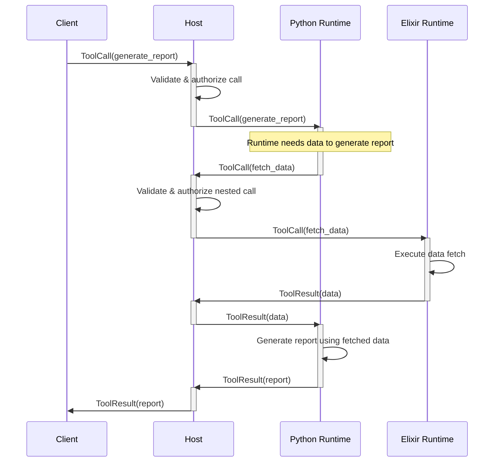
```mermaid
sequenceDiagram
    participant C as Client
    participant H as Host
    participant PY as Python Runtime
    participant EX as Elixir Runtime

    C->>H: ToolCall(generate_report)
    activate H
    H->>H: Validate & authorize call
    H->>PY: ToolCall(generate_report)
    deactivate H
    activate PY
    
    Note over PY: Runtime needs data to generate report
    
    PY->>H: ToolCall(fetch_data)
    deactivate PY
    activate H
    H->>H: Validate & authorize nested call
    H->>EX: ToolCall(fetch_data)
    deactivate H
    activate EX
    EX->>EX: Execute data fetch
    EX->>H: ToolResult(data)
    deactivate EX
    activate H
    H->>PY: ToolResult(data)
    deactivate H
    activate PY
    
    PY->>PY: Generate report using fetched data
    PY->>H: ToolResult(report)
    deactivate PY
    activate H
    H->>C: ToolResult(report)
    deactivate H
```

#### Security and Observability Advantages

The Host-mediated approach provides several critical advantages over direct Runtime-to-Runtime communication:

**Complete Security Control:** Every tool invocation, regardless of its origin (Client or Runtime), passes through the Host's authorization and validation layer. This ensures that even nested tool calls are subject to the same security policies, preventing privilege escalation or unauthorized access.

**End-to-End Observability:** All tool interactions are visible to the Host, enabling comprehensive audit logging, performance monitoring, and debugging capabilities. Direct Runtime-to-Runtime calls would create "dark" interactions invisible to the central control plane.

**Consistent Contract Enforcement:** The Host validates all tool calls against its trusted contract manifest, ensuring that even Runtime-initiated calls conform to the expected schemas and security constraints. This prevents malicious or compromised Runtimes from bypassing validation by calling tools directly.

**Simplified Network Architecture:** By maintaining the hub-and-spoke communication model, GRID avoids the complexity of mesh networking between Runtimes, reducing attack surface and simplifying firewall rules and network security policies.

This pattern enables sophisticated tool composition while maintaining the enterprise-grade security and governance guarantees that are fundamental to GRID's value proposition.

### 8.2. Implementing Stateful Services as Tools

Traditional stateful services—such as session managers, configuration stores, or workflow engines—can be seamlessly integrated into the ALTAR ecosystem by exposing their functionality through formal tool contracts. This pattern transforms stateful logic into securable, auditable runtimes that fulfill Host-managed contracts, bringing enterprise-grade governance to services that would otherwise operate outside the ALTAR security model.

By implementing stateful services as tools, organizations gain centralized control over state management operations, comprehensive audit trails of all state modifications, and the ability to apply consistent security policies across both stateless and stateful components of their AI agent infrastructure.

#### Conceptual Implementation Approach

Stateful services should expose their core operations through well-defined ADM FunctionDeclaration contracts. The service's internal state management remains encapsulated within the Runtime, while the ALTAR ecosystem interacts with the service exclusively through validated, Host-authorized tool calls.

Consider a simple variable storage service that maintains key-value pairs across multiple agent sessions. Rather than providing direct database access or REST endpoints, this service would expose its functionality through formal tool contracts:

**Variable Retrieval Tool Contract:**

```json
{
  "name": "get_variable",
  "description": "Retrieves the current value of a named variable from the stateful storage service",
  "parameters": {
    "type": "object",
    "properties": {
      "variable_name": {
        "type": "string",
        "description": "The unique identifier for the variable to retrieve",
        "pattern": "^[a-zA-Z][a-zA-Z0-9_]*$"
      },
      "scope": {
        "type": "string",
        "enum": ["session", "user", "global"],
        "description": "The scope within which to look for the variable",
        "default": "session"
      },
      "default_value": {
        "type": "string",
        "description": "Optional default value to return if the variable does not exist"
      }
    },
    "required": ["variable_name"]
  }
}
```

**Variable Storage Tool Contract:**

```json
{
  "name": "set_variable",
  "description": "Stores or updates the value of a named variable in the stateful storage service",
  "parameters": {
    "type": "object",
    "properties": {
      "variable_name": {
        "type": "string",
        "description": "The unique identifier for the variable to store or update",
        "pattern": "^[a-zA-Z][a-zA-Z0-9_]*$"
      },
      "value": {
        "type": "string",
        "description": "The value to store for this variable"
      },
      "scope": {
        "type": "string",
        "enum": ["session", "user", "global"],
        "description": "The scope within which to store the variable",
        "default": "session"
      },
      "ttl_seconds": {
        "type": "integer",
        "description": "Optional time-to-live in seconds after which the variable should expire",
        "minimum": 1
      }
    },
    "required": ["variable_name", "value"]
  }
}
```

#### Security and Governance Benefits

When stateful services are implemented as ALTAR tools, they automatically inherit the full security and governance capabilities of the GRID protocol:

**Centralized Authorization:** All state access operations flow through the Host's authorization layer, enabling fine-grained access control policies. For example, an organization can enforce that only specific agent roles can modify global variables, while session-scoped variables remain accessible only within their originating session context.

**Complete Audit Trail:** Every state modification becomes a logged, traceable tool invocation with full context about the requesting agent, session, and security principal. This provides unprecedented visibility into how AI agents interact with persistent state, supporting compliance requirements and debugging complex multi-agent workflows.

**Contract-Based Validation:** The Host validates all state operations against trusted schemas before execution, preventing malformed requests from corrupting the service's internal state. This validation layer acts as a robust API gateway specifically designed for AI agent interactions.

**Runtime Isolation:** The stateful service operates as an independent Runtime, allowing it to be scaled, monitored, and maintained separately from other system components. This isolation prevents state management concerns from affecting the performance or reliability of other tools in the ecosystem.

By adopting this pattern, organizations can maintain the benefits of stateful services—persistence, consistency, and complex business logic—while ensuring these services operate within ALTAR's enterprise-grade security and governance framework. The result is a unified approach to both stateless and stateful tool management that scales from simple variable storage to sophisticated workflow orchestration systems.

### 8.3. Governed Local Dispatch Pattern (Level 2+)

The **Governed Local Dispatch Pattern** is an advanced execution model that combines the security guarantees of Host-centric authorization with the performance benefits of local tool execution. This pattern enables zero-latency tool execution while maintaining complete Host authority over security policies and audit requirements.

This pattern is particularly valuable for scenarios involving large argument payloads, high-frequency tool calls, or latency-sensitive operations where network round-trips would significantly impact performance.

#### Pattern Overview

The Governed Local Dispatch Pattern follows a three-phase approach that separates authorization, execution, and audit logging:

1. **Authorization Phase:** Lightweight pre-authorization request to the Host
2. **Execution Phase:** Zero-latency local execution using authorized parameters
3. **Audit Phase:** Asynchronous result logging for compliance and observability

```mermaid
sequenceDiagram
    participant C as Client/Runtime
    participant H as GRID Host
    participant L as Local LATER Runtime
    participant A as Audit System
    participant S as Security Context

    Note over C,H: Phase 1: Lightweight Authorization (10-50ms)
    C->>+H: AuthorizeToolCall(session_id, security_context, call, correlation_id)
    H->>S: Validate SecurityContext and extract claims
    S-->>H: Principal identity and permissions
    H->>H: Run RBAC policy checks against tool contract
    H->>H: Validate call arguments against trusted ADM schema
    H->>H: Check rate limits and resource quotas
    H->>H: Generate unique invocation_id for correlation tracking
    H->>H: Set authorization TTL (default: 5 minutes)
    
    alt Authorization approved
        H-->>-C: AuthorizeToolCallResponse(APPROVED, invocation_id, ttl, correlation_id)
        Note over C: Authorization cached locally with TTL
    else Authorization denied
        H->>A: Log authorization denial with reason
        H-->>-C: AuthorizeToolCallResponse(DENIED, error, correlation_id)
        Note over C,L: Execution halted - no local dispatch permitted
    end

    Note over C,L: Phase 2: Zero-Latency Local Execution (0ms network overhead)
    alt Authorization was approved
        C->>C: Validate invocation_id and check TTL expiry
        C->>+L: Execute tool locally with authorized parameters
        Note over L: Local execution using LATER protocol
        L->>L: Load tool implementation from local registry
        L->>L: Validate arguments against local ADM schema
        L->>L: Execute business logic (compute/I/O operations)
        L->>L: Generate execution metadata (timing, resource usage)
        alt Local execution successful
            L-->>-C: ToolResult(success, data, execution_metadata)
        else Local execution failed
            L-->>-C: ToolResult(error, error_details, execution_metadata)
            Note over C: May fallback to remote execution
        end
    end

    Note over C,H: Phase 3: Asynchronous Audit Compliance (non-blocking)
    par Audit logging (async)
        C->>H: LogToolResult(invocation_id, result, execution_metadata, correlation_id)
        H->>H: Correlate with original authorization via invocation_id
        H->>H: Validate execution metadata for consistency
        H->>H: Check for potential tampering or anomalies
        H->>A: Write to enterprise audit trail with full context
        A-->>H: Audit record persisted
        H-->>C: LogToolResultResponse(LOGGED, correlation_id)
    and Client continues processing
        Note over C: Client can immediately return result to user
        Note over C: Audit logging happens in background
    end

    Note over C,H: Error Handling and Fallback Scenarios
    alt Local execution unavailable
        Note over C,L: Local runtime not available
        C->>H: ToolCall(invocation_id, call, correlation_id) [Fallback to remote]
        H->>H: Find appropriate remote Runtime
        H->>RT: ToolCall(invocation_id, call, correlation_id)
        RT-->>H: ToolResult(result)
        H-->>C: ToolResult(result, correlation_id)
    else Authorization expired during execution
        Note over C: TTL expired before local execution
        C->>H: AuthorizeToolCall(...) [Re-authorize]
        Note over C,H: Repeat authorization flow
    else Audit logging fails
        Note over C: Continue with local retry buffer
        C->>C: Store in local audit buffer for retry
        C->>C: Schedule retry with exponential backoff
    end

    Note over C,H: End-to-End Correlation and Traceability
    Note over C,H: correlation_id flows through all phases
    Note over C,H: invocation_id links authorization to execution to audit
    Note over C,H: Full traceability for debugging and compliance
```

#### Performance Benefits

The Governed Local Dispatch Pattern provides significant performance advantages over traditional remote execution:

**Zero Network Latency for Execution:**
- Tool execution happens locally without network round-trips
- Particularly beneficial for compute-intensive or I/O-bound operations
- Eliminates network variability from execution time measurements

**Reduced Payload Transfer:**
- Only lightweight authorization metadata crosses the network during authorization
- Large tool arguments and results stay local during execution
- Optimal for tools with substantial input/output data requirements

**Asynchronous Audit Logging:**
- Result logging doesn't block execution completion
- Audit operations can be batched and optimized independently
- Maintains compliance without impacting user-facing performance

**Measurable Performance Impact:**

The performance benefits of Governed Local Dispatch become more pronounced as payload sizes increase and network conditions vary. The following measurements demonstrate the pattern's effectiveness across different scenarios:

```yaml
# Performance comparison across different tool execution scenarios

Small Payload Tools (< 1KB arguments/results):
  Traditional Remote Execution:
    - Authorization + Validation: ~5-15ms (Host processing)
    - Network latency: 2x round-trips = ~20-100ms (varies by network)
    - Payload transfer: ~1-5ms (minimal data)
    - Total user-facing latency: ~26-120ms
  
  Governed Local Dispatch:
    - Authorization: 1x round-trip = ~10-50ms (lightweight metadata only)
    - Local execution: ~1-10ms (no network overhead)
    - Audit logging: Asynchronous = 0ms perceived overhead
    - Total user-facing latency: ~11-60ms
    - Performance improvement: 50-58% reduction

Medium Payload Tools (1KB - 1MB arguments/results):
  Traditional Remote Execution:
    - Authorization + Validation: ~5-15ms
    - Network latency: 2x round-trips = ~20-100ms
    - Payload transfer: ~10-200ms (depends on bandwidth)
    - Total user-facing latency: ~35-315ms
  
  Governed Local Dispatch:
    - Authorization: ~10-50ms (metadata only, ~100 bytes)
    - Local execution: ~5-50ms (no network transfer)
    - Audit logging: Asynchronous = 0ms perceived overhead
    - Total user-facing latency: ~15-100ms
    - Performance improvement: 57-68% reduction

Large Payload Tools (> 1MB arguments/results):
  Traditional Remote Execution:
    - Authorization + Validation: ~5-15ms
    - Network latency: 2x round-trips = ~20-100ms
    - Payload transfer: ~200-2000ms (bandwidth limited)
    - Total user-facing latency: ~225-2115ms
  
  Governed Local Dispatch:
    - Authorization: ~10-50ms (metadata only)
    - Local execution: ~10-100ms (local I/O only)
    - Audit logging: Asynchronous = 0ms perceived overhead
    - Total user-facing latency: ~20-150ms
    - Performance improvement: 91-93% reduction

High-Frequency Tool Calls (> 100 calls/second):
  Traditional Remote Execution:
    - Connection overhead: TCP/gRPC connection management
    - Serialization overhead: 2x per call (request + response)
    - Network congestion: Increased latency under load
    - Resource contention: Host processing bottleneck
  
  Governed Local Dispatch:
    - Batch authorization: Multiple tools authorized in single request
    - Local execution: No network congestion impact
    - Async audit batching: Reduced Host load
    - Connection reuse: Single persistent connection for audit
    - Throughput improvement: 3-5x increase in sustainable call rate

Network Condition Impact Analysis:
  High-Quality Network (< 10ms RTT, > 100Mbps):
    - Traditional: ~30-80ms per tool call
    - Local Dispatch: ~15-60ms per tool call
    - Improvement: ~50% reduction
  
  Standard Network (10-50ms RTT, 10-100Mbps):
    - Traditional: ~50-200ms per tool call
    - Local Dispatch: ~20-70ms per tool call
    - Improvement: ~60-65% reduction
  
  Poor Network (> 50ms RTT, < 10Mbps):
    - Traditional: ~150-500ms per tool call
    - Local Dispatch: ~25-80ms per tool call
    - Improvement: ~80-84% reduction
  
  Intermittent Connectivity:
    - Traditional: Fails completely during outages
    - Local Dispatch: Continues execution, queues audit logs
    - Availability improvement: Near 100% uptime for authorized tools
```

**Resource Utilization Benefits:**

```yaml
# Resource consumption comparison

Host Resource Usage:
  Traditional Remote Execution:
    - CPU: High (full argument validation + execution coordination)
    - Memory: High (payload buffering for large arguments/results)
    - Network: High (full payload transfer for every call)
    - Concurrent connections: Limited by payload processing capacity
  
  Governed Local Dispatch:
    - CPU: Low (lightweight authorization only)
    - Memory: Low (metadata-only processing)
    - Network: Low (authorization metadata + async audit logs)
    - Concurrent connections: 5-10x higher capacity

Client Resource Usage:
  Traditional Remote Execution:
    - Network bandwidth: High (full payload transfer)
    - Connection pooling: Complex (multiple concurrent calls)
    - Error handling: Network-dependent failures
  
  Governed Local Dispatch:
    - Network bandwidth: Low (authorization + audit metadata)
    - Local compute: Utilized efficiently
    - Error handling: Robust (local execution + fallback)
    - Caching: Authorization results cached locally

Runtime Resource Usage:
  Traditional Remote Execution:
    - Always active: Must handle all tool executions
    - Network dependency: Fails if Host unreachable
    - Scaling: Limited by network and Host capacity
  
  Governed Local Dispatch:
    - Selective activation: Only for tools requiring remote execution
    - Reduced load: Local execution reduces Runtime demand
    - Better scaling: Load distributed between local and remote execution
```

#### Security Guarantees

The Governed Local Dispatch Pattern maintains the complete security model of Host-centric authorization while enabling local execution. This section provides detailed analysis of how security guarantees are preserved and enhanced.

**Full Host Authorization (Zero Trust Model):**
- **Pre-execution Authorization:** Every tool execution requires explicit Host approval via `AuthorizeToolCall` before any local execution can proceed
- **RBAC Policy Enforcement:** All Role-Based Access Control policies are evaluated by the Host using the complete security context
- **Schema Validation:** Tool arguments are validated against trusted ADM schemas by the Host before authorization is granted
- **Resource Quota Enforcement:** Rate limits, resource quotas, and usage policies are enforced during the authorization phase
- **Principal Identity Verification:** Security context validation ensures only authenticated and authorized principals can execute tools
- **No Privilege Escalation:** Local execution cannot bypass or elevate privileges beyond what was authorized by the Host

**Complete Audit Trail (Compliance Guarantee):**
- **Authorization Logging:** All authorization requests (approved and denied) are logged with full context including principal, tool, arguments, and decision rationale
- **Execution Correlation:** Each execution is correlated with its authorization via unique `invocation_id` ensuring complete traceability
- **Execution Metadata:** Comprehensive execution metadata is captured including timing, resource usage, execution environment, and result characteristics
- **Tamper-Evident Logging:** Audit logs include cryptographic hashes and timestamps to detect unauthorized modifications
- **Regulatory Compliance:** Audit trail format supports SOX, HIPAA, PCI-DSS, and other regulatory requirements
- **Long-term Retention:** Audit logs are designed for long-term retention and forensic analysis

**No Security Bypass (Architectural Guarantee):**
- **Mandatory Authorization:** Local execution is architecturally impossible without valid `invocation_id` from Host authorization
- **TTL Enforcement:** Authorization tokens have mandatory time-to-live limits preventing indefinite reuse
- **Invocation ID Validation:** Each local execution validates the `invocation_id` against expected format and expiry
- **Execution Context Binding:** Authorization is bound to specific tool, arguments, and security context preventing reuse for different calls
- **Fallback Security:** If local execution fails security validation, automatic fallback to remote execution maintains security
- **Host Visibility:** Host maintains complete visibility into all tool executions through mandatory audit logging

**Advanced Tamper Detection:**
- **Correlation Validation:** Mismatched `invocation_id` between authorization and audit logging triggers security alerts
- **Execution Metadata Consistency:** Execution timing, resource usage, and result characteristics are validated for consistency
- **Argument Integrity:** Tool arguments are cryptographically hashed during authorization and verified during audit logging
- **Result Validation:** Tool results are validated against expected schemas and behavioral patterns
- **Anomaly Detection:** Statistical analysis of execution patterns detects potential security violations or compromised clients
- **Real-time Alerting:** Security violations trigger immediate alerts to security operations teams

**Enhanced Security Features:**

```yaml
# Security enforcement mechanisms

Authorization Phase Security:
  Principal Authentication:
    - Multi-factor authentication support
    - Certificate-based client authentication
    - Token-based authentication with refresh
    - Integration with enterprise identity providers
  
  Policy Enforcement:
    - Fine-grained RBAC with attribute-based access control
    - Dynamic policy evaluation based on context
    - Time-based access restrictions
    - Geographic and network-based restrictions
  
  Argument Validation:
    - Schema-based validation against trusted ADM contracts
    - Input sanitization and bounds checking
    - Sensitive data detection and masking
    - Malicious payload detection

Execution Phase Security:
  Local Runtime Security:
    - Sandboxed execution environment
    - Resource limits and quotas enforcement
    - Network access restrictions
    - File system access controls
  
  Execution Monitoring:
    - Real-time resource usage monitoring
    - Execution time bounds enforcement
    - Output validation and filtering
    - Behavioral anomaly detection

Audit Phase Security:
  Audit Log Integrity:
    - Cryptographic signing of audit records
    - Immutable audit log storage
    - Distributed audit log replication
    - Audit log encryption at rest and in transit
  
  Compliance Reporting:
    - Automated compliance report generation
    - Audit trail export for external systems
    - Retention policy enforcement
    - Data privacy and anonymization support

Threat Mitigation:
  Man-in-the-Middle Attacks:
    - Mandatory TLS 1.3 for all communications
    - Certificate pinning for Host connections
    - Mutual TLS authentication
    - Perfect forward secrecy
  
  Replay Attacks:
    - Unique invocation IDs with cryptographic nonces
    - Time-based token expiry
    - Sequence number validation
    - Challenge-response authentication
  
  Privilege Escalation:
    - Principle of least privilege enforcement
    - Capability-based security model
    - Runtime permission boundaries
    - Host-controlled execution environment
  
  Data Exfiltration:
    - Output filtering and validation
    - Sensitive data detection and blocking
    - Network egress monitoring
    - Audit trail for all data access

Incident Response:
  Security Event Detection:
    - Real-time security event correlation
    - Automated threat detection algorithms
    - Integration with SIEM systems
    - Custom security rule engine
  
  Response Automation:
    - Automatic client isolation on security violations
    - Dynamic policy updates for threat mitigation
    - Automated forensic data collection
    - Integration with incident response workflows
```

**Security Validation and Testing:**

The Governed Local Dispatch Pattern includes comprehensive security validation mechanisms:

- **Penetration Testing:** Regular security assessments validate the pattern against common attack vectors
- **Formal Security Analysis:** Mathematical proofs demonstrate that local execution cannot bypass Host authorization
- **Compliance Auditing:** Regular audits ensure the pattern meets regulatory requirements
- **Threat Modeling:** Systematic analysis of potential threats and corresponding mitigations
- **Security Metrics:** Continuous monitoring of security-related metrics and key performance indicators

This comprehensive security framework ensures that the performance benefits of local execution do not compromise the security guarantees that are fundamental to GRID's enterprise value proposition.

#### Implementation Requirements

The Governed Local Dispatch Pattern requires specific capabilities across all system components to ensure security, performance, and reliability. This section provides detailed implementation specifications for each component.

**Client/Runtime Implementation Requirements:**

*Core Capabilities:*
- **Local LATER Runtime Integration:** Must have access to a local LATER runtime capable of executing the same tools available through GRID
- **Enhanced Message Support:** Must implement `AuthorizeToolCallRequest/Response` and `LogToolResultRequest/Response` message handling
- **Correlation Management:** Must maintain strict correlation between authorization and execution via `invocation_id` throughout the entire flow
- **TTL Management:** Must respect authorization time-to-live limits and handle expiry gracefully
- **Fallback Handling:** Must implement graceful fallback to remote execution when local execution fails or is unavailable

*Security Requirements:*
- **Authorization Validation:** Must validate `invocation_id` format, expiry, and correlation before local execution
- **Secure Storage:** Must securely store authorization tokens with appropriate access controls
- **Audit Buffer:** Must implement local audit buffering for reliable audit log delivery
- **Error Handling:** Must handle authorization failures without exposing sensitive information

*Performance Requirements:*
- **Async Audit Logging:** Must implement asynchronous audit logging to avoid blocking user-facing operations
- **Connection Pooling:** Should implement connection pooling for efficient Host communication
- **Caching:** May implement authorization result caching within TTL limits
- **Resource Management:** Must implement proper resource cleanup and management for local execution

*Configuration Requirements:*
```yaml
# Required client configuration capabilities
client_config:
  execution_mode: "local_first" | "remote" | "local_only" | "auto"
  fallback_strategy: "graceful" | "fail_fast" | "retry"
  authorization_timeout_ms: 30000  # Maximum time to wait for authorization
  audit_timeout_ms: 10000          # Maximum time to wait for audit logging
  local_runtime_path: "/path/to/local/runtime"
  audit_buffer_size: 1000          # Local audit buffer capacity
  retry_policy:
    max_attempts: 3
    backoff_multiplier: 2.0
    max_backoff_ms: 10000
```

**Host Implementation Requirements:**

*Core Capabilities:*
- **Level 2+ Protocol Support:** Must support all enhanced message types defined in Section 4.5
- **Authorization Engine:** Must implement comprehensive authorization engine with RBAC, ABAC, and policy evaluation
- **Correlation Tracking:** Must maintain authorization state and correlation tracking across the entire tool execution lifecycle
- **Audit Infrastructure:** Must provide enterprise-grade audit logging infrastructure with retention and compliance features

*Security Requirements:*
- **Multi-tenant Security:** Must support multi-tenant security contexts with proper isolation
- **Policy Engine:** Must implement flexible policy engine supporting complex authorization rules
- **Threat Detection:** Should implement real-time threat detection and anomaly analysis
- **Compliance Reporting:** Must support automated compliance reporting and audit trail export

*Performance Requirements:*
- **High Throughput:** Must support high-throughput authorization processing (> 1000 authorizations/second)
- **Low Latency:** Must minimize authorization latency (< 50ms for typical requests)
- **Scalability:** Must support horizontal scaling for authorization and audit processing
- **Resource Optimization:** Must optimize resource usage for authorization metadata processing

*Configuration Requirements:*
```yaml
# Required Host configuration capabilities
host_config:
  governed_local_dispatch:
    enabled: true
    authorization_ttl_ms: 300000     # Default authorization TTL (5 minutes)
    max_concurrent_authorizations: 10000
    audit_buffer_size: 100000
    correlation_timeout_ms: 600000   # Maximum time to correlate audit with authorization
  
  security:
    require_authorization_for_local: true
    audit_all_local_executions: true
    tamper_detection_enabled: true
    threat_detection_enabled: true
  
  performance:
    authorization_cache_enabled: true
    authorization_cache_ttl_ms: 60000
    batch_audit_processing: true
    audit_batch_size: 100
```

**Local Runtime Implementation Requirements:**

*Core Capabilities:*
- **ADM Compatibility:** Must maintain full compatibility with ADM tool definitions and schemas
- **Execution Metadata:** Must generate comprehensive execution metadata including timing, resource usage, and result characteristics
- **Error Handling:** Must implement robust error handling with detailed error reporting
- **Resource Management:** Must implement proper resource limits and cleanup

*Security Requirements:*
- **Sandboxed Execution:** Should implement sandboxed execution environment for tool isolation
- **Resource Limits:** Must enforce resource limits (CPU, memory, network, file system)
- **Output Validation:** Must validate tool outputs against expected schemas
- **Access Controls:** Must implement proper access controls for tool execution

*Performance Requirements:*
- **Fast Startup:** Must minimize startup time for tool execution
- **Efficient Resource Usage:** Must optimize CPU, memory, and I/O usage
- **Concurrent Execution:** Should support concurrent tool execution when safe
- **Caching:** May implement tool code caching for improved performance

*Integration Requirements:*
```yaml
# Required local runtime capabilities
local_runtime_config:
  execution_environment:
    sandbox_enabled: true
    resource_limits:
      max_cpu_percent: 80
      max_memory_mb: 1024
      max_execution_time_ms: 300000
      max_file_descriptors: 100
  
  monitoring:
    execution_metadata_enabled: true
    resource_monitoring_enabled: true
    performance_profiling_enabled: false
  
  security:
    output_validation_enabled: true
    network_access_restricted: true
    file_system_access_restricted: true
```

**Integration and Compatibility Requirements:**

*Protocol Compatibility:*
- **Backward Compatibility:** Must maintain backward compatibility with Level 1 implementations
- **Version Negotiation:** Must support protocol version negotiation and feature discovery
- **Graceful Degradation:** Must gracefully degrade to remote execution when local dispatch is unavailable

*Ecosystem Integration:*
- **LATER Protocol:** Must integrate seamlessly with existing LATER protocol implementations
- **ADM Compliance:** Must maintain full compliance with ADM specifications
- **AESP Integration:** Must support AESP enterprise features when available

*Deployment Requirements:*
- **Container Support:** Should support containerized deployment environments
- **Cloud Native:** Should integrate with cloud-native orchestration platforms
- **Monitoring Integration:** Must integrate with standard monitoring and observability tools
- **Configuration Management:** Must support standard configuration management practices

**Validation and Testing Requirements:**

*Functional Testing:*
- **Authorization Flow Testing:** Must validate complete authorization-execution-audit flow
- **Fallback Testing:** Must test all fallback scenarios and error conditions
- **Security Testing:** Must validate security controls and tamper detection
- **Performance Testing:** Must validate performance claims and resource usage

*Integration Testing:*
- **End-to-End Testing:** Must test complete integration across all components
- **Multi-tenant Testing:** Must validate multi-tenant security and isolation
- **Compliance Testing:** Must validate compliance with regulatory requirements
- **Interoperability Testing:** Must test interoperability with different implementations

This comprehensive set of implementation requirements ensures that the Governed Local Dispatch Pattern can be implemented consistently across different platforms and environments while maintaining security, performance, and reliability guarantees.

#### Fallback Mechanisms

The Governed Local Dispatch Pattern implements comprehensive fallback mechanisms to ensure high availability and reliability across all failure scenarios. These mechanisms maintain service continuity while preserving security and audit requirements.

**Authorization Failure Fallback:**

The authorization phase includes multiple fallback strategies based on the type and severity of authorization failures:

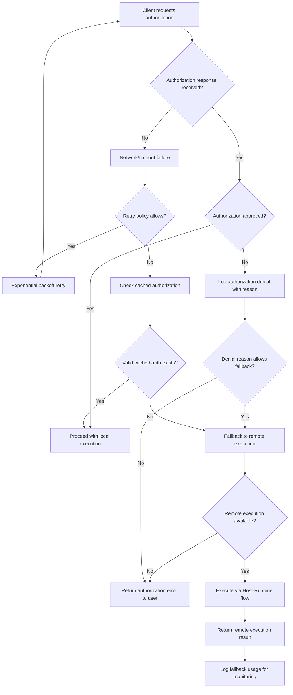
```mermaid
graph TD
    A[Client requests authorization] --> B{Authorization response received?}
    B -->|No| B1[Network/timeout failure]
    B1 --> B2{Retry policy allows?}
    B2 -->|Yes| B3[Exponential backoff retry]
    B3 --> A
    B2 -->|No| B4[Check cached authorization]
    B4 --> B5{Valid cached auth exists?}
    B5 -->|Yes| C[Proceed with cached authorization]
    B5 -->|No| E[Fallback to remote execution]
    
    B -->|Yes| D{Authorization approved?}
    D -->|Yes| C[Proceed with local execution]
    D -->|No| D1[Log authorization denial with reason]
    D1 --> D2{Denial reason allows fallback?}
    D2 -->|Yes| E[Fallback to remote execution]
    D2 -->|No| F[Return authorization error to user]
    
    E --> E1{Remote execution available?}
    E1 -->|Yes| E2[Execute via Host-Runtime flow]
    E1 -->|No| F
    E2 --> E3[Return remote execution result]
    E3 --> E4[Log fallback usage for monitoring]
```

**Authorization Failure Categories and Responses:**

```yaml
# Authorization failure handling matrix
authorization_failures:
  network_failures:
    - connection_timeout: "Retry with exponential backoff, fallback to cached auth"
    - connection_refused: "Immediate fallback to remote execution"
    - dns_resolution_failure: "Retry with alternative endpoints"
    - certificate_validation_failure: "Fail fast - security violation"
  
  authentication_failures:
    - invalid_credentials: "Fail fast - no fallback allowed"
    - expired_token: "Attempt token refresh, then fallback"
    - insufficient_privileges: "Fallback to remote execution with logging"
    - account_locked: "Fail fast - security violation"
  
  authorization_policy_failures:
    - rbac_denial: "Fallback to remote execution if policy allows"
    - rate_limit_exceeded: "Exponential backoff retry, then fallback"
    - resource_quota_exceeded: "Fallback to remote execution"
    - time_based_restriction: "Schedule retry or fallback"
  
  validation_failures:
    - invalid_arguments: "Fail fast - client error"
    - schema_violation: "Fail fast - client error"
    - malformed_request: "Fail fast - client error"
    - unsupported_tool: "Fallback to remote execution"
```

**Local Execution Failure Fallback:**

Local execution failures are handled with intelligent fallback strategies that consider the failure type and system state:

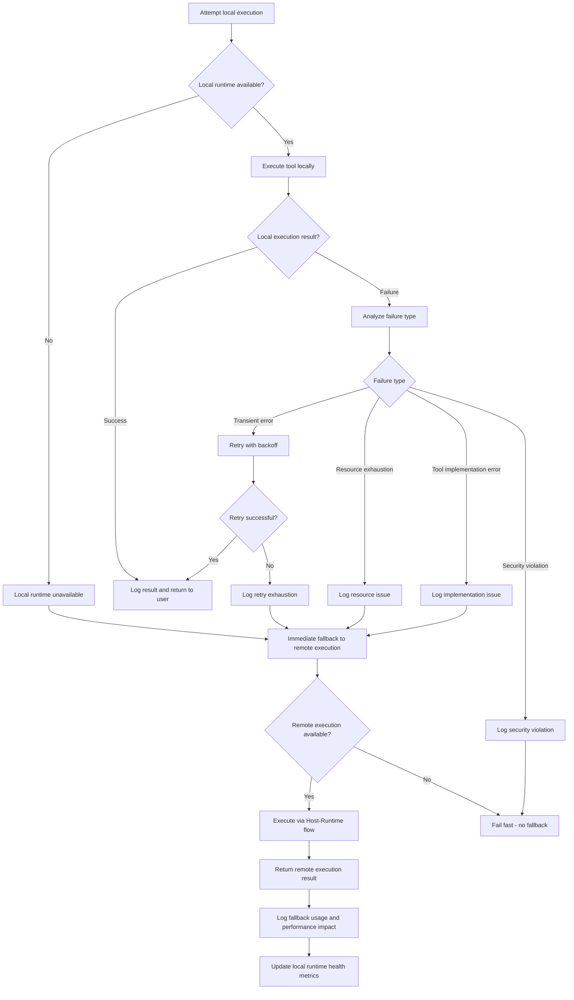
```mermaid
graph TD
    A[Attempt local execution] --> B{Local runtime available?}
    B -->|No| B1[Local runtime unavailable]
    B1 --> E[Immediate fallback to remote execution]
    
    B -->|Yes| C[Execute tool locally]
    C --> D{Local execution result?}
    
    D -->|Success| D1[Log result and return to user]
    
    D -->|Failure| D2[Analyze failure type]
    D2 --> D3{Failure type}
    
    D3 -->|Transient error| D4[Retry with backoff]
    D4 --> D5{Retry successful?}
    D5 -->|Yes| D1
    D5 -->|No| D6[Log retry exhaustion]
    D6 --> E
    
    D3 -->|Resource exhaustion| D7[Log resource issue]
    D7 --> E
    
    D3 -->|Tool implementation error| D8[Log implementation issue]
    D8 --> E
    
    D3 -->|Security violation| D9[Log security violation]
    D9 --> F[Fail fast - no fallback]
    
    E --> E1{Remote execution available?}
    E1 -->|Yes| E2[Execute via Host-Runtime flow]
    E1 -->|No| F
    E2 --> E3[Return remote execution result]
    E3 --> E4[Log fallback usage and performance impact]
    E4 --> E5[Update local runtime health metrics]
```

**Local Execution Failure Categories:**

```yaml
# Local execution failure handling
local_execution_failures:
  runtime_failures:
    - runtime_not_found: "Immediate remote fallback"
    - runtime_startup_failure: "Retry once, then remote fallback"
    - runtime_crash: "Restart runtime, retry once, then remote fallback"
    - runtime_unresponsive: "Kill and restart runtime, then remote fallback"
  
  resource_failures:
    - out_of_memory: "Remote fallback, alert resource monitoring"
    - cpu_timeout: "Remote fallback, check resource limits"
    - disk_space_exhausted: "Remote fallback, alert operations"
    - network_access_denied: "Remote fallback if tool requires network"
  
  tool_failures:
    - tool_not_found: "Remote fallback, update local tool registry"
    - tool_version_mismatch: "Remote fallback, sync tool versions"
    - tool_dependency_missing: "Remote fallback, alert dependency management"
    - tool_execution_error: "Retry once, then remote fallback"
  
  security_failures:
    - permission_denied: "Fail fast - no fallback"
    - sandbox_violation: "Fail fast - no fallback"
    - output_validation_failure: "Fail fast - no fallback"
    - tamper_detection: "Fail fast - alert security team"
```

**Audit Logging Failure Handling:**

Audit logging failures require special handling to maintain compliance while ensuring system availability:

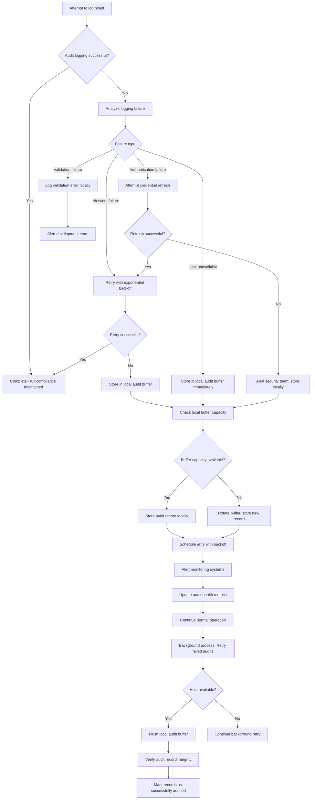
```mermaid
graph TD
    A[Attempt to log result] --> B{Audit logging successful?}
    B -->|Yes| C[Complete - full compliance maintained]
    
    B -->|No| D[Analyze logging failure]
    D --> E{Failure type}
    
    E -->|Network failure| E1[Retry with exponential backoff]
    E1 --> E2{Retry successful?}
    E2 -->|Yes| C
    E2 -->|No| E3[Store in local audit buffer]
    
    E -->|Host unavailable| E4[Store in local audit buffer immediately]
    
    E -->|Authentication failure| E5[Attempt credential refresh]
    E5 --> E6{Refresh successful?}
    E6 -->|Yes| E1
    E6 -->|No| E7[Alert security team, store locally]
    
    E -->|Validation failure| E8[Log validation error locally]
    E8 --> E9[Alert development team]
    
    E3 --> F[Check local buffer capacity]
    E4 --> F
    E7 --> F
    
    F --> G{Buffer capacity available?}
    G -->|Yes| H[Store audit record locally]
    G -->|No| I[Rotate buffer, store new record]
    
    H --> J[Schedule retry with backoff]
    I --> J
    
    J --> K[Alert monitoring systems]
    K --> L[Update audit health metrics]
    L --> M[Continue normal operation]
    
    M --> N[Background process: Retry failed audits]
    N --> O{Host available?}
    O -->|Yes| P[Flush local audit buffer]
    O -->|No| Q[Continue background retry]
    P --> R[Verify audit record integrity]
    R --> S[Mark records as successfully audited]
```

**Audit Logging Resilience Features:**

```yaml
# Audit logging failure resilience
audit_resilience:
  local_buffering:
    buffer_size: 10000  # Maximum audit records to buffer locally
    buffer_rotation: "fifo"  # First-in-first-out when buffer full
    persistence: "disk"  # Persist buffer to disk for crash recovery
    encryption: "aes256"  # Encrypt local audit buffer
  
  retry_strategy:
    initial_delay_ms: 1000
    max_delay_ms: 300000  # 5 minutes maximum backoff
    backoff_multiplier: 2.0
    max_attempts: 10
    jitter_enabled: true
  
  failure_alerting:
    alert_threshold: 100  # Alert after 100 failed audit attempts
    alert_channels: ["email", "slack", "pagerduty"]
    escalation_policy: "security_team"
    compliance_notification: true
  
  integrity_verification:
    checksum_validation: true
    timestamp_verification: true
    sequence_number_tracking: true
    duplicate_detection: true
```

**Circuit Breaker Integration:**

The fallback mechanisms integrate with circuit breaker patterns to prevent cascading failures:

```yaml
# Circuit breaker configuration for fallback mechanisms
circuit_breakers:
  authorization_circuit:
    failure_threshold: 5  # Open after 5 consecutive failures
    recovery_timeout_ms: 30000  # 30 seconds before attempting recovery
    half_open_max_calls: 3  # Maximum calls in half-open state
    success_threshold: 2  # Successful calls needed to close circuit
  
  local_execution_circuit:
    failure_threshold: 10  # Higher threshold for local execution
    recovery_timeout_ms: 60000  # 1 minute recovery time
    half_open_max_calls: 5
    success_threshold: 3
  
  audit_logging_circuit:
    failure_threshold: 20  # High threshold to avoid compliance issues
    recovery_timeout_ms: 120000  # 2 minutes recovery time
    half_open_max_calls: 10
    success_threshold: 5
```

**Fallback Performance Monitoring:**

Comprehensive monitoring ensures fallback mechanisms operate effectively:

```yaml
# Fallback mechanism monitoring
fallback_metrics:
  authorization_fallbacks:
    - fallback_rate: "Percentage of requests using fallback"
    - fallback_latency: "Additional latency introduced by fallback"
    - cache_hit_rate: "Effectiveness of authorization caching"
    - failure_categories: "Distribution of failure types"
  
  execution_fallbacks:
    - local_to_remote_rate: "Percentage of executions falling back to remote"
    - fallback_success_rate: "Success rate of remote fallback execution"
    - performance_impact: "Latency difference between local and remote"
    - resource_utilization: "Impact on Host and Runtime resources"
  
  audit_fallbacks:
    - buffer_utilization: "Local audit buffer usage"
    - retry_success_rate: "Success rate of audit log retries"
    - compliance_gap: "Time between execution and successful audit"
    - data_integrity: "Audit record integrity verification results"
```

These comprehensive fallback mechanisms ensure that the Governed Local Dispatch Pattern maintains high availability and reliability while preserving security and compliance requirements across all failure scenarios.

#### Configuration and Usage Patterns

**Host Configuration:**
```json
{
  "grid_mode": "STRICT",
  "governed_local_dispatch": {
    "enabled": true,
    "authorization_ttl_ms": 300000,
    "audit_buffer_size": 1000,
    "correlation_timeout_ms": 600000
  },
  "security": {
    "require_authorization_for_local": true,
    "audit_local_executions": true,
    "tamper_detection_enabled": true
  }
}
```

**Client Configuration:**
```python
# Python client example
altar_client = AltarClient(
    execution_mode="local_first",  # Prefer local dispatch when available
    fallback_mode="remote",        # Fallback to remote on local failure
    local_runtime_path="/usr/local/bin/altar-runtime",
    authorization_timeout=30.0,
    audit_async=True
)
```

```elixir
# Elixir client example
config :altar, Altar.Client,
  execution_mode: :local_first,
  fallback_mode: :remote,
  local_runtime_module: Altar.LocalRuntime,
  authorization_timeout: 30_000,
  audit_async: true
```

#### Integration with Existing Patterns

The Governed Local Dispatch Pattern integrates seamlessly with other GRID patterns:

**With Bidirectional Tool Calls:**
- Local execution can trigger additional tool calls through the Host
- Authorization cascade ensures all nested calls are properly authorized
- Audit trail maintains complete visibility into tool call chains

**With Stateful Services:**
- Stateful services can benefit from local dispatch for frequently accessed operations
- State consistency is maintained through proper authorization and audit logging
- Local caching can be implemented while maintaining security guarantees

**With Development Workflows:**
- DEVELOPMENT mode can use local dispatch for rapid iteration
- Dynamic tool registration works with local execution capabilities
- Testing frameworks can validate both local and remote execution paths

#### Monitoring and Observability

The pattern provides comprehensive monitoring capabilities:

**Performance Metrics:**
- Authorization latency tracking
- Local vs. remote execution time comparisons
- Fallback frequency and reasons
- Audit logging performance and reliability

**Security Metrics:**
- Authorization success/failure rates
- Tamper detection alerts
- Audit trail completeness verification
- Correlation tracking accuracy

**Operational Metrics:**
- Local runtime availability and health
- Network connectivity impact on fallbacks
- Resource utilization for local vs. remote execution
- Error rates and recovery patterns

This comprehensive monitoring enables organizations to optimize their deployment for both performance and security while maintaining complete visibility into system behavior.

#### Client Library Implementation Patterns

The Governed Local Dispatch Pattern is most effectively implemented through client library abstractions that hide the complexity of the three-phase flow from application developers. This section provides concrete implementation patterns for both synchronous and asynchronous APIs across Python and Elixir ecosystems.

##### Synchronous API Patterns

**Python Implementation with Decorators:**

```python
from altar.client import AltarClient, tool, ExecutionMode
from altar.types import ToolResult
import asyncio

# Configure client with local dispatch preferences
client = AltarClient(
    host_url="grpc://grid-host:9090",
    execution_mode=ExecutionMode.LOCAL_FIRST,
    local_runtime_path="/usr/local/bin/altar-runtime"
)

@tool(client=client, execution_mode=ExecutionMode.LOCAL_FIRST)
def calculate_sum(a: float, b: float) -> float:
    """Add two numbers together with local dispatch optimization."""
    return a + b

@tool(client=client, execution_mode=ExecutionMode.REMOTE)
def fetch_external_data(api_endpoint: str) -> dict:
    """Fetch data from external API - always use remote execution."""
    # Implementation would be in the Runtime, not here
    pass

# Usage - the decorator handles the governed local dispatch flow
def main():
    # This call will attempt local dispatch with Host authorization
    result = calculate_sum(10.5, 20.3)
    print(f"Sum: {result}")  # Output: Sum: 30.8
    
    # This call will always use remote execution
    data = fetch_external_data("https://api.example.com/data")
    print(f"Data: {data}")

if __name__ == "__main__":
    main()
```

**Elixir Implementation with Macros:**

```elixir
defmodule MyApp.Tools do
  use Altar.Client, 
    host_url: "grpc://grid-host:9090",
    execution_mode: :local_first,
    local_runtime_module: Altar.LocalRuntime

  @doc "Add two numbers together with local dispatch optimization"
  deftool calculate_sum(a :: float(), b :: float()) :: float() do
    # The actual implementation is in the Runtime
    # This macro generates the authorization/execution/audit flow
  end

  @doc "Fetch data from external API - always use remote execution"
  deftool fetch_external_data(api_endpoint :: String.t()), 
    execution_mode: :remote do
    # Remote-only execution for external integrations
  end
end

# Usage
defmodule MyApp.Application do
  alias MyApp.Tools

  def run_calculations do
    # This call will attempt local dispatch with Host authorization
    {:ok, result} = Tools.calculate_sum(10.5, 20.3)
    IO.puts("Sum: #{result}")  # Output: Sum: 30.8
    
    # This call will always use remote execution
    {:ok, data} = Tools.fetch_external_data("https://api.example.com/data")
    IO.inspect(data, label: "Data")
  end
end
```

##### Asynchronous API Patterns

**Python Async Implementation:**

```python
import asyncio
from altar.client import AsyncAltarClient, async_tool, ExecutionMode
from typing import List, Dict, Any

# Configure async client with local dispatch
client = AsyncAltarClient(
    host_url="grpc://grid-host:9090",
    execution_mode=ExecutionMode.LOCAL_FIRST,
    local_runtime_path="/usr/local/bin/altar-runtime",
    max_concurrent_authorizations=10
)

@async_tool(client=client, execution_mode=ExecutionMode.LOCAL_FIRST)
async def process_batch_data(data_batch: List[Dict[str, Any]]) -> List[Dict[str, Any]]:
    """Process a batch of data with local dispatch for performance."""
    # Implementation in Runtime - this generates the async dispatch flow
    pass

@async_tool(client=client, execution_mode=ExecutionMode.REMOTE)
async def send_notification(message: str, recipients: List[str]) -> bool:
    """Send notifications via external service - remote execution only."""
    pass

async def main():
    # Concurrent execution with local dispatch
    batch_tasks = [
        process_batch_data([{"id": i, "value": i * 2}]) 
        for i in range(5)
    ]
    
    # All authorizations happen concurrently, then local execution
    results = await asyncio.gather(*batch_tasks)
    
    # Remote execution for external integration
    notification_sent = await send_notification(
        "Batch processing complete", 
        ["admin@example.com"]
    )
    
    print(f"Processed {len(results)} batches")
    print(f"Notification sent: {notification_sent}")

if __name__ == "__main__":
    asyncio.run(main())
```

**Elixir GenServer-based Async Implementation:**

```elixir
defmodule MyApp.AsyncTools do
  use GenServer
  use Altar.AsyncClient,
    host_url: "grpc://grid-host:9090",
    execution_mode: :local_first,
    local_runtime_module: Altar.LocalRuntime

  # Client API
  def start_link(opts \\ []) do
    GenServer.start_link(__MODULE__, opts, name: __MODULE__)
  end

  def process_batch_async(data_batch) do
    GenServer.call(__MODULE__, {:process_batch, data_batch})
  end

  def send_notification_async(message, recipients) do
    GenServer.call(__MODULE__, {:send_notification, message, recipients})
  end

  # Server callbacks with async tool definitions
  def init(_opts) do
    {:ok, %{}}
  end

  def handle_call({:process_batch, data_batch}, _from, state) do
    # This spawns the governed local dispatch flow asynchronously
    task = Task.async(fn ->
      deftool_async process_batch_data(data_batch), execution_mode: :local_first
    end)
    
    result = Task.await(task, 30_000)
    {:reply, result, state}
  end

  def handle_call({:send_notification, message, recipients}, _from, state) do
    task = Task.async(fn ->
      deftool_async send_notification(message, recipients), execution_mode: :remote
    end)
    
    result = Task.await(task, 10_000)
    {:reply, result, state}
  end
end

# Usage with concurrent execution
defmodule MyApp.BatchProcessor do
  def run_concurrent_processing do
    # Start the async tools server
    {:ok, _pid} = MyApp.AsyncTools.start_link()
    
    # Process multiple batches concurrently
    batch_tasks = for i <- 1..5 do
      Task.async(fn ->
        MyApp.AsyncTools.process_batch_async([%{id: i, value: i * 2}])
      end)
    end
    
    # Wait for all batch processing to complete
    results = Task.await_many(batch_tasks, 30_000)
    
    # Send notification about completion
    {:ok, notification_sent} = MyApp.AsyncTools.send_notification_async(
      "Batch processing complete",
      ["admin@example.com"]
    )
    
    IO.puts("Processed #{length(results)} batches")
    IO.puts("Notification sent: #{notification_sent}")
  end
end
```

##### ExecutionMode Configuration Patterns

**Comprehensive ExecutionMode Options:**

```python
# Python ExecutionMode enumeration
from enum import Enum

class ExecutionMode(Enum):
    # Always use remote execution through Host
    REMOTE = "remote"
    
    # Prefer local execution, fallback to remote on failure
    LOCAL_FIRST = "local_first"
    
    # Require local execution, fail if not available
    LOCAL_ONLY = "local_only"
    
    # Automatically choose based on tool characteristics
    AUTO = "auto"
    
    # Use local for development, remote for production
    ENVIRONMENT_AWARE = "environment_aware"

# Configuration examples for different scenarios
development_config = AltarClientConfig(
    execution_mode=ExecutionMode.LOCAL_FIRST,
    fallback_timeout_ms=5000,
    local_runtime_health_check=True
)

production_config = AltarClientConfig(
    execution_mode=ExecutionMode.REMOTE,
    security_level="strict",
    audit_all_executions=True
)

hybrid_config = AltarClientConfig(
    execution_mode=ExecutionMode.AUTO,
    auto_selection_criteria={
        "payload_size_threshold": 1024 * 1024,  # 1MB
        "latency_sensitive_tools": ["calculate_*", "transform_*"],
        "remote_only_tools": ["send_*", "fetch_*"]
    }
)
```

```elixir
# Elixir ExecutionMode configuration
defmodule Altar.ExecutionMode do
  @type t :: :remote | :local_first | :local_only | :auto | :environment_aware

  @doc "Configuration for different execution modes"
  def config(:remote) do
    %{
      prefer_local: false,
      allow_fallback: false,
      security_level: :strict,
      audit_all: true
    }
  end

  def config(:local_first) do
    %{
      prefer_local: true,
      allow_fallback: true,
      fallback_timeout_ms: 5_000,
      health_check_local: true
    }
  end

  def config(:local_only) do
    %{
      prefer_local: true,
      allow_fallback: false,
      require_local_runtime: true,
      fail_on_unavailable: true
    }
  end

  def config(:auto) do
    %{
      selection_criteria: %{
        payload_size_threshold: 1_048_576,  # 1MB
        latency_sensitive_patterns: ~r/^(calculate|transform)_/,
        remote_only_patterns: ~r/^(send|fetch)_/
      }
    }
  end

  def config(:environment_aware) do
    case Mix.env() do
      :dev -> config(:local_first)
      :test -> config(:local_only)
      :prod -> config(:remote)
    end
  end
end

# Usage in application configuration
config :altar, Altar.Client,
  execution_mode: :local_first,
  mode_config: Altar.ExecutionMode.config(:local_first),
  tool_specific_modes: %{
    "calculate_sum" => :local_first,
    "send_email" => :remote,
    "fetch_data" => :remote
  }
```

##### Advanced Client Library Features

**Intelligent Fallback with Circuit Breaker:**

```python
from altar.client import AltarClient, CircuitBreakerConfig
from altar.patterns import RetryPolicy, FallbackStrategy

client = AltarClient(
    execution_mode=ExecutionMode.LOCAL_FIRST,
    circuit_breaker=CircuitBreakerConfig(
        failure_threshold=5,
        recovery_timeout=30.0,
        half_open_max_calls=3
    ),
    retry_policy=RetryPolicy(
        max_attempts=3,
        backoff_multiplier=2.0,
        max_backoff=10.0
    ),
    fallback_strategy=FallbackStrategy.GRACEFUL_DEGRADATION
)

@tool(client=client)
def resilient_calculation(data: List[float]) -> float:
    """Calculation with automatic fallback and circuit breaker protection."""
    pass
```

**Performance Monitoring Integration:**

```elixir
defmodule MyApp.MonitoredTools do
  use Altar.Client,
    execution_mode: :local_first,
    telemetry_enabled: true,
    metrics_collector: MyApp.MetricsCollector

  # Telemetry events are automatically emitted:
  # [:altar, :tool, :authorization, :start]
  # [:altar, :tool, :authorization, :stop]
  # [:altar, :tool, :execution, :start]
  # [:altar, :tool, :execution, :stop]
  # [:altar, :tool, :audit, :start]
  # [:altar, :tool, :audit, :stop]

  deftool monitored_calculation(data :: list(float())) :: float() do
    # Implementation generates telemetry events automatically
  end
end

# Telemetry handler for monitoring
defmodule MyApp.TelemetryHandler do
  def handle_event([:altar, :tool, :execution, :stop], measurements, metadata, _config) do
    %{duration: duration} = measurements
    %{tool_name: tool_name, execution_mode: mode} = metadata
    
    # Log performance metrics
    Logger.info("Tool #{tool_name} executed in #{duration}ms using #{mode} mode")
    
    # Send to monitoring system
    MyApp.Metrics.record_tool_execution(tool_name, mode, duration)
  end
end
```

These client library implementation patterns provide developers with powerful abstractions that make the Governed Local Dispatch Pattern easy to use while maintaining all security and performance benefits. The decorator and macro-based approaches hide the complexity of the three-phase flow, while the configuration options allow fine-tuned control over execution behavior based on specific application requirements.

## 8. Compliance Levels

To facilitate interoperability and gradual adoption, GRID defines several compliance levels. These levels are designed to maintain backward compatibility while enabling progressive adoption of advanced features. **All new features introduced in this specification are marked as Level 2+ to preserve the simplicity and stability of the core protocol.**

### 8.1. Level 1 (Core) - Baseline Compatibility

**Level 1** represents the minimal, compliant implementation that forms the foundation of the GRID protocol. All GRID implementations MUST support Level 1 features to ensure basic interoperability and maintain the core protocol's simplicity.

**Required Features:**
-   Must implement `AnnounceRuntime`, `FulfillTools` messages for runtime connection and capability declaration
-   Must support the synchronous `ToolCall` -> `ToolResult` flow for basic tool execution
-   Must implement `CreateSession` and `DestroySession` for session lifecycle management
-   Must use and validate ADM structures for all tool-related payloads (`FunctionCall`, `ToolResult`, etc.)
-   Must support both STRICT and DEVELOPMENT operational modes (see Section 2.3)
-   Must implement basic `Error` message structure for error reporting

**Explicitly Excluded from Level 1:**
The following features are **NOT** required for Level 1 compliance to maintain core protocol simplicity:
-   Dynamic tool registration (`RegisterToolsRequest`/`RegisterToolsResponse` messages)
-   Governed local dispatch (`AuthorizeToolCallRequest`/`LogToolResultRequest` messages)
-   Streaming capabilities (`StreamChunk` messages)
-   Enhanced error structures (`EnhancedError` messages)
-   Advanced security contexts (`SecurityContext` messages)
-   Correlation ID tracking and end-to-end tracing

**Backward Compatibility Guarantee:**
All future GRID protocol versions MUST maintain full backward compatibility with Level 1 implementations. This guarantee ensures that:
- Level 1 clients MUST be able to connect to and interact with Level 2+ Hosts
- Level 1 Hosts MUST be able to accept connections from Level 2+ Runtimes
- New features are always additive and optional
- Core protocol behavior remains stable and predictable
- Existing Level 1 implementations continue to work without modification

**Target Use Cases:**
- Basic tool execution scenarios
- Simple development and testing environments
- Minimal resource footprint deployments
- Foundation for building more advanced implementations
- Legacy system integration where simplicity is paramount

### 8.2. Level 2 (Enhanced) - Production-Ready Features

**Level 2** builds upon Level 1 with enhanced features suitable for production deployments. **All new features introduced in this specification revision are classified as Level 2+ to maintain the core protocol's simplicity and ensure existing Level 1 implementations remain fully functional.**

**Required Features (All Level 1 features plus):**
-   Must implement the `StreamChunk` message for streaming results from long-running tools
-   Must support the `SecurityContext` message for multi-tenancy and advanced authorization
-   Must implement `EnhancedError` message structure with detailed error context and remediation guidance
-   Must support correlation ID tracking across all message flows for end-to-end traceability
-   Should implement circuit breaker patterns for resilient error handling

**New Level 2+ Features (Introduced in this specification):**
All features marked as "Level 2+" in this document are optional enhancements that preserve Level 1 compatibility:

-   **Dynamic Tool Registration (Level 2+):** Support for `RegisterToolsRequest`/`RegisterToolsResponse` messages enabling DEVELOPMENT mode dynamic tool registration
-   **Governed Local Dispatch (Level 2+):** Support for `AuthorizeToolCallRequest`/`AuthorizeToolCallResponse` and `LogToolResultRequest`/`LogToolResultResponse` messages for zero-latency execution with full security
-   **Enhanced Protocol Messages (Level 2+):** Extended message schemas with additional metadata and context fields
-   **Advanced Error Handling (Level 2+):** Enhanced circuit breaker implementations with configurable thresholds and detailed remediation guidance
-   **Performance Optimizations (Level 2+):** Authorization caching, connection pooling, and co-location strategies
-   **Development Workflow Patterns (Level 2+):** Multi-language development support and rapid iteration capabilities

**Backward Compatibility Guarantee:**
Level 2 implementations MUST gracefully degrade when communicating with Level 1 implementations:
- Optional Level 2+ features MUST be negotiated during the connection handshake
- Implementations MUST fall back to Level 1 behavior when advanced features are not supported by the peer
- All Level 2+ message types MUST be handled gracefully by Level 1 implementations (typically by returning appropriate error responses)
- Core protocol flows MUST remain unchanged to ensure Level 1 compatibility

**Target Use Cases:**
- Production deployments requiring streaming capabilities
- Multi-tenant environments with advanced security requirements
- High-performance scenarios requiring governed local dispatch optimization
- Development environments requiring dynamic tool registration
- Organizations needing enhanced observability and error handling

### 8.3. Level 3 (Enterprise) - Comprehensive Governance

**Level 3** represents a full-featured, high-security implementation suitable for regulated environments. Compliance for this level is defined by the separate **AESP (ALTAR Enterprise Security Profile)**, which is structured into incremental tiers (Foundation, Advanced, and Complete) to facilitate adoption.

**Enterprise Requirements:**
AESP mandates a comprehensive control plane architecture for identity, policy, audit, and governance. Level 3 compliance requires implementation of enterprise-specific message extensions and security controls as defined in the AESP specification.

**Reference:**
See: `aesp.md` for the complete AESP specification and its compliance tiers.

### 8.4. Compliance Level Progression Path

Organizations can adopt GRID incrementally by following this structured progression path. **This approach ensures that existing Level 1 implementations remain fully functional while providing clear upgrade paths to advanced features.**

#### 8.4.1. Level 1 → Level 2 Migration

**Prerequisites:**
- Stable Level 1 implementation in production with proven reliability
- Business requirements for streaming, advanced security, or performance optimization
- Development team familiar with GRID core concepts and operational patterns
- Adequate testing infrastructure to validate backward compatibility

**Detailed Migration Steps:**

1. **Assessment and Planning Phase:**
   - **Compatibility Audit:** Thoroughly audit current Level 1 implementation for compliance with core protocol requirements
   - **Feature Requirements Analysis:** Identify which Level 2+ features are needed for your specific use cases
   - **Risk Assessment:** Evaluate potential impact on existing Level 1 clients and runtimes
   - **Migration Timeline:** Plan for gradual feature rollout with rollback capabilities
   - **Resource Planning:** Ensure adequate development and testing resources for the migration

2. **Infrastructure Preparation:**
   - **Host Upgrade:** Upgrade Host implementation to support Level 2 message types while maintaining Level 1 compatibility
   - **Monitoring Enhancement:** Update monitoring and observability systems for correlation ID tracking and enhanced error reporting
   - **Circuit Breaker Implementation:** Implement enhanced error handling and circuit breaker patterns for resilient operation
   - **Testing Framework:** Establish comprehensive testing for both Level 1 and Level 2 functionality

3. **Core Level 2 Feature Enablement:**
   - **SecurityContext Integration:** Enable `SecurityContext` support for multi-tenant scenarios and advanced authorization
   - **Streaming Support:** Implement `StreamChunk` support for long-running tools and large result sets
   - **Enhanced Error Handling:** Add `EnhancedError` handling for better debugging, remediation guidance, and operational visibility
   - **Correlation Tracking:** Implement end-to-end correlation ID tracking for improved observability

4. **Optional Level 2+ Feature Adoption:**
   - **Governed Local Dispatch:** Evaluate and implement for performance-critical scenarios requiring zero-latency execution
   - **Dynamic Tool Registration:** Consider for development workflow improvements and rapid prototyping capabilities
   - **Performance Optimizations:** Implement authorization caching, connection pooling, and co-location strategies
   - **Development Workflow Enhancements:** Add support for multi-language development patterns and rapid iteration

5. **Validation and Rollout:**
   - **Backward Compatibility Testing:** Thoroughly test backward compatibility with existing Level 1 clients and runtimes
   - **Performance Validation:** Validate performance improvements and error handling enhancements meet requirements
   - **Gradual Rollout:** Gradually roll out Level 2 features to production environments with monitoring and rollback capabilities
   - **Documentation Updates:** Update operational documentation and runbooks for Level 2 features

**Migration Success Criteria:**
- All existing Level 1 clients continue to function without modification
- Level 2 features provide measurable improvements in target use cases
- Enhanced error handling and observability improve operational efficiency
- Performance optimizations meet or exceed expected benchmarks

#### 8.4.2. Level 2 → Level 3 (Enterprise) Migration

**Prerequisites:**
- Stable Level 2 implementation with all required enterprise features operational in production
- Formal enterprise compliance requirements (regulatory, security, audit, governance)
- Dedicated enterprise architecture, security, and compliance teams
- Executive sponsorship for enterprise-grade security and governance initiatives

**Detailed Migration Approach:**
Level 3 migration requires adoption of the AESP specification, which provides comprehensive guidance for enterprise-grade deployments. **The migration maintains full backward compatibility with Level 1 and Level 2 implementations while adding enterprise-specific enhancements.**

**AESP Tier Progression:**

1. **AESP Foundation Tier:**
   - Basic enterprise security controls and comprehensive audit logging
   - Identity provider integration and role-based access control
   - Enhanced security contexts with enterprise claims and metadata
   - Compliance with basic regulatory frameworks

2. **AESP Advanced Tier:**
   - Comprehensive policy enforcement and advanced identity integration
   - Enterprise governance controls and approval workflows
   - Advanced audit and compliance reporting capabilities
   - Integration with enterprise security infrastructure

3. **AESP Complete Tier:**
   - Full regulatory compliance for highly regulated industries
   - Advanced governance features and risk management controls
   - Complete enterprise security profile with all optional features
   - Integration with enterprise compliance and risk management systems

**Backward Compatibility Guarantee:**
Level 3 (Enterprise) implementations MUST maintain full compatibility with Level 1 and Level 2 implementations:
- All core protocol features remain unchanged
- Enterprise features are implemented as extensions, not replacements
- Level 1 and Level 2 clients can connect and operate normally
- Enterprise features gracefully degrade when not supported by peers

**Reference:**
See `aesp.md` Section 6 - Migration and Adoption Guidance for detailed enterprise migration procedures, compliance mapping, and regulatory framework integration.

#### 8.4.3. Backward Compatibility Guarantees for Existing Level 1 Implementations

**Comprehensive Compatibility Assurance:**
GRID provides strong backward compatibility guarantees to protect existing investments in Level 1 implementations. These guarantees ensure that organizations can upgrade their GRID infrastructure without disrupting existing applications or requiring immediate client updates.

**Core Protocol Stability:**
- **Message Structure Preservation:** All Level 1 message structures remain unchanged and fully supported
- **Behavioral Consistency:** Core protocol behaviors (handshake, tool execution, session management) remain identical
- **API Compatibility:** Existing client libraries and integrations continue to work without modification
- **Performance Characteristics:** Level 1 performance characteristics are preserved or improved, never degraded

**Interaction Guarantees:**
- **Level 1 Client ↔ Level 2+ Host:** Level 1 clients can connect to and fully utilize Level 2+ Hosts using core protocol features
- **Level 1 Host ↔ Level 2+ Runtime:** Level 1 Hosts can accept and manage Level 2+ Runtimes, utilizing their Level 1 capabilities
- **Mixed Environment Support:** Environments with mixed compliance levels operate seamlessly with automatic feature negotiation

**Feature Addition Principles:**
- **Additive Only:** All new features are strictly additive; no existing features are modified or removed
- **Optional by Default:** New features are optional and do not affect core protocol operation
- **Graceful Degradation:** Higher-level implementations automatically detect and accommodate lower-level peers
- **No Breaking Changes:** Protocol evolution never introduces breaking changes to Level 1 functionality

**Operational Continuity:**
- **Zero-Downtime Upgrades:** Level 1 implementations can be upgraded to Level 2+ without service interruption
- **Rollback Safety:** Implementations can be safely rolled back from Level 2+ to Level 1 if needed
- **Configuration Compatibility:** Level 1 configurations remain valid and functional in Level 2+ implementations
- **Monitoring Continuity:** Existing monitoring and observability systems continue to function with Level 2+ implementations

**Long-Term Support Commitment:**
- **Indefinite Level 1 Support:** Level 1 compatibility will be maintained indefinitely across all future protocol versions
- **Security Updates:** Level 1 implementations receive security updates and critical bug fixes
- **Documentation Maintenance:** Level 1 documentation and examples are maintained alongside advanced features
- **Community Support:** Level 1 implementations remain fully supported by the GRID community and ecosystem

This comprehensive backward compatibility framework ensures that organizations can confidently adopt GRID at Level 1 and upgrade incrementally as their requirements evolve, without fear of obsolescence or forced migration.

### 8.5. Version Negotiation and Feature Discovery

GRID implementations MUST support capability negotiation to ensure optimal feature utilization while maintaining compatibility:

#### 8.5.1. Capability Advertisement

During the `AnnounceRuntime` handshake, implementations SHOULD advertise their supported compliance level and optional features:

```idl
message AnnounceRuntime {
  string runtime_id = 1;
  string language = 2;
  string version = 3;
  repeated string capabilities = 4;  // e.g., ["level-2", "streaming", "local-dispatch"]
  map<string, string> metadata = 5;
  
  // Level 2+ fields
  ComplianceLevel compliance_level = 6;  // Highest supported level
  repeated string optional_features = 7; // Supported optional features
}

enum ComplianceLevel {
  LEVEL_1_CORE = 0;
  LEVEL_2_ENHANCED = 1;
  LEVEL_3_ENTERPRISE = 2;
}
```

#### 8.5.2. Feature Negotiation

Hosts SHOULD respond with the negotiated feature set based on mutual capabilities:

```idl
message AnnounceRuntimeResponse {
  string connection_id = 1;
  repeated string available_contracts = 2;
  string correlation_id = 3;
  
  // Level 2+ fields
  ComplianceLevel negotiated_level = 4;    // Agreed-upon compliance level
  repeated string enabled_features = 5;    // Features enabled for this connection
  map<string, string> feature_config = 6; // Feature-specific configuration
}
```

#### 8.5.3. Graceful Degradation

When implementations with different compliance levels interact:

1. **Feature Detection:** Higher-level implementations MUST detect lower-level peers during handshake
2. **Automatic Fallback:** Advanced features MUST be automatically disabled when not supported by the peer
3. **Error Handling:** Unsupported message types MUST result in clear error responses, not connection failures
4. **Logging:** Feature degradation events SHOULD be logged for monitoring and debugging

**Example Degradation Scenarios:**
- Level 2 Host with Level 1 Runtime: Streaming and SecurityContext features disabled
- Level 2 Runtime with Level 1 Host: Enhanced error reporting and correlation tracking disabled
- Level 3 implementation with Level 1/2 peers: Enterprise features disabled, fallback to appropriate level

This progressive compliance model ensures that GRID can evolve to meet enterprise requirements while maintaining broad compatibility and enabling incremental adoption across diverse deployment scenarios.

## 9. Migration and Version Negotiation

This section provides comprehensive guidance for upgrading existing GRID implementations, managing protocol evolution, and ensuring compatibility across different versions and compliance levels.

### 9.1. Protocol Version Evolution Strategy

GRID follows a structured approach to protocol evolution that prioritizes backward compatibility while enabling innovation:

#### 9.1.1. Version Numbering Scheme

GRID uses semantic versioning (MAJOR.MINOR.PATCH) with specific compatibility guarantees:

- **MAJOR version** changes indicate breaking changes that may require implementation updates
- **MINOR version** changes add new features while maintaining backward compatibility
- **PATCH version** changes include bug fixes and clarifications without functional changes

**Current Version:** 1.0.0 (as specified in this document)

#### 9.1.2. Compatibility Matrix

| Host Version | Runtime Version | Compatibility Level | Notes |
|--------------|-----------------|-------------------|-------|
| 1.x | 1.x | Full | Complete feature compatibility |
| 1.x | 1.y (y > x) | Degraded | Runtime features limited to Host capabilities |
| 1.y (y > x) | 1.x | Enhanced | Host provides backward compatibility |
| 2.x | 1.x | Limited | Major version compatibility via negotiation |

#### 9.1.3. Protocol Evolution Principles

1. **Additive Changes Only:** New features MUST be added as optional extensions
2. **Graceful Degradation:** Implementations MUST handle unsupported features gracefully
3. **Clear Deprecation Path:** Deprecated features MUST have documented migration paths
4. **Negotiated Capabilities:** Feature availability MUST be negotiated during handshake

### 9.2. Step-by-Step Upgrade Procedures

#### 9.2.1. Host Upgrade Procedure

**Pre-Upgrade Assessment:**
1. **Inventory Current Deployment:**
   - Document current Host version and configuration
   - Identify connected Runtime versions and capabilities
   - Catalog active sessions and tool contracts
   - Review monitoring and alerting configurations

2. **Compatibility Analysis:**
   - Verify new Host version compatibility with existing Runtimes
   - Identify features that will be enabled/disabled after upgrade
   - Plan for any required Runtime upgrades
   - Assess impact on existing client applications

**Upgrade Execution:**
1. **Preparation Phase:**
   ```bash
   # Backup current configuration
   cp /etc/grid/host.conf /etc/grid/host.conf.backup
   cp /etc/grid/tool_manifest.json /etc/grid/tool_manifest.json.backup
   
   # Verify backup integrity
   grid-host validate-config --config /etc/grid/host.conf.backup
   ```

2. **Staged Deployment:**
   ```bash
   # Deploy new Host version to staging environment
   grid-host deploy --version 1.1.0 --environment staging
   
   # Run compatibility tests with existing Runtimes
   grid-test compatibility --host-version 1.1.0 --runtime-versions 1.0.0,1.0.5
   
   # Validate feature negotiation
   grid-test negotiation --scenarios level1-to-level2,mixed-versions
   ```

3. **Production Rollout:**
   ```bash
   # Rolling upgrade with health checks
   grid-host upgrade --version 1.1.0 --strategy rolling --health-check-interval 30s
   
   # Monitor compatibility during upgrade
   grid-monitor compatibility --alert-on-degradation
   ```

4. **Post-Upgrade Validation:**
   ```bash
   # Verify all Runtimes reconnected successfully
   grid-host status --show-runtimes
   
   # Test tool execution across compliance levels
   grid-test execution --comprehensive
   
   # Validate new features are working
   grid-test features --level 2 --optional-features streaming,local-dispatch
   
   # Verify backward compatibility with existing clients
   grid-test backward-compatibility --client-versions 1.0.0,1.0.5
   
   # Check performance metrics
   grid-monitor performance --baseline-comparison --duration 1h
   
   # Validate security policies still enforced
   grid-test security --policy-validation --rbac-checks
   ```

**Detailed Host Upgrade Checklist:**
- [ ] **Pre-upgrade backup completed and verified**
- [ ] **Compatibility matrix reviewed for all connected components**
- [ ] **Staging environment upgrade tested successfully**
- [ ] **Rollback procedures tested and ready**
- [ ] **Monitoring and alerting enhanced for upgrade period**
- [ ] **Stakeholder communication completed**
- [ ] **Maintenance window scheduled and communicated**
- [ ] **Support team on standby during upgrade window**
- [ ] **All Runtimes inventory documented with versions**
- [ ] **Client applications inventory completed**
- [ ] **Performance baseline metrics captured**
- [ ] **Security policy validation completed**
- [ ] **Post-upgrade validation plan prepared**
- [ ] **Emergency contact list updated and accessible**

#### 9.2.2. Runtime Upgrade Procedure

**Pre-Upgrade Assessment:**
1. **Runtime Inventory:**
   - Document current Runtime versions and fulfilled tools
   - Identify Host compatibility requirements
   - Review tool implementation dependencies
   - Plan for session migration if required

2. **Impact Analysis:**
   - Assess which tools will benefit from new features
   - Identify any breaking changes in tool interfaces
   - Plan for gradual feature adoption
   - Coordinate with Host upgrade timeline

**Upgrade Execution:**
1. **Development Environment Testing:**
   ```python
   # Python Runtime upgrade example
   # Update GRID client library
   pip install altar-grid-client==1.1.0
   
   # Test compatibility with existing tools
   python -m altar.grid.test compatibility --tools-manifest tools.json
   
   # Validate new features
   python -m altar.grid.test features --streaming --local-dispatch
   ```

2. **Staged Runtime Deployment:**
   ```bash
   # Deploy updated Runtime to staging
   altar-runtime deploy --version 1.1.0 --environment staging
   
   # Test connection to production Host
   altar-runtime test-connection --host production-grid-host:9090
   
   # Validate tool fulfillment
   altar-runtime test-fulfillment --tools all
   ```

3. **Production Migration:**
   ```bash
   # Graceful Runtime replacement
   altar-runtime replace --old-instance runtime-1.0.0 --new-instance runtime-1.1.0
   
   # Monitor session migration
   altar-monitor sessions --runtime-id python-runtime-001
   
   # Validate tool fulfillment after migration
   altar-runtime test-fulfillment --runtime-id python-runtime-001 --all-tools
   
   # Check performance impact
   altar-monitor performance --runtime-id python-runtime-001 --duration 30m
   
   # Verify new features are available
   altar-runtime test-features --runtime-id python-runtime-001 --level 2
   ```

**Detailed Runtime Upgrade Checklist:**
- [ ] **Runtime dependencies updated and tested**
- [ ] **Tool implementations validated with new Runtime version**
- [ ] **Host compatibility verified for target Runtime version**
- [ ] **Session migration strategy planned and tested**
- [ ] **Tool manifest updated if required**
- [ ] **Performance impact assessment completed**
- [ ] **Security context handling validated**
- [ ] **Error handling and logging verified**
- [ ] **Monitoring integration tested**
- [ ] **Rollback procedure for Runtime prepared**
- [ ] **Tool-specific configuration reviewed**
- [ ] **Integration tests with Host completed**
- [ ] **Load testing completed in staging**
- [ ] **Documentation updated for new features**

#### 9.2.3. Client Application Upgrade Procedure

**Pre-Upgrade Assessment:**
1. **Client Application Inventory:**
   - Document all client applications using GRID
   - Identify GRID client library versions in use
   - Review tool usage patterns and dependencies
   - Assess impact of new features on application logic

2. **Compatibility Planning:**
   - Verify client library compatibility with upgraded Hosts
   - Identify applications that can benefit from new features
   - Plan for gradual feature adoption in client code
   - Coordinate upgrade timeline with Host/Runtime upgrades

**Upgrade Execution:**
1. **Development Environment Testing:**
   ```python
   # Python client upgrade example
   # Update GRID client library
   pip install altar-grid-client==1.1.0
   
   # Test existing functionality
   python -m altar.grid.client.test compatibility --existing-code
   
   # Test new features
   python -m altar.grid.client.test features --streaming --enhanced-errors
   
   # Validate session management
   python -m altar.grid.client.test sessions --create-destroy-cycle
   ```

2. **Application Code Updates:**
   ```python
   # Example client code migration
   from altar.grid.client import GridClient, ComplianceLevel
   
   # Enhanced client initialization with version negotiation
   client = GridClient(
       host_endpoint="grid-host:9090",
       compliance_level=ComplianceLevel.LEVEL_2,
       features=["streaming", "enhanced-errors"],
       fallback_to_level_1=True  # Graceful degradation
   )
   
   # Use new enhanced error handling
   try:
       result = client.call_tool("complex_analysis", large_dataset)
   except GridEnhancedError as e:
       # Access enhanced error information
       logger.error(f"Tool execution failed: {e.message}")
       logger.info(f"Remediation steps: {e.remediation_steps}")
       logger.info(f"Documentation: {e.documentation_url}")
       
       # Implement retry logic based on error guidance
       if e.retry_allowed:
           time.sleep(e.retry_after_ms / 1000)
           result = client.call_tool("complex_analysis", large_dataset)
   ```

3. **Staged Application Deployment:**
   ```bash
   # Deploy updated application to staging
   app-deploy --version 2.1.0 --environment staging --grid-features level-2
   
   # Test integration with upgraded GRID infrastructure
   app-test integration --grid-host staging-grid-host:9090
   
   # Validate new feature usage
   app-test features --streaming --enhanced-errors --local-dispatch
   
   # Performance testing with new features
   app-test performance --load-profile production-like --duration 1h
   ```

4. **Production Rollout:**
   ```bash
   # Gradual application rollout
   app-deploy --version 2.1.0 --environment production --rollout-strategy canary
   
   # Monitor application performance with new GRID features
   app-monitor --metrics-dashboard --alert-on-degradation
   
   # Validate feature utilization
   app-monitor grid-features --usage-metrics --performance-impact
   ```

**Detailed Client Upgrade Checklist:**
- [ ] **Client library dependencies updated and tested**
- [ ] **Application code reviewed for compatibility**
- [ ] **New feature integration planned and implemented**
- [ ] **Error handling updated for enhanced error structures**
- [ ] **Session management code validated**
- [ ] **Performance impact of new features assessed**
- [ ] **Security context handling updated if required**
- [ ] **Integration tests with upgraded GRID infrastructure completed**
- [ ] **User acceptance testing completed**
- [ ] **Documentation updated for new client features**
- [ ] **Monitoring and logging enhanced for new features**
- [ ] **Rollback procedure for client applications prepared**
- [ ] **Training provided to development teams**
- [ ] **Support procedures updated for new features**

#### 9.2.4. Coordinated Multi-Component Upgrade

For complex GRID deployments with multiple Hosts, Runtimes, and client applications, a coordinated upgrade approach ensures system-wide compatibility:

**Upgrade Sequence Strategy:**
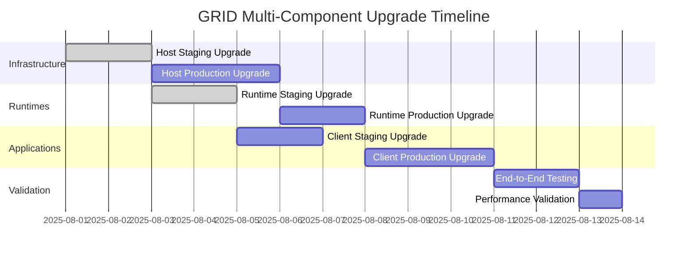
```mermaid
gantt
    title GRID Multi-Component Upgrade Timeline
    dateFormat  YYYY-MM-DD
    section Infrastructure
    Host Staging Upgrade    :done, host-staging, 2025-08-01, 2025-08-03
    Host Production Upgrade :host-prod, after host-staging, 3d
    section Runtimes
    Runtime Staging Upgrade :done, rt-staging, after host-staging, 2025-08-05
    Runtime Production Upgrade :rt-prod, after host-prod, 2d
    section Applications
    Client Staging Upgrade  :client-staging, after rt-staging, 2d
    Client Production Upgrade :client-prod, after rt-prod, 3d
    section Validation
    End-to-End Testing     :e2e-test, after client-prod, 2d
    Performance Validation :perf-test, after e2e-test, 1d
```

**Coordinated Upgrade Procedure:**
1. **Phase 1: Infrastructure Foundation (Hosts)**
   ```bash
   # Upgrade Hosts first to ensure backward compatibility
   for host in $(grid-cluster list-hosts); do
     grid-host upgrade --id $host --version 1.1.0 --wait-for-ready
     grid-test host-health --id $host --comprehensive
   done
   ```

2. **Phase 2: Runtime Layer**
   ```bash
   # Upgrade Runtimes after Host stability confirmed
   for runtime in $(grid-cluster list-runtimes); do
     grid-runtime upgrade --id $runtime --version 1.1.0 --graceful
     grid-test runtime-integration --id $runtime --with-hosts
   done
   ```

3. **Phase 3: Client Applications**
   ```bash
   # Upgrade client applications last
   for app in $(app-cluster list-grid-clients); do
     app-upgrade --id $app --grid-version 1.1.0 --feature-negotiation
     app-test grid-integration --id $app --comprehensive
   done
   ```

4. **Phase 4: System-Wide Validation**
   ```bash
   # End-to-end system validation
   grid-test system-wide --all-components --feature-matrix
   grid-monitor system-health --duration 24h --alert-on-issues
   ```

**Coordination Checklist:**
- [ ] **Upgrade sequence planned and documented**
- [ ] **Component dependencies mapped and validated**
- [ ] **Cross-component compatibility matrix verified**
- [ ] **Rollback procedures coordinated across all components**
- [ ] **Monitoring enhanced for multi-component visibility**
- [ ] **Communication plan for coordinated maintenance windows**
- [ ] **Emergency procedures for partial upgrade failures**
- [ ] **Performance baselines captured for all components**
- [ ] **Security validation across upgraded components**
- [ ] **End-to-end testing scenarios prepared**
- [ ] **Stakeholder communication and approval obtained**
- [ ] **Support team coordination for upgrade period**

### 9.3. Version Negotiation Patterns

#### 9.3.1. Capability-Based Negotiation

GRID implements sophisticated capability negotiation to optimize feature utilization:

```mermaid
sequenceDiagram
    participant RT as Runtime
    participant H as Host

    Note over RT,H: Enhanced Capability Negotiation
    RT->>H: AnnounceRuntime(capabilities, compliance_level, optional_features)
    H->>H: Analyze Runtime capabilities
    H->>H: Determine optimal feature set
    H-->>RT: AnnounceRuntimeResponse(negotiated_level, enabled_features, feature_config)
    
    Note over RT,H: Feature Validation
    RT->>H: ValidateFeatures(enabled_features)
    H-->>RT: ValidationResponse(confirmed_features, disabled_features, warnings)
    
    Note over RT,H: Ongoing Capability Monitoring
    RT->>H: CapabilityUpdate(new_features, deprecated_features)
    H-->>RT: CapabilityUpdateResponse(accepted_changes)
```

#### 9.3.2. Dynamic Feature Negotiation

For long-running connections, GRID supports dynamic capability updates:

```idl
// Sent by Runtime to update its capabilities during runtime
message CapabilityUpdate {
  string runtime_id = 1;
  repeated string new_features = 2;        // Newly available features
  repeated string deprecated_features = 3; // Features being phased out
  string reason = 4;                       // Reason for capability change
  uint64 effective_timestamp = 5;         // When changes take effect
}

// Host response to capability updates
message CapabilityUpdateResponse {
  enum Status {
    ACCEPTED = 0;      // All changes accepted
    PARTIAL = 1;       // Some changes accepted
    REJECTED = 2;      // Changes rejected
  }
  Status status = 1;
  repeated string accepted_features = 2;
  repeated string rejected_features = 3;
  repeated EnhancedError errors = 4;
  uint64 next_review_timestamp = 5;  // When to retry rejected features
}
```

#### 9.3.3. Version Compatibility Negotiation

When different protocol versions interact, GRID uses structured negotiation:

```idl
// Extended AnnounceRuntime with version negotiation
message AnnounceRuntime {
  // ... existing fields ...
  
  // Version negotiation fields
  string protocol_version = 10;           // Preferred protocol version
  repeated string supported_versions = 11; // All supported versions
  map<string, string> version_preferences = 12; // Version-specific preferences
}

// Enhanced response with negotiated version
message AnnounceRuntimeResponse {
  // ... existing fields ...
  
  // Negotiated version information
  string negotiated_version = 10;         // Agreed-upon protocol version
  repeated string available_features = 11; // Features available in negotiated version
  map<string, string> version_config = 12; // Version-specific configuration
}
```

### 9.4. Rollback Procedures and Compatibility Testing

#### 9.4.1. Rollback Strategy

GRID implementations MUST support safe rollback procedures to handle upgrade failures:

**Automated Rollback Triggers:**
- Connection failure rate exceeds threshold (default: 10% over 5 minutes)
- Tool execution error rate increases significantly (default: 5x baseline)
- Memory or CPU usage exceeds safety limits
- Critical feature negotiation failures

**Rollback Execution:**
```bash
# Automated rollback procedure
grid-host rollback --to-version 1.0.0 --reason "compatibility-failure"

# Verify rollback success
grid-host status --verify-rollback

# Restore backed-up configuration
grid-host restore-config --backup-timestamp 2025-08-09T10:00:00Z

# Validate system health post-rollback
grid-test health --comprehensive
```

#### 9.4.2. Compatibility Testing Framework

**Pre-Deployment Testing:**
```yaml
# compatibility-test-suite.yaml
test_scenarios:
  - name: "Level 1 Host with Level 2 Runtime"
    host_version: "1.0.0"
    runtime_version: "1.1.0"
    expected_features: ["basic-execution", "session-management"]
    disabled_features: ["streaming", "enhanced-errors"]
    
  - name: "Level 2 Host with Level 1 Runtime"
    host_version: "1.1.0"
    runtime_version: "1.0.0"
    expected_features: ["basic-execution", "session-management"]
    graceful_degradation: true
    
  - name: "Mixed Version Environment"
    host_version: "1.1.0"
    runtime_versions: ["1.0.0", "1.0.5", "1.1.0"]
    test_scenarios: ["feature-negotiation", "load-balancing", "error-handling"]
```

**Continuous Compatibility Monitoring:**
```bash
# Ongoing compatibility monitoring
grid-monitor compatibility \
  --alert-on-degradation \
  --metrics-endpoint http://monitoring.example.com/metrics \
  --test-interval 300s

# Generate compatibility reports
grid-report compatibility \
  --period 24h \
  --format json \
  --output compatibility-report.json
```

#### 9.4.3. Rollback Decision Matrix

| Failure Type | Automatic Rollback | Manual Intervention | Monitoring Required |
|--------------|-------------------|-------------------|-------------------|
| Connection failures > 10% | Yes | No | 5 minutes |
| Tool execution errors > 5x baseline | Yes | No | 10 minutes |
| Memory usage > 90% | Yes | No | Immediate |
| Feature negotiation failures | No | Yes | Manual review |
| Performance degradation > 50% | No | Yes | 30 minutes |
| Security policy violations | Yes | No | Immediate |

### 9.5. Migration Best Practices

#### 9.5.1. Planning and Preparation

**Migration Checklist:**
- [ ] Complete compatibility assessment between current and target versions
- [ ] Identify all affected components (Hosts, Runtimes, clients)
- [ ] Plan migration sequence (Hosts first, then Runtimes, then clients)
- [ ] Prepare rollback procedures and test them in staging
- [ ] Set up enhanced monitoring for migration period
- [ ] Coordinate with stakeholders on maintenance windows
- [ ] Document expected feature changes and impacts

**Risk Mitigation:**
- Always test migrations in staging environments first
- Use blue-green deployment strategies for critical systems
- Implement circuit breakers and automatic rollback triggers
- Maintain detailed logs throughout the migration process
- Have dedicated support team available during migration windows

#### 9.5.2. Post-Migration Validation

**Validation Checklist:**
- [ ] All Runtimes successfully reconnected to upgraded Hosts
- [ ] Tool execution success rates match pre-migration baselines
- [ ] New features are working as expected
- [ ] Performance metrics are within acceptable ranges
- [ ] Error rates have not increased significantly
- [ ] Security policies are still being enforced correctly
- [ ] Monitoring and alerting systems are functioning properly

**Long-term Monitoring:**
- Track compatibility metrics for at least 30 days post-migration
- Monitor for any delayed compatibility issues
- Collect feedback from development teams using the upgraded system
- Document lessons learned for future migrations
- Update migration procedures based on experience

### 9.6. Advanced Migration Scenarios

#### 9.6.1. Multi-Environment Migration Strategy

For organizations with complex deployment topologies, GRID supports coordinated multi-environment migrations:

**Environment Progression:**
1. **Development Environment:** Test new features and validate tool compatibility
2. **Staging Environment:** Full integration testing with production-like data and load
3. **Canary Production:** Limited production deployment to validate real-world performance
4. **Full Production:** Complete rollout with monitoring and rollback capabilities

**Cross-Environment Compatibility:**
```yaml
# migration-strategy.yaml
environments:
  development:
    grid_version: "1.1.0"
    features: ["all-level-2", "experimental"]
    rollback_policy: "immediate"
    
  staging:
    grid_version: "1.1.0"
    features: ["level-2-stable"]
    rollback_policy: "automatic-on-failure"
    
  production:
    grid_version: "1.0.0" # Upgraded after staging validation
    features: ["level-1-only"]
    rollback_policy: "manual-approval-required"
    
migration_sequence:
  - phase: "development"
    duration: "1-2 weeks"
    success_criteria: ["all-tests-pass", "performance-baseline"]
    
  - phase: "staging"
    duration: "1 week"
    success_criteria: ["integration-tests-pass", "load-tests-pass"]
    
  - phase: "canary-production"
    duration: "3-5 days"
    traffic_percentage: 10
    success_criteria: ["error-rate-stable", "performance-acceptable"]
    
  - phase: "full-production"
    duration: "1-2 weeks"
    rollout_strategy: "gradual"
    success_criteria: ["all-metrics-stable"]
```

#### 9.6.2. Zero-Downtime Migration Patterns

**Blue-Green Deployment for Hosts:**
```bash
# Deploy new Host version alongside existing
grid-host deploy --version 1.1.0 --deployment-mode blue-green

# Gradually shift traffic to new version
grid-loadbalancer shift-traffic --from blue --to green --percentage 25
grid-monitor --alert-on-errors --duration 10m

# Complete migration if successful
grid-loadbalancer shift-traffic --from blue --to green --percentage 100
grid-host decommission --version 1.0.0 --wait-for-drain
```

**Rolling Runtime Updates:**
```bash
# Update Runtimes one at a time
for runtime in $(grid-host list-runtimes); do
  grid-runtime update --id $runtime --version 1.1.0 --wait-for-health
  grid-test runtime-health --id $runtime --timeout 60s
  if [ $? -ne 0 ]; then
    grid-runtime rollback --id $runtime
    exit 1
  fi
done
```

#### 9.6.3. Migration Validation and Testing

**Comprehensive Testing Framework:**
```python
# migration-test-suite.py
import altar.grid.testing as grid_test

class MigrationTestSuite:
    def test_backward_compatibility(self):
        """Ensure Level 1 clients work with Level 2 Hosts"""
        level1_client = grid_test.create_client(version="1.0.0")
        level2_host = grid_test.create_host(version="1.1.0")
        
        # Test basic tool execution
        result = level1_client.call_tool("calculate_sum", {"a": 5, "b": 3})
        assert result.success
        assert result.value == 8
        
    def test_feature_negotiation(self):
        """Verify proper feature negotiation between versions"""
        runtime = grid_test.create_runtime(
            version="1.1.0",
            features=["streaming", "local-dispatch"]
        )
        host = grid_test.create_host(version="1.0.0")
        
        connection = runtime.connect(host)
        assert "streaming" not in connection.enabled_features
        assert "local-dispatch" not in connection.enabled_features
        
    def test_rollback_scenario(self):
        """Test rollback procedures under failure conditions"""
        host = grid_test.create_host(version="1.1.0")
        
        # Simulate failure condition
        grid_test.inject_failure(host, failure_type="connection_storm")
        
        # Verify automatic rollback triggers
        rollback_result = host.check_rollback_triggers()
        assert rollback_result.should_rollback
        assert rollback_result.reason == "connection_failure_threshold_exceeded"
```

### 9.7. Protocol Evolution and Future Compatibility

#### 9.7.1. Forward Compatibility Design

GRID is designed with forward compatibility in mind to support future protocol evolution:

**Extensible Message Structure:**
- All messages include reserved fields for future extensions
- Optional fields use default values that maintain backward compatibility
- New message types are introduced as optional Level 2+ features
- Deprecated fields are marked but never removed

**Protocol Extension Points:**
```idl
// Future-proofed message structure
message FutureProofMessage {
  // Core fields (never change)
  string id = 1;
  string type = 2;
  
  // Extensible payload
  google.protobuf.Any payload = 3;
  
  // Reserved for future use
  reserved 10 to 20;
  reserved "future_field_1", "future_field_2";
  
  // Extension fields (Level 2+)
  map<string, string> extensions = 100;
}
```

#### 9.7.2. Deprecation and Sunset Policies

**Feature Deprecation Process:**
1. **Announcement:** Feature deprecation announced with 12-month notice
2. **Warning Period:** Deprecated features generate warnings but continue to work
3. **Compatibility Mode:** Deprecated features supported in compatibility mode
4. **Sunset:** Features removed only in major version updates with migration path

**Deprecation Timeline Example:**
```yaml
# deprecation-schedule.yaml
deprecated_features:
  - name: "legacy_error_format"
    deprecated_in: "1.1.0"
    warning_starts: "1.2.0"
    compatibility_until: "2.0.0"
    replacement: "enhanced_error_format"
    migration_guide: "docs/migration/error-format-upgrade.md"
    
  - name: "synchronous_only_mode"
    deprecated_in: "1.2.0"
    warning_starts: "1.3.0"
    compatibility_until: "2.0.0"
    replacement: "async_capable_mode"
    migration_guide: "docs/migration/async-upgrade.md"
```

#### 9.7.3. Long-term Compatibility Guarantees

**Commitment to Stability:**
- Level 1 compatibility maintained indefinitely across all future versions
- Core protocol behaviors never change in backward-incompatible ways
- Security updates provided for all supported versions
- Migration paths provided for all breaking changes

**Version Support Matrix:**
| Version | Support Level | End of Life | Security Updates |
|---------|---------------|-------------|------------------|
| 1.0.x | Full Support | TBD | Yes |
| 1.1.x | Full Support | TBD | Yes |
| 1.2.x | Planned | TBD | Yes |
| 2.0.x | Future | TBD | Yes |

This comprehensive migration and version negotiation framework ensures that GRID can evolve safely while maintaining the reliability and compatibility that enterprise deployments require. The framework provides clear guidance for all migration scenarios, from simple single-component upgrades to complex multi-environment rollouts, while maintaining the backward compatibility guarantees that make GRID suitable for mission-critical enterprise deployments.
