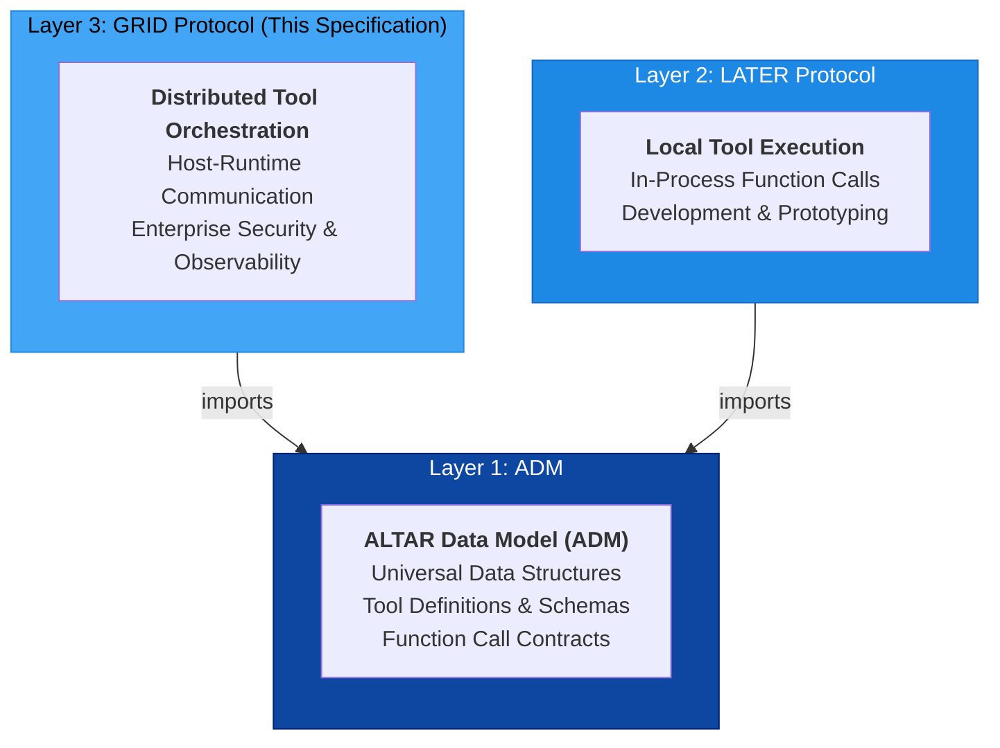
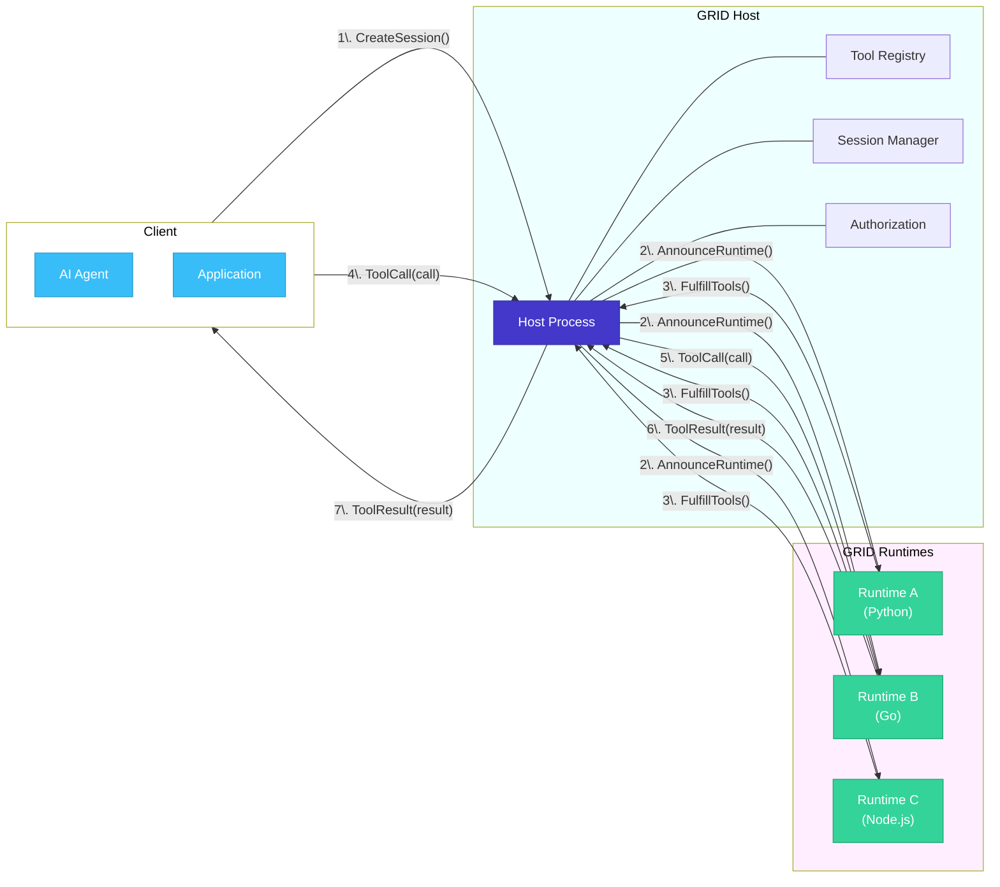
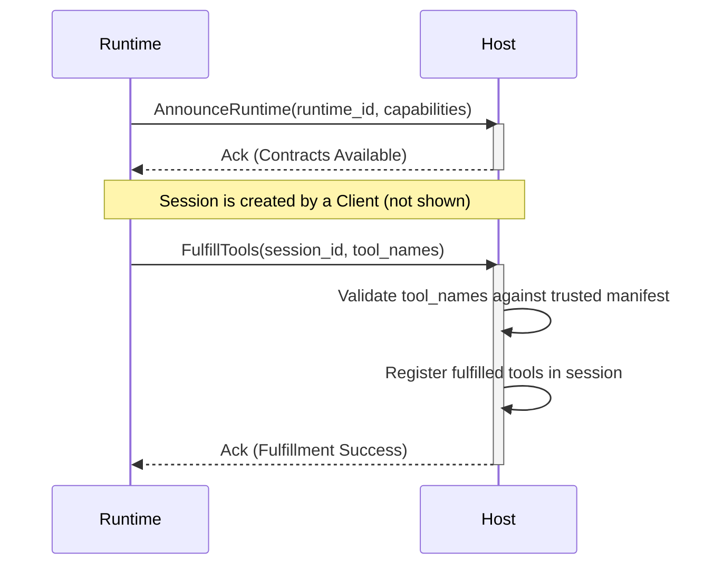
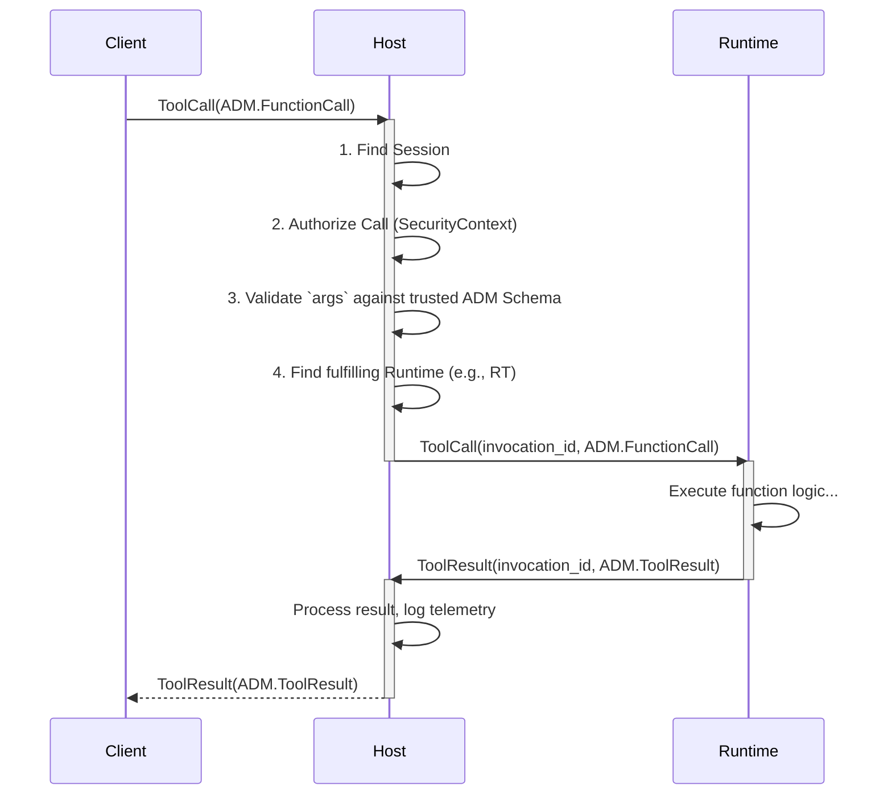
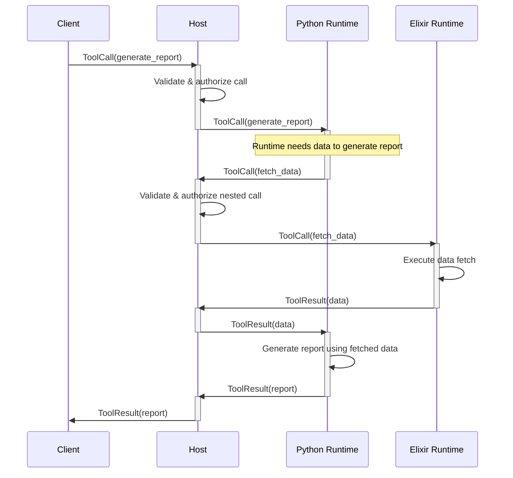

# GRID Protocol Specification v1.0

**Version:** 1.0.0
**Status:** Final
**Date:** August 5, 2025

## 1. Introduction

### 1.1. Vision & Guiding Principles

The **GRID (Global Runtime & Interop Director) Protocol** is the secure, scalable execution backend for the ALTAR ecosystem. It provides the **production-grade fulfillment layer** for tools developed and tested with the LATER protocol, solving the critical security, governance, and operational challenges that are not addressed by open-source development frameworks.

GRID is built on two core principles:

1.  **Managed, Secure Fulfillment:** GRID's primary value is providing a secure, managed environment for tool execution. Its Host-centric security model (see Section 3) is not just a feature but the foundation of its enterprise-readiness.
2.  **Language-Agnostic Scalability:** GRID is designed from the ground up to orchestrate tool execution across a fleet of polyglot Runtimes. This allows specialized tools written in Python, Go, Node.js, etc., to be scaled independently of the host application, optimizing performance and resource allocation.

### 1.2. Relationship to ADM & LATER

GRID is the third layer of the three-layer ALTAR architecture, building upon the foundational contracts established by the ALTAR Data Model (ADM) and complementing the local execution model of the LATER protocol.



-   **Imports the ADM:** GRID is a consumer of the **ALTAR Data Model (ADM)**. All data payloads within GRID messages, such as function calls and results, **must** conform to the structures defined in the ADM specification (`FunctionCall`, `ToolResult`, etc.). GRID defines the messages that *transport* these ADM structures between processes.
-   **Distributed Counterpart to LATER:** Where the LATER protocol specifies in-process tool execution for development, GRID specifies out-of-process, distributed tool execution for scalable, production-ready systems.

## 2. Architecture: The Host-Runtime Model

The GRID protocol is based on a Host-Runtime architecture, where a central Host orchestrates communication between clients and one or more Runtimes.



-   **Client:** Any application or agent that needs to invoke tools. The Client communicates only with the Host.
-   **Host:** The central orchestration engine. It manages sessions, maintains a registry of trusted tool contracts, enforces security, and routes invocations to the appropriate Runtime.
-   **Runtime:** An external process that connects to the Host to provide tool execution capabilities. A Runtime does not define tools; it *fulfills* tool contracts that the Host makes available.

## 3. Security Model: Host-Managed Contracts

GRID's most important feature is its **Host-centric security model**, which is designed to prevent "Trojan Horse" vulnerabilities common in other tool-use systems. In many systems, a tool provider (a Runtime) declares its own capabilities. A malicious or compromised Runtime could misrepresent its schema, tricking a client into sending sensitive data.

GRID solves this by inverting the trust model:

1.  **The Host is the Source of Truth:** The Host maintains a manifest of trusted **Tool Contracts**. These contracts are the *only* tool definitions the system recognizes.
2.  **Runtimes Fulfill, They Don't Define:** A Runtime cannot register a new tool. Instead, it can only announce that it is capable of *fulfilling* one or more of the contracts already defined by the Host.
3.  **Host-Side Validation:** When a Client sends a `ToolCall`, the Host validates the arguments against its own trusted contract *before* forwarding the call to the Runtime. The Runtime is never the authority on the contract schema.

> **GRID Security: From Developer Responsibility to Platform Guarantee**
>
> **Typical Open-Source Model:** Security is the developer's responsibility. The framework provides the primitives, but the developer must correctly implement input validation, access control, and secure deployment practices. A mistake can easily lead to a vulnerability.
>
> **The GRID Model:** Security is a platform guarantee. By centralizing contract authority and validation in the Host, GRID provides built-in protection against a class of vulnerabilities. The platform, not the developer, is responsible for ensuring that only trusted, validated calls are dispatched for execution. This significantly reduces the security burden on the application developer and provides a more robust, auditable system by design.

This model ensures that all tool interactions are governed by centrally-vetted, secure contracts, providing a high degree of security, auditability, and control, which is essential for enterprise environments.

> **Note on the `ToolContract` Definition**
>
> To maintain a clean separation of concerns, the definition of a `ToolContract` is layered across the ALTAR protocol suite:
>
> 1.  **Structural Core (ADM):** The foundational **ALTAR Data Model (ADM)** defines the `FunctionDeclaration`, which is the universal, language-agnostic structural core of any tool's contract.
> 2.  **Conceptual Formalization (GRID):** The **GRID Protocol** (this document) formalizes the *concept* of a `ToolContract` as the trusted, Host-managed agreement that contains one or more `FunctionDeclaration`s. This is the level at which security and fulfillment policies are applied.
> 3.  **Enterprise Enrichment (AESP):** The **AESP (ALTAR Enterprise Security Profile)** further enriches this concept into a specific `EnterpriseToolContract` message, adding detailed fields for governance, compliance, and risk management.
>
> This layered approach allows the core tool definition to remain simple and universal while being progressively enhanced with the security and governance features required for more advanced, production-grade deployments.

## 4. Protocol Message Schemas (Language-Neutral IDL)

These schemas define the messages exchanged between the Host and Runtimes. All payloads referencing tool structures (e.g., `FunctionCall`, `ToolResult`) are defined by the **ALTAR Data Model (ADM) Specification**.

### 4.1. Handshake & Fulfillment

Messages used for establishing a connection and declaring capabilities.

```idl
// Sent by a Runtime to the Host to announce its presence.
message AnnounceRuntime {
  string runtime_id = 1;           // Unique identifier for this runtime instance.
  string language = 2;             // Runtime language (e.g., "python", "elixir").
  string version = 3;              // Version of the GRID bridge implementation.
  repeated string capabilities = 4; // Supported GRID features (e.g., "streaming").
  map<string, string> metadata = 5; // Additional runtime-specific information.
}

// Sent by a Runtime to the Host to declare which trusted tool
// contracts it can execute for a given session.
message FulfillTools {
  string session_id = 1;           // The session for which tools are being fulfilled.
  repeated string tool_names = 2;  // Names of the Host-defined tool contracts to fulfill.
  string runtime_id = 3;           // The ID of the runtime providing the fulfillment.
}
```

### 4.2. Invocation & Results

Messages for executing a tool function and returning its result.

```idl
// Sent by the Host to a Runtime to request execution of a function.
// This message wraps a data structure from the ADM specification.
message ToolCall {
  string invocation_id = 1;        // Unique ID for this specific invocation.
  string correlation_id = 2;       // ID for tracing the entire workflow.
  ADM.FunctionCall call = 3;       // The function call payload, conforming to the ADM.
}

// Sent by a Runtime to the Host with the result of a function execution.
// This message wraps a data structure from the ADM specification.
message ToolResult {
  string invocation_id = 1;        // Correlates with the originating ToolCall.
  string correlation_id = 2;       // Propagated for end-to-end tracing.
  ADM.ToolResult result = 3;       // The function result payload, conforming to the ADM.
}

// (Level 2+) Sent by a Runtime to the Host for streaming results.
message StreamChunk {
  string invocation_id = 1;        // Correlates with the originating ToolCall.
  uint64 chunk_id = 2;             // Sequential identifier for ordering chunks.
  bytes payload = 3;               // Partial data for this chunk.
  bool is_final = 4;               // Flag indicating the end of the stream.
  Error error = 5;                 // Optional field for reporting in-band errors.
}
```

### 4.3. Session Management

Messages for managing the lifecycle of an interaction context.

```idl
// Sent by a Client to the Host to initialize a new interaction context.
message CreateSession {
  string suggested_session_id = 1;   // A client-suggested ID (Host may override).
  map<string, string> metadata = 2;   // Initial metadata for the session.
  uint64 ttl_seconds = 3;            // Requested time-to-live for the session.
  SecurityContext security_context = 4; // (Level 2+) Security context for the session.
}

// Sent by a Client to the Host to terminate an existing session.
message DestroySession {
  string session_id = 1;             // The ID of the session to terminate.
  bool force = 2;                    // If true, terminate even if invocations are active.
}
```

### 4.4. Supporting Types

Common data structures used across multiple messages.

```idl
// A structured error object.
message Error {
  string message = 1;              // A human-readable error message.
  string type = 2;                 // A standardized error code (e.g., "TOOL_NOT_FOUND").
}

// (Level 2+) Defines the security identity for a session.
message SecurityContext {
  string principal_id = 1;         // The end-user or service on whose behalf the session is acting.
  string tenant_id = 2;            // The organization or tenant this session belongs to.
  map<string, string> claims = 3;  // Opaque security claims from an auth system.
}
```

## 5. Interaction Flows

### 5.1. Runtime Connection and Fulfillment

This flow describes how a new Runtime connects to the Host and makes its tools available for a session.



### 5.2. Synchronous Tool Invocation

This flow shows a standard, non-streaming tool call initiated by a Client.



## 6. The Business Case for GRID

The GRID protocol and its corresponding managed Host implementations are designed to answer a critical question for engineering leaders: *"Why not just use an open-source framework like LangChain and deploy it on cloud services ourselves?"*

While a DIY approach offers maximum flexibility, it also carries significant hidden costs and risks. GRID provides compelling business value by addressing these challenges directly.

-   **Reduced DevOps Overhead:** Building a secure, scalable, polyglot, and observable distributed system for AI tools is a complex engineering task that can take a dedicated team months. A managed GRID Host provides this infrastructure out-of-the-box, allowing teams to focus on building business logic, not on managing queues, load balancers, and container orchestration for他们的 AI tools.

-   **Built-in Security & Compliance (AESP):** The Host-centric security model is a core feature, not an add-on. By adopting GRID, organizations get a pre-built control plane for Role-Based Access Control (RBAC), immutable audit logging, and centralized policy enforcement, as defined by the **Altar Enterprise Security Profile (AESP)**. This dramatically accelerates the path to deploying compliant, secure AI agents in regulated environments.

-   **Language-Agnostic Scalability:** A key architectural advantage of GRID is the decoupling of the Host from the Runtimes. This allows an organization to scale its Python-based data science tools independently from its Go-based backend integration tools. This granular control over scaling optimizes resource utilization and reduces operational costs compared to monolithic deployment strategies.

-   **Faster Time-to-Market:** By leveraging the seamless "promotion path" from LATER, developers can move from a local prototype to a production-scale deployment with a simple configuration change. This agility allows businesses to iterate faster and deliver value from their AI investments sooner.

## 7. Advanced Interaction Patterns (Cookbook)

This section provides concrete implementation guidance for complex real-world scenarios that leverage GRID's core primitives. These patterns demonstrate how to solve sophisticated distributed tool orchestration challenges while maintaining the security and observability advantages of the Host-centric model.

The patterns documented here are designed to help implementers understand how to compose GRID's foundational capabilities—Host-managed contracts, secure message routing, and polyglot Runtime orchestration—into solutions for enterprise-grade use cases that go beyond simple request-response tool invocations.

### 7.1. Bidirectional Tool Calls (Runtime-as-Client)

In sophisticated tool orchestration scenarios, a Runtime executing one tool may need to invoke another tool to complete its work. For example, a Python Runtime executing a `generate_report` tool might need to call a `fetch_data` tool fulfilled by an Elixir Runtime to gather the necessary information.

The **Runtime-as-Client** pattern enables this capability while preserving GRID's Host-centric security model. Rather than allowing direct Runtime-to-Runtime communication (which would bypass security controls), all tool invocations flow through the Host, ensuring complete observability, authorization, and audit logging.

#### Host-Mediated Flow

The following sequence diagram illustrates how bidirectional tool calls work within GRID's security model:



#### Security and Observability Advantages

The Host-mediated approach provides several critical advantages over direct Runtime-to-Runtime communication:

**Complete Security Control:** Every tool invocation, regardless of its origin (Client or Runtime), passes through the Host's authorization and validation layer. This ensures that even nested tool calls are subject to the same security policies, preventing privilege escalation or unauthorized access.

**End-to-End Observability:** All tool interactions are visible to the Host, enabling comprehensive audit logging, performance monitoring, and debugging capabilities. Direct Runtime-to-Runtime calls would create "dark" interactions invisible to the central control plane.

**Consistent Contract Enforcement:** The Host validates all tool calls against its trusted contract manifest, ensuring that even Runtime-initiated calls conform to the expected schemas and security constraints. This prevents malicious or compromised Runtimes from bypassing validation by calling tools directly.

**Simplified Network Architecture:** By maintaining the hub-and-spoke communication model, GRID avoids the complexity of mesh networking between Runtimes, reducing attack surface and simplifying firewall rules and network security policies.

This pattern enables sophisticated tool composition while maintaining the enterprise-grade security and governance guarantees that are fundamental to GRID's value proposition.

### 7.2. Implementing Stateful Services as Tools

Traditional stateful services—such as session managers, configuration stores, or workflow engines—can be seamlessly integrated into the ALTAR ecosystem by exposing their functionality through formal tool contracts. This pattern transforms stateful logic into securable, auditable runtimes that fulfill Host-managed contracts, bringing enterprise-grade governance to services that would otherwise operate outside the ALTAR security model.

By implementing stateful services as tools, organizations gain centralized control over state management operations, comprehensive audit trails of all state modifications, and the ability to apply consistent security policies across both stateless and stateful components of their AI agent infrastructure.

#### Conceptual Implementation Approach

Stateful services should expose their core operations through well-defined ADM FunctionDeclaration contracts. The service's internal state management remains encapsulated within the Runtime, while the ALTAR ecosystem interacts with the service exclusively through validated, Host-authorized tool calls.

Consider a simple variable storage service that maintains key-value pairs across multiple agent sessions. Rather than providing direct database access or REST endpoints, this service would expose its functionality through formal tool contracts:

**Variable Retrieval Tool Contract:**

```json
{
  "name": "get_variable",
  "description": "Retrieves the current value of a named variable from the stateful storage service",
  "parameters": {
    "type": "object",
    "properties": {
      "variable_name": {
        "type": "string",
        "description": "The unique identifier for the variable to retrieve",
        "pattern": "^[a-zA-Z][a-zA-Z0-9_]*$"
      },
      "scope": {
        "type": "string",
        "enum": ["session", "user", "global"],
        "description": "The scope within which to look for the variable",
        "default": "session"
      },
      "default_value": {
        "type": "string",
        "description": "Optional default value to return if the variable does not exist"
      }
    },
    "required": ["variable_name"]
  }
}
```

**Variable Storage Tool Contract:**

```json
{
  "name": "set_variable",
  "description": "Stores or updates the value of a named variable in the stateful storage service",
  "parameters": {
    "type": "object",
    "properties": {
      "variable_name": {
        "type": "string",
        "description": "The unique identifier for the variable to store or update",
        "pattern": "^[a-zA-Z][a-zA-Z0-9_]*$"
      },
      "value": {
        "type": "string",
        "description": "The value to store for this variable"
      },
      "scope": {
        "type": "string",
        "enum": ["session", "user", "global"],
        "description": "The scope within which to store the variable",
        "default": "session"
      },
      "ttl_seconds": {
        "type": "integer",
        "description": "Optional time-to-live in seconds after which the variable should expire",
        "minimum": 1
      }
    },
    "required": ["variable_name", "value"]
  }
}
```

#### Security and Governance Benefits

When stateful services are implemented as ALTAR tools, they automatically inherit the full security and governance capabilities of the GRID protocol:

**Centralized Authorization:** All state access operations flow through the Host's authorization layer, enabling fine-grained access control policies. For example, an organization can enforce that only specific agent roles can modify global variables, while session-scoped variables remain accessible only within their originating session context.

**Complete Audit Trail:** Every state modification becomes a logged, traceable tool invocation with full context about the requesting agent, session, and security principal. This provides unprecedented visibility into how AI agents interact with persistent state, supporting compliance requirements and debugging complex multi-agent workflows.

**Contract-Based Validation:** The Host validates all state operations against trusted schemas before execution, preventing malformed requests from corrupting the service's internal state. This validation layer acts as a robust API gateway specifically designed for AI agent interactions.

**Runtime Isolation:** The stateful service operates as an independent Runtime, allowing it to be scaled, monitored, and maintained separately from other system components. This isolation prevents state management concerns from affecting the performance or reliability of other tools in the ecosystem.

By adopting this pattern, organizations can maintain the benefits of stateful services—persistence, consistency, and complex business logic—while ensuring these services operate within ALTAR's enterprise-grade security and governance framework. The result is a unified approach to both stateless and stateful tool management that scales from simple variable storage to sophisticated workflow orchestration systems.

## 8. Compliance Levels

To facilitate interoperability and gradual adoption, GRID defines several compliance levels.

-   **Level 1 (Core):** A minimal, compliant implementation.
    -   Must implement `AnnounceRuntime`, `FulfillTools`.
    -   Must support the synchronous `ToolCall` -> `ToolResult` flow.
    -   Must implement `CreateSession` and `DestroySession`.
    -   Must use and validate ADM structures for all payloads.

-   **Level 2 (Streaming):** A more feature-rich implementation suitable for production.
    -   Includes all Level 1 features.
    -   Must implement the `StreamChunk` message for streaming results.
    -   Must support the `SecurityContext` for multi-tenancy and advanced auth.

-   **Level 3 (Enterprise):** A full-featured, high-security implementation suitable for regulated environments. Compliance for this level is defined by the separate **AESP (ALTAR Enterprise Security Profile)**, which is structured into incremental tiers (Foundation, Advanced, and Complete) to facilitate adoption. AESP mandates a comprehensive control plane architecture for identity, policy, audit, and governance.
    -   See: `aesp.md` for the complete AESP specification and its compliance tiers.
