# GRID Protocol Specification v1.0

**Version:** 1.0.0
**Status:** Final
**Date:** August 5, 2025

## 1. Introduction

### 1.1. Vision & Guiding Principles

The **GRID (Global Runtime & Interop Director) Protocol** is the secure, scalable execution backend for the ALTAR ecosystem. It provides the **production-grade fulfillment layer** for tools developed and tested with the LATER protocol, solving the critical security, governance, and operational challenges that are not addressed by open-source development frameworks.

GRID is built on two core principles:

1.  **Managed, Secure Fulfillment:** GRID's primary value is providing a secure, managed environment for tool execution. Its Host-centric security model (see Section 3) is not just a feature but the foundation of its enterprise-readiness.
2.  **Language-Agnostic Scalability:** GRID is designed from the ground up to orchestrate tool execution across a fleet of polyglot Runtimes. This allows specialized tools written in Python, Go, Node.js, etc., to be scaled independently of the host application, optimizing performance and resource allocation.

### 1.2. Relationship to ADM & LATER

GRID is the third layer of the three-layer ALTAR architecture, building upon the foundational contracts established by the ALTAR Data Model (ADM) and complementing the local execution model of the LATER protocol.

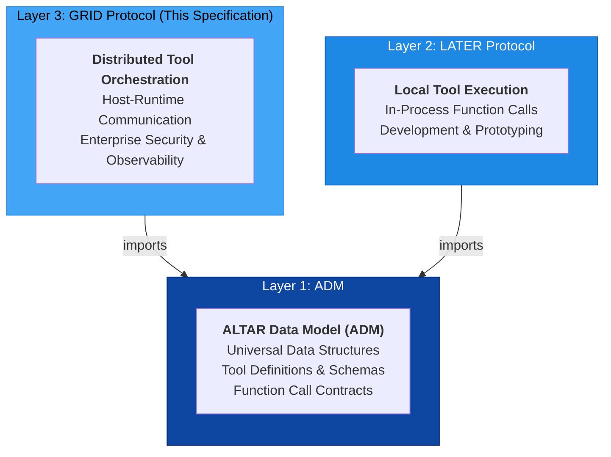
```mermaid
graph TB
    subgraph L3["Layer&nbsp;3:&nbsp;GRID&nbsp;Protocol&nbsp;(This&nbsp;Specification)"]
        direction TB
        A["<strong>Distributed Tool Orchestration</strong><br/>Host-Runtime Communication<br/>Enterprise Security & Observability"]
    end

    subgraph L2["Layer&nbsp;2:&nbsp;LATER&nbsp;Protocol"]
        direction TB
        B["<strong>Local Tool Execution</strong><br/>In-Process Function Calls<br/>Development & Prototyping"]
    end

    subgraph L1["Layer&nbsp;1:&nbsp;ADM"]
        direction TB
        C["<strong>ALTAR Data Model (ADM)</strong><br/>Universal Data Structures<br/>Tool Definitions & Schemas<br/>Function Call Contracts"]
    end

    L3 -- imports --> L1
    L2 -- imports --> L1

    style L3 fill:#42a5f5,stroke:#1e88e5,color:#000000
    style L2 fill:#1e88e5,stroke:#1565c0,color:#ffffff
    style L1 fill:#0d47a1,stroke:#002171,color:#ffffff
```

-   **Imports the ADM:** GRID is a consumer of the **ALTAR Data Model (ADM)**. All data payloads within GRID messages, such as function calls and results, **must** conform to the structures defined in the ADM specification (`FunctionCall`, `ToolResult`, etc.). GRID defines the messages that *transport* these ADM structures between processes.
-   **Distributed Counterpart to LATER:** Where the LATER protocol specifies in-process tool execution for development, GRID specifies out-of-process, distributed tool execution for scalable, production-ready systems.

## 2. Architecture: The Host-Runtime Model

The GRID protocol is based on a Host-Runtime architecture, where a central Host orchestrates communication between clients and one or more Runtimes.

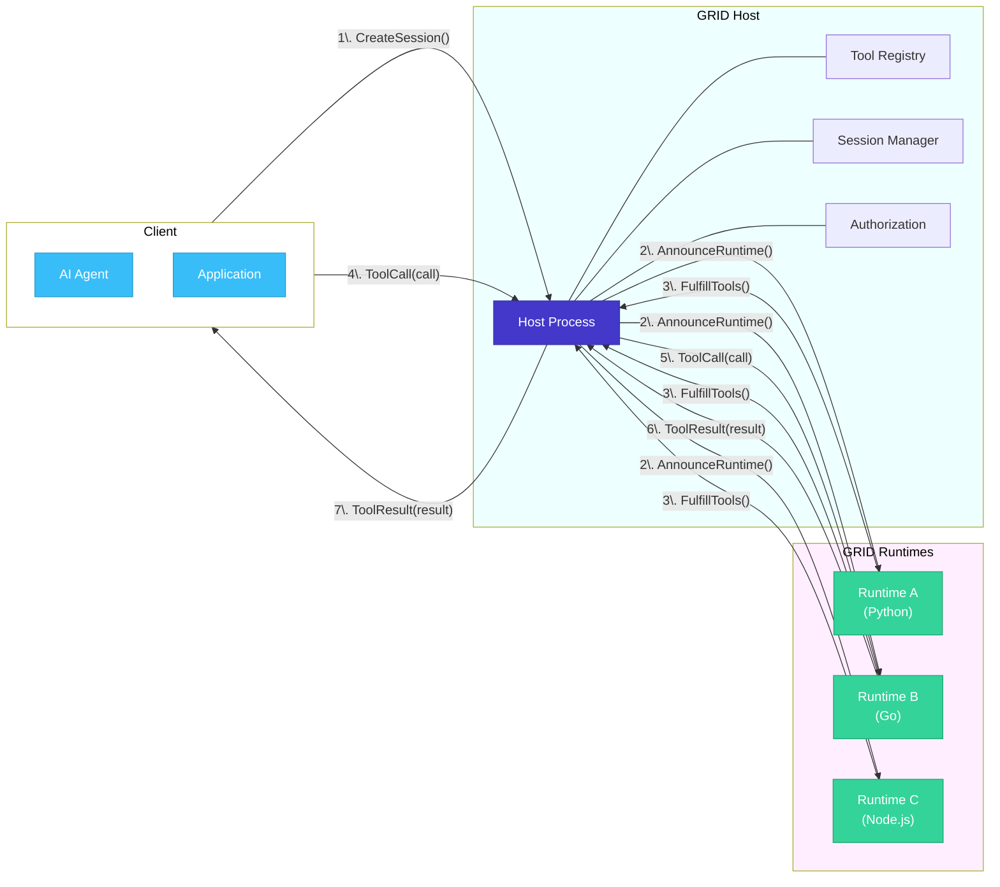
```mermaid
graph LR
    subgraph Client["Client"]
        direction TB
        C1[AI Agent]
        C2[Application]
    end

    subgraph GH["GRID&nbsp;Host"]
        direction TB
        H[Host Process]
        R[Tool Registry]
        S[Session Manager]
        A[Authorization]
        H --- R & S & A
    end

    subgraph GR["GRID&nbsp;Runtimes"]
        direction TB
        RT1["Runtime A<br/>(Python)"]
        RT2["Runtime B<br/>(Go)"]
        RT3["Runtime C<br/>(Node.js)"]
    end

    Client -- "1\. CreateSession()" --> H
    Client -- "4\. ToolCall(call)" --> H

    H -- "2\. AnnounceRuntime()" --> RT1
    H -- "2\. AnnounceRuntime()" --> RT2
    H -- "2\. AnnounceRuntime()" --> RT3

    RT1 -- "3\. FulfillTools()" --> H
    RT2 -- "3\. FulfillTools()" --> H
    RT3 -- "3\. FulfillTools()" --> H

    H -- "5\. ToolCall(call)" --> RT2

    RT2 -- "6\. ToolResult(result)" --> H

    H -- "7\. ToolResult(result)" --> Client

    style H fill:#4338ca,stroke:#3730a3,color:#ffffff,fontWeight:bold
    style RT1 fill:#34d399,stroke:#25a274,color:#ffffff
    style RT2 fill:#34d399,stroke:#25a274,color:#ffffff
    style RT3 fill:#34d399,stroke:#25a274,color:#ffffff
    style C1 fill:#38bdf8,stroke:#2899c8,color:#ffffff
    style C2 fill:#38bdf8,stroke:#2899c8,color:#ffffff

    style Client fill: #fff, color: #000
    style GH fill: #eff, color: #000
    style GR fill: #fef, color: #000
```

-   **Client:** Any application or agent that needs to invoke tools. The Client communicates only with the Host.
-   **Host:** The central orchestration engine. It manages sessions, maintains a registry of trusted tool contracts, enforces security, and routes invocations to the appropriate Runtime.
-   **Runtime:** An external process that connects to the Host to provide tool execution capabilities. A Runtime does not define tools; it *fulfills* tool contracts that the Host makes available.

## 3. Security Model: Host-Managed Contracts

GRID's most important feature is its **Host-centric security model**, which is designed to prevent "Trojan Horse" vulnerabilities common in other tool-use systems. In many systems, a tool provider (a Runtime) declares its own capabilities. A malicious or compromised Runtime could misrepresent its schema, tricking a client into sending sensitive data.

GRID solves this by inverting the trust model:

1.  **The Host is the Source of Truth:** The Host maintains a manifest of trusted **Tool Contracts**. These contracts are the *only* tool definitions the system recognizes.
2.  **Runtimes Fulfill, They Don't Define:** A Runtime cannot register a new tool. Instead, it can only announce that it is capable of *fulfilling* one or more of the contracts already defined by the Host.
3.  **Host-Side Validation:** When a Client sends a `ToolCall`, the Host validates the arguments against its own trusted contract *before* forwarding the call to the Runtime. The Runtime is never the authority on the contract schema.

> **GRID Security: From Developer Responsibility to Platform Guarantee**
>
> **Typical Open-Source Model:** Security is the developer's responsibility. The framework provides the primitives, but the developer must correctly implement input validation, access control, and secure deployment practices. A mistake can easily lead to a vulnerability.
>
> **The GRID Model:** Security is a platform guarantee. By centralizing contract authority and validation in the Host, GRID provides built-in protection against a class of vulnerabilities. The platform, not the developer, is responsible for ensuring that only trusted, validated calls are dispatched for execution. This significantly reduces the security burden on the application developer and provides a more robust, auditable system by design.

This model ensures that all tool interactions are governed by centrally-vetted, secure contracts, providing a high degree of security, auditability, and control, which is essential for enterprise environments.

### 2.3. Dual-Mode Operation

GRID supports two distinct operational modes that balance security requirements with development agility. These modes determine how tool contracts are managed and how Runtimes can register their capabilities with the Host.

#### 2.3.1. STRICT Mode (Production)

**STRICT mode** is designed for production environments where security, governance, and compliance are paramount. In this mode, the Host maintains complete control over tool contracts through a static manifest.

**Key Characteristics:**
- **Static Contract Authority:** The Host loads a predefined `ToolManifest.json` file at startup containing all approved tool contracts
- **No Dynamic Registration:** Runtimes cannot register new tools; they can only fulfill existing contracts from the manifest
- **Maximum Security:** All tool contracts are pre-vetted and approved through organizational governance processes
- **Immutable Runtime:** Once deployed, the available tool set cannot be modified without Host restart and manifest update

**Workflow:**
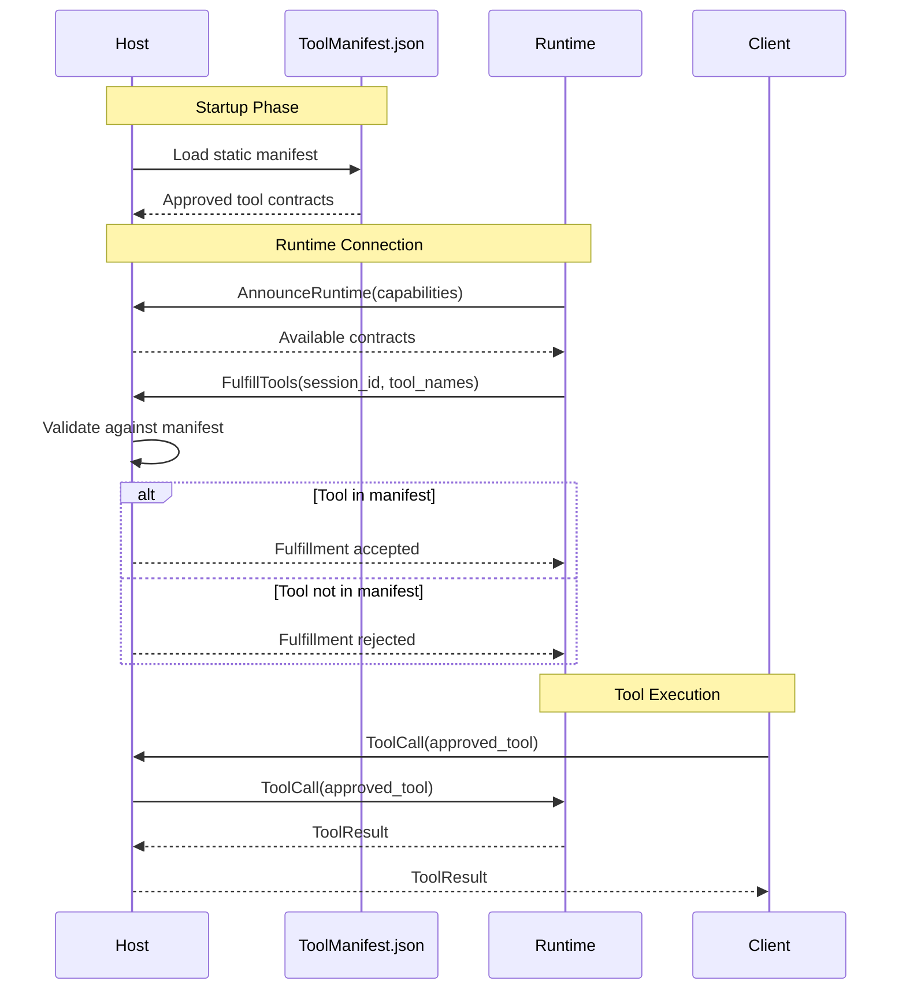
```mermaid
sequenceDiagram
    participant H as Host
    participant M as ToolManifest.json
    participant RT as Runtime
    participant C as Client

    Note over H,M: Startup Phase
    H->>M: Load static manifest
    M-->>H: Approved tool contracts

    Note over RT,H: Runtime Connection
    RT->>H: AnnounceRuntime(capabilities)
    H-->>RT: Available contracts

    RT->>H: FulfillTools(session_id, tool_names)
    H->>H: Validate against manifest
    alt Tool in manifest
        H-->>RT: Fulfillment accepted
    else Tool not in manifest
        H-->>RT: Fulfillment rejected
    end

    Note over C,RT: Tool Execution
    C->>H: ToolCall(approved_tool)
    H->>RT: ToolCall(approved_tool)
    RT-->>H: ToolResult
    H-->>C: ToolResult
```

**Use Cases:**
- Production deployments
- Regulated environments (healthcare, finance, government)
- Enterprise compliance scenarios
- High-security applications

**Configuration Example:**
```json
{
  "grid_mode": "STRICT",
  "manifest_path": "/etc/grid/tool_manifest.json",
  "allow_dynamic_registration": false,
  "security_level": "maximum",
  "audit_level": "full"
}
```

#### 2.3.2. DEVELOPMENT Mode (Development & Testing)

**DEVELOPMENT mode** is designed for development environments where rapid iteration and testing of new tools is essential. In this mode, Runtimes can dynamically register new tools with the Host during runtime.

**Key Characteristics:**
- **Dynamic Contract Registration:** Runtimes can register new tool contracts via `RegisterTools` messages
- **Rapid Iteration:** New tools can be tested immediately without manifest updates or Host restarts
- **Reduced Security:** Security guarantees are relaxed to enable development workflows
- **Session-Scoped:** Dynamic registrations are typically scoped to individual sessions

**Workflow:**
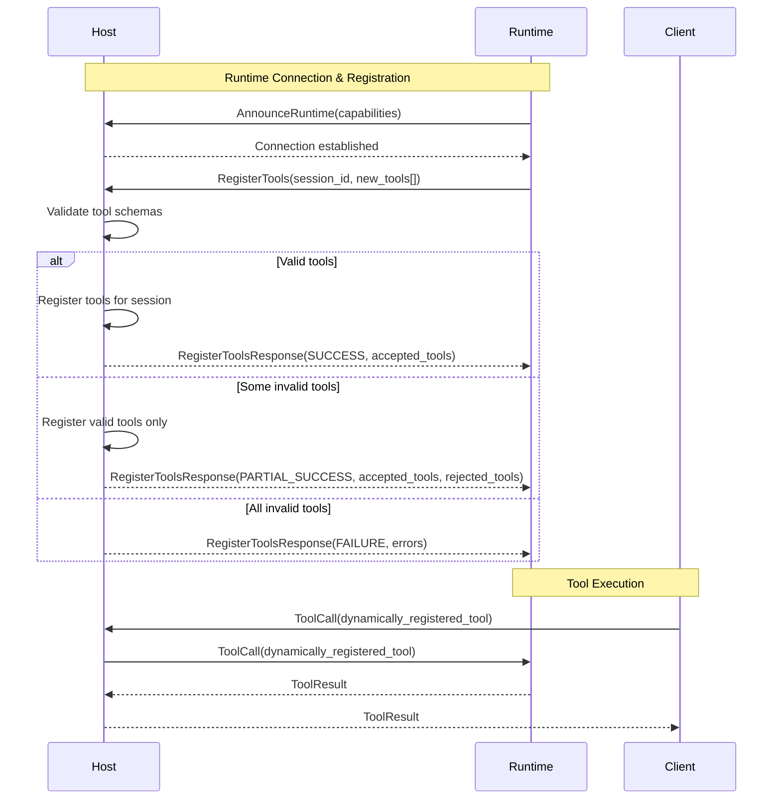
```mermaid
sequenceDiagram
    participant H as Host
    participant RT as Runtime
    participant C as Client

    Note over RT,H: Runtime Connection & Registration
    RT->>H: AnnounceRuntime(capabilities)
    H-->>RT: Connection established

    RT->>H: RegisterTools(session_id, new_tools[])
    H->>H: Validate tool schemas
    alt Valid tools
        H->>H: Register tools for session
        H-->>RT: RegisterToolsResponse(SUCCESS, accepted_tools)
    else Some invalid tools
        H->>H: Register valid tools only
        H-->>RT: RegisterToolsResponse(PARTIAL_SUCCESS, accepted_tools, rejected_tools)
    else All invalid tools
        H-->>RT: RegisterToolsResponse(FAILURE, errors)
    end

    Note over C,RT: Tool Execution
    C->>H: ToolCall(dynamically_registered_tool)
    H->>RT: ToolCall(dynamically_registered_tool)
    RT-->>H: ToolResult
    H-->>C: ToolResult
```

**Use Cases:**
- Local development environments
- Tool prototyping and testing
- Multi-language development workflows
- Continuous integration testing

**Security Warnings:**
> ⚠️ **DEVELOPMENT Mode Security Notice**
> 
> DEVELOPMENT mode provides reduced security guarantees and **MUST NOT** be used in production environments. Key security implications:
> 
> - Dynamic tool registration bypasses pre-approval governance processes
> - Malicious or buggy tools can be registered and executed
> - Reduced validation and authorization controls
> - All dynamic registrations are logged for audit purposes
> - Intended for trusted development environments only

**Configuration Example:**
```json
{
  "grid_mode": "DEVELOPMENT",
  "allow_dynamic_registration": true,
  "registration_audit_level": "full",
  "security_level": "development",
  "session_isolation": true,
  "max_dynamic_tools_per_session": 50
}
```

#### 2.3.3. Mode Selection Guidelines

**Choose STRICT Mode When:**
- Deploying to production environments
- Operating in regulated industries
- Compliance requirements mandate pre-approved tool sets
- Security is the primary concern
- Tool set is stable and well-defined

**Choose DEVELOPMENT Mode When:**
- Working in local development environments
- Prototyping new tools and workflows
- Testing multi-language tool integration
- Rapid iteration is required
- Operating in trusted, isolated environments

**Migration Path:**
Tools developed and tested in DEVELOPMENT mode can be promoted to STRICT mode by:
1. Adding the tested tool contracts to the static manifest
2. Switching the Host configuration to STRICT mode
3. Restarting the Host with the updated manifest
4. Verifying that Runtimes can fulfill the promoted contracts

This dual-mode approach enables organizations to maintain strict security controls in production while providing the flexibility needed for efficient development workflows.

> **Note on the `ToolContract` Definition**
>
> To maintain a clean separation of concerns, the definition of a `ToolContract` is layered across the ALTAR protocol suite:
>
> 1.  **Structural Core (ADM):** The foundational **ALTAR Data Model (ADM)** defines the `FunctionDeclaration`, which is the universal, language-agnostic structural core of any tool's contract.
> 2.  **Conceptual Formalization (GRID):** The **GRID Protocol** (this document) formalizes the *concept* of a `ToolContract` as the trusted, Host-managed agreement that contains one or more `FunctionDeclaration`s. This is the level at which security and fulfillment policies are applied.
> 3.  **Enterprise Enrichment (AESP):** The **AESP (ALTAR Enterprise Security Profile)** further enriches this concept into a specific `EnterpriseToolContract` message, adding detailed fields for governance, compliance, and risk management.
>
> This layered approach allows the core tool definition to remain simple and universal while being progressively enhanced with the security and governance features required for more advanced, production-grade deployments.

## 4. Protocol Message Schemas (Language-Neutral IDL)

These schemas define the messages exchanged between the Host and Runtimes. All payloads referencing tool structures (e.g., `FunctionCall`, `ToolResult`) are defined by the **ALTAR Data Model (ADM) Specification**.

### 4.1. Handshake & Fulfillment

Messages used for establishing a connection and declaring capabilities.

```idl
// Sent by a Runtime to the Host to announce its presence.
message AnnounceRuntime {
  string runtime_id = 1;           // Unique identifier for this runtime instance.
  string language = 2;             // Runtime language (e.g., "python", "elixir").
  string version = 3;              // Version of the GRID bridge implementation.
  repeated string capabilities = 4; // Supported GRID features (e.g., "streaming").
  map<string, string> metadata = 5; // Additional runtime-specific information.
}

// Sent by a Runtime to the Host to declare which trusted tool
// contracts it can execute for a given session.
message FulfillTools {
  string session_id = 1;           // The session for which tools are being fulfilled.
  repeated string tool_names = 2;  // Names of the Host-defined tool contracts to fulfill.
  string runtime_id = 3;           // The ID of the runtime providing the fulfillment.
}
```

### 4.2. Invocation & Results

Messages for executing a tool function and returning its result.

```idl
// Sent by the Host to a Runtime to request execution of a function.
// This message wraps a data structure from the ADM specification.
message ToolCall {
  string invocation_id = 1;        // Unique ID for this specific invocation.
  string correlation_id = 2;       // ID for tracing the entire workflow.
  ADM.FunctionCall call = 3;       // The function call payload, conforming to the ADM.
}

// Sent by a Runtime to the Host with the result of a function execution.
// This message wraps a data structure from the ADM specification.
message ToolResult {
  string invocation_id = 1;        // Correlates with the originating ToolCall.
  string correlation_id = 2;       // Propagated for end-to-end tracing.
  ADM.ToolResult result = 3;       // The function result payload, conforming to the ADM.
}

// (Level 2+) Sent by a Runtime to the Host for streaming results.
message StreamChunk {
  string invocation_id = 1;        // Correlates with the originating ToolCall.
  uint64 chunk_id = 2;             // Sequential identifier for ordering chunks.
  bytes payload = 3;               // Partial data for this chunk.
  bool is_final = 4;               // Flag indicating the end of the stream.
  Error error = 5;                 // Optional field for reporting in-band errors.
}
```

### 4.3. Session Management

Messages for managing the lifecycle of an interaction context.

```idl
// Sent by a Client to the Host to initialize a new interaction context.
message CreateSession {
  string suggested_session_id = 1;   // A client-suggested ID (Host may override).
  map<string, string> metadata = 2;   // Initial metadata for the session.
  uint64 ttl_seconds = 3;            // Requested time-to-live for the session.
  SecurityContext security_context = 4; // (Level 2+) Security context for the session.
}

// Sent by a Client to the Host to terminate an existing session.
message DestroySession {
  string session_id = 1;             // The ID of the session to terminate.
  bool force = 2;                    // If true, terminate even if invocations are active.
}
```

### 4.4. Supporting Types

Common data structures used across multiple messages.

```idl
// A structured error object.
message Error {
  string message = 1;              // A human-readable error message.
  string type = 2;                 // A standardized error code (e.g., "TOOL_NOT_FOUND").
}

// (Level 2+) Defines the security identity for a session.
message SecurityContext {
  string principal_id = 1;         // The end-user or service on whose behalf the session is acting.
  string tenant_id = 2;            // The organization or tenant this session belongs to.
  map<string, string> claims = 3;  // Opaque security claims from an auth system.
}

// Enhanced error structure with additional debugging and remediation context.
message EnhancedError {
  // Core fields (backward compatible with Error message)
  string message = 1;              // A human-readable error message.
  string type = 2;                 // A standardized error code (e.g., "TOOL_NOT_FOUND").
  
  // Enhanced fields for better debugging and remediation
  map<string, string> details = 3; // Additional error context and metadata.
  string correlation_id = 4;       // ID for tracing the entire workflow.
  uint64 timestamp = 5;            // Unix timestamp when the error occurred.
  
  // Retry guidance
  bool retry_allowed = 6;          // Whether the operation can be safely retried.
  uint64 retry_after_ms = 7;       // Suggested delay before retry attempt.
  
  // Remediation guidance
  repeated string remediation_steps = 8; // Suggested steps to resolve the error.
  string documentation_url = 9;    // Link to relevant documentation.
  
  // Context information
  string component = 10;           // Component that generated the error ("host", "runtime", "client").
  string session_id = 11;          // Session context where the error occurred.
  string runtime_id = 12;          // Runtime context where the error occurred.
}
```

### 4.5. Enhanced Protocol Messages

This section defines additional message types that support advanced GRID features including dynamic tool registration (DEVELOPMENT mode) and governed local dispatch patterns (Level 2+). These messages extend the core protocol while maintaining backward compatibility with Level 1 implementations.

#### 4.5.1. Dynamic Tool Registration Messages

These messages enable DEVELOPMENT mode functionality, allowing Runtimes to dynamically register new tool contracts with the Host during runtime.

```idl
// Sent by a Runtime to the Host to register new tool contracts dynamically.
// This message is only supported in DEVELOPMENT mode.
message RegisterToolsRequest {
  string runtime_id = 1;           // The ID of the runtime requesting registration.
  repeated ADM.Tool tools = 2;     // Tool contracts to register (ADM format).
  string session_id = 3;           // Session for which tools should be registered.
  map<string, string> metadata = 4; // Additional registration metadata.
}

// Sent by the Host to a Runtime in response to RegisterToolsRequest.
message RegisterToolsResponse {
  enum Status {
    SUCCESS = 0;                   // All tools were successfully registered.
    PARTIAL_SUCCESS = 1;           // Some tools were registered, others rejected.
    FAILURE = 2;                   // No tools were registered due to errors.
  }
  Status status = 1;               // Overall registration status.
  repeated string accepted_tools = 2; // Names of successfully registered tools.
  repeated string rejected_tools = 3; // Names of tools that were rejected.
  repeated EnhancedError errors = 4;  // Detailed error information for rejected tools.
  string session_id = 5;           // Session context for the registration.
}
```

**PARTIAL_SUCCESS Behavior Specification:**

When a `RegisterToolsRequest` contains multiple tools and some pass validation while others fail, the Host MUST:

1. **Register Valid Tools:** Successfully validated tools MUST be registered and made available for the session
2. **Reject Invalid Tools:** Failed tools MUST NOT be registered and MUST be listed in `rejected_tools`
3. **Return PARTIAL_SUCCESS:** The response status MUST be set to `PARTIAL_SUCCESS`
4. **Provide Detailed Errors:** Each rejected tool MUST have a corresponding `EnhancedError` in the `errors` array
5. **Log All Attempts:** Both successful and failed registration attempts MUST be logged for audit purposes

**Runtime Behavior on PARTIAL_SUCCESS:**

Runtimes receiving a `PARTIAL_SUCCESS` response SHOULD:
- Acknowledge that only `accepted_tools` are available for fulfillment
- Log or report the `rejected_tools` and associated errors for debugging
- Continue normal operation with the successfully registered tools
- Optionally retry registration of rejected tools after addressing the reported errors

#### 4.5.2. Governed Local Dispatch Messages (Level 2+)

These messages enable the governed local dispatch pattern, allowing lightweight authorization followed by local execution with asynchronous audit logging.

```idl
// (Level 2+) Sent by a Client or Runtime to request pre-authorization for local tool execution.
message AuthorizeToolCallRequest {
  string session_id = 1;           // Session context for the authorization request.
  SecurityContext security_context = 2; // Security context for authorization.
  ADM.FunctionCall call = 3;       // The function call to authorize (without execution).
  string correlation_id = 4;       // ID for tracing the entire workflow.
  map<string, string> metadata = 5; // Additional authorization context.
}

// (Level 2+) Sent by the Host in response to AuthorizeToolCallRequest.
message AuthorizeToolCallResponse {
  enum Status {
    APPROVED = 0;                  // Authorization granted, execution may proceed.
    DENIED = 1;                    // Authorization denied, execution must not proceed.
    PENDING = 2;                   // Authorization requires additional approval (future use).
  }
  Status status = 1;               // Authorization decision.
  string invocation_id = 2;        // Unique ID for correlating execution with authorization.
  string correlation_id = 3;       // Propagated for end-to-end tracing.
  EnhancedError error = 4;         // Error details if authorization was denied.
  uint64 authorization_ttl_ms = 5; // Time limit for using this authorization.
  map<string, string> execution_context = 6; // Additional context for execution.
}

// (Level 2+) Sent by a Client or Runtime to log the result of a locally executed tool.
message LogToolResultRequest {
  string session_id = 1;           // Session context for the execution.
  string invocation_id = 2;        // ID from the corresponding AuthorizeToolCallResponse.
  string correlation_id = 3;       // Propagated for end-to-end tracing.
  ADM.ToolResult result = 4;       // The execution result (ADM format).
  uint64 execution_time_ms = 5;    // Time taken to execute the tool locally.
  map<string, string> execution_metadata = 6; // Additional execution context.
  uint64 timestamp = 7;            // Unix timestamp when execution completed.
}

// (Level 2+) Sent by the Host in response to LogToolResultRequest.
message LogToolResultResponse {
  enum Status {
    LOGGED = 0;                    // Result successfully logged.
    REJECTED = 1;                  // Result rejected (invalid invocation_id, etc.).
  }
  Status status = 1;               // Logging status.
  string correlation_id = 2;       // Propagated for end-to-end tracing.
  EnhancedError error = 3;         // Error details if logging was rejected.
}
```

**Governed Local Dispatch Flow:**

The governed local dispatch pattern follows a three-phase approach:

1. **Authorization Phase:** Client requests authorization via `AuthorizeToolCallRequest`
2. **Execution Phase:** Client executes the tool locally using the provided `invocation_id`
3. **Audit Phase:** Client logs the execution result via `LogToolResultRequest`

This pattern provides zero-latency execution while maintaining complete Host authority over security and audit requirements.

**Security Guarantees:**

- **Full Host Authorization:** Every execution requires explicit Host approval before proceeding
- **Complete Audit Trail:** All executions are logged with correlation to their authorization
- **No Security Bypass:** Local execution cannot proceed without valid authorization
- **Tamper Detection:** Mismatched `invocation_id` values indicate potential security violations

**Performance Benefits:**

- **Zero Network Latency:** Tool execution happens locally without network round-trips
- **Reduced Payload Transfer:** Only lightweight authorization metadata crosses the network
- **Asynchronous Logging:** Audit logging doesn't block execution completion
- **Optimal for Large Payloads:** Particularly beneficial when tool arguments or results are large

## 5. Interaction Flows

### 5.1. Runtime Connection and Fulfillment

This flow describes how a new Runtime connects to the Host and makes its tools available for a session. The flow includes correlation ID tracking for end-to-end traceability.

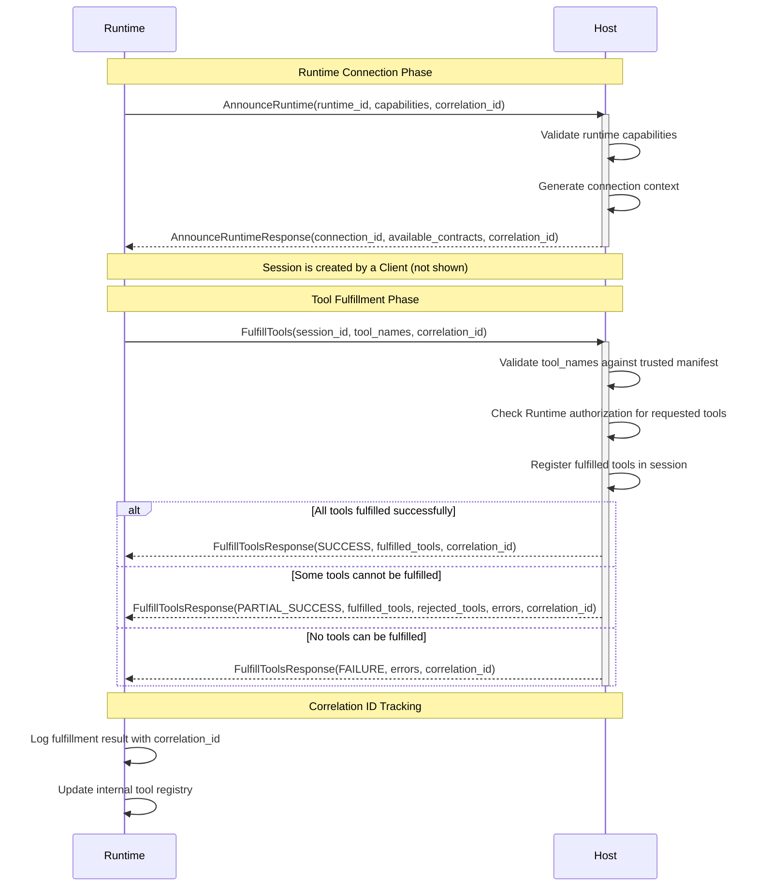
```mermaid
sequenceDiagram
    participant RT as Runtime
    participant H as Host

    Note over RT,H: Runtime Connection Phase
    RT->>H: AnnounceRuntime(runtime_id, capabilities, correlation_id)
    activate H
    H->>H: Validate runtime capabilities
    H->>H: Generate connection context
    H-->>RT: AnnounceRuntimeResponse(connection_id, available_contracts, correlation_id)
    deactivate H

    Note over RT, H: Session is created by a Client (not shown)

    Note over RT,H: Tool Fulfillment Phase
    RT->>H: FulfillTools(session_id, tool_names, correlation_id)
    activate H
    H->>H: Validate tool_names against trusted manifest
    H->>H: Check Runtime authorization for requested tools
    H->>H: Register fulfilled tools in session
    alt All tools fulfilled successfully
        H-->>RT: FulfillToolsResponse(SUCCESS, fulfilled_tools, correlation_id)
    else Some tools cannot be fulfilled
        H-->>RT: FulfillToolsResponse(PARTIAL_SUCCESS, fulfilled_tools, rejected_tools, errors, correlation_id)
    else No tools can be fulfilled
        H-->>RT: FulfillToolsResponse(FAILURE, errors, correlation_id)
    end
    deactivate H

    Note over RT,H: Correlation ID Tracking
    RT->>RT: Log fulfillment result with correlation_id
    RT->>RT: Update internal tool registry
```

**Enhanced Fulfillment Response Handling:**

When a Runtime receives a fulfillment response, it SHOULD:

1. **Process Successful Fulfillments:** Mark `fulfilled_tools` as available for execution
2. **Handle Rejections:** Log `rejected_tools` and associated errors for debugging
3. **Update Tool Registry:** Maintain accurate state of which tools are available
4. **Correlation Tracking:** Preserve `correlation_id` for tracing fulfillment through execution

**Correlation ID End-to-End Tracing:**

The runtime connection and fulfillment flow maintains complete traceability:
- Connection requests generate correlation IDs that flow through the entire handshake
- Fulfillment operations maintain correlation with their originating connection
- Subsequent tool executions can reference the fulfillment correlation for debugging

### 5.2. Synchronous Tool Invocation

This flow shows a standard, non-streaming tool call initiated by a Client, with enhanced error handling and correlation ID tracking for end-to-end traceability.

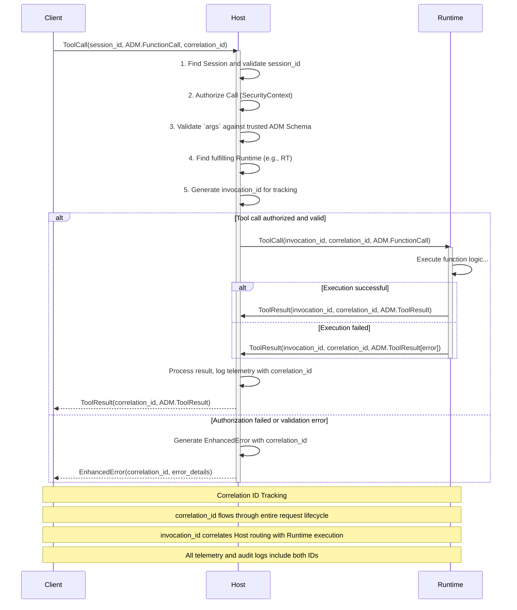
```mermaid
sequenceDiagram
    participant C as Client
    participant H as Host
    participant RT as Runtime

    C->>H: ToolCall(session_id, ADM.FunctionCall, correlation_id)
    activate H
    H->>H: 1. Find Session and validate session_id
    H->>H: 2. Authorize Call (SecurityContext)
    H->>H: 3. Validate `args` against trusted ADM Schema
    H->>H: 4. Find fulfilling Runtime (e.g., RT)
    H->>H: 5. Generate invocation_id for tracking

    alt Tool call authorized and valid
        H->>RT: ToolCall(invocation_id, correlation_id, ADM.FunctionCall)
        activate RT
        RT->>RT: Execute function logic...
        
        alt Execution successful
            RT->>H: ToolResult(invocation_id, correlation_id, ADM.ToolResult)
        else Execution failed
            RT->>H: ToolResult(invocation_id, correlation_id, ADM.ToolResult[error])
        end
        deactivate RT
        
        H->>H: Process result, log telemetry with correlation_id
        H-->>C: ToolResult(correlation_id, ADM.ToolResult)
    else Authorization failed or validation error
        H->>H: Generate EnhancedError with correlation_id
        H-->>C: EnhancedError(correlation_id, error_details)
    end
    deactivate H

    Note over C,RT: Correlation ID Tracking
    Note over C,RT: correlation_id flows through entire request lifecycle
    Note over C,RT: invocation_id correlates Host routing with Runtime execution
    Note over C,RT: All telemetry and audit logs include both IDs
```

**Enhanced Error Handling:**

The synchronous tool invocation flow includes comprehensive error handling:

1. **Session Validation Errors:** Invalid or expired session IDs result in `SESSION_INVALID` errors
2. **Authorization Errors:** Security context validation failures return `PERMISSION_DENIED` errors  
3. **Schema Validation Errors:** Malformed function calls return `SCHEMA_VIOLATION` errors
4. **Runtime Errors:** Tool execution failures are wrapped in `ToolResult` with error details
5. **Transport Errors:** Network or protocol issues generate `TRANSPORT_ERROR` responses

**Correlation ID End-to-End Tracing:**

The synchronous invocation flow maintains complete traceability through correlation IDs:

1. **Client Request:** Client generates or receives `correlation_id` for the operation
2. **Host Processing:** Host propagates `correlation_id` through all internal operations
3. **Runtime Execution:** Runtime receives and returns `correlation_id` with results
4. **Response Delivery:** Client receives `correlation_id` to correlate request with response
5. **Audit Logging:** All log entries include `correlation_id` for distributed tracing

**Performance Monitoring Integration:**

The enhanced flow supports performance monitoring through:
- **Invocation Timing:** Host tracks time from request to response
- **Runtime Performance:** Runtime execution time is captured and logged
- **Error Rate Tracking:** Failed invocations are categorized and monitored
- **Correlation Analysis:** Performance metrics can be correlated across the entire flow

### 5.3. DEVELOPMENT Mode Dynamic Tool Registration

This flow demonstrates how Runtimes can dynamically register new tools with the Host in DEVELOPMENT mode, including the handling of PARTIAL_SUCCESS responses.

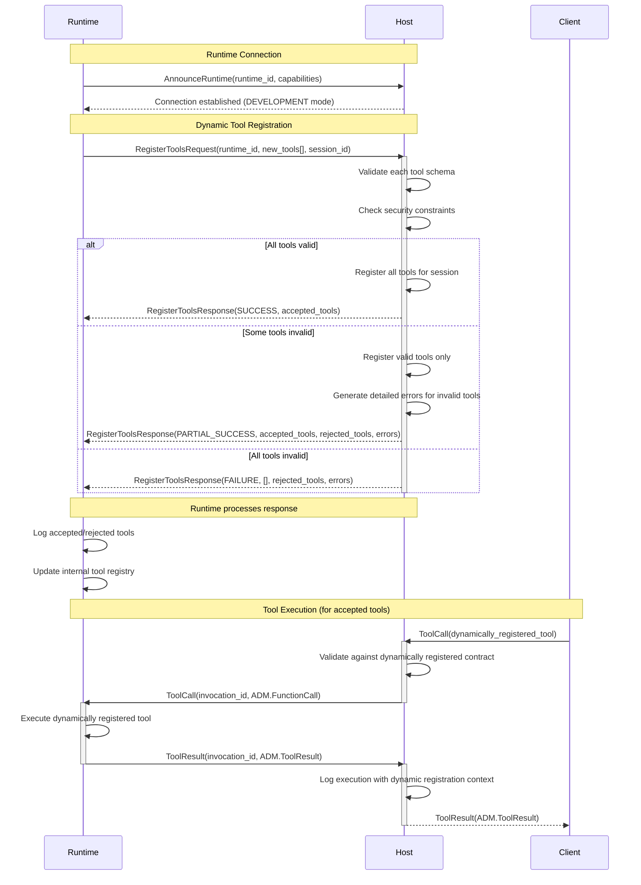
```mermaid
sequenceDiagram
    participant RT as Runtime
    participant H as Host
    participant C as Client

    Note over RT,H: Runtime Connection
    RT->>H: AnnounceRuntime(runtime_id, capabilities)
    H-->>RT: Connection established (DEVELOPMENT mode)

    Note over RT,H: Dynamic Tool Registration
    RT->>H: RegisterToolsRequest(runtime_id, new_tools[], session_id)
    activate H
    H->>H: Validate each tool schema
    H->>H: Check security constraints
    
    alt All tools valid
        H->>H: Register all tools for session
        H-->>RT: RegisterToolsResponse(SUCCESS, accepted_tools)
    else Some tools invalid
        H->>H: Register valid tools only
        H->>H: Generate detailed errors for invalid tools
        H-->>RT: RegisterToolsResponse(PARTIAL_SUCCESS, accepted_tools, rejected_tools, errors)
    else All tools invalid
        H-->>RT: RegisterToolsResponse(FAILURE, [], rejected_tools, errors)
    end
    deactivate H

    Note over RT,H: Runtime processes response
    RT->>RT: Log accepted/rejected tools
    RT->>RT: Update internal tool registry

    Note over C,RT: Tool Execution (for accepted tools)
    C->>H: ToolCall(dynamically_registered_tool)
    activate H
    H->>H: Validate against dynamically registered contract
    H->>RT: ToolCall(invocation_id, ADM.FunctionCall)
    deactivate H
    activate RT
    RT->>RT: Execute dynamically registered tool
    RT->>H: ToolResult(invocation_id, ADM.ToolResult)
    deactivate RT
    activate H
    H->>H: Log execution with dynamic registration context
    H-->>C: ToolResult(ADM.ToolResult)
    deactivate H
```

**Runtime Behavior on PARTIAL_SUCCESS:**

When a Runtime receives a `PARTIAL_SUCCESS` response, it SHOULD:

1. **Update Tool Registry:** Mark only `accepted_tools` as available for fulfillment
2. **Log Rejections:** Record `rejected_tools` and associated errors for debugging
3. **Continue Operation:** Proceed with normal operation using successfully registered tools
4. **Optional Retry:** Attempt to re-register rejected tools after addressing reported errors

**Correlation ID Tracking:**

All messages in dynamic registration flows include correlation IDs for end-to-end tracing:
- Registration requests generate a correlation ID that flows through the entire registration process
- Tool executions using dynamically registered tools maintain correlation with their registration
- Audit logs capture the relationship between registration and subsequent executions

### 5.4. Governed Local Dispatch Pattern

This flow demonstrates the three-phase governed local dispatch pattern: lightweight authorization, zero-latency local execution, and asynchronous audit logging.

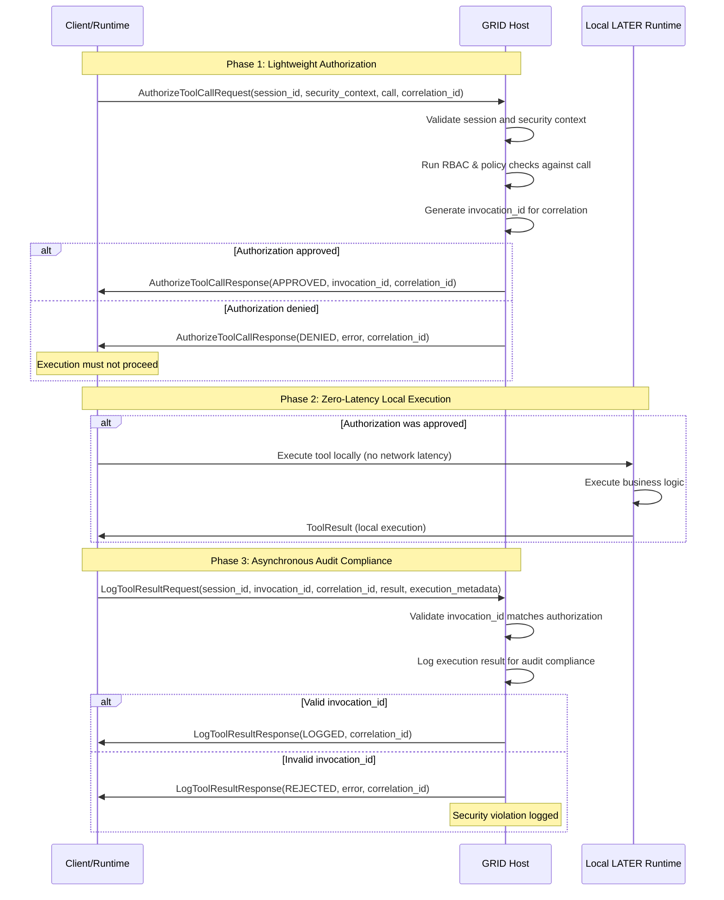
```mermaid
sequenceDiagram
    participant C as Client/Runtime
    participant H as GRID Host
    participant L as Local LATER Runtime

    Note over C,H: Phase 1: Lightweight Authorization
    C->>H: AuthorizeToolCallRequest(session_id, security_context, call, correlation_id)
    H->>H: Validate session and security context
    H->>H: Run RBAC & policy checks against call
    H->>H: Generate invocation_id for correlation
    
    alt Authorization approved
        H->>C: AuthorizeToolCallResponse(APPROVED, invocation_id, correlation_id)
    else Authorization denied
        H->>C: AuthorizeToolCallResponse(DENIED, error, correlation_id)
        Note over C: Execution must not proceed
    end

    Note over C,L: Phase 2: Zero-Latency Local Execution
    alt Authorization was approved
        C->>L: Execute tool locally (no network latency)
        L->>L: Execute business logic
        L->>C: ToolResult (local execution)
    end

    Note over C,H: Phase 3: Asynchronous Audit Compliance
    C->>H: LogToolResultRequest(session_id, invocation_id, correlation_id, result, execution_metadata)
    H->>H: Validate invocation_id matches authorization
    H->>H: Log execution result for audit compliance
    
    alt Valid invocation_id
        H->>C: LogToolResultResponse(LOGGED, correlation_id)
    else Invalid invocation_id
        H->>C: LogToolResultResponse(REJECTED, error, correlation_id)
        Note over H: Security violation logged
    end
```

**Performance Benefits:**

- **Zero Network Latency:** Tool execution happens locally without network round-trips to the Host
- **Reduced Payload Transfer:** Only lightweight authorization metadata crosses the network during authorization
- **Asynchronous Logging:** Audit logging doesn't block execution completion or client response
- **Optimal for Large Payloads:** Particularly beneficial when tool arguments or results are large

**Security Guarantees:**

- **Full Host Authorization:** Every execution requires explicit Host approval before proceeding
- **Complete Audit Trail:** All executions are logged with correlation to their authorization
- **No Security Bypass:** Local execution cannot proceed without valid `invocation_id`
- **Tamper Detection:** Mismatched or invalid `invocation_id` values indicate potential security violations

**Correlation ID End-to-End Tracing:**

The governed local dispatch pattern maintains complete traceability through correlation IDs:

1. **Authorization Phase:** `correlation_id` flows from request to response
2. **Execution Phase:** Local execution maintains the same `correlation_id` context
3. **Audit Phase:** `LogToolResultRequest` includes both `correlation_id` and `invocation_id`
4. **Tracing Systems:** External tracing systems can correlate authorization, execution, and audit events

**Fallback to Remote Execution:**

If local execution is not available or fails, clients SHOULD fall back to standard remote execution:

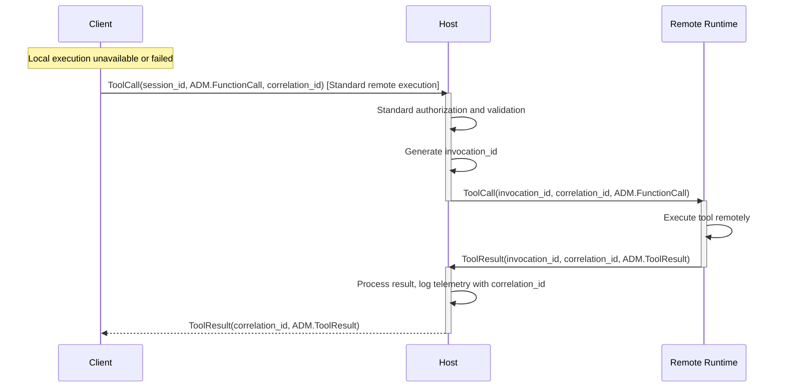
```mermaid
sequenceDiagram
    participant C as Client
    participant H as Host
    participant RT as Remote Runtime

    Note over C: Local execution unavailable or failed
    
    C->>H: ToolCall(session_id, ADM.FunctionCall, correlation_id) [Standard remote execution]
    activate H
    H->>H: Standard authorization and validation
    H->>H: Generate invocation_id
    H->>RT: ToolCall(invocation_id, correlation_id, ADM.FunctionCall)
    deactivate H
    activate RT
    RT->>RT: Execute tool remotely
    RT->>H: ToolResult(invocation_id, correlation_id, ADM.ToolResult)
    deactivate RT
    activate H
    H->>H: Process result, log telemetry with correlation_id
    H-->>C: ToolResult(correlation_id, ADM.ToolResult)
    deactivate H
```

### 5.5. Streaming Tool Execution with Correlation Tracking

This flow demonstrates streaming tool execution (Level 2+ feature) with comprehensive correlation ID tracking for real-time monitoring and debugging of long-running operations.

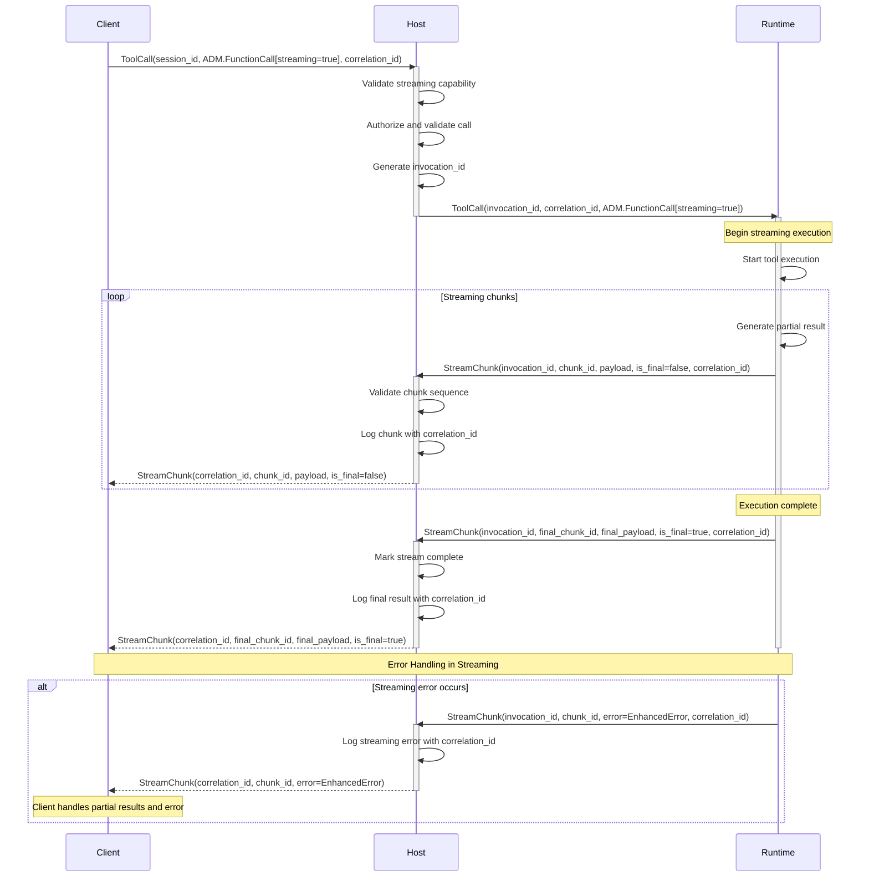
```mermaid
sequenceDiagram
    participant C as Client
    participant H as Host
    participant RT as Runtime

    C->>H: ToolCall(session_id, ADM.FunctionCall[streaming=true], correlation_id)
    activate H
    H->>H: Validate streaming capability
    H->>H: Authorize and validate call
    H->>H: Generate invocation_id
    H->>RT: ToolCall(invocation_id, correlation_id, ADM.FunctionCall[streaming=true])
    deactivate H
    activate RT
    
    Note over RT: Begin streaming execution
    RT->>RT: Start tool execution
    
    loop Streaming chunks
        RT->>RT: Generate partial result
        RT->>H: StreamChunk(invocation_id, chunk_id, payload, is_final=false, correlation_id)
        activate H
        H->>H: Validate chunk sequence
        H->>H: Log chunk with correlation_id
        H-->>C: StreamChunk(correlation_id, chunk_id, payload, is_final=false)
        deactivate H
    end
    
    Note over RT: Execution complete
    RT->>H: StreamChunk(invocation_id, final_chunk_id, final_payload, is_final=true, correlation_id)
    activate H
    H->>H: Mark stream complete
    H->>H: Log final result with correlation_id
    H-->>C: StreamChunk(correlation_id, final_chunk_id, final_payload, is_final=true)
    deactivate H
    deactivate RT

    Note over C,RT: Error Handling in Streaming
    alt Streaming error occurs
        RT->>H: StreamChunk(invocation_id, chunk_id, error=EnhancedError, correlation_id)
        activate H
        H->>H: Log streaming error with correlation_id
        H-->>C: StreamChunk(correlation_id, chunk_id, error=EnhancedError)
        deactivate H
        Note over C: Client handles partial results and error
    end
```

**Streaming Correlation Benefits:**

- **Real-time Monitoring:** Each chunk includes correlation ID for live progress tracking
- **Error Isolation:** Failed chunks can be correlated to specific execution phases
- **Performance Analysis:** Chunk timing analysis enables streaming optimization
- **Partial Recovery:** Clients can correlate successful chunks with failed operations

### 5.6. Error Correlation and Circuit Breaker Patterns

This flow demonstrates how correlation IDs enable sophisticated error handling and circuit breaker patterns across the distributed GRID system.

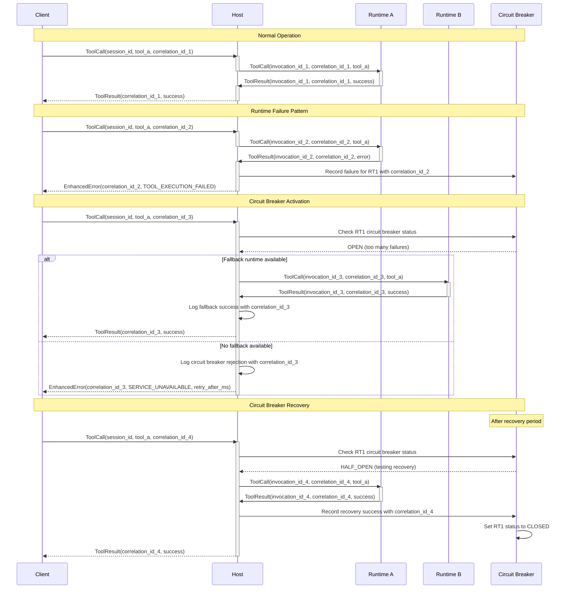
```mermaid
sequenceDiagram
    participant C as Client
    participant H as Host
    participant RT1 as Runtime A
    participant RT2 as Runtime B
    participant CB as Circuit Breaker

    Note over C,CB: Normal Operation
    C->>H: ToolCall(session_id, tool_a, correlation_id_1)
    activate H
    H->>RT1: ToolCall(invocation_id_1, correlation_id_1, tool_a)
    deactivate H
    activate RT1
    RT1->>H: ToolResult(invocation_id_1, correlation_id_1, success)
    deactivate RT1
    activate H
    H-->>C: ToolResult(correlation_id_1, success)
    deactivate H

    Note over C,CB: Runtime Failure Pattern
    C->>H: ToolCall(session_id, tool_a, correlation_id_2)
    activate H
    H->>RT1: ToolCall(invocation_id_2, correlation_id_2, tool_a)
    deactivate H
    activate RT1
    RT1->>H: ToolResult(invocation_id_2, correlation_id_2, error)
    deactivate RT1
    activate H
    H->>CB: Record failure for RT1 with correlation_id_2
    H-->>C: EnhancedError(correlation_id_2, TOOL_EXECUTION_FAILED)
    deactivate H

    Note over C,CB: Circuit Breaker Activation
    C->>H: ToolCall(session_id, tool_a, correlation_id_3)
    activate H
    H->>CB: Check RT1 circuit breaker status
    CB-->>H: OPEN (too many failures)
    
    alt Fallback runtime available
        H->>RT2: ToolCall(invocation_id_3, correlation_id_3, tool_a)
        activate RT2
        RT2->>H: ToolResult(invocation_id_3, correlation_id_3, success)
        deactivate RT2
        H->>H: Log fallback success with correlation_id_3
        H-->>C: ToolResult(correlation_id_3, success)
    else No fallback available
        H->>H: Log circuit breaker rejection with correlation_id_3
        H-->>C: EnhancedError(correlation_id_3, SERVICE_UNAVAILABLE, retry_after_ms)
    end
    deactivate H

    Note over C,CB: Circuit Breaker Recovery
    Note over CB: After recovery period
    C->>H: ToolCall(session_id, tool_a, correlation_id_4)
    activate H
    H->>CB: Check RT1 circuit breaker status
    CB-->>H: HALF_OPEN (testing recovery)
    H->>RT1: ToolCall(invocation_id_4, correlation_id_4, tool_a)
    activate RT1
    RT1->>H: ToolResult(invocation_id_4, correlation_id_4, success)
    deactivate RT1
    H->>CB: Record recovery success with correlation_id_4
    CB->>CB: Set RT1 status to CLOSED
    H-->>C: ToolResult(correlation_id_4, success)
    deactivate H
```

**Circuit Breaker Correlation Benefits:**

- **Failure Pattern Analysis:** Correlation IDs enable analysis of failure sequences
- **Recovery Tracking:** Successful recovery operations are correlated with previous failures
- **Fallback Monitoring:** Fallback executions maintain correlation with original requests
- **Performance Impact:** Circuit breaker decisions are logged with correlation context

**Error Correlation Strategies:**

1. **Temporal Correlation:** Group errors by time windows using correlation timestamps
2. **Causal Correlation:** Link related errors across multiple tool calls in a workflow
3. **Component Correlation:** Identify error patterns specific to Runtimes or tool types
4. **Session Correlation:** Track error patterns within specific user sessions
5. **Cross-Service Correlation:** Correlate GRID errors with external system failures

## 6. Error Handling and Resilience Patterns

GRID implements comprehensive error handling and resilience patterns to ensure robust operation in distributed environments. This section defines the error classification system, enhanced error structures, correlation tracking mechanisms, and circuit breaker patterns that enable reliable tool execution across the GRID ecosystem.

### 6.1. Error Classification System

GRID categorizes errors into five primary categories, each with specific handling patterns and remediation strategies. This classification enables systematic error handling, automated recovery procedures, and comprehensive monitoring across the distributed system.

#### 6.1.1. Authorization Errors

Authorization errors occur when security policies prevent tool execution or access to resources. These errors are generated by the Host's security layer and indicate policy violations or authentication failures.

**Error Types:**
- `PERMISSION_DENIED`: User lacks required roles or permissions for the requested tool
- `INVALID_CREDENTIALS`: Authentication credentials are invalid, expired, or malformed
- `SESSION_EXPIRED`: Security context or session has expired and requires renewal
- `INSUFFICIENT_SCOPE`: Security context lacks required scope for the requested operation
- `POLICY_VIOLATION`: Request violates organizational security policies
- `RATE_LIMIT_EXCEEDED`: User or session has exceeded allowed request rate limits

**Handling Patterns:**
```yaml
Authorization Error Handling:
  Immediate Actions:
    - Log security event with full context
    - Return detailed error with remediation guidance
    - Increment security metrics for monitoring
    
  Client Guidance:
    - Provide specific permission requirements
    - Include links to access request procedures
    - Suggest alternative tools with lower privilege requirements
    
  Retry Behavior:
    - PERMISSION_DENIED: No automatic retry (requires policy change)
    - INVALID_CREDENTIALS: Retry after credential refresh
    - SESSION_EXPIRED: Retry after session renewal
    - RATE_LIMIT_EXCEEDED: Retry after specified delay
```

**Example Enhanced Error Response:**
```json
{
  "type": "PERMISSION_DENIED",
  "message": "User lacks required role 'data_analyst' for tool 'advanced_analytics'",
  "details": {
    "required_roles": ["data_analyst", "power_user"],
    "user_roles": ["basic_user"],
    "tool_name": "advanced_analytics",
    "security_policy": "enterprise_rbac_v2"
  },
  "correlation_id": "auth-error-7f3a9b2c",
  "remediation_steps": [
    "Request 'data_analyst' role from your administrator",
    "Use alternative tool 'basic_analytics' which requires only 'basic_user' role",
    "Contact security team for policy exception if business critical"
  ],
  "documentation_url": "https://docs.grid.example.com/security/rbac-roles",
  "retry_allowed": false,
  "component": "host"
}
```

#### 6.1.2. Validation Errors

Validation errors occur when requests fail schema validation, contain malformed data, or reference non-existent resources. These errors are detected during the Host's validation phase before tool execution.

**Error Types:**
- `SCHEMA_VIOLATION`: Request payload doesn't conform to expected ADM schema
- `INVALID_TOOL_ARGS`: Tool arguments are malformed or missing required fields
- `UNSUPPORTED_TOOL`: Requested tool is not in the manifest or not fulfilled by any Runtime
- `INVALID_SESSION`: Session ID is malformed, expired, or doesn't exist
- `MALFORMED_REQUEST`: Request structure is invalid or corrupted
- `VERSION_MISMATCH`: Protocol version incompatibility between client and Host

**Handling Patterns:**
```yaml
Validation Error Handling:
  Immediate Actions:
    - Validate request against ADM schemas
    - Generate detailed validation error report
    - Log validation failure with request context
    
  Client Guidance:
    - Provide specific schema validation errors
    - Include corrected example requests
    - Reference ADM documentation for proper formats
    
  Retry Behavior:
    - SCHEMA_VIOLATION: No retry (requires client fix)
    - INVALID_TOOL_ARGS: No retry (requires argument correction)
    - UNSUPPORTED_TOOL: No retry (requires tool registration)
    - VERSION_MISMATCH: Retry with version negotiation
```

**Example Enhanced Error Response:**
```json
{
  "type": "SCHEMA_VIOLATION",
  "message": "Tool arguments failed ADM schema validation",
  "details": {
    "tool_name": "calculate_statistics",
    "validation_errors": [
      {
        "field": "dataset.columns",
        "error": "Required field missing",
        "expected_type": "array<string>"
      },
      {
        "field": "options.method",
        "error": "Invalid enum value 'invalid_method'",
        "allowed_values": ["mean", "median", "mode", "std_dev"]
      }
    ],
    "schema_version": "ADM-1.0.0"
  },
  "correlation_id": "validation-error-9c4d8e1f",
  "remediation_steps": [
    "Add required 'columns' array to dataset object",
    "Change 'options.method' to one of: mean, median, mode, std_dev",
    "Validate request against ADM schema before sending"
  ],
  "documentation_url": "https://docs.grid.example.com/adm/schemas/calculate-statistics",
  "retry_allowed": false,
  "component": "host"
}
```

#### 6.1.3. Runtime Errors

Runtime errors occur during tool execution within Runtimes. These errors represent business logic failures, resource constraints, or execution environment issues.

**Error Types:**
- `TOOL_EXECUTION_FAILED`: Business logic threw an exception during execution
- `TIMEOUT`: Tool execution exceeded configured time limits
- `RESOURCE_EXHAUSTED`: Runtime ran out of memory, CPU, or other resources
- `DEPENDENCY_UNAVAILABLE`: External dependency (database, API) is unavailable
- `DATA_PROCESSING_ERROR`: Error processing input data or generating output
- `RUNTIME_CRASH`: Runtime process crashed during tool execution

**Handling Patterns:**
```yaml
Runtime Error Handling:
  Immediate Actions:
    - Capture full execution context and stack traces
    - Log error with runtime performance metrics
    - Update Runtime health status
    
  Recovery Strategies:
    - Automatic retry for transient failures
    - Circuit breaker activation for repeated failures
    - Fallback to alternative Runtime if available
    
  Client Guidance:
    - Provide execution context and error details
    - Suggest input data modifications if applicable
    - Include performance optimization recommendations
```

**Example Enhanced Error Response:**
```json
{
  "type": "TOOL_EXECUTION_FAILED",
  "message": "Data processing failed due to invalid input format",
  "details": {
    "tool_name": "process_csv_data",
    "runtime_id": "python-runtime-003",
    "execution_time_ms": 1250,
    "error_category": "data_format",
    "stack_trace": "pandas.errors.ParserError: Error tokenizing data...",
    "input_validation": {
      "expected_format": "CSV with headers",
      "detected_format": "JSON",
      "file_size_bytes": 1048576
    }
  },
  "correlation_id": "runtime-error-a5b7c9d2",
  "remediation_steps": [
    "Convert input data to CSV format with proper headers",
    "Use 'process_json_data' tool for JSON input instead",
    "Validate data format before processing",
    "Consider splitting large files into smaller chunks"
  ],
  "documentation_url": "https://docs.grid.example.com/tools/data-processing",
  "retry_allowed": true,
  "retry_after_ms": 5000,
  "component": "runtime"
}
```

#### 6.1.4. Transport Errors

Transport errors occur at the network and protocol level, affecting communication between GRID components. These errors indicate infrastructure issues or network connectivity problems.

**Error Types:**
- `CONNECTION_FAILED`: Network connection to Host or Runtime failed
- `PROTOCOL_VIOLATION`: Invalid message format or protocol sequence
- `MESSAGE_TOO_LARGE`: Request or response exceeds size limits
- `NETWORK_TIMEOUT`: Network operation timed out
- `TLS_HANDSHAKE_FAILED`: Secure connection establishment failed
- `SERIALIZATION_ERROR`: Message serialization/deserialization failed

**Handling Patterns:**
```yaml
Transport Error Handling:
  Immediate Actions:
    - Log network error with connection context
    - Update connection health metrics
    - Trigger connection recovery procedures
    
  Recovery Strategies:
    - Automatic connection retry with exponential backoff
    - Connection pool refresh and health checks
    - Fallback to alternative Host endpoints if available
    
  Client Guidance:
    - Provide network diagnostic information
    - Include connection troubleshooting steps
    - Reference network configuration documentation
```

#### 6.1.5. Configuration Errors

Configuration errors occur when system configuration is invalid, missing, or incompatible. These errors prevent proper system initialization or operation.

**Error Types:**
- `INVALID_CONFIG`: Configuration file is malformed or contains invalid values
- `MISSING_MANIFEST`: Required tool manifest file is not found or inaccessible
- `INCOMPATIBLE_MODE`: Operational mode is not supported or misconfigured
- `CERTIFICATE_ERROR`: TLS certificates are invalid, expired, or misconfigured
- `ENVIRONMENT_ERROR`: Required environment variables or resources are missing
- `FEATURE_UNAVAILABLE`: Requested feature is not available in current configuration

**Handling Patterns:**
```yaml
Configuration Error Handling:
  Immediate Actions:
    - Validate configuration against schema
    - Log configuration error with diagnostic context
    - Prevent system startup if critical configuration is invalid
    
  Recovery Strategies:
    - Load default configuration for non-critical settings
    - Graceful degradation by disabling optional features
    - Configuration hot-reload for non-critical updates
    
  Administrative Guidance:
    - Provide specific configuration validation errors
    - Include corrected configuration examples
    - Reference configuration documentation and best practices
```

### 6.2. Enhanced Error Message Structure

The `EnhancedError` message structure provides comprehensive error information that enables effective debugging, monitoring, and automated recovery. This structure extends the basic `Error` message with additional context, remediation guidance, and correlation tracking.

#### 6.2.1. Core Error Structure

```protobuf
// Enhanced error structure with comprehensive debugging and remediation context
message EnhancedError {
  // Core fields (backward compatible with basic Error message)
  string message = 1;              // Human-readable error description
  string type = 2;                 // Standardized error code (e.g., "PERMISSION_DENIED")
  
  // Enhanced debugging context
  map<string, string> details = 3; // Structured error details and metadata
  string correlation_id = 4;       // ID for tracing the entire workflow
  uint64 timestamp = 5;            // Unix timestamp when error occurred
  
  // Retry and recovery guidance
  bool retry_allowed = 6;          // Whether operation can be safely retried
  uint64 retry_after_ms = 7;       // Suggested delay before retry attempt
  uint32 max_retries = 8;          // Maximum recommended retry attempts
  
  // Remediation and support information
  repeated string remediation_steps = 9; // Ordered steps to resolve the error
  string documentation_url = 10;   // Link to relevant documentation
  string support_reference = 11;   // Reference ID for support ticket creation
  
  // System context information
  string component = 12;           // Component that generated error ("host", "runtime", "client")
  string session_id = 13;          // Session context where error occurred
  string runtime_id = 14;          // Runtime context where error occurred
  string tool_name = 15;           // Tool being executed when error occurred
  
  // Error classification and severity
  ErrorSeverity severity = 16;     // Error severity level
  ErrorCategory category = 17;     // Primary error category
  repeated string tags = 18;       // Additional classification tags
  
  // Performance and diagnostic context
  uint64 execution_time_ms = 19;   // Time spent before error occurred
  map<string, string> performance_metrics = 20; // Relevant performance data
  string trace_id = 21;            // Distributed tracing identifier
  
  // Nested error information
  repeated EnhancedError caused_by = 22; // Chain of underlying errors
}

// Error severity levels for prioritization and alerting
enum ErrorSeverity {
  INFO = 0;        // Informational, no action required
  WARNING = 1;     // Warning condition, monitoring recommended
  ERROR = 2;       // Error condition, user action may be required
  CRITICAL = 3;    // Critical error, immediate attention required
  FATAL = 4;       // Fatal error, system or component failure
}

// Primary error categories for systematic handling
enum ErrorCategory {
  AUTHORIZATION = 0;    // Security and permission errors
  VALIDATION = 1;       // Schema and input validation errors
  RUNTIME = 2;          // Tool execution and business logic errors
  TRANSPORT = 3;        // Network and communication errors
  CONFIGURATION = 4;    // System configuration and setup errors
}
```

#### 6.2.2. Error Context Enrichment

The enhanced error structure supports rich context information that enables effective debugging and automated recovery:

**Structured Details:**
```json
{
  "details": {
    "error_code": "GRID_TOOL_TIMEOUT_001",
    "tool_version": "1.2.3",
    "runtime_version": "1.1.0",
    "host_version": "1.1.0",
    "execution_environment": "production",
    "resource_usage": {
      "cpu_percent": 95.2,
      "memory_mb": 2048,
      "execution_time_ms": 30000
    },
    "input_characteristics": {
      "payload_size_bytes": 1048576,
      "complexity_score": 8.5,
      "estimated_processing_time_ms": 15000
    }
  }
}
```

**Performance Metrics Integration:**
```json
{
  "performance_metrics": {
    "queue_wait_time_ms": "150",
    "network_latency_ms": "25",
    "serialization_time_ms": "45",
    "validation_time_ms": "12",
    "execution_start_timestamp": "1691568000000",
    "last_heartbeat_timestamp": "1691568025000"
  }
}
```

**Remediation Guidance:**
```json
{
  "remediation_steps": [
    "Reduce input data size to under 500KB for optimal performance",
    "Consider using streaming mode for large dataset processing",
    "Split complex operations into smaller, parallelizable tasks",
    "Contact support if issue persists with reference ID: GRID-2025-08-09-001"
  ],
  "documentation_url": "https://docs.grid.example.com/troubleshooting/timeout-errors",
  "support_reference": "GRID-2025-08-09-001"
}
```

### 6.3. Correlation ID Tracking and End-to-End Tracing

GRID implements comprehensive correlation ID tracking to enable end-to-end tracing of requests across the distributed system. This capability is essential for debugging complex workflows, performance analysis, and audit compliance.

#### 6.3.1. Correlation ID Generation and Propagation

**ID Generation Strategy:**
```yaml
Correlation ID Format:
  Structure: "{component}-{timestamp}-{random}"
  Example: "client-1691568000-a7b9c3d2"
  
  Components:
    - component: Origin component (client, host, runtime)
    - timestamp: Unix timestamp in seconds
    - random: 8-character hexadecimal random suffix
    
  Properties:
    - Globally unique across all GRID deployments
    - Sortable by creation time
    - Traceable to originating component
    - URL-safe and log-friendly format
```

**Propagation Flow:**
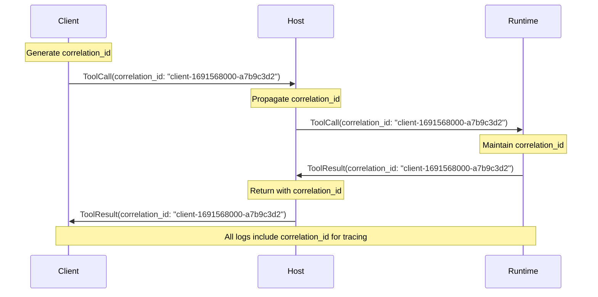
```mermaid
sequenceDiagram
    participant C as Client
    participant H as Host
    participant RT as Runtime

    Note over C: Generate correlation_id
    C->>H: ToolCall(correlation_id: "client-1691568000-a7b9c3d2")
    
    Note over H: Propagate correlation_id
    H->>RT: ToolCall(correlation_id: "client-1691568000-a7b9c3d2")
    
    Note over RT: Maintain correlation_id
    RT->>H: ToolResult(correlation_id: "client-1691568000-a7b9c3d2")
    
    Note over H: Return with correlation_id
    H->>C: ToolResult(correlation_id: "client-1691568000-a7b9c3d2")
    
    Note over C,RT: All logs include correlation_id for tracing
```

#### 6.3.2. Distributed Tracing Integration

GRID supports integration with distributed tracing systems like Jaeger, Zipkin, and OpenTelemetry:

**Trace Context Propagation:**
```protobuf
// Extended message headers for distributed tracing
message TraceContext {
  string trace_id = 1;             // Distributed trace identifier
  string span_id = 2;              // Current span identifier
  string parent_span_id = 3;       // Parent span identifier
  map<string, string> baggage = 4; // Trace baggage for context propagation
  uint32 trace_flags = 5;          // Trace sampling and debug flags
}

// Enhanced message with trace context
message TracedToolCall {
  // Standard ToolCall fields
  string invocation_id = 1;
  string correlation_id = 2;
  ADM.FunctionCall call = 3;
  
  // Distributed tracing context
  TraceContext trace_context = 4;
}
```

**Tracing Integration Example:**
```python
# Python client with distributed tracing
from altar.grid.client import GridClient
from opentelemetry import trace

tracer = trace.get_tracer(__name__)

with tracer.start_as_current_span("tool_execution") as span:
    # Correlation ID automatically includes trace context
    result = client.call_tool(
        "analyze_data", 
        {"dataset": large_dataset},
        correlation_id=f"client-{int(time.time())}-{uuid.uuid4().hex[:8]}"
    )
    
    # Span automatically tagged with GRID context
    span.set_attribute("grid.tool_name", "analyze_data")
    span.set_attribute("grid.session_id", client.session_id)
    span.set_attribute("grid.correlation_id", result.correlation_id)
```

#### 6.3.3. Error Correlation and Analysis

**Error Correlation Patterns:**
```yaml
Correlation Strategies:
  Temporal Correlation:
    - Group errors occurring within time windows
    - Identify error cascades and failure patterns
    - Correlate with system events and deployments
    
  Causal Correlation:
    - Link related errors across tool call chains
    - Trace error propagation through workflows
    - Identify root cause vs. symptom errors
    
  Component Correlation:
    - Identify error patterns specific to Runtimes
    - Correlate errors with resource utilization
    - Track error rates across different tool types
    
  Session Correlation:
    - Track error patterns within user sessions
    - Identify problematic user behaviors or data
    - Correlate errors with session characteristics
```

**Automated Error Analysis:**
```python
# Error correlation analysis example
class ErrorCorrelationAnalyzer:
    def analyze_error_patterns(self, correlation_id: str) -> ErrorAnalysis:
        """Analyze error patterns for a given correlation ID"""
        
        # Gather all events for correlation ID
        events = self.trace_store.get_events(correlation_id)
        
        # Identify error cascade patterns
        error_chain = self.build_error_chain(events)
        
        # Analyze temporal patterns
        temporal_analysis = self.analyze_temporal_patterns(events)
        
        # Identify root cause
        root_cause = self.identify_root_cause(error_chain)
        
        return ErrorAnalysis(
            correlation_id=correlation_id,
            error_chain=error_chain,
            root_cause=root_cause,
            temporal_patterns=temporal_analysis,
            remediation_suggestions=self.generate_remediation(root_cause)
        )
```

### 6.4. Circuit Breaker Patterns and Implementation

GRID implements sophisticated circuit breaker patterns to protect system components from cascading failures and enable graceful degradation under adverse conditions.

#### 6.4.1. Client-Side Circuit Breaker

The client-side circuit breaker protects clients from failing Hosts and provides automatic failover capabilities:

**Circuit Breaker States:**
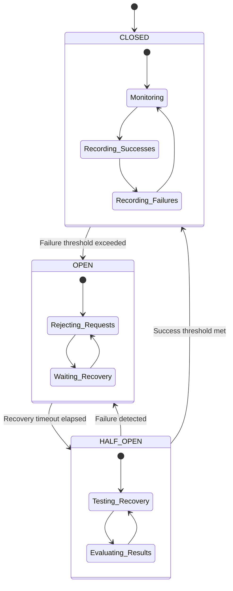
```mermaid
stateDiagram-v2
    [*] --> CLOSED
    CLOSED --> OPEN : Failure threshold exceeded
    OPEN --> HALF_OPEN : Recovery timeout elapsed
    HALF_OPEN --> CLOSED : Success threshold met
    HALF_OPEN --> OPEN : Failure detected
    
    state CLOSED {
        [*] --> Monitoring
        Monitoring --> Recording_Successes
        Recording_Successes --> Recording_Failures
        Recording_Failures --> Monitoring
    }
    
    state OPEN {
        [*] --> Rejecting_Requests
        Rejecting_Requests --> Waiting_Recovery
        Waiting_Recovery --> Rejecting_Requests
    }
    
    state HALF_OPEN {
        [*] --> Testing_Recovery
        Testing_Recovery --> Evaluating_Results
        Evaluating_Results --> Testing_Recovery
    }
```

**Client Circuit Breaker Configuration:**
```yaml
client_circuit_breaker:
  failure_threshold: 5              # Failures before opening circuit
  failure_window_ms: 60000          # Time window for failure counting
  recovery_timeout_ms: 30000        # Time to wait before testing recovery
  success_threshold: 3              # Successes needed to close circuit
  
  failure_types:                    # Which errors trigger circuit breaker
    - CONNECTION_FAILED
    - NETWORK_TIMEOUT
    - TLS_HANDSHAKE_FAILED
    - HOST_UNAVAILABLE
  
  excluded_errors:                  # Errors that don't trigger circuit breaker
    - PERMISSION_DENIED
    - SCHEMA_VIOLATION
    - INVALID_TOOL_ARGS
  
  fallback_strategy:
    - retry_alternative_host
    - degrade_to_cached_results
    - return_error_with_guidance
```

**Client Circuit Breaker Implementation:**
```python
class GridClientCircuitBreaker:
    def __init__(self, config: CircuitBreakerConfig):
        self.config = config
        self.state = CircuitBreakerState.CLOSED
        self.failure_count = 0
        self.last_failure_time = None
        self.success_count = 0
        
    def call_with_circuit_breaker(self, operation: Callable) -> Any:
        """Execute operation with circuit breaker protection"""
        
        if self.state == CircuitBreakerState.OPEN:
            if self._should_attempt_recovery():
                self.state = CircuitBreakerState.HALF_OPEN
                self.success_count = 0
            else:
                raise CircuitBreakerOpenError(
                    "Circuit breaker is OPEN, operation rejected",
                    retry_after_ms=self._time_until_recovery()
                )
        
        try:
            result = operation()
            self._record_success()
            return result
            
        except Exception as e:
            if self._is_circuit_breaker_error(e):
                self._record_failure()
            raise
    
    def _record_failure(self):
        """Record failure and update circuit breaker state"""
        self.failure_count += 1
        self.last_failure_time = time.time()
        
        if self.state == CircuitBreakerState.HALF_OPEN:
            # Failure during recovery test - reopen circuit
            self.state = CircuitBreakerState.OPEN
            self.failure_count = 0
            
        elif (self.state == CircuitBreakerState.CLOSED and 
              self.failure_count >= self.config.failure_threshold):
            # Threshold exceeded - open circuit
            self.state = CircuitBreakerState.OPEN
            logger.warning(f"Circuit breaker opened after {self.failure_count} failures")
    
    def _record_success(self):
        """Record success and update circuit breaker state"""
        if self.state == CircuitBreakerState.HALF_OPEN:
            self.success_count += 1
            if self.success_count >= self.config.success_threshold:
                # Recovery successful - close circuit
                self.state = CircuitBreakerState.CLOSED
                self.failure_count = 0
                logger.info("Circuit breaker closed after successful recovery")
        
        elif self.state == CircuitBreakerState.CLOSED:
            # Reset failure count on success
            self.failure_count = max(0, self.failure_count - 1)
```

#### 6.4.2. Host-Side Circuit Breaker

The Host-side circuit breaker protects the system from failing Runtimes and enables automatic Runtime isolation:

**Runtime Health Monitoring:**
```yaml
host_circuit_breaker:
  per_runtime_monitoring:
    failure_threshold: 10           # Failures before isolating Runtime
    failure_window_ms: 300000       # 5-minute failure counting window
    recovery_timeout_ms: 600000     # 10-minute isolation period
    health_check_interval_ms: 30000 # Health check frequency
    
  system_protection:
    max_concurrent_failures: 3      # Max Runtimes that can fail simultaneously
    emergency_mode_threshold: 0.5   # Activate emergency mode if >50% Runtimes fail
    load_shedding_threshold: 0.8    # Start load shedding at 80% capacity
    
  failure_detection:
    consecutive_timeouts: 3         # Timeouts before marking Runtime unhealthy
    error_rate_threshold: 0.1       # 10% error rate triggers circuit breaker
    response_time_threshold_ms: 30000 # Response time threshold for health
```

**Host Circuit Breaker Flow:**
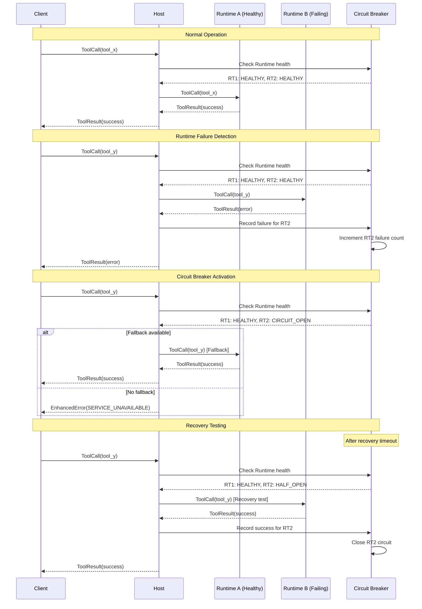
```mermaid
sequenceDiagram
    participant C as Client
    participant H as Host
    participant RT1 as Runtime A (Healthy)
    participant RT2 as Runtime B (Failing)
    participant CB as Circuit Breaker

    Note over C,CB: Normal Operation
    C->>H: ToolCall(tool_x)
    H->>CB: Check Runtime health
    CB-->>H: RT1: HEALTHY, RT2: HEALTHY
    H->>RT1: ToolCall(tool_x)
    RT1-->>H: ToolResult(success)
    H-->>C: ToolResult(success)

    Note over C,CB: Runtime Failure Detection
    C->>H: ToolCall(tool_y)
    H->>CB: Check Runtime health
    CB-->>H: RT1: HEALTHY, RT2: HEALTHY
    H->>RT2: ToolCall(tool_y)
    RT2-->>H: ToolResult(error)
    H->>CB: Record failure for RT2
    CB->>CB: Increment RT2 failure count
    H-->>C: ToolResult(error)

    Note over C,CB: Circuit Breaker Activation
    C->>H: ToolCall(tool_y)
    H->>CB: Check Runtime health
    CB-->>H: RT1: HEALTHY, RT2: CIRCUIT_OPEN
    
    alt Fallback available
        H->>RT1: ToolCall(tool_y) [Fallback]
        RT1-->>H: ToolResult(success)
        H-->>C: ToolResult(success)
    else No fallback
        H-->>C: EnhancedError(SERVICE_UNAVAILABLE)
    end

    Note over C,CB: Recovery Testing
    Note over CB: After recovery timeout
    C->>H: ToolCall(tool_y)
    H->>CB: Check Runtime health
    CB-->>H: RT1: HEALTHY, RT2: HALF_OPEN
    H->>RT2: ToolCall(tool_y) [Recovery test]
    RT2-->>H: ToolResult(success)
    H->>CB: Record success for RT2
    CB->>CB: Close RT2 circuit
    H-->>C: ToolResult(success)
```

#### 6.4.3. Advanced Circuit Breaker Features

**Adaptive Thresholds:**
```python
class AdaptiveCircuitBreaker:
    def __init__(self):
        self.baseline_error_rate = 0.01  # 1% baseline error rate
        self.adaptive_threshold = 0.05   # 5% initial threshold
        
    def update_adaptive_threshold(self, recent_metrics: RuntimeMetrics):
        """Adjust circuit breaker threshold based on system conditions"""
        
        # Increase threshold during high load periods
        if recent_metrics.cpu_utilization > 0.8:
            self.adaptive_threshold = min(0.15, self.adaptive_threshold * 1.2)
        
        # Decrease threshold during stable periods
        elif recent_metrics.error_rate < self.baseline_error_rate:
            self.adaptive_threshold = max(0.02, self.adaptive_threshold * 0.9)
        
        # Adjust based on network conditions
        if recent_metrics.network_latency_p95 > 1000:  # >1s latency
            self.adaptive_threshold = min(0.20, self.adaptive_threshold * 1.5)
```

**Bulkhead Pattern Integration:**
```yaml
bulkhead_configuration:
  resource_pools:
    critical_tools:
      max_concurrent_executions: 10
      queue_size: 50
      timeout_ms: 30000
      circuit_breaker:
        failure_threshold: 3
        recovery_timeout_ms: 60000
    
    batch_processing:
      max_concurrent_executions: 5
      queue_size: 100
      timeout_ms: 300000
      circuit_breaker:
        failure_threshold: 2
        recovery_timeout_ms: 300000
    
    experimental_tools:
      max_concurrent_executions: 2
      queue_size: 10
      timeout_ms: 10000
      circuit_breaker:
        failure_threshold: 1
        recovery_timeout_ms: 30000
```

**Circuit Breaker Metrics and Monitoring:**
```yaml
circuit_breaker_metrics:
  state_transitions:
    - circuit_breaker_state_changes_total
    - circuit_breaker_open_duration_seconds
    - circuit_breaker_recovery_attempts_total
    
  failure_tracking:
    - circuit_breaker_failures_total
    - circuit_breaker_failure_rate
    - circuit_breaker_consecutive_failures
    
  performance_impact:
    - circuit_breaker_rejected_requests_total
    - circuit_breaker_fallback_executions_total
    - circuit_breaker_recovery_success_rate
    
  alerting_rules:
    - alert: CircuitBreakerOpen
      expr: circuit_breaker_state == 1
      for: 1m
      labels:
        severity: warning
      annotations:
        summary: "Circuit breaker opened for {{ $labels.component }}"
        
    - alert: CircuitBreakerHighFailureRate
      expr: rate(circuit_breaker_failures_total[5m]) > 0.1
      for: 2m
      labels:
        severity: critical
      annotations:
        summary: "High failure rate detected: {{ $value }} failures/sec"
```

This comprehensive error handling and resilience framework ensures that GRID can operate reliably in distributed environments while providing detailed diagnostic information and automated recovery capabilities. The combination of systematic error classification, enhanced error structures, correlation tracking, and circuit breaker patterns creates a robust foundation for enterprise-grade tool execution systems.

## 7. The Business Case for GRID

The GRID protocol and its corresponding managed Host implementations are designed to answer a critical question for engineering leaders: *"Why not just use an open-source framework like LangChain and deploy it on cloud services ourselves?"*

While a DIY approach offers maximum flexibility, it also carries significant hidden costs and risks. GRID provides compelling business value by addressing these challenges directly.

-   **Reduced DevOps Overhead:** Building a secure, scalable, polyglot, and observable distributed system for AI tools is a complex engineering task that can take a dedicated team months. A managed GRID Host provides this infrastructure out-of-the-box, allowing teams to focus on building business logic, not on managing queues, load balancers, and container orchestration.

-   **Built-in Security & Compliance (AESP):** The Host-centric security model is a core feature, not an add-on. By adopting GRID, organizations get a pre-built control plane for Role-Based Access Control (RBAC), immutable audit logging, and centralized policy enforcement, as defined by the **Altar Enterprise Security Profile (AESP)**. This dramatically accelerates the path to deploying compliant, secure AI agents in regulated environments.

-   **Language-Agnostic Scalability:** A key architectural advantage of GRID is the decoupling of the Host from the Runtimes. This allows an organization to scale its Python-based data science tools independently from its Go-based backend integration tools. This granular control over scaling optimizes resource utilization and reduces operational costs compared to monolithic deployment strategies.

-   **Faster Time-to-Market:** By leveraging the seamless "promotion path" from LATER, developers can move from a local prototype to a production-scale deployment with a simple configuration change. This agility allows businesses to iterate faster and deliver value from their AI investments sooner.

## 8. Advanced Interaction Patterns (Cookbook)

This section provides concrete implementation guidance for complex real-world scenarios that leverage GRID's core primitives. These patterns demonstrate how to solve sophisticated distributed tool orchestration challenges while maintaining the security and observability advantages of the Host-centric model.

The patterns documented here are designed to help implementers understand how to compose GRID's foundational capabilities—Host-managed contracts, secure message routing, and polyglot Runtime orchestration—into solutions for enterprise-grade use cases that go beyond simple request-response tool invocations.

### 8.1. Bidirectional Tool Calls (Runtime-as-Client)

In sophisticated tool orchestration scenarios, a Runtime executing one tool may need to invoke another tool to complete its work. For example, a Python Runtime executing a `generate_report` tool might need to call a `fetch_data` tool fulfilled by an Elixir Runtime to gather the necessary information.

The **Runtime-as-Client** pattern enables this capability while preserving GRID's Host-centric security model. Rather than allowing direct Runtime-to-Runtime communication (which would bypass security controls), all tool invocations flow through the Host, ensuring complete observability, authorization, and audit logging.

#### Host-Mediated Flow

The following sequence diagram illustrates how bidirectional tool calls work within GRID's security model:

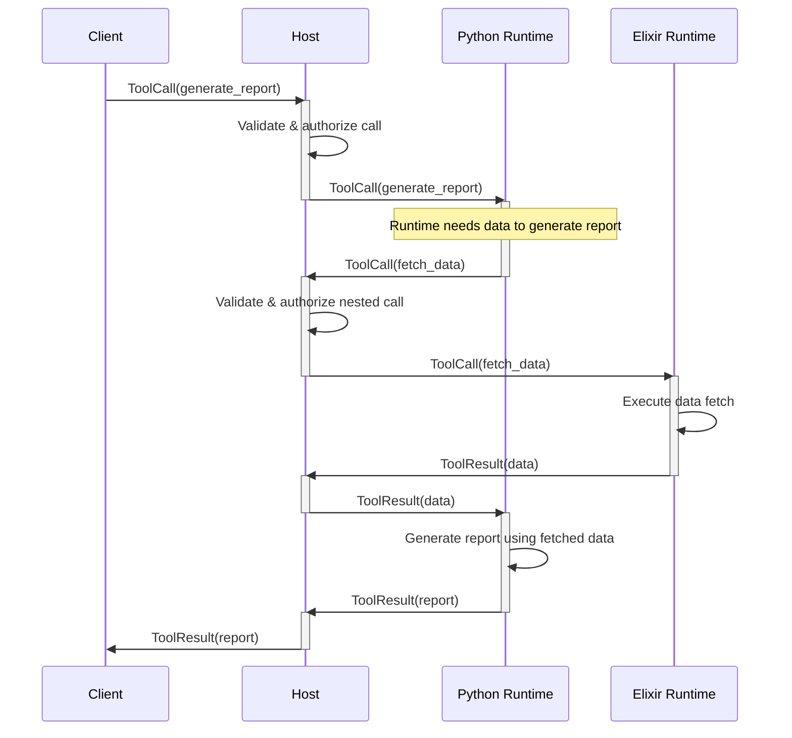
```mermaid
sequenceDiagram
    participant C as Client
    participant H as Host
    participant PY as Python Runtime
    participant EX as Elixir Runtime

    C->>H: ToolCall(generate_report)
    activate H
    H->>H: Validate & authorize call
    H->>PY: ToolCall(generate_report)
    deactivate H
    activate PY
    
    Note over PY: Runtime needs data to generate report
    
    PY->>H: ToolCall(fetch_data)
    deactivate PY
    activate H
    H->>H: Validate & authorize nested call
    H->>EX: ToolCall(fetch_data)
    deactivate H
    activate EX
    EX->>EX: Execute data fetch
    EX->>H: ToolResult(data)
    deactivate EX
    activate H
    H->>PY: ToolResult(data)
    deactivate H
    activate PY
    
    PY->>PY: Generate report using fetched data
    PY->>H: ToolResult(report)
    deactivate PY
    activate H
    H->>C: ToolResult(report)
    deactivate H
```

#### Security and Observability Advantages

The Host-mediated approach provides several critical advantages over direct Runtime-to-Runtime communication:

**Complete Security Control:** Every tool invocation, regardless of its origin (Client or Runtime), passes through the Host's authorization and validation layer. This ensures that even nested tool calls are subject to the same security policies, preventing privilege escalation or unauthorized access.

**End-to-End Observability:** All tool interactions are visible to the Host, enabling comprehensive audit logging, performance monitoring, and debugging capabilities. Direct Runtime-to-Runtime calls would create "dark" interactions invisible to the central control plane.

**Consistent Contract Enforcement:** The Host validates all tool calls against its trusted contract manifest, ensuring that even Runtime-initiated calls conform to the expected schemas and security constraints. This prevents malicious or compromised Runtimes from bypassing validation by calling tools directly.

**Simplified Network Architecture:** By maintaining the hub-and-spoke communication model, GRID avoids the complexity of mesh networking between Runtimes, reducing attack surface and simplifying firewall rules and network security policies.

This pattern enables sophisticated tool composition while maintaining the enterprise-grade security and governance guarantees that are fundamental to GRID's value proposition.

### 8.2. Implementing Stateful Services as Tools

Traditional stateful services—such as session managers, configuration stores, or workflow engines—can be seamlessly integrated into the ALTAR ecosystem by exposing their functionality through formal tool contracts. This pattern transforms stateful logic into securable, auditable runtimes that fulfill Host-managed contracts, bringing enterprise-grade governance to services that would otherwise operate outside the ALTAR security model.

By implementing stateful services as tools, organizations gain centralized control over state management operations, comprehensive audit trails of all state modifications, and the ability to apply consistent security policies across both stateless and stateful components of their AI agent infrastructure.

#### Conceptual Implementation Approach

Stateful services should expose their core operations through well-defined ADM FunctionDeclaration contracts. The service's internal state management remains encapsulated within the Runtime, while the ALTAR ecosystem interacts with the service exclusively through validated, Host-authorized tool calls.

Consider a simple variable storage service that maintains key-value pairs across multiple agent sessions. Rather than providing direct database access or REST endpoints, this service would expose its functionality through formal tool contracts:

**Variable Retrieval Tool Contract:**

```json
{
  "name": "get_variable",
  "description": "Retrieves the current value of a named variable from the stateful storage service",
  "parameters": {
    "type": "object",
    "properties": {
      "variable_name": {
        "type": "string",
        "description": "The unique identifier for the variable to retrieve",
        "pattern": "^[a-zA-Z][a-zA-Z0-9_]*$"
      },
      "scope": {
        "type": "string",
        "enum": ["session", "user", "global"],
        "description": "The scope within which to look for the variable",
        "default": "session"
      },
      "default_value": {
        "type": "string",
        "description": "Optional default value to return if the variable does not exist"
      }
    },
    "required": ["variable_name"]
  }
}
```

**Variable Storage Tool Contract:**

```json
{
  "name": "set_variable",
  "description": "Stores or updates the value of a named variable in the stateful storage service",
  "parameters": {
    "type": "object",
    "properties": {
      "variable_name": {
        "type": "string",
        "description": "The unique identifier for the variable to store or update",
        "pattern": "^[a-zA-Z][a-zA-Z0-9_]*$"
      },
      "value": {
        "type": "string",
        "description": "The value to store for this variable"
      },
      "scope": {
        "type": "string",
        "enum": ["session", "user", "global"],
        "description": "The scope within which to store the variable",
        "default": "session"
      },
      "ttl_seconds": {
        "type": "integer",
        "description": "Optional time-to-live in seconds after which the variable should expire",
        "minimum": 1
      }
    },
    "required": ["variable_name", "value"]
  }
}
```

#### Security and Governance Benefits

When stateful services are implemented as ALTAR tools, they automatically inherit the full security and governance capabilities of the GRID protocol:

**Centralized Authorization:** All state access operations flow through the Host's authorization layer, enabling fine-grained access control policies. For example, an organization can enforce that only specific agent roles can modify global variables, while session-scoped variables remain accessible only within their originating session context.

**Complete Audit Trail:** Every state modification becomes a logged, traceable tool invocation with full context about the requesting agent, session, and security principal. This provides unprecedented visibility into how AI agents interact with persistent state, supporting compliance requirements and debugging complex multi-agent workflows.

**Contract-Based Validation:** The Host validates all state operations against trusted schemas before execution, preventing malformed requests from corrupting the service's internal state. This validation layer acts as a robust API gateway specifically designed for AI agent interactions.

**Runtime Isolation:** The stateful service operates as an independent Runtime, allowing it to be scaled, monitored, and maintained separately from other system components. This isolation prevents state management concerns from affecting the performance or reliability of other tools in the ecosystem.

By adopting this pattern, organizations can maintain the benefits of stateful services—persistence, consistency, and complex business logic—while ensuring these services operate within ALTAR's enterprise-grade security and governance framework. The result is a unified approach to both stateless and stateful tool management that scales from simple variable storage to sophisticated workflow orchestration systems.

## 8. Compliance Levels

To facilitate interoperability and gradual adoption, GRID defines several compliance levels. These levels are designed to maintain backward compatibility while enabling progressive adoption of advanced features. **All new features introduced in this specification are marked as Level 2+ to preserve the simplicity and stability of the core protocol.**

### 8.1. Level 1 (Core) - Baseline Compatibility

**Level 1** represents the minimal, compliant implementation that forms the foundation of the GRID protocol. All GRID implementations MUST support Level 1 features to ensure basic interoperability and maintain the core protocol's simplicity.

**Required Features:**
-   Must implement `AnnounceRuntime`, `FulfillTools` messages for runtime connection and capability declaration
-   Must support the synchronous `ToolCall` -> `ToolResult` flow for basic tool execution
-   Must implement `CreateSession` and `DestroySession` for session lifecycle management
-   Must use and validate ADM structures for all tool-related payloads (`FunctionCall`, `ToolResult`, etc.)
-   Must support both STRICT and DEVELOPMENT operational modes (see Section 2.3)
-   Must implement basic `Error` message structure for error reporting

**Explicitly Excluded from Level 1:**
The following features are **NOT** required for Level 1 compliance to maintain core protocol simplicity:
-   Dynamic tool registration (`RegisterToolsRequest`/`RegisterToolsResponse` messages)
-   Governed local dispatch (`AuthorizeToolCallRequest`/`LogToolResultRequest` messages)
-   Streaming capabilities (`StreamChunk` messages)
-   Enhanced error structures (`EnhancedError` messages)
-   Advanced security contexts (`SecurityContext` messages)
-   Correlation ID tracking and end-to-end tracing

**Backward Compatibility Guarantee:**
All future GRID protocol versions MUST maintain full backward compatibility with Level 1 implementations. This guarantee ensures that:
- Level 1 clients MUST be able to connect to and interact with Level 2+ Hosts
- Level 1 Hosts MUST be able to accept connections from Level 2+ Runtimes
- New features are always additive and optional
- Core protocol behavior remains stable and predictable
- Existing Level 1 implementations continue to work without modification

**Target Use Cases:**
- Basic tool execution scenarios
- Simple development and testing environments
- Minimal resource footprint deployments
- Foundation for building more advanced implementations
- Legacy system integration where simplicity is paramount

### 8.2. Level 2 (Enhanced) - Production-Ready Features

**Level 2** builds upon Level 1 with enhanced features suitable for production deployments. **All new features introduced in this specification revision are classified as Level 2+ to maintain the core protocol's simplicity and ensure existing Level 1 implementations remain fully functional.**

**Required Features (All Level 1 features plus):**
-   Must implement the `StreamChunk` message for streaming results from long-running tools
-   Must support the `SecurityContext` message for multi-tenancy and advanced authorization
-   Must implement `EnhancedError` message structure with detailed error context and remediation guidance
-   Must support correlation ID tracking across all message flows for end-to-end traceability
-   Should implement circuit breaker patterns for resilient error handling

**New Level 2+ Features (Introduced in this specification):**
All features marked as "Level 2+" in this document are optional enhancements that preserve Level 1 compatibility:

-   **Dynamic Tool Registration (Level 2+):** Support for `RegisterToolsRequest`/`RegisterToolsResponse` messages enabling DEVELOPMENT mode dynamic tool registration
-   **Governed Local Dispatch (Level 2+):** Support for `AuthorizeToolCallRequest`/`AuthorizeToolCallResponse` and `LogToolResultRequest`/`LogToolResultResponse` messages for zero-latency execution with full security
-   **Enhanced Protocol Messages (Level 2+):** Extended message schemas with additional metadata and context fields
-   **Advanced Error Handling (Level 2+):** Enhanced circuit breaker implementations with configurable thresholds and detailed remediation guidance
-   **Performance Optimizations (Level 2+):** Authorization caching, connection pooling, and co-location strategies
-   **Development Workflow Patterns (Level 2+):** Multi-language development support and rapid iteration capabilities

**Backward Compatibility Guarantee:**
Level 2 implementations MUST gracefully degrade when communicating with Level 1 implementations:
- Optional Level 2+ features MUST be negotiated during the connection handshake
- Implementations MUST fall back to Level 1 behavior when advanced features are not supported by the peer
- All Level 2+ message types MUST be handled gracefully by Level 1 implementations (typically by returning appropriate error responses)
- Core protocol flows MUST remain unchanged to ensure Level 1 compatibility

**Target Use Cases:**
- Production deployments requiring streaming capabilities
- Multi-tenant environments with advanced security requirements
- High-performance scenarios requiring governed local dispatch optimization
- Development environments requiring dynamic tool registration
- Organizations needing enhanced observability and error handling

### 8.3. Level 3 (Enterprise) - Comprehensive Governance

**Level 3** represents a full-featured, high-security implementation suitable for regulated environments. Compliance for this level is defined by the separate **AESP (ALTAR Enterprise Security Profile)**, which is structured into incremental tiers (Foundation, Advanced, and Complete) to facilitate adoption.

**Enterprise Requirements:**
AESP mandates a comprehensive control plane architecture for identity, policy, audit, and governance. Level 3 compliance requires implementation of enterprise-specific message extensions and security controls as defined in the AESP specification.

**Reference:**
See: `aesp.md` for the complete AESP specification and its compliance tiers.

### 8.4. Compliance Level Progression Path

Organizations can adopt GRID incrementally by following this structured progression path. **This approach ensures that existing Level 1 implementations remain fully functional while providing clear upgrade paths to advanced features.**

#### 8.4.1. Level 1 → Level 2 Migration

**Prerequisites:**
- Stable Level 1 implementation in production with proven reliability
- Business requirements for streaming, advanced security, or performance optimization
- Development team familiar with GRID core concepts and operational patterns
- Adequate testing infrastructure to validate backward compatibility

**Detailed Migration Steps:**

1. **Assessment and Planning Phase:**
   - **Compatibility Audit:** Thoroughly audit current Level 1 implementation for compliance with core protocol requirements
   - **Feature Requirements Analysis:** Identify which Level 2+ features are needed for your specific use cases
   - **Risk Assessment:** Evaluate potential impact on existing Level 1 clients and runtimes
   - **Migration Timeline:** Plan for gradual feature rollout with rollback capabilities
   - **Resource Planning:** Ensure adequate development and testing resources for the migration

2. **Infrastructure Preparation:**
   - **Host Upgrade:** Upgrade Host implementation to support Level 2 message types while maintaining Level 1 compatibility
   - **Monitoring Enhancement:** Update monitoring and observability systems for correlation ID tracking and enhanced error reporting
   - **Circuit Breaker Implementation:** Implement enhanced error handling and circuit breaker patterns for resilient operation
   - **Testing Framework:** Establish comprehensive testing for both Level 1 and Level 2 functionality

3. **Core Level 2 Feature Enablement:**
   - **SecurityContext Integration:** Enable `SecurityContext` support for multi-tenant scenarios and advanced authorization
   - **Streaming Support:** Implement `StreamChunk` support for long-running tools and large result sets
   - **Enhanced Error Handling:** Add `EnhancedError` handling for better debugging, remediation guidance, and operational visibility
   - **Correlation Tracking:** Implement end-to-end correlation ID tracking for improved observability

4. **Optional Level 2+ Feature Adoption:**
   - **Governed Local Dispatch:** Evaluate and implement for performance-critical scenarios requiring zero-latency execution
   - **Dynamic Tool Registration:** Consider for development workflow improvements and rapid prototyping capabilities
   - **Performance Optimizations:** Implement authorization caching, connection pooling, and co-location strategies
   - **Development Workflow Enhancements:** Add support for multi-language development patterns and rapid iteration

5. **Validation and Rollout:**
   - **Backward Compatibility Testing:** Thoroughly test backward compatibility with existing Level 1 clients and runtimes
   - **Performance Validation:** Validate performance improvements and error handling enhancements meet requirements
   - **Gradual Rollout:** Gradually roll out Level 2 features to production environments with monitoring and rollback capabilities
   - **Documentation Updates:** Update operational documentation and runbooks for Level 2 features

**Migration Success Criteria:**
- All existing Level 1 clients continue to function without modification
- Level 2 features provide measurable improvements in target use cases
- Enhanced error handling and observability improve operational efficiency
- Performance optimizations meet or exceed expected benchmarks

#### 8.4.2. Level 2 → Level 3 (Enterprise) Migration

**Prerequisites:**
- Stable Level 2 implementation with all required enterprise features operational in production
- Formal enterprise compliance requirements (regulatory, security, audit, governance)
- Dedicated enterprise architecture, security, and compliance teams
- Executive sponsorship for enterprise-grade security and governance initiatives

**Detailed Migration Approach:**
Level 3 migration requires adoption of the AESP specification, which provides comprehensive guidance for enterprise-grade deployments. **The migration maintains full backward compatibility with Level 1 and Level 2 implementations while adding enterprise-specific enhancements.**

**AESP Tier Progression:**

1. **AESP Foundation Tier:**
   - Basic enterprise security controls and comprehensive audit logging
   - Identity provider integration and role-based access control
   - Enhanced security contexts with enterprise claims and metadata
   - Compliance with basic regulatory frameworks

2. **AESP Advanced Tier:**
   - Comprehensive policy enforcement and advanced identity integration
   - Enterprise governance controls and approval workflows
   - Advanced audit and compliance reporting capabilities
   - Integration with enterprise security infrastructure

3. **AESP Complete Tier:**
   - Full regulatory compliance for highly regulated industries
   - Advanced governance features and risk management controls
   - Complete enterprise security profile with all optional features
   - Integration with enterprise compliance and risk management systems

**Backward Compatibility Guarantee:**
Level 3 (Enterprise) implementations MUST maintain full compatibility with Level 1 and Level 2 implementations:
- All core protocol features remain unchanged
- Enterprise features are implemented as extensions, not replacements
- Level 1 and Level 2 clients can connect and operate normally
- Enterprise features gracefully degrade when not supported by peers

**Reference:**
See `aesp.md` Section 6 - Migration and Adoption Guidance for detailed enterprise migration procedures, compliance mapping, and regulatory framework integration.

#### 8.4.3. Backward Compatibility Guarantees for Existing Level 1 Implementations

**Comprehensive Compatibility Assurance:**
GRID provides strong backward compatibility guarantees to protect existing investments in Level 1 implementations. These guarantees ensure that organizations can upgrade their GRID infrastructure without disrupting existing applications or requiring immediate client updates.

**Core Protocol Stability:**
- **Message Structure Preservation:** All Level 1 message structures remain unchanged and fully supported
- **Behavioral Consistency:** Core protocol behaviors (handshake, tool execution, session management) remain identical
- **API Compatibility:** Existing client libraries and integrations continue to work without modification
- **Performance Characteristics:** Level 1 performance characteristics are preserved or improved, never degraded

**Interaction Guarantees:**
- **Level 1 Client ↔ Level 2+ Host:** Level 1 clients can connect to and fully utilize Level 2+ Hosts using core protocol features
- **Level 1 Host ↔ Level 2+ Runtime:** Level 1 Hosts can accept and manage Level 2+ Runtimes, utilizing their Level 1 capabilities
- **Mixed Environment Support:** Environments with mixed compliance levels operate seamlessly with automatic feature negotiation

**Feature Addition Principles:**
- **Additive Only:** All new features are strictly additive; no existing features are modified or removed
- **Optional by Default:** New features are optional and do not affect core protocol operation
- **Graceful Degradation:** Higher-level implementations automatically detect and accommodate lower-level peers
- **No Breaking Changes:** Protocol evolution never introduces breaking changes to Level 1 functionality

**Operational Continuity:**
- **Zero-Downtime Upgrades:** Level 1 implementations can be upgraded to Level 2+ without service interruption
- **Rollback Safety:** Implementations can be safely rolled back from Level 2+ to Level 1 if needed
- **Configuration Compatibility:** Level 1 configurations remain valid and functional in Level 2+ implementations
- **Monitoring Continuity:** Existing monitoring and observability systems continue to function with Level 2+ implementations

**Long-Term Support Commitment:**
- **Indefinite Level 1 Support:** Level 1 compatibility will be maintained indefinitely across all future protocol versions
- **Security Updates:** Level 1 implementations receive security updates and critical bug fixes
- **Documentation Maintenance:** Level 1 documentation and examples are maintained alongside advanced features
- **Community Support:** Level 1 implementations remain fully supported by the GRID community and ecosystem

This comprehensive backward compatibility framework ensures that organizations can confidently adopt GRID at Level 1 and upgrade incrementally as their requirements evolve, without fear of obsolescence or forced migration.

### 8.5. Version Negotiation and Feature Discovery

GRID implementations MUST support capability negotiation to ensure optimal feature utilization while maintaining compatibility:

#### 8.5.1. Capability Advertisement

During the `AnnounceRuntime` handshake, implementations SHOULD advertise their supported compliance level and optional features:

```idl
message AnnounceRuntime {
  string runtime_id = 1;
  string language = 2;
  string version = 3;
  repeated string capabilities = 4;  // e.g., ["level-2", "streaming", "local-dispatch"]
  map<string, string> metadata = 5;
  
  // Level 2+ fields
  ComplianceLevel compliance_level = 6;  // Highest supported level
  repeated string optional_features = 7; // Supported optional features
}

enum ComplianceLevel {
  LEVEL_1_CORE = 0;
  LEVEL_2_ENHANCED = 1;
  LEVEL_3_ENTERPRISE = 2;
}
```

#### 8.5.2. Feature Negotiation

Hosts SHOULD respond with the negotiated feature set based on mutual capabilities:

```idl
message AnnounceRuntimeResponse {
  string connection_id = 1;
  repeated string available_contracts = 2;
  string correlation_id = 3;
  
  // Level 2+ fields
  ComplianceLevel negotiated_level = 4;    // Agreed-upon compliance level
  repeated string enabled_features = 5;    // Features enabled for this connection
  map<string, string> feature_config = 6; // Feature-specific configuration
}
```

#### 8.5.3. Graceful Degradation

When implementations with different compliance levels interact:

1. **Feature Detection:** Higher-level implementations MUST detect lower-level peers during handshake
2. **Automatic Fallback:** Advanced features MUST be automatically disabled when not supported by the peer
3. **Error Handling:** Unsupported message types MUST result in clear error responses, not connection failures
4. **Logging:** Feature degradation events SHOULD be logged for monitoring and debugging

**Example Degradation Scenarios:**
- Level 2 Host with Level 1 Runtime: Streaming and SecurityContext features disabled
- Level 2 Runtime with Level 1 Host: Enhanced error reporting and correlation tracking disabled
- Level 3 implementation with Level 1/2 peers: Enterprise features disabled, fallback to appropriate level

This progressive compliance model ensures that GRID can evolve to meet enterprise requirements while maintaining broad compatibility and enabling incremental adoption across diverse deployment scenarios.

## 9. Migration and Version Negotiation

This section provides comprehensive guidance for upgrading existing GRID implementations, managing protocol evolution, and ensuring compatibility across different versions and compliance levels.

### 9.1. Protocol Version Evolution Strategy

GRID follows a structured approach to protocol evolution that prioritizes backward compatibility while enabling innovation:

#### 9.1.1. Version Numbering Scheme

GRID uses semantic versioning (MAJOR.MINOR.PATCH) with specific compatibility guarantees:

- **MAJOR version** changes indicate breaking changes that may require implementation updates
- **MINOR version** changes add new features while maintaining backward compatibility
- **PATCH version** changes include bug fixes and clarifications without functional changes

**Current Version:** 1.0.0 (as specified in this document)

#### 9.1.2. Compatibility Matrix

| Host Version | Runtime Version | Compatibility Level | Notes |
|--------------|-----------------|-------------------|-------|
| 1.x | 1.x | Full | Complete feature compatibility |
| 1.x | 1.y (y > x) | Degraded | Runtime features limited to Host capabilities |
| 1.y (y > x) | 1.x | Enhanced | Host provides backward compatibility |
| 2.x | 1.x | Limited | Major version compatibility via negotiation |

#### 9.1.3. Protocol Evolution Principles

1. **Additive Changes Only:** New features MUST be added as optional extensions
2. **Graceful Degradation:** Implementations MUST handle unsupported features gracefully
3. **Clear Deprecation Path:** Deprecated features MUST have documented migration paths
4. **Negotiated Capabilities:** Feature availability MUST be negotiated during handshake

### 9.2. Step-by-Step Upgrade Procedures

#### 9.2.1. Host Upgrade Procedure

**Pre-Upgrade Assessment:**
1. **Inventory Current Deployment:**
   - Document current Host version and configuration
   - Identify connected Runtime versions and capabilities
   - Catalog active sessions and tool contracts
   - Review monitoring and alerting configurations

2. **Compatibility Analysis:**
   - Verify new Host version compatibility with existing Runtimes
   - Identify features that will be enabled/disabled after upgrade
   - Plan for any required Runtime upgrades
   - Assess impact on existing client applications

**Upgrade Execution:**
1. **Preparation Phase:**
   ```bash
   # Backup current configuration
   cp /etc/grid/host.conf /etc/grid/host.conf.backup
   cp /etc/grid/tool_manifest.json /etc/grid/tool_manifest.json.backup
   
   # Verify backup integrity
   grid-host validate-config --config /etc/grid/host.conf.backup
   ```

2. **Staged Deployment:**
   ```bash
   # Deploy new Host version to staging environment
   grid-host deploy --version 1.1.0 --environment staging
   
   # Run compatibility tests with existing Runtimes
   grid-test compatibility --host-version 1.1.0 --runtime-versions 1.0.0,1.0.5
   
   # Validate feature negotiation
   grid-test negotiation --scenarios level1-to-level2,mixed-versions
   ```

3. **Production Rollout:**
   ```bash
   # Rolling upgrade with health checks
   grid-host upgrade --version 1.1.0 --strategy rolling --health-check-interval 30s
   
   # Monitor compatibility during upgrade
   grid-monitor compatibility --alert-on-degradation
   ```

4. **Post-Upgrade Validation:**
   ```bash
   # Verify all Runtimes reconnected successfully
   grid-host status --show-runtimes
   
   # Test tool execution across compliance levels
   grid-test execution --comprehensive
   
   # Validate new features are working
   grid-test features --level 2 --optional-features streaming,local-dispatch
   
   # Verify backward compatibility with existing clients
   grid-test backward-compatibility --client-versions 1.0.0,1.0.5
   
   # Check performance metrics
   grid-monitor performance --baseline-comparison --duration 1h
   
   # Validate security policies still enforced
   grid-test security --policy-validation --rbac-checks
   ```

**Detailed Host Upgrade Checklist:**
- [ ] **Pre-upgrade backup completed and verified**
- [ ] **Compatibility matrix reviewed for all connected components**
- [ ] **Staging environment upgrade tested successfully**
- [ ] **Rollback procedures tested and ready**
- [ ] **Monitoring and alerting enhanced for upgrade period**
- [ ] **Stakeholder communication completed**
- [ ] **Maintenance window scheduled and communicated**
- [ ] **Support team on standby during upgrade window**
- [ ] **All Runtimes inventory documented with versions**
- [ ] **Client applications inventory completed**
- [ ] **Performance baseline metrics captured**
- [ ] **Security policy validation completed**
- [ ] **Post-upgrade validation plan prepared**
- [ ] **Emergency contact list updated and accessible**

#### 9.2.2. Runtime Upgrade Procedure

**Pre-Upgrade Assessment:**
1. **Runtime Inventory:**
   - Document current Runtime versions and fulfilled tools
   - Identify Host compatibility requirements
   - Review tool implementation dependencies
   - Plan for session migration if required

2. **Impact Analysis:**
   - Assess which tools will benefit from new features
   - Identify any breaking changes in tool interfaces
   - Plan for gradual feature adoption
   - Coordinate with Host upgrade timeline

**Upgrade Execution:**
1. **Development Environment Testing:**
   ```python
   # Python Runtime upgrade example
   # Update GRID client library
   pip install altar-grid-client==1.1.0
   
   # Test compatibility with existing tools
   python -m altar.grid.test compatibility --tools-manifest tools.json
   
   # Validate new features
   python -m altar.grid.test features --streaming --local-dispatch
   ```

2. **Staged Runtime Deployment:**
   ```bash
   # Deploy updated Runtime to staging
   altar-runtime deploy --version 1.1.0 --environment staging
   
   # Test connection to production Host
   altar-runtime test-connection --host production-grid-host:9090
   
   # Validate tool fulfillment
   altar-runtime test-fulfillment --tools all
   ```

3. **Production Migration:**
   ```bash
   # Graceful Runtime replacement
   altar-runtime replace --old-instance runtime-1.0.0 --new-instance runtime-1.1.0
   
   # Monitor session migration
   altar-monitor sessions --runtime-id python-runtime-001
   
   # Validate tool fulfillment after migration
   altar-runtime test-fulfillment --runtime-id python-runtime-001 --all-tools
   
   # Check performance impact
   altar-monitor performance --runtime-id python-runtime-001 --duration 30m
   
   # Verify new features are available
   altar-runtime test-features --runtime-id python-runtime-001 --level 2
   ```

**Detailed Runtime Upgrade Checklist:**
- [ ] **Runtime dependencies updated and tested**
- [ ] **Tool implementations validated with new Runtime version**
- [ ] **Host compatibility verified for target Runtime version**
- [ ] **Session migration strategy planned and tested**
- [ ] **Tool manifest updated if required**
- [ ] **Performance impact assessment completed**
- [ ] **Security context handling validated**
- [ ] **Error handling and logging verified**
- [ ] **Monitoring integration tested**
- [ ] **Rollback procedure for Runtime prepared**
- [ ] **Tool-specific configuration reviewed**
- [ ] **Integration tests with Host completed**
- [ ] **Load testing completed in staging**
- [ ] **Documentation updated for new features**

#### 9.2.3. Client Application Upgrade Procedure

**Pre-Upgrade Assessment:**
1. **Client Application Inventory:**
   - Document all client applications using GRID
   - Identify GRID client library versions in use
   - Review tool usage patterns and dependencies
   - Assess impact of new features on application logic

2. **Compatibility Planning:**
   - Verify client library compatibility with upgraded Hosts
   - Identify applications that can benefit from new features
   - Plan for gradual feature adoption in client code
   - Coordinate upgrade timeline with Host/Runtime upgrades

**Upgrade Execution:**
1. **Development Environment Testing:**
   ```python
   # Python client upgrade example
   # Update GRID client library
   pip install altar-grid-client==1.1.0
   
   # Test existing functionality
   python -m altar.grid.client.test compatibility --existing-code
   
   # Test new features
   python -m altar.grid.client.test features --streaming --enhanced-errors
   
   # Validate session management
   python -m altar.grid.client.test sessions --create-destroy-cycle
   ```

2. **Application Code Updates:**
   ```python
   # Example client code migration
   from altar.grid.client import GridClient, ComplianceLevel
   
   # Enhanced client initialization with version negotiation
   client = GridClient(
       host_endpoint="grid-host:9090",
       compliance_level=ComplianceLevel.LEVEL_2,
       features=["streaming", "enhanced-errors"],
       fallback_to_level_1=True  # Graceful degradation
   )
   
   # Use new enhanced error handling
   try:
       result = client.call_tool("complex_analysis", large_dataset)
   except GridEnhancedError as e:
       # Access enhanced error information
       logger.error(f"Tool execution failed: {e.message}")
       logger.info(f"Remediation steps: {e.remediation_steps}")
       logger.info(f"Documentation: {e.documentation_url}")
       
       # Implement retry logic based on error guidance
       if e.retry_allowed:
           time.sleep(e.retry_after_ms / 1000)
           result = client.call_tool("complex_analysis", large_dataset)
   ```

3. **Staged Application Deployment:**
   ```bash
   # Deploy updated application to staging
   app-deploy --version 2.1.0 --environment staging --grid-features level-2
   
   # Test integration with upgraded GRID infrastructure
   app-test integration --grid-host staging-grid-host:9090
   
   # Validate new feature usage
   app-test features --streaming --enhanced-errors --local-dispatch
   
   # Performance testing with new features
   app-test performance --load-profile production-like --duration 1h
   ```

4. **Production Rollout:**
   ```bash
   # Gradual application rollout
   app-deploy --version 2.1.0 --environment production --rollout-strategy canary
   
   # Monitor application performance with new GRID features
   app-monitor --metrics-dashboard --alert-on-degradation
   
   # Validate feature utilization
   app-monitor grid-features --usage-metrics --performance-impact
   ```

**Detailed Client Upgrade Checklist:**
- [ ] **Client library dependencies updated and tested**
- [ ] **Application code reviewed for compatibility**
- [ ] **New feature integration planned and implemented**
- [ ] **Error handling updated for enhanced error structures**
- [ ] **Session management code validated**
- [ ] **Performance impact of new features assessed**
- [ ] **Security context handling updated if required**
- [ ] **Integration tests with upgraded GRID infrastructure completed**
- [ ] **User acceptance testing completed**
- [ ] **Documentation updated for new client features**
- [ ] **Monitoring and logging enhanced for new features**
- [ ] **Rollback procedure for client applications prepared**
- [ ] **Training provided to development teams**
- [ ] **Support procedures updated for new features**

#### 9.2.4. Coordinated Multi-Component Upgrade

For complex GRID deployments with multiple Hosts, Runtimes, and client applications, a coordinated upgrade approach ensures system-wide compatibility:

**Upgrade Sequence Strategy:**
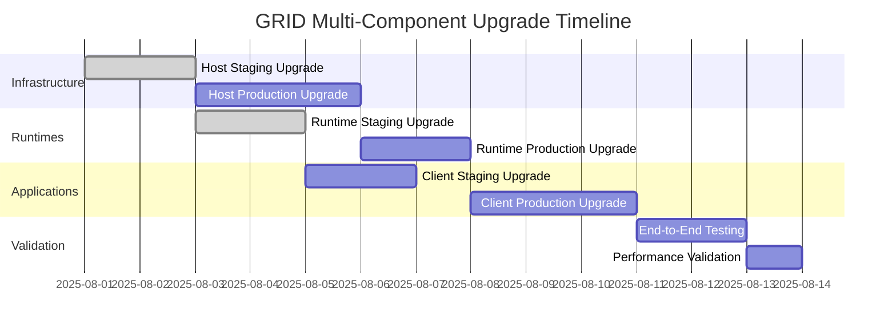
```mermaid
gantt
    title GRID Multi-Component Upgrade Timeline
    dateFormat  YYYY-MM-DD
    section Infrastructure
    Host Staging Upgrade    :done, host-staging, 2025-08-01, 2025-08-03
    Host Production Upgrade :host-prod, after host-staging, 3d
    section Runtimes
    Runtime Staging Upgrade :done, rt-staging, after host-staging, 2025-08-05
    Runtime Production Upgrade :rt-prod, after host-prod, 2d
    section Applications
    Client Staging Upgrade  :client-staging, after rt-staging, 2d
    Client Production Upgrade :client-prod, after rt-prod, 3d
    section Validation
    End-to-End Testing     :e2e-test, after client-prod, 2d
    Performance Validation :perf-test, after e2e-test, 1d
```

**Coordinated Upgrade Procedure:**
1. **Phase 1: Infrastructure Foundation (Hosts)**
   ```bash
   # Upgrade Hosts first to ensure backward compatibility
   for host in $(grid-cluster list-hosts); do
     grid-host upgrade --id $host --version 1.1.0 --wait-for-ready
     grid-test host-health --id $host --comprehensive
   done
   ```

2. **Phase 2: Runtime Layer**
   ```bash
   # Upgrade Runtimes after Host stability confirmed
   for runtime in $(grid-cluster list-runtimes); do
     grid-runtime upgrade --id $runtime --version 1.1.0 --graceful
     grid-test runtime-integration --id $runtime --with-hosts
   done
   ```

3. **Phase 3: Client Applications**
   ```bash
   # Upgrade client applications last
   for app in $(app-cluster list-grid-clients); do
     app-upgrade --id $app --grid-version 1.1.0 --feature-negotiation
     app-test grid-integration --id $app --comprehensive
   done
   ```

4. **Phase 4: System-Wide Validation**
   ```bash
   # End-to-end system validation
   grid-test system-wide --all-components --feature-matrix
   grid-monitor system-health --duration 24h --alert-on-issues
   ```

**Coordination Checklist:**
- [ ] **Upgrade sequence planned and documented**
- [ ] **Component dependencies mapped and validated**
- [ ] **Cross-component compatibility matrix verified**
- [ ] **Rollback procedures coordinated across all components**
- [ ] **Monitoring enhanced for multi-component visibility**
- [ ] **Communication plan for coordinated maintenance windows**
- [ ] **Emergency procedures for partial upgrade failures**
- [ ] **Performance baselines captured for all components**
- [ ] **Security validation across upgraded components**
- [ ] **End-to-end testing scenarios prepared**
- [ ] **Stakeholder communication and approval obtained**
- [ ] **Support team coordination for upgrade period**

### 9.3. Version Negotiation Patterns

#### 9.3.1. Capability-Based Negotiation

GRID implements sophisticated capability negotiation to optimize feature utilization:

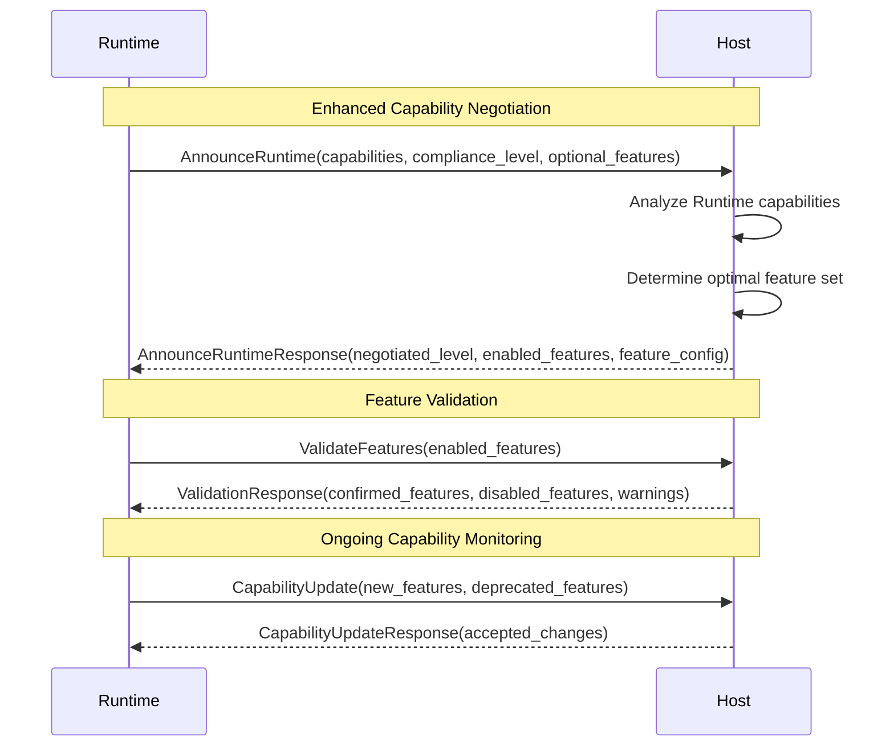
```mermaid
sequenceDiagram
    participant RT as Runtime
    participant H as Host

    Note over RT,H: Enhanced Capability Negotiation
    RT->>H: AnnounceRuntime(capabilities, compliance_level, optional_features)
    H->>H: Analyze Runtime capabilities
    H->>H: Determine optimal feature set
    H-->>RT: AnnounceRuntimeResponse(negotiated_level, enabled_features, feature_config)
    
    Note over RT,H: Feature Validation
    RT->>H: ValidateFeatures(enabled_features)
    H-->>RT: ValidationResponse(confirmed_features, disabled_features, warnings)
    
    Note over RT,H: Ongoing Capability Monitoring
    RT->>H: CapabilityUpdate(new_features, deprecated_features)
    H-->>RT: CapabilityUpdateResponse(accepted_changes)
```

#### 9.3.2. Dynamic Feature Negotiation

For long-running connections, GRID supports dynamic capability updates:

```idl
// Sent by Runtime to update its capabilities during runtime
message CapabilityUpdate {
  string runtime_id = 1;
  repeated string new_features = 2;        // Newly available features
  repeated string deprecated_features = 3; // Features being phased out
  string reason = 4;                       // Reason for capability change
  uint64 effective_timestamp = 5;         // When changes take effect
}

// Host response to capability updates
message CapabilityUpdateResponse {
  enum Status {
    ACCEPTED = 0;      // All changes accepted
    PARTIAL = 1;       // Some changes accepted
    REJECTED = 2;      // Changes rejected
  }
  Status status = 1;
  repeated string accepted_features = 2;
  repeated string rejected_features = 3;
  repeated EnhancedError errors = 4;
  uint64 next_review_timestamp = 5;  // When to retry rejected features
}
```

#### 9.3.3. Version Compatibility Negotiation

When different protocol versions interact, GRID uses structured negotiation:

```idl
// Extended AnnounceRuntime with version negotiation
message AnnounceRuntime {
  // ... existing fields ...
  
  // Version negotiation fields
  string protocol_version = 10;           // Preferred protocol version
  repeated string supported_versions = 11; // All supported versions
  map<string, string> version_preferences = 12; // Version-specific preferences
}

// Enhanced response with negotiated version
message AnnounceRuntimeResponse {
  // ... existing fields ...
  
  // Negotiated version information
  string negotiated_version = 10;         // Agreed-upon protocol version
  repeated string available_features = 11; // Features available in negotiated version
  map<string, string> version_config = 12; // Version-specific configuration
}
```

### 9.4. Rollback Procedures and Compatibility Testing

#### 9.4.1. Rollback Strategy

GRID implementations MUST support safe rollback procedures to handle upgrade failures:

**Automated Rollback Triggers:**
- Connection failure rate exceeds threshold (default: 10% over 5 minutes)
- Tool execution error rate increases significantly (default: 5x baseline)
- Memory or CPU usage exceeds safety limits
- Critical feature negotiation failures

**Rollback Execution:**
```bash
# Automated rollback procedure
grid-host rollback --to-version 1.0.0 --reason "compatibility-failure"

# Verify rollback success
grid-host status --verify-rollback

# Restore backed-up configuration
grid-host restore-config --backup-timestamp 2025-08-09T10:00:00Z

# Validate system health post-rollback
grid-test health --comprehensive
```

#### 9.4.2. Compatibility Testing Framework

**Pre-Deployment Testing:**
```yaml
# compatibility-test-suite.yaml
test_scenarios:
  - name: "Level 1 Host with Level 2 Runtime"
    host_version: "1.0.0"
    runtime_version: "1.1.0"
    expected_features: ["basic-execution", "session-management"]
    disabled_features: ["streaming", "enhanced-errors"]
    
  - name: "Level 2 Host with Level 1 Runtime"
    host_version: "1.1.0"
    runtime_version: "1.0.0"
    expected_features: ["basic-execution", "session-management"]
    graceful_degradation: true
    
  - name: "Mixed Version Environment"
    host_version: "1.1.0"
    runtime_versions: ["1.0.0", "1.0.5", "1.1.0"]
    test_scenarios: ["feature-negotiation", "load-balancing", "error-handling"]
```

**Continuous Compatibility Monitoring:**
```bash
# Ongoing compatibility monitoring
grid-monitor compatibility \
  --alert-on-degradation \
  --metrics-endpoint http://monitoring.example.com/metrics \
  --test-interval 300s

# Generate compatibility reports
grid-report compatibility \
  --period 24h \
  --format json \
  --output compatibility-report.json
```

#### 9.4.3. Rollback Decision Matrix

| Failure Type | Automatic Rollback | Manual Intervention | Monitoring Required |
|--------------|-------------------|-------------------|-------------------|
| Connection failures > 10% | Yes | No | 5 minutes |
| Tool execution errors > 5x baseline | Yes | No | 10 minutes |
| Memory usage > 90% | Yes | No | Immediate |
| Feature negotiation failures | No | Yes | Manual review |
| Performance degradation > 50% | No | Yes | 30 minutes |
| Security policy violations | Yes | No | Immediate |

### 9.5. Migration Best Practices

#### 9.5.1. Planning and Preparation

**Migration Checklist:**
- [ ] Complete compatibility assessment between current and target versions
- [ ] Identify all affected components (Hosts, Runtimes, clients)
- [ ] Plan migration sequence (Hosts first, then Runtimes, then clients)
- [ ] Prepare rollback procedures and test them in staging
- [ ] Set up enhanced monitoring for migration period
- [ ] Coordinate with stakeholders on maintenance windows
- [ ] Document expected feature changes and impacts

**Risk Mitigation:**
- Always test migrations in staging environments first
- Use blue-green deployment strategies for critical systems
- Implement circuit breakers and automatic rollback triggers
- Maintain detailed logs throughout the migration process
- Have dedicated support team available during migration windows

#### 9.5.2. Post-Migration Validation

**Validation Checklist:**
- [ ] All Runtimes successfully reconnected to upgraded Hosts
- [ ] Tool execution success rates match pre-migration baselines
- [ ] New features are working as expected
- [ ] Performance metrics are within acceptable ranges
- [ ] Error rates have not increased significantly
- [ ] Security policies are still being enforced correctly
- [ ] Monitoring and alerting systems are functioning properly

**Long-term Monitoring:**
- Track compatibility metrics for at least 30 days post-migration
- Monitor for any delayed compatibility issues
- Collect feedback from development teams using the upgraded system
- Document lessons learned for future migrations
- Update migration procedures based on experience

### 9.6. Advanced Migration Scenarios

#### 9.6.1. Multi-Environment Migration Strategy

For organizations with complex deployment topologies, GRID supports coordinated multi-environment migrations:

**Environment Progression:**
1. **Development Environment:** Test new features and validate tool compatibility
2. **Staging Environment:** Full integration testing with production-like data and load
3. **Canary Production:** Limited production deployment to validate real-world performance
4. **Full Production:** Complete rollout with monitoring and rollback capabilities

**Cross-Environment Compatibility:**
```yaml
# migration-strategy.yaml
environments:
  development:
    grid_version: "1.1.0"
    features: ["all-level-2", "experimental"]
    rollback_policy: "immediate"
    
  staging:
    grid_version: "1.1.0"
    features: ["level-2-stable"]
    rollback_policy: "automatic-on-failure"
    
  production:
    grid_version: "1.0.0" # Upgraded after staging validation
    features: ["level-1-only"]
    rollback_policy: "manual-approval-required"
    
migration_sequence:
  - phase: "development"
    duration: "1-2 weeks"
    success_criteria: ["all-tests-pass", "performance-baseline"]
    
  - phase: "staging"
    duration: "1 week"
    success_criteria: ["integration-tests-pass", "load-tests-pass"]
    
  - phase: "canary-production"
    duration: "3-5 days"
    traffic_percentage: 10
    success_criteria: ["error-rate-stable", "performance-acceptable"]
    
  - phase: "full-production"
    duration: "1-2 weeks"
    rollout_strategy: "gradual"
    success_criteria: ["all-metrics-stable"]
```

#### 9.6.2. Zero-Downtime Migration Patterns

**Blue-Green Deployment for Hosts:**
```bash
# Deploy new Host version alongside existing
grid-host deploy --version 1.1.0 --deployment-mode blue-green

# Gradually shift traffic to new version
grid-loadbalancer shift-traffic --from blue --to green --percentage 25
grid-monitor --alert-on-errors --duration 10m

# Complete migration if successful
grid-loadbalancer shift-traffic --from blue --to green --percentage 100
grid-host decommission --version 1.0.0 --wait-for-drain
```

**Rolling Runtime Updates:**
```bash
# Update Runtimes one at a time
for runtime in $(grid-host list-runtimes); do
  grid-runtime update --id $runtime --version 1.1.0 --wait-for-health
  grid-test runtime-health --id $runtime --timeout 60s
  if [ $? -ne 0 ]; then
    grid-runtime rollback --id $runtime
    exit 1
  fi
done
```

#### 9.6.3. Migration Validation and Testing

**Comprehensive Testing Framework:**
```python
# migration-test-suite.py
import altar.grid.testing as grid_test

class MigrationTestSuite:
    def test_backward_compatibility(self):
        """Ensure Level 1 clients work with Level 2 Hosts"""
        level1_client = grid_test.create_client(version="1.0.0")
        level2_host = grid_test.create_host(version="1.1.0")
        
        # Test basic tool execution
        result = level1_client.call_tool("calculate_sum", {"a": 5, "b": 3})
        assert result.success
        assert result.value == 8
        
    def test_feature_negotiation(self):
        """Verify proper feature negotiation between versions"""
        runtime = grid_test.create_runtime(
            version="1.1.0",
            features=["streaming", "local-dispatch"]
        )
        host = grid_test.create_host(version="1.0.0")
        
        connection = runtime.connect(host)
        assert "streaming" not in connection.enabled_features
        assert "local-dispatch" not in connection.enabled_features
        
    def test_rollback_scenario(self):
        """Test rollback procedures under failure conditions"""
        host = grid_test.create_host(version="1.1.0")
        
        # Simulate failure condition
        grid_test.inject_failure(host, failure_type="connection_storm")
        
        # Verify automatic rollback triggers
        rollback_result = host.check_rollback_triggers()
        assert rollback_result.should_rollback
        assert rollback_result.reason == "connection_failure_threshold_exceeded"
```

### 9.7. Protocol Evolution and Future Compatibility

#### 9.7.1. Forward Compatibility Design

GRID is designed with forward compatibility in mind to support future protocol evolution:

**Extensible Message Structure:**
- All messages include reserved fields for future extensions
- Optional fields use default values that maintain backward compatibility
- New message types are introduced as optional Level 2+ features
- Deprecated fields are marked but never removed

**Protocol Extension Points:**
```idl
// Future-proofed message structure
message FutureProofMessage {
  // Core fields (never change)
  string id = 1;
  string type = 2;
  
  // Extensible payload
  google.protobuf.Any payload = 3;
  
  // Reserved for future use
  reserved 10 to 20;
  reserved "future_field_1", "future_field_2";
  
  // Extension fields (Level 2+)
  map<string, string> extensions = 100;
}
```

#### 9.7.2. Deprecation and Sunset Policies

**Feature Deprecation Process:**
1. **Announcement:** Feature deprecation announced with 12-month notice
2. **Warning Period:** Deprecated features generate warnings but continue to work
3. **Compatibility Mode:** Deprecated features supported in compatibility mode
4. **Sunset:** Features removed only in major version updates with migration path

**Deprecation Timeline Example:**
```yaml
# deprecation-schedule.yaml
deprecated_features:
  - name: "legacy_error_format"
    deprecated_in: "1.1.0"
    warning_starts: "1.2.0"
    compatibility_until: "2.0.0"
    replacement: "enhanced_error_format"
    migration_guide: "docs/migration/error-format-upgrade.md"
    
  - name: "synchronous_only_mode"
    deprecated_in: "1.2.0"
    warning_starts: "1.3.0"
    compatibility_until: "2.0.0"
    replacement: "async_capable_mode"
    migration_guide: "docs/migration/async-upgrade.md"
```

#### 9.7.3. Long-term Compatibility Guarantees

**Commitment to Stability:**
- Level 1 compatibility maintained indefinitely across all future versions
- Core protocol behaviors never change in backward-incompatible ways
- Security updates provided for all supported versions
- Migration paths provided for all breaking changes

**Version Support Matrix:**
| Version | Support Level | End of Life | Security Updates |
|---------|---------------|-------------|------------------|
| 1.0.x | Full Support | TBD | Yes |
| 1.1.x | Full Support | TBD | Yes |
| 1.2.x | Planned | TBD | Yes |
| 2.0.x | Future | TBD | Yes |

This comprehensive migration and version negotiation framework ensures that GRID can evolve safely while maintaining the reliability and compatibility that enterprise deployments require. The framework provides clear guidance for all migration scenarios, from simple single-component upgrades to complex multi-environment rollouts, while maintaining the backward compatibility guarantees that make GRID suitable for mission-critical enterprise deployments.
