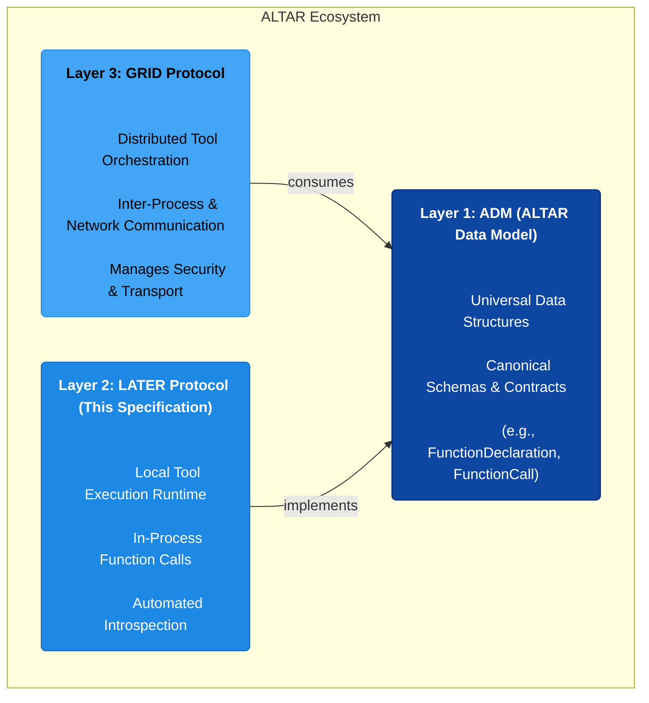

# LATER (Local Agent & Tool Execution Runtime) Protocol v1.0

**Version:** 1.0.0
**Status:** Final
**Date:** August 2025

## 1. Introduction

### 1.1. Vision & Guiding Principles

The **LATER (Local Agent & Tool Execution Runtime) Protocol** defines a language-agnostic standard for local, in-process AI tool execution. It is designed to provide a simple, introspection-first developer experience for integrating native code with AI agents, serving as the foundational layer for rapid prototyping and application-specific tooling.

LATER is governed by three core principles:

1.  **Implements the ADM:** LATER is a consumer of the **ALTAR Data Model (ADM)**. All data structures it produces and consumes (`FunctionDeclaration`, `FunctionCall`, `ToolResult`, etc.) must conform to the ADM v1.0 specification. This ensures seamless interoperability within the broader ALTAR ecosystem.
2.  **Local-First, In-Process:** The protocol is strictly for tool execution within the same application process. The specification makes no provisions for networking, serialization for transport, or inter-process communication, as these concerns are explicitly delegated to the GRID protocol.
3.  **Simplicity & Introspection:** The protocol prioritizes a simple developer experience. A compliant implementation must favor automated schema generation from native function signatures and documentation, minimizing boilerplate and manual configuration.

### 1.2. Relationship to ADM & GRID

LATER is the second layer in the three-layer ALTAR architecture, positioned between the foundational data model and the distributed execution protocol.



*   **LATER implements the ADM:** It provides a standard for *creating* and *executing* tools that are described by ADM data structures.
*   **LATER is the local companion to GRID:** Where GRID defines how tools operate across a network, LATER defines how they operate within a single process. This clear separation of concerns allows for a "promotion path" where a tool can graduate from a local LATER runtime to a distributed GRID runtime with no changes to its fundamental contract.

## 2. Abstract Protocol Definition

A LATER-compliant implementation must provide the following conceptual components and behaviors. These definitions are language-agnostic; the subsequent section provides a canonical implementation pattern in Elixir.

### 2.1. Tool Declaration Mechanism

A LATER implementation must provide an idiomatic, introspective mechanism for developers to declare native functions as AI tools.

**Requirements:**

1.  **Idiomatic Interface:** The mechanism must feel natural to the host programming language (e.g., decorators in Python, annotations in Java/C#, macros in Elixir).
2.  **Automated Schema Generation:** The mechanism **must** introspect the native function's signature and documentation to automatically generate an ADM-compliant `FunctionDeclaration` schema. This includes:
    *   **Name:** The function's name.
    *   **Description:** The function's primary documentation string.
    *   **Parameters:**
        *   An ADM `Schema` object of type `OBJECT`.
        *   `properties` derived from the function's parameter names and types. Native types must be mapped to their ADM `SchemaType` equivalents (e.g., `string` -> `STRING`, `int` -> `INTEGER`).
        *   `description` for each parameter derived from its documentation.
        *   `required` fields are inferred; parameters with default values are considered optional.
3.  **Registration:** Upon declaration, the generated `FunctionDeclaration` and a reference to the executable function (e.g., a function pointer or lambda) must be registered with the **Global Tool Definition Registry**.

### 2.2. Two-Tier Registry Architecture

LATER requires a two-tier registry system to manage the difference between a tool's definition and its availability within a specific operational context.

#### 2.2.1. Global Tool Definition Registry

*   **Scope:** Application-wide, singleton.
*   **Lifecycle:** Populated at application startup or compile-time as tools are declared. Persists for the life of the application.
*   **Contents:**
    1.  The complete, ADM-compliant `FunctionDeclaration` for every tool.
    2.  An internal reference or handle to the actual executable function.
*   **Responsibility:** Acts as the single source of truth for all tool schemas and their corresponding business logic.

#### 2.2.2. Session-Scoped Registry

*   **Scope:** Ephemeral, tied to a specific "session" or "conversation."
*   **Lifecycle:** Created when a session begins and destroyed when it ends.
*   **Contents:** A list of tool names that are active for that session. It does not store schemas directly, but rather references the tools available in the Global Registry.
*   **Responsibility:** Manages which tools are available for a given AI interaction. This allows a host application to selectively expose a subset of all globally-defined tools to the agent based on context, user permissions, or conversation state.

### 2.3. Local Tool Executor

The Executor is responsible for invoking a tool's business logic in response to an agent's request.

**Requirements:**

1.  **Lookup:** Given a `FunctionCall` from an agent, the Executor must first look up the corresponding tool in the relevant **Session-Scoped Registry** to confirm its availability.
2.  **Validation:** It must then retrieve the tool's `FunctionDeclaration` from the **Global Registry** and validate the incoming `args` from the `FunctionCall` against the parameter schema. This includes checking for required parameters, validating data types, and respecting `enum` constraints.
3.  **Invocation:** If validation succeeds, the Executor invokes the referenced native function, passing the `args` as arguments.
4.  **Response Handling:**
    *   On successful execution, it must wrap the function's return value in an ADM-compliant `ToolResult` with a `status` of `SUCCESS`.
    *   On any failure (validation error, runtime exception, etc.), it must construct a `ToolResult` with a `status` of `ERROR` and a structured `ErrorObject` containing a clear message.

## 3. Canonical Implementation Pattern: Elixir

This section provides a brief, non-normative example of how the abstract protocol can be idiomatically implemented in Elixir. This serves as a reference for implementers in other languages.

#### 3.1. Tool Declaration with `deftool`

A `deftool` macro leverages Elixir's metaprogramming to satisfy the **Tool Declaration Mechanism** requirement.

```elixir
# lib/my_app/calculator_tools.ex
defmodule MyApp.CalculatorTools do
  use Later.Tools # Imports the deftool macro

  @doc """
  Adds two numbers together.
  """
  deftool add(a, b) do
    {:ok, a + b}
  end

  @doc """
  Calculates the total price including tax.
  @param unit_price The price of a single item.
  @param quantity The number of items.
  @param tax_rate The tax rate as a decimal (e.g., 0.08 for 8%).
  """
  deftool calculate_total(unit_price, quantity, tax_rate \\ 0.0) do
    total = unit_price * quantity * (1 + tax_rate)
    {:ok, total}
  end
end
```

*   **Introspection:** The `deftool` macro uses `Code.get_doc/2` at compile time to get the function and parameter documentation. It introspects the abstract syntax tree (AST) to find parameter names and default values.
*   **Registration:** It generates an ADM `FunctionDeclaration` and registers it along with the function reference (`&add/2`) into an ETS-based **Global Tool Definition Registry**.

#### 3.2. Registries and Executor

*   **Global Registry:** A simple `GenServer` or ETS table that stores `{function_name, arity}` as a key and the `FunctionDeclaration` and `MFA` `{module, function, args}` as the value.
*   **Session Registry:** A `GenServer` per session, holding a `MapSet` of active tool names for that session.
*   **Executor:** A module with an `execute/2` function that performs the lookup, validation, and invocation logic.

```elixir
# Simplified Executor Logic
defmodule Later.Executor do
  def execute(session_id, %FunctionCall{name: name, args: args}) do
    with {:ok, mfa} <- Registry.lookup(session_id, name),
         :ok <- Validator.validate(mfa, args) do
      # Apply the function and wrap in a ToolResult
      apply(mfa.module, mfa.function, Map.values(args))
      |> wrap_in_tool_result(name)
    else
      {:error, reason} ->
        # Return an error ToolResult
        Later.Types.ToolResult.error(name, reason)
    end
  end
end
```

## 4. End-to-End Workflow Example

This example illustrates the complete LATER protocol flow from the perspective of a host application (e.g., `gemini_ex`).

```mermaid
sequenceDiagram
    participant Dev as Developer
    participant App as Host Application (e.g., gemini_ex)
    participant LATER as LATER Runtime
    participant LLM as Large Language Model

    Dev->>+App: Defines `CalculatorTools.add/2` with `deftool`
    Note over App,LATER: At compile time, `deftool` introspects<br/>`add/2` and populates the<br/>Global Tool Registry.

    App->>+LATER: Start Session("session-123", tools: [:add])
    LATER->>LATER: Create Session-Scoped Registry for "session-123"

    App->>+LLM: generate_content("What is 5 + 7?", tools: [FunctionDeclaration for :add])
    LLM-->>-App: FunctionCall(name: "add", args: %{a: 5, b: 7})

    App->>LATER: Executor.execute("session-123", FunctionCall)
    LATER->>LATER: 1. Validate "add" is in session registry
    LATER->>LATER: 2. Validate args `{a: 5, b: 7}` against schema
    LATER->>LATER: 3. Invoke `CalculatorTools.add(5, 7)`
    LATER-->>-App: ToolResult(name: "add", status: :SUCCESS, content: 12)

    App->>+LLM: generate_content(..., tool_results: [ToolResult])
    LLM-->>-App: Final Response("The sum of 5 and 7 is 12.")
    deactivate LATER
```

**Code Snippets (Illustrative):**

```elixir
# 1. Host application starts a session and gets available tools
{:ok, session} = Later.Session.start(tools: ["add/2", "calculate_total/3"])
declarations = Later.Session.get_tool_declarations(session)

# 2. Host sends declarations to the LLM
response = Gemini.generate("What is 15 + 30?", tools: declarations)
# response.function_call = %FunctionCall{name: "add", args: %{a: 15, b: 30}}

# 3. Host dispatches the FunctionCall to the LATER Executor
result = Later.Executor.execute(session, response.function_call)
# result = %ToolResult{name: "add", status: :SUCCESS, content: 45}

# 4. Host sends the result back to the LLM to get the final answer
final_response = Gemini.generate(..., tool_results: [result])
# final_response.text = "The result is 45."
```

## 5. Promotion Path to GRID

A core architectural benefit of LATER is the seamless "promotion path" for a tool to a distributed **GRID (Global Runtime & Interface Definition)** environment. This migration requires **no changes to the tool's ADM contract** (`FunctionDeclaration`).

The promotion is achieved at the host application layer by changing the tool's source.

**Migration Steps:**

1.  **Deploy the Tool:** The native function (e.g., `CalculatorTools.add/2`) is deployed within a GRID-compliant Runtime service, separate from the host application. This Runtime exposes the tool over the network.
2.  **Change the Tool Source:** The host application is reconfigured to source the `add/2` tool from the GRID client instead of the local LATER runtime.

This works because both LATER and GRID present the same ADM `FunctionDeclaration` to the LLM. The model is unaware of the execution backend; it simply sees a tool contract it can use.

**Conceptual Example of a Host Application's `ToolSource`:**

```elixir
# --- Using a LATER tool ---
config :my_app, tool_sources: [
  LATER.ToolSource # Points to the local, in-process executor
]

# --- Using a GRID tool (after promotion) ---
config :my_app, tool_sources: [
  GRID.ToolSource, # Points to a remote GRID client
  config: [host: "grid.example.com", port: 8080]
]
```

By adhering to the ADM as the universal contract, LATER ensures that local tools are built from day one to be compatible with the broader, enterprise-grade ecosystem, fulfilling the "write once, run anywhere" promise of the ALTAR architecture.
