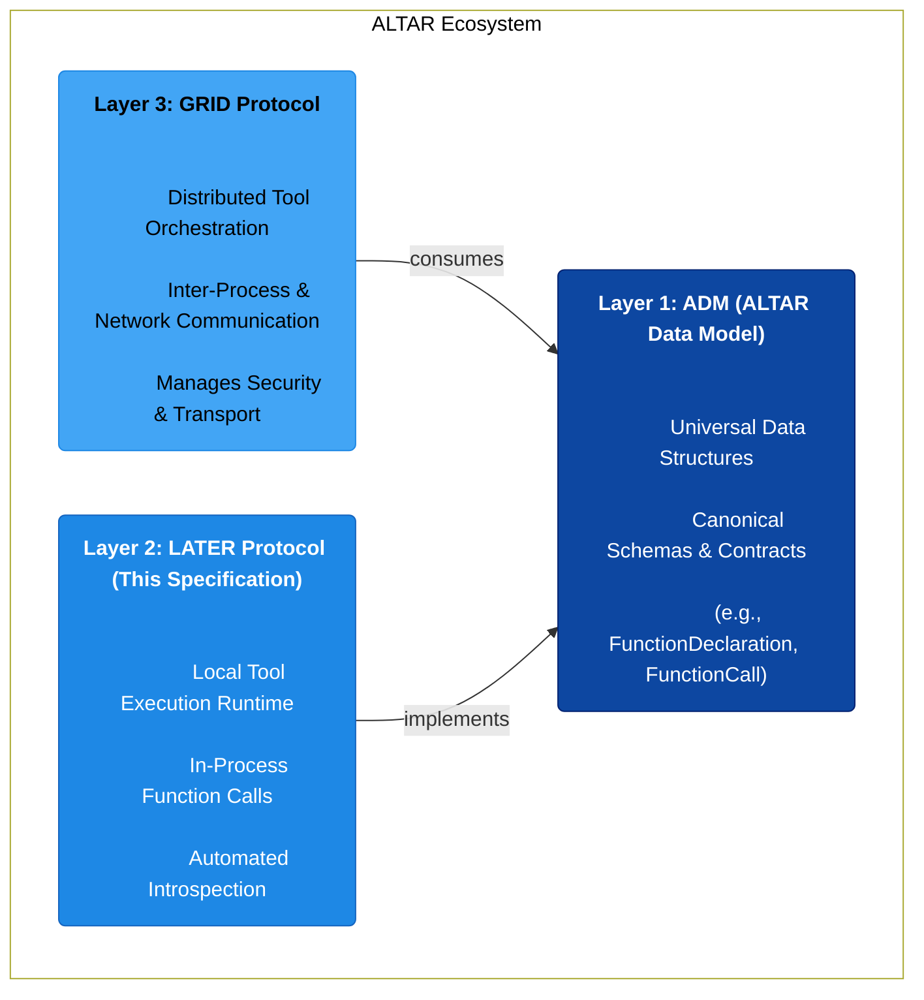
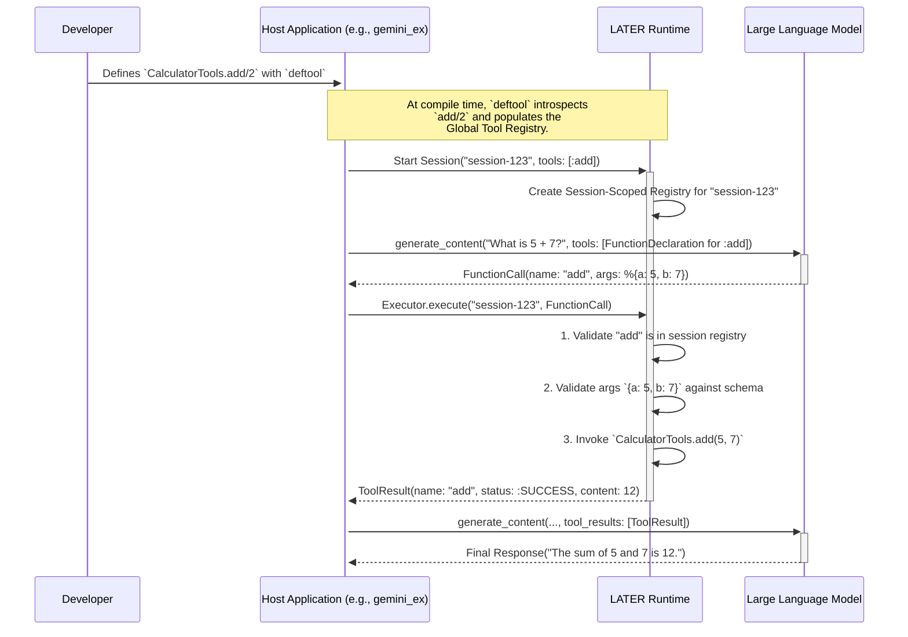

# LATER (Local Agent & Tool Execution Runtime) Protocol v1.0

**Version:** 1.0.0
**Status:** Final
**Date:** August 5, 2025

## 1. Introduction

### 1.1. Vision & Guiding Principles

The **LATER (Local Agent & Tool Execution Runtime) Protocol** provides a language-agnostic standard for local, in-process AI tool execution. It is designed to be the **frictionless on-ramp to production** for the ALTAR ecosystem. Its primary purpose is to enable developers to build and test tools locally that are *guaranteed* to be compatible with the secure, scalable **GRID** execution environment, ensuring a seamless transition from development to deployment.

LATER is governed by three core principles:

1.  **The Frictionless On-Ramp to Production:** Every feature in LATER is designed with the "promotion path" in mind. The developer experience is optimized to ensure that code written for local execution works identically when pointed at the distributed GRID backend, eliminating the need for costly and error-prone rewrites.
2.  **Implements the ADM:** LATER is a consumer of the **ALTAR Data Model (ADM)**. All data structures it produces and consumes (`FunctionDeclaration`, `FunctionCall`, `ToolResult`, etc.) must conform to the ADM v1.0 specification. This shared contract is what makes the promotion path possible.
3.  **Developer Experience & Introspection:** The protocol prioritizes a world-class developer experience. A compliant implementation must favor automated schema generation from native function signatures and documentation, minimizing boilerplate and manual configuration. It must also provide adapters for popular existing AI frameworks (see Section 2.4).

### 1.2. Relationship to ADM & GRID

LATER is the second layer in the three-layer ALTAR architecture, positioned between the foundational data model and the distributed execution protocol.



*   **LATER implements the ADM:** It provides a standard for *creating* and *executing* tools that are described by ADM data structures.
*   **LATER is the local companion to GRID:** Where GRID defines how tools operate across a network, LATER defines how they operate within a single process. This clear separation of concerns allows for a "promotion path" where a tool can graduate from a local LATER runtime to a distributed GRID runtime with no changes to its fundamental contract.

## 2. Abstract Protocol Definition

A LATER-compliant implementation must provide the following conceptual components and behaviors. These definitions are language-agnostic; the subsequent section provides a canonical implementation pattern in Elixir.

### 2.1. Tool Declaration Mechanism

A LATER implementation must provide an idiomatic, introspective mechanism for developers to declare native functions as AI tools.

**Requirements:**

1.  **Idiomatic Interface:** The mechanism must feel natural to the host programming language (e.g., decorators in Python, annotations in Java/C#, macros in Elixir).
2.  **Automated Schema Generation:** The mechanism **must** introspect the native function's signature and documentation to automatically generate an ADM-compliant `FunctionDeclaration` schema. This includes:
    *   **Name:** The function's name.
    *   **Description:** The function's primary documentation string.
    *   **Parameters:**
        *   An ADM `Schema` object of type `OBJECT`.
        *   `properties` derived from the function's parameter names and types. Native types must be mapped to their ADM `SchemaType` equivalents (e.g., `string` -> `STRING`, `int` -> `INTEGER`).
        *   `description` for each parameter derived from its documentation.
        *   `required` fields are inferred; parameters with default values are considered optional.
3.  **Registration:** Upon declaration, the generated `FunctionDeclaration` and a reference to the executable function (e.g., a function pointer or lambda) must be registered with the **Global Tool Definition Registry**.

### 2.2. Two-Tier Registry Architecture

LATER requires a two-tier registry system to manage the difference between a tool's definition and its availability within a specific operational context.

#### 2.2.1. Global Tool Definition Registry

*   **Scope:** Application-wide, singleton.
*   **Lifecycle:** Populated at application startup or compile-time as tools are declared. Persists for the life of the application.
*   **Contents:**
    1.  The complete, ADM-compliant `FunctionDeclaration` for every tool.
    2.  An internal reference or handle to the actual executable function.
*   **Responsibility:** Acts as the single source of truth for all tool schemas and their corresponding business logic.

#### 2.2.2. Session-Scoped Registry

*   **Scope:** Ephemeral, tied to a specific "session" or "conversation."
*   **Lifecycle:** Created when a session begins and destroyed when it ends.
*   **Contents:** A list of tool names that are active for that session. It does not store schemas directly, but rather references the tools available in the Global Registry.
*   **Responsibility:** Manages which tools are available for a given AI interaction. This allows a host application to selectively expose a subset of all globally-defined tools to the agent based on context, user permissions, or conversation state.

### 2.3. Local Tool Executor

The Executor is responsible for invoking a tool's business logic in response to an agent's request.

**Requirements:**

1.  **Lookup:** Given a `FunctionCall` from an agent, the Executor must first look up the corresponding tool in the relevant **Session-Scoped Registry** to confirm its availability.
2.  **Validation:** It must then retrieve the tool's `FunctionDeclaration` from the **Global Registry** and validate the incoming `args` from the `FunctionCall` against the parameter schema. This includes checking for required parameters, validating data types, and respecting `enum` constraints.
3.  **Invocation:** If validation succeeds, the Executor invokes the referenced native function, passing the `args` as arguments.
4.  **Response Handling:**
    *   On successful execution, it must wrap the function's return value in an ADM-compliant `ToolResult` with a `status` of `SUCCESS`.
    *   On any failure (validation error, runtime exception, etc.), it must construct a `ToolResult` with a `status` of `ERROR` and a structured `ErrorObject` containing a clear message.

### 2.4. Tool Adapters & Ecosystem Compatibility

To lower the barrier to adoption, a LATER implementation must provide **bi-directional tool adapters** for popular existing AI frameworks. These adapters allow developers to use their existing tools written for other frameworks within ALTAR, and vice-versa, without modification.

**Conceptual Adapter Functions:**

```python
# Conceptual Python adapter for LangChain
import altar
from langchain_core.tools import BaseTool

# Ingest an existing LangChain tool into the LATER Global Registry
def LATER.import_from_langchain(lc_tool: BaseTool):
  # ... logic to convert LangChain tool schema to ADM and register ...
  pass

# Expose a LATER-native tool as a LangChain-compatible tool
def LATER.export_to_langchain(tool_name: str) -> BaseTool:
  # ... logic to wrap a LATER tool in a BaseTool-compliant interface ...
  pass
```

```csharp
// Conceptual C# adapter for Semantic Kernel
using Microsoft.SemanticKernel;

// Ingest an existing Semantic Kernel plugin into the LATER Global Registry
public void LATER.import_from_sk(KernelPlugin sk_plugin)
{
    // ... logic to convert SK function schemas to ADM and register ...
}

// Expose a LATER-native tool as a Semantic Kernel plugin
public KernelPlugin LATER.export_to_sk(string[] tool_names)
{
    // ... logic to wrap one or more LATER tools in a KernelPlugin ...
}
```

This commitment to interoperability is central to LATER's mission. It ensures developers can try the ALTAR promotion path without needing to first rewrite their existing, battle-tested tools.

## 3. Canonical Implementation Pattern: Elixir

This section provides a brief, non-normative example of how the abstract protocol can be idiomatically implemented in Elixir. This serves as a reference for implementers in other languages.

#### 3.1. Tool Declaration with `deftool`

A `deftool` macro leverages Elixir's metaprogramming to satisfy the **Tool Declaration Mechanism** requirement.

```elixir
# lib/my_app/calculator_tools.ex
defmodule MyApp.CalculatorTools do
  use Later.Tools # Imports the deftool macro

  @doc """
  Adds two numbers together.
  """
  deftool add(a, b) do
    {:ok, a + b}
  end

  @doc """
  Calculates the total price including tax.
  @param unit_price The price of a single item.
  @param quantity The number of items.
  @param tax_rate The tax rate as a decimal (e.g., 0.08 for 8%).
  """
  deftool calculate_total(unit_price, quantity, tax_rate \\ 0.0) do
    total = unit_price * quantity * (1 + tax_rate)
    {:ok, total}
  end
end
```

*   **Introspection:** The `deftool` macro uses `Code.get_doc/2` at compile time to get the function and parameter documentation. It introspects the abstract syntax tree (AST) to find parameter names and default values.
*   **Registration:** It generates an ADM `FunctionDeclaration` and registers it along with the function reference (`&add/2`) into an ETS-based **Global Tool Definition Registry**.

#### 3.2. Registries and Executor

*   **Global Registry:** A simple `GenServer` or ETS table that stores `{function_name, arity}` as a key and the `FunctionDeclaration` and `MFA` `{module, function, args}` as the value.
*   **Session Registry:** A `GenServer` per session, holding a `MapSet` of active tool names for that session.
*   **Executor:** A module with an `execute/2` function that performs the lookup, validation, and invocation logic.

```elixir
# Simplified Executor Logic
defmodule Later.Executor do
  def execute(session_id, %FunctionCall{name: name, args: args}) do
    with {:ok, mfa} <- Registry.lookup(session_id, name),
         :ok <- Validator.validate(mfa, args) do
      # Apply the function and wrap in a ToolResult
      apply(mfa.module, mfa.function, Map.values(args))
      |> wrap_in_tool_result(name)
    else
      {:error, reason} ->
        # Return an error ToolResult
        Later.Types.ToolResult.error(name, reason)
    end
  end
end
```

## 4. The Core Workflow: From Local IDE to Production Deployment

This section illustrates the complete end-to-end workflow, demonstrating the core value proposition of LATER: developing a tool locally and seamlessly promoting it to a secure, distributed GRID environment by changing a single line of configuration.

### 4.1. The End-to-End LATER Flow

The following diagram shows the sequence of events when a tool is executed locally using the LATER protocol.



### 4.2. The Seamless Promotion Path to GRID

A core architectural benefit of LATER is the seamless "promotion path" for a tool to a distributed **GRID (Global Runtime & Interface Definition)** environment. This migration requires **no changes to the tool's ADM contract** (`FunctionDeclaration`) or the host application's core logic.

The promotion is achieved entirely through configuration.

**Step 1: Develop and Test Locally with LATER**

The developer writes and tests their tool using LATER. The host application is configured to use the local LATER tool source.

```elixir
# config/dev.exs
config :my_app, MyApp.Endpoint,
  tool_source: {:later, MyApp.LocalToolSource}

# --- Host Application Logic (remains unchanged) ---
# 1. Start a session and get tool declarations
{:ok, session} = MyApp.Endpoint.start_session(tools: ["add/2"])
declarations = MyApp.Endpoint.get_tool_declarations(session)

# 2. Interact with the LLM
response = Gemini.generate("What is 15 + 30?", tools: declarations)
# ... LLM returns a FunctionCall

# 3. Dispatch the call via the configured endpoint
result = MyApp.Endpoint.execute(session, response.function_call)
# result = %ToolResult{name: "add", status: :SUCCESS, content: 45}
```

**Step 2: Deploy Tool to a GRID Runtime**

The same tool code (e.g., `MyApp.CalculatorTools`) is deployed as part of a standalone GRID-compliant Runtime service. This service exposes the tool over the network.

**Step 3: Promote by Changing Configuration**

To switch to the production-ready, secure backend, the developer changes a single line in their configuration file. **The application code does not change.**

```elixir
# config/prod.exs
config :my_app, MyApp.Endpoint,
  tool_source: {:grid, MyApp.GridToolSource, [
    host: "grid.example.com",
    port: 8080,
    transport: :grpc
  ]}
```

When the application is restarted with this configuration, calls to `MyApp.Endpoint.execute/2` are now routed through the `GridToolSource`, which handles the secure, networked call to the remote GRID Runtime.

Because both LATER and GRID share the same ADM contract, the LLM and the host application are completely unaware of the change in execution backend. This fulfills the "write once, run anywhere" promise of the ALTAR architecture.
