# LATER Protocol Specification v1.0

**Version:** 1.0.0
**Status:** Final

## 1. Introduction

### 1.1. Vision

The LATER (Local Agent & Tool Execution Runtime) protocol provides a language-agnostic specification for discovering, registering, and executing tools **within a single application process**. It is designed to create a simple, intuitive, and "just works" developer experience for exposing local functions to AI agents.

### 1.2. Guiding Principles

*   **Simplicity:** The protocol prioritizes ease of implementation and use, minimizing boilerplate.
*   **Introspection-First:** Compliant implementations should automatically generate tool schemas from native function signatures and documentation.
*   **In-Process Focus:** LATER is exclusively concerned with local execution and makes no assertions about networking or distributed communication.
*   **ALTAR Ecosystem Compatibility:** LATER is a foundational component of the ALTAR ecosystem, designed to provide a seamless promotion path for tools to the distributed GRID protocol.

### 1.3. Relationship to ALTAR Data Model

The LATER protocol **imports and implements** the [**ALTAR Data Model (ADM) v1.0 specification**](../01-data-model/README.md). All data structures used for defining and interacting with tools (`FunctionDeclaration`, `Schema`, `FunctionCall`, `FunctionResponse`) MUST conform to the ADM standard. This shared contract is what guarantees a tool's portability from a local LATER runtime to a distributed GRID runtime.

## 2. Abstract Protocol Definition

A LATER-compliant implementation MUST provide the following abstract components and adhere to their specified behaviors.

### 2.1. Tool Declaration Mechanism

This is the primary developer interface for exposing a local function as a tool.

**Requirements:**
1.  **Idiomatic Declaration:** An implementation MUST provide a mechanism for declaring a function as a tool that feels native to the host language (e.g., a macro in Elixir, a decorator in Python, an annotation in Java).
2.  **Automated Introspection:** This mechanism MUST introspect the function's signature to automatically determine its name, parameters, and parameter types.
3.  **Documentation Parsing:** It MUST parse standard function and parameter documentation (e.g., docstrings, `@doc` attributes) to populate the `description` fields in the generated schema.
4.  **Global Registration:** Upon declaration (typically at compile- or load-time), the mechanism MUST register the generated tool definition with the Global Tool Definition Registry.

### 2.2. Two-Tier Registry Architecture

LATER mandates a two-tiered registry to separate the application-wide *definition* of tools from their runtime *availability* within a specific context or session.

#### 2.2.1. Global Tool Definition Registry

A singleton, application-wide registry that holds the canonical definitions of all tools declared anywhere in the codebase.

**Required Behaviors:**
*   `register(tool_definition)`: Stores a `ToolDefinition` (containing the `FunctionDeclaration` schema and a language-specific function reference). It MUST handle name collisions by overwriting the existing entry and logging a warning.
*   `lookup(tool_name)`: Retrieves a `ToolDefinition` by its unique name.
*   `list()`: Returns a list of all globally registered `ToolDefinition`s.

#### 2.2.2. Session-Scoped Registry

An isolated, ephemeral registry that manages which tools are available within a specific runtime session.

**Required Behaviors:**
*   `create_session(session_id, enabled_tools)`: Creates a new session context. The `enabled_tools` argument is a list of tool names that will be made available. The session registry fetches these definitions from the Global Registry.
*   `list_declarations(session_id)`: Returns a list of `FunctionDeclaration` schemas for all tools enabled in that session. This is the primary method used by a host application to inform an LLM of available tools.
*   `lookup(session_id, tool_name)`: Retrieves the `ToolDefinition` for a given tool, but only if it is enabled for the specified session.
*   `destroy_session(session_id)`: Cleans up all resources associated with the session.

### 2.3. Local Tool Executor

The component responsible for invoking a local function in response to a `FunctionCall`.

**Required Behaviors:**
*   `execute(session_id, function_call)`: The primary execution function.
    1.  It MUST use the Session-Scoped Registry to verify that the tool in the `function_call` exists and is enabled for the given `session_id`.
    2.  It MUST validate the `args` from the `FunctionCall` against the tool's `parameters` schema.
    3.  It MUST safely invoke the underlying local function with the validated arguments.
    4.  It MUST handle any exceptions during execution and format them into a structured `ErrorResponse`.
    5.  It MUST return a `FunctionResponse` containing the JSON-serializable result on success.
    6.  It MUST be implemented in a way that is safe for concurrent execution, according to the host language's concurrency model (e.g., process safety in Elixir, thread safety in Python/Java).

## 3. Canonical Implementation Pattern: Elixir

This section describes how the abstract LATER protocol requirements can be idiomatically fulfilled in Elixir. This serves as a reference for other language implementations.

### 3.1. Tool Declaration (`deftool` Macro)

The **Tool Declaration Mechanism** is implemented via a `deftool/2` macro.

```elixir
defmodule MyApp.WeatherTools do
  # Provides the deftool macro
  use LATER.Tools 

  @doc """
  Gets the current weather for a given location.
  """
  deftool get_current_weather(location, unit \\ "celsius") 
  when is_binary(location) and unit in ["celsius", "fahrenheit"] do
    # Function body that calls a weather service...
    %{temperature: 22, unit: unit, forecast: "windy"}
  end
end
```

*   **Introspection:** The macro inspects the Abstract Syntax Tree (AST) of the function definition at compile time.
*   **Schema Generation:** It uses function head guards (`is_binary/1`) and typespecs (`@spec`) to map Elixir types to ADM `Schema` types.
*   **Global Registration:** It calls `LATER.GlobalRegistry.register/1` with the generated `ToolDefinition`.

### 3.2. Registries (GenServer & ETS)

*   **Global Tool Definition Registry:** Implemented as a simple ETS table, populated at compile time by the `deftool` macro. This provides fast, concurrent, read-only access at runtime.
*   **Session-Scoped Registry:** Implemented as a `GenServer` that manages an in-memory map of `%{session_id => enabled_tools}`. When a session is created, this GenServer fetches the required definitions from the global ETS table and stores references in its state.

### 3.3. Executor (Module)

The **Local Tool Executor** is implemented as a standard Elixir module.

```elixir
# Simplified example of the Executor's main function
defmodule LATER.Executor do
  def execute(session_id, %FunctionCall{name: name, args: args}) do
    with {:ok, tool_def} <- LATER.SessionRegistry.lookup(session_id, name),
         :ok <- validate_parameters(tool_def.schema, args) do
      # apply/3 invokes the {Module, :function, [args]} reference
      result = apply(tool_def.function_reference, [args])
      {:ok, %FunctionResponse{name: name, response: %{content: result}}}
    rescue
      e -> {:error, format_exception_as_error_response(name, e)}
    end
  end
end
```

## 4. End-to-End Workflow Example (in `gemini_ex`)

This diagram and code illustrate how a host application like `gemini_ex` would use a LATER implementation.

```mermaid
sequenceDiagram
    participant App as gemini_ex App
    participant LATER_Session as LATER Session Registry
    participant LATER_Exec as LATER Executor
    participant Gemini_API as Gemini API
    
    App->>LATER_Session: create_session("sid-123", [MyApp.WeatherTools])
    App->>LATER_Session: list_declarations("sid-123")
    LATER_Session-->>App: [%FunctionDeclaration{name: "get_current_weather", ...}]
    
    App->>Gemini_API: generate_content(prompt, tools=[...])
    Gemini_API-->>App: response with FunctionCall{name: "get_current_weather", args: ...}
    
    App->>LATER_Exec: execute("sid-123", FunctionCall{...})
    LATER_Exec-->>App: {:ok, FunctionResponse{...}}
    
    App->>Gemini_API: generate_content(history_with_response)
    Gemini_API-->>App: "The weather in Boston is 22°C and windy."
```



This workflow demonstrates the clean separation: `gemini_ex` coordinates the conversation with the LLM, while the LATER implementation handles the local tool mechanics of registration, discovery, and execution.
