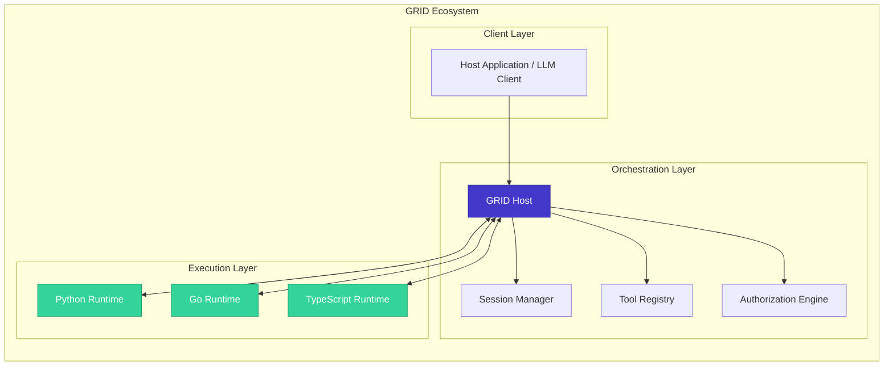
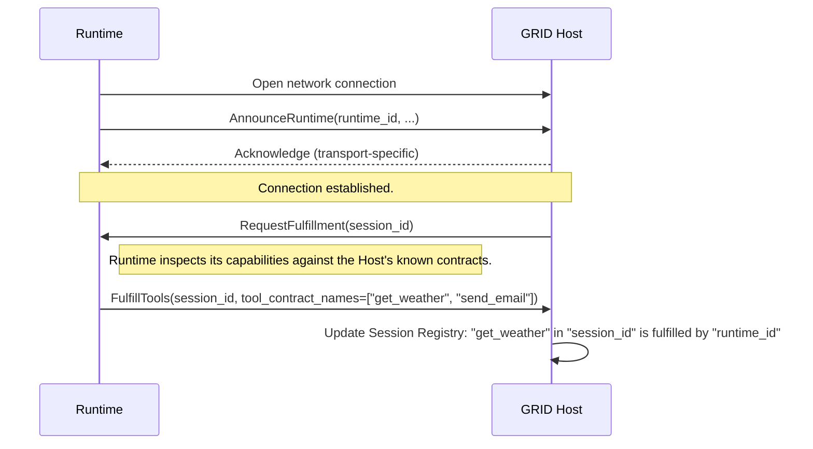
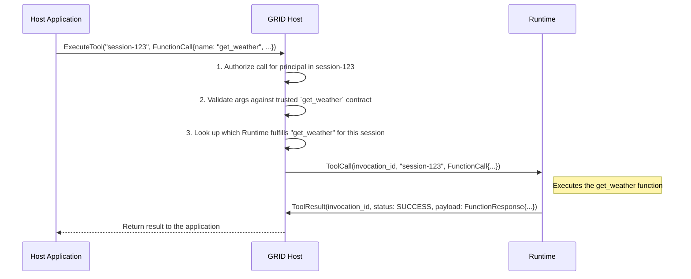

# GRID Protocol Specification v1.0

**Version:** 1.0.0
**Status:** Final

## 1. Introduction

### 1.1. Vision

The GRID (Global Runtime & Interop Director) protocol provides a language-agnostic, transport-agnostic specification for secure, observable, and stateful interoperability between distributed AI systems. It defines the architecture for a central **Host** to orchestrate and communicate with multiple remote **Runtimes**, enabling them to share and execute tools across process and network boundaries.

### 1.2. Guiding Principles

*   **Secure by Default:** The protocol is built on a Host-centric, zero-trust security model. The Host is the single source of truth for all tool contracts and security policies.
*   **Stateful Sessions:** Sessions are a first-class citizen, providing isolated contexts for managing state, capabilities, and security across a series of interactions.
*   **Transport Agnostic:** The specification defines message schemas and interaction patterns, not the underlying network transport. Implementations can use gRPC, WebSockets, or other transports.
*   **Built-in Observability:** All messages are designed to carry correlation IDs and metadata, enabling seamless end-to-end distributed tracing.

### 1.3. Relationship to ALTAR Data Model & LATER

*   **Data Model Dependency:** The GRID protocol **imports and implements** the [**ALTAR Data Model (ADM) v1.0 specification**](../01-data-model/README.md). All tool-related data structures (`FunctionDeclaration`, `FunctionCall`, etc.) MUST conform to the ADM standard.
*   **Companion Protocol:** GRID is the distributed companion to the LATER protocol. While LATER defines in-process execution, GRID defines the protocol for executing the exact same tool contracts on a remote machine.

## 2. Architecture: The Host-Runtime Model

The GRID protocol is based on a robust, centralized orchestration model.



*   **Host:** The central server process that implements the GRID protocol. It manages sessions, maintains the authoritative tool registry, routes invocations, and enforces security policies.
*   **Runtime:** An external, remote process that connects to the Host to offer tool execution capabilities. Runtimes can be written in any language.
*   **Client:** The application (e.g., an LLM client like `gemini_ex`) that communicates with the Host to initiate sessions and request tool executions on behalf of an AI agent.

## 3. Security Model: Host-Managed Contracts

The cornerstone of the GRID protocol's security is its **Host-centric trust model**. This model prevents a wide range of security vulnerabilities inherent in systems where tools self-describe their capabilities.

1.  **Authoritative Tool Manifest:** The Host is configured with a `ToolManifest`, which is the single source of truth for all valid `ToolContract` definitions. A `ToolContract` is an ADM `FunctionDeclaration` enriched with protocol-level metadata.
2.  **Contract Fulfillment, Not Registration:** A Runtime **never** sends its own schema to the Host. Instead, after connecting, it sends a `FulfillTools` message, declaring which of the Host's pre-defined contracts it is capable of executing.
3.  **Host-Side Validation:** All `FunctionCall` requests from a client are validated by the Host against its own trusted `ToolContract` schema before being dispatched to a Runtime. The Runtime's implementation is trusted to execute the call, but not to define its parameters.

This model ensures that even if a Runtime is compromised or misbehaving, it cannot trick the system into executing a call with a malicious or malformed schema (a "Trojan Horse" tool).

## 4. Protocol Message Schemas (Language-Neutral IDL)

This section defines the core messages for the GRID protocol, presented in a language-neutral IDL format.

### 4.1. Handshake & Fulfillment

**`AnnounceRuntime`** (Runtime → Host)
*Initial message sent by a Runtime upon connecting.*
```idl
message AnnounceRuntime {
  string runtime_id = 1;      // A unique identifier for this runtime instance.
  string language = 2;        // The implementation language (e.g., "python", "elixir").
  string version = 3;         // The version of the runtime's GRID client library.
  repeated string capabilities = 4; // List of supported GRID features (e.g., "streaming").
}
```

**`FulfillTools`** (Runtime → Host)
*Message sent by a Runtime to declare which tools it can execute for a given session.*
```idl
message FulfillTools {
  string session_id = 1;           // The session to which these fulfillments apply.
  repeated string tool_contract_names = 2; // A list of `ToolContract` names from the Host's manifest that this Runtime can execute.
}
```

### 4.2. Invocation & Results

**`ToolCall`** (Host → Runtime)
*Message sent from the Host to a Runtime to request execution of a tool. This directly wraps the ADM `FunctionCall`.*
```idl
message ToolCall {
  string invocation_id = 1;     // Unique ID for this specific call, used for correlation.
  string session_id = 2;        // The session context for the call.
  FunctionCall function_call = 3; // The ADM FunctionCall data structure.
}
```

**`ToolResult`** (Runtime → Host)
*Response from a Runtime after executing a tool. Contains either a success payload or a structured error.*
```idl
message ToolResult {
  string invocation_id = 1;     // Correlates with the ToolCall.
  ResultStatus status = 2;      // SUCCESS or ERROR.
  FunctionResponse payload = 3;   // The ADM FunctionResponse on success.
  Error error_details = 4;      // Structured error details on failure.
}
```

**`StreamChunk`** (Runtime → Host)
*(Level 2+ Compliance)*
*A single message in a streaming response.*
```idl
message StreamChunk {
  string invocation_id = 1;     // Correlates with the ToolCall.
  uint64 chunk_id = 2;          // Sequential identifier for ordering.
  bytes payload = 3;            // Partial data for this chunk (JSON-encoded).
  bool is_final = 4;            // True if this is the last chunk in the stream.
  Error error_details = 5;      // Optional in-band error reporting.
}
```

### 4.3. Session Management

**`CreateSession`** (Client → Host)
```idl
message CreateSession {
  string suggested_session_id = 1; // Client-suggested ID (optional).
  uint64 ttl_seconds = 2;         // Requested time-to-live for the session.
  SecurityContext security_context = 3; // Security context for the session.
}
```

**`DestroySession`** (Client → Host)
```idl
message DestroySession {
  string session_id = 1;
}
```

### 4.4. Supporting Types

```idl
enum ResultStatus { SUCCESS = 0; ERROR = 1; }

message Error {
  string code = 1;        // Standard error code (e.g., TOOL_NOT_FOUND).
  string message = 2;     // Human-readable error description.
}

message SecurityContext {
  string principal_id = 1; // Identity of the end-user or agent.
  string tenant_id = 2;    // The tenant or organization this session belongs to.
}
```

## 5. Interaction Flows

### 5.1. Runtime Connection and Fulfillment

This flow describes how a remote Runtime connects to the Host and makes its tools available to a session.



### 5.2. Synchronous Tool Invocation

This flow describes how a client's request results in a remote tool being executed.



## 6. Compliance Levels

To facilitate incremental adoption, GRID defines compliance levels.

*   **Level 1 (Core Compliance):** The minimum for a functional GRID system.
    *   Implements `AnnounceRuntime` and `FulfillTools`.
    *   Supports session creation and destruction.
    *   Handles synchronous `ToolCall` -> `ToolResult` flow.
    *   Implements the Host-Managed Contract security model.

*   **Level 2 (Streaming Compliance):** All Level 1 features plus:
    *   Support for streaming invocations via the `StreamChunk` message.
    *   In-band error handling within streams.

*   **Level 3 (Enterprise Compliance):** This level is formally defined by the **AESP (ALTAR Enterprise Security Protocol) Profile**. It replaces base GRID messages with their enhanced enterprise counterparts (e.g., `EnterpriseSecurityContext`) and requires implementations of advanced components like the RBAC Engine, Policy Engine, and Audit Manager. See the [AESP specification](./aesp.md) for details.
