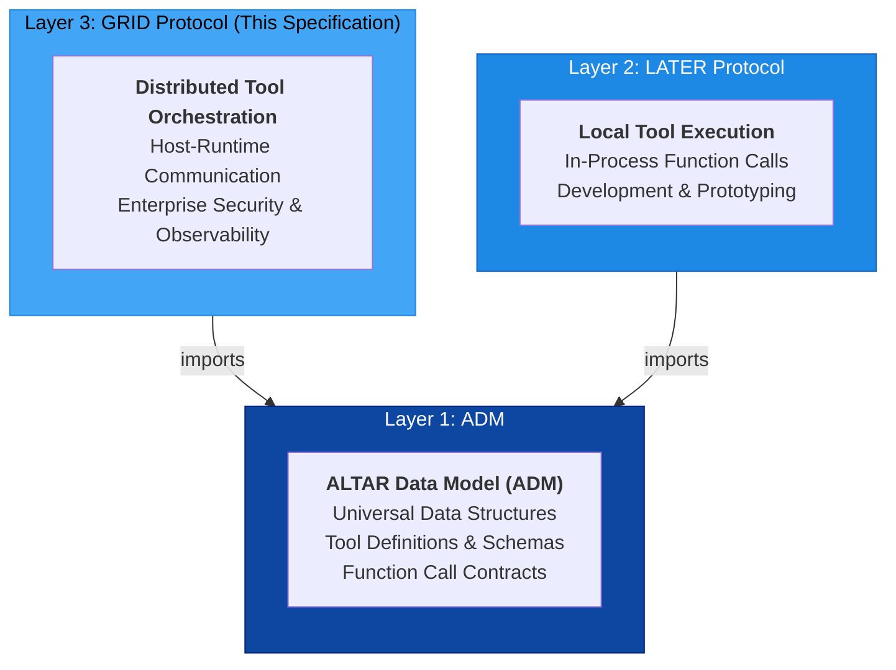
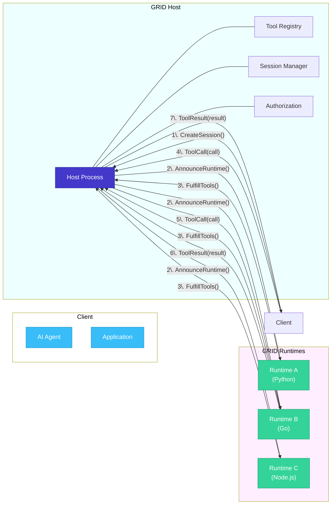
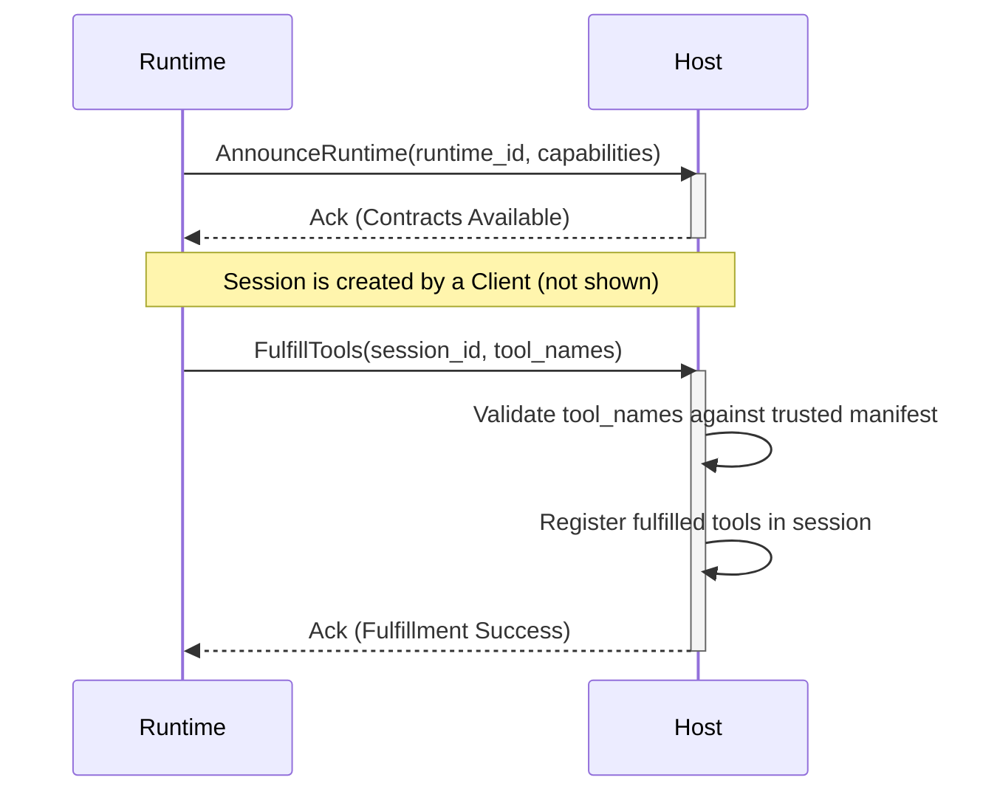
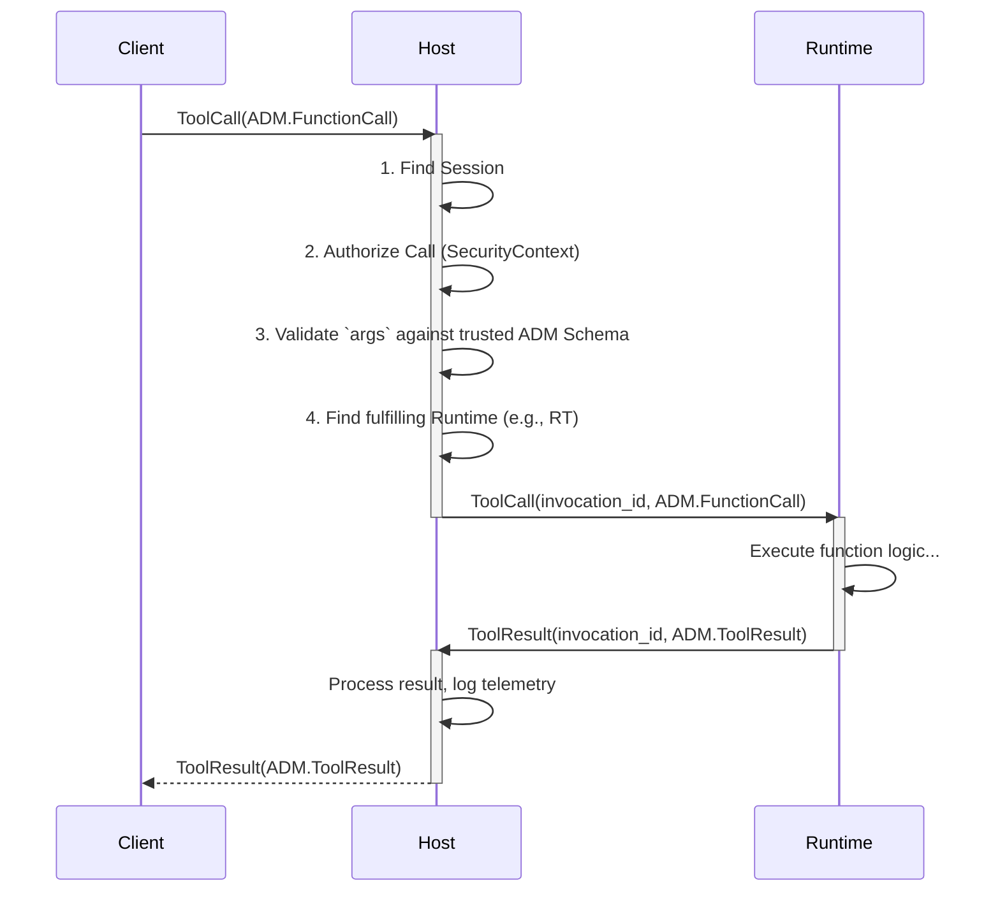

# GRID Protocol Specification v1.0

**Version:** 1.0.0
**Status:** Final
**Date:** August 2025

## 1. Introduction

### 1.1. Vision & Guiding Principles

The GRID (Global Runtime & Interop Director) Protocol v1.0 specification defines a standard for secure, stateful, and distributed AI tool communication. It provides a robust framework for interactions between a central Host and multiple, disparate Runtimes, enabling scalable and language-agnostic tool use for advanced AI systems.

GRID is built on two core principles:

1.  **Host-Centric Security:** The protocol's most critical feature is its security model, where the Host is the single source of truth for tool definitions. This prevents a wide range of vulnerabilities by ensuring that all tool invocations are validated against trusted contracts.
2.  **Stateful, Session-Based Interaction:** GRID treats the `Session` as a first-class citizen, providing an isolated context for a series of interactions between a client, the Host, and one or more Runtimes.

### 1.2. Relationship to ADM & LATER

GRID is the third layer of the three-layer ALTAR architecture, building upon the foundational contracts established by the ALTAR Data Model (ADM) and complementing the local execution model of the LATER protocol.



-   **Imports the ADM:** GRID is a consumer of the **ALTAR Data Model (ADM)**. All data payloads within GRID messages, such as function calls and results, **must** conform to the structures defined in the ADM specification (`FunctionCall`, `ToolResult`, etc.). GRID defines the messages that *transport* these ADM structures between processes.
-   **Distributed Counterpart to LATER:** Where the LATER protocol specifies in-process tool execution for development, GRID specifies out-of-process, distributed tool execution for scalable, production-ready systems.

## 2. Architecture: The Host-Runtime Model

The GRID protocol is based on a Host-Runtime architecture, where a central Host orchestrates communication between clients and one or more Runtimes.



-   **Client:** Any application or agent that needs to invoke tools. The Client communicates only with the Host.
-   **Host:** The central orchestration engine. It manages sessions, maintains a registry of trusted tool contracts, enforces security, and routes invocations to the appropriate Runtime.
-   **Runtime:** An external process that connects to the Host to provide tool execution capabilities. A Runtime does not define tools; it *fulfills* tool contracts that the Host makes available.

## 3. Security Model: Host-Managed Contracts

GRID's most important feature is its **Host-centric security model**, which is designed to prevent "Trojan Horse" vulnerabilities common in other tool-use systems.

In many systems, a tool provider (a Runtime) declares its own capabilities, including function names and parameter schemas. A malicious or compromised Runtime could misrepresent its schema, tricking a client into sending sensitive data. For example, it could register a function `get_user_email(user_id: string)` but define its parameters to accept an entire user object, leading to data exfiltration.

GRID solves this by inverting the trust model:

1.  **The Host is the Source of Truth:** The Host maintains a manifest of trusted **Tool Contracts**. These contracts are the *only* tool definitions the system recognizes.
2.  **Runtimes Fulfill, They Don't Define:** A Runtime cannot register a new tool. Instead, it can only announce that it is capable of *fulfilling* one or more of the contracts already defined by the Host.
3.  **Host-Side Validation:** When a Client sends a `ToolCall`, the Host validates the arguments against its own trusted contract *before* forwarding the call to the Runtime. The Runtime is never the authority on the contract schema.

This model ensures that all tool interactions are governed by centrally-vetted, secure contracts, providing a high degree of security, auditability, and control, which is essential for enterprise environments.

## 4. Protocol Message Schemas (Language-Neutral IDL)

These schemas define the messages exchanged between the Host and Runtimes. All payloads referencing tool structures (e.g., `FunctionCall`, `ToolResult`) are defined by the **ALTAR Data Model (ADM) Specification**.

### 4.1. Handshake & Fulfillment

Messages used for establishing a connection and declaring capabilities.

```idl
// Sent by a Runtime to the Host to announce its presence.
message AnnounceRuntime {
  string runtime_id = 1;           // Unique identifier for this runtime instance.
  string language = 2;             // Runtime language (e.g., "python", "elixir").
  string version = 3;              // Version of the GRID bridge implementation.
  repeated string capabilities = 4; // Supported GRID features (e.g., "streaming").
  map<string, string> metadata = 5; // Additional runtime-specific information.
}

// Sent by a Runtime to the Host to declare which trusted tool
// contracts it can execute for a given session.
message FulfillTools {
  string session_id = 1;           // The session for which tools are being fulfilled.
  repeated string tool_names = 2;  // Names of the Host-defined tool contracts to fulfill.
  string runtime_id = 3;           // The ID of the runtime providing the fulfillment.
}
```

### 4.2. Invocation & Results

Messages for executing a tool function and returning its result.

```idl
// Sent by the Host to a Runtime to request execution of a function.
// This message wraps a data structure from the ADM specification.
message ToolCall {
  string invocation_id = 1;        // Unique ID for this specific invocation.
  string correlation_id = 2;       // ID for tracing the entire workflow.
  ADM.FunctionCall call = 3;       // The function call payload, conforming to the ADM.
}

// Sent by a Runtime to the Host with the result of a function execution.
// This message wraps a data structure from the ADM specification.
message ToolResult {
  string invocation_id = 1;        // Correlates with the originating ToolCall.
  string correlation_id = 2;       // Propagated for end-to-end tracing.
  ADM.ToolResult result = 3;       // The function result payload, conforming to the ADM.
}

// (Level 2+) Sent by a Runtime to the Host for streaming results.
message StreamChunk {
  string invocation_id = 1;        // Correlates with the originating ToolCall.
  uint64 chunk_id = 2;             // Sequential identifier for ordering chunks.
  bytes payload = 3;               // Partial data for this chunk.
  bool is_final = 4;               // Flag indicating the end of the stream.
  Error error = 5;                 // Optional field for reporting in-band errors.
}
```

### 4.3. Session Management

Messages for managing the lifecycle of an interaction context.

```idl
// Sent by a Client to the Host to initialize a new interaction context.
message CreateSession {
  string suggested_session_id = 1;   // A client-suggested ID (Host may override).
  map<string, string> metadata = 2;   // Initial metadata for the session.
  uint64 ttl_seconds = 3;            // Requested time-to-live for the session.
  SecurityContext security_context = 4; // (Level 2+) Security context for the session.
}

// Sent by a Client to the Host to terminate an existing session.
message DestroySession {
  string session_id = 1;             // The ID of the session to terminate.
  bool force = 2;                    // If true, terminate even if invocations are active.
}
```

### 4.4. Supporting Types

Common data structures used across multiple messages.

```idl
// A structured error object.
message Error {
  string message = 1;              // A human-readable error message.
  string type = 2;                 // A standardized error code (e.g., "TOOL_NOT_FOUND").
}

// (Level 2+) Defines the security identity for a session.
message SecurityContext {
  string principal_id = 1;         // The end-user or service on whose behalf the session is acting.
  string tenant_id = 2;            // The organization or tenant this session belongs to.
  map<string, string> claims = 3;  // Opaque security claims from an auth system.
}
```

## 5. Interaction Flows

### 5.1. Runtime Connection and Fulfillment

This flow describes how a new Runtime connects to the Host and makes its tools available for a session.



### 5.2. Synchronous Tool Invocation

This flow shows a standard, non-streaming tool call initiated by a Client.



## 6. Compliance Levels

To facilitate interoperability and gradual adoption, GRID defines several compliance levels.

-   **Level 1 (Core):** A minimal, compliant implementation.
    -   Must implement `AnnounceRuntime`, `FulfillTools`.
    -   Must support the synchronous `ToolCall` -> `ToolResult` flow.
    -   Must implement `CreateSession` and `DestroySession`.
    -   Must use and validate ADM structures for all payloads.

-   **Level 2 (Streaming):** A more feature-rich implementation suitable for production.
    -   Includes all Level 1 features.
    -   Must implement the `StreamChunk` message for streaming results.
    -   Must support the `SecurityContext` for multi-tenancy and advanced auth.

-   **Level 3 (Enterprise):** A full-featured, high-security implementation.
    -   Compliance for this level is defined by the separate **Altar Enterprise Security Profile (AESP)**.
    -   Includes features like detailed audit logging, resource management, and advanced policy enforcement.
    -   See: `aesp.md` for the complete AESP specification.
