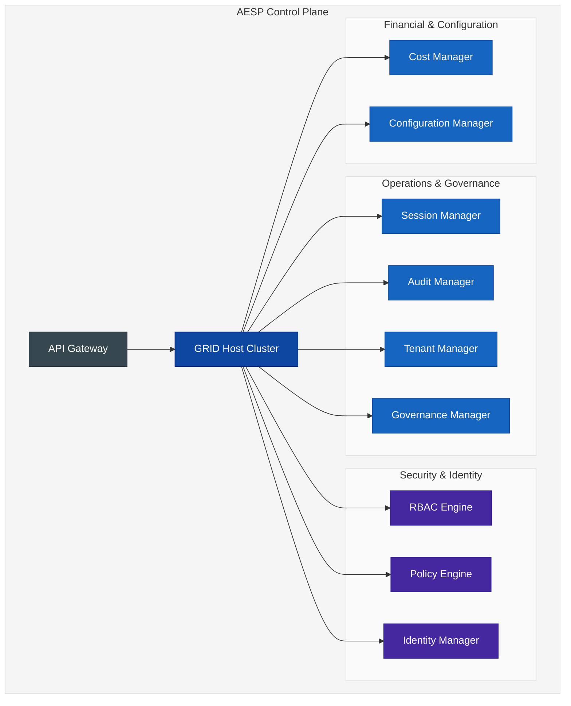

# AESP (ALTAR Enterprise Security Protocol) Profile v1.0

**Version:** 1.0.0
**Status:** Final
**Profiles:** [GRID Protocol v1.0](./README.md)

## 1. Introduction

### 1.1. Overview

The AESP (ALTAR Enterprise Security Protocol) Profile defines a set of extensions, replacements, and mandatory components for the base GRID protocol to meet the stringent security, governance, and compliance requirements of enterprise environments. An AESP-compliant system represents a **Level 3 (Enterprise Compliance)** implementation of the GRID protocol.

This profile transforms the flexible, general-purpose GRID protocol into a hardened, auditable, and fully governable platform for orchestrating AI agents within strict organizational boundaries.

### 1.2. Relationship to the GRID Protocol

AESP is not a separate protocol; it is a **strict profile of GRID**. It operates on the same Host-Runtime architecture and follows the same fundamental interaction flows. However, it achieves its enterprise-grade posture through three key mechanisms:

1.  **Message Replacement:** AESP defines enhanced, enterprise-specific messages (e.g., `EnterpriseSecurityContext`) that **replace** their base GRID counterparts. These messages carry the additional metadata required for advanced security and governance.
2.  **Component Mandates:** AESP mandates the implementation of specific server-side components within the Host (e.g., `RBAC Engine`, `Audit Manager`) that are optional in a base GRID implementation.
3.  **Stricter Security Requirements:** AESP enforces stricter security controls, such as mandatory mTLS and integration with enterprise identity providers.

## 2. AESP Architecture: The Control Plane Model

An AESP-compliant Host is not a single process, but a collection of coordinated microservices known as the **AESP Control Plane**. This architecture ensures scalability, resilience, and a clear separation of concerns for all enterprise functions.



### 2.1. Mandated Components

An AESP-compliant implementation MUST provide the following components:

*   **API Gateway:** A unified, secure entry point for all client and Runtime traffic, responsible for TLS termination, authentication, and routing.
*   **Identity Manager:** Provides the administrative control plane for managing all principals (users, service accounts) and integrating with enterprise identity providers (e.g., LDAP, SAML).
*   **RBAC Engine:** Manages hierarchical roles and permissions, making fine-grained authorization decisions for every action.
*   **Policy Engine:** A high-performance engine that evaluates declarative policies (e.g., using Common Expression Language - CEL) to enforce complex, context-aware rules.
*   **Tenant Manager:** Enforces strict multi-tenant isolation for data, resources, and configuration.
*   **Audit Manager:** Creates a cryptographically-signed, immutable audit trail for all significant system events.
*   **Governance Manager:** Orchestrates programmatic approval workflows for critical system artifacts like policies and tool contracts.
*   **Cost Manager:** Provides comprehensive financial governance by metering resource consumption and managing budgets.

## 3. AESP Message Replacements and Extensions

To enable the functionality of the control plane, AESP replaces several base GRID messages with extended, enterprise-specific versions.

### 3.1. `EnterpriseSecurityContext`

This message **replaces** the base `SecurityContext` and is the core of AESP's identity and policy model.

```idl
// REPLACES GRID message: SecurityContext
message EnterpriseSecurityContext {
  string principal_id = 1;         // User or service account ID
  string tenant_id = 2;            // Tenant context
  map<string, string> claims = 3;  // Opaque claims from an external IdP
  string organization_id = 4;      // Top-level enterprise identifier
  repeated string roles = 5;       // List of roles assigned to the principal
  string security_clearance = 6;   // Security clearance level (e.g., "confidential")
  map<string, string> policy_context = 7; // Additional context for the Policy Engine
}
```

### 3.2. `EnterpriseToolContract`

This message **replaces** the configuration-level `ToolContract` concept in the Host's manifest, turning it into a governed artifact.

```idl
// REPLACES the concept of a simple ToolContract in the Host's manifest
message EnterpriseToolContract {
  // Core ADM fields
  FunctionDeclaration declaration = 1;

  // Enterprise governance fields
  string approval_status = 2;      // PENDING, APPROVED, REJECTED
  string approved_by = 3;          // Principal ID of approver
  uint64 approved_at = 4;          // UTC timestamp of approval
  string risk_assessment = 5;      // LOW, MEDIUM, HIGH
  repeated string compliance_tags = 6; // e.g., "SOC2", "HIPAA"
  repeated string required_roles = 7;  // RBAC roles required to execute this tool
}
```

### 3.3. `EnterpriseRuntimeAnnouncement`

This message **replaces** the base `AnnounceRuntime` to provide the Host with the necessary context to enforce policies at connection time.

```idl
// REPLACES GRID message: AnnounceRuntime
message EnterpriseRuntimeAnnouncement {
  // Core GRID fields
  string runtime_id = 1;
  string language = 2;
  string version = 3;
  repeated string capabilities = 4;

  // Enterprise context fields
  string tenant_id = 5;             // Declares which tenant this runtime serves
  string security_zone = 6;         // The network/security zone it operates in (e.g., "dmz", "pci-zone")
  string deployment_environment = 7;    // DEV, TEST, PROD
}
```

### 3.4. `EnterpriseError`

This message **replaces** the base `Error` structure in a `ToolResult`, providing richer, more actionable diagnostic information.

```idl
// REPLACES GRID message: Error
message EnterpriseError {
  string code = 1;                     // e.g., AUTHORIZATION_DENIED
  string message = 2;                  // Human-readable message
  map<string, string> details = 3;     // Additional technical details
  string correlation_id = 4;           // End-to-end trace ID
  string compliance_impact = 5;        // Description of any compliance violations
  string security_implication = 6;     // Description of the security risk
  string remediation_steps = 7;        // Suggested actions for the client or user
}
```

## 4. Mandatory Enterprise Services (IDL)

An AESP-compliant Host MUST expose APIs for managing its mandated components. These services are typically exposed through the API Gateway. The following is a high-level summary of the required RPC services.

### 4.1. EnterpriseIdentityService

```idl
service EnterpriseIdentityService {
  // Manages the lifecycle of service accounts
  rpc CreateServiceAccount(...) returns (...);
  rpc RevokeServiceAccount(...) returns (...);
  
  // Manages roles and permissions for principals
  rpc AssignRole(...) returns (...);
  rpc GetPrincipalPermissions(...) returns (...);
}
```

### 4.2. EnterprisePolicyService

```idl
service EnterprisePolicyService {
  // Manages the lifecycle of CEL-based policies
  rpc CreatePolicy(...) returns (...);
  rpc UpdatePolicy(...) returns (...);
  
  // Allows for pre-flight checking of policies
  rpc TestPolicy(...) returns (...);
}
```

### 4.3. EnterpriseAuditService

```idl
service EnterpriseAuditService {
  // Allows authorized principals to query the immutable audit log
  rpc QueryEvents(...) returns (stream AuditEvent);
  
  // Generates formal compliance reports for auditors
  rpc GetComplianceReport(...) returns (...);
}
```

## 5. Security Requirements

An AESP-compliant system MUST meet the following security requirements:

*   **Transport Security:** All communication between the API Gateway, the Host, and all Runtimes MUST be encrypted using mutual TLS (mTLS) 1.3 or higher.
*   **Identity Integration:** The Identity Manager MUST integrate with at least one enterprise identity provider (LDAP, SAML, or OIDC).
*   **Immutable Auditing:** All events logged by the Audit Manager MUST be cryptographically signed to ensure their integrity and non-repudiation.
*   **RBAC Enforcement:** Every API call and tool invocation MUST be authorized by the RBAC Engine.
*   **Policy Enforcement:** Every tool invocation MUST be evaluated by the Policy Engine.

## 6. AESP and the Promotion Path

AESP represents the final destination in the tool promotion path that begins with LATER.

1.  **LATER (Local):** A developer defines a tool in their Elixir application. The `FunctionDeclaration` is generated automatically. The contract is local and trusted.
2.  **GRID (Distributed):** The tool's logic is moved to a remote microservice (a Runtime). The developer extracts the same `FunctionDeclaration` and places it in the GRID Host's `ToolManifest`. The application code changes from a local call to a GRID client call. The contract is now centralized and validated.
3.  **AESP (Enterprise):** The `ToolContract` in the Host's manifest is elevated to an `EnterpriseToolContract`. It must now go through the `GovernanceManager` for approval, have `required_roles` and a `risk_assessment` assigned, and its execution becomes subject to the full suite of AESP security controls. The client code does not need to change from the GRID implementation, but the security and governance posture is dramatically enhanced.
