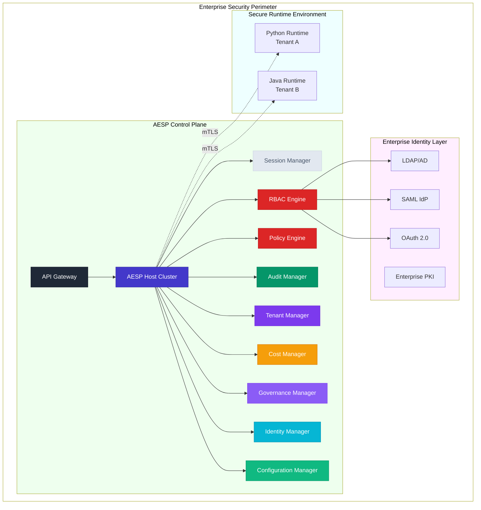

# AESP (ALTAR Enterprise Security Protocol) Profile v1.0

**Version:** 1.0
**Status:** Final
**Defines:** GRID Protocol Level 3 Enterprise Compliance

## 1. Introduction

### 1.1. Overview

This document defines the **AESP (ALTAR Enterprise Security Protocol) Profile v1.0**. AESP is not a standalone protocol; it is a formal profile of the [GRID Protocol](./README.md) that specifies the mandatory architectural components, message extensions, and security controls required to achieve **Level 3 Enterprise Compliance**.

The primary purpose of AESP is to elevate the core GRID protocol to meet the stringent demands of enterprise environments. Where GRID provides a robust foundation for distributed tool orchestration, AESP layers on the critical features of **security, governance, and compliance**. An AESP-compliant system is, by definition, a GRID-compliant system that has been hardened and extended for high-stakes, regulated deployments.

### 1.2. Relationship to GRID

AESP extends the GRID protocol through three primary mechanisms, ensuring that an AESP-compliant Host remains interoperable with the core principles of GRID while enforcing stricter enterprise-grade controls.

*   **Component Mandates:** AESP mandates the implementation of a specific **Control Plane** architecture. A standard GRID Host is extended with required services for identity, policy, audit, and more, which become integral to its operation.
*   **Message Replacement:** AESP selectively replaces certain base GRID protocol messages with enterprise-specific counterparts. These extended messages (e.g., `EnterpriseSecurityContext`) are supersets of the base messages, carrying additional data required for fine-grained policy enforcement, auditability, and governance.
*   **Stricter Security:** AESP elevates GRID's security posture from a recommendation to a requirement. It mandates specific security controls, such as mTLS 1.3+ for all transport, integration with enterprise identity providers (IdPs), and the maintenance of an immutable audit log.

## 2. AESP Architecture: The Control Plane Model

To achieve AESP compliance, a GRID Host must be implemented as part of a comprehensive **AESP Control Plane**. This architecture provides the centralized management, security, and governance functions required for enterprise operations.



### 2.1. Mandated Components

An AESP-compliant Host MUST integrate with the following mandated components:

*   **API Gateway**: The unified, secure entry point for all external client interactions, responsible for TLS termination, authentication, rate limiting, and routing.
*   **Identity Manager**: Provides the administrative control plane for managing all system principals (users, service accounts), including their lifecycle and synchronization with external enterprise IdPs.
*   **RBAC Engine**: Manages hierarchical roles and permissions, integrating with the Identity Manager to make fine-grained authorization decisions for every action.
*   **Policy Engine**: Evaluates declarative policies (e.g., using Common Expression Language - CEL) to enforce complex, real-time security, operational, and business rules.
*   **Audit Manager**: Creates a cryptographically-signed, immutable audit trail of every significant system event, from administrative actions to tool invocations.
*   **Governance Manager**: Orchestrates programmatic approval workflows for critical system artifacts like policies, tool contracts, and budgets, ensuring changes are controlled and auditable.
*   **Cost Manager**: Provides financial governance by metering resource consumption, attributing costs to tenants and principals, and enforcing budgets.
*   **Tenant Manager**: Enforces strict multi-tenant isolation for data, resources, and configuration.
*   **Configuration Manager**: Enables dynamic, zero-downtime updates to the control plane's operational configuration, with changes managed through versioning and governance workflows.

## 3. AESP Message Replacements and Extensions

AESP achieves its enhanced capabilities by replacing key GRID protocol messages with extended enterprise versions. These messages are designed to be supersets of their base counterparts.

### 3.1. `EnterpriseSecurityContext`

The `EnterpriseSecurityContext` **replaces** the base GRID `SecurityContext`. It expands the simple principal and tenant IDs with a rich set of claims and metadata required for enterprise-grade RBAC and policy decisions.

```idl
message EnterpriseSecurityContext {
  // Base GRID Fields
  string principal_id = 1;
  string tenant_id = 2;

  // AESP Extensions
  map<string, string> claims = 3;         // Claims from the identity token (e.g., JWT).
  string organization_id = 4;           // Top-level enterprise identifier.
  string business_unit = 5;             // Department or cost center.
  repeated string roles = 6;              // Roles assigned to the principal.
  repeated string permissions = 7;        // Specific permissions granted.
  string security_clearance = 8;        // Security clearance level (e.g., "confidential").
  string data_classification = 9;       // Highest data classification level accessible.
  uint64 session_expires_at = 10;         // Session expiration timestamp.
  map<string, string> policy_context = 11; // Additional context for the Policy Engine.
}
```

### 3.2. `EnterpriseToolContract`

The `EnterpriseToolContract` **replaces** the use of a standard ADM `FunctionDeclaration` as the Host's manifest entry. It enriches the core function definition with metadata crucial for governance, security, and risk management.

```idl
message EnterpriseToolContract {
  // Base ADM Fields
  string name = 1;
  string description = 3;
  repeated ParameterSchema parameters = 4; // Conforms to ADM Schema

  // AESP Extensions
  string contract_version = 2;
  string security_classification = 7;       // Data sensitivity level (e.g., "PII", "PUBLIC").
  repeated string required_roles = 8;       // Roles needed to execute this tool.
  repeated string required_permissions = 9; // Fine-grained permissions needed.
  string approval_status = 10;              // e.g., "DRAFT", "PENDING_APPROVAL", "ACTIVE".
  string approved_by = 11;                  // Principal ID of the approver.
  uint64 approved_at = 12;                  // Timestamp of approval.
  repeated string compliance_tags = 13;     // e.g., "GDPR", "HIPAA".
  string risk_assessment = 14;              // e.g., "LOW", "MEDIUM", "HIGH".
  map<string, string> governance_metadata = 15; // Other governance-related key-value pairs.
}
```

### 3.3. `EnterpriseRuntimeAnnouncement`

The `EnterpriseRuntimeAnnouncement` **replaces** the base GRID `AnnounceRuntime`. It provides the Host with critical security and identity information about the Runtime instance, enabling the Host to enforce connection policies.

```idl
message EnterpriseRuntimeAnnouncement {
  // Base GRID Fields
  string runtime_id = 1;      // A unique identifier for this runtime instance.
  string language = 2;        // The implementation language (e.g., "python").
  string version = 3;         // The version of the runtime's GRID client library.
  repeated string capabilities = 4; // List of supported GRID features.

  // AESP Extensions
  // Information extracted from the Runtime's mTLS certificate.
  CertificateIdentity certificate_identity = 5;
  // Attestation data proving the runtime's integrity (e.g., from a TPM).
  bytes runtime_attestation = 6;
  // The contracts the runtime is pre-configured to fulfill.
  repeated string declared_contracts = 7;
}
```

### 3.4. `EnterpriseError`

The `EnterpriseError` **replaces** the base GRID `Error`. It provides a much richer, structured format for error reporting, including details for security, compliance, and automated remediation.

```idl
message EnterpriseError {
  // Base GRID Fields
  string code = 1;        // Standard error code (e.g., PERMISSION_DENIED).
  string message = 2;     // Human-readable error description.

  // AESP Extensions
  map<string, string> details = 3;          // Additional machine-readable details.
  string tenant_id = 4;                   // Tenant context for the error.
  string principal_id = 5;                // Principal context for the error.
  string correlation_id = 6;              // ID for tracing the request end-to-end.
  uint64 retry_after_ms = 7;              // Suggested delay before retrying.
  repeated string security_implications = 8; // Potential security impacts.
  repeated string compliance_impact = 9;   // Potential compliance violations.
  repeated string remediation_steps = 10;  // Suggested actions to resolve the error.
  bool escalation_required = 11;          // Whether this error requires human intervention.
}
```

## 4. Mandatory Enterprise Services (IDL Summary)

An AESP-compliant Host MUST expose a set of secure, auditable APIs for managing the control plane. These services provide the programmatic interface for all administrative and governance functions. The following is a summary of the required service scopes:

*   **`EnterpriseIdentityService`**: Manages the lifecycle of principals (users, service accounts), their roles, and their synchronization with external identity providers.
*   **`EnterprisePolicyService`**: Manages the lifecycle of security and business policies, including their creation, validation, deployment, and versioning.
*   **`EnterpriseAuditService`**: Provides query access to the immutable audit log, allowing administrators to investigate events and generate compliance reports.
*   **`EnterpriseGovernanceService`**: Manages the programmatic approval workflows for critical artifacts such as policies, tool contracts, and budgets.
*   **`EnterpriseCostManagementService`**: Manages budgets, provides cost attribution, and exposes metering data for financial oversight.
*   **`EnterpriseConfigurationService`**: Manages the dynamic operational configuration of the AESP control plane itself.

## 5. Security Requirements

AESP mandates a set of non-negotiable security controls to ensure a hardened, enterprise-ready posture.

*   **Transport Security**: All network communication between the AESP Host and its Runtimes **must** be secured using **mutual TLS (mTLS) v1.3 or higher**.
*   **Identity Integration**: The AESP Control Plane **must** integrate with an enterprise identity provider (e.g., LDAP, SAML, OIDC) to act as the source of truth for user identities.
*   **Immutable Auditing**: All significant events **must** be recorded in a cryptographically-signed, immutable audit log. This includes all administrative actions, policy changes, tool invocations, and session lifecycle events.
*   **Centralized Contract Authority**: The AESP Host **must** act as the single source of truth for all `EnterpriseToolContract` definitions. Runtimes can only fulfill contracts; they cannot define them.
*   **Least Privilege by Default**: All principals must be subject to RBAC and policy checks, and should be granted the minimum set of permissions necessary for their function.

## 6. AESP and the Promotion Path

AESP provides the final, most secure stage in the ALTAR tool lifecycle. The promotion path to a fully governed enterprise tool is as follows:

1.  A tool is first defined using the standard **ALTAR Data Model (ADM)**.
2.  It is tested and run locally using the **LATER** protocol.
3.  It is deployed to a standard **GRID** environment for distributed execution.
4.  Finally, for enterprise use, its definition is promoted to an **`EnterpriseToolContract`**. This enrichment process involves adding security classifications, risk assessments, and compliance tags. The contract is then submitted to the **`EnterpriseGovernanceService`** for formal review and approval.

Once approved and active in the AESP Host's manifest, the tool is fully subject to the control plane's policies. Every call is authenticated, authorized by the RBAC and Policy Engines, and meticulously recorded by the Audit Manager, completing its journey to a fully governed enterprise asset.
